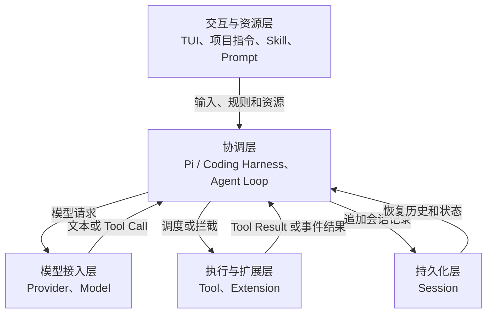
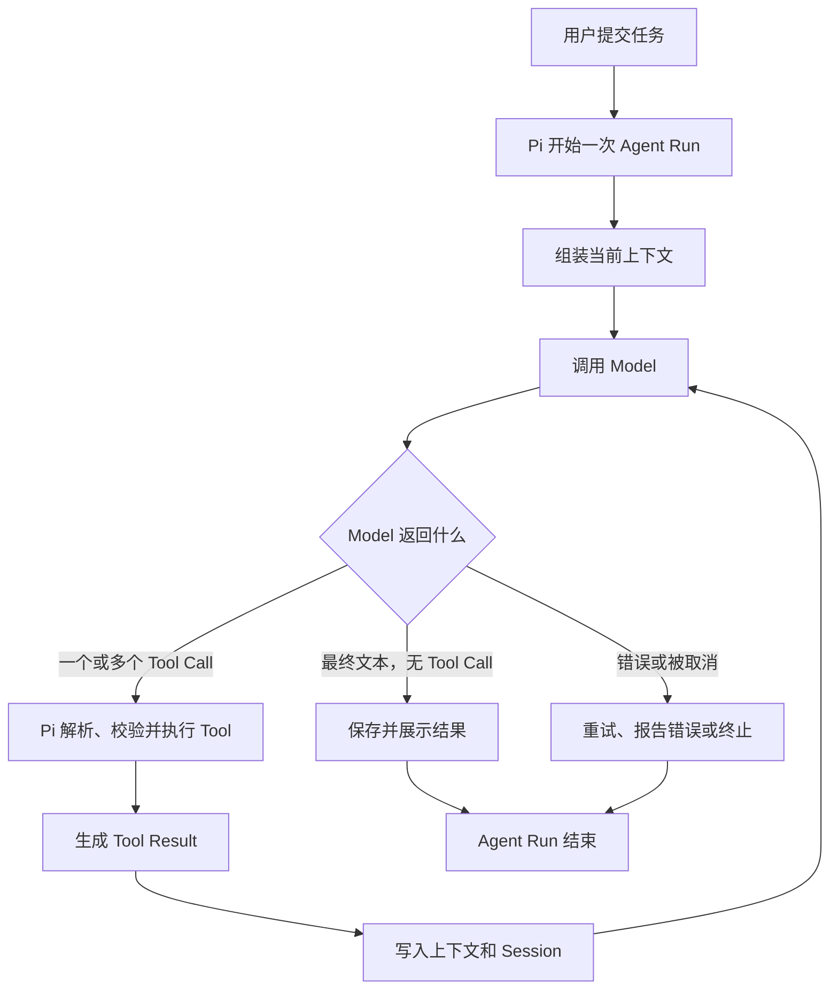
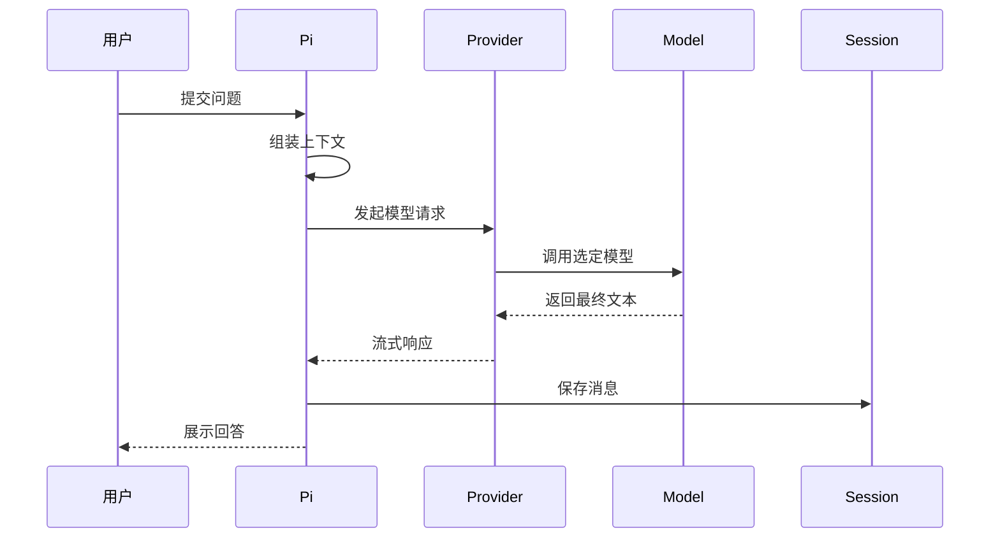
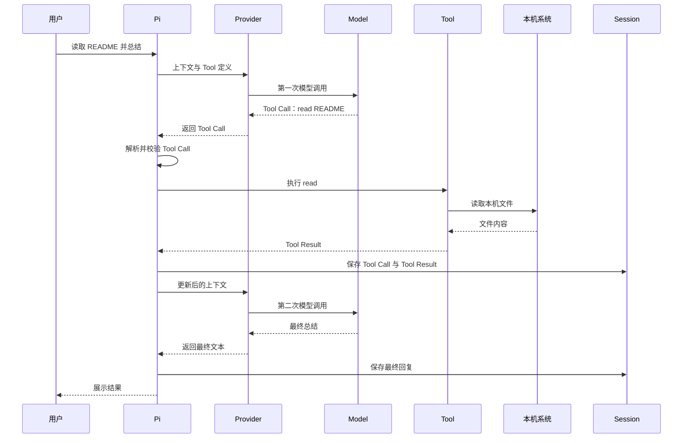
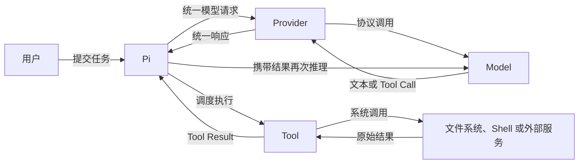
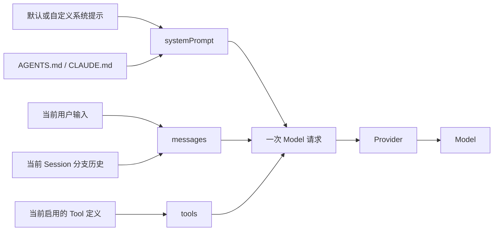
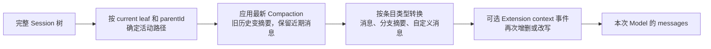

# Pi 架构与 Model 上下文

Pi 是协调者，Model 是推理者，Tool 是执行者，Session 是记录，Extension 用来改变或增加协调能力。终端和内置 Tool 的使用见 [终端与基础工具](02-terminal-and-tools.md)，Extension 的完整能力见 [Extensions](06-extensions.md)。

## Pi 是什么

Pi 是极简的 Coding Agent Harness，不是 Model 的别名。它在本机运行，负责连接 Model、组织对话、调用 Tool、保存 Session，并提供扩展入口。

## 0.2 系统学习路线

| 单元 | 主题 | 验收重点 |
|---|---|---|
| 0.2.1 | 整体分层与职责边界 | 区分 Pi、Model 和 Tool |
| 0.2.2 | 上下文组装 | 说清 Model 一次调用能看到什么 |
| 0.2.3 | Provider 与 Model | 说清连接层与推理层的区别 |
| 0.2.4 | Agent Loop | 画出 Turn、Tool Call 和 Tool Result 循环 |
| 0.2.5 | Tool 系统 | 说明谁决定、谁校验、谁执行、谁承担权限 |
| 0.2.6 | Extension | 标出扩展的注册点和拦截点 |
| 0.2.7 | Session 与上下文 | 区分持久记录、当前上下文、永久记忆和 Git |
| 0.2.8 | 端到端追踪 | 跟踪真实只读请求并独立画图 |

## 0.2.1 整体分层与职责边界

Pi 是运行在本机的协调程序；Model 是 Pi 通过 Provider 调用的推理服务；Tool 是被 Pi 调度的执行能力。

### 五层架构



| 层次 | 核心职责 | 关键限制 |
|---|---|---|
| 交互与资源层 | 接收用户输入，加载任务规则和可复用资源 | 资源影响模型输入，但不会自行执行任务 |
| 协调层 | 组装上下文、调用模型、解析响应、调度工具、控制循环和展示结果 | 默认不承担大模型式语义推理 |
| 模型接入层 | Provider 处理连接与协议；Model 进行推理并生成文本或 Tool Call | Model 只能看到 Pi 传入的上下文 |
| 执行与扩展层 | Tool 执行具体操作；Extension 注册或拦截能力 | 运行权限来自 Pi 进程和当前系统用户 |
| 持久化层 | 保存消息、工具调用、结果、模型信息和会话树 | Session 不是 Git 快照或 Model 永久记忆 |

### 核心对象

| 对象 | 职责 | 不负责什么 |
|---|---|---|
| Coding Harness | 接收输入、组装上下文、连接 Model、调度 Tool、展示结果并保存会话；Pi 就是 Harness | 不等同于 Model 本身 |
| Provider | 把 Pi 的统一请求转换为特定模型服务的 API 调用，并接收流式响应 | 不决定具体任务目标 |
| Model | 根据上下文推理，生成文字或 Tool Call | 不直接读写本机文件或执行 Shell |
| Agent Loop | 在“调用 Model”和“执行 Tool”之间循环，直到 Model 给出最终回复或流程终止 | 不是单独安装的组件 |
| Tool | 执行一次具体操作，并返回 Tool Result | 不自行决定整个任务流程 |
| Extension | 注册或拦截 Tool、命令、事件和 UI，改变 Pi 的行为 | 不是 Model，也不是 Session |
| Session | 持久化消息、Tool Call、Tool Result、Model 信息和会话树 | 不是 Git 快照，也不是 Model 永久记忆 |

### Agent Loop 是运行流程

Agent Loop 不是需要单独安装的组件，也不是另一个大模型。它是 Pi 内部反复执行的控制流程：调用 Model，检查响应，必要时执行 Tool，再把 Tool Result 交给 Model，直到流程结束。



- `Agent Run`：从一次用户任务开始，到最终回复、取消或失败为止的完整运行。
- `Turn`：一次 Model 响应，以及该响应触发的 Tool 执行和 Tool Result。
- 一次不使用 Tool 的 Agent Run 通常只有一个 Turn。
- 一次使用 Tool 的 Agent Run 通常包含多个 Turn，因为 Tool Result 返回后需要再次调用 Model。

### Agent Loop 与 ReAct 的关系

Pi 的工具循环在结构上类似 ReAct：Model 推理并提出 Action，Tool 执行 Action，Tool Result 成为 Observation，Model 再继续推理。但两者不是同一个概念：

| 概念 | 含义 |
|---|---|
| Agent Loop | Pi 的运行控制流程，负责 Model 调用、Tool 调度、结果回传和终止判断 |
| ReAct | 将推理、行动和观察交替组织的一种 Agent 范式 |

Model 通过返回最终文本或 Tool Call 表达下一步。Pi 不替 Model 做任务语义判断，而是识别响应类型并执行确定性调度。Tool Call 仍需经过 Tool 查找、参数校验、已注册的事件 Handler 和实际执行；Extension Handler 可以介入但不是必需。Session 保存会话历史和运行记录，不是 Model 的永久记忆。

### 不需要工具的流程

用户询问当前上下文已经足够回答的问题时，只需要一次 Model 调用。



### 需要工具的流程

当 Model 缺少文件内容或需要执行动作时，会先生成 Tool Call。Tool Result 回到上下文后，Pi 再调用一次 Model。



### 三个边界

| 边界 | 准确含义 | 判断方法 |
|---|---|---|
| Model 与 Tool：推理/执行边界 | Model 只生成文本或 Tool Call；Pi 调度 Tool；Tool 才真正访问文件、Shell 或外部系统 | 看到 Tool Call 时，不能认为操作已经执行；必须继续看到 Tool Result |
| Pi 与 Model：协调/推理边界 | Pi 负责确定性流程控制和状态管理；Model 负责概率性的语义理解与下一步建议 | Pi 可以在没有 Model 时加载配置和 Session，但不能自主完成语义任务 |
| Tool 与操作系统：项目/权限边界 | Tool 在 Pi 进程下运行，继承当前用户权限；工作目录和 Git 仓库只是操作范围约定 | 独立仓库可以隔离版本历史，但不会阻止 Tool 访问仓库外路径 |

### 谁调用谁



默认情况下只有 Pi 调用 Model。Model 是被调用的大模型；内置 Tool 不调用大模型。自定义 Tool 可以主动调用其他模型或服务，但那是 Tool 自己的实现，不是默认架构。

### 常见误解

| 误解 | 正确理解 |
|---|---|
| Pi、Model、Tool 都会调用大模型 | 默认只有 Pi 通过 Provider 调用 Model |
| Model 返回 Tool Call 就表示已经执行 | Tool Call 只是结构化请求，执行后还必须产生 Tool Result |
| Model 可以直接看到整个仓库 | Model 只能看到 Pi 放入上下文的内容和后续 Tool Result |
| Pi 就是大模型客户端外壳 | Pi 还负责资源加载、Agent Loop、工具调度、Session、TUI 和扩展机制 |
| 在独立仓库运行就是沙箱 | 独立仓库隔离 Git 历史，不限制当前用户的系统权限 |

## 0.2.2 Model 上下文如何组装

每次调用 Model 前，Pi 都会重新构造请求。可以先把请求理解成三个盒子：

| 请求盒子 | 装入的主要内容 | 对应学习计划中的来源 |
|---|---|---|
| `systemPrompt` | Pi 的角色、规则、工作目录、项目指令、可用 Skill 摘要等 | 系统提示、项目指令 |
| `messages` | 当前用户输入，以及当前 Session 分支中需要继续携带的用户消息、Model 回复、Tool Call 和 Tool Result | 用户输入、Session 历史 |
| `tools` | 当前启用 Tool 的名称、说明和参数结构 | Tool 定义 |



五类来源并不是五次独立 Model 调用。Pi 先在本机完成组装，再通过 Provider 发出一次 Model 请求。项目指令通常被拼入 `systemPrompt`；用户输入和可用的 Session 历史进入 `messages`；Tool 定义作为独立的 `tools` 数据随请求发送。

关键边界：

- Model 看不到整个项目，只能看到 Pi 放进请求的内容，以及后续 Tool 返回的结果。
- Model 不会自己打开 Session 文件；Pi 从当前会话树的活动分支重建 `messages`。
- Session 文件不等于当前 Model 上下文；分支选择、Compaction 和条目类型都会影响哪些历史真正进入请求。
- Tool 是否安装不等于 Model 当前可见；只有当前启用并随请求发送的 Tool 定义才可供 Model 选择。

### 盒子一：`systemPrompt`

`systemPrompt` 是 Pi 发给 Model 的工作说明书。它主要由以下内容构成：

| 来源 | 作用 |
|---|---|
| Pi 默认系统提示 | 定义 Coding Assistant 身份、基本规则、工具提示和 Pi 文档位置 |
| `SYSTEM.md` 或启动参数 | 替换默认系统提示 |
| `APPEND_SYSTEM.md` 或追加参数 | 在系统提示后补充规则 |
| `AGENTS.md` / `CLAUDE.md` | 作为项目指令拼入系统提示；全局、父目录和当前目录的匹配文件会被收集 |
| Skill 摘要和当前工作目录 | 告诉 Model 可按需读取哪些 Skill，以及当前从哪里工作 |
| Extension | 可在 Agent 启动前注入消息或修改当次系统提示 |

当前启用 Tool 的简短提示可能出现在 `systemPrompt` 中，完整的 Tool 名称、说明和参数结构仍通过独立的 `tools` 盒子发送。

`systemPrompt` 的关键边界：它影响 Model 如何决策，但不是强制执行机制。例如 `AGENTS.md` 写着“禁止删除文件”，Model 应当遵守；但这段文字不会改变文件权限，也不会在技术上阻止 `bash` 删除文件。确定性保护需要 Tool 门禁、系统权限或隔离环境。

| 保护层 | 作用 | 边界 |
|---|---|---|
| `systemPrompt` / `AGENTS.md` | 引导 Model 不提出危险操作 | 概率性约束，不能保证执行被阻止 |
| Extension 门禁 | 在已覆盖的 Tool 或 Shell 入口允许、确认或阻止 | 应用层确定性检查；遗漏入口或未加载时不生效 |
| Tool 白名单 | 让危险 Tool 不进入当前可用集合 | 缩小 Pi 的执行面，但不改变其他进程权限 |
| 操作系统权限或沙箱 | 从底层限制文件、进程和网络访问 | 最接近强安全边界 |

### 盒子二：`messages`

`messages` 是 Pi 为当次 Model 调用准备的有效对话记录，不等于整个 Session 文件。它通常包括当前用户输入、当前分支上保留的历史用户消息、Model 回复、Tool Call、Tool Result，以及必要的 Compaction 或分支摘要。

内置 `read` 只负责返回文件内容，不负责通用推理。Pi 把文件内容作为 Tool Result 加入 `messages`，再调用 Model 生成总结：

```text
用户任务 -> Model 的 Tool Call -> read 的 Tool Result -> Model 的最终回答
```

| 对象 | 在这条链路中的职责 |
|---|---|
| `read` Tool | 读取并返回文件原文 |
| Pi | 把 Tool Call 和 Tool Result 保存并放入后续 `messages` |
| Model | 根据用户任务和文件原文进行推理，生成总结 |

自定义 Tool 可以在自身实现中额外调用 Model，但这不是内置 `read` 的默认职责。

Session 保存整棵对话树；`messages` 只取当前活动路径。假设 A、B 从同一个节点分叉，当前位于 B，当次请求通常包含公共祖先和 B 路径，不会自动包含 A 路径。

| 对象 | 保存或发送的范围 |
|---|---|
| Session 文件 | 公共历史、A、B 以及其他持久化条目 |
| 当次 `messages` | 公共历史、当前活动路径，以及必要的 Compaction 或分支摘要 |

需要在 B 使用 A 的信息时，按内容类型处理：

- 对话结论：通过 `/tree` 从 A 切换到 B 时选择生成分支摘要；Pi 会把离开的 A 路径压缩为 `BranchSummaryEntry`，作为 B 后续上下文的一部分。摘要有损，关键数值、约束或原文应显式复制到 B，或让 Tool 重新读取权威文件。
- 代码和文件：Session 分支不是 Git 分支，切换 `/tree` 不会恢复或合并工作区文件。需要隔离两套实现时，应使用 Git 分支或 worktree，再通过 merge、cherry-pick 或人工整合代码。

如果当前已经位于 B：先用 `/tree` 临时切到 A，并跳过对 B 的摘要；再从 A 切回 B，这次选择总结 A，并用自定义要求限定只保留相关结论、文件和风险。少量必须逐字保留的内容，可以在 `/tree` 中选中 A 的消息后复制到 B。

因此，跨分支协作的原则是“传递必要结论或重新读取事实”，而不是把两个分支的完整历史全部塞进 `messages`。

### “有效上下文”不等于“语义上最相关”

这里的“有效”是指按 Pi 的结构规则允许进入本次请求，不表示 Pi 已经判断每条内容都与当前任务相关。默认流程没有使用向量检索或重要性评分逐条挑选历史。



| 环节 | 判断方式 | 是否可能出错 |
|---|---|---|
| 活动路径选择 | 根据当前叶子和 `parentId` 回溯 | 规则本身确定；用户站在错误分支时，得到的路径会不符合意图 |
| 新旧历史取舍 | 按 Token 阈值和 `keepRecentTokens` 保留近期内容 | 范围按规则切分，不理解业务重要性 |
| Compaction / 分支摘要 | 调用 Model 把旧内容压缩成摘要 | 有损且具有概率性，可能遗漏约束或总结错误 |
| 条目类型转换 | 普通消息、Tool Result 和摘要进入上下文；纯状态条目不进入；`!!` Shell 输出在模型转换时排除 | 默认规则稳定；Extension 可以在 `context` 事件中改变结果 |
| Model 使用上下文 | Model 对收到的内容进行推理 | 即使上下文正确，也可能忽略或误解信息 |

Pi 能自动规避的是结构和容量问题：隔离兄弟分支、保留近期消息、不拆散 Tool Call 与 Tool Result，并在接近上下文上限时自动 Compaction。它不能自动证明摘要完整、当前分支符合用户意图，或某条旧约束仍然有效。

| 场景 | 处理方式 |
|---|---|
| 关键规则长期有效 | 写入 `AGENTS.md` 或权威项目文档；执行前要求重新读取 |
| 长会话即将压缩 | 手动 `/compact` 并明确要求保留目标、约束、决策、文件状态、验证结果和下一步 |
| 切换分支 | 使用带自定义要求的分支摘要；关键原文显式复制 |
| Model 忘记或答偏 | 立即停止后续修改，在新消息中重申约束并要求读取文件、测试和 Git diff |
| Compaction 摘要错误 | 原始条目仍在 Session 文件中；用 `/tree` 回到压缩前的位置，找回关键信息后重新建立分支或摘要 |
| 需要固定的自动策略 | 后续可用 Extension 的 `context` 事件，在每次 Model 调用前确定性地过滤或注入消息 |

自动 Compaction 和溢出重试只能解决“上下文装不下”，不能自动解决“上下文含义错了”。对关键事实，权威文件、测试结果和用户当前明确重申的约束，应优先于旧对话摘要。
