# Pi 架构与 Model 上下文

Pi 是协调者，Model 是推理者，Tool 是执行者，Session 是记录，Extension 用来改变或增加协调能力。本文的 0.2 实验与源码证据基于 Pi `0.82.1`；当前 CLI 版本见 [完整学习计划](../plans/pi-complete-learning-plan.md)。终端和内置 Tool 的使用见 [终端与基础工具](02-terminal-and-tools.md)，Extension 的完整能力见 [Extensions](06-extensions.md)。

## Pi 是什么

Pi 是极简的 Coding Agent Harness，不是 Model 的别名。它在本机运行，负责连接 Model、组织对话、调用 Tool、保存 Session，并提供扩展入口。

## 0.2 系统学习路线

| 单元 | 主题 | 验收重点 |
|---|---|---|
| 0.2.1 | 整体分层与职责边界 | 区分 Pi、Model 和 Tool |
| 0.2.2 | 上下文组装 | 说清 Model 一次调用能看到什么 |
| 0.2.3 | Provider 与 Model | 说清连接层与推理层的区别 |
| 0.2.4 | Agent Loop | 画出 Turn、Tool Call 和 Tool Result 循环 |
| 0.2.5 | Tool 系统 | 说明谁决定、谁校验、谁执行、谁承担权限 |
| 0.2.6 | Extension | 标出扩展的注册点和拦截点 |
| 0.2.7 | Session 与上下文 | 区分持久记录、当前上下文、永久记忆和 Git |
| 0.2.8 | 端到端追踪 | 跟踪真实只读请求并独立画图 |

## 0.2.1 整体分层与职责边界

Pi 是运行在本机的协调程序；Model 是 Pi 通过 Provider 调用的推理服务；Tool 是被 Pi 调度的执行能力。

### 五层架构

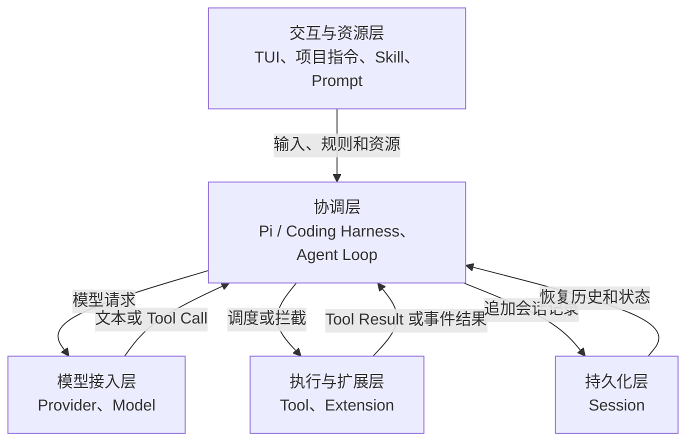

| 层次 | 核心职责 | 关键限制 |
|---|---|---|
| 交互与资源层 | 接收用户输入，加载任务规则和可复用资源 | 资源影响模型输入，但不会自行执行任务 |
| 协调层 | 组装上下文、调用模型、解析响应、调度工具、控制循环和展示结果 | 默认不承担大模型式语义推理 |
| 模型接入层 | Provider 处理连接与协议；Model 进行推理并生成文本或 Tool Call | Model 只能看到 Pi 传入的上下文 |
| 执行与扩展层 | Tool 执行具体操作；Extension 注册或拦截能力 | 运行权限来自 Pi 进程和当前系统用户 |
| 持久化层 | 保存消息、工具调用、结果、模型信息和会话树 | Session 不是 Git 快照或 Model 永久记忆 |

### 核心对象

| 对象 | 职责 | 不负责什么 |
|---|---|---|
| Coding Harness | 接收输入、组装上下文、连接 Model、调度 Tool、展示结果并保存会话；Pi 就是 Harness | 不等同于 Model 本身 |
| Provider | 把 Pi 的统一请求转换为特定模型服务的 API 调用，并接收流式响应 | 不决定具体任务目标 |
| Model | 根据上下文推理，生成文字或 Tool Call | 不直接读写本机文件或执行 Shell |
| Agent Loop | 在“调用 Model”和“执行 Tool”之间循环，直到 Model 给出最终回复或流程终止 | 不是单独安装的组件 |
| Tool | 执行一次具体操作，并返回 Tool Result | 不自行决定整个任务流程 |
| Extension | 注册或拦截 Tool、命令、事件和 UI，改变 Pi 的行为 | 不是 Model，也不是 Session |
| Session | 持久化消息、Tool Call、Tool Result、Model 信息和会话树 | 不是 Git 快照，也不是 Model 永久记忆 |

### Agent Loop 架构概览

Agent Loop 不是需要单独安装的组件，也不是另一个大模型。它是 Pi 内部反复执行的控制流程：调用 Model，检查响应，必要时执行 Tool，再把 Tool Result 交给 Model，直到流程结束。

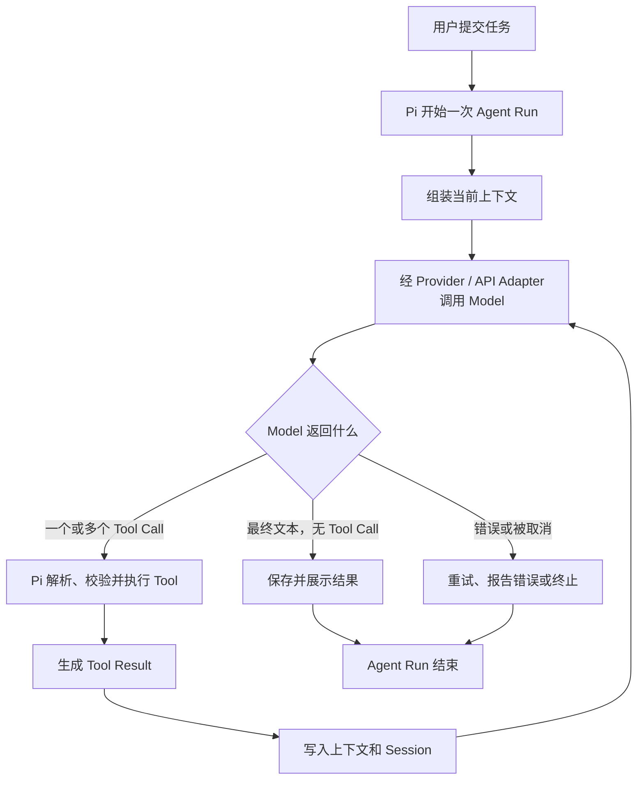

- `Agent Run`：一次底层 Agent Loop，从 `agent_start` 到 `agent_end`。没有自动重试或后续消息时，它通常对应用户提交的一次任务。
- `Turn`：一次 Model 响应，以及该响应触发的 Tool 执行和 Tool Result。
- `Agent Settled`：当前 Run 已结束，而且 Pi 也没有自动重试、自动压缩重试或排队中的后续消息，整个处理过程真正空闲。
- 一次不使用 Tool 的 Agent Run 通常只有一个 Turn。
- 一次使用 Tool 的 Agent Run 通常包含多个 Turn，因为 Tool Result 返回后需要再次调用 Model。

#### 为什么一个 Turn 可以包含多个 Tool Call

一次 Model 响应可以同时列出多个工具请求。例如用户要求“比较 `README.md` 和 `package.json`”，Model 已经知道需要读取两个互不依赖的文件，因此可以在同一次响应中提出两个 `read` Tool Call。Model 只是一次性提出这两个请求，并没有亲自读取文件；Pi 负责查找、校验和执行对应 Tool。

```text
Turn 1：Model 响应
  ├─ Tool Call 1：read README.md
  └─ Tool Call 2：read package.json
       ↓
     Pi 执行并收集两个 Tool Result
       ↓
Turn 2：Model 根据两个结果进行比较并给出最终回答
```

这样做可以减少 Model 往返次数。0.2 验收所用 Pi `0.82.1` 默认先逐个完成 Tool Call 的执行前检查，再并行执行能够执行的同批工具；所有结果仍属于产生它们的同一个 Turn。若后一个动作必须依赖前一个结果，例如“先读取配置，再根据内容决定编辑参数”，通常应等结果返回后在下一个 Turn 再决定，而不是强行放进同一批。

这里的 `Turn` 使用 Agent Loop 事件定义，即“一次 Model 响应及其产生的 Tool Call 和 Tool Result”。Pi 的 Compaction 文档还会把“从一条用户消息开始，到下一条用户消息之前的全部内容”称为 turn；那是会话整理语境下的用法，学习时需要根据场景区分。

#### Agent Loop 何时结束

Model 不会额外返回“这是最终答案”的语义标记。API 协议适配器会把响应整理成结构化 Assistant Message，其中 `content` 可以同时包含文本和 Tool Call，`stopReason` 则说明这次生成为什么停止。Pi 根据这些结构字段推进状态机，不会阅读文本含义来证明任务已经完成。

| Model 响应 | Pi 的处理 | 是否证明任务成功 |
|---|---|---|
| 文本、无 Tool Call，`stopReason=stop` | 当前没有工具驱动的下一 Turn；无排队消息等继续条件时结束 Run | 否，只代表正常生成结束 |
| 文本 + Tool Call | 先执行 Tool；前面的文本不是最终回答 | 否 |
| 只有 Tool Call | 执行 Tool，把 Tool Result 加入上下文后再次请求 Model | 否 |
| `stopReason=error` | 当前 Run 因错误结束，外层可能重试 | 否 |
| `stopReason=aborted` | 当前 Run 因取消结束 | 否 |
| `stopReason=length`，无 Tool Call | 当前 Run 可能结束，但文本可能被输出上限截断 | 否 |
| `stopReason=length`，包含 Tool Call | 不执行参数可能被截断的 Tool Call；生成错误 Tool Result，让 Model 重新请求 | 否 |

“没有 Tool Call”只是 Pi 判断是否还需进行工具驱动 Turn 的关键条件，不是完整终止条件。Pi 还会处理 Tool Result 的 `terminate` 提示、`shouldStopAfterTurn` 回调、Steering 消息和 Follow-up 消息；Run 结束后，外层还可能进行自动重试或 Compaction 重试。

因此，“最终文本”更准确地表示“当前 Run 最后一条正常 Assistant 文本”，不表示内容一定正确、完整或满足业务验收。`agent_end` 只说明当前底层 Run 结束；`agent_settled` 才表示自动重试、Compaction 重试和排队消息都处理完毕。

### Agent Loop 与 ReAct 的关系

Pi 的工具循环在结构上类似 ReAct：Model 推理并提出 Action，Tool 执行 Action，Tool Result 成为 Observation，Model 再继续推理。但两者不是同一个概念：

| 概念 | 含义 |
|---|---|
| Agent Loop | Pi 的运行控制流程，负责 Model 调用、Tool 调度、结果回传和终止判断 |
| ReAct | 将推理、行动和观察交替组织的一种 Agent 范式 |

Model 通过返回文本内容块或 Tool Call 表达下一步。Pi 不替 Model 做任务语义判断，而是识别响应结构并执行确定性调度。Tool Call 仍需经过 Tool 查找、参数校验、已注册的事件 Handler 和实际执行；Extension Handler 可以介入但不是必需。Session 保存会话历史和运行记录，不是 Model 的永久记忆。

### 不需要工具的流程

用户询问当前上下文已经足够回答的问题时，只需要一次 Model 调用。

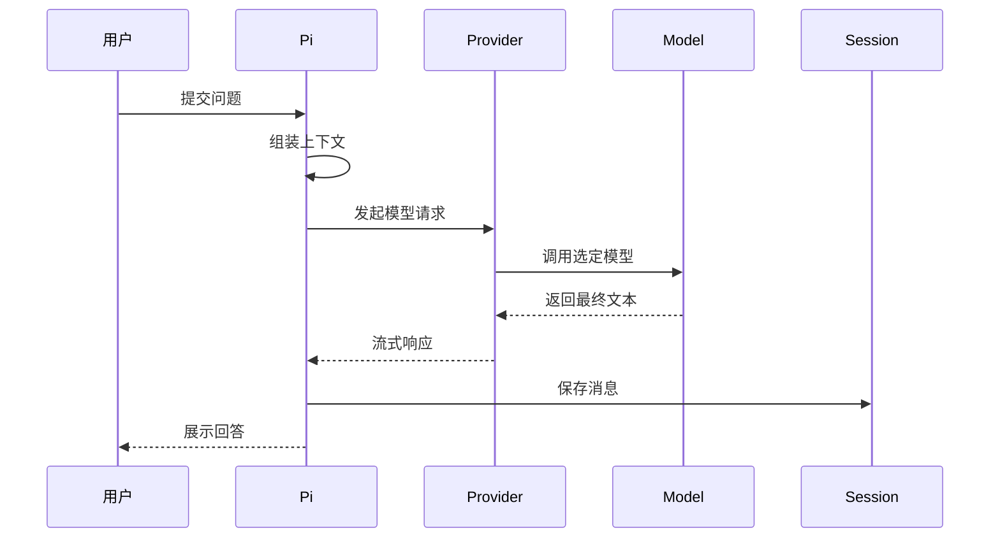

### 需要工具的流程

当 Model 缺少文件内容或需要执行动作时，会先生成 Tool Call。Tool Result 回到上下文后，Pi 再调用一次 Model。

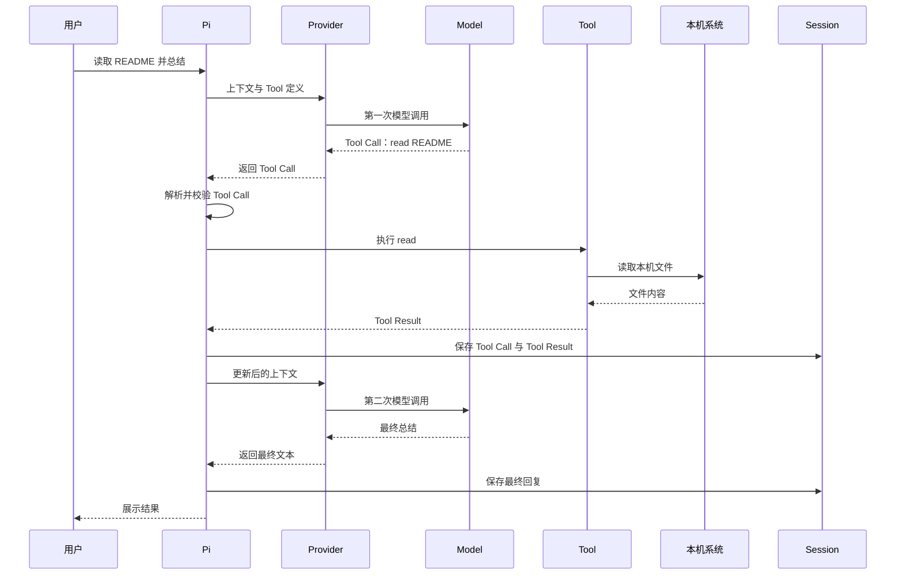

### 三个边界

| 边界 | 准确含义 | 判断方法 |
|---|---|---|
| Model 与 Tool：推理/执行边界 | Model 只生成文本或 Tool Call；Pi 调度 Tool；Tool 才真正访问文件、Shell 或外部系统 | 看到 Tool Call 时，不能认为操作已经执行；必须继续看到 Tool Result |
| Pi 与 Model：协调/推理边界 | Pi 负责确定性流程控制和状态管理；Model 负责概率性的语义理解与下一步建议 | Pi 可以在没有 Model 时加载配置和 Session，但不能自主完成语义任务 |
| Tool 与操作系统：项目/权限边界 | Tool 在 Pi 进程下运行，继承当前用户权限；工作目录和 Git 仓库只是操作范围约定 | 独立仓库可以隔离版本历史，但不会阻止 Tool 访问仓库外路径 |

### 谁调用谁

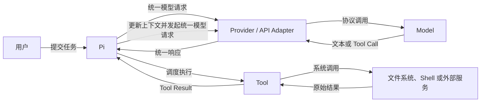

默认情况下只有 Pi 调用 Model。Model 是被调用的大模型；内置 Tool 不调用大模型。自定义 Tool 可以主动调用其他模型或服务，但那是 Tool 自己的实现，不是默认架构。

### 常见误解

| 误解 | 正确理解 |
|---|---|
| Pi、Model、Tool 都会调用大模型 | 默认只有 Pi 通过 Provider 调用 Model |
| Model 返回 Tool Call 就表示已经执行 | Tool Call 只是结构化请求，执行后还必须产生 Tool Result |
| Model 可以直接看到整个仓库 | Model 只能看到 Pi 放入上下文的内容和后续 Tool Result |
| Pi 就是大模型客户端外壳 | Pi 还负责资源加载、Agent Loop、工具调度、Session、TUI 和扩展机制 |
| 在独立仓库运行就是沙箱 | 独立仓库隔离 Git 历史，不限制当前用户的系统权限 |

## 0.2.2 Model 上下文如何组装

每次调用 Model 前，Pi 都会重新构造请求。可以先把请求理解成三个盒子：

| 请求盒子 | 装入的主要内容 | 对应学习计划中的来源 |
|---|---|---|
| `systemPrompt` | Pi 的角色、规则、工作目录、项目指令、可用 Skill 摘要等 | 系统提示、项目指令 |
| `messages` | 当前用户输入，以及当前 Session 分支中需要继续携带的用户消息、Model 回复、Tool Call 和 Tool Result | 用户输入、Session 历史 |
| `tools` | 当前启用 Tool 的名称、说明和参数结构 | Tool 定义 |

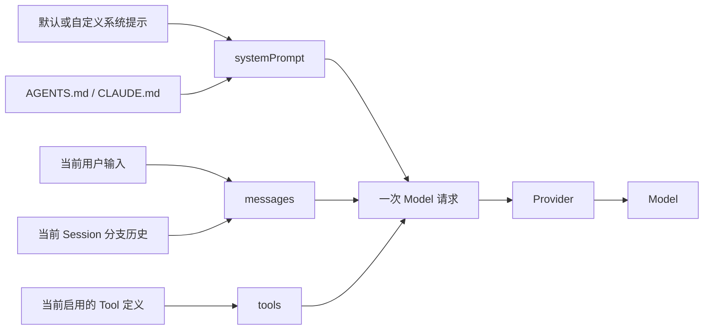

五类来源并不是五次独立 Model 调用。Pi 先在本机完成组装，再通过 Provider 发出一次 Model 请求。项目指令通常被拼入 `systemPrompt`；用户输入和可用的 Session 历史进入 `messages`；Tool 定义作为独立的 `tools` 数据随请求发送。

关键边界：

- Model 看不到整个项目，只能看到 Pi 放进请求的内容，以及后续 Tool 返回的结果。
- Model 不会自己打开 Session 文件；Pi 从当前会话树的活动分支重建 `messages`。
- Session 文件不等于当前 Model 上下文；分支选择、Compaction 和条目类型都会影响哪些历史真正进入请求。
- Tool 是否安装不等于 Model 当前可见；只有当前启用并随请求发送的 Tool 定义才可供 Model 选择。

### 盒子一：`systemPrompt`

`systemPrompt` 是 Pi 发给 Model 的工作说明书。它主要由以下内容构成：

| 来源 | 作用 |
|---|---|
| Pi 默认系统提示 | 定义 Coding Assistant 身份、基本规则、工具提示和 Pi 文档位置 |
| `SYSTEM.md` 或启动参数 | 替换默认系统提示 |
| `APPEND_SYSTEM.md` 或追加参数 | 在系统提示后补充规则 |
| `AGENTS.md` / `CLAUDE.md` | 作为项目指令拼入系统提示；全局、父目录和当前目录的匹配文件会被收集 |
| Skill 摘要和当前工作目录 | 告诉 Model 可按需读取哪些 Skill，以及当前从哪里工作 |
| Extension | 可在 Agent 启动前注入消息或修改当次系统提示 |

当前启用 Tool 的简短提示可能出现在 `systemPrompt` 中，完整的 Tool 名称、说明和参数结构仍通过独立的 `tools` 盒子发送。

`systemPrompt` 的关键边界：它影响 Model 如何决策，但不是强制执行机制。例如 `AGENTS.md` 写着“禁止删除文件”，Model 应当遵守；但这段文字不会改变文件权限，也不会在技术上阻止 `bash` 删除文件。确定性保护需要 Tool 门禁、系统权限或隔离环境。

| 保护层 | 作用 | 边界 |
|---|---|---|
| `systemPrompt` / `AGENTS.md` | 引导 Model 不提出危险操作 | 概率性约束，不能保证执行被阻止 |
| Extension 门禁 | 在已覆盖的 Tool 或 Shell 入口允许、确认或阻止 | 应用层确定性检查；遗漏入口或未加载时不生效 |
| Tool 白名单 | 让危险 Tool 不进入当前可用集合 | 缩小 Pi 的执行面，但不改变其他进程权限 |
| 操作系统权限或沙箱 | 从底层限制文件、进程和网络访问 | 最接近强安全边界 |

### 盒子二：`messages`

`messages` 是 Pi 为当次 Model 调用准备的有效对话记录，不等于整个 Session 文件。它通常包括当前用户输入、当前分支上保留的历史用户消息、Model 回复、Tool Call、Tool Result，以及必要的 Compaction 或分支摘要。

内置 `read` 只负责返回文件内容，不负责通用推理。Pi 把文件内容作为 Tool Result 加入 `messages`，再调用 Model 生成总结：

```text
用户任务 -> Model 的 Tool Call -> read 的 Tool Result -> Model 的最终回答
```

| 对象 | 在这条链路中的职责 |
|---|---|
| `read` Tool | 读取并返回文件原文 |
| Pi | 把 Tool Call 和 Tool Result 保存并放入后续 `messages` |
| Model | 根据用户任务和文件原文进行推理，生成总结 |

自定义 Tool 可以在自身实现中额外调用 Model，但这不是内置 `read` 的默认职责。

Session 保存完整会话树，`messages` 只取当前活动路径。兄弟路线不会自动同时进入一次 Model 请求；离开路线的结论只能通过有损的 Branch Summary、显式复制或重新读取权威文件进入新路线。Session 路线也不会恢复或合并工作区文件。Tree、Compaction、Branch Summary 的操作和证据统一见 [Session、Tree 与 Compaction](04-session-tree-compaction.md)。

### “有效上下文”不等于“语义上最相关”

这里的“有效”是指按 Pi 的结构规则允许进入本次请求，不表示 Pi 已经判断每条内容都与当前任务相关。默认流程没有使用向量检索或重要性评分逐条挑选历史。

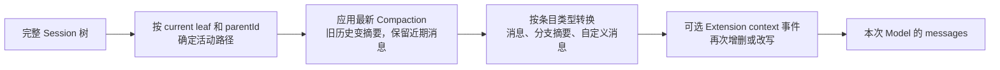

| 环节 | 判断方式 | 是否可能出错 |
|---|---|---|
| 活动路径选择 | 根据当前叶子和 `parentId` 回溯 | 规则本身确定；用户站在错误分支时，得到的路径会不符合意图 |
| 新旧历史取舍 | 按 Token 阈值和 `keepRecentTokens` 保留近期内容 | 范围按规则切分，不理解业务重要性 |
| Compaction / 分支摘要 | 调用 Model 把旧内容压缩成摘要 | 有损且具有概率性，可能遗漏约束或总结错误 |
| 条目类型转换 | 普通消息、Tool Result 和摘要进入上下文；纯状态条目不进入；`!!` Shell 输出在模型转换时排除 | 默认规则稳定；Extension 可以在 `context` 事件中改变结果 |
| Model 使用上下文 | Model 对收到的内容进行推理 | 即使上下文正确，也可能忽略或误解信息 |

Pi 能自动规避的是结构和容量问题：隔离兄弟分支、保留近期消息、不拆散 Tool Call 与 Tool Result，并在接近上下文上限时自动 Compaction。它不能自动证明摘要完整、当前分支符合用户意图，或某条旧约束仍然有效。

| 场景 | 处理方式 |
|---|---|
| 关键规则长期有效 | 写入 `AGENTS.md` 或权威项目文档；执行前要求重新读取 |
| 长会话即将压缩 | 手动 `/compact` 并明确要求保留目标、约束、决策、文件状态、验证结果和下一步 |
| 切换分支 | 使用带自定义要求的分支摘要；关键原文显式复制 |
| Model 忘记或答偏 | 立即停止后续修改，在新消息中重申约束并要求读取文件、测试和 Git diff |
| Compaction 摘要错误 | 原始条目仍在 Session 文件中；用 `/tree` 回到压缩前的位置，找回关键信息后重新建立分支或摘要 |
| 需要固定的自动策略 | 后续可用 Extension 的 `context` 事件，在每次 Model 调用前确定性地过滤或注入消息 |

自动 Compaction 和溢出重试只能解决“上下文装不下”，不能自动解决“上下文含义错了”。对关键事实，权威文件、测试结果和用户当前明确重申的约束，应优先于旧对话摘要。

### 盒子三：`tools`

`tools` 可以先理解为 Pi 发给 Model 的“可调用能力菜单”。它告诉 Model 当前有哪些 Tool、每个 Tool 用来做什么，以及调用参数应采用什么结构。

一个 Tool 有两个不同的观察面：

| 观察者 | 能看到什么 | 看不到什么 |
|---|---|---|
| Model | Tool 的 `name`、`description` 和 `parameters` 参数结构；Provider 可补充协议字段 | 本机执行函数、文件内容、系统权限和真实执行结果 |
| Pi | 完整 Tool 对象，包括 Model 可见的契约和本地 `execute` 执行器 | Model 尚未产生的任务决策 |

因此，Pi 内存中的 Tool 不只是 Schema；但通过 Provider 发给 Model 的 `tools` 字段只包含可调用契约。0.2 验收所用 Pi `0.82.1` 的 OpenAI Responses 适配层会将普通 Tool 转换成 `type: function`，并补充 `strict` 等协议字段。以 `read` 为例，Model 能知道它需要 `path` 等参数，却不能直接看到 `read` 的本地实现或目标文件内容。

用 Java Web 类比：

| Pi 概念 | 接近的 Java/Spring 概念 |
|---|---|
| Model 可见的 Tool 定义 | OpenAPI 接口说明和请求 DTO Schema |
| Tool Call | 一次尚未执行的结构化请求 |
| Tool 注册表 | Handler Mapping 或服务路由表 |
| 参数校验 | Bean Validation 和反序列化校验 |
| `tool_call` Extension Handler | Interceptor 或 AOP 前置检查 |
| Tool Executor | 真正执行操作的 Service 方法 |
| Tool Result | 执行结果 DTO，随后进入 `messages` |

#### 从 Tool 定义到 Tool Result

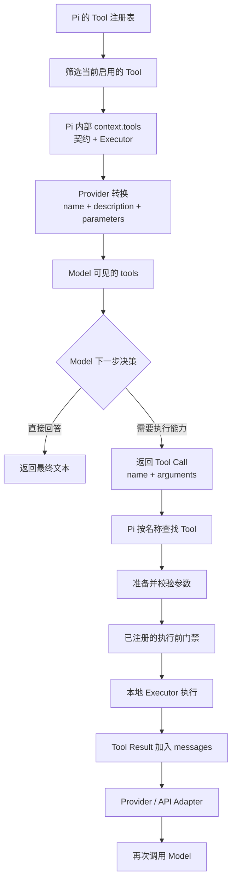

这条链路必须逐步成立：

1. Tool 已经存在并注册。
2. Tool 被选入本次启用列表。
3. Tool 契约随请求发给 Model。
4. Model 决定返回对应名称和参数的 Tool Call。
5. Pi 找到同名 Tool，准备并校验参数。
6. 已注册的 Extension Handler 可以允许、修改或阻止。
7. 只有通过前述步骤后，Executor 才实际运行。
8. Tool Result 进入 `messages`，Model 才能根据结果继续推理。

#### 七个容易混淆的状态

| 状态 | 准确含义 |
|---|---|
| 已安装 | Tool 代码存在于本机某个包或文件中 |
| 已注册 | Pi 的 Tool 注册表已经知道它的名称和执行器 |
| 已启用 | Tool 被放入当前 Agent 的可用 Tool 集合 |
| Model 可见 | Tool 契约随当前请求发送给 Model |
| 已请求 | Model 已返回对应的 Tool Call |
| 已允许 | 参数校验和已注册门禁通过 |
| 已执行 | 本地 Executor 已经真实运行并产生 Tool Result |

前一个状态不自动保证后一个状态。例如“已安装”不等于“Model 可见”，“Model 可见”不等于“Model 一定调用”，“Tool Call 已产生”也不等于“操作已经执行”。

#### Pi 0.82.1 Tool 架构证据与安全边界

本节基于 Pi `0.82.1` 证据，只保留架构边界：Tool Schema 校验参数结构，不判断操作是否安全；Tool 已注册、已暴露、已请求、已允许和已执行是不同状态。Pi `0.82.1` 的内置 Tool 默认/可选范围、启用选项与 Schema 类型转换实验见 [终端与基础工具](02-terminal-and-tools.md)中的对应历史小节；Pi `0.83.0` 的终端与 Tool 行为实验也由该文档汇总。Tool/Shell 门禁见 [Extensions](06-extensions.md)。禁用 Tool 只缩小 Model 通过 Agent Loop 发起操作的能力面，不降低 Pi 进程或当前系统用户的权限。

## 0.2.3 Provider、Model、认证与 API 协议

四者分别回答四个不同问题：

| 概念 | 回答的问题 | 0.2 实验环境中的例子 |
|---|---|---|
| Provider | Pi 通过哪一个服务入口和配置集合发送请求 | `openai` |
| Model | 具体让哪个推理模型处理请求 | `gpt-5.6-sol` |
| 认证 | Pi 凭什么获得服务端访问权限 | API Key |
| API 协议 | 请求、流式事件和响应按照什么格式传输 | `openai-responses` |

Provider 配置通常还包含 `baseUrl`、请求头、默认 API 类型和它所提供的模型目录。Model 则有自己的 `id`、上下文窗口、最大输出、输入类型和推理能力等信息。二者相关但不是同一对象：选择 Provider 不等于已经选择具体 Model。

Provider 也不等于 API 格式。`openai` Provider 表示 Pi 使用名为 `openai` 的服务接入单元，负责关联服务配置、认证和模型目录；“按照 OpenAI Responses 的请求格式通信”则是 `openai-responses` 协议适配器的职责。同一个 Provider 可以为不同 Model 指定不同 API 协议，兼容同一协议的其他 Provider 也可以复用这种通信格式。

### 把 Provider 和 API 协议彻底拆开

最简单的点餐类比：

| Pi 概念 | 大白话角色 |
|---|---|
| Pi | 点餐的人，整理好需求并处理结果 |
| Provider `openai` | 要去的饭店，关联饭店地址、账号和菜单 |
| API Key | 进入饭店下单时使用的会员卡或通行证 |
| API 协议 `openai-responses` | 饭店规定的点菜单格式，决定订单怎么写、回单怎么看 |
| Model `gpt-5.6-sol` | 真正做菜的厨师，也就是真正进行推理的对象 |

Pi 的一次请求可以理解为：先确定要找 `gpt-5.6-sol` 这位厨师，再找到它所在的 `openai` 饭店和下单凭据，然后按照 `openai-responses` 点菜单填写需求；饭店把订单交给厨师，厨师完成推理，回单再按照同一种格式返回并由 Pi 读懂。

两个名字都带 `openai`，只是因为“饭店”和“这家饭店制定的点菜单”名称相关。`openai` 表示服务接入，`openai-responses` 表示通信格式，不能把点菜单当成饭店本身。

先不看名字中的 `openai`，只看两者的输入和输出：

| 对象 | 接收什么 | 主要产出什么 |
|---|---|---|
| Provider | `model.provider`，例如 `openai` | 对应的服务接入单元、模型目录、服务配置和认证解析能力 |
| API 协议适配器 | `model.api`，例如 `openai-responses` | 特定格式的 HTTP 请求，以及从流式响应转换出的 Pi 统一事件 |

Provider 可以理解为 Pi 内部注册的一套“连接和路由容器”。它让 Pi 知道当前 Model 属于哪套服务接入、应关联哪份认证和服务配置，以及后续由哪类 API 实现发送请求。Provider 本身不是负责推理的 Model，也不是 JSON 报文格式。

API 协议适配器是一名“双向翻译员”：发送前，把 Pi 统一的 `systemPrompt`、`messages`、`tools` 和 Model 信息翻译成目标 API 接受的字段；返回时，把该 API 的文本增量、Tool Call、用量和错误事件翻译成 Pi 能继续处理的统一事件。它不选择账号，也不进行推理。

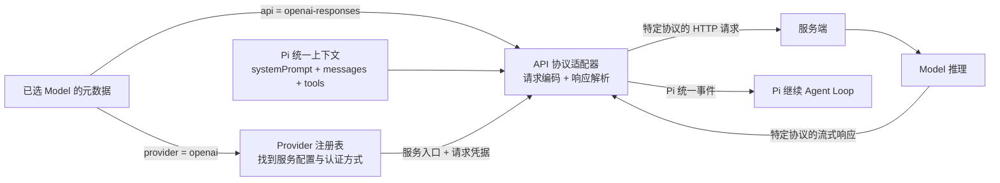

用 Java 类比：Provider 接近“一套已经注册的客户端配置与路由信息”，包含服务地址、凭据来源和可用模型；API 协议适配器接近“接口契约、请求 DTO 序列化和 SSE 响应解析器”。这个类比只用于区分职责，不表示 Pi 内部类与 Spring 组件一一对应。

判断修改哪一层时，可以看变化发生在哪里：

| 变化 | 主要影响 |
|---|---|
| 服务入口或 API Key 改变，但仍使用 Responses 格式 | Provider 配置或认证改变；API 协议不变 |
| 从 Responses 格式切换为 Chat Completions 格式 | API 协议改变；Provider 不一定改变 |
| 从 `gpt-5.6-sol` 切换到同一 Provider 下另一个模型 | Model 改变；Provider 和 API 协议可能都不变 |

认证只负责证明访问资格。API Key 正确，不代表 Model 名称存在、账号有该 Model 权限、请求参数正确或服务端一定成功。

### 认证通过不等于请求成功

| 场景 | 通过了什么 | 失败在哪里 |
|---|---|---|
| API Key 缺失或无效 | 无 | 认证阶段失败，不能继续访问服务 |
| API Key 有效，但 Model ID 不存在 | 认证 | Model 查找或路由失败 |
| API Key 有效，但账号无权使用该 Model | 认证 | 授权阶段失败 |
| API Key 和 Model 权限正确，但请求格式错误 | 认证与授权 | API 请求校验失败 |
| 前述条件全部正确 | 认证、授权和请求校验 | 仍可能遇到限流、服务故障或推理运行错误 |

这类似 Java Web 系统：登录凭据有效只说明 Authentication 通过；是否能访问某个资源还要经过 Authorization，请求 DTO 和业务执行也各有自己的失败路径。

也可以用办公楼门禁类比：API Key 有效表示门禁卡是真的，属于认证通过；Model ID 不存在表示填写的房间号根本不存在，属于资源查找失败；Model 存在但账号不能使用，才属于授权失败。三种错误不能互相代替。

API 协议是通信规则。它规定 Pi 如何把 `systemPrompt`、`messages`、`tools` 等内部数据转换成服务端接受的请求，以及如何把流式响应转换回 Pi 能理解的统一事件。协议本身不负责推理。

### 这条流程适用于什么场景

下面的流程描述的是 **Agent Loop 中一次 Model API 调用**。它的起点是“当前 Model 已经选定，而且 Pi 已经组装好 `systemPrompt`、`messages`、`tools`”；终点是“Pi 收到并理解这一轮 Model 输出”。

它会在以下场景中发生：

- 用户发送新消息后，Pi 第一次请求 Model。
- Tool 执行完成、Tool Result 加入 `messages` 后，Pi 再次请求 Model。
- Pi 因重试、继续生成等原因再次发起 Model 请求。

它不表示 Pi 从启动到退出的完整生命周期，也不包含 Tool Executor 的内部执行、Session 保存或用户在模型选择界面中的操作。

流程中的“解析 API Key”是 Pi 在本地按照 Provider 配置找到本次请求要使用的凭据，不等于凭据已经被服务端验证。API Key 是否有效，通常要等请求到达服务端后才能确定。

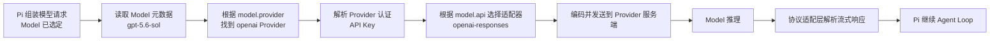

可以用寄快递类比：Provider 是快递公司和网点，Model 是指定的收件处理部门，认证是寄件资格或账号凭证，API 协议是双方统一填写的面单格式。四者缺少任意一项，请求链路都可能无法成立。

## 0.2.4 Agent Loop

Agent Loop 是 Pi 在 Model 调用与 Tool 执行之间推进状态的控制流程。一次 Run 可以包含多个 Turn；Tool Result 写回上下文后，Pi 仍需经过 Provider/API Adapter 再次请求 Model。完整运行图、终止条件和 ReAct 边界见前文 [Agent Loop 架构概览](#agent-loop-架构概览)。

## 0.2.5 Tool 系统

Tool 系统的架构主线是“注册与启用 -> 契约随请求发送 -> Model 返回 Tool Call -> Pi 查找、校验和门禁 -> Executor 执行 -> Tool Result 回到下一次 Model 请求”。各状态不能互相代替；内置 Tool 与终端用法的 Pi `0.83.0` 历史实验快照见 [终端与基础工具](02-terminal-and-tools.md)。

## 0.2.6 Extension

Extension 是可选的本地插件层，可以注册 Tool、Command 和事件处理器，也可以在固定生命周期节点拦截流程。没有 Extension，Pi 的内置 Tool 和 Agent Loop 仍可运行；注册、触发、门禁和 UI 策略见 [Extensions](06-extensions.md)。

## 0.2.7 Session、当前上下文、模型永久记忆与 Git 历史

这四者都可能让人产生“之前的信息还在”的感觉，但保存对象、生效方式和边界完全不同。

| 对象 | 大白话类比 | 保存什么 | Model 如何看到 |
|---|---|---|---|
| Session | 完整会话档案 | 消息、Tool Call、Tool Result、模型切换、Compaction、分支等 JSONL 条目 | Pi 从当前活动分支重建有效消息后，才可能发给 Model |
| 当前模型上下文 | 本次摆到 Model 桌面的材料 | 当前这一次 API 调用的 `systemPrompt`、有效 `messages`、`tools` 等 | Model 本次直接看到；调用结束后不能把它当成永久记忆 |
| 模型永久记忆 | Model 自己长期记住用户和项目 | Pi 的标准 Agent Loop 不提供这种可依赖的跨 Session 记忆 | 新 Session 中没有再次提供的信息，不能假定 Model 仍记得 |
| Git 历史 | 已提交的文件版本档案 | Commit 中被跟踪文件的快照、提交关系和元数据 | 只有 Pi 通过 Tool 读取相关文件或 Git 输出并放进上下文，Model 才能看到 |

Pi 默认把 Session 自动保存到 `~/.pi/agent/sessions/`，按工作目录组织，每个 Session 是一个树形 JSONL 文件。Session 可以保存完整历史和不同分支，但它不是每次 Model 请求的完整输入。

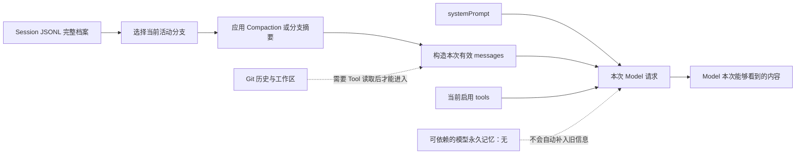

长会话发生 Compaction 后，旧消息通常仍保留在 Session 文件中，同时新增一条摘要记录；但下一次 Model 调用看到的通常是“摘要 + 近期消息”，而不是所有旧消息原文。因此，“Session 中存在”不等于“当前 Model 看到了”。

Git 解决的是文件版本恢复，不解决对话恢复；Session 解决的是对话和 Agent 运行记录恢复，不会把工作区自动恢复到某个 Git Commit。未提交的文件修改可能仍留在磁盘工作区，但它既不是 Git 历史，也不能仅凭 Session 记录保证恢复。

## 0.2.8 真实只读请求端到端追踪

本次实验创建了命名 Session `0.2.8-read-trace`，启动时通过 `--tools read` 只向 Model 暴露 `read`。用户要求 Pi 必须读取 `docs/learning/00-environment-report.md`，并且只回答该文件的一级标题。

界面中直接可见的证据包括：

- 紫色区域显示用户消息。
- 绿色区域先显示 `read` Tool Call，再展开显示完整 Tool Result。
- 黄色区域显示 Model 基于文件内容返回的最终文本“阶段 0.1 本机环境体检报告”。
- 底栏显示当前 Session 名称和 Model。

下面名称查找、Schema 校验、Extension 事件以及两个生命周期事件并不会全部直接显示在这张界面里；它们是结合本次 0.2.8 实验所用 Pi `0.82.1` 文档和已经验收的架构规则还原出的内部链路。

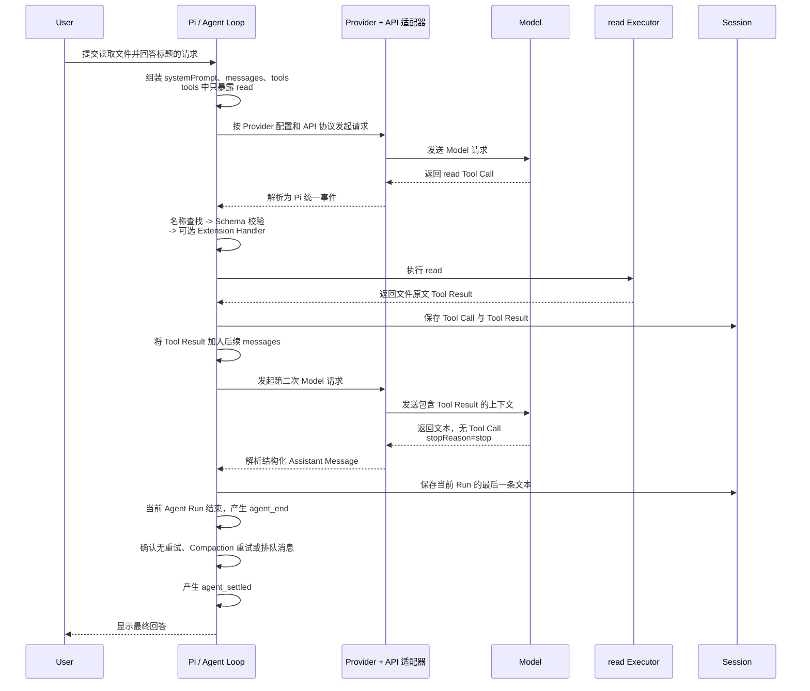

这里发生两次 Model 请求。第一次 Model 只看到了任务和 `read` 的工具定义，因此请求 Pi 读取文件；Executor 返回的原文不会自己推理或总结。Pi 必须把 Tool Result 放入后续 `messages` 再请求一次 Model，Model 才能据此生成最终答案。

文本由 Model 生成，但 Model 不会声明它在语义上是不是正确、完整的最终答案。Pi 收到 `stopReason=stop` 且没有 Tool Call 的结构化响应，并确认没有 Steering 或 Follow-up 等继续条件后，结束当前 Agent Run 并产生 `agent_end`；Pi 再确认没有自动重试、Compaction 重试或排队消息后，才产生 `agent_settled`。这两个生命周期事件都由 Pi 运行层产生，不是 Model 返回的状态值。
