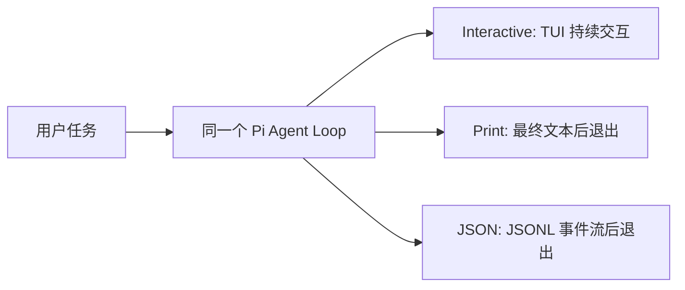

# Pi 终端与基础工具

本篇记录 Pi 的当前运行环境、基础依赖、内置 Tool 和终端输入规则。实际验证证据见 [本机环境报告](00-environment-report.md)，学习进度见 [完整学习计划](../plans/pi-complete-learning-plan.md)。

## 当前学习环境

| 项目 | 当前选择 |
|---|---|
| Pi | `0.83.0` |
| Provider | `openai`；课程中视为官方模型能力已完整接入 |
| API | `openai-responses` |
| Model | `gpt-5.6-sol` |
| Base URL | `https://sub2api.shelfcanvas.top`，不添加 `/v1` |
| 凭据 | 由 Pi 保存在 `~/.pi/agent/auth.json`，文件权限为 `0600` |

API Key 不写入项目文档、Git 仓库或聊天记录。

课程约定：底层中转不作为学习、验收或阻塞项；学习调用费用不设上限，无需逐次确认。Base URL 仅作为当前环境的可复现配置保留。

## 基础工具

| 对象 | 作用 | 记忆方式 |
|---|---|---|
| Node.js | 运行 Pi、SDK 和 TypeScript Extension | 负责运行 |
| npm | 下载、安装和更新 Pi 及依赖 | 负责安装和管理 |
| Git | 记录项目版本、查看差异、建立检查点和回滚 | 保存项目历史 |
| 独立仓库 | 隔离学习修改与业务代码，降低误操作影响 | 限制练习范围 |

“程序能运行”只证明当前状态可以执行，不代表修改过程可追溯，也不代表失败后可以恢复。代码恢复依赖 Git。

独立仓库不是沙箱。Pi 仍继承当前系统用户权限，理论上可以访问仓库外的路径。

## Pi 与内置 Tool

Pi 是极简的 Coding Agent Harness，不是空壳。它负责连接模型、组织对话、调用工具、保存 Session，并提供扩展入口。

当前内置 Tool：

- `read`：读取文件。
- `bash`：执行 Shell 命令。
- `edit`：按指定范围修改文件。
- `write`：创建或覆盖文件。
- `grep`：搜索文件内容。
- `find`：查找文件。
- `ls`：列出目录内容。

Pi 没有内置沙箱。`bash`、`edit` 和 `write` 可以产生真实修改，因此重要操作前仍需检查工作目录、Git 状态和命令影响范围。

### `read`、`write`、`edit`、`bash` 系统地图

| Tool | 主要参数 | Executor 的核心行为 | 是否修改文件 | 主要风险 |
|---|---|---|---|---|
| `read` | `path`，可选 `offset`、`limit` | 读取文本或图片；文本默认保留开头最多 2000 行或 50KB，可用行偏移继续 | 否 | 读取并送入上下文的内容可能泄露敏感信息或包含 Prompt Injection |
| `write` | `path`、`content` | 自动创建父目录；文件不存在就创建，存在就整文件覆盖 | 是 | 路径错误或内容不完整会覆盖原文件 |
| `edit` | `path`、`edits[{oldText,newText}]` | 读取已有文件，对原文中唯一且互不重叠的精确文本块进行替换 | 是 | 范围比 `write` 精确，但目标或替换内容错误仍会产生真实修改 |
| `bash` | `command`，可选 `timeout` | 在当前工作目录启动真实 Shell 进程，合并返回标准输出和错误输出；默认没有超时 | 取决于命令 | 能读写删除文件、联网、启动进程和调用其他程序，能力面最广 |

四者都遵循同一条主线：Model 只产生 Tool Call；Pi 按名称找到 Tool，准备并校验参数，经过已注册的 Extension Handler 后，才由 Executor 使用 Pi 进程当前权限操作系统，最后把 Tool Result 交回 Model。Schema 校验只判断参数结构是否合法，例如 `bash.command` 是否为字符串，不判断命令是否危险。

“只读”只表示不修改文件，不等于没有安全风险；`edit` 只比整文件 `write` 更精确，不等于自动正确；`bash` 可以通过 Shell 命令覆盖其他 Tool 的大量能力，因此仅隐藏 `write` 或 `edit` 不能在 `bash` 仍可用时构成只读边界。

### 已验证的最小 Tool 实验

| Session | 暴露给 Model 的 Tool | 实际结果 |
|---|---|---|
| `1.2-write` | `write` | 创建三行文件 `labs/1.2-tools/tool-lab.txt` |
| `1.2-read` | `read` | 使用 `offset=2`、`limit=2`，只返回第 2-3 行 |
| `1.2-edit` | `edit` | 将唯一文本 `mode=dev` 精确替换为 `mode=study`，Git diff 只有第 3 行变化 |
| `1.2-bash` | `bash` | 执行 `pwd && git diff -- labs/1.2-tools/tool-lab.txt`，返回当前仓库和预期 diff，没有产生新修改 |

这些证据只证明对应 Session 中的单次行为符合预期。`1.2-bash` 证明指定命令没有写入副作用，不代表 `bash` 是只读 Tool；这些实验也不代表 Tool 自动安全、修改内容一定正确或文件可以脱离 Git 精确恢复。

## TUI 四个区域

| 区域 | 所在位置 | 主要内容 |
|---|---|---|
| Startup header | 启动时最上方 | 快捷提示，以及已加载的上下文文件、Prompt Template、Skill 和 Extension |
| Messages | 中间历史区域 | 用户消息、Model 回复、Tool Call、Tool Result、通知和错误 |
| Editor | 靠近底部的输入框 | 编写尚未提交的草稿；边框颜色表示当前 Thinking Level |
| Footer | 最底部状态栏 | 工作目录、Session 名称、Token/缓存/费用/上下文用量和当前 Model |

滚动后 Startup header 可能离开当前视野，但仍属于本次 TUI 会话；Tool Call 和 Tool Result 属于 Messages，不是 Editor。只有 Editor 中尚未按 `↩ Return` 提交的内容仍是草稿。

## Project Trust、Tool 开关与系统隔离

这三类控制位于不同路径，不能互相替代：

| 控制 | 实际控制什么 | 不能保证什么 |
|---|---|---|
| Project Trust | 是否加载项目设置、Skill、Extension、Package 等受保护的项目级资源 | 不降低 Pi 进程的操作系统权限，也不证明资源内容安全 |
| `--no-tools` | 不向 Model 暴露可调用 Tool | 不关闭用户 Shell，也不阻止 Extension 自身执行代码 |
| Extension 门禁 | 在已经覆盖的 Tool 或用户 Shell 入口进行允许、确认或阻止 | 未加载或遗漏入口时不生效，不是系统级隔离 |
| 操作系统权限、容器、虚拟机或沙箱 | 从底层限制文件、进程和网络访问 | 需要单独设计和验证隔离策略 |

Project Trust 是“允许加载”的授权，不是“已经安全”的认证。即使选择信任，仍应审查项目级 Skill、Extension、Package 及其脚本和外部依赖。反过来，拒绝 Project Trust 也不表示 Pi 无法读取任何项目内容；例如项目说明文件、用户明确要求读取的文件和 Shell 路径有各自的加载或执行规则。

本仓库完成过一次最小对照实验：

1. 使用 `--no-approve` 启动时，项目级 `pi-learning-coach` 不出现在 `/skill:` 列表中。
2. 同时使用 `--no-tools` 时，用户直接输入 `!!pwd` 仍可成功执行，因为它走 `user_bash`，不是 Model Tool Call。
3. 使用 `--approve` 启动时，项目级 `pi-learning-coach` 被加载并出现在手动 Skill 命令列表中。

这个实验只证明三条路径彼此独立：Project Trust 控制项目资源加载，Tool 开关控制 Model 的 Tool 可见性，用户 Shell 使用 Pi 进程当前拥有的系统权限。它不能证明 Pi 已被沙箱化。

外部文件、网页、Tool Result 和项目资源还可能包含诱导 Model 改变行为的恶意指令，即 Prompt Injection。Project Trust、系统提示和 Model 自律都不能单独形成强隔离；高风险任务仍应组合使用最小 Tool 集、应用层门禁、人工确认和系统级隔离。

## macOS 交互快捷键

本文统一使用 macOS 符号：`⌃ Control`、`⌥ Option`、`⇧ Shift`、`⌘ Command`、`↩ Return`。Pi 是终端程序，多数快捷键使用 `⌃ Control`，不是普通 Mac 应用常见的 `⌘ Command`；Pi 配置和英文文档中的 `Alt` 对应 Mac 的 `⌥ Option`。

| 快捷键 | 功能 | 是否发送消息 | 实验记录 |
|---|---|---|---|
| `↩ Return` | 提交当前草稿；Agent 运行中时按消息队列规则处理 | 是 | 普通提交与运行中 Steering 均已验证 |
| `⇧↩` 或 `⌃J` | 在草稿中换行 | 否 | 已验证多行输入 |
| `⌃A` | 光标移到行首 | 否 | 已验证 |
| `⌃E` | 光标移到行尾 | 否 | 已验证 |
| `⌃W` | 删除光标前一个单词 | 否 | 已验证 |
| `⌃-` | 撤销上一次编辑 | 否 | 已验证 |
| `⌃G` | 用外部编辑器修改当前草稿 | 否 | 已验证；本机实际打开 `UW PICO 5.09` |
| `⌃C` | 清空当前编辑器；连续两次可退出 Pi | 否 | 已验证；不要在输入框键入 `clear` 代替 |
| `⌃D` | 输入框为空时退出 Pi | 否 | 已完成退出实验 |
| `⌃V` | 粘贴剪贴板中的图片或文字 | 仅粘贴时不发送 | 已验证完整图片读取链路 |
| `⇧Tab` | 循环切换当前 Model 支持的 Thinking Level | 否 | 已验证 |
| `⌃L` | 打开 Model 选择器；等价于 `/model` | 否 | 已验证选择与恢复 Model |
| `⌃P` / `⇧⌃P` | 在 Scoped Models 中向前/向后切换 Model | 否 | `⌃P` 有直接界面证据；`⇧⌃P` 由用户操作确认，未保留直接界面输出 |
| `⌃T` | 展开或隐藏 Thinking 内容，不改变 Thinking Level | 否 | 阶段 1.3 验证 |
| `⌥↩` | Agent 运行时排队 Follow-up 消息 | 是 | 已验证 |

完整默认键位随 Pi 版本变化，以 `/hotkeys` 和本机安装包的 `docs/keybindings.md` 为准。本文只保留课程使用的常用键位及实测状态。

`⌃G` 实验中，Pi 将当前草稿交给临时 `prompt.md`，用户在 PICO 中修改、保存并退出后，Pi 重新载入了两行草稿。整个往返过程没有发送用户消息，也没有触发 Model 或 Tool；只有按 `↩ Return` 提交草稿后，才会开始一次 Agent Run。

### Model 与 Thinking Level

Footer 中的 `gpt-5.6-sol • medium` 分别表示当前 Model 和 Thinking Level。Thinking Level 的完整名称集合是 `off`、`minimal`、`low`、`medium`、`high`、`xhigh`、`max`；实际循环范围由当前 Model 和 Provider 配置决定，不支持的级别会被跳过或限制。

- 当前 TUI：按 `⇧Tab` 循环 Thinking Level，也可通过 `/settings` 选择。
- 启动时指定：`pi --thinking high`。
- 与 Model 一起指定：`pi --model openai/gpt-5.6-sol:high`。
- 切换 Model：输入 `/model` 或按 `⌃L`；`⌃P` 和 `⇧⌃P` 只在已配置的 Scoped Models 中循环。

#### 当前 Model、模型目录与 Scoped Models

| 入口 | 作用 | 是否立即切换当前 Model |
|---|---|---|
| `/model` 或 `⌃L` | 浏览已配置 Provider 下的模型目录，并选择当前 Model | 确认选择后切换 |
| `/scoped-models` | 配置哪些 Model 进入快速循环范围及其顺序 | 否；高亮、启用或排序不等于切换 |
| 普通 TUI 中的 `⌃P` / `⇧⌃P` | 在 Scoped Models 中向前或向后切换当前 Model | 是 |

`/scoped-models` 的 Model Configuration 使用以下按键：

| 按键 | 作用 |
|---|---|
| `↩ Return` | 启用或禁用当前高亮 Model |
| `⌃A` | 全部启用 |
| `⌃X` | 全部禁用 |
| `⌃P` | 在该配置界面内按 Provider 筛选；不是切换当前 Model |
| `⌥↑` / `⌥↓` | 调整快速循环顺序 |
| `⌃S` | 将范围保存到 settings |

界面显示 `Session-only` 时，未按 `⌃S` 的调整只作用于当前 Session；`all enabled` 表示当前列出的 Model 全部在快速循环范围内。快捷键含义取决于所在界面：必须先退出 Model Configuration，普通 TUI 中的 `⌃P` 才表示快速切换 Model。

本机 Pi `0.83.0` 已完成一次无消息切换实验：

1. `/scoped-models` 显示 38 个 Model，状态为 `all enabled`。
2. 配置界面高亮 `gpt-4` 时，Footer 仍是 `gpt-5.6-sol • max`，证明浏览或配置范围不会切换当前 Model。
3. 退出配置界面后按一次 `⌃P`，Pi 显示 `Switched to GPT-5.6 Terra (thinking: xhigh)`，Footer 更新为 `gpt-5.6-terra • xhigh`。
4. 切换过程没有发送用户消息，也没有发起 Model 请求；Session 名称保持不变。
5. 使用 `⌃L` 重新选择 `gpt-5.6-sol` 后，Footer 恢复为 `gpt-5.6-sol • max`。

这次实验还说明 Thinking Level 不一定在不同 Model 之间保持相同：切到 Terra 时为 `xhigh`，恢复 Sol 时为 `max`。每次切换后都应检查 Footer，再决定是否发送下一条消息。

Thinking Level 只影响后续 Model 请求的推理强度，通常也会影响响应时间和 Token 使用；它不改变 Tool 列表、Executor 权限或安全边界。本机 Pi `0.83.0` 已实测 `⇧Tab` 能切换 Footer 显示的 Thinking Level。

### Footer：Session 累计与当前上下文

Footer 中的 Token 信息分为两套统计，不能混为一谈：

| 示例 | 统计范围 | 含义 |
|---|---|---|
| `↑10k` | 整个 Session 累计 | 累计输入 Token；同一段历史在多次 Model 请求中重复发送时会重复计入 |
| `↓146` | 整个 Session 累计 | 累计输出 Token；Provider 报告的 Reasoning Token 已包含在输出统计中 |
| `R...` / `W...` | 整个 Session 累计 | Prompt Cache 的累计读取和写入 Token；没有缓存用量时不显示 |
| `CH...%` | 最近一次 Model 响应 | 最近一次请求的 Prompt Cache 命中率，不是整个 Session 的累计比例 |
| `$0.055` | 整个 Session 累计 | Pi 根据使用量和模型价格元数据统计的成本，不等同于服务商最终账单 |
| `1.9%/272K` | 当前有效上下文 | 当前上下文估算值约占当前 Model Context Window 的 `1.9%`；`272K` 是窗口容量 |
| `(auto)` | 当前 Session 设置 | 自动 Compaction 已启用，不表示正在压缩，也不表示自动选择 Model 或 Thinking Level |

累计统计会遍历整个 Session，包括已经被压缩的历史，以及带用量数据的 Assistant Response、Tool Result、Compaction 和 Branch Summary。它属于 Session，不属于某个终端窗口：关闭 Pi 后恢复同一个 Session，累计统计仍可继续。

当前上下文用量是 Pi 用于 Footer 和 Compaction 判断的估算值。它优先采用最近一次有效 Model 响应的用量，并估算其后的新增消息。`1.9%/272K` 约等于当前有效上下文 `5.2K Token`；显示值经过缩写和四舍五入，因此不是精确整数。切换到 Context Window 不同的 Model 后，即使消息没有变化，分母和占用比例也可能变化。

多轮请求会反复携带有效历史，所以 Session 累计输入达到 `10K`、当前上下文只有约 `5.2K` 并不矛盾。发生 Compaction 后，Pi 用摘要替代较早消息，并在后续请求中发送“摘要 + 保留的近期消息”：当前上下文比例通常下降，刚压缩完还可能暂时显示 `?/272K`；`↑`、`↓`、缓存和费用等累计值不会回退，生成摘要本身还可能继续增加这些累计值。

本机 Pi `0.83.0` 的综合验收已通过：用户能够区分 Session 累计用量和当前上下文用量，说明 Compaction 前后的显示变化，并准确解释 `(auto)` 的边界。

## 输入类型与退出

| 输入形式 | Pi 的处理方式 | 示例 |
|---|---|---|
| 普通文字 | 作为用户消息发送给模型 | `exit` 只会让模型回复，不会退出 Pi |
| 交互式 `@文件` | 模糊搜索项目文件并把路径插入普通消息；不会在此时读取文件 | `@docs/learning/00-environment-report.md` |
| `/命令` | 由 Pi 自身执行 | `/quit`、`/model`、`/session` |
| `!命令` | 执行 Shell，并把输出发送给模型 | `!pwd` |
| `!!命令` | 执行 Shell，但不把输出发送给模型 | `!!git status` |

### 三条 Shell 执行路径

| 路径 | 谁发起执行 | 是否要求向 Model 暴露 `bash` Tool | 后续 Model 能否看到 | Extension 介入点 |
|---|---|---|---|---|
| 用户输入 `!命令` | Pi 的交互式用户 Shell 入口 | 不要求 | 能看到命令和结果，但不会仅因命令执行完就自动请求 Model | `user_bash` |
| 用户输入 `!!命令` | Pi 的交互式用户 Shell 入口 | 不要求 | 看不到这条 Shell 消息；结果仍会显示在本地 TUI，并保存在 Session 中 | `user_bash` |
| Model 请求 `bash` Tool | Model 先返回 Tool Call，再由 Pi 调度本地 Executor | 要求；`bash` 必须出现在本次请求的 Tool 列表中 | 能在下一轮收到 Tool Result | `tool_call` 等 Tool 生命周期事件 |

因此，`--no-tools` 只会让 Model 看不到并且无法主动请求 Tool，不会禁用用户输入的 `!` 或 `!!`。`!!` 的“隐藏”只表示该 Shell 消息在组装 Model 上下文时被过滤，不表示结果没有显示、没有保存或对 Extension 保密。

三条路径最终都在 Pi 进程拥有的当前系统用户权限下运行。它们不是沙箱；要真正限制文件、进程和网络能力，仍需操作系统权限、受限用户、容器或虚拟机等系统级隔离。

本机 Pi `0.83.0` 已完成一次 `--no-tools` 对照实验：普通 `!` 和隐藏上下文的 `!!` 都成功执行并在 TUI 显示输出；随后发起的普通 Model 请求只准确复述了 `!` 的 marker，没有复述 `!!` 的 marker，且整个过程没有 Model Tool Call。这证明的是 Model 上下文过滤差异，不代表 `!!` 的命令或结果没有在本地执行和保存。

### 取消正在运行的用户 Shell

在本机 Pi `0.83.0` 的默认本地 Shell 后端中，用户 Shell 运行时按 `Esc`（Escape）会触发 Pi 的 `abortBash()`。Pi 通过取消信号终止默认本地进程组，TUI 随后把该 Bash 消息标记为 `cancelled`；这条记录仍会保存在 Session 中，取消不等于删除执行历史。

不要把 `⌃C` 当成本实验的 Shell 取消键：Pi 的默认交互键位中，`⌃C` 用于清空 Editor，连续两次可退出。取消只保证阻止尚未发生的后续执行，不能回滚命令在取消前已经产生的副作用；如果 Extension 通过 `user_bash` 替换了默认执行后端，是否能真正终止远端或自定义任务，还取决于该后端是否正确处理取消信号。

本机实测已验证默认后端的取消行为：在 Session `1.4-user-shell` 中执行 `!sleep 30 && printf 'SHOULD_NOT_PRINT\\n'`，等待期间按 `Esc` 后，TUI 显示 `(cancelled)`，`SHOULD_NOT_PRINT` 没有出现，Editor 随即恢复可输入状态。因为 `&&` 右侧命令尚未开始，这证明取消信号阻止了后续命令；它仍不能证明取消能够撤销左侧命令在中止前已经产生的副作用。

### Model 请求的自动重试

Pi 的 Agent 级自动重试针对 Model/Provider 的瞬时错误，不负责重跑失败的 Tool 或用户 Shell。当前设置没有覆盖 `retry`，因此本机 Pi `0.83.0` 使用默认值：启用自动重试，最多重试 3 次，基础等待 2 秒，按指数退避依次等待 2、4、8 秒。这里的“3 次”不包含最初请求，所以最多会产生 4 次 Model 请求。

| 失败场景 | Pi 的主要处理 |
|---|---|
| Provider 过载、限流、`429`、`5xx`、网络中断或超时 | 等待后重新发起失败的 Model 请求 |
| 配额、余额或计费耗尽，认证失败，Model ID 不存在 | 视为确定性错误，不做 Agent 级自动重试 |
| Schema 校验、Tool Executor 或 Bash 失败 | 形成错误 Tool Result；由下一轮 Model 决定是否换参数再次调用，不是 Pi 自动重跑 Tool |
| Context Overflow | 走独立的 Compaction 恢复路径；压缩成功后最多恢复原请求一次 |

#### 两种容易和 Model 请求失败混淆的情况

`bash` Tool 的退出码是 Shell 进程执行完成后交回的结果。通常 `0` 表示命令成功，非 `0` 表示命令没有按成功路径结束；`1` 是常见的通用失败值，具体原因仍由对应命令定义。此时失败的是已经执行过的 Tool，不是 Pi 发给 Provider 的 Model 请求。Pi 会把命令输出和失败状态组成 Tool Result 交给 Model，由 Model 决定解释错误、修改参数或产生新的 Tool Call；Pi 不会按 2/4/8 秒策略自动重跑原命令。即使 Model 后来主动选择再次调用，也属于 Agent Loop 中的新决策，不是自动重试。

Context Overflow 表示 Pi 为一次 Model 请求组装的系统提示、消息、Tool 定义和 Tool Result 等内容，超过了当前 Model 的 Context Window。原样等待几秒再发送仍然会过大，所以它不走普通瞬时错误重试。Pi 会尝试先做 Compaction，用摘要替代较早历史并保留近期消息，再用缩小后的上下文恢复原请求一次。Compaction 是有损摘要，不等于删除 Session 存档，也不能保证所有早期细节仍存在于后续 Model 的有效上下文中。

重试等待期间，TUI 会显示类似 `Retrying (1/3) in 2s... (Esc to cancel)`。`1/3` 表示第一次重试、最多三次重试，不包含最初请求；此时按 `Esc` 会取消尚未发出的下一次 Model 请求。已经完成的 Tool 或 Shell 不会因此被回滚或再次执行。

简化流程为：`Model 请求失败 -> Pi 判断是否为瞬时错误 -> 等待 2/4/8 秒 -> 重新请求 Model -> 成功或耗尽重试次数`。错误分类主要依赖错误文本匹配，因此它是恢复机制，不是业务正确性或幂等性保证。

本机受控实验使用离线、禁网和独立配置目录运行的临时假 Provider，固定返回规范化的 `503 Service Unavailable`。真实 Pi TUI 连续显示 4 次失败，最后显示 `Retry failed after 3 attempts`；请求日志中的相邻间隔约为 `2.005s`、`4.004s`、`8.003s`。这验证了 Pi 收到规范化瞬时错误后的默认重试次数和指数退避，不验证真实 HTTP SDK 如何把远端状态码转换为错误消息。

取消实验为了留出稳定按键时间，只在隔离配置中把基础等待临时改为 10 秒；这不是 Pi 默认值。第一次 `503` 后按 `Esc`，TUI 显示 `Retry failed after 1 attempts: Retry cancelled`，独立日志也只有第一次请求，证明等待中的下一次 Model 请求没有发出。取消不会撤销已经完成的第一次请求，也不会回滚该请求可能已经产生的外部副作用。

### Steering 与 Follow-up：运行中追加消息

#### 为什么需要两种消息

先看一项没有插话的正常任务。用户说“检查登录问题，找到原因后修改、测试并汇报”，Pi 随后在 Model 请求和 Tool 执行之间循环，直到 Model 不再请求 Tool、返回最终文本；如果也没有重试、Compaction 或排队消息，整个处理才进入 `agent_settled`。

Pi 工作期间，用户的新消息可能表达两种完全不同的意思：

- “当前方向不对，后面的步骤请改一下。”这是 Steering。
- “当前任务照常完成，完成后再帮我做另一件事。”这是 Follow-up。

如果两种意思共用一个队列，Pi 就无法判断新消息应当改变当前任务，还是等当前任务完成后再处理，因此需要分开。

#### 从任务开始到结束的完整例子

原任务仍然是：“检查登录问题，找到原因后修改、测试并汇报。”Pi 已经开始读取文件或运行检查。

这时如果用户输入“先不要修改代码，只告诉我问题在哪里”，并在 Agent 仍在运行时按 `↩ Return`：

1. Pi 把它放进 Steering 队列。
2. Pi 不会强行中断当前正在进行的 Model 请求，也不会中断当前 Assistant Turn 已经开始执行的 Tool Call。
3. 当前 Assistant Turn 的 Tool Call 全部结束后、下一次请求 Model 之前，Pi 把这条新要求加入上下文。
4. Model 根据“已有结果 + 新要求”调整剩余步骤，不再继续修改，只汇报问题位置。
5. 已经执行过的命令、已经完成的写入或其他副作用不会因为 Steering 自动撤销。

这就是 Steering：**当前任务继续，但从下一个可调整点开始改变剩余方向。**

因此，如果 Steering 到达时测试命令已经由 Bash Tool 启动，Pi 会让这次测试正常结束；拿到 Tool Result 后，再把“测试结果 + Steering 新要求”放进下一次 Model 请求。Steering 不会杀掉正在运行的测试，也不会撤销测试前已经完成的文件修改。

如果用户输入“登录问题处理完后，再列出三条后续风险”，并在 Agent 仍在运行时按 `⌥↩`（Option+Return）：

1. Pi 把它放进 Follow-up 队列。
2. 当前登录问题任务继续，不会因为这条消息立刻改方向。
3. 当当前任务已经没有 Tool Call 和 Steering、原本准备停下来时，Pi 才取出 Follow-up。
4. Pi 将 Follow-up 作为后续用户消息交给 Model，继续处理“列出三条风险”。
5. 所有 Follow-up 都处理完成，并且没有重试、Compaction 或其他排队消息后，Session 级运行才真正进入 `agent_settled`。

这就是 Follow-up：**当前任务先照常收尾，新任务排在它后面自动继续。**

| 对比项 | Steering | Follow-up |
|---|---|---|
| 用户意图 | 调整当前任务剩余步骤 | 当前任务结束后再做一件事 |
| 运行中快捷键 | `↩ Return` | `⌥↩`（Option+Return） |
| 投递时机 | 当前 Assistant Turn 的 Tool Call 结束后、下一次 Model 请求前 | 当前任务没有 Tool Call 和 Steering、原本准备停止时 |
| 是否强行打断当前动作 | 否 | 否 |
| 是否撤销已发生的副作用 | 否 | 否 |
| 对结束状态的影响 | 可能让当前 Agent Loop 按新方向继续 | 队列未处理完时不能算 `agent_settled` |

一句话判断：**要改“现在这件事后面怎么做”，用 Steering；要说“这件事做完以后再做什么”，用 Follow-up。** 这是消息投递顺序，不是取消、事务或回滚机制。

#### Steering 本机实测

Session `1.5-steering` 只向 Model 暴露 `bash`。原任务要求执行 `sleep 20 && printf 'ORIGINAL_TOOL_DONE\\n'`，Tool 完成后输出 `ORIGINAL_FINAL`；绿色 Bash 正在等待时，用户输入“不要输出 `ORIGINAL_FINAL`，只输出 `STEERING_APPLIED`”并按普通 `↩ Return`。

TUI 显示 Bash 没有被中断，约 `20.8s` 后正常返回 `ORIGINAL_TOOL_DONE`；随后队列中的新要求出现在消息区，Model 最终输出 `STEERING_APPLIED`。这验证了 Steering 会等待当前 Assistant Turn 已经开始的 Tool Call 结束，再影响下一次 Model 请求和当前任务的剩余回答。它没有取消 Tool，也不代表能撤销 Tool 已经产生的副作用。

这里“不会打断”只针对已经开始的 Tool，不代表原任务中尚未生成的最终文本必须先输出。`ORIGINAL_FINAL` 在 Tool 结束后的下一次 Model 请求前还不存在，而 Steering 正是在这次请求前加入上下文，因此 Model 会直接按新要求生成 `STEERING_APPLIED`。

#### Follow-up 本机实测

Session `1.5-follow-up` 只向 Model 暴露 `bash`。原任务要求 Bash 等待约 20 秒后返回 `PRIMARY_TOOL_DONE`，再由 Model 输出 `PRIMARY_FINAL`；绿色 Bash 正在等待时，用户输入“当前任务完成后，再只输出 `FOLLOW_UP_APPLIED`”并按 `⌥↩`（Option+Return）。

TUI 按顺序显示 `PRIMARY_TOOL_DONE`、`PRIMARY_FINAL`、后续用户消息和 `FOLLOW_UP_APPLIED`。这证明 Follow-up 不会进入当前任务的剩余推理并改写 `PRIMARY_FINAL`，而是等当前任务正常收尾后，再作为后续用户消息交给 Model。队列里仍有 Follow-up 时，整个 Session 还不能进入最终的 `agent_settled`。

判断 `agent_settled` 时，不能只看当前任务是否已经输出最终文本，而要看 Pi 后面是否还会自动继续。在上述实验中，出现 `PRIMARY_FINAL` 时，Follow-up 队列里仍有消息，所以还没有 settled；只有 `FOLLOW_UP_APPLIED` 处理完成，并且没有 Tool Call、Steering、Follow-up、自动重试或 Compaction 恢复等后续动作时，才进入 `agent_settled`。

## Interactive、Print 与 JSON

三种模式使用同一个 Pi Agent 核心，都会组装上下文、请求 Model，并在 Model 产生 Tool Call 时执行已启用的 Tool。它们的主要差别不是“有没有 Agent 能力”，而是**谁来消费输出，以及进程什么时候退出**。

| 模式 | 入口 | 输出 | 主要使用者 | 任务完成后 |
|---|---|---|---|---|
| Interactive | 默认运行 `pi` | TUI 中的人类可读消息、Tool 状态和交互控件 | 人 | 保持运行，等待下一条输入 |
| Print | `pi -p` 或 `pi --print` | 人类可读的最终回答 | Shell 脚本或只需要最终文本的人 | 自动退出 |
| JSON | `pi --mode json` | 每行一个 JSON 对象的完整事件流，例如 Session header、`agent_start`、消息和 Tool 执行事件 | 程序、日志处理器或自定义 UI | 自动退出 |

准确边界：

- Print 和 JSON 只是非交互输入输出模式，不会自动关闭 Tool，也不会形成沙箱；是否能读取、写入、执行命令仍由启用的 Tool、Extension 门禁和操作系统权限决定。
- `--mode json` 表示“Pi 用 JSONL 报告内部事件”，不等于要求 Model 的最终业务回答必须是 JSON。
- 非交互模式不会显示 Project Trust 询问；没有已保存的适用决策时，按全局 `defaultProjectTrust` 处理，也可以用 `--approve` 或 `--no-approve` 为本次运行明确覆盖。
- 是否保存 Session 是另一条独立开关；需要临时运行时还要显式使用 `--no-session`。
- `--mode rpc` 面向可持续双向控制的外部程序，留到阶段 7 与 SDK、RPC 一起学习。

### 三种模式本机对照与源码主线

三次实验都使用相同任务“只回复 `MODE_OK`，不要解释”，并关闭 Tool、Session 和项目资源，观察到的差别如下：

| 模式 | 本机证据 | 结束行为 |
|---|---|---|
| Interactive | TUI 中显示 `MODE_OK`，底部 Editor 仍可继续输入 | Pi 保持运行 |
| Print | 终端只打印 `MODE_OK` | 自动返回 zsh 的 `%` 提示符 |
| JSON | 逐行输出 `session`、`agent_start`、`turn_start`、`message_*`、`turn_end`、`agent_end`、`agent_settled` 等 JSON 对象；`MODE_OK` 位于 Assistant 的消息事件中 | 自动返回 zsh 的 `%` 提示符 |

这些结果不是三个不同的 Agent。Pi 0.83.0 的 `dist/main.js` 先由 `resolveAppMode()` 选择外壳：Interactive 创建并运行 `InteractiveMode`；Print 和 JSON 都进入同一个 `runPrintMode()`，只把输出模式分别设为 `text` 和 `json`。

`dist/modes/print-mode.js` 中的区别也很直接：JSON 分支订阅 Session 事件，并把每个事件 `JSON.stringify()` 后逐行写到标准输出；Print 分支等任务完成后，只从最后一条 Assistant Message 中提取文本。两条分支最后都会释放 Runtime、刷新输出并退出。

因此可以把它们记成：**Agent 核心负责把事情做完，模式外壳负责决定输出给谁看、输出多少、进程是否继续等待。** JSON 模式中的 `message_update` 是流式增量，`message_end` 是完整消息，`agent_end` 表示本次 Agent Run 已结束，`agent_settled` 表示没有排队消息、重试或其他自动续行动作。

交互式 `@文件` 的验证分两层：路径出现在草稿中，只证明文件搜索和路径插入成功；提交消息后出现对应的 `read` Tool Call，才证明文件被实际读取。CLI 启动参数中的 `@文件` 会由 Pi 主动附加文件内容，和交互式路径引用不是同一种行为。

本仓库的交互式实验已验证这两层：先通过 `@` 选择并插入 `docs/learning/00-environment-report.md`，此时没有读取；提交明确的读取请求后，Pi 才执行对应的 `read` Tool Call，Model 随后根据 Tool Result 返回了文件一级标题。

CLI 对照实验使用 `--no-tools --no-session -p @docs/learning/00-environment-report.md`。在没有任何 Tool Call 的情况下，Model 仍正确返回文件一级标题，证明命令行参数中的 `@文件` 由 Pi 在首次 Model 请求前主动读取并附加；`--no-session` 同时避免保存该次临时实验。

## 完整小任务闭环

真实开发任务不能在“文件已经改了”时就宣布完成。一次最小但完整的闭环是：

| 阶段 | 本次动作 | 解决的问题 |
|---|---|---|
| 分析 | 理解目标文件、唯一允许的修改和禁止事项 | 防止一开始就改错范围 |
| 读取 | `read labs/1.2-tools/tool-lab.txt` | 确认真实内容和待替换文本 |
| 修改 | 用 `edit` 将唯一一行 `status=created` 替换为 `status=verified` | 只完成必要变更，避免重写整个文件 |
| 测试 | 用指定 Bash 命令校验第二行内容和总行数 | 证明结果符合明确条件 |
| 查看差异 | `git diff -- labs/1.2-tools/tool-lab.txt` | 证明变更范围只有目标文件中的目标行 |
| 总结 | 报告 Tool 顺序、测试输出、diff 和未执行事项 | 让使用者能审计本次任务是否真正完成 |

Session `1.7-workflow` 已完成本机实测。TUI 中的实际 Tool 顺序为 `read -> edit -> bash（测试）-> bash（查看 diff）`；测试输出为 `TEST_OK`；Git diff 只显示 `status=created -> status=verified`。仓库侧再次核对后，目标文件仍为三行，且没有提交或推送。

这次启动时出现 “project is not trusted” 不代表任务失败。实验显式关闭了项目 Context、Extension、Skill 和 Prompt Template，使用的 `read`、`edit`、`bash` 都是 Pi 内置 Tool，因此项目资源未加载不影响本次 Tool 链路。

还要注意证据边界：工作区中原本就存在课程文档的未提交修改，所以不能仅凭任务结束后的全局 `git status` 断言所有变更都由这次 Pi 运行产生。本次影响范围应结合实验前基线、TUI 中实际发生的 Tool Call，以及目标文件的限定 diff 来判断。

`--tools read,edit,bash` 和提示词中的禁止事项都不是沙箱。尤其 `bash` 仍能读写文件、联网和启动进程。本次实验之所以可控，是因为使用独立学习仓库、冻结单文件目标、限定精确命令、执行测试并审查 Git diff；这些措施提高了可审计性，但不改变 Pi 进程拥有当前 macOS 用户权限这一事实。

## macOS 剪贴板图片输入

在 macOS 使用 `⌃⇧⌘4` 框选画面，会把截图复制到剪贴板；其中额外的 `⌃ Control` 表示复制而不是保存到桌面。回到 Pi 后按物理 `⌃V`，不是普通 Mac 应用常用的 `⌘V`。Pi 会把剪贴板图片写为临时 `pi-clipboard-*.png`，并将该路径插入当前草稿。

临时图片路径出现在草稿中，只证明截图粘贴成功，不证明 Model 已收到或理解图片。提交后还必须出现针对该路径的 `read` Tool Call，并得到与图片内容一致的回答，才能证明完整图片读取链路通过。实验图片不得包含密钥、订单或其他敏感信息。

本仓库的图片实验已完成完整链路：Pi 将剪贴板截图写为临时 PNG 并插入草稿；提交后执行了针对该 PNG 的 `read` Tool Call，Tool Result 显示图片缩略图，Model 最终正确识别出截图中的“阶段 0.1 本机环境体检报告”。

退出 Pi：

1. 输入 `/quit` 并按 `↩ Return`，这是最明确的方式。
2. 输入框为空时按 `⌃D`（Control+D）。
3. 连续按两次 `⌃C`（Control+C）；第一次用于清空输入框。

在输入框中键入 `exit`、`quit` 或“再见”都属于普通消息，不会终止 Pi 进程。
