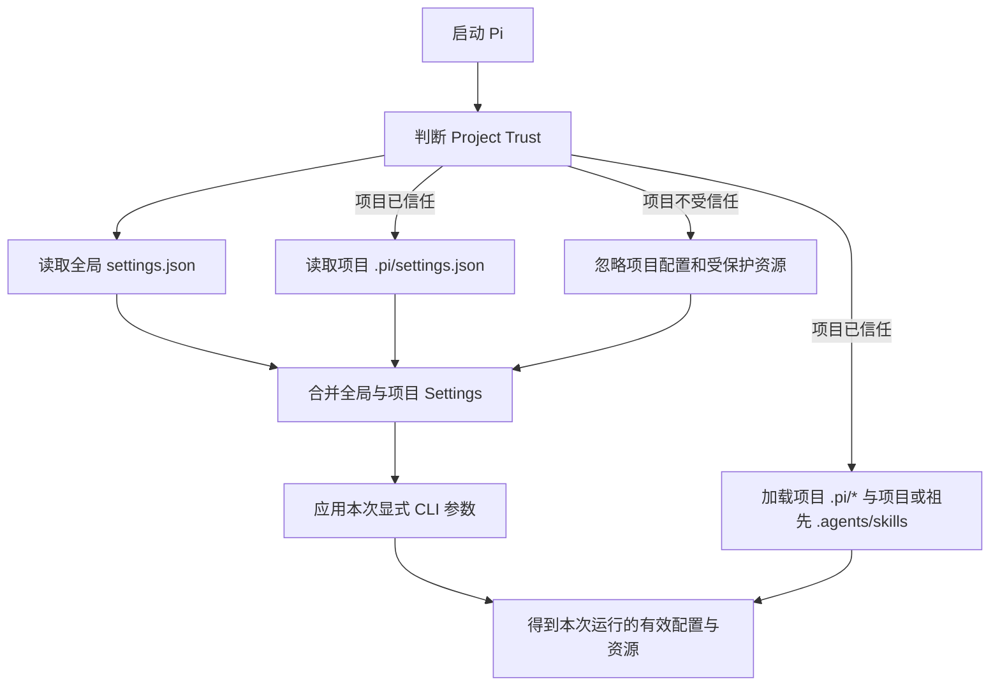
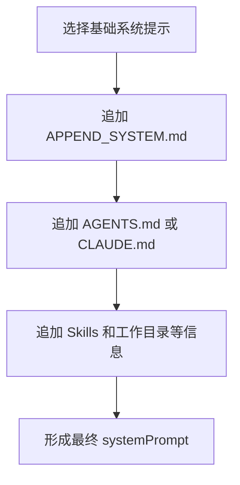
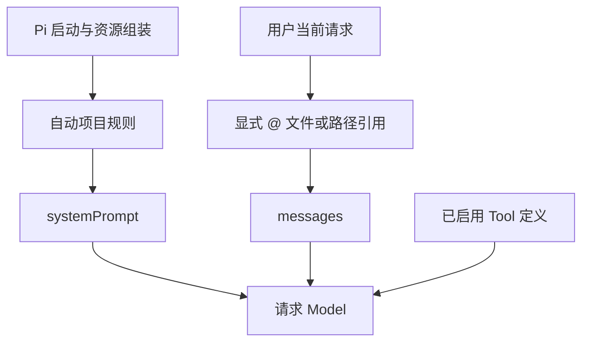
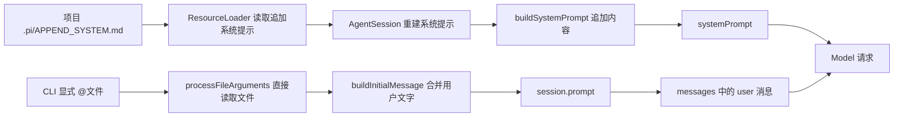
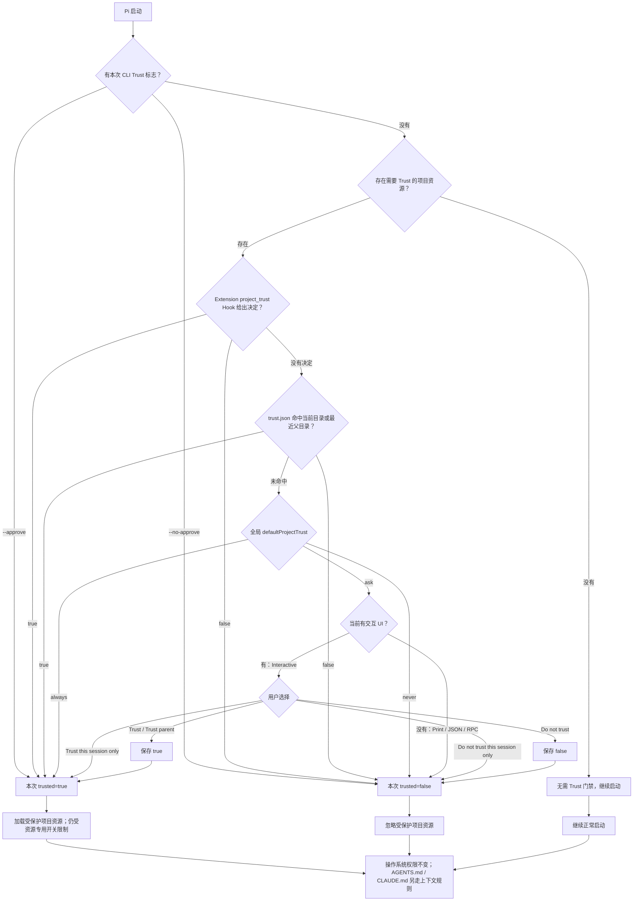

# Pi 项目配置与上下文

本章记录 Pi 配置来源、Project Trust、合并规则、启动参数优先级，以及项目规则如何进入 Model 上下文。

## 先记住一句话

在一个全新的、未恢复旧 Session 的 Pi 运行中，同一个设置的取值顺序是：

```text
显式 CLI 参数 > 项目同名配置 > 全局同名配置 > Pi 内置默认值
```

这里的 `>` 表示“左边有明确值时，优先使用左边的值”。它不是文件加载顺序，也不表示 CLI 会改写配置文件。

## 大白话心智模型

可以把 Pi 启动想成先准备两份长期配置，再接收一张本次运行的临时便签：

- 全局配置：你个人在所有项目中共同使用的默认习惯。
- 项目配置：当前仓库针对自己的特殊要求。
- CLI 参数：只对这次启动提出的临时要求。
- 内置默认值：前面都没有提供时，Pi 自己最后兜底。

例如，全局设置 Thinking 为 `max`，当前项目设置为 `high`，本次命令又显式传入 `--thinking low`，本次运行最终就是 `low`。退出后重新启动且不传 `--thinking`，又会回到项目值 `high`。

## 启动流程



准确地说，Pi 先把 Settings 文件合并，再由各个 CLI 参数在对应功能的使用位置调整本次运行。CLI 不是一个会被保存到 `settings.json` 的通用配置层。

## 两个配置文件

| 配置来源 | 路径 | 作用范围 |
|---|---|---|
| 全局配置 | `~/.pi/agent/settings.json` | 当前用户的所有项目 |
| 项目配置 | `<项目根目录>/.pi/settings.json` | 当前项目 |

项目配置的加载受 Project Trust 控制：

- 项目已信任：Pi 可以读取项目 `.pi/settings.json` 和受保护的项目资源。
- 项目不受信任：Pi 仍读取全局配置，但忽略项目配置和受保护的项目资源。
- 交互模式中的 `/trust` 只保存决定；当前 Pi 进程不会热加载，需要退出并重新启动。
- Trust 决定保存在 `~/.pi/agent/trust.json`，其中可以记录不同项目或父目录的决定。

Project Trust 只决定是否加载受保护的项目资源，包括项目 `.pi/` 中的设置与资源，以及当前目录或祖先目录中的项目 `.agents/skills`。它不是操作系统沙箱，也不会降低 Pi 进程原本拥有的文件、进程或网络权限。`AGENTS.md`/`CLAUDE.md` 不受 Project Trust 控制；即使使用 `--no-approve`，它们仍会自动发现，除非显式传入 `--no-context-files`。

注意：`AGENTS.md` / `CLAUDE.md` 是独立的自动上下文文件，不属于上述受保护项目资源。项目 `.agents/skills` 虽然也不在 `.pi/` 中，但属于 Project Trust 门禁范围。

## Project Trust 与常用开关速查

| 场景或开关 | `AGENTS.md` / `CLAUDE.md` | 受保护的项目资源 | 暴露给 Model 的 Tool | Pi 进程的操作系统权限 |
|---|---|---|---|---|
| 项目已信任或本次使用 `--approve` | 自动加载，除非同时使用 `--no-context-files` | 允许加载项目 `.pi/*` 与项目或祖先 `.agents/skills`，仍受 `--no-extensions`、`--no-skills` 等专用开关控制 | 不由 Trust 决定 | 不变 |
| 项目不受信任或本次使用 `--no-approve` | **仍然自动加载**，除非同时使用 `--no-context-files` | 忽略项目 `.pi/settings.json`、`.pi` 资源及项目或祖先 `.agents/skills` | 不由 Trust 决定 | 不变 |
| 使用 `--no-context-files` | **不加载** | 不受这个开关影响，仍由 Trust 和各专用开关决定 | 不受这个开关影响 | 不变 |
| 使用 `--no-tools` | 不受这个开关影响 | 不受这个开关影响 | **不向 Model 暴露 Tool** | 不变；用户 Shell 或其他代码仍可能拥有权限 |

记忆口诀：

```text
Trust 管项目 .pi/* 和项目或祖先 .agents/skills；
--no-context-files 管 AGENTS.md / CLAUDE.md；
--no-tools 管 Model 能看到的 Tool；
它们都不是操作系统沙箱。
```

## 项目规则如何进入 systemPrompt

Pi 启动时会沿目录层级查找项目规则文件。每个目录中的 `AGENTS.md` 和 `CLAUDE.md` 是候选关系：

- 同一目录只有 `AGENTS.md`：加载 `AGENTS.md`。
- 同一目录只有 `CLAUDE.md`：加载 `CLAUDE.md`。
- 同一目录两者都有：只加载优先级更高的 `AGENTS.md`。
- 多个目录都命中：按全局、父目录、当前目录的顺序共同拼接进 `systemPrompt`。

例如同时存在全局 `AGENTS.md`、父目录 `CLAUDE.md`、当前目录 `AGENTS.md` 和当前目录 `CLAUDE.md` 时，前三份会加载；当前目录的 `CLAUDE.md` 因同目录已有 `AGENTS.md` 而忽略。

普通 `README.md` 不会仅因位于仓库中就自动成为规则。它只有在被显式附加、被 Tool 读取，或内容通过其他机制加入上下文后，Model 才能看到。

## SYSTEM.md 与 APPEND_SYSTEM.md

可以把 Pi 内置系统提示想成默认的 Coding Agent 工作手册：

| 文件 | 行为 | 适用场景 |
|---|---|---|
| `.pi/SYSTEM.md` | 替换 Pi 默认的基础系统提示 | 确实需要重写 Agent 基础角色和工作方式 |
| `.pi/APPEND_SYSTEM.md` | 保留默认基础系统提示，再追加内容 | 增加项目规则、约束或补充说明 |

因此，只想在保留 Pi 默认能力的前提下增加“禁止自动提交 Git”等规则时，应使用 `.pi/APPEND_SYSTEM.md`。

这里的“替换”只针对默认基础系统提示。Pi 后续仍会加入命中的 `AGENTS.md`/`CLAUDE.md`、Skills 和工作目录等上下文信息。



项目中的 `.pi/SYSTEM.md` 和 `.pi/APPEND_SYSTEM.md` 都受 Project Trust 控制。项目未受信任时，Pi 会忽略这些项目资源；这仍然只是资源加载门禁，不是权限沙箱。

## 自动项目规则与显式文件引用

可以把两类内容分别理解为“长期工作制度”和“本次工单材料”：

| 来源 | 进入位置 | 加载方式 | 作用边界 |
|---|---|---|---|
| `AGENTS.md`、`CLAUDE.md` | `systemPrompt` | Pi 启动时自动发现 | 不受 Project Trust 控制；`--no-context-files` 会关闭自动发现 |
| `.pi/SYSTEM.md`、`.pi/APPEND_SYSTEM.md` | `systemPrompt` | Pi 启动和资源组装时自动处理 | 项目文件受 Project Trust 控制 |
| 交互式 TUI 中选择 `@路径` | 当前用户输入中的文件引用 | 用户在 Editor 中显式选择 | 先插入路径引用；Model 需要内容时可以请求 `read` Tool |
| CLI 位置参数 `@文件` | 当前请求的 `messages` | Pi 在请求 Model 前主动附加文件内容 | 只属于本次任务材料，不会升级为项目规则 |

因此，`systemPrompt` 中的项目规则会参与当前运行中的各次 Model 请求；显式附件属于用户当前交付的材料。附件即使随后保留在 Session 历史中，也不等于变成了系统规则。

`--no-context-files` 用于关闭 `AGENTS.md`、`CLAUDE.md` 这类上下文规则文件的自动发现，不会禁止用户显式传入 CLI `@文件`。Project Trust 控制项目 `.pi/*` 与项目或祖先 `.agents/skills` 的加载，不会关闭 `AGENTS.md`/`CLAUDE.md`，也不会阻止用户显式引用普通项目文件；它不是文件权限沙箱。



## 2.2 最小对照实验

实验同时放入两份带有不同标记的内容：

- `.pi/APPEND_SYSTEM.md` 中放入唯一规则标记 `SYSTEM_RULE_2201`。
- 当前命令显式附加 `@docs/learning/00-environment-report.md`。

启动时关闭自动上下文文件发现、Tool 和 Session，只保留项目追加系统提示与本次显式附件：

```bash
pi --approve --no-context-files --no-extensions --no-skills \
  --no-prompt-templates --no-tools --no-session \
  --model openai/gpt-5.6-sol \
  -p @docs/learning/00-environment-report.md \
  "只输出上下文证据：先输出系统规则要求的标记，再输出附件的一级标题，每行一个，不要解释。"
```

实际输出：

```text
SYSTEM_RULE_2201
# 阶段 0.1 本机环境体检报告
```

这份结果验证了三件事：

1. 项目受信任时，`.pi/APPEND_SYSTEM.md` 的追加规则能够到达 Model。
2. 即使使用 `--no-context-files`，显式 CLI `@文件` 仍能作为本次材料到达 Model。
3. 命令使用了 `--no-tools`，因此附件标题不是 Model 调用 `read` Tool 后才获得的。

证据边界也要保留：Model 的输出只能证明两类内容都已到达，不能单靠输出判断 Pi 内部把它们存在哪个对象字段。`.pi/APPEND_SYSTEM.md` 进入 `systemPrompt`、CLI `@文件` 进入当前请求 `messages` 的精确落点，由下面的 Pi `0.83.0` 源码追踪确认。

## 2.2 源码追踪：两条内容通道

大白话理解：Pi 启动时同时准备“工作制度”和“本次工单”。两者最后都会交给 Model，但走的不是同一条通道。



### 通道一：APPEND_SYSTEM.md 进入 systemPrompt

1. `dist/core/resource-loader.js` 的 `discoverAppendSystemPromptFile()` 只在项目受信任时选择项目 `.pi/APPEND_SYSTEM.md`，否则再检查全局文件。
2. 同一文件的资源加载流程读取追加提示内容；这段逻辑与 `noContextFiles` 控制的 `AGENTS.md`/`CLAUDE.md` 加载分支相互独立。
3. `dist/core/agent-session.js` 的 `_rebuildSystemPrompt()` 从 Resource Loader 取得追加提示，并把它作为 `appendSystemPrompt` 传给 `buildSystemPrompt()`。
4. `dist/core/system-prompt.js` 的 `buildSystemPrompt()` 把追加内容拼到基础系统提示后，形成最终 `systemPrompt`。

### 通道二：CLI @文件进入 messages

1. `dist/cli/file-processor.js` 的 `processFileArguments()` 在调用 Model 前直接读取文本文件，并包装为 `<file name="...">...</file>`。
2. `dist/cli/initial-message.js` 的 `buildInitialMessage()` 把文件内容与本次 CLI 用户文字合并成 `initialMessage`。
3. `dist/modes/print-mode.js` 把 `initialMessage` 传给 `session.prompt()`，因此它成为当前请求的用户消息，而不是系统规则。

这里最容易混淆的是“Pi 进程读取文件”和“Model 请求 `read` Tool”并不是一回事。本实验使用 `--no-tools`，只是没有把 Tool 暴露给 Model；CLI 自己仍然可以在发起 Model 请求前处理用户显式提供的 `@文件`。

### 为什么 --no-context-files 没挡住本实验

Pi `0.83.0` 中，`--no-context-files` 只让 Resource Loader 跳过 `AGENTS.md` 和 `CLAUDE.md` 的自动发现。它没有关闭：

- 受 Project Trust 控制的 `.pi/APPEND_SYSTEM.md` 加载；
- 用户显式传入的 CLI `@文件` 处理。

所以本实验的两行输出不是例外，而是三项开关各自负责不同边界后的正常结果：

| 开关或门禁 | 本实验中的作用 |
|---|---|
| Project Trust | 允许项目 `.pi/APPEND_SYSTEM.md` 被加载 |
| `--no-context-files` | 跳过 `AGENTS.md`/`CLAUDE.md` 自动发现 |
| `--no-tools` | 不向 Model 暴露 Tool；不影响 CLI 预处理显式 `@文件` |

上述源码位置与行为以本机安装的 Pi `0.83.0` 为准；升级后需要重新核对。

## 2.3 最小 AGENTS.md 与 A/B 验证

本仓库根目录的 `AGENTS.md` 只保留五类真正需要长期生效的规则：

| 规则类别 | 解决的问题 |
|---|---|
| 适用范围 | 说明这是 Pi 学习仓库，并限制修改范围 |
| 验证要求 | 要求修改前确认状态、修改后运行最小验证并检查差异 |
| 凭据保护 | 禁止读取、输出、记录或提交密钥和完整认证内容 |
| Git 操作 | 未经明确授权，不暂存、提交、推送或创建 Pull Request |
| 权限边界 | 明确 `AGENTS.md` 是行为指令，不是权限系统或沙箱 |

文件还包含唯一验证标记 `PI_STUDY_AGENTS_V1`，用于判断自动项目规则是否真正到达 Model。标记只服务于实验，不代表一种特殊的 Pi 语法。

### 为什么要做正反两次实验

只运行一次并看到正确标记，仍不能完全排除 Model 偶然猜中或内容来自其他通道。稳定验证需要只改变一个变量：是否传入 `--no-context-files`。

正向实验不关闭自动上下文文件：

```bash
pi --no-approve --no-tools --no-session \
  --no-extensions --no-skills --no-prompt-templates --no-themes \
  --thinking low --model openai/gpt-5.6-sol \
  -p '只输出你从项目上下文中看到的“项目规则验证标记”的值；如果没有看到，只输出 CONTEXT_NOT_LOADED。'
```

实际输出：

```text
PI_STUDY_AGENTS_V1
```

反向实验只增加 `--no-context-files`：

```bash
pi --no-approve --no-context-files --no-tools --no-session \
  --no-extensions --no-skills --no-prompt-templates --no-themes \
  --thinking low --model openai/gpt-5.6-sol \
  -p '只输出你从项目上下文中看到的“项目规则验证标记”的值；如果没有看到，只输出 CONTEXT_NOT_LOADED。'
```

实际输出：

```text
CONTEXT_NOT_LOADED
```

两次运行共同证明：

1. `--no-approve` 不会阻止根目录 `AGENTS.md` 自动加载，因为它不受 Project Trust 控制。
2. `--no-context-files` 会关闭 `AGENTS.md`/`CLAUDE.md` 的自动发现。
3. `--no-tools` 排除了 Model 主动调用 `read` Tool 获取标记的可能。
4. `--no-session` 排除了从旧 Session 历史中恢复标记的可能。

实验只能证明规则内容到达 Model，不能证明 Model 一定遵守规则。即使 `AGENTS.md` 写着“禁止提交”，真正的强制限制仍要依赖 Tool 门禁、Extension、受限用户、容器或其他系统级隔离。

## Settings 合并规则

项目 Settings 在全局 Settings 的基础上覆盖：

| 值的情况 | 结果 |
|---|---|
| 项目中存在同名普通值 | 使用项目值 |
| 项目中没有这个字段 | 保留全局值 |
| 两边同名值都是对象 | 合并对象中的字段，项目中的同名子字段优先 |
| 项目值是数组或普通值 | 项目值整体替换全局值 |

因此，“项目覆盖全局”不是把整份全局配置全部丢掉，而是只覆盖项目明确提供的部分。

Pi 0.83.0 的实现对同名对象执行一层字段合并。遇到更深层的嵌套对象时，不要只凭“递归合并”这个说法做假设，应结合当前版本源码或实测确认。

## Thinking 优先级实验

本仓库已经完成以下只读配置核对和 Footer 实验：

| 步骤 | 有效输入 | Footer 结果 | 证明什么 |
|---|---|---|---|
| 1 | 全局 `defaultThinkingLevel=max`，无项目同名配置，无 CLI 覆盖 | `max` | 全局值生效 |
| 2 | 项目增加 `defaultThinkingLevel=high`，不传 `--thinking` | `high` | 项目同名值覆盖全局值 |
| 3 | 保留项目 `high`，显式传入 `--thinking low` | `low` | CLI 调整本次运行 |
| 4 | 退出后重新启动，不传 `--thinking` | `high` | CLI 值没有写回项目配置 |

用户最终复述：

```text
显式 CLI > 项目配置 > 全局配置
```

这准确概括了本次固定条件下的三层优先级；如果三层都没有值，再由 Pi 内置默认值兜底。

## Session 是另一件事

上述实验全部使用 `--no-session`，专门排除了 Session 恢复的影响。

恢复已有 Session 时，Pi 还可能恢复该 Session 之前保存的 Model 或 Thinking 状态。因此，不应把“新运行的配置优先级”误当成所有续接 Session 的完整规则。排查时要先确认自己是在新运行，还是在继续旧 Session。

CLI 临时值作用于当前 Pi 启动或进程，不等于“写进当前 Session 配置”，更不会自动改写全局或项目 `settings.json`。

## 排查顺序

发现实际值和预期不一致时，按下面顺序检查：

1. 查看启动命令是否显式传入了对应 CLI 参数。
2. 确认是不是恢复了已有 Session。
3. 只检查项目 `.pi/settings.json` 中的目标字段。
4. 只检查全局 `~/.pi/agent/settings.json` 中的目标字段。
5. 确认当前项目是否受信任；修改 Trust 后要重启 Pi。
6. 通过 Footer 或最小实验验证最终有效值。

检查配置时只读取目标字段，不要把可能含凭据的完整配置输出到截图、日志或学习文档中。

## 当前版本证据入口

本章结论基于 Pi `0.83.0` 的本地文档、源码和终端实验：

- `docs/settings.md`：配置路径、Project Trust、项目覆盖和对象合并说明。
- `dist/core/settings-manager.js`：全局与项目 Settings 的读取、Trust 门禁及实际合并逻辑。
- `dist/cli/args.js`：`--thinking` 参数解析。
- `dist/core/sdk.js`：CLI Thinking、Session 恢复、Settings 默认值和内置默认值的选择顺序。

升级 Pi 后，如果行为和本章不同，应以新版本文档、源码和最小实验重新核对。

## 2.4 七类运行配置的系统地图

可以把 Pi 想成一张工作台。下面七类配置不是七套“权限”，而是七个分别控制不同运行行为的旋钮：

| 配置类别 | 大白话作用 | 主要持久配置 | 本次运行或交互入口 | 它不负责什么 |
|---|---|---|---|---|
| Model | 这次找哪位推理者工作 | `defaultProvider`、`defaultModel`；自定义模型名册位于 `~/.pi/agent/models.json` | `--model`；交互中用 `/model` 或 `⌃L` | 不决定 Tool、文件或系统权限 |
| Thinking | 允许当前 Model 花多少推理力度 | `defaultThinkingLevel` | `--thinking`；也可在 `--model` 后附带级别；交互中用 `⇧Tab` | 不会自动提高权限，也不保证答案正确 |
| Retry | 临时请求失败后是否再次请求 Model | `retry.enabled`、`retry.maxRetries`、`retry.baseDelayMs`、`retry.provider.*` | 等待期间可用 `Esc` 取消尚未发出的下一次重试 | 不会回滚已经发生的请求或副作用 |
| Network | Pi 请求外部服务时走哪条网络路径 | 全局 `httpProxy`；传输与超时相关 Settings | `--offline` 只关闭启动期网络操作；Provider 入口由模型名册定义 | 不是 Tool 的联网沙箱，也不等于断开全部模型请求 |
| Images | 图片是否显示、缩放，以及能否发送给 Model | `terminal.showImages`、`terminal.imageWidthCells`、`images.autoResize`、`images.blockImages` | 交互中粘贴或附加图片 | 终端能显示图片，不等于所选 Model 支持图片输入 |
| Shell | `bash` Tool 使用哪个 Shell、执行前加什么前缀 | `shellPath`、`shellCommandPrefix` | 用户 Shell 的 `!` / `!!` 与 Model 的 `bash` Tool 是不同入口 | 不是权限隔离；换 Shell 不会自动限制读写、进程或网络 |
| Model 轮换 | `⌃P` 快速切换时只在什么候选范围内轮换 | `enabledModels` | `--models`；`⌃P` 正向、`⇧⌃P` 反向轮换 | 不定义模型是否存在，也不等于默认模型 |

其中 `httpProxy` 是全局设置，项目 `.pi/settings.json` 不能覆盖。其他 Settings 是否采用项目值，仍遵循前面验证过的合并和 Trust 规则。

### 四个都和 Model 有关，但不是一回事

| 层次 | 类比 | 回答的问题 |
|---|---|---|
| `models.json` | 公司通讯录 | 有哪些 Model、通过什么 Provider/API 调用、是否支持文本或图片等 |
| `defaultProvider` + `defaultModel` | 默认值班人员 | 新启动且没有更高优先级指定时，默认使用谁 |
| `enabledModels` 或 `--models` | 收藏夹 | 按 `⌃P` 时允许在谁之间快速轮换 |
| `--model provider/model` | 本次点名 | 只为本次启动直接指定谁，并覆盖同名默认配置 |

`/model` 或 `⌃L` 是交互中的模型选择器。每次打开 `/model` 时，Pi 会重新读取 `models.json`，所以修改模型名册后不需要为了刷新选择器而重启 Pi。选择器中的切换只改变当前运行接下来使用的 Model，不会改写 Settings 文件。

### `--model` 简称不是精确模型 ID

`--model` 接受完整的 `provider/model-id`，也接受简称或模型名称片段。两种写法的含义不同：

| 写法 | 大白话含义 | 稳定性 |
|---|---|---|
| `--model openai/gpt-5.6-terra` | 明确点名 Provider 和 Model ID | 适合脚本、文档和可复现实验 |
| `--model Terra` | 请 Pi 从运行时模型目录中找一个 ID 或名称包含 `Terra` 的模型 | 候选目录变化后，命中结果可能改变 |

Pi `0.83.0` 会先尝试精确匹配；没有精确匹配时，再对 Model ID 和名称做不区分大小写的部分匹配。如果匹配到多个没有日期后缀的别名，会按 Model ID 倒序选择排在最前面的一个。因此，简称能启动只证明“找到了一个匹配项”，不能证明它就是学习者心里想的那个 Model。

本机最小实验使用：

```bash
pi --no-session --model Terra --thinking low --name 2.4-terra-low
```

实际 Footer 显示：

```text
openai/gpt-5.6-terra-pro • low
```

同时显示 `0.0%/1.1M`。这里的 `low` 证明 CLI Thinking 覆盖已经生效；`terra-pro` 证明简称没有精确选中 `openai/gpt-5.6-terra`；`1.1M` 是当前被选中 Model 在运行时目录中声明的上下文窗口，不是已经使用的 Token 数。

随后使用完整 ID 做单变量对照：

```bash
pi --no-session \
  --model openai/gpt-5.6-terra \
  --thinking low \
  --name 2.4-terra-exact
```

实际 Footer 显示 `gpt-5.6-terra • low`，上下文窗口为 `272K`。两次实验只有 Model 参数从简称变成完整 ID，结果却从 `terra-pro` 变为 `terra`，因此可以直接得到结论：

```text
--model Terra                    -> 模糊匹配，当前命中 terra-pro
--model openai/gpt-5.6-terra     -> 精确匹配，命中 terra
```

`--thinking low` 在两次运行中都生效，说明 Model 选择和 Thinking 级别是两个可同时覆盖、但职责不同的启动参数。

### 为什么下一次又恢复为 `gpt-5.6-sol + high`

退出上面的精确 ID 实验后，再运行：

```bash
pi --no-session \
  --name 2.4-default-restore
```

这一次没有传 `--model` 和 `--thinking`，Footer 显示 `gpt-5.6-sol • high`。这不是 Pi 记住了某个旧结果，而是新进程重新按配置优先级取值：

| 配置项 | CLI | 项目配置 | 全局配置 | 最终值 |
|---|---|---|---|---|
| Model | 未指定 | 未指定 | `openai/gpt-5.6-sol` | `openai/gpt-5.6-sol` |
| Thinking | 未指定 | `high` | `max` | `high` |

可以把两次启动理解为：

```text
第一次启动：CLI 指定 terra + low -> 只覆盖当前 Pi 进程 -> 退出后覆盖消失
第二次启动：CLI 未指定 -> 重新读取配置 -> Model 取全局 sol，Thinking 取项目 high
```

其中，`--no-session` 排除了从旧 Session 恢复 Model/Thinking 的可能；`--name` 只给本次运行命名，不负责选择 Model 或 Thinking。因此，这次实验验证的是“CLI 临时覆盖不会写入持久配置”，不是 Session 恢复能力。

还要注意，`pi --list-models Terra` 与 `--model Terra` 不能互相替代做唯一性证明。Pi `0.83.0` 的 `--list-models` 从 `modelRuntime.getAvailable()` 取得当前可用模型后过滤，而 CLI `--model` 解析明确从 `modelRuntime.getModels()` 取得全部运行时模型再匹配。前者只显示一个结果，不代表后者的候选集中也只有一个结果。

因此，本课程后续采用下面的规则：

```text
人工临时探索可以用简称；
学习记录、脚本和需要复现的实验使用完整 provider/model-id；
最终以启动后的 Footer 确认实际 Model 和 Thinking。
```

### Retry 的两层

Pi `0.83.0` 把重试分成两层：

1. Agent 层重试由 `retry.enabled`、`retry.maxRetries` 和 `retry.baseDelayMs` 控制。默认最多重试三次，退避等待为 2 秒、4 秒、8 秒。
2. Provider/SDK 层重试由 `retry.provider.*` 控制，默认 `maxRetries` 为 `0`。官方文档建议没有明确需要时保持为 `0`，避免两层同时重试导致等待时间和实际请求次数难以判断。

这里的“重试三次”是首次请求失败后最多再发三次，不是总共只发送三次。按下 `Esc` 只能取消还没发出的下一次重试；已经发送的请求不会被撤回，已经发生的副作用也不会自动回滚。

### Provider/SDK Retry 最小实验

本实验直接调用 Pi 随包的 `retryProviderRequest()`，并用内存函数模拟一个始终返回 `503` 的 Provider 请求。它不访问外部网络、不读取 API Key，也不写入仓库文件。

实验条件：

- `maxRetries=2`
- 每次请求都抛出带 `status=503` 的错误
- 错误头包含 `retry-after-ms=50`，缩短本地等待时间

用户终端的实际结果：

```text
attempt=1
attempt=2
attempt=3
final=503 local provider retry probe
total=3
```

这证明 Provider/SDK 层的 `maxRetries=2` 表示“首次请求失败后，最多再重试两次”，所以最多调用三次。第三次仍失败后，包装器停止重试并把最终错误抛给调用方。

证据边界：这个探针验证了 `retryProviderRequest()` 自身的次数语义和最终错误传播；它没有经过完整的 Settings 解析、真实 Provider 适配器和网络请求，因此不能单独证明项目配置已经正确接入某个真实 Provider。

### Network 不是一个开关

先用一个完整场景理解 Network：你在 Pi 中发送一句话，Pi 已经组装好 `systemPrompt`、`messages` 和 `tools`，现在准备把请求交给 Provider。Network 配置要解决的不是一个问题，而是下面四个不同问题：

1. 请求走哪条路出去；
2. 如果使用 WebSocket，连接握手最多等多久；
3. HTTP 或流式响应长时间没有新数据时，最多等多久；
4. Provider/SDK 认为一次请求超时后，错误如何进入 Retry 流程。

可以把它们理解成打电话：

| 配置 | 大白话 | Pi `0.83.0` 默认值 | 关键边界 |
|---|---|---:|---|
| `transport` | 选择用普通流式 HTTP 还是 WebSocket 通话 | `auto` | 可选 `auto`、`sse`、`websocket`、`websocket-cached`；具体协议仍要 Provider 支持 |
| `httpProxy` | 决定电话经过哪座中转站 | 未设置 | 只支持全局配置；Pi 将其应用到 `HTTP_PROXY` 和 `HTTPS_PROXY`，但不会覆盖进程启动前已经存在的同名环境变量 |
| `websocketConnectTimeoutMs` | 电话一直没有接通，握手最多等多久 | `15000` 毫秒 | 只管 WebSocket 的连接和 open 握手，不管连接成功后的流式空闲 |
| `httpIdleTimeoutMs` | 电话已经在等待或传输，但太久没有新动静，最多容忍多久 | `300000` 毫秒 | 管 HTTP headers/body 的空闲，也用于支持显式流式空闲超时的 Provider；`0` 表示关闭这项空闲超时 |
| `retry.provider.timeoutMs` | Provider/SDK 对一次模型请求设置的请求超时 | 未单独设置；有效值回退到 `300000` 毫秒 | 只有支持该参数的 Provider/SDK 才生效；显式设置时优先于 Pi 用 `httpIdleTimeoutMs` 提供的回退值 |

这里最容易混淆的是 `httpIdleTimeoutMs` 和 `retry.provider.timeoutMs`：

```text
httpIdleTimeoutMs
  关注“网络多久没有新数据”，也是未显式配置 Provider 请求超时时的回退值。

retry.provider.timeoutMs
  交给 Provider/SDK，表达“这次模型请求最多允许多久”；具体语义仍取决于对应 SDK 是否支持以及如何实现。
```

Pi `0.83.0` 的实际取值优先级是：本次 SDK 调用显式值 > `retry.provider.timeoutMs` > `httpIdleTimeoutMs` > 内置 `300000` 毫秒。因此，“没有单独配置 Provider timeout”不等于“没有 timeout”。如果把 `httpIdleTimeoutMs` 设为 `0`，Pi 也会用一个极大的有效数值交给 SDK，避免 SDK 把数字 `0` 误解成立即超时。

它们都不是 Bash 命令超时，也不是整个 Agent Run 的统一总时限。一个 Agent Run 还可能包含多次 Model 请求、多个 Tool 和多轮 Retry，因此总运行时间可能长于其中任意一个单次 Network 超时。

### Network 与 Retry 如何衔接

```text
Pi 组装模型请求
    |
    v
transport 选择 SSE / WebSocket
    |
    v
httpProxy 决定请求路线
    |
    v
WebSocket 建连时检查 websocketConnectTimeoutMs
HTTP / 流式等待时检查 httpIdleTimeoutMs
Provider/SDK 按 retry.provider.timeoutMs 处理请求超时
    |
    v
请求成功 ------------------------------> 返回 Model 响应
    |
    +-- 请求最终失败
            |
            +-- Provider/SDK Retry 先按 retry.provider.maxRetries 处理
            |
            +-- 仍失败后，形成失败的 assistant message
                    |
                    +-- Agent Retry 再判断错误是否可重试和预算是否剩余
```

这个顺序不代表每个 Provider 都支持所有旋钮；它描述的是 Pi `0.83.0` 提供的配置边界。像 `timeout`、`timed out`、连接失败、DNS 失败和流提前结束等错误，通常会被 Agent Retry 的错误分类器识别为可重试候选，但是否真的再次请求，还要同时满足 Agent Retry 已启用且重试预算未耗尽。

### `--offline` 不等于禁止模型联网

`--offline` 或 `PI_OFFLINE=1` 关闭的是 Pi 启动阶段的联网操作，例如版本检查、Package 更新检查和相关遥测。它不会把 Pi 变成网络沙箱，也不会阻止你提交提示词后访问 Model Provider。

```text
--offline
  = 启动时少做检查和更新请求
  != 禁止模型请求
  != 禁止 Tool 联网
  != 操作系统网络隔离
```

如果目标是从系统层面确保进程无法联网，需要使用防火墙、受限网络、容器或虚拟机等边界，不能只依赖 `--offline`。

还要区分 `models.json` 中的 `baseUrl` 和 `httpProxy`：`baseUrl` 是“目标 Provider API 在哪里”，`httpProxy` 是“去往目标地址时是否经过通用 HTTP 代理”。把 Provider 指向 API Gateway 或中转服务属于修改目标地址，不等于配置了 Forward Proxy。

### TLS/CA 的边界

Pi `0.83.0` 的 Settings 表中没有独立的 TLS/CA 配置字段。`httpProxy` 只决定请求路线，不自动解决代理证书是否受信任的问题；证书信任属于更底层的 Node.js 运行时、Provider SDK 和操作系统证书环境。只有真实遇到企业代理或自签名证书错误时，才应结合具体报错配置 CA，不能把“设置了 Proxy”当成“TLS 已经正确”。

### Images：终端预览和 Model 输入是两个开关

图片进入 Pi 后，存在两条彼此独立的路径：

```text
图片文件
  |-- terminal.showImages --> 是否在本地 TUI 显示预览
  |
  +-- images.blockImages --> 是否阻止图片像素进入 Model 请求
```

因此，“终端能看到图片”和“Model 能看到图片像素”不是同一件事：

| 设置 | 控制对象 | `false` | `true` |
|---|---|---|---|
| `terminal.showImages` | 本地 TUI | 不显示图片预览 | 终端支持时显示图片预览 |
| `images.blockImages` | 发给 Model 的内容 | 允许把图片像素交给支持图片的 Model | 阻止图片像素进入 Model 请求 |

本课程用同一类脱敏图片完成了单变量交叉实验：

| 实验 | `Show images` | `Block images` | 直接结果 | 证明了什么 |
|---|---:|---:|---|---|
| Images A | `false` | `false` | TUI 没有图片预览；Model 正确识别图片文字 | 本地不预览，不妨碍图片像素进入 Model |
| Images B | `true` | `true` | TUI 显示图片预览；Model 返回 `IMAGE_BLOCKED` | 本地能预览，不代表图片像素已经进入 Model |

Images B 中仍然出现了 `read` Tool Call。`read` 找到了图片文件，Pi 也能在本地渲染 Tool Result；Model 返回 `IMAGE_BLOCKED`，与开启 `images.blockImages` 后的预期行为一致。Pi `0.83.0` 的实现还会在 `convertToLlm` 之后过滤消息中的图片内容并替换为文本占位符，这是“阻止发送”的源码依据；本实验没有检查序列化后的 Provider 请求载荷，因此不能只凭 Model 输出把“出站请求中没有图片数据”写成直接实验证明。

实验结束后，学习环境已恢复为 `terminal.showImages=true`、`images.blockImages=false`。只读核验表明这两个值来自全局配置，项目 `.pi/settings.json` 没有同名字段，因此不存在项目覆盖。

还要保留三条边界：

1. `terminal.showImages=true` 只是允许预览，实际显示仍取决于终端能力。
2. `images.blockImages=false` 只是允许发送，Model 是否真正理解图片还取决于所选 Model 的能力。
3. 两个设置都不是文件权限、Tool 门禁或沙箱，不能限制 Pi 进程读取其他文件。

本节系统地图依据本机 Pi `0.83.0` 的 `docs/settings.md`、`docs/models.md`、`docs/usage.md`、`dist/cli/args.js` 和 `dist/core/sdk.js` 整理，并结合 Agent 层、Provider/SDK 层、Network 与 Images 的本地实验验收；不把配置字段存在误当成行为已经验收，也不把 Model 输出扩大为未检查的请求载荷证据。

### Shell：解释器与命令前缀是两个控制点

先看完整场景：当前学习仓库使用 zsh，但 Pi 在没有配置 `shellPath` 时，会为每条 Shell 命令单独启动 `/bin/bash`。为了验证显式配置是否生效，需要创建一个不影响学习仓库和全局设置的临时项目，只改变 `shellPath`，再执行与默认实验完全相同的命令。

临时项目由四条命令准备：

```bash
PI_SHELL_LAB_DIR="$(mktemp -d /tmp/pi-shell-zsh.XXXXXX)"
mkdir -p "$PI_SHELL_LAB_DIR/.pi"
printf '%s\n' '{"shellPath":"/bin/zsh"}' > "$PI_SHELL_LAB_DIR/.pi/settings.json"
cd "$PI_SHELL_LAB_DIR"
```

| 命令 | 实际作用 | 边界 |
|---|---|---|
| `PI_SHELL_LAB_DIR="$(mktemp -d ...)"` | 创建名称唯一的临时目录，并把实际路径保存到当前外层 Shell 变量 | 不会修改学习仓库；变量只属于当前外层 Shell 进程及其子进程 |
| `mkdir -p "$PI_SHELL_LAB_DIR/.pi"` | 在临时项目中创建 Pi 项目配置目录 | `-p` 表示父目录缺失时一并创建，目录已存在也不报错 |
| `printf ... > .../settings.json` | 把只含 `shellPath=/bin/zsh` 的 JSON 写入临时项目配置 | `>` 会覆盖目标文件，但目标只是在刚创建的临时目录中 |
| `cd "$PI_SHELL_LAB_DIR"` | 把当前工作目录切到临时项目，使 Pi 从这里发现 `.pi/settings.json` | 不会改变 macOS 登录 Shell，也不会永久改变终端默认目录 |

随后以 `--approve` 启动 Pi，是为了允许这个临时项目的 `.pi/settings.json` 被加载；`--no-session`、`--no-context-files`、`--no-extensions`、`--no-skills`、`--no-prompt-templates` 和 `--no-tools` 分别排除旧 Session、自动上下文文件和其他项目资源的干扰。`--no-tools` 只隐藏 Model Tool，用户仍可主动输入 `!` 或 `!!`。

两次实验使用完全相同的用户 Shell 命令，结果如下：

```text
未设置 shellPath        -> PI_SHELL=/bin/bash
设置 shellPath=/bin/zsh -> PI_SHELL=/bin/zsh
```

这组 A/B 结果证明 `shellPath` 选择 Pi 启动的命令解释器。它不表示外层 macOS 登录 Shell 被修改，也不限制该解释器能够访问的文件、进程或网络。

`shellCommandPrefix` 解决的是另一个问题：Pi 在真正执行用户命令之前，先把一段固定文本放到同一个 Shell 脚本前面。它可以用于准备环境变量或开启 Shell 选项，但也意味着前缀中的副作用会在每条 Shell 命令前重复发生。

| 设置 | 决定什么 | 不决定什么 |
|---|---|---|
| `shellPath` | 用哪个解释器处理命令，例如 `/bin/bash` 或 `/bin/zsh` | 不会自动加载所有个人配置，也不是权限边界 |
| `shellCommandPrefix` | 每次正式命令前先执行什么固定文本 | 不选择 Model，不限制命令权限，也不会回滚前缀副作用 |

Pi `0.83.0` 的实现中，构建 Model `bash` Tool 时会把 `shellCommandPrefix` 与 `shellPath` 一起传入；用户主动执行 `!`/`!!` 时，`AgentSession.executeBash()` 也会先拼接同一个前缀。因此，两条入口虽然产生的上下文记录不同，却共享这两个 Shell 设置。

本地行为实验在独立临时项目中设置：

```json
{"shellPath":"/bin/zsh","shellCommandPrefix":"export PI_STUDY_PREFIX_2401=PREFIX_ACTIVE"}
```

两条入口分别读取同一个唯一 marker，实际结果为：

```text
用户 ! 入口       -> USER_PREFIX=PREFIX_ACTIVE
Model bash Tool  -> MODEL_PREFIX=PREFIX_ACTIVE
```

绿色 `bash` Tool Result 直接显示第二条结果，Model 的最终回答也与 Tool Result 一致。这证明前缀会应用到用户 Shell 和 Model `bash` Tool，而不是只作用于其中一条路径。它仍然只是每条命令开始前重复执行的准备文本：不会永久写入系统环境，也不是权限门禁或沙箱。

### Model 轮换：临时名单与默认 Model 分开变化

`--models` 可以理解为本次运行的轮换名单，`⌃P` 和 `⇧⌃P` 分别在解析后的名单中向前、向后移动。名单中的模式只有匹配到当前可用 Model 才会进入实际范围；无匹配模式会产生警告并被排除。

第一次实验把不存在于当前可用集合的 `openai/gpt-5.6-terra-pro` 放入名单，Pi 明确警告无匹配，实际范围只剩 `sol` 和 `terra`。替换为可用的 `openai/gpt-5.6-luna` 后，启动信息显示：

```text
Model scope: gpt-5.6-sol, gpt-5.6-terra, gpt-5.6-luna
```

用户完成正反轮换后，全局非敏感设置最终为：

```json
{
  "defaultModel": "gpt-5.6-sol",
  "enabledModels": null
}
```

这里最容易混淆的是两个持久化边界：

- CLI `--models` 只限制本次运行的候选范围，因此退出后 `enabledModels` 仍为 `null`。
- 轮换后选中的当前 Model 会写入全局默认 Model；实验中途停在 `luna` 时，`defaultModel` 也变成了 `luna`，反向切回 `sol` 后才恢复课程基线。

因此，“本次允许在谁之间轮换”和“下一次默认从谁开始”是两个独立问题。`enabledModels` 持久配置或 CLI `--models` 回答前者，`defaultProvider` 与 `defaultModel` 回答后者。

## 2.5 Project Trust 的交互与非交互决策

Project Trust 是 Pi 启动期的项目资源加载门禁。它决定项目 `.pi/settings.json`、`.pi` 下的 System Prompt、Skill、Extension、Prompt Template、Theme、Package，以及当前目录或祖先目录中的项目 `.agents/skills` 能否参与本次运行；不改变 Pi 进程的文件、进程或网络权限，也不控制 `AGENTS.md`/`CLAUDE.md` 的自动发现。

### 配置与保存位置

| 内容 | 位置 | 作用 |
|---|---|---|
| 项目或父目录的保存决定 | `~/.pi/agent/trust.json` | 用规范化绝对路径映射 `true` 或 `false` |
| 全局兜底策略 | `~/.pi/agent/settings.json` 的 `defaultProjectTrust` | 没有适用保存决定时使用 `ask`、`always` 或 `never` |
| 本次 CLI 覆盖 | `--approve`、`--no-approve` | 只影响当前进程，不写上述文件 |

Trust Store 的结构可以简化理解为：

```json
{
  "/work/team": true,
  "/work/untrusted-project": false
}
```

若当前目录为 `/work/team/service-a`，Pi 会依次检查当前目录、`/work/team`、`/work` 及更上层路径，采用最近命中的布尔值。选择 `Trust` 或 `Do not trust` 会保存当前目录；选择 `Trust parent folder` 会保存父目录并移除当前目录的单独覆盖；带 `(this session only)` 的选项不写 Trust Store。

在没有 Extension 介入 Trust 决策时，Pi 按下面的主线处理：

1. `--approve` 或 `--no-approve` 明确指定本次结果，优先于已保存决定。
2. 项目没有需要 Trust 的受保护资源时，不需要询问。
3. Pi 在 `~/.pi/agent/trust.json` 中查找当前目录或最近父目录的已保存决定。
4. 没有已保存决定时，读取全局 `defaultProjectTrust`：`always` 信任，`never` 不信任，`ask` 进入询问分支。
5. 交互模式可以显示 Trust 选择器；Print、JSON 和 RPC 无法询问，因此 `ask` 在这些模式中按不信任处理。

### 完整决策流程图



`Trust` 与 `Do not trust` 会保存决定；带有 `(this session only)` 的选项不写入 Trust Store。`/trust` 修改的也是后续运行使用的保存决定，当前进程不会热加载项目资源。CLI `--approve` 和 `--no-approve` 都只作用于本次运行，不会改写保存决定。

本地隔离实验只放置带标记的项目 `.pi/APPEND_SYSTEM.md`，实际结果如下：

| 条件 | 输出 | 证明什么 |
|---|---|---|
| 交互选择 `Trust (this session only)` | `TRUST_RESOURCE_2501` | 本次允许加载项目追加系统提示 |
| 交互选择 `Do not trust (this session only)` | `TRUST_NOT_LOADED` | 本次忽略项目受保护资源 |
| 无保存决定，Print 无 Trust 标志 | `TRUST_NOT_LOADED` | 非交互模式在 `ask` 下不会弹窗，按不信任处理 |
| Print 使用 `--approve` | `TRUST_RESOURCE_2501` | CLI 为本次运行开启项目资源加载 |
| 随后再次无标志运行 | `TRUST_NOT_LOADED` | `--approve` 没有保存决定 |
| 保存 `Trust=true` 后无标志运行 | `TRUST_RESOURCE_2501` | 非交互模式复用已保存决定 |
| 保存 `Trust=true` 后使用 `--no-approve` | `TRUST_NOT_LOADED` | CLI 本次值优先于已保存信任决定 |
| 随后再次无标志运行 | `TRUST_RESOURCE_2501` | `--no-approve` 没有改写已保存决定 |

Pi `0.83.0` 的实现入口对应为：`dist/cli/args.js` 解析两个 CLI 标志；`dist/core/trust-manager.js` 检测需要门禁的项目资源，并沿当前目录向父目录查找保存决定；`dist/core/project-trust.js` 按 CLI 覆盖、Extension Trust Hook、保存决定、全局默认值和 UI 能力解析最终结果；`dist/cli/project-trust.js` 只在交互启动具备 UI 时提供询问界面。实验显式关闭 Extension，因此没有把可插入的 `project_trust` Hook 混入对照。

### 忘记时的排查顺序

1. 检查启动命令是否有 `--approve` 或 `--no-approve`；命中后只决定本次运行。
2. 确认项目是否真的存在需要 Trust 的受保护资源。
3. 从当前目录向父目录检查 `trust.json` 中最近的保存决定。
4. 没有保存决定时，再检查全局 `defaultProjectTrust`。
5. 若结果为 `ask`，交互模式显示选择器，非交互模式按不信任处理。
6. Trust 允许加载后，仍要检查 `--no-skills`、`--no-extensions`、`--no-prompt-templates` 等资源专用开关。
