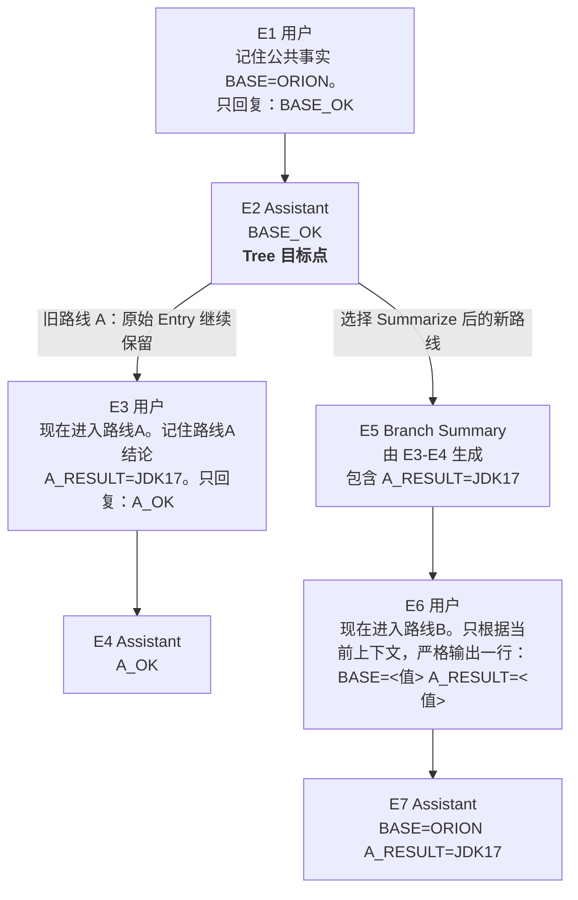

# Pi Session、Tree 与 Compaction

Session 负责保存工作历史，Tree/Fork/Clone 负责组织分支，Compaction 负责控制有效上下文，Branch Summary 负责把离开路线的结论带到新路线。完成状态仍以 [完整学习计划](../plans/pi-complete-learning-plan.md) 为准。

## Session 是什么

Session 是 Pi 自动保存在本机的一次工作会话记录，不是模型的永久记忆，也不是项目版本快照。Session 以启动 Pi 时的工作目录作为项目作用域。

所有项目的 Session 根目录：

```text
~/.pi/agent/sessions/
```

Pi 会把工作目录编码为子目录。当前仓库对应的目录用占位符表示为：

```text
<project-session-dir>/
```

这表示 Session 属于 `<repo-root>` 这个工作目录，但文件保存在用户目录中，不在 Git 仓库内。换到其他项目启动 Pi，会使用另一个按 `cwd` 编码的项目分组目录。

Session 通常包含：

- 用户消息和模型回复。
- Tool Call、工具参数和 Tool Result。
- 使用的 Provider、Model 和会话元数据。
- Token、费用、分支和上下文压缩相关记录。

Session 有三个不同标识：

| 对象 | 用途 | 改名时是否变化 |
|---|---|---|
| Session ID | Pi 定位 Session 的机器标识 | 不变 |
| File | JSONL 的磁盘路径 | 不变 |
| Name | `/resume` 等界面显示的人类标签 | 变化 |

使用 `--name <名称>` 可在启动时命名，使用 `/name <名称>` 可修改当前名称。改名是在原 JSONL 中追加元数据，不会创建新 Session。

## 自动保存边界

Pi `0.84.0` 会预先分配 Session ID 和目标路径，但路径显示出来不代表文件已经存在：

| 状态 | `/session` 显示路径 | JSONL 是否落盘 |
|---|---|---|
| 只启动、命名，没有 Assistant 回复 | 是 | 否 |
| 已出现第一条 Assistant 回复 | 是 | 是，运行中自动追加 |

未发送的输入框草稿不属于 Session。`/quit` 不是保存按钮；第一条 Assistant 回复完成后，已有记录在 Pi 运行期间就会写入磁盘。

`--no-session` 只关闭持久化，不会取消运行中的内存 Session。当前进程仍保留消息、回复和统计；退出后没有可供 `pi -c` 恢复的 JSONL。

## JSONL 文件结构

Session 文件是追加式 JSONL：每行是一个 JSON 对象，Pi 按事件发生顺序追加记录。第一行固定为 Header，后续行为记录为 Entry。它与 `pi --mode json` 的运行事件流不是同一对象：前者用于持久化和恢复 Session，后者用于向外输出本次运行的实时事件。

识别时先看顶层 `type`；只有 `type=message` 时，再看内层 `message.role`。不需要背诵全部字段。

| 对象 | 识别方式 | 关键边界 |
|---|---|---|
| Session Header | 第一行 `type=session` | 记录版本、Session ID、创建时间和 `cwd`；不是消息，不属于 Session Entry 树，不计入 Messages Total |
| Session 名称 | `type=session_info` | `/name` 等操作追加的显示元数据，不在 Header 中 |
| 用户或模型消息 | `type=message`，`role=user/assistant` | 属于 Session Entry 树；Assistant 行同时记录实际 Provider、Model、用量和停止原因 |
| Tool Call | Assistant Message 的 `content` 中 `type=toolCall` | 不是独立顶层 Entry |
| Tool Result | `type=message`，`role=toolResult` | 通过 `toolCallId` 对应 Tool Call |
| 模型切换 | `type=model_change` | 记录后续使用的 Provider 和 Model；不是聊天消息 |
| Extension 状态 | `type=custom` | 持久化 Extension 数据，不进入模型上下文 |
| Extension 消息 | `type=custom_message` | 进入模型上下文；`display` 决定是否在 TUI 显示 |

除 Header 外，Session Entry 使用 `id` 和 `parentId` 形成 Session Entry 树，也称会话树。文件可以保留全部分支；Pi 构建模型上下文时只沿当前活动路径取 Entry，并按条目类型决定是否转换成消息。

## 继续当前项目的 Session

先进入曾经启动 Pi 的项目目录，再执行恢复命令：

```bash
cd <repo-root>
pi -c
```

`pi -c` 会继续当前项目最近一次 Session。在其他目录执行，会查找那个目录对应的 Session，而不是 `pi-study` 的记录。

常用入口：

| 命令 | 含义 |
|---|---|
| `pi -c` | 继续当前项目最近一次 Session |
| `pi -r` | 浏览并选择当前项目的历史 Session |
| `pi --session <路径或 ID>` | 恢复明确指定的 Session |
| `pi --session-dir <目录>` | 覆盖本次 Session 的存储和查找目录 |
| `pi --no-session` | 仅保留运行期内存状态，不持久化 JSONL |
| `/session` | 查看当前 Session 文件、ID、消息、Token 和费用 |
| `/resume` | 在 Pi 内选择当前项目的历史 Session |
| `/new` | 新建 Session |
| `/name <名称>` | 修改当前 Session 的显示名称 |
| `/tree` | 查看并跳转会话树节点 |
| `/fork` | 从较早的用户消息创建新 Session |
| `/clone` | 将当前活动分支复制为新 Session |

`pi -c` 和 `/resume` 都加载原 JSONL，不会复制文件。恢复时仍要使用对应工作目录和 Session 存储位置；换到其他目录，默认查找的是另一个项目分组。

## Session Entry 树与活动路径

Session 中的 Entry 不是只能形成一条直线。每条 Entry 都有自己的 `id`，并通过 `parentId` 指向父 Entry；多个 Entry 指向同一个父 Entry 时，会话树就形成分支。

Pi 从当前叶子沿 `parentId` 回溯到根节点，得到当前活动路径。Model 下一次请求使用这条活动路径，而不是把树中所有路线同时放入上下文。`/session` 的消息统计会覆盖 Session 中保留的全部消息 Entry，因此分支后的 Total 可能大于当前活动路径的消息数。

`/clone` 复制当前活动路径中的 Session Entry，不复制整个会话树。例如 Session 同时有 `A -> B` 和 `A -> C` 两条路线，当前位于 C 时，Clone 只复制 `A -> C`，不会复制 B 路线。

## Tree、Fork 与 Clone

先分清两个层次：Tree/Fork/Clone 处理 Session Entry 和路线；Git 管理项目文件版本。三种操作都保持当前工作目录 `cwd` 不变，都不会复制项目目录。Fork 和 Clone 的区别只在新 Session 包含哪些 Entry，以及编辑器是否回填提示。

| 特性 | `/tree` | `/fork` | `/clone` |
|---|---|---|---|
| 目的 | 在原 Session 中切换旧位置并保留多条路线 | 从一条历史用户提示之前建立独立 Session | 把当前活动路径复制为独立 Session |
| 项目目录 `cwd` | 不变 | 不变 | 不变 |
| 是否复制项目目录 | 否 | 否 | 否 |
| Session 文件 | 不变 | 新建 | 新建 |
| Session Entry 边界 | 不复制，仍使用原会话树 | 复制到所选用户消息的父 Entry | 复制到当前活动叶 Entry |
| 编辑器 | 选择用户消息时恢复原提示，供修改后续写 | 恢复所选用户提示，供修改后发送 | 清空 |
| 原路线或源文件 | 原路线继续保留在同一棵树中 | 源文件不变 | 源文件不变 |
| 分支摘要 | 切换路线时可以选择生成 | 不生成 | 不生成 |

三者只处理 Session 历史，不会复制、恢复或切换项目文件，也不会创建或切换 Git 分支。即使对话回到了更早位置，`cwd` 仍指向同一个项目目录，其中的文件保持当前真实状态；需要可靠恢复项目文件时仍使用 Git。

### Java 项目完整场景

项目目录 P 中有 `DiscountService.java`。Git 已提交的文件版本是 V1；当前 Session S1 中，用户先让 Pi 分析需求，再让 Pi 实现“会员九折”，Pi 将工作区文件修改为 V2：

```text
Session S1：需求分析 -> 实现会员九折 -> 修改完成
项目目录 P：DiscountService.java = V2
```

下面三种操作都从这个状态分别开始，不是依次执行。

#### Tree：同一 Session 中保留两条对话路线

使用 `/tree` 选择“实现会员九折”的用户消息，原提示回到编辑器。修改后发送会在 S1 的原会话树中增加路线，仍写入同一个 S1 JSONL，不创建新文件：

```text
需求分析
├── 实现会员九折 -> 原回复
└── 新提示       -> 新回复
```

对话位置虽然回到了旧提示，项目目录仍是 P，`DiscountService.java` 仍是当前工作区中的 V2，不会自动恢复为 V1。

#### Fork：从历史提示之前建立独立 Session

使用 `/fork` 选择“实现会员九折”，Pi 新建 Session S2。S2 只复制该提示之前的“需求分析”问答，并把“实现会员九折”放回编辑器。源 Session S1 保持不变。

项目目录仍是 P，文件仍是 V2；Fork 不会创建项目目录 P2。如果 S2 后续把文件修改为 V3，切回 S1 时看到的也会是 V3。

#### Clone：复制当前活动路径

使用 `/clone`，Pi 新建 Session S3，复制 S1 当前活动路径中的 Session Entry，并清空编辑器。它不复制 S1 中未处于当前路径的其他分支；源 Session S1 保持不变。

项目目录仍是 P，文件仍是 V2；Clone 不会创建项目目录 P3。如果 S3 后续把文件修改为 V3，切回 S1 时看到的也会是 V3。

因此，Tree/Fork/Clone 能保留不同的 Session Entry 结构，但不能保留三份独立的项目文件状态。可靠保存和恢复 V1、V2、V3 需要单独使用 Git 管理文件版本。

### Pi 0.84.0 实现边界

- `/tree` 在原 Session 内改变活动叶节点。
- 交互式 `/fork` 调用 runtime `fork(entryId)`，默认位置为 `before`。
- `/clone` 读取当前叶节点，调用 runtime `fork(leafId, { position: "at" })`。
- Fork 和 Clone 替换当前 Session runtime 时继续传入原 `cwd`；它们没有复制项目目录的步骤。
- Fork 和 Clone 的新 JSONL header 都用 `parentSession` 记录源文件。
- Fork 和 Clone 会继承显示名称，但 Session ID 与 File 都会变化；名称相同不代表身份相同。

## 导出、分享与删除

| 操作 | 数据去向 | 原 Session | 关键边界 |
|---|---|---|---|
| `/export <路径>.html` | 本地 HTML | 保留 | 不自动脱敏 |
| `/export <路径>.jsonl` | 本地 JSONL 副本 | 保留 | 可用于备份或导入 |
| `/share` | GitHub secret gist | 保留 | 无二次确认，数据离开本机 |
| `/resume` 中 `Ctrl+D` | 废纸篓或永久删除 | 删除 | 当前活动 Session 禁止删除 |

`/share` 的完整链路是：

```text
本地 Session -> 临时 HTML -> gh 上传 secret gist -> 生成 gist 与查看链接
```

Secret gist 只是不公开列出，不是权限受控的私有存储；获得 URL 的人可以访问。`/share` 不会自动检查或删除 Session 中的文件内容、日志、路径和其他敏感信息，因此默认不应对真实工作 Session 执行。

删除时，Pi 先调用系统 `trash` 命令；失败后回退为永久删除。界面显示 `Session moved to trash` 只能证明 Pi 选择了废纸篓路径，恢复前仍应确认目标文件实际存在。重要 Session 应先导出 JSONL 备份。

## 3.1 隔离实验结果

| 实验 | 直接证据 | 结论 |
|---|---|---|
| 空 Session | `/session` 显示 Name、ID 和 File，退出后 JSONL 数为 `0` | 预分配路径不等于落盘 |
| 自动保存 | 首条 Assistant 回复后、Pi 未退出时，JSONL 已存在 | 保存不依赖 `/quit` |
| 改名 | Name 改变，ID、File 和文件数量不变 | 名称不是身份 |
| `pi -c` | 对话、名称、ID 和 File 均恢复，仍是原 JSONL | 继续不是复制 |
| 本地导出 | HTML 与 JSONL 副本存在，原文件大小和行数不变 | 导出不修改原 Session |
| 删除 | 活动 Session 被拒绝；切换后确认删除并报告移入废纸篓 | 活动保护与删除回退均存在 |

分享未执行：课程只验证了本机 `0.84.0` 的命令说明和实现链路，没有向 GitHub 上传实验 Session。删除后原目录已无 JSONL，本地导出备份存在；macOS 拒绝 Codex 读取 `~/.Trash`，因此废纸篓目标文件未取得直接存在性证据。

## 3.2 隔离实验结果

| 实验 | 文件与消息证据 | 结论 |
|---|---|---|
| Tree | 一个 JSONL 从 `2418` 增至 `3356` 字节；会话树中保留 6 条 Message Entry 和两条路线 | 同一文件内切换位置并追加路线 |
| Fork 创建 | 新文件初始 `1620` 字节、只含 2 条 `BASE_A` 消息；所选提示回到编辑器 | 新建 Session，并在所选用户消息之前截断 |
| Fork 续写 | Fork 文件增至 `2543` 字节，Tree 文件仍为 `3356` 字节 | 新 Session 独立增长，不改源文件 |
| Clone 创建 | 第三个文件初始 `2543` 字节，与 4 消息的 Fork 源文件同大小；编辑器为空 | 完整复制当前活动路径中的 Session Entry，不复制项目目录 |
| Clone 续写 | Clone 文件增至 `3494` 字节，前两个文件保持 `3356/2543` 字节 | Clone 后独立增长，不改两个源文件 |

## 3.3 隔离实验结果

实验 Session 只包含固定文本、一次 `read`、一次模型切换和两个已审查的官方示例 Extension。原始 JSONL 未展示；结构投影只保留条目类型、消息角色、Tool/Model 名称和上下文边界。

| 行 | 脱敏结构 | 证明内容 |
|---:|---|---|
| 1 | `session` | Header 是 Session 元数据，不是聊天消息 |
| 2 | `session_info` | 显示名称与 Header 分开追加 |
| 3-4 | `model_change`、`thinking_level_change` | Model 和 Thinking 是独立设置 Entry |
| 5-8 | `user -> assistant(toolCall=read) -> toolResult(read) -> assistant` | Tool Call 嵌在 Assistant Message 中，Tool Result 是独立 Message Entry |
| 9 | `custom(status-card)` | Extension 状态已持久化，但不进入模型上下文 |
| 10 | `custom_message(status-update)` | Extension 消息已持久化，并进入模型上下文 |
| 11-12 | `user -> assistant` | 模型只识别出进入上下文的自定义消息 |
| 13 | `model_change(gpt-5.6-terra)` | 切换模型会追加设置 Entry，不产生聊天消息 |

文件共 13 行，`/session` 显示 Messages Total 为 6；Header、设置和自定义 Entry 也占文件行，但不都计入消息总数。识别顺序是 `type -> role -> Tool/Model/关联字段`，无需默写完整 Schema。

## 3.4 Token、Context Window 与压缩参数

一次模型请求包含系统提示、工具定义、当前活动路径消息、Tool Result 和本轮用户输入。四个相关对象分工如下：

| 对象 | 含义 | 不是 |
|---|---|---|
| Token | 模型计量输入、输出、历史消息和工具结果的单位 | 字符数或消息条数 |
| Context Window | 单次模型请求可容纳的 Token 上限，例如 `272k` | Session 文件大小或累计用量上限 |
| `Reserve Tokens` | 为模型本轮回复预留的空间，默认 `16384` | 已经占用的 Token |
| `Keep Recent Tokens` | 压缩时尽量原样保留的最近 Token 预算，默认 `20000` | 最近消息条数；旧内容会被摘要 |

自动压缩的判断近似为：

```text
当前上下文 Token > Context Window - Reserve Tokens
```

因此窗口为 `272000`、预留 `16384` 时，阈值约为 `255616`。达到阈值后，Pi 总结较早内容，并尽量保留最近约 `20000` Token 的原文；本节只记录参数关系，实际压缩前后变化见 3.5。

### Footer A/B 实验

实验使用隔离临时目录、`--no-session` 和 `--no-tools`，分别发送 `只回复：TOKEN_A` 与 `只回复：TOKEN_B`。未读取或保存原始 Session。

| 时点 | Footer 统计 | 直接证据 |
|---|---|---|
| `TOKEN_A` 后 | `↑924 ↓6 R3.8k CH80.6% $0.003 1.8%/272k (auto)` | 首次请求产生累计输入、输出和缓存读取 |
| `TOKEN_B` 后 | `↑1.9k ↓12 R7.7k CH80.3% $0.005 1.8%/272k (auto)` | 第二次请求继续累加累计统计，当前上下文显示仍为 `1.8%/272k` |

Footer 中：`↑/↓` 是 Session 累计输入/输出 Token，`R/W` 是缓存读取/写入 Token，`CH` 是最近一次缓存命中率；`R` 不是 `Reserve Tokens`。`x.x%/窗口` 是当前上下文占比，按一位小数显示；`(auto)` 只表示自动压缩已开启，不表示本次已经压缩。

这次 A/B 证明累计用量与当前上下文占用是两条不同指标：累计统计会继续增加，而很小的当前上下文变化可能因四舍五入仍显示为同一个百分比。

## 3.5 手动 Compaction

手动输入 `/compact` 会立即调用 Model 总结较早上下文，不需要等到自动阈值。命令后可附加摘要关注点，例如要求保留关键标识；这只能提高摘要保留概率，关键事实仍需压缩后验证。

压缩后的当前上下文由两部分组成：

| 区域 | 内容 | JSONL 边界 |
|---|---|---|
| 摘要区 | `firstKeptEntryId` 之前的较早内容，由 Compaction Summary 代替原文进入 Model | 原始 Entry 仍保留在 Session 文件中 |
| 近期原文区 | 从 `firstKeptEntryId` 指向的 Entry 开始，继续以原文进入 Model | `Keep Recent Tokens` 决定近似保留规模，不按消息条数切分 |

因此，`firstKeptEntryId` 表示“从哪条历史 Entry 开始继续保留原文”，不是“从哪条开始删除”。Compaction 会追加一个新 Entry，不会删除前面的 JSONL 行，也不能恢复或版本化项目文件。

### 隔离实验

实验关闭自动压缩，将 `keepRecentTokens` 设为 `500`，用两个由单 `!` 生成的 Shell Entry 分别构造较早内容和近期内容。近期块超过 500 Token，确保切分点落在近期 Entry，再执行带固定事实关注点的 `/compact`。

| 时点 | 结果 | 说明 |
|---|---|---|
| 压缩前 | `6.8%/272k` | 较早块和近期块都在当前上下文中 |
| 手动压缩 | `Compacted from 18,438 tokens` | 摘要生成调用 Model；累计输入、输出和费用继续增加 |
| 刚压缩完成 | `?/272k` | 尚无新的普通 Model 请求，暂时没有刷新后的上下文用量 |
| 验证请求完成 | `2.3%/272k` | 当前上下文明显缩小；较早固定事实可从摘要恢复，近期固定事实可从原文恢复 |

脱敏 JSONL 投影显示：Session 共 13 行，第 11 行是唯一 Compaction Entry，`tokensBefore=18438`；`firstKeptEntryId` 指向第 10 行的近期 `bashExecution`，第 9 行较早的 `bashExecution` 仍在原文件中；压缩后的验证请求和回复位于 Compaction Entry 之后。投影只检查类型、行序、计数、长度和关联关系，没有输出消息或摘要正文。

这个实验同时证明两条统计不能混用：Compaction 后当前上下文从 `6.8%` 降到 `2.3%`，但 Session 累计 Token 因摘要调用和后续验证继续上升。

## 3.6 Branch Summary

Branch Summary 不是 Compaction。它在 `/tree` 切换路线时，把被离开路线的关键信息总结后接入新路线；旧路线的原始 Entry 继续保留在同一个 Session 中。

### 完整实验与总结边界

实验先建立公共路径和路线 A：

| Entry | 完整内容 | 作用 |
|---|---|---|
| E1 用户 | `记住公共事实 BASE=ORION。只回复：BASE_OK` | 公共事实 |
| E2 Assistant | `BASE_OK` | `/tree` 中选择的目标点 |
| E3 用户 | `现在进入路线A。记住路线A结论 A_RESULT=JDK17。只回复：A_OK` | 路线 A 独有事实 |
| E4 Assistant | `A_OK` | 路线 A 的叶节点 |

在 `/tree` 选择 E2，表示“从 E2 之后建立新路线”，不是选择 E2 作为待总结内容。选择 `Summarize` 后：

```text
E1 用户：BASE=ORION
E2 Assistant：BASE_OK       <- 选中的目标点，公共原文保留到这里
---------------------------------------------
E3 用户：A_RESULT=JDK17     <- Branch Summary 从这里开始总结
E4 Assistant：A_OK          <- 总结到旧路线叶节点
---------------------------------------------
```

Pi 由 E3-E4 生成 E5 Branch Summary，再沿新路线 B 继续：

| Entry | 完整内容 | 进入路线 B 的方式 |
|---|---|---|
| E5 | `Branch Summary`，包含路线 A 的结论 `A_RESULT=JDK17` | 摘要 |
| E6 用户 | `现在进入路线B。只根据当前上下文，严格输出一行：BASE=<值> A_RESULT=<值>` | 新用户消息 |
| E7 Assistant | `BASE=ORION A_RESULT=JDK17` | 同时使用公共原文和分支摘要 |



最终活动路径是 `E1 -> E2 -> E5 -> E6 -> E7`；旧路线 A 仍是 `E1 -> E2 -> E3 -> E4`。`/tree` 实测显示 7 个 Entry 和两条兄弟路线，证明 Branch Summary 没有覆盖或删除 E3-E4。

### JSONL 脱敏结构

下表的“行”是 JSONL 物理行号；E1-E7 是上文为会话树添加的教学编号，两者不要混用。

| JSONL 行 | 脱敏结构 | 父子关系 |
|---:|---|---|
| 1 | `session` | Header，不属于 Session Entry 树 |
| 2-4 | `session_info -> model_change -> thinking_level_change` | 启动元数据与设置 |
| 5-6 | `user -> assistant` | 上文 E1-E2，公共路径 |
| 7-8 | `user -> assistant` | 上文 E3-E4，旧路线 A；第 7 行仍以第 6 行为父节点 |
| 9 | `branch_summary` | 以第 6 行为父节点，形成新路线；摘要长度 638 字符并带独立用量记录 |
| 10-11 | `user -> assistant` | 上文 E6-E7，接在第 9 行摘要之后 |

文件共 11 行，其中 6 条 Message（3 个 User、3 个 Assistant）、1 条 Branch Summary、0 条 Compaction。旧路线 A 的第 7-8 行没有被删除；当前路线通过第 9 行摘要接到第 10-11 行。

本机 Pi `0.84.1` 的 `navigateTree()` 先收集旧叶子到共同祖先之间的 Entry，本实验即 E3-E4；随后把 Branch Summary 挂到新的叶节点 E2。当前实现写入的 `parentId` 与 `fromId` 都指向 E2，因此不能只看 `fromId` 推断旧路线叶节点 E4；真正的总结范围由导航时收集的旧路线决定。

### 与 Compaction 的差异

| 对比项 | Branch Summary | Compaction |
|---|---|---|
| 触发场景 | `/tree` 离开当前路线时选择 `Summarize` | 手动 `/compact`、自动阈值或溢出恢复 |
| 处理范围 | 旧叶子到共同祖先之间的旧路线，不含共同祖先 | 当前活动路径中的较早上下文 |
| 目的 | 把旧路线的结论带到新路线 | 缩小当前有效上下文 |
| 新路线使用方式 | 公共路径原文 + Branch Summary + 新消息 | Compaction Summary + 近期原文 + 新消息 |
| 原始 JSONL | 旧路线 Entry 继续保留 | 较早 Entry 继续保留 |
| 是否有损 | 是，摘要可能遗漏细节 | 是，摘要可能遗漏细节 |

Pi `0.84.1` 在 `branchSummary.skipPrompt=false` 时提供 `No summary`、`Summarize` 和 `Summarize with custom prompt`。默认 `Summarize` 会调用 Model，因此累计输入、输出和费用会上升；短分支生成摘要后，Footer 的当前上下文百分比可能几乎不变。

## 3.7 可恢复的长任务断点

断点记录任务的执行状态，不复制完整聊天记录，也不备份项目文件。新 Session 应能仅凭断点和工作区判断“已验证什么、现场是什么、唯一下一步是什么”。

### 最小模板

```markdown
### 当前断点

- 目标与验收：
- 状态：未开始 / 进行中 / 待验证 / 阻塞 / 已完成
- 已完成及证据：
- 当前工作状态：
- 未完成：
- 下一步：
- 约束：
```

`下一步` 必须是一个可直接执行的动作，不能只写“继续处理”；`已完成及证据` 必须引用实际测试、输出或结构检查，不能只记录执行意图。

### 恢复顺序

```text
读取断点 -> 核对工作区 -> 执行唯一下一步 -> 验证结果 -> 回写新断点
```

断点可能落后于工作区。例如断点仍写“修改未完成”，但文件已经改变，说明上次 Session 可能在改完文件后、回写断点前退出。恢复者不能盲目重做，也不能直接标记完成：应先将现场理解为“修改已发生、待验证”，测试通过后再写入完成证据。

### 双 Session 实验

实验把同一任务拆成两个独立 Session，原始 Session 正文未展示。

| 阶段 | 行为与证据 | 结论 |
|---|---|---|
| 初始基线 | `STATE=V1` 时运行完整验证，输出 `VERIFY_FAIL` | 验证脚本能识别未完成状态 |
| Session A | 将状态改为 V2，局部 `rg` 输出 `3:STATE=V2`，断点把下一步写为 `bash verify.sh`，未运行完整验证 | 中断前留下现场、证据和唯一下一步 |
| Session A 顺序问题 | 先把“局部检查通过”写入断点，后执行 `rg`；本次最终虽通过，顺序仍不可靠 | 必须先取得证据，再写完成记录 |
| Session B | 新 Session 读取断点和工作区，先运行 `bash verify.sh` 得到 `VERIFY_OK`，随后才更新断点为已完成 | 不依赖旧聊天也能恢复；验证先于回写 |
| 退出后结构 | 两份独立 JSONL 分别命名为 `3.7-checkpoint-a`、`3.7-checkpoint-b`，结构投影为 `19/15` 与 `17/13` 个 Entry/Message | A、B 是两个 Session；检查未读取消息正文 |

最终断点中“未完成”和“下一步”均为“无”。这只能证明本实验满足验收，不代表 Session、断点或测试能够替代 Git 版本恢复。

## Session、断点、工作区与 Git

| 对象 | 保存内容 | 恢复职责 |
|---|---|---|
| Session | 对话、工具调用、工具结果和会话结构 | 重建对话上下文，不能可靠恢复项目文件 |
| 断点 | 目标、状态、证据、下一步和约束 | 指导任务恢复；内容仍需与现场核对 |
| 工作区 | 当前实际文件，包括未提交修改 | 说明实际发生了什么，但不自动证明修改正确 |
| Git | 已提交版本、分支和差异 | 提供可靠的项目文件版本恢复 |

Session 可能包含读取过的文件内容、命令输出和其他敏感信息，不应默认提交、上传或公开分享。

Session 当前活动分支如何转换成 Model 的 `messages`，见 [架构与上下文](01-architecture-and-context.md) 的“盒子二：`messages`”。
