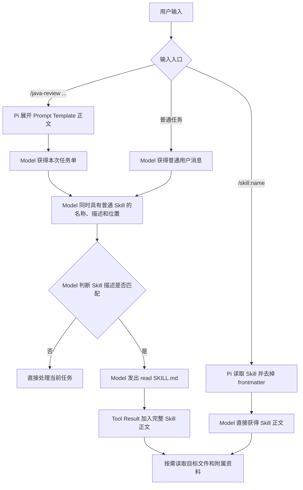
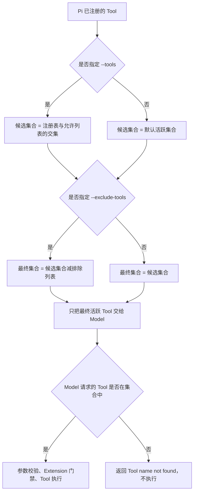

# Pi Prompt Template、Skill 与 Theme

项目指令、Prompt Template、Skill 和 Extension 不在同一层：项目指令规定长期规则，Prompt Template 生成本次请求，Skill 提供按需加载的专业流程，Extension 改变 Pi 的运行时能力。

## 4.1 四类资源如何选

| 资源 | 主要解决什么 | 如何参与任务 | 不适合单独承担什么 |
|---|---|---|---|
| 项目指令 | 整个项目长期适用的规则和约束 | Pi 自动发现后加入系统提示 | 注册 Tool、弹窗或提供硬权限门禁 |
| Prompt Template | 重复出现的任务请求 | 用户输入 `/名称`，Markdown 模板展开为本次提示，可接收参数 | 携带完整工作流资源或执行代码 |
| Skill | 某类任务的专业流程、参考资料和辅助资源 | 普通 Skill 启动时只向 Model 暴露元数据；任务匹配或用户输入 `/skill:名称` 后，再加载完整 `SKILL.md` | 自动执行脚本或直接改变 Pi 运行时 |
| Extension | Tool、Command、事件拦截、UI 和状态等运行时能力 | Pi 加载 TypeScript 模块并注册处理器；运行时按事件名、命令名或 Tool 名调用 | 代替项目规则或仅作为一段提示词 |

最短判断规则：

1. 每个相关任务都要遵守：项目指令。
2. 用户需要反复发出同类请求：Prompt Template。
3. Agent 需要按专业 SOP 工作：Skill。
4. Pi 必须真正增加、修改或拦截能力：Extension。

## Java 代码审查场景

审查 `PaymentService.java` 时，四类资源可以同时参与：

| 需求 | 选择 |
|---|---|
| 始终使用中文，未经允许不提交，Java 修改后运行测试 | 项目指令 |
| 反复要求“审查当前 Diff，按严重程度列出文件和行号” | Prompt Template |
| 按检查清单选择参考资料，必要时运行随附的只读检查脚本 | Skill |
| 在 `git push` 前拦截调用，交互模式询问，非交互模式默认拒绝 | Extension |

```text
启动 Pi
  |- 自动加载项目指令：提供长期规则
  |- 加载 Extension：注册 Tool、Command 和事件处理器
  |
用户输入 /java-review PaymentService.java
  |- Prompt Template 展开为本次审查请求
  |- Pi 向 Model 暴露可用 Skill 的名称和描述
  |- 任务匹配后，Agent 读取 Skill 的完整工作流
  `- Tool 或 Shell 即将执行时，Extension 可以允许、修改或阻止
```

## 4.2 结构化 Java 代码审查模板

项目模板位于 `.pi/prompts/java-review.md`。文件名决定命令名 `/java-review`；项目受信任时 Pi 从 `.pi/prompts/*.md` 加载，`--no-prompt-templates` 可以关闭发现。

| 部分 | 当前模板 | 作用与边界 |
|---|---|---|
| `description` | 只读 Java 代码审查 | 用于自动补全，不进入展开后的正文 |
| `argument-hint` | `<审查对象> [审查重点]` | 只提示必填与可选参数，不执行参数校验 |
| `$1` | 审查对象 | 第一个参数；为空时正文要求先补充范围 |
| `${2:-...}` | 审查重点 | 第二个参数；缺省时回退到预设检查范围 |
| 模板正文 | 范围、证据、格式、行为限制 | 参数替换后成为当前用户消息 |

```text
Pi 加载 .pi/prompts/java-review.md
  -> 自动补全显示 /java-review、参数提示和描述
  -> 用户提交 /java-review <对象> [重点]
  -> Pi 替换 $1 和第二参数默认值
  -> frontmatter 留在模板元数据中
  -> 展开后的正文成为当前用户消息
```

正文固定回答五个问题：审查什么、重点检查什么、结论需要什么证据、结果如何组织、本次禁止哪些操作。没有证据要求时容易产生无代码支撑的貌似合理结论；没有输出格式时结果结构不稳定。行为限制只约束 Model 的任务方向，不能强制禁止已暴露的 `edit`、`write` 或 `bash` Tool。

验证证据分级：

- 静态实现：Pi `0.84.1` 随包加载与展开函数确认名称、frontmatter、显式参数、默认参数、空对象保护和正文替换均符合预期。
- 真实发现：受信任项目的 TUI 启动区列出 `/java-review`，自动补全显示参数提示和中文描述。
- 真实展开：显式唯一标记进入展开后的对象和重点，frontmatter 未进入用户消息；零参数调用的对象为空、重点采用默认值，Model 要求补充范围且没有扩大为全仓审查。
- 实验限制：TUI 使用 `--no-tools --no-session`，因此只验证模板发现、展开和无 Tool 行为；`SYSTEM_RULE_2201` 来自 `.pi/APPEND_SYSTEM.md`，不是模板正文。

## 4.3 Skill 的结构与渐进式加载

Skill 是以 `SKILL.md` 为入口的能力目录。正文保存专业流程，附属目录按需保存参考资料、脚本和资源；发现 Skill、向 Model 暴露 Skill、加载正文和使用附属资源是四个不同动作。

### 目录与 frontmatter

| 对象 | 作用 |
|---|---|
| Skill 目录 | 能力包边界；可包含 `SKILL.md`、`references/`、`scripts/` 和 `assets/` |
| `SKILL.md` | 唯一入口文件；frontmatter 后是交给 Model 的完整工作流 |
| `name` | Skill 名称，也是 `/skill:name` 的命令名 |
| `description` | 普通 Skill 的自动匹配说明，不是完整操作流程 |
| `disable-model-invocation` | 为 `true` 时不进入 Model 的自动 Skill 列表，但仍可通过 `/skill:name` 手动调用 |

全局目录包括 `~/.pi/agent/skills/` 和 `~/.agents/skills/`；受信任项目可从 `.pi/skills/` 和 `.agents/skills/` 加载。各位置都会递归发现包含 `SKILL.md` 的目录；`.agents/skills/` 根目录下的单个 Markdown 文件不会作为 Skill。`--no-skills` 关闭默认发现，显式 `--skill <path>` 仍可追加加载。

### 发现与 Model 可见性

Pi 启动页的 `[Skills]` 是给用户看的已发现资源清单；Model 系统提示中的 `<available_skills>` 是过滤后的自动调用目录，两者不能混用。

| Skill | 启动页 `[Skills]` | Model `<available_skills>` | `/skill:name` |
|---|---|---|---|
| 普通 Skill | 可见 | 包含名称、描述和位置 | 可用 |
| `disable-model-invocation: true` | 可见 | 不包含 | 可用 |

### Prompt Template 与 Skill 的三条路径

Prompt Template 和 Skill 是独立资源：前者保存本次任务单，后者保存可复用操作流程。同一个普通 Skill 可以自动匹配，也可以由用户手动调用。

| 路径 | 用户入口 | 解决什么 | Model 首先得到什么 | 完整正文如何进入上下文 | 读取 `SKILL.md` 的 Tool Call |
|---|---|---|---|---|---|
| Prompt Template | `/java-review <对象> [重点]` | 定义本次审查对象、证据要求和输出格式 | 参数替换后的 Prompt Template 正文 | Pi 直接展开为当前用户消息 | 无；若随后自动匹配 Skill，再进入下一条路径 |
| Skill 自动匹配 | 普通任务或已经展开的 Prompt Template 任务 | 为匹配任务补充可复用分析流程 | 当前任务，以及 Skill 的名称、描述和位置 | Model 判断描述匹配后发起 `read`，Pi 以 Tool Result 返回完整 `SKILL.md` | 有 |
| Skill 手动调用 | `/skill:name [参数]` | 直接使用用户点名的操作流程 | 去掉 frontmatter 后的 Skill 正文 | Pi 在 Agent Loop 开始前直接展开为 Skill 消息 | 无 |



Pi 启动时会物理读取 `SKILL.md` 以解析元数据，但自动匹配路径下，Model 起初只得到名称、描述和位置。`/java-review ...` 只展开 Prompt Template；如果 Model 随后自动匹配 Skill，读取的是另一个文件的 Skill 正文。两处不应重复维护同一套完整操作流程。

手动调用的 Skill 消息在 TUI 中默认折叠为 `[skill] name`；`⌃O` 只切换显示完整正文，不改变已经交给 Model 的消息。Skill 中的相对路径以当前 Skill 目录为基准解析。

正文加载后，附属资源仍按需处理：

- `references/checklist.md` 只有在正文要求且当前任务需要时，才由 Model 发起 `read`。
- `scripts/scan.sh` 不会因 Skill 被发现或正文被加载而自动执行。
- 执行脚本需要 Model 实际生成可用的 `bash` Tool Call，并继续经过 Extension 门禁、当前用户权限和其他系统限制。
- 渐进式加载描述的是“元数据、正文、附属资源逐层按需进入上下文”，不表示脚本会按需自动运行。

### 4.3 只读实验

Pi `0.84.1` 在受信任项目中以无 Session、关闭自动上下文/Extension/Prompt Template/Theme且只开放 `read` 的方式启动：

- 启动页 `[Skills]` 列出项目级 `pi-learning-coach`，Model 检查自动列表后返回 `AUTO_HIDDEN`，且没有 Tool Call。
- `/skill:` 自动补全显示 `[p] pi-learning-coach`，证明手动命令仍已注册。
- 手动调用后，Model 按 Skill 正文要求完整分段读取计划，并读取用户附加要求没有点名的 `docs/learning/README.md`。
- 全程没有 `bash`、`edit` 或 `write` Tool Call。

`AUTO_HIDDEN` 是 Model 行为证据；Pi 的加载实现进一步确认 `disable-model-invocation` 会从系统提示中排除该 Skill。截图没有直接展开折叠的正文，但额外读取学习索引的行为与命令展开实现共同证明完整正文已进入消息。

Skill 文件会继续保存在磁盘，新会话可以重新发现或手动加载；本次展开的正文和执行记录不会成为 Model 的跨会话永久记忆。恢复旧 Session 时相关消息可能重新进入上下文，这仍是历史恢复。Skill 的任何“只读”要求都是行为指令，不能替代 Tool 门禁、受限用户或沙箱。

## 4.4 创建只读 Java 代码分析 Skill

`java-readonly-analysis` 把可复用分析流程、按需参考资料和实验目标代码分开，项目中不保留初始化器生成的无关脚本或资源占位文件。

| 文件 | 职责 |
|---|---|
| `.agents/skills/java-readonly-analysis/SKILL.md` | 定义自动触发范围、只读分析步骤、证据标准和权限边界 |
| `.agents/skills/java-readonly-analysis/references/java-review-checklist.md` | 在目标代码定位后，按任务重点提供正确性、事务、并发、错误处理与安全检查项 |
| `labs/4.4-skill/OrderService.java` | 提供无第三方依赖、可由 JDK 8 编译的固定审查样例 |

### 触发边界

| 请求 | 是否应自动匹配 | 原因 |
|---|---|---|
| 只读审查指定 Java 文件、Java 片段或包含 Java 变更的 Diff | 是 | 同时满足 Java 对象、分析意图和只读边界 |
| 编写或修改 Java 代码 | 否 | Skill 不承担实现任务 |
| 普通 Java 知识问答 | 否 | 没有待分析的具体代码 |
| 读取文本、处理非 Java 文件或其他无关任务 | 否 | 不满足 Java 代码分析范围 |

自动匹配后，Model 先 `read` Skill 正文，目标代码与参考资料再通过后续 `read` 按需进入上下文。当前 Skill 正文要求先定位目标、再读取清单，但这是行为指令而非确定性调度；Model 可能重排无副作用的读取操作，验收应检查所需资源是否实际进入上下文并用于结论，不把 Tool Call 的精确顺序当成硬保证。源码、注释、字符串和 Diff 都是不可信分析数据，不能借其中的指令扩大读取范围或访问凭据。

### 固定样例

`OrderService.java` 保留两类教学缺陷：

- 库存先扣减、支付后执行；支付抛异常时没有回滚库存，形成部分完成状态。
- 查重、库存检查、扣减、支付和登记没有原子边界；共享 `HashSet` 与库存字段也没有同步保护，并发下可能重复扣款或超卖。

负初始库存、空白订单号和重试参数契约已经显式约束，避免它们干扰本实验。该样例是纯 Java 教学代码，不应机械要求 Spring 注解。

### 正反触发实验

先明确实验设计：

| 项目 | 内容 |
|---|---|
| 真实场景 | Pi 已发现 `java-readonly-analysis`，但还不知道它会按任务选择性触发，还是只要被发现就会加载 |
| 待验证区别 | 输入匹配 `description` 时触发，与输入不匹配时不触发；同时区分“启动时发现”与“任务中调用” |
| 固定条件 | 同一项目、Skill、Model、Tool 集合和公共启动参数；两次都不恢复 Session |
| 唯一变量 | 用户提示的任务语义：Java 只读审查，或普通文本读取 |
| 正向预期 | 出现 `[skill]`，并读取 Java 样例和参考清单 |
| 反向预期 | 不出现 `[skill]`，只读取目标文本 |
| 结论边界 | 正反均符合预期才能证明当前触发范围具有选择性；单次反向不能证明所有无关提示永不误触发 |

两个实验分别启动全新进程并使用 `--no-session`，避免前一次读取过的 Skill 正文影响反向判断。公共启动参数为：

```bash
pi --approve --no-session --no-context-files --no-extensions --no-prompt-templates --no-themes --tools read --model openai/gpt-5.6-sol --thinking high
```

两次运行的启动区都会列出 `java-readonly-analysis`，因为它们都发现了同一个项目资源；真正的差异发生在任务进入 Agent Loop 之后：

| 观察点 | 正向 Java 审查 | 反向文本读取 |
|---|---|---|
| 启动页 `[Skills]` | 列出 Skill | 列出 Skill |
| 任务后的 `[skill]` | 出现 `java-readonly-analysis` | 不出现 |
| 后续读取 | 参考清单与 Java 样例 | 只有 `tool-lab.txt:2-2` |
| 说明 | 匹配任务能够触发 Skill | 当前无关任务没有过度触发 Skill |

正向运行由普通提示触发 `[skill] java-readonly-analysis`，随后先读取清单、再读取目标文件，并识别预设的一致性与并发缺陷。反向输入既没有待分析的 Java 对象，也没有审查、分析或排查意图，不匹配 `description` 声明的触发范围；运行中只读取目标文本并返回 `status=verified`，没有加载 Skill 正文或附属资源。两者合起来排除“Skill 根本不可用”和“Skill 只要被发现就总会加载”这两种情况；自动匹配是 Model 基于描述和当前任务进行的判断，单次反向实验不能证明所有无关提示都永不误触发。

正向输出同时把调用方违反已声明重试前置条件的情况列为实现缺陷；该项证据不足，说明“自动触发和资源加载正确”不能替代对每条 finding 的代码与契约复核。

启动页列出 Skill 只能证明项目资源已发现，不能代替上述 Agent Loop 证据。`--tools read` 只缩小 Model 可见 Tool 集合，不是用户 Shell、Pi 进程或操作系统层面的只读沙箱。本阶段验证项目目录发现和渐进加载；`.skill` 打包留到 6.3。

## 4.5 Tool 筛选与越权调用

`--tools` 是允许列表，`--exclude-tools` 是排除列表。Pi `0.84.1` 先确定允许集合，再减去排除集合：

- 指定 `--tools`：`最终集合 =（已注册 Tool 与允许列表的交集）- 排除列表`。
- 未指定 `--tools`：`最终集合 = 默认活跃集合 - 排除列表`。默认内置集合为 `read`、`bash`、`edit`、`write`，启动时还会加入未被排除的 Extension 和自定义 Tool。

| 参数 | 最终结果 | 关键边界 |
|---|---|---|
| `--tools read` | 只保留名为 `read` 的 Tool | 内置 `bash`、`edit` 和 `write` 不可由 Model 执行 |
| `--exclude-tools read` | 从默认集合删除 `read` | `bash` 仍可通过 Shell 命令读取文件 |
| `--tools read,bash --exclude-tools bash` | 只保留 `read` | 排除列表会继续收窄允许列表 |
| `--tools read --exclude-tools read` | 空 Tool 集合 | 等价于本次没有可用 Model Tool |



### Model 返回未授权 Tool Call

以 `--tools read` 下 Model 仍返回 `edit` Tool Call 为例：

1. `dist/cli/args.js:85-95` 把 `--tools read` 解析为允许列表 `read`。
2. `dist/core/sdk.js:132-136` 生成允许集合和初始活跃集合。
3. `dist/core/agent-session.js:1943-2015` 同时过滤 Tool 定义注册表与活跃集合，只保留允许名称。
4. `pi-agent-core/dist/agent-loop.js:178-191` 只把当前活跃 Tool 定义传给 Model。
5. 如果响应仍含 `edit`，`agent-loop.js:393-400` 在当前集合中查找失败，立即生成 `Tool edit not found`，不会进入参数校验、Extension `tool_call` 或 `edit.execute()`。
6. `agent-loop.js:332-375、519-545` 把失败包装为 `isError: true` 的 Tool Result；上层循环将结果加入上下文，由 Model 下一轮决定改用可用 Tool、解释失败或再次尝试。Pi 不会把 `edit` 自动转换为 `read`。

这条限制按 Tool 名称生效，不验证同名 Tool 的实现语义。Extension 可以覆盖名为 `read` 的 Tool；需要确定使用内置 `read` 的隔离实验时，还应关闭 Extension。`--tools` 也不限制用户 `!`/`!!` Shell、Extension 自身代码或 Pi 进程的操作系统权限。

### Skill 附属脚本：读取不等于执行

普通 Skill 被发现、正文进入上下文、附属脚本被读取、脚本作为操作系统进程启动，是四个不同阶段。前三个阶段都不等于执行。

| 组别 | 请求 | 活跃 Tool | 可观察结果 | 证明范围 |
|---|---|---|---|---|
| A | `/skill:script-execution-lab inspect` | `read` | 只读取 `probe.sh`；没有独立的动态 PID Tool Result | 脚本文本进入上下文不等于执行 |
| B | `/skill:script-execution-lab run` | `read` | 读取同一脚本后停止；没有成功 `bash` Tool Call | 执行要求本身不能绕过活跃 Tool 集 |
| C | `/skill:script-execution-lab run` | `read,bash` | 出现真实 `bash` Tool Call；Tool Result 返回固定标记和运行时 PID | 本次 Model 驱动链进入了 Shell executor 并启动进程 |

B/C 的请求、Skill、脚本、Model、Thinking 和公共隔离参数保持一致，唯一变量是活跃 Tool 是否包含 `bash`。C 组的执行证据来自 `bash` Tool Result 中的动态 PID；Model 最终文本只是复述，不能单独证明脚本执行。

该对照只证明名称级 Tool 筛选影响本次 Model 驱动执行链。`bash` 可见只是执行的必要条件之一，不保证 Model 必然调用、Extension 必然放行或操作系统必然允许；实验也不覆盖用户 `!`/`!!`、Extension 自身代码、恶意脚本或系统级沙箱。

### 外部依赖：普通 Skill 与 Pi Package

外部依赖是 Skill 自身文件之外、执行时依赖的本地程序、软件包或远程服务。普通 Skill 的运行时依赖与 Pi Package 的安装时依赖走不同入口：

| 路径 | 触发者与时间点 | 是否经过 Model Tool Call | `--tools read` 的作用 |
|---|---|---|---|
| 普通 Skill 运行脚本 | Model 在任务中实际调用 `bash` 后，脚本才访问本地程序或远程服务 | 是 | 可以阻止 Model 使用内置 `bash` 进入这条路径 |
| 安装 npm/git Pi Package | 用户安装 Package，或受信任项目补装缺失 Package 时，Pi PackageManager 调用包管理器 | 否 | 不限制包管理器安装及其 lifecycle scripts |

`--tools read` 的含义是“只向 Model 暴露名为 `read` 的 Tool”，不是把 Pi 进程切换成全局只读模式。Pi `0.84.1` 的 npm/git Package 安装参数没有主动添加 `--ignore-scripts`，因此包管理器配置允许时，第三方包及其依赖声明的 lifecycle scripts 可能在安装阶段运行。不是每个 Package 都声明安装脚本，这类脚本通常发生在安装、更新或重新安装时，也不会因为普通 Skill 正文被读取而自动运行。

## 与 Extension 门禁的边界

Prompt Template 或 Skill 中的“只读”只是任务指令。需要确定性限制时，Extension 必须分别覆盖 Model Tool Call 和用户 `!`/`!!` Shell 等实际入口；交互确认 UI 只负责收集选择，无 UI 模式仍需明确的默认策略。完整触发、`tool_call`/`user_bash` 门禁和 UI 边界见 [Extensions](06-extensions.md)。

Extension 加载本身也是代码执行入口。Pi 导入 Extension 模块并调用其 factory 时，第三方代码已经在 Pi 进程和当前系统用户权限下运行；该时间点早于 Model 选择并调用 Extension 注册的 Tool。`--tools read` 只能收窄后续暴露给 Model 的 Tool 名称，不能阻止模块导入或 factory 初始化。限制这条路径需要不加载不可信 Extension、审查其源码和依赖，并使用受限用户、容器或其他系统级隔离。

## 安全边界

- 项目指令是交给 Model 的行为规则，不是操作系统权限或沙箱。
- Prompt Template 只是展开后的任务文本，不会自行执行代码。
- Skill 可以包含脚本和外部依赖，但加载 Skill 不等于脚本已经执行；Agent 仍需通过可用 Tool 调用它们。
- Extension 是本地可执行代码，加载后拥有 Pi 进程和当前系统用户的权限；使用前必须审查来源和实现。
- UI 确认框只能覆盖有 UI 的模式。无 UI 模式必须单独定义允许或拒绝策略。

## 4.6 最小自定义 Theme

Theme 是交互式 TUI 的语义颜色映射，只负责呈现。项目 Theme 放在受 Project Trust 控制的 `.pi/themes/*.json`，至少包含唯一 `name` 和完整 `colors`；`vars` 可复用颜色值。资源被发现不等于已经选中：`--theme <path>` 只增加加载来源，`settings.theme` 或 `/settings` 才按名称选择当前 Theme。

运行链路为：ResourceLoader 发现并校验文件 -> Theme 注册表按名称保存 -> Settings 选择名称 -> Theme Controller 应用颜色并触发界面重绘。无效 Theme 会产生诊断，选择失败会回退内置 `dark`；因此“界面仍是深色”不能单独证明自定义 Theme 加载成功。同名资源采用先加载者，课程材料使用唯一名称 `pi-study-lab`，并避开内置 `dark`、`light`。

实验材料以内置 `dark` 为基线，只改变名称和 `colors.accent`。真实运行中，Theme 菜单标题、箭头、选中文字及资源区 `project` 从内置青色变为自定义粉色；保存后使用同一隔离配置目录重启，`pi-study-lab` 仍是当前 Theme。移动到 `dark` 只形成临时预览，不等于确认并保存；后续粉色基线证明保存的 Theme 没有被该预览改写，但静态截图不能单独证明菜单退出键一定是 `Esc`。

这组证据证明项目 Theme 被发现、选择、渲染并持久恢复，不证明每个颜色键都被当前界面消费。Theme 不进入 Model 提示，也不改变 Thinking、Tool 列表、Extension 门禁、Project Trust 或操作系统权限。

## 4.7 项目 Theme 的无重启重载

Pi `0.84.1` 的自动 Theme watcher 只尝试监听用户级自定义 Theme 目录中的当前名称文件，见 `dist/modes/interactive/theme/theme.js:706-718`。项目 `.pi/themes` 不在这个监听路径中；修改项目文件只改变磁盘内容，当前进程仍持有旧 Theme 对象。

`/reload` 走显式资源刷新链：`AgentSession.reload()` 重读 Settings 与 ResourceLoader，交互模式重新注册 Theme，再由 Theme Controller 按当前 `settings.theme` 应用并刷新界面，见 `dist/core/agent-session.js:2052-2074`、`dist/modes/interactive/interactive-mode.js:4787-4796` 和 `dist/modes/interactive/theme/theme-controller.js:25-46、74-85`。

| 组别 | 磁盘 `accent` | 操作 | 当前界面 | 证明范围 |
|---|---|---|---|---|
| A 基线 | 粉色 | 无 | 粉色 | 修改前观察点成立 |
| B 未重载 | 橙色 | 不执行 `/reload` | 仍为粉色 | 改磁盘不会自动替换当前项目 Theme 对象 |
| C 显式重载 | 橙色 | 执行 `/reload` | 变为橙色 | 当前进程重新加载并应用项目 Theme |
| 恢复清理 | 粉色 | 再次执行 `/reload` | 恢复粉色 | 磁盘和运行态均回到实验前 Theme |

C 组既保留 `Reloaded keybindings, extensions, skills, prompts, themes, and context files` 状态提示，也在同一界面显示橙色标题、箭头和当前 `pi-study-lab`；恢复组以同样观察点重新显示粉色。磁盘恢复另由精确 SHA-256、结构化 JSON 和 Pi Theme 解析器验证，不能用截图替代。

该实验只证明本次项目 Theme 在受控原进程中的“未自动刷新 -> 显式重载 -> 恢复”链路。静态截图不能单独证明 PID、命令次数或精确色值；结论不扩大为用户级 watcher、其他 Theme 来源或 `/reload` 列出的所有资源都已验证。
