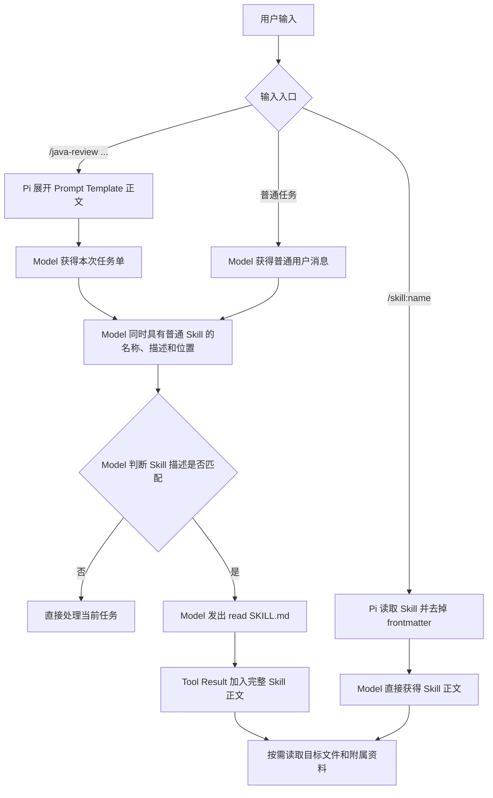

# Pi Prompt Template 与 Skill

项目指令、Prompt Template、Skill 和 Extension 不在同一层：项目指令规定长期规则，Prompt Template 生成本次请求，Skill 提供按需加载的专业流程，Extension 改变 Pi 的运行时能力。

## 4.1 四类资源如何选

| 资源 | 主要解决什么 | 如何参与任务 | 不适合单独承担什么 |
|---|---|---|---|
| 项目指令 | 整个项目长期适用的规则和约束 | Pi 自动发现后加入系统提示 | 注册 Tool、弹窗或提供硬权限门禁 |
| Prompt Template | 重复出现的任务请求 | 用户输入 `/名称`，Markdown 模板展开为本次提示，可接收参数 | 携带完整工作流资源或执行代码 |
| Skill | 某类任务的专业流程、参考资料和辅助资源 | 普通 Skill 启动时只向 Model 暴露元数据；任务匹配或用户输入 `/skill:名称` 后，再加载完整 `SKILL.md` | 自动执行脚本或直接改变 Pi 运行时 |
| Extension | Tool、Command、事件拦截、UI 和状态等运行时能力 | Pi 加载 TypeScript 模块并注册处理器；运行时按事件名、命令名或 Tool 名调用 | 代替项目规则或仅作为一段提示词 |

最短判断规则：

1. 每个相关任务都要遵守：项目指令。
2. 用户需要反复发出同类请求：Prompt Template。
3. Agent 需要按专业 SOP 工作：Skill。
4. Pi 必须真正增加、修改或拦截能力：Extension。

## Java 代码审查场景

审查 `PaymentService.java` 时，四类资源可以同时参与：

| 需求 | 选择 |
|---|---|
| 始终使用中文，未经允许不提交，Java 修改后运行测试 | 项目指令 |
| 反复要求“审查当前 Diff，按严重程度列出文件和行号” | Prompt Template |
| 按检查清单选择参考资料，必要时运行随附的只读检查脚本 | Skill |
| 在 `git push` 前拦截调用，交互模式询问，非交互模式默认拒绝 | Extension |

```text
启动 Pi
  |- 自动加载项目指令：提供长期规则
  |- 加载 Extension：注册 Tool、Command 和事件处理器
  |
用户输入 /java-review PaymentService.java
  |- Prompt Template 展开为本次审查请求
  |- Pi 向 Model 暴露可用 Skill 的名称和描述
  |- 任务匹配后，Agent 读取 Skill 的完整工作流
  `- Tool 或 Shell 即将执行时，Extension 可以允许、修改或阻止
```

## 4.2 结构化 Java 代码审查模板

项目模板位于 `.pi/prompts/java-review.md`。文件名决定命令名 `/java-review`；项目受信任时 Pi 从 `.pi/prompts/*.md` 加载，`--no-prompt-templates` 可以关闭发现。

| 部分 | 当前模板 | 作用与边界 |
|---|---|---|
| `description` | 只读 Java 代码审查 | 用于自动补全，不进入展开后的正文 |
| `argument-hint` | `<审查对象> [审查重点]` | 只提示必填与可选参数，不执行参数校验 |
| `$1` | 审查对象 | 第一个参数；为空时正文要求先补充范围 |
| `${2:-...}` | 审查重点 | 第二个参数；缺省时回退到预设检查范围 |
| 模板正文 | 范围、证据、格式、行为限制 | 参数替换后成为当前用户消息 |

```text
Pi 加载 .pi/prompts/java-review.md
  -> 自动补全显示 /java-review、参数提示和描述
  -> 用户提交 /java-review <对象> [重点]
  -> Pi 替换 $1 和第二参数默认值
  -> frontmatter 留在模板元数据中
  -> 展开后的正文成为当前用户消息
```

正文固定回答五个问题：审查什么、重点检查什么、结论需要什么证据、结果如何组织、本次禁止哪些操作。没有证据要求时容易产生无代码支撑的貌似合理结论；没有输出格式时结果结构不稳定。行为限制只约束 Model 的任务方向，不能强制禁止已暴露的 `edit`、`write` 或 `bash` Tool。

验证证据分级：

- 静态实现：Pi `0.84.1` 随包加载与展开函数确认名称、frontmatter、显式参数、默认参数、空对象保护和正文替换均符合预期。
- 真实发现：受信任项目的 TUI 启动区列出 `/java-review`，自动补全显示参数提示和中文描述。
- 真实展开：显式唯一标记进入展开后的对象和重点，frontmatter 未进入用户消息；零参数调用的对象为空、重点采用默认值，Model 要求补充范围且没有扩大为全仓审查。
- 实验限制：TUI 使用 `--no-tools --no-session`，因此只验证模板发现、展开和无 Tool 行为；`SYSTEM_RULE_2201` 来自 `.pi/APPEND_SYSTEM.md`，不是模板正文。

## 4.3 Skill 的结构与渐进式加载

Skill 是以 `SKILL.md` 为入口的能力目录。正文保存专业流程，附属目录按需保存参考资料、脚本和资源；发现 Skill、向 Model 暴露 Skill、加载正文和使用附属资源是四个不同动作。

### 目录与 frontmatter

| 对象 | 作用 |
|---|---|
| Skill 目录 | 能力包边界；可包含 `SKILL.md`、`references/`、`scripts/` 和 `assets/` |
| `SKILL.md` | 唯一入口文件；frontmatter 后是交给 Model 的完整工作流 |
| `name` | Skill 名称，也是 `/skill:name` 的命令名 |
| `description` | 普通 Skill 的自动匹配说明，不是完整操作流程 |
| `disable-model-invocation` | 为 `true` 时不进入 Model 的自动 Skill 列表，但仍可通过 `/skill:name` 手动调用 |

全局目录包括 `~/.pi/agent/skills/` 和 `~/.agents/skills/`；受信任项目可从 `.pi/skills/` 和 `.agents/skills/` 加载。各位置都会递归发现包含 `SKILL.md` 的目录；`.agents/skills/` 根目录下的单个 Markdown 文件不会作为 Skill。`--no-skills` 关闭默认发现，显式 `--skill <path>` 仍可追加加载。

### 发现与 Model 可见性

Pi 启动页的 `[Skills]` 是给用户看的已发现资源清单；Model 系统提示中的 `<available_skills>` 是过滤后的自动调用目录，两者不能混用。

| Skill | 启动页 `[Skills]` | Model `<available_skills>` | `/skill:name` |
|---|---|---|---|
| 普通 Skill | 可见 | 包含名称、描述和位置 | 可用 |
| `disable-model-invocation: true` | 可见 | 不包含 | 可用 |

### Prompt Template 与 Skill 的三条路径

Prompt Template 和 Skill 是独立资源：前者保存本次任务单，后者保存可复用操作流程。同一个普通 Skill 可以自动匹配，也可以由用户手动调用。

| 路径 | 用户入口 | 解决什么 | Model 首先得到什么 | 完整正文如何进入上下文 | 读取 `SKILL.md` 的 Tool Call |
|---|---|---|---|---|---|
| Prompt Template | `/java-review <对象> [重点]` | 定义本次审查对象、证据要求和输出格式 | 参数替换后的 Prompt Template 正文 | Pi 直接展开为当前用户消息 | 无；若随后自动匹配 Skill，再进入下一条路径 |
| Skill 自动匹配 | 普通任务或已经展开的 Prompt Template 任务 | 为匹配任务补充可复用分析流程 | 当前任务，以及 Skill 的名称、描述和位置 | Model 判断描述匹配后发起 `read`，Pi 以 Tool Result 返回完整 `SKILL.md` | 有 |
| Skill 手动调用 | `/skill:name [参数]` | 直接使用用户点名的操作流程 | 去掉 frontmatter 后的 Skill 正文 | Pi 在 Agent Loop 开始前直接展开为 Skill 消息 | 无 |



Pi 启动时会物理读取 `SKILL.md` 以解析元数据，但自动匹配路径下，Model 起初只得到名称、描述和位置。`/java-review ...` 只展开 Prompt Template；如果 Model 随后自动匹配 Skill，读取的是另一个文件的 Skill 正文。两处不应重复维护同一套完整操作流程。

手动调用的 Skill 消息在 TUI 中默认折叠为 `[skill] name`；`⌃O` 只切换显示完整正文，不改变已经交给 Model 的消息。Skill 中的相对路径以当前 Skill 目录为基准解析。

正文加载后，附属资源仍按需处理：

- `references/checklist.md` 只有在正文要求且当前任务需要时，才由 Model 发起 `read`。
- `scripts/scan.sh` 不会因 Skill 被发现或正文被加载而自动执行。
- 执行脚本需要 Model 实际生成可用的 `bash` Tool Call，并继续经过 Extension 门禁、当前用户权限和其他系统限制。
- 渐进式加载描述的是“元数据、正文、附属资源逐层按需进入上下文”，不表示脚本会按需自动运行。

### 4.3 只读实验

Pi `0.84.1` 在受信任项目中以无 Session、关闭自动上下文/Extension/Prompt Template/Theme且只开放 `read` 的方式启动：

- 启动页 `[Skills]` 列出项目级 `pi-learning-coach`，Model 检查自动列表后返回 `AUTO_HIDDEN`，且没有 Tool Call。
- `/skill:` 自动补全显示 `[p] pi-learning-coach`，证明手动命令仍已注册。
- 手动调用后，Model 按 Skill 正文要求完整分段读取计划，并读取用户附加要求没有点名的 `docs/learning/README.md`。
- 全程没有 `bash`、`edit` 或 `write` Tool Call。

`AUTO_HIDDEN` 是 Model 行为证据；Pi 的加载实现进一步确认 `disable-model-invocation` 会从系统提示中排除该 Skill。截图没有直接展开折叠的正文，但额外读取学习索引的行为与命令展开实现共同证明完整正文已进入消息。

Skill 文件会继续保存在磁盘，新会话可以重新发现或手动加载；本次展开的正文和执行记录不会成为 Model 的跨会话永久记忆。恢复旧 Session 时相关消息可能重新进入上下文，这仍是历史恢复。Skill 的任何“只读”要求都是行为指令，不能替代 Tool 门禁、受限用户或沙箱。

## 与 Extension 门禁的边界

Prompt Template 或 Skill 中的“只读”只是任务指令。需要确定性限制时，Extension 必须分别覆盖 Model Tool Call 和用户 `!`/`!!` Shell 等实际入口；交互确认 UI 只负责收集选择，无 UI 模式仍需明确的默认策略。完整触发、`tool_call`/`user_bash` 门禁和 UI 边界见 [Extensions](06-extensions.md)。

## 安全边界

- 项目指令是交给 Model 的行为规则，不是操作系统权限或沙箱。
- Prompt Template 只是展开后的任务文本，不会自行执行代码。
- Skill 可以包含脚本和外部依赖，但加载 Skill 不等于脚本已经执行；Agent 仍需通过可用 Tool 调用它们。
- Extension 是本地可执行代码，加载后拥有 Pi 进程和当前系统用户的权限；使用前必须审查来源和实现。
- UI 确认框只能覆盖有 UI 的模式。无 UI 模式必须单独定义允许或拒绝策略。
