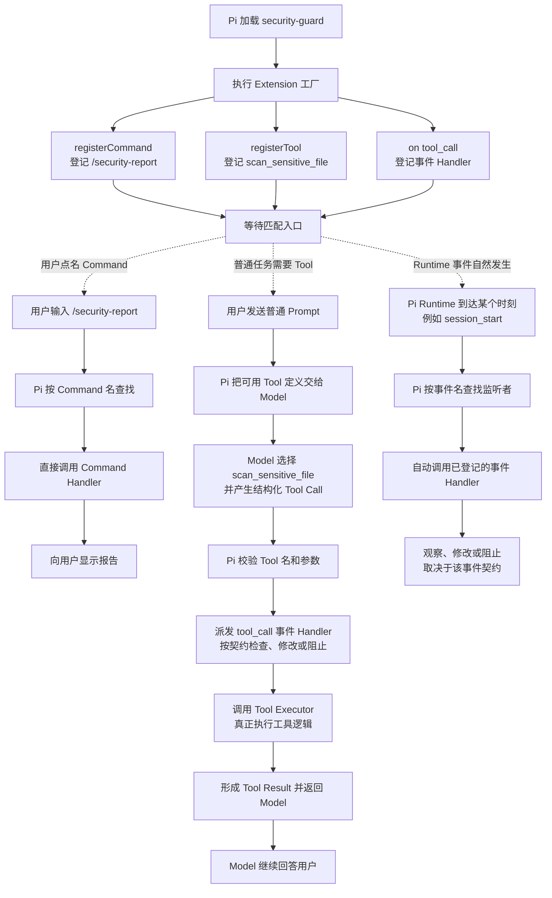
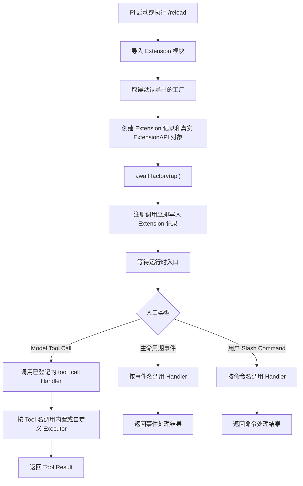
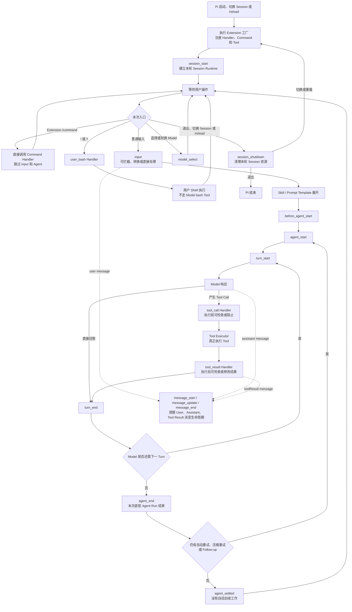
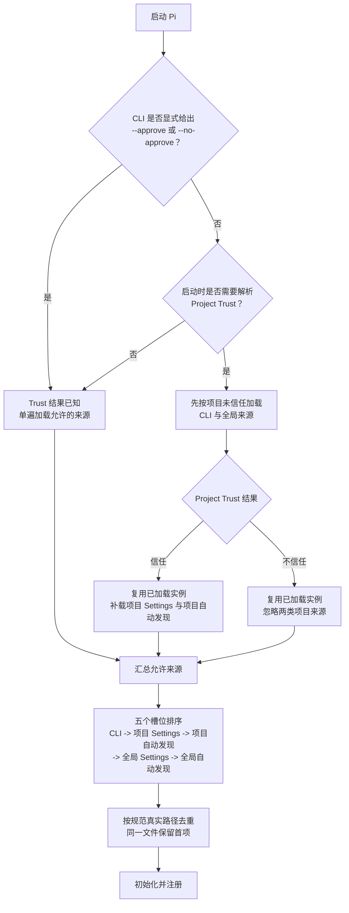
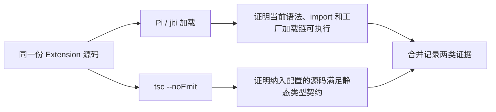
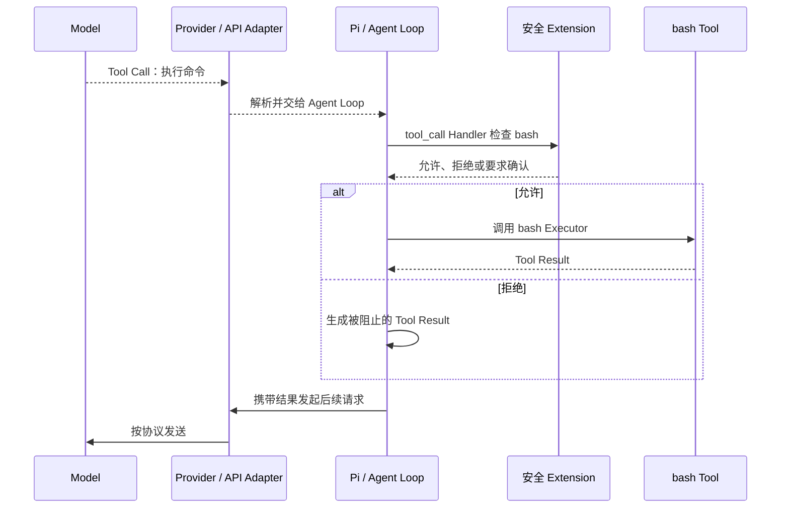

# Pi Extensions

本文默认描述 Pi `0.84.1`。Extension 是 Pi 的可选可执行插件层，用于注册、监听或拦截能力；它不是内置 Tool 的执行前提，也不是系统级沙箱。学习进度、当前验收状态和下一步只见 [完整学习计划](../plans/pi-complete-learning-plan.md)。

## 版本范围与证据口径

除非另有说明，本文的 Pi 行为均限定为本机 `0.84.1`。官方 `latest` 文档是动态参考，不作为该版本行为的固定证据。

| 标签 | 含义 | 不能替代 |
|---|---|---|
| 文档说明 | 官方文档公开承诺的用法或能力 | 本机源码实现、实际运行结果 |
| 源码证据 | 对本机 `0.84.1` 安装包的静态检查 | 真实进程已经走过该分支 |
| 运行证据 | 实际执行得到的观察；必须继续注明是真实 Pi、`tsc` 还是 Fake 测试 | 其他运行链或用户已经掌握 |
| 用户理解验收 | 用户能够用完整场景解释机制和边界 | 源码正确、程序运行正确或安全 |

同一结论可能同时有多层证据，但各层不能互相冒充。本文保存稳定知识和可复用证据边界，不维护 5.1 的动态状态。

## 完整场景：一个 Extension 如何生效

先看 `pi-study-guard` 的完整过程：

1. 项目把插件文件放在 `.pi/extensions/pi-study-guard/index.ts`。
2. Pi 启动时发现该文件，并把 TypeScript 模块导入当前进程。
3. Pi 从模块取得默认导出的启动函数，为这个插件建立一份内部记录和一个可操作 Pi 的真实对象。
4. Pi 调用启动函数，并把真实对象作为普通函数参数传入。
5. 启动函数通过该对象登记一个命令行 Flag；登记结果立即写入当前插件记录。
6. 启动函数返回后，插件进入待命状态。此时只能证明加载和登记完成，不能证明任何运行时处理逻辑已经触发。
7. 后续若插件登记了事件、Command 或 Tool，Pi 才会在对应事件、用户命令或 Model Tool Call 出现时调用已登记的处理函数。

这条链的起点是“Pi 发现本地代码”，终点是“Pi 在真实入口出现时派发已登记能力”。Extension 不需要由 Model 猜测或主动启动。

## Extension 是什么、不是什么

Extension 是被 Pi 加载并执行的 TypeScript 模块。它可以注册 Tool、Command、Flag、快捷键和 UI，也可以监听 Agent、Session、Tool、Shell 等事件。Extension 默认不会调用大模型，但其代码可以主动调用模型、执行命令、读写文件或访问网络。

没有 Extension，Pi 仍能调用 Model、运行 Agent Loop、使用内置 Tool、管理 Session 和提供基础 TUI。Extension 只为团队或业务增加定制能力。

Tool 不全由 Extension 提供：

| Tool 来源 | 谁提供 | 是否需要 Extension |
|---|---|---|
| Pi 内置 Tool | Pi Core，例如读文件、Shell 和文件编辑能力 | 不需要 |
| SDK 自定义 Tool | 嵌入 Pi 的宿主程序直接传入 | 不需要 |
| CLI 自定义 Tool | Extension 通过 `registerTool` 注册 | 通常需要 |

Pi Package 是分发载体，不是第四种 Tool 运行机制。Package 中的自定义 Tool 通常仍由它携带的 Extension 注册。

Extension 按职责可以覆盖九类能力：

| 能力类别 | 典型能力 |
|---|---|
| Tool 扩展 | 注册、启停、包装 Tool，定义参数校验和结果渲染 |
| 命令与输入 | 注册 Slash Command、快捷键、Flag、补全，处理用户输入 |
| Agent 与上下文 | 监听 Agent/Turn/消息事件，调整系统提示或上下文 |
| Tool 与 Shell 门禁 | 在 Tool 执行前后检查调用，拦截用户 `!` Shell |
| Session 与状态 | 监听启动、恢复、Fork、Tree、Compaction、退出并保存状态 |
| Model 与 Provider | 切换 Model/Thinking，注册或调整 Provider |
| UI 与渲染 | 显示确认框、通知、状态、Widget、Footer 或自定义渲染 |
| 资源与生命周期 | 追加 Skill/Prompt/Theme 路径，响应重载并管理资源 |
| 外部集成 | 执行进程、访问网络、监听文件、触发 CI/Webhook 或事件总线 |

用 Spring 类比，Extension 更接近插件模块或 Starter；事件 Handler 接近 Interceptor、Filter 或 AOP Advice；自定义 Tool 接近面向 Model 的可调用服务入口；Slash Command 是用户直接触发的命令入口。把 Extension 只理解成拦截器，会漏掉它的注册、UI、状态和外部集成能力。

## 核心对象

| 对象 | 大白话 | 谁创建、何时使用 |
|---|---|---|
| TypeScript 模块 | 装着插件代码的文件；导入时顶层代码也可能执行 | Pi 导入 |
| 插件工厂 | 模块默认导出的启动入口函数 | Pi 对每个有效工厂调用 |
| `ExtensionAPI` 类型 | 规定插件可以调用哪些受支持方法 | TypeScript 类型检查使用 |
| 真实 `ExtensionAPI` 对象 | 连接当前插件记录与 Pi Runtime 的操作入口 | Pi 创建并传给工厂 |
| Extension 记录 | 保存该插件登记的 Handler、Tool、Command、Flag 等 | Pi 创建并管理 |
| Handler | 处理事件或 Command 的函数 | 工厂登记，Pi 在匹配入口出现时调用 |
| Executor | 执行某个自定义 Tool 的函数 | 工厂随 Tool 登记，Pi 在匹配 Tool Call 出现时调用 |

示例中的 `pi` 或 `api` 只是工厂参数的局部变量名，指向 Pi 传入的同一类真实 `ExtensionAPI` 对象，不是两套 API，也不是 Pi 的副本。插件工厂也不是 Spring `FactoryBean`；它只是普通函数。

`on`、`registerTool`、`registerCommand`、`registerFlag` 等注册方法在工厂加载期间可用，调用后立即写入当前 Extension 记录。部分发送消息等运行时 Action 此时尚未绑定，因此真实 API 对象不代表整个 Pi Runtime 已经全部可用。

## Command、Tool 与事件 Handler

三者都是 Extension 向 Pi 登记的运行时入口，根本区别是发起者不同：

- Command：用户点名要求 Extension 执行一项操作。
- Tool：通常由 Model 判断需要使用，再由 Pi 调用 Executor。
- 事件 Handler：Pi Runtime 运行到特定时刻后自动派发。

### 一个从启动到结束的完整场景

假设 `security-guard` Extension 在工厂中登记三项能力：

| 登记内容 | 示例 | 作用 |
|---|---|---|
| Command | `/security-report` | 用户主动查看安全报告 |
| Tool | `scan_sensitive_file` | Model 在处理普通任务时检查文件 |
| 事件 Handler | `tool_call` | Pi 准备执行 Tool 前检查或阻止调用 |

Pi 加载 Extension 后，工厂只把这些入口登记到当前进程的对应表中，尚未执行 Command Handler 或 Tool Executor。随后三条触发链分别运行：



图中的 `tool_call` 同时说明了三者可以组合：Tool 由 Model 选择，但在 Executor 真正运行前，Pi 还可以先派发 `tool_call` 事件，让事件 Handler 执行门禁检查。

### 三者逐项对照

| 对比项 | Command | Tool | 事件 Handler |
|---|---|---|---|
| 主要发起者 | 用户 | Model | Pi Runtime |
| 登记 API | `registerCommand` | `registerTool` | `on` |
| 触发条件 | 用户输入匹配的 `/命令名` | Model 产生匹配的 Tool Call | 对应生命周期事件实际发生 |
| 运行函数 | Command Handler | Tool Executor | Event Handler |
| 输入 | 命令后的参数字符串和 Command Context | 通过 Schema 校验的结构化参数、取消信号和 Tool Context | Pi 产生的事件对象和 Extension Context |
| 主要结果去向 | UI、Session，或由 Handler 发起的后续动作 | Tool Result，通常进入后续 Model 上下文 | 回到 Pi Runtime；能否修改或阻止取决于事件契约 |
| 是否先由 Model 决定 | 否 | 是 | 否 |
| `--no-tools` 的直接影响 | 不禁用 Command | 会改变活跃 Tool 集，Model 无法调用已禁用 Tool | 不会统一关闭事件系统；但对应事件没有发生时自然不会触发 |

#### Command：用户点名触发

用户输入 `/security-report` 后，Pi 先查 Command 表并直接调用对应 Handler，不需要 Model 先判断应该做什么。Command Handler 可以显示通知、读取 Session 状态或执行其他逻辑；如果 Handler 主动发送用户消息或调用其他运行时能力，才可能继续进入 Agent 或外部操作。因此“Command 不需要 Model”不等于“Command 永远不能间接启动 Model”。

#### Tool：Model 选择，Executor 执行

注册 Tool 只是把名称、说明和参数 Schema 放进可用工具集合。普通 Prompt 进入 Agent 后，Model 才可能选择它并产生 Tool Call；Pi 随后查找名称、校验参数、派发执行前事件并调用 Executor。Executor 返回 Tool Result 后，Model 通常继续生成下一步回答。

必须分清三个阶段：

`registerTool -> Model 产生 Tool Call -> Executor 真正执行`

注册成功不能证明 Model 一定选择它，Tool Call 出现也不能跳过参数校验、事件门禁和 Executor 执行结果。

#### 事件 Handler：Runtime 到点自动通知

Extension 用 `on` 表示“当这个事件发生时通知我”。用户不需要输入 `/session_start`，Model 也不需要选择它；当 Pi 建立 Session 时，Runtime 自动派发 `session_start`，已登记的 Handler 才执行。

事件 Handler 可以承担三类职责：

| 职责 | 示例 | 边界 |
|---|---|---|
| 观察 | 在 `session_start` 记录启动标记 | 只证明观察逻辑运行，不改变主流程 |
| 拦截 | 在 `tool_call` 检查危险调用 | 只有该事件契约支持拒绝时才能阻止 |
| 修改 | 在 `input` 或 `tool_result` 返回替换结果 | 能修改哪些字段由对应事件契约决定 |

Pi `0.84.1` 的 `ExtensionAPI` 暴露 33 个 `on` 事件名，覆盖 Trust、资源、Session、上下文、Provider、Agent、Turn、Message、Tool、Model、Thinking、用户 Shell 和输入。这个数字表示当前版本的事件入口数量，不表示 Extension 只有 33 项能力，也不应作为跨版本不变的契约。

### 映射到 `pi-study-guard`

当前实验 Extension 的关系如下：

```text
pi-study-guard Extension
├── CLI Flag：--pi-study-guard
├── Command：/pi-study-trace
└── 事件 Handler
    ├── session_start、session_shutdown
    ├── input、user_bash、model_select
    └── Agent、Turn、Message、Tool 生命周期事件
```

它目前没有注册自定义 Tool。A 组启动、由用户触发一次 `/pi-study-trace`，再用 `/quit` 正常退出后的完整真实日志是：

```text
0001 factory
0002 session_start reason=startup
0003 command name=pi-study-trace
0004 session_shutdown reason=quit
```

这证明本次工厂追踪逻辑先执行，随后 `session_start` Handler 被触发；用户输入 `/pi-study-trace` 后，Pi 又按 Command 名调用了对应 Handler；用户输入 `/quit` 正常退出时，Pi 派发了 `session_shutdown`，对应 Handler 收到的 `reason` 是 `quit`。日志中没有 `input`、Agent 或 Turn 事件，与本次 Extension Command 没有进入普通 Prompt/Agent 链一致。它没有注册自定义 Tool，也没有普通 Prompt 或 Model，因此没有 Tool Call 或 Executor 证据；本次未出现某事件不能证明其他 Command 或场景永远不会触发它。

最简记忆：

> Command 是用户说“现在做这个”；Tool 是 Model 说“我需要用这个”；事件 Handler 是 Pi Runtime 说“这个时刻发生了，请处理”。

## 加载、初始化、注册与运行时派发



一次加载中，每个经规范路径去重、成功导入且默认导出有效工厂的 Extension 调用一次工厂；`/reload` 会建立新一轮。运行时入口可能从未出现，也可能多次出现。

### 完整例子：工厂执行不等于 Handler 触发

假设 Extension 在工厂中注册一个 `/guard` Command Handler：

| 阶段 | Pi 做什么 | 当前证据能证明什么 |
|---|---|---|
| 加载 | 导入 Extension 并执行工厂 | `reload.ts` 写入 `V1`，证明本次工厂执行过 |
| 注册 | 工厂把 `/guard` Handler 登记到 Extension 记录 | 证明能力已登记，不证明 Handler 已调用 |
| 触发 | 用户实际输入 `/guard` 后，Pi 才调用对应 Handler | 需要单独观察 Handler 的结果，才能证明本次调用发生 |

用 Spring 类比：执行 Extension 工厂类似应用启动时创建并注册 Controller，触发 Handler 类似真实请求到达后调用 Controller 方法。应用启动成功不等于接口已经被请求。工厂通常每轮加载执行一次；Handler 可能一次都不执行，也可能随匹配事件执行多次。

因此，真实 Pi 中出现 Flag 或工厂 marker，只能把证据推进到“工厂执行并注册能力”。它不能自动证明 Handler 或 Executor 已触发、功能正确或代码运行安全；这些结论需要各自对应的运行实验。

### 5.2 生命周期系统地图

下面把公共启动阶段和五类用户操作放在同一张图中。普通输入才进入 Agent/Turn 循环；Extension Command、User Bash 和模型切换各走独立入口。



`message_start`、`message_update`、`message_end` 是穿插在 User、Assistant、Tool Result 消息生命周期中的观察事件，不是每次 Agent Run 只执行一遍的独立主线。并行 Tool、重试和 Session 切换可能让实际序列更复杂，图中只表达本轮学习需要掌握的主干。

### A-D 四组真实运行证据

下面四组实验分别只改变一种入口，避免把 Command、用户 Shell、模型切换和普通 Agent Loop 混在一起：

| 组别 | 用户操作 | 本次真实事件主链 | 直接结论 |
|---|---|---|---|
| A | 输入 `/pi-study-trace` | `factory -> session_start -> command -> session_shutdown` | Extension Command 由用户点名触发，不需要进入普通 Agent Loop |
| B | 输入 `!!printf ...` | `factory -> session_start -> user_bash -> session_shutdown` | 用户 Shell 是 Pi 的独立入口，不是 Model `bash` Tool |
| C | 按一次 `⌃P` | `factory -> session_start -> model_select(source=cycle) -> session_shutdown` | `⌃P` 切换 Model；`⇧Tab` 才切换当前 Model 的 Thinking Level |
| D | 发送普通 Prompt，并由 Model 调用一次内置 `read` | `input -> Agent -> Turn -> read Tool -> 下一 Turn -> agent_end -> agent_settled` | 普通输入进入 Agent Loop，Tool Result 会交回 Model 决定下一步 |

C 组启动时的 `--models` 模式没有命中，因此本次不能证明只在两个指定 Model 内轮换；界面和日志只能证明一次 `⌃P` 实际切换了 Model，并派发 `model_select source=cycle`。它也不能证明 Provider 能回答或完全没有网络活动。

D 组的完整脱敏事件日志如下：

```text
0001 factory
0002 session_start reason=startup
0003 input source=interactive
0004 before_agent_start
0005 agent_start
0006 turn_start
0007 message_start role=user
0008 message_end role=user
0009 message_start role=assistant
0010 message_end role=assistant
0011 tool_call tool=read
0012 tool_result tool=read
0013 message_start role=toolResult
0014 message_end role=toolResult
0015 turn_end
0016 turn_start
0017 message_start role=assistant
0018 message_end role=assistant
0019 turn_end
0020 agent_end
0021 agent_settled
0022 session_shutdown reason=quit
```

第一 Turn 中，Model 先产生 `read` Tool Call；Pi 在调用内置 `read` Executor 前后派发 `tool_call` 与 `tool_result` Handler，随后把 Tool Result 加入消息上下文。第二 Turn 中，Model 根据这个结果生成最终回答，因此“一个普通 Prompt”不等于“只有一个 Turn”。一次 Turn 也可能包含多个 Tool Call，不能把本次两个 Turn 当成全局固定数量。

这里的 Tool 由 Pi 放进可用工具集合并提供给 Model；Model 只负责选择 Tool 和给出参数。Tool Executor 才负责真正读取文件或执行操作。当前 `pi-study-guard` 没有自定义 Tool，D 组调用的是 Pi 内置 `read`，实验 Extension 只通过 `tool_call` 和 `tool_result` Handler 观察其前后时刻。

`agent_end` 表示当前这一次底层 Agent Run 已结束；如果 Pi 还要自动重试、压缩后重试或处理 Follow-up，之后仍可能开始新的 Run。`agent_settled` 表示这些自动后续工作也已结束，当前上层任务已经稳定空闲。两者都不等于 Session 已关闭；本次直到 `/quit` 后才出现 `session_shutdown reason=quit`。

追踪器只记录事件名、顺序和少量白名单元数据，没有记录 Tool Result 内容、错误状态或最终回答。因此 D 组日志能证明 `read` 请求经过 Handler、Executor 所在运行路径及结果回到消息循环，但不能单独证明文件读取成功、内容正确、最终回答正确或操作安全；这些结论需要界面结果、错误字段或独立断言。

从调用工厂到同步返回或异步 `Promise` 完成，统称初始化：

| 方式 | 工厂行为 | Pi 的处理 |
|---|---|---|
| 同步 | 准备内存状态、登记能力并立即返回 | 返回后继续启动 |
| 异步 | 返回代表整个初始化过程的 `Promise`，内部等待有限 I/O 后登记能力 | 等待 `Promise` 完成后继续启动 |

同步或异步只描述一次性准备如何完成，不描述 Handler 或 Executor 如何触发。工厂可能在不启动 Session 的命令中执行，因此这里只做有限准备；不要在工厂中启动进程、Socket、Watcher 或 Timer。长期资源应延后到 `session_start` 或真实使用入口，并由幂等的 `session_shutdown` 清理。

证据链必须逐层建立：

`发现文件 -> 导入模块 -> 执行工厂 -> 注册能力 -> 触发 Handler/Executor -> 行为正确且安全`

前一层通过不能证明后一层通过。Extension 是拥有 Pi 进程和当前系统用户权限的本地代码；它可以实现门禁，也可以绕过门禁直接产生副作用。

## 四类加载来源与实验探针

同一个 Extension 文件可以通过四类入口交给 Pi。来源由 Pi 找到文件的入口决定，不由代码内容或文件名决定。

| 来源类别 | 默认位置或配置 | 当前实验探针 | 持续性 | Project Trust |
|---|---|---|---|---|
| CLI 临时加载 | `-e/--extension <path>` | `<lab>/cli.ts` | 当前进程 | 不控制 |
| 全局自动发现 | `~/.pi/agent/extensions/*.ts` 或子目录 `index.ts` | `<lab>/agent/extensions/global-auto.ts` | 持续 | 不控制 |
| 项目自动发现 | `.pi/extensions/*.ts` 或子目录 `index.ts` | `<lab>/project/.pi/extensions/project-auto.ts` | 持续 | 控制 |
| Settings 附加路径 | 全局或项目 `settings.json` 的 `extensions` | `<lab>/project/project-settings.ts`，由项目 Settings 引用 | 持续 | 项目 Settings 受控制；全局 Settings 不受控制 |

项目 Settings 的探针配置为：

```json
{
  "extensions": ["../project-settings.ts"]
}
```

相对路径从 `<lab>/project/.pi/settings.json` 所在目录解析，所以最终指向 `<lab>/project/project-settings.ts`。文件不在自动发现目录中；删除 Settings 引用后，Pi 不会仅凭文件名找到它。

`--no-extensions` 关闭常规 Extension 发现，但显式 `-e` 仍可加载指定文件。Package 不是这四类本地文件入口，留到阶段 6。

## Project Trust、顺序、去重与重载

四类入口在最终集合中占五个排序槽位，因为 Settings 是一种入口，但分为项目 Settings 和全局 Settings 两个位置。



【源码证据】Pi `0.84.1` 在没有显式 Trust 覆盖且需要询问时，先加载 CLI 与全局 Extension；信任后复用这些实例并补载项目 Extension，不会再次执行已有工厂。Project Trust 只控制项目 Settings 和项目自动发现资源，既不控制 CLI/全局 Extension，也不降低操作系统权限。

加载顺序不是统一的覆盖规则：【源码证据】同一真实文件按规范路径去重；不同 Extension 的同名 Tool 由先加载者生效；同名 Command 会保留并增加编号后缀；事件 Handler 按加载与注册顺序运行，是否短路由事件类型决定。自动发现目录的字母顺序不是稳定契约，这些冲突行为仍需受控运行验证。

【文档说明】自动发现位置支持 `/reload`。【源码证据】`0.84.1` 还会重新解析 Settings 和 CLI 路径，但这不是跨版本承诺。实验必须把官方承诺、当前源码行为和本机运行结果分别记录。

## TypeScript 直接加载与独立类型检查

【文档说明】Pi 使用 `jiti` 直接加载 TypeScript Extension，不要求预先生成 `dist/index.js`。`jiti` 负责即时转换语法、解析 `import` 并执行模块，不执行完整 TypeScript 类型检查。官方入口见 [Extensions 文档](https://pi.dev/docs/latest/extensions)；该 `latest` 链接是动态参考。

同一份源码必须走两条互不替代的路线：



| 路线 | 能证明 | 不能证明 |
|---|---|---|
| Pi/`jiti` 加载 | 当前语法可转换、`import` 可解析、工厂可执行 | 静态类型正确、Handler/Executor 行为正确或安全 |
| `tsc --noEmit` | 纳入当前配置的类型声明和使用满足静态契约 | Pi 一定能加载、运行时行为正确、未纳入文件正确 |

`--noEmit` 只表示不生成输出文件；检查范围与严格程度仍由命令参数和 `tsconfig.json` 决定。`skipLibCheck` 跳过第三方 `.d.ts` 内部检查，但仍读取依赖公开类型并检查项目源码。启用后必须保留本项目受控类型错误的 Red/Green 对照，证明项目源码没有被一起跳过。

### 电话号码登记类比：类型正确不等于内容正确

假设登记联系人时，姓名和电话号码都必须是字符串。把电话号码写成数字属于格式错误，类型检查可以拦截；把错误号码写成字符串仍符合类型要求，类型检查无法判断内容是否正确。

映射到 Extension：Pi 的公开类型要求 `registerFlag()` 的 Flag 名称是字符串。临时传入数字并取得 `tsc` 失败，再恢复为字符串并通过，证明当前文件确实被纳入检查且 Pi 的公开类型契约正在生效。但另一个错误名称仍然是合法字符串，必须直接调用工厂并由 Fake API 记录实际登记内容，才能与预期名称和配置比较。

| 验证层 | 电话号码场景 | Extension 场景 | 不能证明 |
|---|---|---|---|
| `tsc --noEmit` | 姓名和电话的类型是否符合登记格式 | 工厂调用是否符合 Pi 的公开类型契约 | Flag 名称和配置是否符合业务预期；Pi 是否实际加载 |
| Fake API 测试 | 前台实际记录了谁和什么号码 | 直接调用工厂时实际登记了什么 Flag | Project Trust、自动发现或真实 Pi 加载链 |
| 真实 Pi 实验 | 真实登记系统是否收到请求 | Pi 是否通过指定入口发现、加载并执行工厂 | 未被本次场景覆盖的 Handler、功能与安全性 |

受控 Red -> Green 不是为了随意破坏代码：基线 Green 说明当前状态通过；预期 Red 证明检查器确实能拦截目标错误；恢复 Green 证明错误已移除。三层证据回答不同问题，不能互相替代。

## 5.1 的四条依赖判断

5.1 只要求能正确配置和排查，不展开 npm 内部解析或 Package 发布策略：

| 判断 | 例子与边界 |
|---|---|
| 运行时第三方库放 `dependencies` | `ms` 提供 Node 实际执行的代码；只放开发依赖可能在生产安装后缺失 |
| 开发工具和类型声明放 `devDependencies` | TypeScript、测试工具和 `@types/ms` 服务于开发检查；类型声明不能代替真实运行代码 |
| Pi 核心包由宿主提供 | Extension 运行时的真实 `ExtensionAPI` 对象由 Pi 传入；具体 `peerDependencies` 发布配置留到阶段 6 |
| 锁文件固定完整解析结果 | `package-lock.json` 记录直接与传递依赖的解析树；`node_modules` 才是当前机器供 Node 加载的代码 |

锁文件只有在安装流程实际使用且与 `package.json` 一致时才帮助复现，也不能证明依赖安全、类型正确或行为正确。`npm ci`、完整性字段、上游 shrinkwrap、多版本树和 Maven 依赖调解等审计细节不属于 5.1 的教学主线；本次实验的具体审计证据保留在计划台账，Package 发布语义留到阶段 6。

## 实验材料与证据边界

实验骨架位于 [`.pi/extensions/pi-study-guard/`](../../.pi/extensions/pi-study-guard/README.md)。主工厂只登记唯一 Flag；Fake API 只实现 `registerFlag`；来源探针和重载探针位于不会被项目自动递归发现的 `fixtures/loading/`，只复制到隔离临时目录使用。

| 标签 | 已保存的稳定证据 | 边界 |
|---|---|---|
| 源码证据 | `0.84.1` 的来源顺序、规范路径去重、Trust 两阶段复用、真实 API 对象创建、`await factory(api)`、注册写入记录和 `jiti` 加载 | 不证明本机已实际走过分支 |
| 运行证据（真实 Pi） | Trust 拒绝场景的帮助输出只出现 CLI 与全局探针 Flag | 只证明对应工厂登记完成；具体学习验收和后续实验状态见计划 |
| 运行证据（`tsc`） | 基线通过；两个本项目受控错误分别产生 `TS2322` 与 `TS2345`，恢复后再次通过 | 只证明当前配置仍检查项目源码和 Pi 公开类型 |
| 运行证据（Fake） | 直接调用主工厂时，Fake API 收到预期 Flag 登记 | 不证明真实 Pi 发现、Trust、去重、重载或运行时派发 |
| 用户理解验收 | 只由计划台账记录 | 文档、源码、真实运行、`tsc` 或 Fake 均不能自动替代 |

实验材料只处理受控 Flag 和临时 marker，不注册业务能力、不联网、不启动后台资源。所有动态状态、当前断点与下一步均链接计划，不在本文件重复维护。

## 后续能力地图

### Shell 门禁预览

Shell 门禁属于后续实现主题。下面的图只负责 Model `bash` Tool Call 的允许/拒绝链，不代表通用 Extension 生命周期：



用户直接输入 `!命令` 或 `!!命令` 时走 `user_bash`，绕过 Model 决策和 `tool_call`；前者输出进入 Model 上下文，后者不进入。完整保护必须分别覆盖 Model `bash` 和用户 Shell。交互模式可询问用户；无 UI 模式必须预先定义默认拒绝等明确策略。

### 其他能力

Agent Run、Turn 和停止条件见 [架构与 Model 上下文](01-architecture-and-context.md)。后续按计划继续学习事件生命周期、自定义 Tool/Command、状态、UI 和资源释放。

Pi 不内置 MCP 和 Subagent：MCP 通过 Extension 或 Package 接入；Subagent 通过 Extension、Package、独立 Pi 进程或 tmux 实现。它们会增加网络与凭据边界、模型费用、上下文复杂度和并发写入冲突，应在掌握 Tool、Session、Extension 和 Package 后按真实需求引入。
