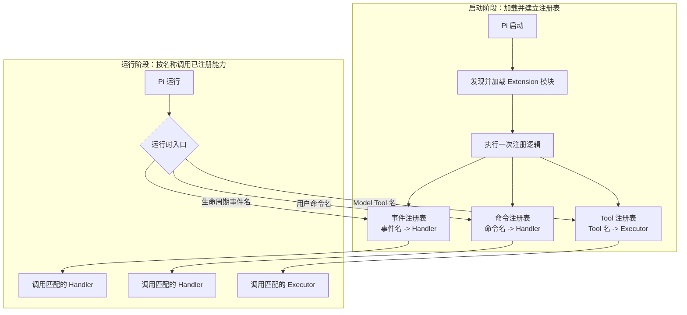
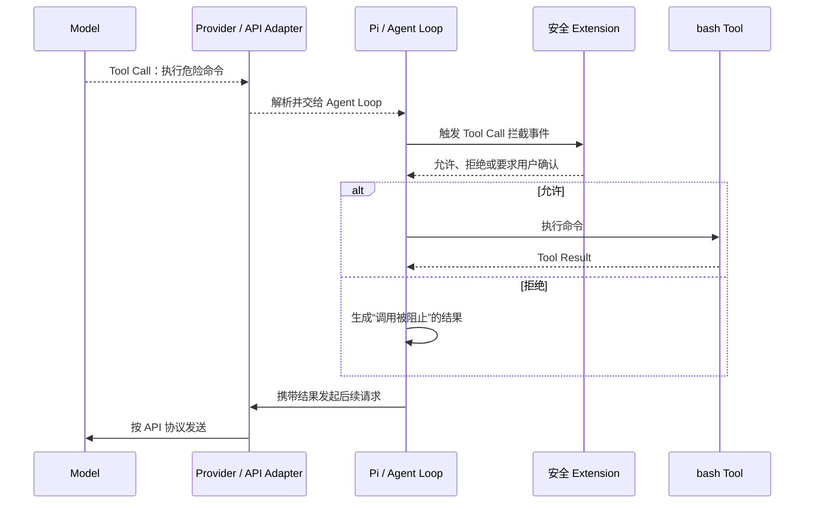

# Pi Extensions

Extension 是 Pi 的可选插件层，用来注册或拦截能力。它不是内置 Tool 的执行前提，也不是系统级沙箱。学习进度见 [完整学习计划](../plans/pi-complete-learning-plan.md)。

## Extension 是可执行插件

Extension 是被 Pi 加载的 TypeScript 模块。它可以向 Pi 注册能力，也可以监听或拦截 Agent Loop 中的事件。Extension 默认不会调用大模型，但它可以通过自定义代码主动调用模型或外部服务。

Extension 是可选插件层。没有 Extension，Pi 仍能调用 Model、运行 Agent Loop、使用内置 Tool、管理 Session 和提供基础 TUI；加入 Extension 后，Pi 才获得面向特定团队或业务的定制能力。它对 Pi Core 不是必需依赖，但对危险命令审批、自定义 Tool 等具体需求可能是必需依赖。

并不是所有 Tool 都由 Extension 注册。Tool 有三种主要来源：

| Tool 来源 | 谁负责提供 | 是否需要 Extension |
|---|---|---|
| Pi 内置 Tool | Pi Core，例如读文件、Shell 和文件编辑能力 | 不需要 |
| SDK 自定义 Tool | 嵌入 Pi 的宿主程序通过 SDK 直接传入 | 不需要 |
| CLI 自定义 Tool | Extension 通过 `registerTool` 注册 | 通常需要 |

Pi Package 是分发载体，不是第四种 Tool 运行机制。一个 Package 如果提供自定义 Tool，通常是因为它包含了负责注册 Tool 的 Extension。

Extension 没有一个固定的“能力总数”，因为 API 会随版本演进。按职责可以归纳为九类：

| 能力类别 | 能做什么 | 典型触发者 |
|---|---|---|
| Tool 扩展 | 注册新 Tool、动态启停 Tool、包装或覆盖内置 Tool、自定义参数校验和结果渲染 | Model 产生 Tool Call，Pi 按名称调度 |
| 命令与输入 | 注册 Slash Command、快捷键、CLI Flag、自动补全；转换或直接处理用户输入 | 用户输入、快捷键或启动参数 |
| Agent 与上下文 | 监听 Agent、Turn、消息事件；在调用 Model 前注入消息、调整系统提示或筛选上下文 | Pi 的 Agent Loop |
| Tool 与 Shell 门禁 | 在 Tool 执行前修改参数或阻止调用，在执行后修改结果；拦截用户的 `!` Shell | Pi 的工具调度流程 |
| Session 与状态 | 监听启动、恢复、Fork、Tree、Compaction 和退出；保存扩展状态、设置会话名称或标签、自定义摘要 | Session 生命周期 |
| Model 与 Provider | 切换 Model 和 Thinking Level；注册、覆盖、刷新或移除 Provider；检查请求和响应 | 用户选择或 Provider 请求链路 |
| UI 与渲染 | 显示确认框、输入框、通知、状态、Widget、Footer；替换编辑器；渲染 Tool、消息和自定义条目 | 已触发的 Handler 或 Tool |
| 资源与生命周期 | 追加 Skill、Prompt、Theme 路径；响应热重载；启动和释放长期资源 | Pi 启动、重载和关闭 |
| 外部集成 | 执行进程、访问网络、监听文件、触发 CI/Webhook，并通过事件总线与其他 Extension 通信 | Extension 自己的代码或外部事件 |

Extension 与 Tool 的区别：Tool 是一次可调用操作；Extension 是插件容器，一个 Extension 可以注册多个 Tool、Command 和事件处理器，也可以完全不注册 Tool。

内置 Tool 的执行由 Pi Core 调度。`tool_call` 是 Core 预留的检查点：没有注册 Handler 时继续执行；有 Handler 时按注册逻辑检查、修改、允许或阻止。Extension 可以注册新的 Tool，但这不代表所有 Tool 都依赖 Extension。

用 Spring 类比时，Extension 更接近“插件模块或 Starter”，不只是拦截器：

| Pi 概念 | 接近的 Spring 概念 | 边界 |
|---|---|---|
| 整个 Extension | Starter、Configuration 或插件模块 | 负责注册一组能力和生命周期逻辑 |
| `tool_call` 等事件 Handler | Interceptor、Filter 或 AOP Advice | 只负责在特定节点观察、修改、阻止或补充行为 |
| 自定义 Tool | 一个对 Model 暴露的可调用服务入口 | 触发者主要是 Model，不是 HTTP 请求 |
| Slash Command | 面向用户的命令入口 | 由用户明确输入命令触发，不需要 Model 决策 |

所以“Extension 像拦截器”只描述了它的事件拦截能力。更完整的理解是：**Extension 是插件容器，拦截器只是它能够注册的一类组件。**

需要特别注意：Extension 是本地可执行代码，拥有 Pi 进程和当前系统用户的权限。它能实现权限门禁，也能绕过门禁直接读文件、执行命令或访问网络，因此“安装了安全 Extension”不等于获得了系统级沙箱。

## Pi 如何触发 Extension

Pi 不会让 Model 猜测是否需要启动某个 Extension。Pi 启动时先加载 Extension 模块，Extension 随即把自己关心的事件、Tool 和 Command 注册到 Pi；运行过程中，Pi 按名称和固定生命周期节点进行确定性匹配。

| 注册方式 | 触发者 | 触发条件 |
|---|---|---|
| 事件处理器 | Pi Core | Agent Loop 到达已注册的生命周期节点，例如 Session 启动或 Tool Call 即将执行 |
| Slash Command | 用户 | 用户输入与已注册命令名匹配的 `/命令` |
| 自定义 Tool | Model 间接触发、Pi 实际调度 | Model 返回与已注册 Tool 名匹配的 Tool Call |
| UI 或状态逻辑 | Extension 自己 | 已触发的事件、命令或 Tool 处理器继续调用 UI 或状态 API |

“触发 Extension”通常包含两个阶段：

1. **加载阶段**：Pi 找到 Extension 文件并执行一次注册逻辑。
2. **运行阶段**：Pi 根据事件名或命令名调用已登记的 Handler，根据 Tool 名调用已登记的 Executor。

Extension 本身通常在启动时已经加载。后续被触发的不是整个文件重新加载，而是其中注册的事件/Command Handler 或 Tool Executor；`tool_call` Handler 只是 Executor 运行前的检查点，不能与 Executor 混为一谈。

## Shell 门禁

危险 Shell 命令被 Extension 拦截的流程：

上图只覆盖 Model 发起的 `bash` Tool Call。`user_bash` 是 Pi 在用户输入 `!命令` 或 `!!命令` 时触发的 Extension 事件：Shell 命令仍由 Pi 接收和执行，但绕过 Model 决策与 Tool Call 流程。要保护所有 Shell 入口，需要分别处理：

| Shell 入口 | 对应事件 | 门禁重点 |
|---|---|---|
| Model 请求 `bash` Tool | `tool_call` | 先确认 Tool 名为 `bash`，再判断命令是否危险；执行前允许或阻止 |
| 用户直接输入 `!命令` 或 `!!命令` | `user_bash` | 单独检查用户 Shell；它不会经过 `tool_call` |

`!命令` 的输出会加入模型上下文；`!!命令` 的输出不会加入模型上下文。两者都会触发 `user_bash`，Extension 可以检查命令与当前目录，也可以替换 Shell 后端或直接返回执行结果。

交互模式可以询问用户；无 UI 模式无法弹出确认框，应预先规定默认拒绝或其他明确策略。只有 Extension 已加载、正确识别危险命令并覆盖对应入口时，才能保证门禁生效。

Agent Run、Turn 和停止条件见 [架构与 Model 上下文](01-architecture-and-context.md)；Extension 在 Agent Loop 中的注册点、触发点和门禁边界以本章为准。

## MCP 与 Subagent

Pi 刻意不内置 MCP 和 Subagent，它们不是安装后的必备组件。

| 能力 | Pi 的实现方式 | 何时引入 |
|---|---|---|
| MCP | 通过 Extension 或 Package 接入 | 出现明确的外部系统调用需求后 |
| Subagent | 通过 Extension、Package、独立 Pi 进程或 tmux 实现 | 掌握工具、Session、费用和并发写入风险后 |

过早引入的主要成本：

- MCP 增加网络访问、凭据管理和数据共享边界。
- Subagent 增加模型调用费用、上下文复杂度和并发写文件冲突。
- 工具过多会增加模型选择错误工具的概率。

当前顺序：先掌握内置工具和 Session，再学习 Skill、Extension 与 Package，最后按真实需求引入 MCP 或 Subagent。
