# Pi Extensions

本文默认描述 Pi `0.84.1`。Extension 是 Pi 的可选可执行插件层，用于注册、监听或拦截能力；它不是内置 Tool 的执行前提，也不是系统级沙箱。学习进度、当前验收状态和下一步只见 [完整学习计划](../plans/pi-complete-learning-plan.md)。

## 版本范围与证据口径

除非另有说明，本文的 Pi 行为均限定为本机 `0.84.1`。官方 `latest` 文档是动态参考，不作为该版本行为的固定证据。

| 标签 | 含义 | 不能替代 |
|---|---|---|
| 文档说明 | 官方文档公开承诺的用法或能力 | 本机源码实现、实际运行结果 |
| 源码证据 | 对本机 `0.84.1` 安装包的静态检查 | 真实进程已经走过该分支 |
| 运行证据 | 实际执行得到的观察；必须继续注明是真实 Pi、`tsc` 还是 Fake 测试 | 其他运行链或用户已经掌握 |
| 用户理解验收 | 用户能够用完整场景解释机制和边界 | 源码正确、程序运行正确或安全 |

同一结论可能同时有多层证据，但各层不能互相冒充。本文保存稳定知识和可复用证据边界，不维护各计划项的动态状态。

## 完整场景：一个 Extension 如何生效

先看 `pi-study-guard` 的完整过程：

1. 项目把插件文件放在 `.pi/extensions/pi-study-guard/index.ts`。
2. Pi 启动时发现该文件，并把 TypeScript 模块导入当前进程。
3. Pi 从模块取得默认导出的启动函数，为这个插件建立一份内部记录和一个可操作 Pi 的真实对象。
4. Pi 调用启动函数，并把真实对象作为普通函数参数传入。
5. 启动函数通过该对象登记一个命令行 Flag；登记结果立即写入当前插件记录。
6. 启动函数返回后，插件进入待命状态。此时只能证明加载和登记完成，不能证明任何运行时处理逻辑已经触发。
7. 后续若插件登记了事件、Command 或 Tool，Pi 才会在对应事件、用户命令或 Model Tool Call 出现时调用已登记的处理函数。

这条链的起点是“Pi 发现本地代码”，终点是“Pi 在真实入口出现时派发已登记能力”。Extension 不需要由 Model 猜测或主动启动。

## Extension 是什么、不是什么

Extension 是被 Pi 加载并执行的 TypeScript 模块。它可以注册 Tool、Command、Flag、快捷键和 UI，也可以监听 Agent、Session、Tool、Shell 等事件。Extension 默认不会调用大模型，但其代码可以主动调用模型、执行命令、读写文件或访问网络。

没有 Extension，Pi 仍能调用 Model、运行 Agent Loop、使用内置 Tool、管理 Session 和提供基础 TUI。Extension 只为团队或业务增加定制能力。

Tool 不全由 Extension 提供：

| Tool 来源 | 谁提供 | 是否需要 Extension |
|---|---|---|
| Pi 内置 Tool | Pi Core，例如读文件、Shell 和文件编辑能力 | 不需要 |
| SDK 自定义 Tool | 嵌入 Pi 的宿主程序直接传入 | 不需要 |
| CLI 自定义 Tool | Extension 通过 `registerTool` 注册 | 通常需要 |

Pi Package 是分发载体，不是第四种 Tool 运行机制。Package 中的自定义 Tool 通常仍由它携带的 Extension 注册。

Extension 按职责可以覆盖九类能力：

| 能力类别 | 典型能力 |
|---|---|
| Tool 扩展 | 注册、启停、包装 Tool，定义参数校验和结果渲染 |
| 命令与输入 | 注册 Slash Command、快捷键、Flag、补全，处理用户输入 |
| Agent 与上下文 | 监听 Agent/Turn/消息事件，调整系统提示或上下文 |
| Tool 与 Shell 门禁 | 在 Tool 执行前后检查调用，拦截用户 `!` Shell |
| Session 与状态 | 监听启动、恢复、Fork、Tree、Compaction、退出并保存状态 |
| Model 与 Provider | 切换 Model/Thinking，注册或调整 Provider |
| UI 与渲染 | 显示确认框、通知、状态、Widget、Footer 或自定义渲染 |
| 资源与生命周期 | 追加 Skill/Prompt/Theme 路径，响应重载并管理资源 |
| 外部集成 | 执行进程、访问网络、监听文件、触发 CI/Webhook 或事件总线 |

用 Spring 类比，Extension 更接近插件模块或 Starter；事件 Handler 接近 Interceptor、Filter 或 AOP Advice；自定义 Tool 接近面向 Model 的可调用服务入口；Slash Command 是用户直接触发的命令入口。把 Extension 只理解成拦截器，会漏掉它的注册、UI、状态和外部集成能力。

## 核心对象

| 对象 | 大白话 | 谁创建、何时使用 |
|---|---|---|
| TypeScript 模块 | 装着插件代码的文件；导入时顶层代码也可能执行 | Pi 导入 |
| 插件工厂 | 模块默认导出的启动入口函数 | Pi 对每个有效工厂调用 |
| `ExtensionAPI` 类型 | 规定插件可以调用哪些受支持方法 | TypeScript 类型检查使用 |
| 真实 `ExtensionAPI` 对象 | 连接当前插件记录与 Pi Runtime 的操作入口 | Pi 创建并传给工厂 |
| Extension 记录 | 保存该插件登记的 Handler、Tool、Command、Flag 等 | Pi 创建并管理 |
| Handler | 处理事件或 Command 的函数 | 工厂登记，Pi 在匹配入口出现时调用 |
| Executor | 执行某个自定义 Tool 的函数 | 工厂随 Tool 登记，Pi 在匹配 Tool Call 出现时调用 |

示例中的 `pi` 或 `api` 只是工厂参数的局部变量名，指向 Pi 传入的同一类真实 `ExtensionAPI` 对象，不是两套 API，也不是 Pi 的副本。插件工厂也不是 Spring `FactoryBean`；它只是普通函数。

`on`、`registerTool`、`registerCommand`、`registerFlag` 等注册方法在工厂加载期间可用，调用后立即写入当前 Extension 记录。部分发送消息等运行时 Action 此时尚未绑定，因此真实 API 对象不代表整个 Pi Runtime 已经全部可用。

## 完整场景：安全门禁为什么需要运行现场

假设用户让 Pi 在一个 Java 项目里“清理构建目录并重新运行测试”。Model 决定调用内置 `bash` Tool，准备先删除 `target/`，再启动测试。安全 Extension 的价值不是替 Model 执行命令，而是在 Executor 真正运行前，根据当前现场决定允许、询问还是拒绝，并让取消和失败都有明确结果。

完整过程如下：

1. Model 产生 Shell Tool Call；这只是执行请求，命令还没有运行。
2. Pi 先派发 `tool_call`，把本次调用和 `ExtensionContext` 交给安全 Handler。
3. Handler 用 `ctx.cwd` 判断命令会作用于哪个项目，用 `ctx.mode` 和 `ctx.hasUI` 判断能否当场询问用户，也可以读取 Trust、当前 Session 和 Model 状态辅助诊断。
4. 在 TUI 中，Handler 可以弹出确认；用户允许后才进入 Executor，拒绝则在执行前结束。
5. 在 Print 中没有交互界面，Extension 不能一直等待一个永远不会出现的点击。安全门禁必须采用预先定义的确定性 fallback，例如默认拒绝并输出原因。
6. Executor 启动后，如果用户取消，Pi 会发出取消信号。Handler 或 Executor 只有主动监听并停止自身工作，取消才会及时生效；已经删除的文件、已经发送的请求等副作用不会自动回滚。
7. 如果过程报错，错误出现在哪一层会决定后果：普通观察 Handler 失败通常只被记录，主流程继续；`tool_call` Handler 失败会在执行前形成错误 Tool Result，Executor 不运行；Executor 自己失败也会形成错误 Tool Result，Model 可以看到失败并决定后续动作。

### 取消能力由谁提供

用“运行 Maven 测试”举例时，需要把官方机制和具体功能分开：

1. Pi 官方提供 Extension 机制、活动任务的取消信号，以及支持接收 `signal` 的 `pi.exec` 子进程执行入口。
2. 用户编写的 Extension 注册具体 Tool，并决定何时启动 Maven、是否把取消信号传给 `pi.exec`、如何解释取消结果。
3. 用户取消活动任务后，Pi 只负责发出信号；自定义 Executor 把信号继续传下去，`pi.exec` 才能请求它启动的 Maven 子进程退出。

因此，“收到取消后停止 Maven”不是 Pi 自带的 Maven 功能，而是用户 Extension 利用 Pi 官方接口实现的具体能力。如果 Extension 忽略信号，或者 Maven 不是由它启动和控制的，收到信号并不会自动停止 Maven。终止直接子进程也不能扩大为所有后代进程一定退出，更不会回滚 Maven 已经写入的文件、数据库或其他外部副作用。

当前学习项目中的 `pi-study-guard` 是用户自定义 Extension。它注册 Flag、诊断 Command、生命周期 Handler，以及一个默认关闭、只用于取消实验的 `tool_call` Handler；它没有注册 Maven Tool，也没有启动或停止 Maven。这里的 Maven 只是解释协作式取消用途的完整场景。

课程中的第一步取消实验也不直接运行 Maven。它先用一个本地延迟函数模拟长任务：A 组手动驱动受控 Timer 到期，观察 `start -> completed`；B 组在工作已经开始、Timer 与 Abort listener 已登记后触发测试信号，观察 `start -> cancelled`。测试还直接确认 Timer 和 listener 均被清理，并在取消结束后强制执行捕获的旧回调，验证不会迟到补记 `completed`；同步完成、同步取消和 `undefined` Timer handle 也有独立回归。

同一延迟函数随后被接入一个默认关闭的 `tool_call` Handler，供真实 Pi 取消实验复用。它只拦截实验指定的内置 `read` 请求，等待期间响应当前 Run 的 `ctx.signal`；无论取消、超时还是异常都阻止 Tool 执行。它没有注册自定义 Tool，也不会启动 Maven。

Fake 对照仍只证明“这一个本地延迟函数能协作处理测试传入的 `AbortSignal`”，不是“真实 Extension 已收到 Pi 的信号”。接入 Handler 的代码存在，也不等于真实 Pi 已经派发 Tool Call；必须由真实 Model 产生请求、用户看到等待标记后按 `Esc`，再结合 `start -> cancelled` 追踪与 Pi 的错误结果验收。即使这条真实链通过，也不证明 Tool Executor 的显式 signal、`pi.exec`、Maven 进程终止或副作用回滚。

真实 Pi `0.84.1` 实验已经补上这条动态证据：Model 产生指定的内置 `read` Tool Call 后，Extension 先记录 `cancel_probe state=start` 并显示等待提示；用户此时按 `Esc`，随后追踪记录 `state=cancelled`，界面形成 `Operation aborted` Tool Result并结束 Agent。本次没有 `state=completed` 或 Executor 后的 `tool_result` Handler 事件。结合 Core 在 `tool_call` Handler 返回后先检查同一 signal 的源码，可判定本次内置 `read` Executor 被跳过。这个结论只覆盖本次 TUI、当前 Handler 和当前 Pi 版本，不能外推到自定义 Tool Executor、子进程或副作用回滚。

### Observer、Gate、Executor 的完整职责

这三个名称描述的是课程里的三类职责，不是 Pi 官方的三种 `mode`：

- `observer`：本实验给普通 `turn_start` 生命周期 Handler 起的角色名。
- `gate`：本实验给 `tool_call` 执行前门禁起的角色名。
- `executor`：Tool 定义中真正完成工作的 `execute()`。

它们不能按“是否位于 Executor 前”分类。Observer 观察的是一次 Turn；Gate 裁决的是 Model 已生成的某一次 Tool Call；Executor 执行的是已获准的那一次 Tool Call。同一个 Turn 可能没有 Tool，也可能产生多个 Tool Call。

#### 位置、信息和控制权

| 对比项 | Observer | Gate | Executor |
|---|---|---|---|
| Pi 入口 | 普通生命周期 Handler；本实验是 `turn_start` | `tool_call` Handler | `registerTool()` 中的 `execute()` |
| 何时触发 | 每次 Model Turn 开始时 | 注册了匹配 Gate 时，在 Model 生成 Tool Call且 Schema 通过后 | Schema 通过后；若存在匹配 Gate，还须先获其放行 |
| 面向对象 | 一次 Turn 或其他生命周期事件 | 一次具体 Tool Call | 一次已经获准的 Tool 执行 |
| 此时知道什么 | 生命周期事件和 `ExtensionContext`；可能还没有 Tool | Tool 名、参数和当前 Context | 已校验参数、显式取消信号、更新回调和 Context |
| 核心职责 | 观察、记录或维护附加状态 | 判断“这次调用是否允许” | 真正读取、计算、调用或写入，并返回结果 |
| 对 Executor 的控制权 | 本实验没有；它不负责裁决具体调用 | 注册后才有；可以放行或阻止这一次调用 | 已经进入实际工作，不再是“是否开工”的裁决点 |
| 触发频率 | 每个 Turn 一次；一次 Agent Run 可有多个 Turn | 无匹配 Gate 或无 Tool 时零次；有多个 Tool Call 时可多次 | 每个通过 Schema 与可选 Gate 的 Tool Call 一次 |
| 典型实际场景 | 追踪、指标、耗时、Session 状态维护、非关键通知 | 权限、路径边界、危险命令审批、租户策略、额度或安全策略 | 读文件、调用服务、访问数据库、运行测试或子进程 |
| Spring 类比 | 应用事件监听器或监控切面 | 授权拦截器、过滤器或方法调用前的策略检查 | 被调用的目标方法或业务 Service |
| 不该承担什么 | 不能承担必须生效的安全门禁 | 不应把真实业务工作塞进裁决逻辑，也不能成为 Tool 自身输入安全的唯一防线 | 不应把组织授权拖到开工后，但必须自己校验路径、允许根等输入语义 |

Spring 类比只帮助定位职责，不表示 Pi 和 Spring AOP 的机制相同。Observer 在本实验中恰好先发生，但它观察的是 Turn，不是围绕某个 Executor 方法的前置通知。

#### 正常返回与报错结果

| 角色 | 正常情况 | 自己报错时 Pi `0.84.1` 怎么处理 | 自己报错时，Executor 是否启动 | Model 是否收到这次错误 Tool Result |
|---|---|---|---|---|
| Observer | 记录完后，主流程继续 | Runner 报告该 Extension 错误，同一事件的后置 Handler 和主流程继续 | 尚未决定；Model 后面可能不用 Tool，也可能调用 Tool | 否；此时不是某次 Tool 执行的结果 |
| Gate | 未注册则没有这一层；已注册时放行或主动阻止本次调用 | 无法完成允许性判断时 fail-closed，Core 形成错误 Tool Result | 否 | 是 |
| Executor | 返回 `content/details`，Core 形成成功 Tool Result | Core 把抛出的异常转成 `isError=true` 的 Tool Result | 是，且已经进入过实际工作 | 是 |

“流程继续”不等于“假装 Observer 成功”，而是 Observer 的附加观察失败不接管主任务。“Gate 报错”也不表示 Executor 代码不正确，而是 Pi 无法确认这次调用是否允许，所以拒绝开工。Executor 报错时，实际工作已经开始；Pi 能传播失败，但不会自动回滚已经发生的副作用。

#### 同一个实际场景

假设用户说：“检查这个 Maven 项目是否把 Java 版本配置为 21。”

1. **Observer**：`turn_start` Handler 记录“新 Turn 开始”和计时信息。此时 Model 还可能直接回答，尚不一定存在 Tool Call。Observer 失败会被报告，但不会让 Pi 自动跳过独立注册的后续 Gate；Gate 自己仍须 fail-closed，不能依赖 Observer 成功来建立安全前提。
2. **Gate（可选）**：Model 决定调用 `inspect_maven`，并给出 `pom.xml`。项目若注册了匹配 Gate，它可以检查当前用户或策略是否允许这次只读检查。允许才开工；策略拒绝或 Gate 自己异常都不进入 Executor。没有注册 Gate 时，Schema 通过后可直接进入 Executor。
3. **Executor**：即使 Gate 已放行，Executor 仍要自行拒绝绝对路径、`..`、符号链接逃逸和非允许文件，再读取并解析 `pom.xml`。读取或解析失败会形成错误 Tool Result；如果它在报错前已经写数据库或发网络请求，Pi 不会自动撤销这些动作。

#### 总流程

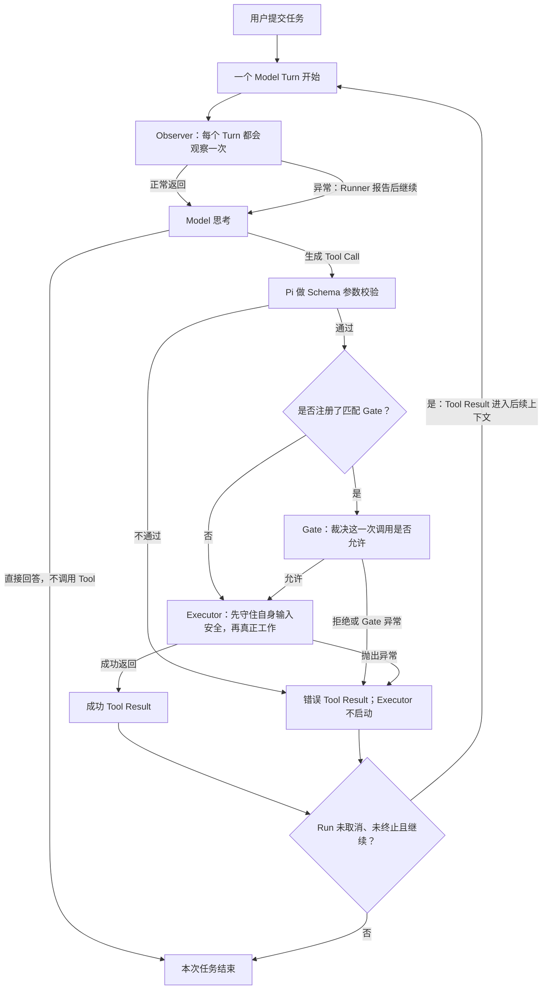

后续课程会反复使用这条分工：5.4 的只读 Tool 把实际统计放进 Executor；5.6 的 Shell 审批把单次调用决策放进 Gate；5.7 的 Session 状态恢复使用 Observer 一类生命周期 Handler。错误传播和副作用恢复始终是两件事：Git 只可能恢复受版本控制的文件状态，数据库和外部请求需要事务、幂等、补偿或备份。

本次真实 `observer` 实验在同一个界面里展示了三个不同层次：红色的 `PI_STUDY_ERROR_OBSERVER_5301` 是普通观察 Handler 的异常；绿色 Tool 区域里的 `PI_STUDY_ERROR_PROBE_OK` 是课程 Executor 返回的固定成功标记；最后“工具已调用一次并返回……”是 Model 读到该 Tool Result 后生成的自然语言总结。固定标记只证明这个纯内存实验 Executor 已经运行并成功返回，不代表它检查了真实文件或完成了业务任务；Model 的总结也不是第二次 Tool 执行。

退出前后的最终脱敏日志都严格保持同一条十步链：`armed -> observer_error -> observer_after -> call_accepted -> gate_after -> executor_start -> executor_success -> tool_result_success(false) -> tool_execution_end_success(false) -> tool_result_message_success(false)`，且没有重复调用、意外参数或 Turn 超限 marker。这使本次 observer 结论闭合为：普通观察 Handler 的异常被报告后，后置 Handler、Executor、成功 Tool Result 和 Model 收尾仍依次发生。该实验日志没有设计 `session_shutdown` marker，因此最终日志不新增关闭事件是预期行为，不能据此讨论 Pi 的 Session 关闭派发。

真实 `gate` 组只把异常位置从普通观察 Handler 改到匹配 Tool 的执行前门禁，其余 Tool、参数、Prompt、Model 和 TUI 保持不变。界面显示红色 `PI_STUDY_ERROR_GATE_5301`，退出前后的最终脱敏日志都严格保持五步链：`armed -> call_accepted -> gate_error -> tool_execution_end_error(true) -> tool_result_message_error(true)`。日志中没有后置门禁、任何 `executor_*`、Extension `tool_result_*`、success、重复调用或 Turn 超限 marker。这使本次 gate 结论闭合为：门禁无法完成安全判断时，Pi fail-closed，跳过 Executor，同时由 Core 形成 Model 可见的错误 Tool Result。

这里最容易误读的是两个“完成”：`tool_execution_end_error` 只表示 Core 已收尾本次 Tool 尝试，不表示 Executor 运行过；Model 最后的“工具已调用完成”也只是它读到错误 Tool Result 后生成的自然语言总结，不表示 Tool 成功。判断 Executor 是否进入，应看 Executor 函数内部的 `executor_start`；本组没有该 marker。该实验日志同样没有设计 `session_shutdown`，退出后五条不变是预期行为。

真实 `executor` 组继续只改变故障位置：门禁正常放行，课程 Executor 进入后抛出固定异常。界面显示红色 `PI_STUDY_ERROR_EXECUTOR_5301`，没有绿色 `PI_STUDY_ERROR_PROBE_OK`；退出前后的最终脱敏日志都严格保持八步链：`armed -> call_accepted -> gate_after -> executor_start -> executor_error -> tool_result_error(true) -> tool_execution_end_error(true) -> tool_result_message_error(true)`。日志中没有 `observer_*`、`gate_error`、`executor_success`、success、重复调用或 Turn 超限 marker。

这八步把故障位置锁定在 Executor 内：`gate_after` 证明执行前门禁已经放行，`executor_start -> executor_error` 证明实际工作函数已经开工并报错，后三个错误 marker 证明 Extension 的 Tool Result 观察、Core 收尾和 Model 消息链都把它识别为失败。Model 最后的“工具已调用完成”仍只是对错误 Tool Result 的自然语言总结，不表示执行成功。该实验使用纯内存 Tool，没有制造业务副作用；它证明 Pi 能传播 Executor 异常，但不证明真实文件、子进程、数据库或网络副作用会自动回滚。

当前课程使用一个独立显式实验 Extension，把唯一变量限制为 `observer`、`gate` 或 `executor`。它注册的 Tool 只在内存返回固定文本，不读业务文件、不执行 Shell 或子进程，也不主动联网。Tool 调用预算保证每个进程最多进入一次目标调用；超出 Turn 上限时持续 abort，避免错误结果诱导 Model 反复调用。脱敏日志只记录固定模式、状态和 `isError` 布尔值，不保存 Prompt、参数、Tool Result 正文、调用 ID、路径、Model 或凭据。只有日志成功写出 `armed` 后探针才进入就绪状态；若动态注册 Tool 后这一步失败，Tool 可能仍可见，但后续每个 Turn、门禁和 Executor 都会持续 abort 或 fail-closed。

这里日志中的 `mode=observer|gate|executor` 来自课程自定义 Flag `--pi-study-error-mode`，只表示本次在哪一层故意制造异常：普通观察 Handler、`tool_call` 门禁或 Tool Executor。默认值 `off` 表示不启用错误实验。它不是 Pi 官方的 `ctx.mode`；在这三组真实 TUI 实验里，`ctx.mode` 始终是 `tui`。它也不同于 `--tui-mode regular`，后者只选择终端界面的布局方式。

证据仍需分层：Fake 直接调用 Handler/Executor只能证明课程代码自己的分支；真实 `ExtensionRunner` 测试能证明普通事件 catch-and-continue 与 `tool_call` fail-stop 的宿主顺序；源码能解释 Core 如何包装错误；只有真实 Model 产生 Tool Call、TUI 显示固定错误、日志又出现对应 ToolResult message，才能证明本次 Provider/Agent 链确实完成错误传播。`tool_execution_start` 在门禁前就可能出现，不能把它当成 Executor 已进入；只认 Executor 函数内部记录的 `executor_start`。

### 从错误实验走向第一个有用的 Tool

5.3 用一个纯内存实验 Tool 分别在 Observer、Gate 和 Executor 制造异常，目的是看清“不同位置失败后，Pi 会怎样继续或停止”。5.4 不再以制造错误为目标，而是开始实现第一个真正有用的用户自定义只读 Tool：`pi_study_inspect`。

假设用户对 Pi 说：“检查 `docs/learning/06-extensions.md`，统计标题和链接，最多列出 20 项，不要修改文件。”完整过程如下：

1. Pi 启动时加载用户编写的 Extension。Extension 向 Pi 登记一个名为 `pi_study_inspect` 的 Tool，但此时还没有读取文件。
2. Model 收到用户请求，同时看到这个 Tool 的名称、用途和参数说明。Model 判断自己需要文件中的真实信息，于是生成一次 Tool Call。
3. Pi 先使用 Schema 检查 Tool Call 的参数形状，例如必填字段是否存在、类型是否正确、是否包含未知字段。Schema 不读取磁盘。
4. 如果项目另外注册了匹配的 Gate，Gate 再裁决“这一次调用是否允许”；没有 Gate 时，Schema 通过后可以直接进入 Executor。
5. Executor 无论是否经过 Gate，都必须自己检查实际文件是否位于允许目录、是不是普通 Markdown、是否存在符号链接逃逸，以及当前取消信号是否已经触发。只有这些检查通过后才读取并统计。
6. Executor 返回有限且明确的 Tool Result：标题和链接的总数、最多 20 个样本，以及结果是否被截断。它不修改文件、不执行 Shell，也不自行联网。
7. 如果当前 Run 没有取消或终止，Tool Result 会进入后续 Model Turn；Model 再把机器结果整理成用户能读懂的自然语言回答。

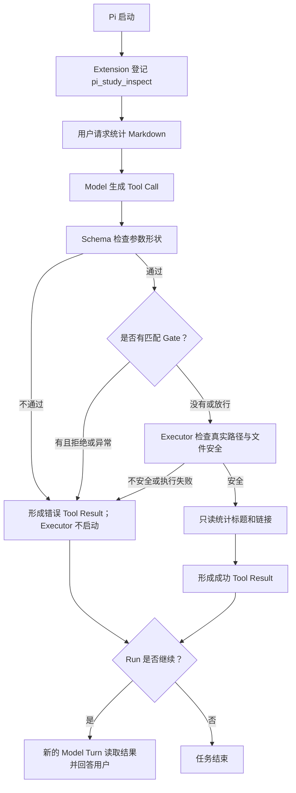

这条主链只需要先记住：`Extension 注册 Tool -> Model 调用 -> Schema 检查参数 -> Executor 实际工作 -> Tool Result -> Model 回答`。Observer 是观察 Turn 的可选 Handler；Gate 是裁决单次 Tool Call 的可选 Handler；二者都不是 Schema 或 Executor 的别名。

#### 同一份结果为什么分成三层

`pi_study_inspect` 完成统计后，需要同时服务两个不同的消费者：后续 Model 要根据结果回答用户，当前 TUI 则要把调用过程和统计结果显示清楚。Pi 因此把“结果内容”和“界面表现”分开：

| 对象 | 主要消费者 | 在本场景中的内容 | 边界 |
|---|---|---|---|
| `content` | 后续 Model | “共有 18 个标题、7 个链接，以及有限样本” | 这是进入 Tool Result、供 Model理解的内容 |
| `details` | Extension 的渲染与状态代码 | 文件名、标题数、链接数、是否截断等结构化字段 | 不保证自动显示，也不是给 Model 的主要正文 |
| `renderCall` | 当前 TUI 用户 | “正在检查 `06-extensions.md`” | 只负责调用阶段如何显示，不读取文件或决定是否执行 |
| `renderResult` | 当前 TUI 用户 | “18 个标题 · 7 个链接 · 已展示前 20 项” | 只负责结果如何显示，不改变 `content` 或执行成败 |

例如，Executor 返回的 `content` 正确写着 18 个标题，但 `renderResult` 因界面代码错误显示为 99：后续 Model 仍会读到 18，当前用户在自定义 TUI Tool 区域则会看到 99。这是显示错误，不会反向修改 Tool Result 中交给 Model 的 `content`。反过来，界面显示正确也不能证明 Executor 的统计一定正确。

`renderCall` 和 `renderResult` 都是可选能力。Tool 没有提供自定义渲染时，Pi 会采用默认显示；因此“自定义渲染不存在或失败”和“Executor 没有执行”不是同一件事。

#### 工作停止与结果失败是两件事

Executor 收到取消通知后，即使已经主动停止读取、清理资源，也还要选择怎样结束本次调用。Pi `0.84.1` 判断 Tool Result 成功或失败，看的是 Executor 的结束通道，而不是返回文字的含义：

| Executor 怎样结束 | Pi 的结果状态 | 即使文字写着 |
|---|---|---|
| 正常返回 `content/details` | `isError=false` | “已取消”“失败了”仍是协议上的成功结果 |
| 抛出异常或以异常拒绝 | `isError=true` | Core 把异常转换成错误 Tool Result |

这就像快递员正常提交一张“已完成”的签收单，却在备注里写“包裹没有送达”：人读得懂备注，但系统仍按正常签收通道记账。要让系统把它登记为配送失败，必须走失败通道，而不能只改备注文字。

因此，若 `pi_study_inspect` 把用户取消定义为一次失败，它应先停止工作并清理资源，再抛出取消异常；仅正常返回“已取消”虽然可能表示实际工作已经停下，但 Pi 仍会把本次 Tool Result 标为 `isError=false`。如果某个业务明确把“未找到内容”或“用户选择跳过”定义为正常结果，则可以有意正常返回；关键是不能用文字冒充错误状态。

具体选择由 Extension 作者先定义 Tool 合同，Pi 不会根据返回文字自动猜测：

| `pi_study_inspect` 的结果 | 结束方式 | 原因 |
|---|---|---|
| 安全读取完成，统计到若干标题和链接 | 正常返回 | 得到了合同允许的有效结果 |
| 安全读取完成，标题或链接数量为 0 | 正常返回 | 空统计也是有效结果 |
| 内容超过展示上限，只返回前 20 项并明确标记截断 | 正常返回 | 截断是 Tool 事先声明的正常能力，不是假装完整 |
| 路径越界、符号链接逃逸或目标不符合允许类型 | 抛出异常 | 请求不能安全执行 |
| 文件不存在、读取失败或解析异常 | 抛出异常 | 无法完成合同中的检查任务 |
| 用户取消本次检查 | 停止与清理后抛出取消异常 | 本 Tool 把取消定义为未完成，并要求 `isError=true` |

底层文件读取若支持 `signal`，可能在取消时自己抛出取消异常。Executor 应在完成必要清理后让该异常继续向上传播；如果把它捕获并改成正常返回“已取消”，Pi 仍会得到 `isError=false`。

后续不会要求一次记住阶段 5 的全部细节。5.4 完成时会用本次 Markdown 检查复述一遍完整 Tool 链；5.10 会沿同一场景综合复习加载、生命周期、Context、Observer、Gate、Executor、取消、错误、模式和资源释放；阶段 5 总门禁与最终综合项目还会再次要求脱离答案解释并演示整条链。

#### `pi_study_inspect` 的首版实现合同

系统地图确认后，首版候选实现已落在 [inspect-tool.ts](../../.pi/extensions/pi-study-guard/inspect-tool.ts)、[inspect-path.ts](../../.pi/extensions/pi-study-guard/inspect-path.ts) 和 [markdown-inspection.ts](../../.pi/extensions/pi-study-guard/markdown-inspection.ts)。三个模块分别负责 Pi Tool 合同、真实文件安全和纯 Markdown 统计，避免把 Schema、文件系统与展示逻辑混成一个函数。

| 层次 | 当前合同 | 仍不能证明 |
|---|---|---|
| Schema | 只接受必填 `file`；它必须是长度不超过 128、以小写 `.md` 后缀结尾的顶层 ASCII 文件名；拒绝未知字段、路径分隔符和 `..` | 文件真实存在、位于允许根或不是链接 |
| 文件 Executor | 允许根固定为本次 `ctx.cwd/docs/learning/`；拒绝根或目标 symlink、硬链接、目录和特殊文件；只读分块读取，最大 128 KiB | Extension 受到 OS 只读沙箱保护 |
| 读取一致性 | 打开时禁止跟随 symlink；读取前后核对文件描述符对应的对象、大小和纳秒级修改时间 | 能抵抗同一用户恶意进程替换整个父目录的所有竞态 |
| Markdown 统计 | 通过 `Marked` Token 统计 ATX/Setext 标题与 inline/reference/autolink；图片、定义和代码中的伪语法不计入链接 | 所有 Markdown 方言都采用相同解释 |
| Tool Result | `content` 给 Model；`details` 保留同源结构化结果；标题和链接合计最多展示 20 个样本，单字段最多 160 个 Unicode code point | 截断样本等于完整原文或全量结果 |
| TUI renderer | `renderCall/renderResult` 只显示有限文本；流式未校验参数、错误正文和畸形 details 都重新清洗、校验并截断 | UI 显示正确就能反推 Executor 统计正确 |
| 取消与错误 | 第三个显式 `signal` 是本次调用的权威信号；开工、读取和解析边界主动检查；取消或安全/读取/解析失败均抛出 | 单次同步系统调用或同步 Parser 能被瞬间抢占，或既有副作用会回滚 |

这里特意同时保留 Schema 与 Executor 的重复约束：Schema 让错误参数尽量在开工前失败，Executor 则对真实文件对象负责。即使未来没有额外 Gate，Executor 也不能把路径安全托付给 Model 或 Schema。

#### 当前证据到哪一层

| 证据 | 已直接证明 | 没有证明 |
|---|---|---|
| 纯函数与真实临时文件测试 | Markdown Token 语义、路径拒绝、文件类型、大小、读取变化、取消点和资源关闭 | 真实 Provider、Agent Loop 或 TUI |
| Pi `0.84.1` 的真实参数验证函数 | 当前严格 Schema 接受/拒绝的具体参数形状 | 完整 Core 已跳过 Executor并生成错误 Tool Result |
| Fake 工厂与 renderer 测试 | 主工厂只登记一次 Tool；当前组件文字有界且不保留终端控制序列 | 真实 Pi 发现、Model 选择或终端视觉呈现 |
| 无 Provider 的 Pi CLI 预检 | 当前 Pi 能加载显式 Extension 入口并解析 Tool allowlist | Provider 已看见或调用 Tool |

Schema 校验失败发生在 Executor 之前，Core 生成的 Model-facing 错误正文可能包含收到的参数；本 Tool 的 Executor无法缩短这段 Core 文本，但自定义 renderer 会限制当前 TUI 显示。其他受信 Extension 也可以在 `tool_result` 阶段改写结果，因此这里保证的是本 Tool 自己的输出和最终防御性显示，不是任意 Extension 组合后的全局不变量。

真实动态实验已补齐一条合法成功路径：Pi `0.84.1` 与 `openai/gpt-5.6-terra` 只获得 `pi_study_inspect`，Model 对 `06-extensions.md` 生成一次 Tool Call；compact TUI 显示 `40 headings | 7 links | truncated`，后续 Model Turn收到相同统计，`Ctrl+O` 展开后显示前 20 条有限样本且没有再次执行 Tool。实验前后目标文件 SHA-256 完全一致，为两次取样时该文件字节内容相同提供了极强的工程证据；它不是逐字节 `cmp` 的数学绝对证明。该证据不能排除文件在两次取样之间被修改后又恢复，也不证明统计值绝对正确、非法 Schema/路径/取消分支、其他文件、其他版本或模式，更不代表 Extension 没有写权限或受到操作系统只读隔离。

这个场景里，Context 就像 Pi 在派发任务时附上的“运行现场单”：

| 现场信息 | 大白话用途 | 不能误解为 |
|---|---|---|
| `ctx.cwd` | 这次操作会落在哪个项目目录 | 每次都临时读取的全局 `process.cwd()` |
| `ctx.mode` | 当前是 TUI、RPC、JSON 还是 Print | 是否有任意 UI 能力的同义词 |
| `ctx.hasUI` | 当前是否具备对话或通知协议 | 一定具备完整终端组件能力 |
| `ctx.isProjectTrusted()` | 项目级 Pi 资源是否已获信任 | Tool、Extension 或操作系统权限沙箱 |
| `ctx.sessionManager` | 只读查看当前 Session 的记录和树 | 修改 Session 的写入口 |
| `ctx.model` | 当前选中的 Model，可能暂时不存在 | 可用 Model 的完整目录 |
| `ctx.modelRegistry` | 查找 Model、Provider 和认证能力 | 当前已经选中的单个 Model |
| `ctx.signal` | 活动操作的协作式取消通知，可能不存在 | 强制终止或副作用回滚机制 |

`ctx.signal` 是每次读取时指向“当前 Agent Run”的动态现场值，不是某个 Command 或 Handler 私有的取消令牌。没有活动 Agent Run 时，例如空闲状态下执行 Extension Command，它通常是 `undefined`。Handler 即使看到 signal，也必须主动响应；Pi 不会强行抢占一个忽略信号、仍在等待的 Handler。

自定义 Tool Executor 的第三个参数另有一个显式 `signal`，它代表本次 Tool 调用，应作为该次执行的权威取消信号；第五个参数是 `ExtensionContext`。当前实现中二者在正常 Tool 执行期间通常来自同一个 Agent Run，但公开契约不保证对象恒等，而且 `ctx.signal` 会随活动 Run 改变，所以 Executor 不应以动态 `ctx.signal` 替代第三个显式参数。调用 `pi.exec` 时也必须主动把这个 signal 传入，子进程才会收到对应的终止请求。

### 模式分支

Pi `0.84.1` 的静态契约是：

| 模式 | `ctx.mode` | `ctx.hasUI` | 安全门禁的典型处理 |
|---|---|---:|---|
| 交互式终端 | `tui` | `true` | 可以询问用户，也可使用 TUI 专属组件 |
| RPC | `rpc` | `true` | 可通过协议向客户端请求交互，但不等于完整 TUI |
| JSON Event Stream | `json` | `false` | 不等待 UI，使用明确 fallback |
| Print | `print` | `false` | 不等待 UI，使用明确 fallback |

因此，`mode` 和 `hasUI` 不能互换：判断“能否发起普通 UI 交互”先看 `hasUI`，判断“能否使用终端专属组件”必须看 `mode === "tui"`。

### `notify` 不一定是弹窗

大白话说，`ctx.ui.notify` 的意思是“请当前宿主把这条消息告诉用户”，并不承诺所有模式都画出同一种弹窗。Pi `0.84.1` 在 TUI 中处理 `info` 通知时，会把它作为一段低对比度灰色状态文字追加到输入框上方的聊天记录区；长文本会换行。它不是右上角 Toast，也不会按固定时间自动消失。后续状态可能原位覆盖它，界面重建可能清除它，过快退出也可能发生在异步绘制完成之前。

这也解释了为什么证据必须分层：Handler 日志中的 `route=ui` 只能证明代码决定调用 UI；Fake 收到 `notify` 只能证明调用形状正确；只有通知仍应存在时对真实 TUI 的观察，才能证明该次终端确实完成了可见呈现。不同主题、终端、TUI 模式或 RPC 客户端仍需各自验证。

### 证据边界

上述 Context 字段、四种模式和错误传播是对本机 Pi `0.84.1` 类型、随包文档与编译后实现的静态核对。真实模式对照又补了两条互相独立的运行证据：Regular TUI 中，用户直接观察到输入框上方的灰色 Context 状态行；Print 中，进程正常退出、stdout 为空，Context fallback 只写入 stderr。两边追踪都没有 Agent、Turn 或 Tool 事件。真实取消实验另行证明了本次 `Esc -> ctx.signal -> tool_call Handler -> Operation aborted`；真实 observer、gate 与 executor 三组又分别证明了普通观察 Handler 异常后的继续执行、执行前门禁异常时的 fail-closed，以及 Executor 开工后异常被转换为错误 Tool Result。它们都不证明 RPC/JSON、其他终端与主题、任意 Tool 实现或副作用回滚。阶段 5.3 的最终理解验收状态只记录在学习计划中。

## Command、Tool 与事件 Handler

三者都是 Extension 向 Pi 登记的运行时入口，根本区别是发起者不同：

- Command：用户点名要求 Extension 执行一项操作。
- Tool：通常由 Model 判断需要使用，再由 Pi 调用 Executor。
- 事件 Handler：Pi Runtime 运行到特定时刻后自动派发。

### 一个从启动到结束的完整场景

假设 `security-guard` Extension 在工厂中登记三项能力：

| 登记内容 | 示例 | 作用 |
|---|---|---|
| Command | `/security-report` | 用户主动查看安全报告 |
| Tool | `scan_sensitive_file` | Model 在处理普通任务时检查文件 |
| 事件 Handler | `tool_call` | Pi 准备执行 Tool 前检查或阻止调用 |

Pi 加载 Extension 后，工厂只把这些入口登记到当前进程的对应表中，尚未执行 Command Handler 或 Tool Executor。随后三条触发链分别运行：

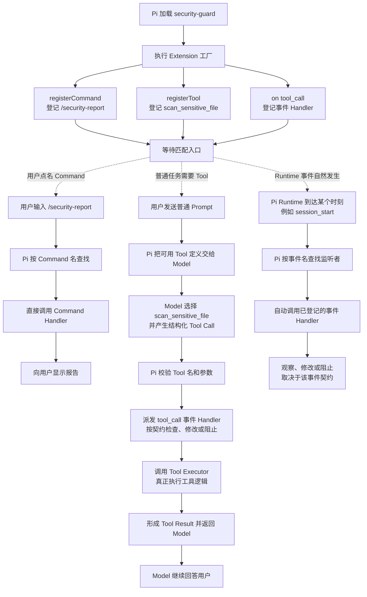

图中的 `tool_call` 同时说明了三者可以组合：Tool 由 Model 选择，但在 Executor 真正运行前，Pi 还可以先派发 `tool_call` 事件，让事件 Handler 执行门禁检查。

### 三者逐项对照

| 对比项 | Command | Tool | 事件 Handler |
|---|---|---|---|
| 主要发起者 | 用户 | Model | Pi Runtime |
| 登记 API | `registerCommand` | `registerTool` | `on` |
| 触发条件 | 用户输入匹配的 `/命令名` | Model 产生匹配的 Tool Call | 对应生命周期事件实际发生 |
| 运行函数 | Command Handler | Tool Executor | Event Handler |
| 输入 | 命令后的参数字符串和 Command Context | 通过 Schema 校验的结构化参数、显式取消信号和 Extension Context | Pi 产生的事件对象和 Extension Context |
| 主要结果去向 | UI、Session，或由 Handler 发起的后续动作 | Tool Result，通常进入后续 Model 上下文 | 回到 Pi Runtime；能否修改或阻止取决于事件契约 |
| 是否先由 Model 决定 | 否 | 是 | 否 |
| `--no-tools` 的直接影响 | 不禁用 Command | 会改变活跃 Tool 集，Model 无法调用已禁用 Tool | 不会统一关闭事件系统；但对应事件没有发生时自然不会触发 |

#### Command：用户点名触发

用户输入 `/security-report` 后，Pi 先查 Command 表并直接调用对应 Handler，不需要 Model 先判断应该做什么。Command Handler 可以显示通知、读取 Session 状态或执行其他逻辑；如果 Handler 主动发送用户消息或调用其他运行时能力，才可能继续进入 Agent 或外部操作。因此“Command 不需要 Model”不等于“Command 永远不能间接启动 Model”。

#### Tool：Model 选择，Executor 执行

注册 Tool 只是把名称、说明和参数 Schema 放进可用工具集合。普通 Prompt 进入 Agent 后，Model 才可能选择它并产生 Tool Call；Pi 随后查找名称、校验参数、派发执行前事件并调用 Executor。Executor 返回 Tool Result 后，Model 通常继续生成下一步回答。

必须分清三个阶段：

`registerTool -> Model 产生 Tool Call -> Executor 真正执行`

注册成功不能证明 Model 一定选择它，Tool Call 出现也不能跳过参数校验、事件门禁和 Executor 执行结果。

#### 事件 Handler：Runtime 到点自动通知

Extension 用 `on` 表示“当这个事件发生时通知我”。用户不需要输入 `/session_start`，Model 也不需要选择它；当 Pi 建立 Session 时，Runtime 自动派发 `session_start`，已登记的 Handler 才执行。

事件 Handler 可以承担三类职责：

| 职责 | 示例 | 边界 |
|---|---|---|
| 观察 | 在 `session_start` 记录启动标记 | 只证明观察逻辑运行，不改变主流程 |
| 拦截 | 在 `tool_call` 检查危险调用 | 只有该事件契约支持拒绝时才能阻止 |
| 修改 | 在 `input` 或 `tool_result` 返回替换结果 | 能修改哪些字段由对应事件契约决定 |

Pi `0.84.1` 的 `ExtensionAPI` 暴露 33 个 `on` 事件名，覆盖 Trust、资源、Session、上下文、Provider、Agent、Turn、Message、Tool、Model、Thinking、用户 Shell 和输入。这个数字表示当前版本的事件入口数量，不表示 Extension 只有 33 项能力，也不应作为跨版本不变的契约。

### 映射到 `pi-study-guard`

当前实验 Extension 的关系如下：

```text
pi-study-guard Extension
├── CLI Flag：--pi-study-guard、--pi-study-cancel-probe
├── Command：/study-inspect、/pi-study-trace（仅追踪开启时）
├── Tool：pi_study_inspect
└── 事件 Handler
    ├── session_start、session_shutdown
    ├── input、user_bash、model_select
    ├── Agent、Turn、Message、Tool 生命周期事件
    └── 默认关闭的 tool_call 取消实验门禁
```

5.2 的 A 组采证时，主 Extension 尚未注册自定义 Tool。该历史版本启动、由用户触发一次 `/pi-study-trace`，再用 `/quit` 正常退出后的完整真实日志是：

```text
0001 factory
0002 session_start reason=startup
0003 command name=pi-study-trace
0004 session_shutdown reason=quit
```

这证明本次工厂追踪逻辑先执行，随后 `session_start` Handler 被触发；用户输入 `/pi-study-trace` 后，Pi 又按 Command 名调用了对应 Handler；用户输入 `/quit` 正常退出时，Pi 派发了 `session_shutdown`，对应 Handler 收到的 `reason` 是 `quit`。日志中没有 `input`、Agent 或 Turn 事件，与本次 Extension Command 没有进入普通 Prompt/Agent 链一致。该历史版本没有自定义 Tool，本次也没有普通 Prompt 或 Model，因此没有 Tool Call 或 Executor 证据；后来新增 Tool 不改变这组历史日志的证明范围。

最简记忆：

> Command 是用户说“现在做这个”；Tool 是 Model 说“我需要用这个”；事件 Handler 是 Pi Runtime 说“这个时刻发生了，请处理”。

### 同一检查能力的两个入口

5.5 继续沿用“检查 `06-extensions.md`”这个场景，但增加一个用户可以直接点名的 `/study-inspect` Extension Command。它与 `pi_study_inspect` Tool 使用同一个只读检查服务，区别只在入口和结果适配层：Command 不伪造 Tool Call，Tool 也不调用 Command Handler。

| 对比项 | `pi_study_inspect` Tool | `/study-inspect` Extension Command |
|---|---|---|
| 谁发起 | Model 根据普通 Prompt 决定是否调用 | 用户输入命令后由 Pi 直接命中 |
| 参数入口 | 结构化参数，先经过 Tool Schema | 命令名后面的原始参数字符串，由 Handler 自己解析 |
| `tool_call` Gate | 若有匹配 Gate，则放行后才执行；没有 Gate 时 Schema 后直接执行 | 不经过 Tool Call，因此不经过 `tool_call` Gate |
| 共享工作 | 调用只读检查服务，得到同一种检查报告 | 调用同一个只读检查服务，得到同一种检查报告 |
| 结果去向 | `content/details` 形成 Tool Result；Run 继续时由后续 Model Turn读取 | Handler 直接把规范化摘要送往当前 UI 或无 UI fallback |
| 是否自动再问 Model | 通常会，但仍取决于 Run 是否继续 | 不会；Handler 完成后本次命令就结束 |
| `--tools` | 会影响 Tool 是否对 Model 可用 | 不会关闭 Command |
| `Ctrl+O` | 只重绘已有 Tool Result 的 renderer | 不适用，不会把 Command 结果变成 Tool Result |

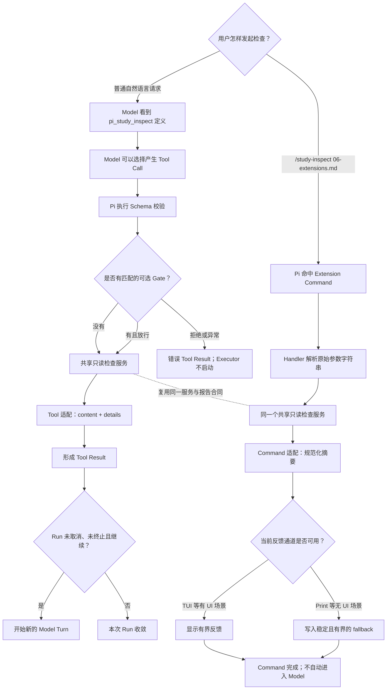

界面上都以 `/` 开头的输入，也不一定是同一种对象：

| 表面形式 | 对象 | 主要作用 |
|---|---|---|
| `/quit` | Pi TUI 内置 Command | 由交互模式先处理，不是项目 Extension |
| `/study-inspect 06-extensions.md` | Extension Command | 命中后直接调用用户编写的 Handler |
| `/review ...` | Prompt Template | 展开成普通 Prompt，再交给 Model |
| `/skill:name ...` | Skill 调用语法 | 加载 Skill 指令后进入普通 Agent 任务 |

Pi `0.84.1` 在 `AgentSession.prompt()` 中先匹配 Extension Command；命中后会等待 Handler 完成并直接返回，不再派发普通 `input`、展开 Prompt Template 或进入 Model。TUI 的 `/quit` 等内置 Command 甚至在进入 `AgentSession.prompt()` 前就已分流。因此，“Extension Command 优先”只适用于已经进入 AgentSession 的文本，不能覆盖所有内置 Slash Command。

`getArgumentCompletions` 只是 TUI 编辑器的输入建议，不是提交校验器。它拿到参数前缀，但没有 Command Context 或取消信号；即使用户从补全列表选中了文件名，Handler 仍必须重新解析并校验最终参数。Command Handler 的公开结果是 `void`，不会自动生成 Tool Result；Handler 意外抛错会形成 Extension error，但该 Slash Command 仍被视为已经处理，不能用“命令已命中”代替业务成功证据。

空闲时调用 Command，`ctx.signal` 通常是 `undefined`，因为它表示当前 Agent Run 的动态取消信号，不是这次 Command 独享的取消令牌。TUI 中可使用 UI 反馈；Print/JSON 的 UI 是 no-op，必须另设不会等待交互的有界 fallback。RPC 虽然 `hasUI=true`，也只表示客户端协议可承载部分交互，不等于拥有完整 TUI。真实 Print 启动仍可能要求已选 Model 元数据，但命中的 Extension Command 本身不需要请求 Provider 或让 Model 作决定。

#### `/study-inspect` 首版合同速查

首版 Command 固定为 `/study-inspect <file>`，只接受 `docs/learning/` 顶层一个 Markdown 文件名。外围空白可以去掉；缺少文件名、多传第二个参数或选项、传入路径表达式、非 `.md` 文件名，都必须在调用共享检查服务前拒绝。`getArgumentCompletions` 只按用户已经输入的前缀过滤固定安全示例 `06-extensions.md`；它没有 `ctx.cwd`，也不扫描当前目录。补全只是一条输入建议，Handler 必须重新校验最终提交的原始参数。

Handler 开始时取得 `{ cwd: ctx.cwd, signal: ctx.signal }`，再把它们连同已校验文件名交给共享检查服务。`ctx.cwd` 只说明当前 Session 从哪里定位 `docs/learning/`，不是权限证明或安全沙箱；`ctx.signal` 是可选的当前 Agent Run 信号，不是 Command 专属取消令牌。Tool 与 Command 复用的服务不接触 `ExtensionAPI`、Context、UI 或 Tool Result 等宿主合同，二者不互相调用；该职责隔离不等于服务完全不依赖 Pi 包，因为当前 Markdown 解析与文本清洗仍复用 `pi-tui` 的通用能力。

| 运行模式 | `/study-inspect` 的反馈出口 |
|---|---|
| TUI | 通过 `ctx.ui.notify` 显示一次有界摘要 |
| Print | UI 是 no-op，把同一摘要写入 `stderr`，不等待交互 |
| JSON | 同样写入 `stderr`，保持 `stdout` 只承载给外部程序解析的 JSON 事件流 |
| RPC | 只能依赖客户端实际支持的部分 UI 协议；不能把 `hasUI=true` 当成完整 TUI 保证 |

命中本 Command 后，Handler 返回 `void`，不形成 Tool Result，也不自动启动 Model 或 Provider。限定在当前首版 Handler 不主动发送消息或调用 Model 的设计中，一次 `/study-inspect` 是 **0 次 Model 请求、0 次 Tool Call、0 个 Tool Result**；摘要必须由 Handler 在返回前送到上表中的反馈出口。

Esc 也不能被当成 Command 的自动取消键。Pi `0.84.1` 的 TUI 只在存在正在 streaming 的 Agent Run 时用 Esc 去 abort 那个 Run；空闲执行 `/study-inspect` 时通常没有活动 Run，`ctx.signal` 也通常是 `undefined`，所以 Esc 不会强制终止正在等待的 Command Handler。即使某个 Command 恰好取得了活动 Run 的 signal，也只有 Handler 和底层操作主动检查或传递该 signal，工作才会协作停止。长时间 Command 若需要可靠取消，必须另行设计自己的取消机制，不能把 Agent Run 的 Esc 行为直接借来使用。

#### 当前实现与自动证据

当前代码已经按三层职责接线：[`inspect-service.ts`](../../.pi/extensions/pi-study-guard/inspect-service.ts) 只接收 `cwd/file/signal` 并返回统一报告；[`inspect-tool.ts`](../../.pi/extensions/pi-study-guard/inspect-tool.ts) 把报告适配为 Tool 的 `content/details` 和 renderer；[`inspect-command.ts`](../../.pi/extensions/pi-study-guard/inspect-command.ts) 解析原始参数并把同一规范摘要送往通知或 `stderr`。主工厂同时注册一个 `pi_study_inspect` Tool 和一个常驻 `/study-inspect` Command，追踪环境开启时才额外注册 `/pi-study-trace`。

实现保留了可复查的 Red -> Green 链，精确过程和动态测试计数只记录在唯一学习计划中。自动测试覆盖真实临时 Markdown 下 Tool/Command 摘要逐字一致、补全不触发检查服务、参数在服务前拒绝、TUI/RPC 通知、Print/JSON `stderr`、单次 `ctx.signal` 读取及错误脱敏。

真实 Pi `0.84.1` 的 TUI 与 Print 验收已经补齐上述动态边界。TUI 中，固定补全候选进入真实编辑器，提交标准 ASCII 空格形式的 `/study-inspect 06-extensions.md` 后只出现一次有界 `notify` 摘要；Command 前后的生命周期追踪没有新增 Agent、Model、Tool Call 或 Tool Result 事件。Print 中，同一 Command 的 `stdout` 为 0 字节，`stderr` 恰有一份相同摘要，生命周期也只有工厂、Session 启动和正常退出。结合 Pi 的 Command 优先派发顺序，这两组证据证明本次标准调用直接由 Handler 完成，是 0 次 Model 请求、0 次 Tool Call 和 0 个 Tool Result。

该结论不扩展到 JSON framing、RPC 客户端、Tab 分隔的 Slash 文本、未知 Command、启动期任意网络或其他 Extension；TUI/Print 结果也不能反推 JSON/RPC 的动态表现。Print 本次退出码为 0，同样不能被解释成所有 Command 业务错误都会可靠地产生非零退出码。

## 危险 Shell 命令审批：同一套保安规则，两扇不同的门

先看一个完整的大白话场景。项目希望在 Shell 真正开工前加一道保安：普通只读命令可以直接通过；命中危险规则的命令必须询问用户；明确拒绝、用户选择 No、Esc、超时、没有可用 UI、策略代码异常，都不能执行。

同一条 Shell 命令可能从两扇门进来：

1. Model 生成 `bash` Tool Call，由 Pi 准备调用 bash Executor。
2. 用户在 TUI 输入 `!命令` 或 `!!命令`，直接要求 Pi 执行；RPC 客户端也有对应的 `bash` 请求。

两扇门可以共用同一个纯策略分类器，但不能共用同一种 Pi 返回值。可以把它理解成：两家分公司的保安执行同一份公司制度，但各自使用不同格式的放行单和拒绝单。

### 一份策略，两个适配器

| 职责 | 输入 | 输出 | 不负责什么 |
|---|---|---|---|
| 纯策略分类器 | 待检查的命令字符串 | `allow`、`approval_required` 或 `deny` | 不调用 Pi UI、不执行 Shell、不生成 Tool Result；固定规则编号由后面的决策层按分类结果派生 |
| 审批决策器 | 策略结论、`hasUI`、确认框结果 | 最终放行或拒绝 | 不改写命令、不启动 Executor |
| Model `tool_call` 适配器 | `bash` Tool Call、当前 Context | 映射成 `tool_call` 的放行或 `block` | 不把 Tool Call伪装成用户 Shell |
| 用户 `user_bash` 适配器 | `!`/`!!` 或 RPC bash 事件、当前 Context | 映射成继续执行或一份替代 `BashResult` | 不生成 Tool Result，也不自动调用 Model |

审批状态固定为默认拒绝：

| 策略和现场 | 最终决定 |
|---|---|
| `allow` | 直接放行，不打扰用户 |
| `deny` | 所有模式都拒绝 |
| `approval_required` 且 `ctx.mode="tui"`、`hasUI=true` | 显示有超时的确认框；只有明确 Yes 才放行 |
| No、Esc、超时、确认框异常 | 拒绝 |
| `approval_required` 且不是本机 TUI | 不等待不受本合同信任的交互，直接拒绝 |
| 策略分类器异常 | 适配器自行收敛为拒绝 |

TUI 与 RPC 的 `hasUI` 都是 `true`，但 RPC 是否真能完成确认仍取决于客户端响应；不设置超时，客户端不回应时就可能一直等待。5.6 首版只把本机 TUI 视为人工批准通道，RPC、Print、JSON 对 `approval_required` 一律拒绝；以后若要支持可信 RPC 客户端，必须另立带身份、响应和超时边界的合同。Print/JSON 的 `hasUI=false`；其中 Model 仍可能请求 bash Tool，所以 `tool_call` 门禁仍有意义，但 Print/JSON 并没有可供用户输入 `!`/`!!` 的直接 Shell 前台。

### 两扇门的精确合同

| 对比项 | Model 请求 `bash` Tool | 用户 `!`/`!!` 或 RPC bash |
|---|---|---|
| Extension 事件 | `tool_call` | `user_bash` |
| 命令位置 | `event.input.command` | `event.command` |
| 放行 | 返回 `undefined`，让后续 Handler 和 bash Executor 继续 | 返回 `undefined`，让后续 Handler 和默认 Shell 后端继续 |
| 拒绝 | 返回 `{ block: true, reason }` | 返回 `{ result: BashResult }`，其中使用固定脱敏文案和非零 `exitCode` |
| 拒绝后的真实执行 | bash Executor 不启动 | 默认 Shell 不启动 |
| 结果对象 | Pi 形成错误 Tool Result；Run 继续时 Model 可看到 | 形成替代 Bash 执行结果；没有 Tool Result，也不会自动请求 Model |
| Handler 自己抛错 | Core 将其收敛成错误 Tool Result，Executor 不启动 | Runner 记录 Extension error 后继续，原命令仍可能落到默认 Shell |

`user_bash` 的公开返回类型只有 `operations` 和 `result`，没有 `block`。如果绕过 TypeScript 给它返回 `{ block: true }`，这个对象虽然会抢先结束后续 Handler，但调用方找不到替代 `result` 或 `operations`，仍会执行原命令。更危险的是，`user_bash` Handler 直接抛异常也不是拒绝：Pi 会报告 Extension error，然后继续后续 Handler或默认 Shell。因此用户 Shell 适配器必须在内部捕获策略与 UI 异常，并返回完整的非零替代 `BashResult`，不能靠 `throw` 实现 fail-closed。

这份拒绝结果中的 `cancelled` 应为 `false`。它表示“开工前被策略拒绝”，不是“Shell 已经启动，后来被取消”。审批框里的 Esc 与运行中 Shell 的取消也是两件不同的事。

`!` 与 `!!` 都经过同一个 `user_bash` 门禁。它们只在后续上下文上不同：`!` 的 Bash 记录可进入之后的 Model Context；`!!` 的记录仍会显示并保存在 Session 中，但组装 Model Context 时被过滤。这个区别不改变审批规则，也不代表 `!!` 更安全。

### 首版受控规则与实验合同

首版不尝试解析通用 Shell 语法，只认识两条逐字匹配的课程命令。分类器收到的 `command` 必须与下表完全相同；大小写、空白、换行、分号、文件名或其他任何字符有变化，都归入 `deny`。

| 规则 | 固定命令 | 分类 | 用途 |
|---|---|---|---|
| `safe_printf` | `printf '%s\n' PI_STUDY_SHELL_SAFE` | `allow` | 证明已知安全命令可以不弹框直接通过 |
| `marker_write` | `printf '%s\n' PI_STUDY_SHELL_EXECUTED > PI_STUDY_SHELL_GATE_MARKER.txt` | `approval_required` | 只在私有临时目录创建固定 marker，用来区分是否真正执行 |
| `unknown` | 其余所有字符串 | `deny` | 证明未知输入默认拒绝 |

审批超时固定为 `10000` 毫秒。只有本机 TUI 的确认框明确返回 `true`，并且批准后再次检查到当前 signal 尚未取消，`marker_write` 才能放行。No、Esc、超时、确认期间取消、无 UI、RPC、策略异常和 UI 异常都拒绝。

公开确认合同只能让 Extension 可靠区分“明确确认”为 `true`，以及“没有确认”为 `false`。No、Esc、超时或对话取消最终都落入同一个未确认分支，因此门禁只能记录稳定原因 `not_confirmed`，不能仅凭 `confirm()` 返回值伪造 `declined`、`cancelled`、`timeout` 三种原因。若开工前或批准后直接观察到 signal 已取消，可以另记 `signal_aborted`；这是 signal 证据，不是确认框告诉门禁的原因。

两个入口对同一最终决定使用不同的宿主合同：

| 最终决定 | Model `tool_call` | 用户 `user_bash` |
|---|---|---|
| 放行 | 返回 `undefined` | 返回 `undefined` |
| 拒绝 | 返回固定脱敏 `block`；首版不设置 `terminate` | 返回固定脱敏替代结果，`exitCode=126`、`cancelled=false`、`truncated=false` |

首版不设置 `terminate`，因为这里拒绝的是一次 Tool Call，不是退出 Pi 或结束整个 Agent Run。Core 仍可把错误 Tool Result 交给 Model解释；如果 Model 再次请求，同一门禁会重新分类和拒绝。这个选择保证每次执行都受检，但不保证 Model 不会重试，也不把单次 `block` 解释成整个任务终止。

自动测试先锁住不启动真实 Shell 的完整矩阵：精确 `SAFE`、精确 `MARKER`、各种近似字符串；TUI Yes 与统一的未确认分支；固定有限 `timeout` 确实传给确认框；确认期间取消；RPC/Print/JSON 默认拒绝；策略与 UI 抛错；两种返回对象的精确形状；以及一个真实 `ExtensionRunner` 对照，证明裸 `user_bash` Handler 抛错后默认 Shell 仍可能继续，而生产适配器捕获同一异常后必须返回替代结果、令默认 Executor 调用数为零。Fake 中的 No、Esc 和超时都只是同一个 `confirm=false` 程序分支，不能冒充真实按键或真实计时证据。

自动 Green 后再做少量真实 Pi 对照。实验必须使用受信的 `0700` 私有临时项目，将项目设置中的 `shellPath` 固定为 `/bin/bash`、`shellCommandPrefix` 固定为空字符串，并通过 `--approve` 让这份项目设置实际生效；同时使用 `--no-extensions`，只显式加载当前课程 Guard，确认没有后置 `tool_call` 参数修改器、自定义 bash Tool 或 `user_bash operations`。这些前提把“门禁看见的命令”和“最终交给 Shell 的命令”锁到本次受控实验内，不能外推成任意 Extension 组合下的保证。

真人验收只保留一个 TUI 进程中的五次操作，再加一个新的 Print 进程；批准写 marker 的步骤放在 TUI 最后，开工前及每个拒绝步骤后都确认 marker 不存在：

| 真实组 | 入口和操作 | 预期观察 |
|---|---|---|
| A | Model 只请求一次固定安全 bash | 无确认框；绿色 Tool 输出包含固定安全文本；追踪为 `tool_call/allow` |
| B | Model 只请求一次固定 marker bash，用户选择 No | TUI 出现错误 Tool Result；marker 不存在；追踪为 `tool_call/deny/not_confirmed` |
| C | 用户输入固定安全 `!` 命令 | 无确认框；显示固定 Bash 输出；追踪为 `user_bash/allow`，本次没有 Tool Result |
| D | 用户输入固定 marker `!` 命令并按 Esc | 返回非零替代 Bash 结果；默认 Shell 不启动；marker 不存在；追踪为 `user_bash/deny/not_confirmed` |
| E | 用户输入固定 marker `!!` 命令并明确 Yes | marker 内容精确为固定文本；追踪为 `user_bash/allow/confirmed`；门禁决策不因 `!!` 改变 |
| F | 新 Print 进程中让 Model 只请求一次固定 marker bash | 无本机审批 UI，门禁直接拒绝；marker 不存在；追踪证明进入的是 `tool_call` 而非 `user_bash` |

真实追踪只记录固定枚举，例如入口、规则、决定、原因和 `excludeFromContext`，不记录原始命令、Prompt、Tool 参数、调用 ID或凭据；未知自定义 Tool 名和消息 Role 也统一写为 `custom`。`marker 不存在` 仍不是独立结论：只有同时看到入口已触发、门禁决定为拒绝、Executor 未进入以及文件仍不存在，才能证明本次被门禁挡住；Model 根本没发 Tool Call 或 Shell 自己失败都属于无效样本。Print 的 stdout 可能包含 Model 对错误 Tool Result 的最终说明，不能照搬 5.5 Command 实验的 `stdout=0` 判据；本轮应检查门禁追踪、错误 Tool Result和 marker，而不是要求 stdout 为空。

### 总流程

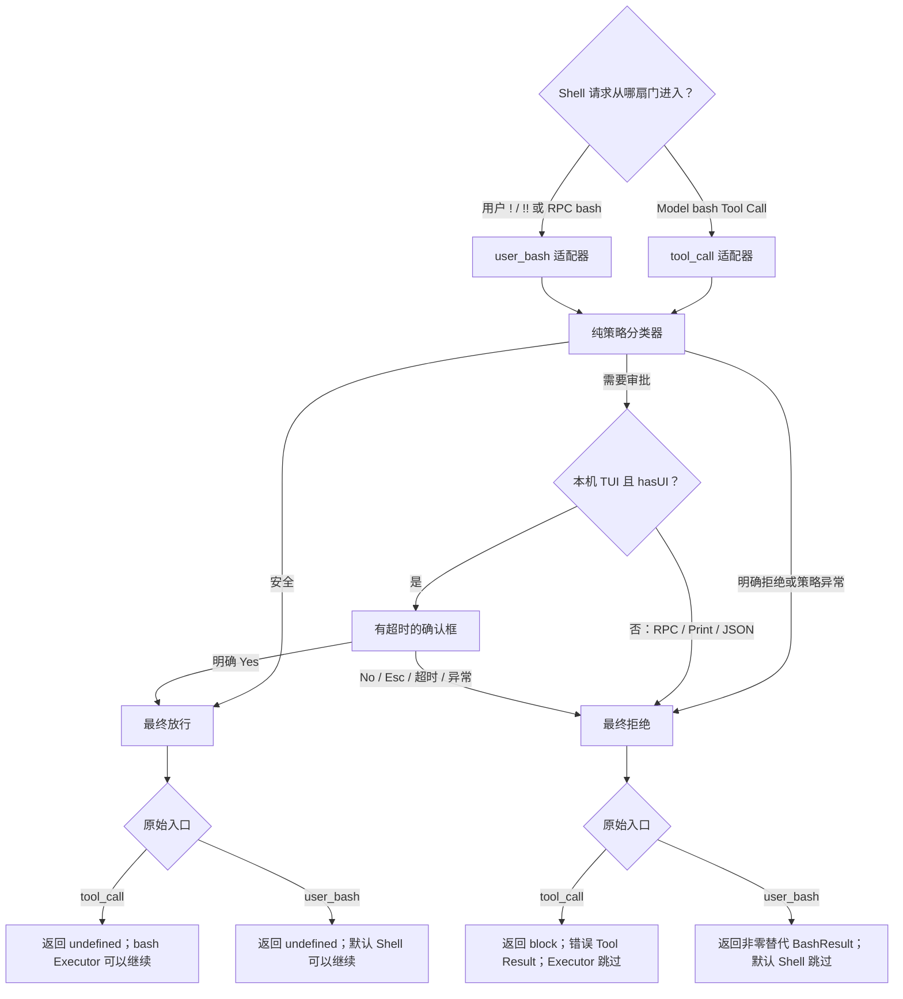

### 这道门禁能证明什么，不能证明什么

- 纯字符串规则只能覆盖明确冻结的语法，不能正确理解任意引号、别名、环境变量、命令替换、编码或混淆；无法识别的输入必须默认拒绝。
- `tool_call` 的参数在 Schema 校验后仍可能被后续 Handler 原地修改，Pi 不会再次校验。若门禁后还有参数修改器，就不能声称最终执行的命令仍是门禁检查过的那一条。
- 两类事件看到的都是尚未拼接 `shellCommandPrefix` 的命令；真正执行时 Pi 可能再添加受配置控制的前缀。因此门禁还必须把该前缀和配置来源视为独立的可信前提。
- `user_bash` 的第一个有效返回会接管后续处理；其他受信 Extension 仍可能改变加载顺序、提供自定义 `operations` 或直接执行进程。门禁只保护自己接入的入口。
- 它不控制 Extension 自己调用 `pi.exec`/子进程、SDK 直接执行 Bash、用户在普通系统终端输入命令，也不降低 Pi 进程的操作系统权限。
- 用户点击允许只代表这一次请求获准，不代表命令本身安全；执行后的副作用也不会因为后续报错或取消而自动回滚。

5.6 的真实实验使用私有 `0700` 临时目录中的固定 marker 文件：它没有业务或破坏性副作用，但创建 marker 本身仍是一项小而明确的文件副作用。验收把入口追踪、审批决策和 marker 是否存在组合起来；单独看到 marker 不存在，既可能是门禁拒绝，也可能是请求根本没有触发或 Shell 自己执行失败。

当前主工厂已经注册 [`shell-policy.ts`](../../.pi/extensions/pi-study-guard/shell-policy.ts) 与 [`shell-gate.ts`](../../.pi/extensions/pi-study-guard/shell-gate.ts)。自动测试验证了逐字分类、两个入口的返回合同、本机 TUI 审批矩阵、异常默认拒绝、真实 `ExtensionRunner` 的 `user_bash` fail-open 对照、主工厂派发顺序和固定枚举追踪。

真实 Pi `0.84.1` TUI 对照补齐了宿主、按键与执行证据：Model SAFE 进入 `tool_call` 后无需确认并成功执行；Model MARKER 选择 No 后在 Executor 前形成错误 Tool Result，marker 不存在；用户 `!` SAFE 直接经过 `user_bash` 放行，不启动 Model或产生 Tool Result；用户 `!` MARKER 按 Esc 后得到合成 `exitCode=126`，marker 不存在；用户 `!!` MARKER 明确选择 Yes 后记录 `excludeFromContext=true` 与 `confirmed`，Shell 实际写出固定 marker。No 和 Esc 在公开确认结果及追踪中都只能表示 `not_confirmed`，实际按键由用户现场观察补充。

真实 Print 对照中，Model 仍发起 MARKER `bash` Tool Call，但门禁因 `no_local_tui` 默认拒绝；追踪没有 `user_bash` 或 Executor 后的 Extension `tool_result`，marker 也不存在。Model 随后输出“命令已执行”，说明自然语言总结可能与 Tool Result相反，不能代替门禁追踪、Executor边界和文件副作用证据。

这些动态证据仍不覆盖 JSON/RPC、任意 Shell语法、其他 Extension组合、`shellCommandPrefix` 被重新配置、直接子进程调用或操作系统隔离。有限策略不能构成通用 Shell解析器、权限系统或沙箱；详细验收过程与当前进度只记录在唯一学习计划中。

## 状态属于哪条 Session Branch

先沿用 5.6 的 Shell Gate。假设它在内存中保存三个值：固定安全模式 `mode`、当前活动 Branch 的累计拒绝次数 `blockedCount`，以及最近一次脱敏决定 `lastDecision`。当前 Extension 实例活着时，这些值很好用；一旦执行 `/reload`、New、切换或恢复 Session、Fork，旧实例就会被替换。Tree 导航虽然不会重建工厂，却会把当前 leaf 切到另一条 Branch，旧内存也可能仍是上一条路线的状态。

可以把四类数据理解成四种不同的纸张：

- 内存变量是保安面前的白板，读取最快，但换班或切路线后不能当作权威记录。
- Custom Entry 是订在当前 Session Branch 上的状态凭条；`pi.appendEntry()` 每次追加新节点，不会原地修改旧节点。
- Custom Message 是会被放进 Model 阅读材料的便签；它的 `content` 会进入 Model Context，因此不适合保存内部门禁状态。
- Tool Result `details` 是某一次 Tool 执行回执上的结构化附件。它适合该次 Tool 的 renderer 和程序处理，却覆盖不了没有 Tool Result 的用户 `!`/`!!` 入口。

### 四类数据的职责

| 对象 | 生命周期与位置 | 跟随当前 Branch | 进入 Model Context | 本场景的职责 |
|---|---|---:|---:|---|
| Extension 内存状态 | 当前工厂实例 | 否 | 否 | 快速提供当前状态；每次重建前必须先清回默认值 |
| `appendEntry` Custom Entry | 当前 Session 树中的 `type=custom` 节点 | 是 | 否 | 作为 Shell Gate 状态的恢复记录 |
| Custom Message | 当前 Session 树中的 `type=custom_message` 节点 | 是 | `content` 会进入 | 需要主动补充 Model Context 时使用；本场景不用 |
| Tool Result `details` | 某条 `role=toolResult` 消息内部 | 是 | 不作为 Tool `content` 发送 | 保存单次 Tool 的结构化结果，不能充当双入口统一状态仓库 |

Custom Entry 虽然属于 Session 树，也可以有自定义 TUI renderer，但 Pi `0.84.1` 在构建 Model Context 时会过滤普通 Custom Entry。相反，Custom Message 的 `content` 会转换成 Model 可见消息；Custom Message 和 Tool Result 的 `details` 仍属于程序元数据，不应被误说成 Model 正文。

### 为什么必须按当前 Branch 重放

假设共同路线先拒绝过一次，`blockedCount=1`；随后分成两条路线：

```text
共同路线：blockedCount=1
├─ 路线 A：又拒绝一次，blockedCount=2
└─ 路线 B：随后放行一次，blockedCount 仍为 1
```

`ctx.sessionManager.getEntries()` 返回当前 SessionManager 中所有路线的节点；启用持久化时，它们对应 Session JSONL 中的全部 Entry。若直接取其中“最后一个状态”，路线 B 可能读到路线 A 后来追加的 `2`。分支状态必须从当前 leaf 的 `getBranch()` 取得根到叶路径：先把内存恢复为安全默认值，再只筛选自己的 `customType`，验证版本和字段，并按顺序重放。这样路线 A 恢复为 `2`，路线 B 恢复为 `1`。

首版状态快照只需要版本化白名单字段：

| 字段 | 首版合同 |
|---|---|
| `version` | 固定为 `1`；未知版本不能静默接受 |
| `mode` | 固定为安全模式 `enforce`；5.7 不引入降低门禁强度的切换 |
| `blockedCount` | 当前活动 Branch 的累计拒绝数，必须是非负安全整数 |
| `lastDecision` | 只保存 `entry/rule/decision/reason` 等固定枚举，初始为 `null` |

快照禁止保存原始命令、Prompt、`cwd`、绝对路径、Tool 参数、调用 ID、UI 文本或凭据。状态查询与恢复本身也不能追加快照，否则一次 `/reload` 或查看状态就会推进 Branch 并造成重复计数。

### 保存与重建的完整流程

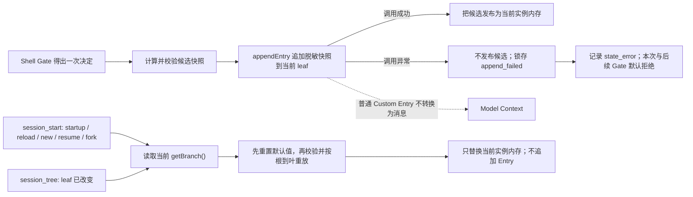

不同生命周期只改变“什么时候需要重建”，不改变同一套重放算法：

| 现场 | Extension 实例 | 应做什么 |
|---|---|---|
| 初次启动或 CLI 直接打开旧 Session | 新实例；首次事件仍是 `session_start reason=startup` | 在 `session_start` 用当前 `getBranch()` 重建 |
| `/reload` | 旧实例 shutdown，工厂重新执行；SessionManager 和当前 leaf 延续 | 新实例在 `session_start reason=reload` 重建 |
| `/new` | 旧实例失效，新 Session 使用新实例和空 Branch | 在 `session_start reason=new` 恢复为默认状态，不能继承旧 Session 内存 |
| 进程内 Resume 或 Session 切换 | 旧实例失效，目标 Session 使用新实例 | 在 `session_start reason=resume` 重建 |
| Fork | 新 Session 只复制到 Fork 点的祖先路径，并创建新实例 | 在 `session_start reason=fork` 重建，不能继承源路线 Fork 点之后的状态 |
| `/tree` | 工厂不重跑，但当前 leaf 改变 | 在 `session_tree` 先清空旧内存，再按新 Branch 重建 |
| `--no-session` | 使用进程内 SessionManager | 同进程内 Entry、Tree 和 Reload仍有效；退出后没有 JSONL，不能跨进程恢复 |
| `session_shutdown` | 实例即将失效或进程退出 | 只做幂等清理，不补写状态；每次真实 Gate 决策发生时就应立即保存 |

`appendEntry()` 的公开返回值是 `void`，不能依赖它提供 Entry ID。它会先把 Custom Entry 加入 SessionManager 的内存树并推进 leaf，但不保证调用返回时已经写入磁盘。Pi `0.84.1` 的新 Session 在尚无 Assistant 消息时可能延迟创建和刷新 JSONL；真实持久化实验必须先建立一条无敏感内容的 Assistant 消息，或明确区分“内存树已有 Entry”和“磁盘已有 Session 文件”。如果后续磁盘写入抛错，内存树也可能已经推进，所以 `appendEntry()` 不是数据库事务；首版只能做到调用异常时不发布候选状态并让 Gate 默认拒绝，不能宣称 Entry 已原子回滚，重试也可能形成重复节点。更深入的一致性与恢复策略留到 5.10。单纯 `/tree` 移动 leaf也不会单独保存 leaf 指针；若要验证重启后仍停在新路线，应在该路线追加一个受控状态节点后再退出。

### 当前候选实现

当前主工厂已经创建一个共享的 [`shell-state.ts`](../../.pi/extensions/pi-study-guard/shell-state.ts) Store，并按“生命周期观察 -> 状态恢复 -> 取消探针 -> Shell Gate”的顺序接线。状态生命周期只监听 `session_start/session_tree/session_shutdown`，不会改变已有 `tool_call` 的“先追踪、再取消、最后门禁”顺序。Model 与用户 Shell 入口都在得出最终脱敏决定后向同一个 Store 提交完整快照。状态尚未 ready 时会在分类和确认前直接形成 `state_error` 拒绝；首次 MARKER 已经完成确认后才可能遇到提交失败，此时仍不启动 Executor并改为 `state_error`，后续请求在再次恢复前也不再弹确认。

Store 先构造并严格校验候选，再同步调用 `appendEntry()`；只有调用正常返回才发布为当前 Extension 内存。失败会保留上一个已发布快照并锁存 `append_failed`，直到后续 `session_start/session_tree` 明确从当前 Branch 重新恢复。状态提交与追踪写入不是一个事务：首版先提交状态、再写最终追踪；若追踪随后失败，5.6 的外层合同仍会拒绝这次请求，但已经提交的快照不会回滚，它只表示一次 Gate 评估，不表示 Shell Executor 成功。

自动回归已覆盖严格字段、未知版本、畸形节点、全快照替换、计数溢出、append 失败锁存、生命周期零追加和双入口 fail-closed。另一路使用真实 `SessionManager.inMemory` 建立共同节点及 A/B Branch，在物理最后 Entry 仍属于 B 时把 leaf 切回 A，确认新 Store 只从 `getBranch()` 恢复 A；同一对照还确认普通 Custom Entry 不出现在 `buildSessionContext().messages` 中。它比纯 Fake 多证明了当前 Pi 内存 SessionManager 与 Context 转换行为，但仍没有证明磁盘 JSONL、跨进程恢复或真实 `/reload`、Tree、Fork、Resume 派发。

### `--no-session` 的只读观测口

`fixtures/state-probe/index.ts` 提供一个只在实验时显式加载的 `/pi-study-state-probe`。它不进入主工厂；每次调用都使用当次 Command Context，从当前 `getBranch()` 重新调用生产状态重放逻辑，只报告 `sessionFile` 是否存在、自有状态 Entry 数、`blockedCount` 和最后一次固定枚举决策。

Probe 不追加 Entry，不注册 Tool 或事件，不读取普通消息正文，也不输出 Session 路径、ID、cwd 或底层异常。它通过一次 TUI 通知展示有界摘要；Print/JSON 中 `notify` 是 no-op，因此无输出不能解释为状态为空。Probe 是对 Session Branch 的独立只读投影，不是直接读取 Extension 私有 Store。

若同一 `--no-session` 进程在 `/reload` 后继续累计，而退出后启动的新进程从默认状态重新开始，组合证据说明 Reload 复用了当前进程的内存 Session 树，而新进程没有 JSONL 可恢复。`sessionFile=none` 仍不证明系统全局没有磁盘写入、内存已安全擦除、崩溃恢复成立或存在操作系统沙箱。

### 5.7 的证据边界

- 纯函数和 Fake 只能证明解析、重放、事件注册与异常分支；真实 `SessionManager.inMemory` 可以再证明当前内存 Branch 与 Context 投影，但两者都不能证明 Pi 真正写入 JSONL或派发真实生命周期事件。
- 脱敏 JSONL 投影可以证明 Custom Entry 的字段和父子关系落盘，不能单独证明 Runtime 已按当前 Branch 正确重建。
- 状态值在 `/reload` 前后相同，还必须结合旧实例 shutdown、新工厂和新 `session_start`，才能排除“只是旧内存没清”的假象。
- Custom Entry 不进入 Model Context需要 Core 转换链或受控 Context 投影证明，不能靠询问 Model“你看见了吗”。
- `--no-session` 下同进程 Reload 能恢复，只证明内存 Session 树有效，不是跨进程持久化。
- Session Entry 不是全局配置、数据库事务、Git 历史、项目文件备份或操作系统沙箱，也不会回滚 Shell 已产生的副作用。

Tree、Fork、Resume 与 Session JSONL 的基础行为已经在 [`04-session-tree-compaction.md`](04-session-tree-compaction.md) 验证；5.7 只在这些基础上增加 Extension 自有状态的 Branch 归属和重建合同。

## Widget 是通用的 Extension UI 能力

Widget 不是 Shell Gate 专属对象，而是 Pi 提供给 Extension 的通用状态展示区域。任何 Extension 都可以用它展示自己能合法读取的长期状态，例如文件检查进度、下载进度、连接状态或任务摘要。Shell Gate 只是本课程当前选用的一个例子。

大白话场景是：State Store 像账本，Shell Gate 像保安，Widget 像一直挂在输入框附近的电子状态牌：

```text
Shell Gate | enforce | blocked 5 | last deny
```

因此三者职责不同：

| 对象 | 作用 | 不负责什么 |
|---|---|---|
| State Store | 保存、恢复并发布脱敏状态 | 不负责界面绘制 |
| Shell Gate | 判断本次 Shell 请求放行或拒绝 | 不负责长期展示 |
| Widget | 展示已成功发布的状态 | 不分类、不审批、不执行命令 |

Widget 使用稳定的 `key`。第一次设置该 key 是创建状态牌，后续再次设置相同 key 是原位替换，不会每次决策都新增一块牌；传入 `undefined` 表示清除。Widget 的内容可以是有限字符串行，也可以是后续阶段再学习的 Component。默认位置在输入框上方，也可以明确放到下方。

本课程的 Shell Gate 状态牌只展示 `mode`、`blockedCount` 和最近一次固定枚举决策，不展示原始命令、Prompt、`cwd`、Session 路径、调用 ID、异常堆栈或凭据。颜色使用 Theme 的语义色：正常状态用普通强调色，允许用成功色，拒绝或不可用用警告/错误色；颜色只是视觉表达，不是安全判断。

显示时序必须是：

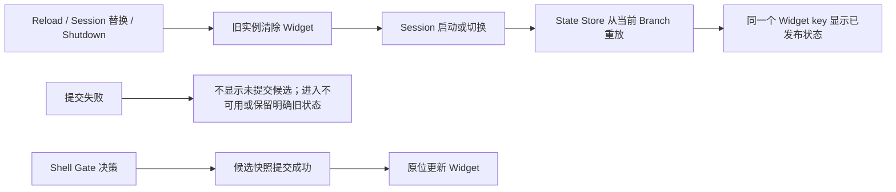

`session_start` 或 `session_tree` 应先恢复目标 Branch，再显示状态；Shell Gate 应先成功提交快照，再更新 Widget；`session_shutdown` 应幂等清除。Widget 渲染失败不能改变已经作出的门禁决定，也不能把拒绝变成放行。Widget 消失不等于门禁失效，Widget 显示某个计数也不能单独证明 Shell 没有启动或快照已经落盘。

首版只把它作为本地 TUI 状态牌：要求 `ctx.mode === "tui" && ctx.hasUI`。Print/JSON 没有可用的本地 Widget 区域，因此跳过 UI；本阶段不把 RPC 的客户端呈现扩展成已验证能力。Widget 是界面辅助，不进入 Model Context，也不产生 Tool Result、Shell 执行或持久化 Entry。

## 加载、初始化、注册与运行时派发

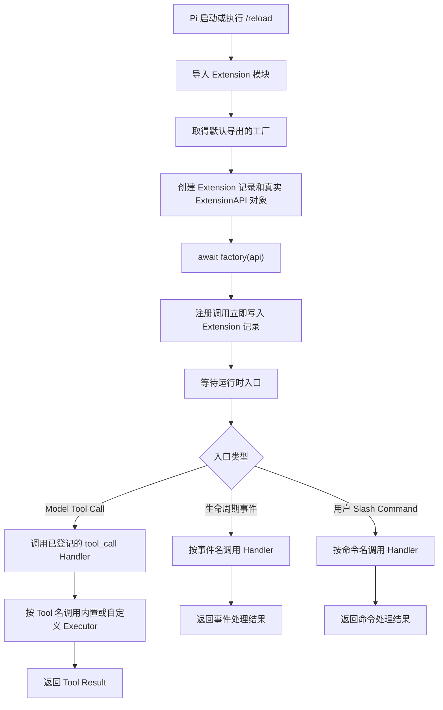

一次加载中，每个经规范路径去重、成功导入且默认导出有效工厂的 Extension 调用一次工厂；`/reload` 会建立新一轮。运行时入口可能从未出现，也可能多次出现。

### 完整例子：工厂执行不等于 Handler 触发

假设 Extension 在工厂中注册一个 `/guard` Command Handler：

| 阶段 | Pi 做什么 | 当前证据能证明什么 |
|---|---|---|
| 加载 | 导入 Extension 并执行工厂 | `reload.ts` 写入 `V1`，证明本次工厂执行过 |
| 注册 | 工厂把 `/guard` Handler 登记到 Extension 记录 | 证明能力已登记，不证明 Handler 已调用 |
| 触发 | 用户实际输入 `/guard` 后，Pi 才调用对应 Handler | 需要单独观察 Handler 的结果，才能证明本次调用发生 |

用 Spring 类比：执行 Extension 工厂类似应用启动时创建并注册 Controller，触发 Handler 类似真实请求到达后调用 Controller 方法。应用启动成功不等于接口已经被请求。工厂通常每轮加载执行一次；Handler 可能一次都不执行，也可能随匹配事件执行多次。

因此，真实 Pi 中出现 Flag 或工厂 marker，只能把证据推进到“工厂执行并注册能力”。它不能自动证明 Handler 或 Executor 已触发、功能正确或代码运行安全；这些结论需要各自对应的运行实验。

### 5.2 生命周期系统地图

下面把公共启动阶段和五类用户操作放在同一张图中。普通输入才进入 Agent/Turn 循环；Extension Command、User Bash 和模型切换各走独立入口。

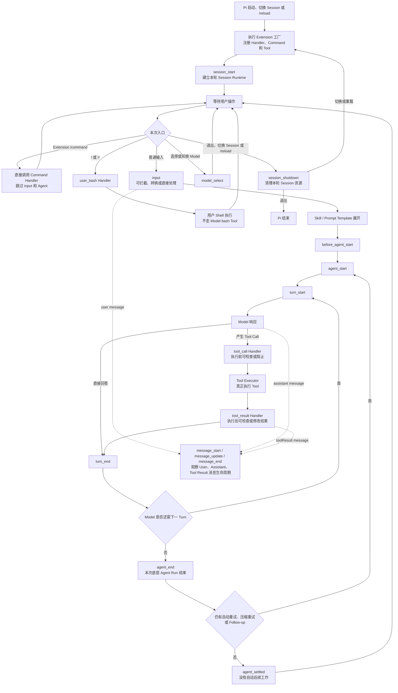

`message_start`、`message_update`、`message_end` 是穿插在 User、Assistant、Tool Result 消息生命周期中的观察事件，不是每次 Agent Run 只执行一遍的独立主线。并行 Tool、重试和 Session 切换可能让实际序列更复杂，图中只表达本轮学习需要掌握的主干。

### A-D 四组真实运行证据

下面四组实验分别只改变一种入口，避免把 Command、用户 Shell、模型切换和普通 Agent Loop 混在一起：

| 组别 | 用户操作 | 本次真实事件主链 | 直接结论 |
|---|---|---|---|
| A | 输入 `/pi-study-trace` | `factory -> session_start -> command -> session_shutdown` | Extension Command 由用户点名触发，不需要进入普通 Agent Loop |
| B | 输入 `!!printf ...` | `factory -> session_start -> user_bash -> session_shutdown` | 用户 Shell 是 Pi 的独立入口，不是 Model `bash` Tool |
| C | 按一次 `⌃P` | `factory -> session_start -> model_select(source=cycle) -> session_shutdown` | `⌃P` 切换 Model；`⇧Tab` 才切换当前 Model 的 Thinking Level |
| D | 发送普通 Prompt，并由 Model 调用一次内置 `read` | `input -> Agent -> Turn -> read Tool -> 下一 Turn -> agent_end -> agent_settled` | 普通输入进入 Agent Loop，Tool Result 会交回 Model 决定下一步 |

C 组启动时的 `--models` 模式没有命中，因此本次不能证明只在两个指定 Model 内轮换；界面和日志只能证明一次 `⌃P` 实际切换了 Model，并派发 `model_select source=cycle`。它也不能证明 Provider 能回答或完全没有网络活动。

D 组的完整脱敏事件日志如下：

```text
0001 factory
0002 session_start reason=startup
0003 input source=interactive
0004 before_agent_start
0005 agent_start
0006 turn_start
0007 message_start role=user
0008 message_end role=user
0009 message_start role=assistant
0010 message_end role=assistant
0011 tool_call tool=read
0012 tool_result tool=read
0013 message_start role=toolResult
0014 message_end role=toolResult
0015 turn_end
0016 turn_start
0017 message_start role=assistant
0018 message_end role=assistant
0019 turn_end
0020 agent_end
0021 agent_settled
0022 session_shutdown reason=quit
```

第一 Turn 中，Model 先产生 `read` Tool Call；Pi 在调用内置 `read` Executor 前后派发 `tool_call` 与 `tool_result` Handler，随后把 Tool Result 加入消息上下文。第二 Turn 中，Model 根据这个结果生成最终回答，因此“一个普通 Prompt”不等于“只有一个 Turn”。一次 Turn 也可能包含多个 Tool Call，不能把本次两个 Turn 当成全局固定数量。

这里的 Tool 由 Pi 放进可用工具集合并提供给 Model；Model 只负责选择 Tool 和给出参数。Tool Executor 才负责真正读取文件或执行操作。当前 `pi-study-guard` 没有自定义 Tool，D 组调用的是 Pi 内置 `read`，实验 Extension 只通过 `tool_call` 和 `tool_result` Handler 观察其前后时刻。

`agent_end` 表示当前这一次底层 Agent Run 已结束；如果 Pi 还要自动重试、压缩后重试或处理 Follow-up，之后仍可能开始新的 Run。`agent_settled` 表示这些自动后续工作也已结束，当前上层任务已经稳定空闲。两者都不等于 Session 已关闭；本次直到 `/quit` 后才出现 `session_shutdown reason=quit`。

追踪器只记录事件名、顺序和少量白名单元数据，没有记录 Tool Result 内容、错误状态或最终回答。因此 D 组日志能证明 `read` 请求经过 Handler、Executor 所在运行路径及结果回到消息循环，但不能单独证明文件读取成功、内容正确、最终回答正确或操作安全；这些结论需要界面结果、错误字段或独立断言。

从调用工厂到同步返回或异步 `Promise` 完成，统称初始化：

| 方式 | 工厂行为 | Pi 的处理 |
|---|---|---|
| 同步 | 准备内存状态、登记能力并立即返回 | 返回后继续启动 |
| 异步 | 返回代表整个初始化过程的 `Promise`，内部等待有限 I/O 后登记能力 | 等待 `Promise` 完成后继续启动 |

同步或异步只描述一次性准备如何完成，不描述 Handler 或 Executor 如何触发。工厂可能在不启动 Session 的命令中执行，因此这里只做有限准备；不要在工厂中启动进程、Socket、Watcher 或 Timer。长期资源应延后到 `session_start` 或真实使用入口，并由幂等的 `session_shutdown` 清理。

证据链必须逐层建立：

`发现文件 -> 导入模块 -> 执行工厂 -> 注册能力 -> 触发 Handler/Executor -> 行为正确且安全`

前一层通过不能证明后一层通过。Extension 是拥有 Pi 进程和当前系统用户权限的本地代码；它可以实现门禁，也可以绕过门禁直接产生副作用。

## 四类加载来源与实验探针

同一个 Extension 文件可以通过四类入口交给 Pi。来源由 Pi 找到文件的入口决定，不由代码内容或文件名决定。

| 来源类别 | 默认位置或配置 | 当前实验探针 | 持续性 | Project Trust |
|---|---|---|---|---|
| CLI 临时加载 | `-e/--extension <path>` | `<lab>/cli.ts` | 当前进程 | 不控制 |
| 全局自动发现 | `~/.pi/agent/extensions/*.ts` 或子目录 `index.ts` | `<lab>/agent/extensions/global-auto.ts` | 持续 | 不控制 |
| 项目自动发现 | `.pi/extensions/*.ts` 或子目录 `index.ts` | `<lab>/project/.pi/extensions/project-auto.ts` | 持续 | 控制 |
| Settings 附加路径 | 全局或项目 `settings.json` 的 `extensions` | `<lab>/project/project-settings.ts`，由项目 Settings 引用 | 持续 | 项目 Settings 受控制；全局 Settings 不受控制 |

项目 Settings 的探针配置为：

```json
{
  "extensions": ["../project-settings.ts"]
}
```

相对路径从 `<lab>/project/.pi/settings.json` 所在目录解析，所以最终指向 `<lab>/project/project-settings.ts`。文件不在自动发现目录中；删除 Settings 引用后，Pi 不会仅凭文件名找到它。

`--no-extensions` 关闭常规 Extension 发现，但显式 `-e` 仍可加载指定文件。Package 不是这四类本地文件入口，留到阶段 6。

## Project Trust、顺序、去重与重载

四类入口在最终集合中占五个排序槽位，因为 Settings 是一种入口，但分为项目 Settings 和全局 Settings 两个位置。

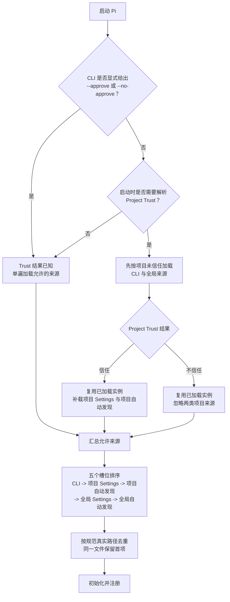

【源码证据】Pi `0.84.1` 在没有显式 Trust 覆盖且需要询问时，先加载 CLI 与全局 Extension；信任后复用这些实例并补载项目 Extension，不会再次执行已有工厂。Project Trust 只控制项目 Settings 和项目自动发现资源，既不控制 CLI/全局 Extension，也不降低操作系统权限。

加载顺序不是统一的覆盖规则：【源码证据】同一真实文件按规范路径去重；不同 Extension 的同名 Tool 由先加载者生效；同名 Command 会保留并增加编号后缀；事件 Handler 按加载与注册顺序运行，是否短路由事件类型决定。自动发现目录的字母顺序不是稳定契约，这些冲突行为仍需受控运行验证。

【文档说明】自动发现位置支持 `/reload`。【源码证据】`0.84.1` 还会重新解析 Settings 和 CLI 路径，但这不是跨版本承诺。实验必须把官方承诺、当前源码行为和本机运行结果分别记录。

## TypeScript 直接加载与独立类型检查

【文档说明】Pi 使用 `jiti` 直接加载 TypeScript Extension，不要求预先生成 `dist/index.js`。`jiti` 负责即时转换语法、解析 `import` 并执行模块，不执行完整 TypeScript 类型检查。官方入口见 [Extensions 文档](https://pi.dev/docs/latest/extensions)；该 `latest` 链接是动态参考。

同一份源码必须走两条互不替代的路线：

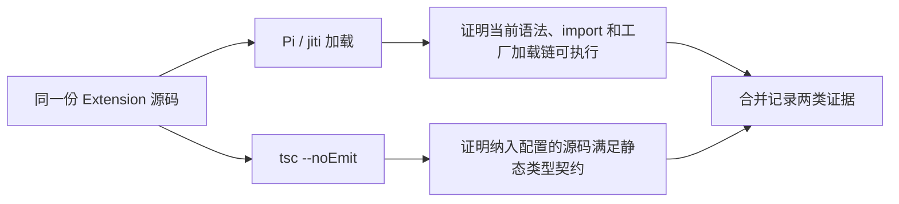

| 路线 | 能证明 | 不能证明 |
|---|---|---|
| Pi/`jiti` 加载 | 当前语法可转换、`import` 可解析、工厂可执行 | 静态类型正确、Handler/Executor 行为正确或安全 |
| `tsc --noEmit` | 纳入当前配置的类型声明和使用满足静态契约 | Pi 一定能加载、运行时行为正确、未纳入文件正确 |

`--noEmit` 只表示不生成输出文件；检查范围与严格程度仍由命令参数和 `tsconfig.json` 决定。`skipLibCheck` 跳过第三方 `.d.ts` 内部检查，但仍读取依赖公开类型并检查项目源码。启用后必须保留本项目受控类型错误的 Red/Green 对照，证明项目源码没有被一起跳过。

### 电话号码登记类比：类型正确不等于内容正确

假设登记联系人时，姓名和电话号码都必须是字符串。把电话号码写成数字属于格式错误，类型检查可以拦截；把错误号码写成字符串仍符合类型要求，类型检查无法判断内容是否正确。

映射到 Extension：Pi 的公开类型要求 `registerFlag()` 的 Flag 名称是字符串。临时传入数字并取得 `tsc` 失败，再恢复为字符串并通过，证明当前文件确实被纳入检查且 Pi 的公开类型契约正在生效。但另一个错误名称仍然是合法字符串，必须直接调用工厂并由 Fake API 记录实际登记内容，才能与预期名称和配置比较。

| 验证层 | 电话号码场景 | Extension 场景 | 不能证明 |
|---|---|---|---|
| `tsc --noEmit` | 姓名和电话的类型是否符合登记格式 | 工厂调用是否符合 Pi 的公开类型契约 | Flag 名称和配置是否符合业务预期；Pi 是否实际加载 |
| Fake API 测试 | 前台实际记录了谁和什么号码 | 直接调用工厂时实际登记了什么 Flag | Project Trust、自动发现或真实 Pi 加载链 |
| 真实 Pi 实验 | 真实登记系统是否收到请求 | Pi 是否通过指定入口发现、加载并执行工厂 | 未被本次场景覆盖的 Handler、功能与安全性 |

受控 Red -> Green 不是为了随意破坏代码：基线 Green 说明当前状态通过；预期 Red 证明检查器确实能拦截目标错误；恢复 Green 证明错误已移除。三层证据回答不同问题，不能互相替代。

## 5.1 的四条依赖判断

5.1 只要求能正确配置和排查，不展开 npm 内部解析或 Package 发布策略：

| 判断 | 例子与边界 |
|---|---|
| 运行时第三方库放 `dependencies` | `ms` 提供 Node 实际执行的代码；只放开发依赖可能在生产安装后缺失 |
| 开发工具和类型声明放 `devDependencies` | TypeScript、测试工具和 `@types/ms` 服务于开发检查；类型声明不能代替真实运行代码 |
| Pi 核心包由宿主提供 | Extension 运行时的真实 `ExtensionAPI` 对象由 Pi 传入；具体 `peerDependencies` 发布配置留到阶段 6 |
| 锁文件固定完整解析结果 | `package-lock.json` 记录直接与传递依赖的解析树；`node_modules` 才是当前机器供 Node 加载的代码 |

锁文件只有在安装流程实际使用且与 `package.json` 一致时才帮助复现，也不能证明依赖安全、类型正确或行为正确。`npm ci`、完整性字段、上游 shrinkwrap、多版本树和 Maven 依赖调解等审计细节不属于 5.1 的教学主线；本次实验的具体审计证据保留在计划台账，Package 发布语义留到阶段 6。

## 实验材料与证据边界

实验实现位于 [`.pi/extensions/pi-study-guard/`](../../.pi/extensions/pi-study-guard/README.md)。当前项目自动发现的主工厂登记只读 Tool `pi_study_inspect`、直接 Command `/study-inspect`、诊断 Flag、取消实验 Flag、生命周期诊断、默认关闭的取消门禁和常驻 Shell 双入口门禁；错误传播 Tool 仍留在 `fixtures/error-propagation/`，必须由 CLI 显式加载，不会随主工厂出现。Fake API 按各测试需要实现对应的 Tool 注册、Flag、事件和 Context 能力；来源与重载探针仍位于不会被项目自动递归发现的 `fixtures/loading/`。

| 标签 | 已保存的稳定证据 | 边界 |
|---|---|---|
| 源码证据 | `0.84.1` 的来源顺序、规范路径去重、Trust 两阶段复用、真实 API 对象创建、`await factory(api)`、注册写入记录和 `jiti` 加载 | 不证明本机已实际走过分支 |
| 运行证据（真实 Pi） | Trust 拒绝场景的帮助输出只出现 CLI 与全局探针 Flag | 只证明对应工厂登记完成；具体学习验收和后续实验状态见计划 |
| 运行证据（`tsc`） | 基线通过；两个本项目受控错误分别产生 `TS2322` 与 `TS2345`，恢复后再次通过 | 只证明当前配置仍检查项目源码和 Pi 公开类型 |
| 运行证据（Fake/Runner） | 直接调用工厂与 Handler/Executor，并用真实 `ExtensionRunner` 核对普通事件和 `tool_call` 的异常顺序 | 不证明真实 Pi 发现、Provider 调用、Core 错误 Tool Result或 TUI 呈现 |
| 用户理解验收 | 只由计划台账记录 | 文档、源码、真实运行、`tsc` 或 Fake 均不能自动替代 |

当前材料包含受控 Flag、课程诊断、纯内存错误探针、临时 marker，以及只读统计 `docs/learning/` 顶层 Markdown 的首个业务 Tool。主 Tool 不写文件、不执行 Shell、不跟随 Markdown 链接、不主动联网；这仍不是 OS 沙箱。所有动态状态、当前断点与下一步均链接计划，不在本文件重复维护。

## 后续学习方向

Agent Run、Turn 和停止条件见 [架构与 Model 上下文](01-architecture-and-context.md)。生命周期、自定义 Tool、直接 Command、Shell 双入口门禁和 Branch 状态恢复已经在本章建立；Widget 的通用职责与系统地图也已在上文说明。后续按计划继续完成 Widget 实现与动态验收，并补强自动验收、Reload、Session 切换和资源释放风险。

Pi 不内置 MCP 和 Subagent：MCP 通过 Extension 或 Package 接入；Subagent 通过 Extension、Package、独立 Pi 进程或 tmux 实现。它们会增加网络与凭据边界、模型费用、上下文复杂度和并发写入冲突，应在掌握 Tool、Session、Extension 和 Package 后按真实需求引入。
