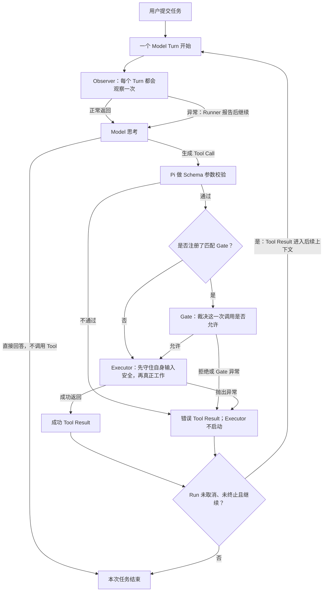
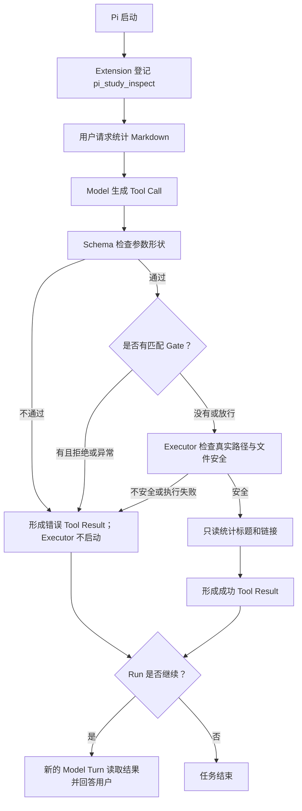
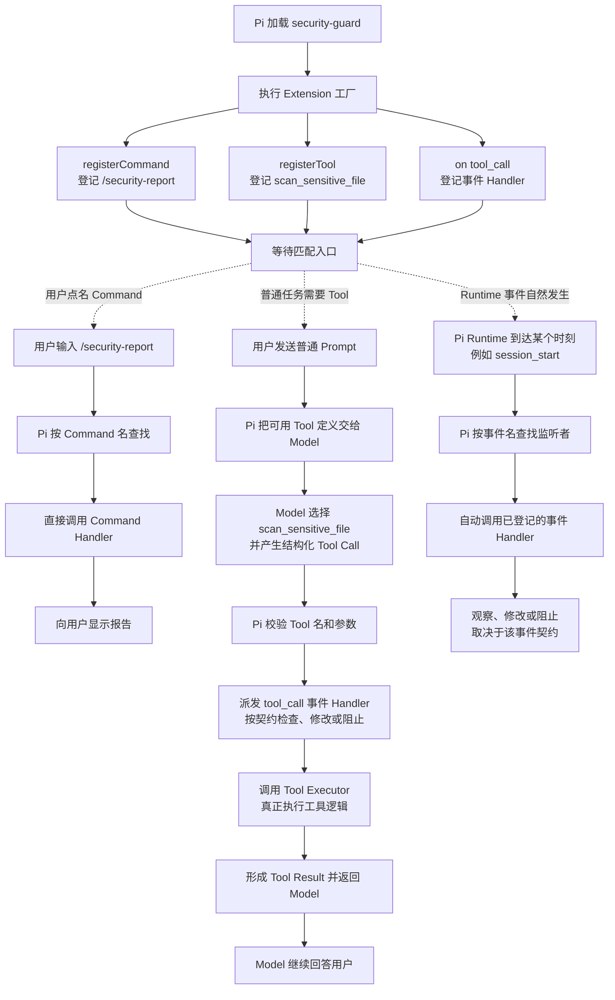
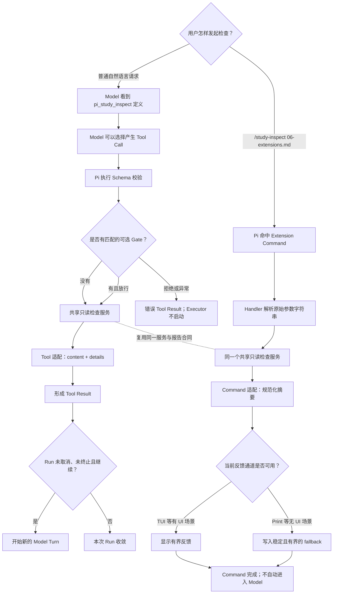

# Extension Context、Tool、Command 与 Event

本文默认描述 Pi `0.84.1` 的 Extension 运行时能力，覆盖 Context、取消、Observer/Gate/Executor、Tool、Command 和 Event。学习状态只见[完整学习计划](../../plans/pi-complete-learning-plan.md)；阶段 5 总览见[Pi Extensions](../06-extensions.md)。

文中的 `40 headings / 7 links` 与 `43` 个标题/`10` 个链接是拆分前 `06-extensions.md` 文件快照的历史运行证据，不是当前 hub 的固定输出合同；完整时间线、SHA 和验收只保存在唯一计划中。

## 完整场景：安全门禁为什么需要运行现场

假设用户让 Pi 在一个 Java 项目里“清理构建目录并重新运行测试”。Model 决定调用内置 `bash` Tool，准备先删除 `target/`，再启动测试。安全 Extension 的价值不是替 Model 执行命令，而是在 Executor 真正运行前，根据当前现场决定允许、询问还是拒绝，并让取消和失败都有明确结果。

完整过程如下：

1. Model 产生 Shell Tool Call；这只是执行请求，命令还没有运行。
2. Pi 先派发 `tool_call`，把本次调用和 `ExtensionContext` 交给安全 Handler。
3. Handler 用 `ctx.cwd` 判断命令会作用于哪个项目，用 `ctx.mode` 和 `ctx.hasUI` 判断能否当场询问用户，也可以读取 Trust、当前 Session 和 Model 状态辅助诊断。
4. 在 TUI 中，Handler 可以弹出确认；用户允许后才进入 Executor，拒绝则在执行前结束。
5. 在 Print 中没有交互界面，Extension 不能一直等待一个永远不会出现的点击。安全门禁必须采用预先定义的确定性 fallback，例如默认拒绝并输出原因。
6. Executor 启动后，如果用户取消，Pi 会发出取消信号。Handler 或 Executor 只有主动监听并停止自身工作，取消才会及时生效；已经删除的文件、已经发送的请求等副作用不会自动回滚。
7. 如果过程报错，错误出现在哪一层会决定后果：普通观察 Handler 失败通常只被记录，主流程继续；`tool_call` Handler 失败会在执行前形成错误 Tool Result，Executor 不运行；Executor 自己失败也会形成错误 Tool Result，Model 可以看到失败并决定后续动作。

### 取消能力由谁提供

用“运行 Maven 测试”举例时，需要把官方机制和具体功能分开：

1. Pi 官方提供 Extension 机制、活动任务的取消信号，以及支持接收 `signal` 的 `pi.exec` 子进程执行入口。
2. 用户编写的 Extension 注册具体 Tool，并决定何时启动 Maven、是否把取消信号传给 `pi.exec`、如何解释取消结果。
3. 用户取消活动任务后，Pi 只负责发出信号；自定义 Executor 把信号继续传下去，`pi.exec` 才能请求它启动的 Maven 子进程退出。

因此，“收到取消后停止 Maven”不是 Pi 自带的 Maven 功能，而是用户 Extension 利用 Pi 官方接口实现的具体能力。如果 Extension 忽略信号，或者 Maven 不是由它启动和控制的，收到信号并不会自动停止 Maven。终止直接子进程也不能扩大为所有后代进程一定退出，更不会回滚 Maven 已经写入的文件、数据库或其他外部副作用。

当前学习项目中的 `pi-study-guard` 是用户自定义 Extension。它注册 Flag、诊断 Command、生命周期 Handler、只读 `pi_study_inspect` Tool，以及一个默认关闭、只用于取消实验的 `tool_call` Handler；它没有注册 Maven Tool，也没有启动或停止 Maven。这里的 Maven 只是解释协作式取消用途的完整场景。

课程中的第一步取消实验也不直接运行 Maven。它先用一个本地延迟函数模拟长任务：A 组手动驱动受控 Timer 到期，观察 `start -> completed`；B 组在工作已经开始、Timer 与 Abort listener 已登记后触发测试信号，观察 `start -> cancelled`。测试还直接确认 Timer 和 listener 均被清理，并在取消结束后强制执行捕获的旧回调，验证不会迟到补记 `completed`；同步完成、同步取消和 `undefined` Timer handle 也有独立回归。

同一延迟函数随后被接入一个默认关闭的 `tool_call` Handler，供真实 Pi 取消实验复用。该取消探针只拦截实验指定的内置 `read` 请求，等待期间响应当前 Run 的 `ctx.signal`；无论取消、超时还是异常都阻止 Tool 执行。取消探针自身不注册自定义 Tool，也不会启动 Maven；主 Extension 另行注册的 `pi_study_inspect` 不属于这条取消链。

Fake 对照仍只证明“这一个本地延迟函数能协作处理测试传入的 `AbortSignal`”，不是“真实 Extension 已收到 Pi 的信号”。接入 Handler 的代码存在，也不等于真实 Pi 已经派发 Tool Call；必须由真实 Model 产生请求、用户看到等待标记后按 `Esc`，再结合 `start -> cancelled` 追踪与 Pi 的错误结果验收。即使这条真实链通过，也不证明 Tool Executor 的显式 signal、`pi.exec`、Maven 进程终止或副作用回滚。

真实 Pi `0.84.1` 实验已经补上这条动态证据：Model 产生指定的内置 `read` Tool Call 后，Extension 先记录 `cancel_probe state=start` 并显示等待提示；用户此时按 `Esc`，随后追踪记录 `state=cancelled`，界面形成 `Operation aborted` Tool Result并结束 Agent。本次没有 `state=completed` 或 Executor 后的 `tool_result` Handler 事件。结合 Core 在 `tool_call` Handler 返回后先检查同一 signal 的源码，可判定本次内置 `read` Executor 被跳过。这个结论只覆盖本次 TUI、当前 Handler 和当前 Pi 版本，不能外推到自定义 Tool Executor、子进程或副作用回滚。

### Observer、Gate、Executor 的完整职责

这三个名称描述的是课程里的三类职责，不是 Pi 官方的三种 `mode`：

- `observer`：本实验给普通 `turn_start` 生命周期 Handler 起的角色名。
- `gate`：本实验给 `tool_call` 执行前门禁起的角色名。
- `executor`：Tool 定义中真正完成工作的 `execute()`。

它们不能按“是否位于 Executor 前”分类。Observer 观察的是一次 Turn；Gate 裁决的是 Model 已生成的某一次 Tool Call；Executor 执行的是已获准的那一次 Tool Call。同一个 Turn 可能没有 Tool，也可能产生多个 Tool Call。

#### 位置、信息和控制权

| 对比项 | Observer | Gate | Executor |
|---|---|---|---|
| Pi 入口 | 普通生命周期 Handler；本实验是 `turn_start` | `tool_call` Handler | `registerTool()` 中的 `execute()` |
| 何时触发 | 每次 Model Turn 开始时 | 注册了匹配 Gate 时，在 Model 生成 Tool Call且 Schema 通过后 | Schema 通过后；若存在匹配 Gate，还须先获其放行 |
| 面向对象 | 一次 Turn 或其他生命周期事件 | 一次具体 Tool Call | 一次已经获准的 Tool 执行 |
| 此时知道什么 | 生命周期事件和 `ExtensionContext`；可能还没有 Tool | Tool 名、参数和当前 Context | 已校验参数、显式取消信号、更新回调和 Context |
| 核心职责 | 观察、记录或维护附加状态 | 判断“这次调用是否允许” | 真正读取、计算、调用或写入，并返回结果 |
| 对 Executor 的控制权 | 本实验没有；它不负责裁决具体调用 | 注册后才有；可以放行或阻止这一次调用 | 已经进入实际工作，不再是“是否开工”的裁决点 |
| 触发频率 | 每个 Turn 一次；一次 Agent Run 可有多个 Turn | 无匹配 Gate 或无 Tool 时零次；有多个 Tool Call 时可多次 | 每个通过 Schema 与可选 Gate 的 Tool Call 一次 |
| 典型实际场景 | 追踪、指标、耗时、Session 状态维护、非关键通知 | 权限、路径边界、危险命令审批、租户策略、额度或安全策略 | 读文件、调用服务、访问数据库、运行测试或子进程 |
| Spring 类比 | 应用事件监听器或监控切面 | 授权拦截器、过滤器或方法调用前的策略检查 | 被调用的目标方法或业务 Service |
| 不该承担什么 | 不能承担必须生效的安全门禁 | 不应把真实业务工作塞进裁决逻辑，也不能成为 Tool 自身输入安全的唯一防线 | 不应把组织授权拖到开工后，但必须自己校验路径、允许根等输入语义 |

Spring 类比只帮助定位职责，不表示 Pi 和 Spring AOP 的机制相同。Observer 在本实验中恰好先发生，但它观察的是 Turn，不是围绕某个 Executor 方法的前置通知。

#### 正常返回与报错结果

| 角色 | 正常情况 | 自己报错时 Pi `0.84.1` 怎么处理 | 自己报错时，Executor 是否启动 | Model 是否收到这次错误 Tool Result |
|---|---|---|---|---|
| Observer | 记录完后，主流程继续 | Runner 报告该 Extension 错误，同一事件的后置 Handler 和主流程继续 | 尚未决定；Model 后面可能不用 Tool，也可能调用 Tool | 否；此时不是某次 Tool 执行的结果 |
| Gate | 未注册则没有这一层；已注册时放行或主动阻止本次调用 | 无法完成允许性判断时 fail-closed，Core 形成错误 Tool Result | 否 | 是 |
| Executor | 返回 `content/details`，Core 形成成功 Tool Result | Core 把抛出的异常转成 `isError=true` 的 Tool Result | 是，且已经进入过实际工作 | 是 |

“流程继续”不等于“假装 Observer 成功”，而是 Observer 的附加观察失败不接管主任务。“Gate 报错”也不表示 Executor 代码不正确，而是 Pi 无法确认这次调用是否允许，所以拒绝开工。Executor 报错时，实际工作已经开始；Pi 能传播失败，但不会自动回滚已经发生的副作用。

#### 同一个实际场景

假设用户说：“检查这个 Maven 项目是否把 Java 版本配置为 21。”

1. **Observer**：`turn_start` Handler 记录“新 Turn 开始”和计时信息。此时 Model 还可能直接回答，尚不一定存在 Tool Call。Observer 失败会被报告，但不会让 Pi 自动跳过独立注册的后续 Gate；Gate 自己仍须 fail-closed，不能依赖 Observer 成功来建立安全前提。
2. **Gate（可选）**：Model 决定调用 `inspect_maven`，并给出 `pom.xml`。项目若注册了匹配 Gate，它可以检查当前用户或策略是否允许这次只读检查。允许才开工；策略拒绝或 Gate 自己异常都不进入 Executor。没有注册 Gate 时，Schema 通过后可直接进入 Executor。
3. **Executor**：即使 Gate 已放行，Executor 仍要自行拒绝绝对路径、`..`、符号链接逃逸和非允许文件，再读取并解析 `pom.xml`。读取或解析失败会形成错误 Tool Result；如果它在报错前已经写数据库或发网络请求，Pi 不会自动撤销这些动作。

#### 总流程



本章沿用这条分工：只读 Tool 把实际统计放进 Executor；Shell 审批把单次调用决策放进 Gate；Session 状态恢复使用 Observer 一类生命周期 Handler。错误传播和副作用恢复始终是两件事：Git 只可能恢复受版本控制的文件状态，数据库和外部请求需要事务、幂等、补偿或备份。

本次真实 `observer` 实验在同一个界面里展示了三个不同层次：红色的 `PI_STUDY_ERROR_OBSERVER_5301` 是普通观察 Handler 的异常；绿色 Tool 区域里的 `PI_STUDY_ERROR_PROBE_OK` 是课程 Executor 返回的固定成功标记；最后“工具已调用一次并返回……”是 Model 读到该 Tool Result 后生成的自然语言总结。固定标记只证明这个纯内存实验 Executor 已经运行并成功返回，不代表它检查了真实文件或完成了业务任务；Model 的总结也不是第二次 Tool 执行。

退出前后的最终脱敏日志都严格保持同一条十步链：`armed -> observer_error -> observer_after -> call_accepted -> gate_after -> executor_start -> executor_success -> tool_result_success(false) -> tool_execution_end_success(false) -> tool_result_message_success(false)`，且没有重复调用、意外参数或 Turn 超限 marker。这使本次 observer 结论闭合为：普通观察 Handler 的异常被报告后，后置 Handler、Executor、成功 Tool Result 和 Model 收尾仍依次发生。该实验日志没有设计 `session_shutdown` marker，因此最终日志不新增关闭事件是预期行为，不能据此讨论 Pi 的 Session 关闭派发。

真实 `gate` 组只把异常位置从普通观察 Handler 改到匹配 Tool 的执行前门禁，其余 Tool、参数、Prompt、Model 和 TUI 保持不变。界面显示红色 `PI_STUDY_ERROR_GATE_5301`，退出前后的最终脱敏日志都严格保持五步链：`armed -> call_accepted -> gate_error -> tool_execution_end_error(true) -> tool_result_message_error(true)`。日志中没有后置门禁、任何 `executor_*`、Extension `tool_result_*`、success、重复调用或 Turn 超限 marker。这使本次 gate 结论闭合为：门禁无法完成安全判断时，Pi fail-closed，跳过 Executor，同时由 Core 形成 Model 可见的错误 Tool Result。

这里最容易误读的是两个“完成”：`tool_execution_end_error` 只表示 Core 已收尾本次 Tool 尝试，不表示 Executor 运行过；Model 最后的“工具已调用完成”也只是它读到错误 Tool Result 后生成的自然语言总结，不表示 Tool 成功。判断 Executor 是否进入，应看 Executor 函数内部的 `executor_start`；本组没有该 marker。该实验日志同样没有设计 `session_shutdown`，退出后五条不变是预期行为。

真实 `executor` 组继续只改变故障位置：门禁正常放行，课程 Executor 进入后抛出固定异常。界面显示红色 `PI_STUDY_ERROR_EXECUTOR_5301`，没有绿色 `PI_STUDY_ERROR_PROBE_OK`；退出前后的最终脱敏日志都严格保持八步链：`armed -> call_accepted -> gate_after -> executor_start -> executor_error -> tool_result_error(true) -> tool_execution_end_error(true) -> tool_result_message_error(true)`。日志中没有 `observer_*`、`gate_error`、`executor_success`、success、重复调用或 Turn 超限 marker。

这八步把故障位置锁定在 Executor 内：`gate_after` 证明执行前门禁已经放行，`executor_start -> executor_error` 证明实际工作函数已经开工并报错，后三个错误 marker 证明 Extension 的 Tool Result 观察、Core 收尾和 Model 消息链都把它识别为失败。Model 最后的“工具已调用完成”仍只是对错误 Tool Result 的自然语言总结，不表示执行成功。该实验使用纯内存 Tool，没有制造业务副作用；它证明 Pi 能传播 Executor 异常，但不证明真实文件、子进程、数据库或网络副作用会自动回滚。

当前课程使用一个独立显式实验 Extension，把唯一变量限制为 `observer`、`gate` 或 `executor`。它注册的 Tool 只在内存返回固定文本，不读业务文件、不执行 Shell 或子进程，也不主动联网。Tool 调用预算保证每个进程最多进入一次目标调用；超出 Turn 上限时持续 abort，避免错误结果诱导 Model 反复调用。脱敏日志只记录固定模式、状态和 `isError` 布尔值，不保存 Prompt、参数、Tool Result 正文、调用 ID、路径、Model 或凭据。只有日志成功写出 `armed` 后探针才进入就绪状态；若动态注册 Tool 后这一步失败，Tool 可能仍可见，但后续每个 Turn、门禁和 Executor 都会持续 abort 或 fail-closed。

这里日志中的 `mode=observer|gate|executor` 来自课程自定义 Flag `--pi-study-error-mode`，只表示本次在哪一层故意制造异常：普通观察 Handler、`tool_call` 门禁或 Tool Executor。默认值 `off` 表示不启用错误实验。它不是 Pi 官方的 `ctx.mode`；在这三组真实 TUI 实验里，`ctx.mode` 始终是 `tui`。它也不同于 `--tui-mode regular`，后者只选择终端界面的布局方式。

证据仍需分层：Fake 直接调用 Handler/Executor只能证明课程代码自己的分支；真实 `ExtensionRunner` 测试能证明普通事件 catch-and-continue 与 `tool_call` fail-stop 的宿主顺序；源码能解释 Core 如何包装错误；只有真实 Model 产生 Tool Call、TUI 显示固定错误、日志又出现对应 ToolResult message，才能证明本次 Provider/Agent 链确实完成错误传播。`tool_execution_start` 在门禁前就可能出现，不能把它当成 Executor 已进入；只认 Executor 函数内部记录的 `executor_start`。

### 从错误实验走向第一个有用的 Tool

5.3 用一个纯内存实验 Tool 分别在 Observer、Gate 和 Executor 制造异常，目的是看清“不同位置失败后，Pi 会怎样继续或停止”。5.4 不再以制造错误为目标，而是开始实现第一个真正有用的用户自定义只读 Tool：`pi_study_inspect`。

假设用户对 Pi 说：“检查 `docs/learning/06-extensions.md`，统计标题和链接，最多列出 20 项，不要修改文件。”完整过程如下：

1. Pi 启动时加载用户编写的 Extension。Extension 向 Pi 登记一个名为 `pi_study_inspect` 的 Tool，但此时还没有读取文件。
2. Model 收到用户请求，同时看到这个 Tool 的名称、用途和参数说明。Model 判断自己需要文件中的真实信息，于是生成一次 Tool Call。
3. Pi 先使用 Schema 检查 Tool Call 的参数形状，例如必填字段是否存在、类型是否正确、是否包含未知字段。Schema 不读取磁盘。
4. 如果项目另外注册了匹配的 Gate，Gate 再裁决“这一次调用是否允许”；没有 Gate 时，Schema 通过后可以直接进入 Executor。
5. Executor 无论是否经过 Gate，都必须自己检查实际文件是否位于允许目录、是不是普通 Markdown、是否存在符号链接逃逸，以及当前取消信号是否已经触发。只有这些检查通过后才读取并统计。
6. Executor 返回有限且明确的 Tool Result：标题和链接的总数、最多 20 个样本，以及结果是否被截断。它不修改文件、不执行 Shell，也不自行联网。
7. 如果当前 Run 没有取消或终止，Tool Result 会进入后续 Model Turn；Model 再把机器结果整理成用户能读懂的自然语言回答。



这条主链只需要先记住：`Extension 注册 Tool -> Model 调用 -> Schema 检查参数 -> Executor 实际工作 -> Tool Result -> Model 回答`。Observer 是观察 Turn 的可选 Handler；Gate 是裁决单次 Tool Call 的可选 Handler；二者都不是 Schema 或 Executor 的别名。

#### 同一份结果为什么分成三层

`pi_study_inspect` 完成统计后，需要同时服务两个不同的消费者：后续 Model 要根据结果回答用户，当前 TUI 则要把调用过程和统计结果显示清楚。Pi 因此把“结果内容”和“界面表现”分开：

| 对象 | 主要消费者 | 在本场景中的内容 | 边界 |
|---|---|---|---|
| `content` | 后续 Model | “共有 18 个标题、7 个链接，以及有限样本” | 这是进入 Tool Result、供 Model理解的内容 |
| `details` | Extension 的渲染与状态代码 | 文件名、标题数、链接数、是否截断等结构化字段 | 不保证自动显示，也不是给 Model 的主要正文 |
| `renderCall` | 当前 TUI 用户 | “正在检查 `06-extensions.md`” | 只负责调用阶段如何显示，不读取文件或决定是否执行 |
| `renderResult` | 当前 TUI 用户 | “18 个标题 · 7 个链接 · 已展示前 20 项” | 只负责结果如何显示，不改变 `content` 或执行成败 |

例如，Executor 返回的 `content` 正确写着 18 个标题，但 `renderResult` 因界面代码错误显示为 99：后续 Model 仍会读到 18，当前用户在自定义 TUI Tool 区域则会看到 99。这是显示错误，不会反向修改 Tool Result 中交给 Model 的 `content`。反过来，界面显示正确也不能证明 Executor 的统计一定正确。

`renderCall` 和 `renderResult` 都是可选能力。Tool 没有提供自定义渲染时，Pi 会采用默认显示；因此“自定义渲染不存在或失败”和“Executor 没有执行”不是同一件事。

#### 工作停止与结果失败是两件事

Executor 收到取消通知后，即使已经主动停止读取、清理资源，也还要选择怎样结束本次调用。Pi `0.84.1` 判断 Tool Result 成功或失败，看的是 Executor 的结束通道，而不是返回文字的含义：

| Executor 怎样结束 | Pi 的结果状态 | 即使文字写着 |
|---|---|---|
| 正常返回 `content/details` | `isError=false` | “已取消”“失败了”仍是协议上的成功结果 |
| 抛出异常或以异常拒绝 | `isError=true` | Core 把异常转换成错误 Tool Result |

这就像快递员正常提交一张“已完成”的签收单，却在备注里写“包裹没有送达”：人读得懂备注，但系统仍按正常签收通道记账。要让系统把它登记为配送失败，必须走失败通道，而不能只改备注文字。

因此，若 `pi_study_inspect` 把用户取消定义为一次失败，它应先停止工作并清理资源，再抛出取消异常；仅正常返回“已取消”虽然可能表示实际工作已经停下，但 Pi 仍会把本次 Tool Result 标为 `isError=false`。如果某个业务明确把“未找到内容”或“用户选择跳过”定义为正常结果，则可以有意正常返回；关键是不能用文字冒充错误状态。

具体选择由 Extension 作者先定义 Tool 合同，Pi 不会根据返回文字自动猜测：

| `pi_study_inspect` 的结果 | 结束方式 | 原因 |
|---|---|---|
| 安全读取完成，统计到若干标题和链接 | 正常返回 | 得到了合同允许的有效结果 |
| 安全读取完成，标题或链接数量为 0 | 正常返回 | 空统计也是有效结果 |
| 内容超过展示上限，只返回前 20 项并明确标记截断 | 正常返回 | 截断是 Tool 事先声明的正常能力，不是假装完整 |
| 路径越界、符号链接逃逸或目标不符合允许类型 | 抛出异常 | 请求不能安全执行 |
| 文件不存在、读取失败或解析异常 | 抛出异常 | 无法完成合同中的检查任务 |
| 用户取消本次检查 | 停止与清理后抛出取消异常 | 本 Tool 把取消定义为未完成，并要求 `isError=true` |

底层文件读取若支持 `signal`，可能在取消时自己抛出取消异常。Executor 应在完成必要清理后让该异常继续向上传播；如果把它捕获并改成正常返回“已取消”，Pi 仍会得到 `isError=false`。

本文用同一个 Markdown 检查场景贯通完整 Tool 链，并在资源所有权、并发与模式章节综合加载、生命周期、Context、Observer、Gate、Executor、取消、错误和资源释放；阶段验收过程只保留在计划台账。

#### `pi_study_inspect` 的实现合同

已验证实现位于 [inspect-tool.ts](../../../.pi/extensions/pi-study-guard/inspect-tool.ts)、[inspect-path.ts](../../../.pi/extensions/pi-study-guard/inspect-path.ts) 和 [markdown-inspection.ts](../../../.pi/extensions/pi-study-guard/markdown-inspection.ts)。三个模块分别负责 Pi Tool 合同、真实文件安全和纯 Markdown 统计，避免把 Schema、文件系统与展示逻辑混成一个函数。

| 层次 | 当前合同 | 仍不能证明 |
|---|---|---|
| Schema | 只接受必填 `file`；它必须是长度不超过 128、以小写 `.md` 后缀结尾的顶层 ASCII 文件名；拒绝未知字段、路径分隔符和 `..` | 文件真实存在、位于允许根或不是链接 |
| 文件 Executor | 允许根固定为本次 `ctx.cwd/docs/learning/`；拒绝根或目标 symlink、硬链接、目录和特殊文件；只读分块读取，最大 128 KiB | Extension 受到 OS 只读沙箱保护 |
| 读取一致性 | 打开时禁止跟随 symlink；读取前后核对文件描述符对应的对象、大小和纳秒级修改时间 | 能抵抗同一用户恶意进程替换整个父目录的所有竞态 |
| Markdown 统计 | 通过 `Marked` Token 统计 ATX/Setext 标题与 inline/reference/autolink；图片、定义和代码中的伪语法不计入链接 | 所有 Markdown 方言都采用相同解释 |
| Tool Result | `content` 给 Model；`details` 保留同源结构化结果；标题和链接合计最多展示 20 个样本，单字段最多 160 个 Unicode code point | 截断样本等于完整原文或全量结果 |
| TUI renderer | `renderCall/renderResult` 只显示有限文本；流式未校验参数、错误正文和畸形 details 都重新清洗、校验并截断 | UI 显示正确就能反推 Executor 统计正确 |
| 取消与错误 | 第三个显式 `signal` 是本次调用的权威信号；开工、读取和解析边界主动检查；取消或安全/读取/解析失败均抛出 | 单次同步系统调用或同步 Parser 能被瞬间抢占，或既有副作用会回滚 |

这里特意同时保留 Schema 与 Executor 的重复约束：Schema 让错误参数尽量在开工前失败，Executor 则对真实文件对象负责。即使未来没有额外 Gate，Executor 也不能把路径安全托付给 Model 或 Schema。

#### 证据分层

| 证据 | 已直接证明 | 没有证明 |
|---|---|---|
| 纯函数与真实临时文件测试 | Markdown Token 语义、路径拒绝、文件类型、大小、读取变化、取消点和资源关闭 | 真实 Provider、Agent Loop 或 TUI |
| Pi `0.84.1` 的真实参数验证函数 | 当前严格 Schema 接受/拒绝的具体参数形状 | 完整 Core 已跳过 Executor并生成错误 Tool Result |
| Fake 工厂与 renderer 测试 | 主工厂只登记一次 Tool；当前组件文字有界且不保留终端控制序列 | 真实 Pi 发现、Model 选择或终端视觉呈现 |
| 无 Provider 的 Pi CLI 预检 | 当前 Pi 能加载显式 Extension 入口并解析 Tool allowlist | Provider 已看见或调用 Tool |

Schema 校验失败发生在 Executor 之前，Core 生成的 Model-facing 错误正文可能包含收到的参数；本 Tool 的 Executor无法缩短这段 Core 文本，但自定义 renderer 会限制当前 TUI 显示。其他受信 Extension 也可以在 `tool_result` 阶段改写结果，因此这里保证的是本 Tool 自己的输出和最终防御性显示，不是任意 Extension 组合后的全局不变量。

真实动态实验已补齐一条合法成功路径：Pi `0.84.1` 与 `openai/gpt-5.6-terra` 只获得 `pi_study_inspect`，Model 对 `06-extensions.md` 生成一次 Tool Call；compact TUI 显示 `40 headings | 7 links | truncated`，后续 Model Turn收到相同统计，`Ctrl+O` 展开后显示前 20 条有限样本且没有再次执行 Tool。实验前后目标文件 SHA-256 完全一致，为两次取样时该文件字节内容相同提供了极强的工程证据；它不是逐字节 `cmp` 的数学绝对证明。该证据不能排除文件在两次取样之间被修改后又恢复，也不证明统计值绝对正确、非法 Schema/路径/取消分支、其他文件、其他版本或模式，更不代表 Extension 没有写权限或受到操作系统只读隔离。

这个场景里，Context 就像 Pi 在派发任务时附上的“运行现场单”：

| 现场信息 | 大白话用途 | 不能误解为 |
|---|---|---|
| `ctx.cwd` | 这次操作会落在哪个项目目录 | 每次都临时读取的全局 `process.cwd()` |
| `ctx.mode` | 当前是 TUI、RPC、JSON 还是 Print | 是否有任意 UI 能力的同义词 |
| `ctx.hasUI` | 当前是否具备对话或通知协议 | 一定具备完整终端组件能力 |
| `ctx.isProjectTrusted()` | 项目级 Pi 资源是否已获信任 | Tool、Extension 或操作系统权限沙箱 |
| `ctx.sessionManager` | 只读查看当前 Session 的记录和树 | 修改 Session 的写入口 |
| `ctx.model` | 当前选中的 Model，可能暂时不存在 | 可用 Model 的完整目录 |
| `ctx.modelRegistry` | 查找 Model、Provider 和认证能力 | 当前已经选中的单个 Model |
| `ctx.signal` | 活动操作的协作式取消通知，可能不存在 | 强制终止或副作用回滚机制 |

`ctx.signal` 是每次读取时指向“当前 Agent Run”的动态现场值，不是某个 Command 或 Handler 私有的取消令牌。没有活动 Agent Run 时，例如空闲状态下执行 Extension Command，它通常是 `undefined`。Handler 即使看到 signal，也必须主动响应；Pi 不会强行抢占一个忽略信号、仍在等待的 Handler。

自定义 Tool Executor 的第三个参数另有一个显式 `signal`，它代表本次 Tool 调用，应作为该次执行的权威取消信号；第五个参数是 `ExtensionContext`。当前实现中二者在正常 Tool 执行期间通常来自同一个 Agent Run，但公开契约不保证对象恒等，而且 `ctx.signal` 会随活动 Run 改变，所以 Executor 不应以动态 `ctx.signal` 替代第三个显式参数。调用 `pi.exec` 时也必须主动把这个 signal 传入，子进程才会收到对应的终止请求。

### 模式分支

Pi `0.84.1` 的静态契约是：

| 模式 | `ctx.mode` | `ctx.hasUI` | 安全门禁的典型处理 |
|---|---|---:|---|
| 交互式终端 | `tui` | `true` | 可以询问用户，也可使用 TUI 专属组件 |
| RPC | `rpc` | `true` | 可通过协议向客户端请求交互，但不等于完整 TUI |
| JSON Event Stream | `json` | `false` | 不等待 UI，使用明确 fallback |
| Print | `print` | `false` | 不等待 UI，使用明确 fallback |

因此，`mode` 和 `hasUI` 不能互换：判断“能否发起普通 UI 交互”先看 `hasUI`，判断“能否使用终端专属组件”必须看 `mode === "tui"`。

### `notify` 不一定是弹窗

大白话说，`ctx.ui.notify` 的意思是“请当前宿主把这条消息告诉用户”，并不承诺所有模式都画出同一种弹窗。Pi `0.84.1` 在 TUI 中处理 `info` 通知时，会把它作为一段低对比度灰色状态文字追加到输入框上方的聊天记录区；长文本会换行。它不是右上角 Toast，也不会按固定时间自动消失。后续状态可能原位覆盖它，界面重建可能清除它，过快退出也可能发生在异步绘制完成之前。

这也解释了为什么证据必须分层：Handler 日志中的 `route=ui` 只能证明代码决定调用 UI；Fake 收到 `notify` 只能证明调用形状正确；只有通知仍应存在时对真实 TUI 的观察，才能证明该次终端确实完成了可见呈现。不同主题、终端、TUI 模式或 RPC 客户端仍需各自验证。

### 证据边界

上述 Context 字段、四种模式和错误传播是对本机 Pi `0.84.1` 类型、随包文档与编译后实现的静态核对。真实模式对照又补了两条互相独立的运行证据：Regular TUI 中，用户直接观察到输入框上方的灰色 Context 状态行；Print 中，进程正常退出、stdout 为空，Context fallback 只写入 stderr。两边追踪都没有 Agent、Turn 或 Tool 事件。真实取消实验另行证明了本次 `Esc -> ctx.signal -> tool_call Handler -> Operation aborted`；真实 observer、gate 与 executor 三组又分别证明了普通观察 Handler 异常后的继续执行、执行前门禁异常时的 fail-closed，以及 Executor 开工后异常被转换为错误 Tool Result。它们都不证明 RPC/JSON、其他终端与主题、任意 Tool 实现或副作用回滚。阶段 5.3 的最终理解验收状态只记录在学习计划中。

## Command、Tool 与事件 Handler

三者都是 Extension 向 Pi 登记的运行时入口，根本区别是发起者不同：

- Command：用户点名要求 Extension 执行一项操作。
- Tool：通常由 Model 判断需要使用，再由 Pi 调用 Executor。
- 事件 Handler：Pi Runtime 运行到特定时刻后自动派发。

### 一个从启动到结束的完整场景

假设 `security-guard` Extension 在工厂中登记三项能力：

| 登记内容 | 示例 | 作用 |
|---|---|---|
| Command | `/security-report` | 用户主动查看安全报告 |
| Tool | `scan_sensitive_file` | Model 在处理普通任务时检查文件 |
| 事件 Handler | `tool_call` | Pi 准备执行 Tool 前检查或阻止调用 |

Pi 加载 Extension 后，工厂只把这些入口登记到当前进程的对应表中，尚未执行 Command Handler 或 Tool Executor。随后三条触发链分别运行：



图中的 `tool_call` 同时说明了三者可以组合：Tool 由 Model 选择，但在 Executor 真正运行前，Pi 还可以先派发 `tool_call` 事件，让事件 Handler 执行门禁检查。

### 三者逐项对照

| 对比项 | Command | Tool | 事件 Handler |
|---|---|---|---|
| 主要发起者 | 用户 | Model | Pi Runtime |
| 登记 API | `registerCommand` | `registerTool` | `on` |
| 触发条件 | 用户输入匹配的 `/命令名` | Model 产生匹配的 Tool Call | 对应生命周期事件实际发生 |
| 运行函数 | Command Handler | Tool Executor | Event Handler |
| 输入 | 命令后的参数字符串和 Command Context | 通过 Schema 校验的结构化参数、显式取消信号和 Extension Context | Pi 产生的事件对象和 Extension Context |
| 主要结果去向 | UI、Session，或由 Handler 发起的后续动作 | Tool Result，通常进入后续 Model 上下文 | 回到 Pi Runtime；能否修改或阻止取决于事件契约 |
| 是否先由 Model 决定 | 否 | 是 | 否 |
| `--no-tools` 的直接影响 | 不禁用 Command | 会改变活跃 Tool 集，Model 无法调用已禁用 Tool | 不会统一关闭事件系统；但对应事件没有发生时自然不会触发 |

#### Command：用户点名触发

用户输入 `/security-report` 后，Pi 先查 Command 表并直接调用对应 Handler，不需要 Model 先判断应该做什么。Command Handler 可以显示通知、读取 Session 状态或执行其他逻辑；如果 Handler 主动发送用户消息或调用其他运行时能力，才可能继续进入 Agent 或外部操作。因此“Command 不需要 Model”不等于“Command 永远不能间接启动 Model”。

#### Tool：Model 选择，Executor 执行

注册 Tool 只是把名称、说明和参数 Schema 放进可用工具集合。普通 Prompt 进入 Agent 后，Model 才可能选择它并产生 Tool Call；Pi 随后查找名称、校验参数、派发执行前事件并调用 Executor。Executor 返回 Tool Result 后，Model 通常继续生成下一步回答。

必须分清三个阶段：

`registerTool -> Model 产生 Tool Call -> Executor 真正执行`

注册成功不能证明 Model 一定选择它，Tool Call 出现也不能跳过参数校验、事件门禁和 Executor 执行结果。

#### 事件 Handler：Runtime 到点自动通知

Extension 用 `on` 表示“当这个事件发生时通知我”。用户不需要输入 `/session_start`，Model 也不需要选择它；当 Pi 建立 Session 时，Runtime 自动派发 `session_start`，已登记的 Handler 才执行。

事件 Handler 可以承担三类职责：

| 职责 | 示例 | 边界 |
|---|---|---|
| 观察 | 在 `session_start` 记录启动标记 | 只证明观察逻辑运行，不改变主流程 |
| 拦截 | 在 `tool_call` 检查危险调用 | 只有该事件契约支持拒绝时才能阻止 |
| 修改 | 在 `input` 或 `tool_result` 返回替换结果 | 能修改哪些字段由对应事件契约决定 |

Pi `0.84.1` 的 `ExtensionAPI` 暴露 33 个 `on` 事件名，覆盖 Trust、资源、Session、上下文、Provider、Agent、Turn、Message、Tool、Model、Thinking、用户 Shell 和输入。这个数字表示当前版本的事件入口数量，不表示 Extension 只有 33 项能力，也不应作为跨版本不变的契约。

### 映射到 `pi-study-guard`

当前实验 Extension 的关系如下：

```text
pi-study-guard Extension
├── CLI Flag：--pi-study-guard、--pi-study-cancel-probe
├── Command：/study-inspect、/pi-study-trace（仅追踪开启时）
├── Tool：pi_study_inspect
└── 事件 Handler
    ├── session_start、session_shutdown
    ├── input、user_bash、model_select
    ├── Agent、Turn、Message、Tool 生命周期事件
    └── 默认关闭的 tool_call 取消实验门禁
```

5.2 的 A 组采证时，主 Extension 尚未注册自定义 Tool。该历史版本启动、由用户触发一次 `/pi-study-trace`，再用 `/quit` 正常退出后的完整真实日志是：

```text
0001 factory
0002 session_start reason=startup
0003 command name=pi-study-trace
0004 session_shutdown reason=quit
```

这证明本次工厂追踪逻辑先执行，随后 `session_start` Handler 被触发；用户输入 `/pi-study-trace` 后，Pi 又按 Command 名调用了对应 Handler；用户输入 `/quit` 正常退出时，Pi 派发了 `session_shutdown`，对应 Handler 收到的 `reason` 是 `quit`。日志中没有 `input`、Agent 或 Turn 事件，与本次 Extension Command 没有进入普通 Prompt/Agent 链一致。该历史版本没有自定义 Tool，本次也没有普通 Prompt 或 Model，因此没有 Tool Call 或 Executor 证据；后来新增 Tool 不改变这组历史日志的证明范围。

最简记忆：

> Command 是用户说“现在做这个”；Tool 是 Model 说“我需要用这个”；事件 Handler 是 Pi Runtime 说“这个时刻发生了，请处理”。

### 同一检查能力的两个入口

5.5 继续沿用“检查 `06-extensions.md`”这个场景，但增加一个用户可以直接点名的 `/study-inspect` Extension Command。它与 `pi_study_inspect` Tool 使用同一个只读检查服务，区别只在入口和结果适配层：Command 不伪造 Tool Call，Tool 也不调用 Command Handler。

| 对比项 | `pi_study_inspect` Tool | `/study-inspect` Extension Command |
|---|---|---|
| 谁发起 | Model 根据普通 Prompt 决定是否调用 | 用户输入命令后由 Pi 直接命中 |
| 参数入口 | 结构化参数，先经过 Tool Schema | 命令名后面的原始参数字符串，由 Handler 自己解析 |
| `tool_call` Gate | 若有匹配 Gate，则放行后才执行；没有 Gate 时 Schema 后直接执行 | 不经过 Tool Call，因此不经过 `tool_call` Gate |
| 共享工作 | 调用只读检查服务，得到同一种检查报告 | 调用同一个只读检查服务，得到同一种检查报告 |
| 结果去向 | `content/details` 形成 Tool Result；Run 继续时由后续 Model Turn读取 | Handler 直接把规范化摘要送往当前 UI 或无 UI fallback |
| 是否自动再问 Model | 通常会，但仍取决于 Run 是否继续 | 不会；Handler 完成后本次命令就结束 |
| `--tools` | 会影响 Tool 是否对 Model 可用 | 不会关闭 Command |
| `Ctrl+O` | 只重绘已有 Tool Result 的 renderer | 不适用，不会把 Command 结果变成 Tool Result |



界面上都以 `/` 开头的输入，也不一定是同一种对象：

| 表面形式 | 对象 | 主要作用 |
|---|---|---|
| `/quit` | Pi TUI 内置 Command | 由交互模式先处理，不是项目 Extension |
| `/study-inspect 06-extensions.md` | Extension Command | 命中后直接调用用户编写的 Handler |
| `/review ...` | Prompt Template | 展开成普通 Prompt，再交给 Model |
| `/skill:name ...` | Skill 调用语法 | 加载 Skill 指令后进入普通 Agent 任务 |

Pi `0.84.1` 在 `AgentSession.prompt()` 中先匹配 Extension Command；命中后会等待 Handler 完成并直接返回，不再派发普通 `input`、展开 Prompt Template 或进入 Model。TUI 的 `/quit` 等内置 Command 甚至在进入 `AgentSession.prompt()` 前就已分流。因此，“Extension Command 优先”只适用于已经进入 AgentSession 的文本，不能覆盖所有内置 Slash Command。

`getArgumentCompletions` 只是 TUI 编辑器的输入建议，不是提交校验器。它拿到参数前缀，但没有 Command Context 或取消信号；即使用户从补全列表选中了文件名，Handler 仍必须重新解析并校验最终参数。Command Handler 的公开结果是 `void`，不会自动生成 Tool Result；Handler 意外抛错会形成 Extension error，但该 Slash Command 仍被视为已经处理，不能用“命令已命中”代替业务成功证据。

空闲时调用 Command，`ctx.signal` 通常是 `undefined`，因为它表示当前 Agent Run 的动态取消信号，不是这次 Command 独享的取消令牌。TUI 中可使用 UI 反馈；Print/JSON 的 UI 是 no-op，必须另设不会等待交互的有界 fallback。RPC 虽然 `hasUI=true`，也只表示客户端协议可承载部分交互，不等于拥有完整 TUI。真实 Print 启动仍可能要求已选 Model 元数据，但命中的 Extension Command 本身不需要请求 Provider 或让 Model 作决定。

#### `/study-inspect` 首版合同速查

首版 Command 固定为 `/study-inspect <file>`，只接受 `docs/learning/` 顶层一个 Markdown 文件名。外围空白可以去掉；缺少文件名、多传第二个参数或选项、传入路径表达式、非 `.md` 文件名，都必须在调用共享检查服务前拒绝。`getArgumentCompletions` 只按用户已经输入的前缀过滤固定安全示例 `06-extensions.md`；它没有 `ctx.cwd`，也不扫描当前目录。补全只是一条输入建议，Handler 必须重新校验最终提交的原始参数。

Handler 开始时取得 `{ cwd: ctx.cwd, signal: ctx.signal }`，再把它们连同已校验文件名交给共享检查服务。`ctx.cwd` 只说明当前 Session 从哪里定位 `docs/learning/`，不是权限证明或安全沙箱；`ctx.signal` 是可选的当前 Agent Run 信号，不是 Command 专属取消令牌。Tool 与 Command 复用的服务不接触 `ExtensionAPI`、Context、UI 或 Tool Result 等宿主合同，二者不互相调用；该职责隔离不等于服务完全不依赖 Pi 包，因为当前 Markdown 解析与文本清洗仍复用 `pi-tui` 的通用能力。

| 运行模式 | `/study-inspect` 的反馈出口 |
|---|---|
| TUI | 通过 `ctx.ui.notify` 显示一次有界摘要 |
| Print | UI 是 no-op，把同一摘要写入 `stderr`，不等待交互 |
| JSON | 同样写入 `stderr`，保持 `stdout` 只承载给外部程序解析的 JSON 事件流 |
| RPC | 只能依赖客户端实际支持的部分 UI 协议；不能把 `hasUI=true` 当成完整 TUI 保证 |

命中本 Command 后，Handler 返回 `void`，不形成 Tool Result，也不自动启动 Model 或 Provider。限定在当前首版 Handler 不主动发送消息或调用 Model 的设计中，一次 `/study-inspect` 是 **0 次 Model 请求、0 次 Tool Call、0 个 Tool Result**；摘要必须由 Handler 在返回前送到上表中的反馈出口。

Esc 也不能被当成 Command 的自动取消键。Pi `0.84.1` 的 TUI 只在存在正在 streaming 的 Agent Run 时用 Esc 去 abort 那个 Run；空闲执行 `/study-inspect` 时通常没有活动 Run，`ctx.signal` 也通常是 `undefined`，所以 Esc 不会强制终止正在等待的 Command Handler。即使某个 Command 恰好取得了活动 Run 的 signal，也只有 Handler 和底层操作主动检查或传递该 signal，工作才会协作停止。长时间 Command 若需要可靠取消，必须另行设计自己的取消机制，不能把 Agent Run 的 Esc 行为直接借来使用。

#### 当前实现与自动证据

当前代码已经按三层职责接线：[`inspect-service.ts`](../../../.pi/extensions/pi-study-guard/inspect-service.ts) 只接收 `cwd/file/signal` 并返回统一报告；[`inspect-tool.ts`](../../../.pi/extensions/pi-study-guard/inspect-tool.ts) 把报告适配为 Tool 的 `content/details` 和 renderer；[`inspect-command.ts`](../../../.pi/extensions/pi-study-guard/inspect-command.ts) 解析原始参数并把同一规范摘要送往通知或 `stderr`。主工厂同时注册一个 `pi_study_inspect` Tool 和一个常驻 `/study-inspect` Command，追踪环境开启时才额外注册 `/pi-study-trace`。

实现保留了可复查的 Red -> Green 链，精确过程和动态测试计数只记录在唯一学习计划中。自动测试覆盖真实临时 Markdown 下 Tool/Command 摘要逐字一致、补全不触发检查服务、参数在服务前拒绝、TUI/RPC 通知、Print/JSON `stderr`、单次 `ctx.signal` 读取及错误脱敏。

真实 Pi `0.84.1` 的 TUI 与 Print 验收已经补齐上述动态边界。TUI 中，固定补全候选进入真实编辑器，提交标准 ASCII 空格形式的 `/study-inspect 06-extensions.md` 后只出现一次有界 `notify` 摘要；Command 前后的生命周期追踪没有新增 Agent、Model、Tool Call 或 Tool Result 事件。Print 中，同一 Command 的 `stdout` 为 0 字节，`stderr` 恰有一份相同摘要，生命周期也只有工厂、Session 启动和正常退出。结合 Pi 的 Command 优先派发顺序，这两组证据证明本次标准调用直接由 Handler 完成，是 0 次 Model 请求、0 次 Tool Call 和 0 个 Tool Result。

该结论不扩展到 JSON framing、RPC 客户端、Tab 分隔的 Slash 文本、未知 Command、启动期任意网络或其他 Extension；TUI/Print 结果也不能反推 JSON/RPC 的动态表现。Print 本次退出码为 0，同样不能被解释成所有 Command 业务错误都会可靠地产生非零退出码。
