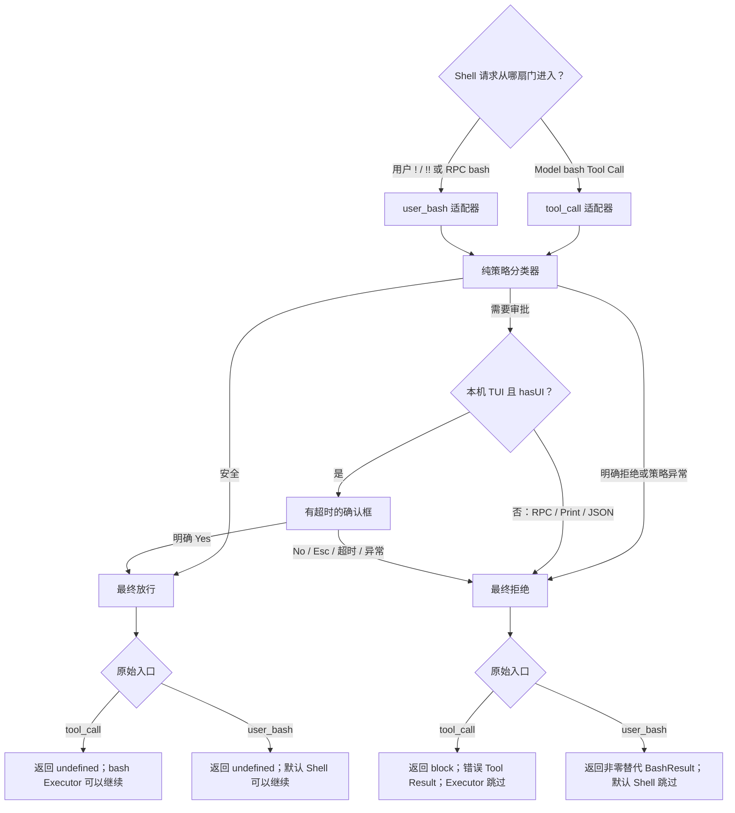
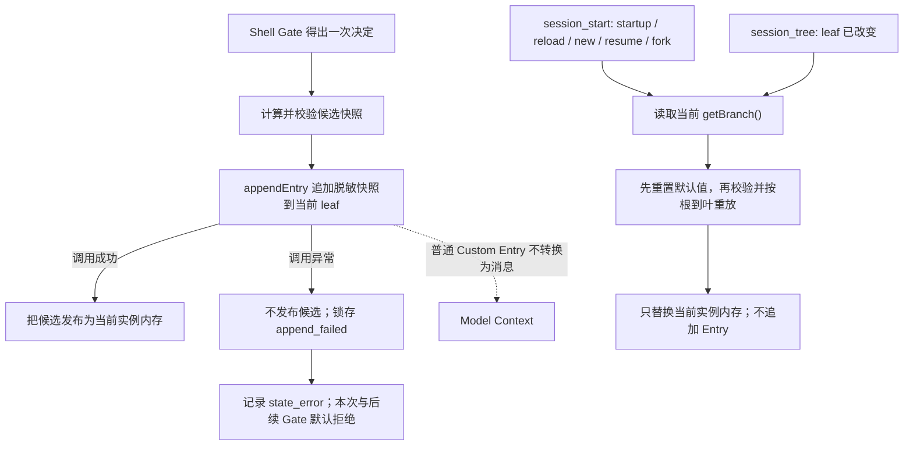
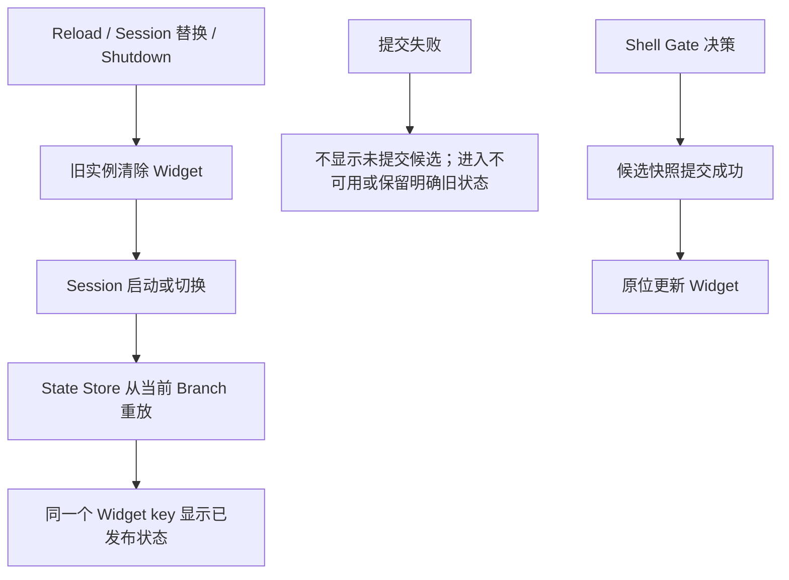

# Extension Shell Gate、Branch State 与 Widget

本文默认描述 Pi `0.84.1` 的双入口 Shell Gate、Session Branch 状态和 Widget；明确标注的 5.10 Runtime 动态矩阵使用 Pi `0.84.2`。学习状态只见[完整学习计划](../../plans/pi-complete-learning-plan.md)；阶段 5 总览见[Pi Extensions](../06-extensions.md)。

## 危险 Shell 命令审批：同一套保安规则，两扇不同的门

先看一个完整的大白话场景。项目希望在 Shell 真正开工前加一道保安：普通只读命令可以直接通过；命中危险规则的命令必须询问用户；明确拒绝、用户选择 No、Esc、超时、没有可用 UI、策略代码异常，都不能执行。

同一条 Shell 命令可能从两扇门进来：

1. Model 生成 `bash` Tool Call，由 Pi 准备调用 bash Executor。
2. 用户在 TUI 输入 `!命令` 或 `!!命令`，直接要求 Pi 执行；RPC 客户端也有对应的 `bash` 请求。

两扇门可以共用同一个纯策略分类器，但不能共用同一种 Pi 返回值。可以把它理解成：两家分公司的保安执行同一份公司制度，但各自使用不同格式的放行单和拒绝单。

### 一份策略，两个适配器

| 职责 | 输入 | 输出 | 不负责什么 |
|---|---|---|---|
| 纯策略分类器 | 待检查的命令字符串 | `allow`、`approval_required` 或 `deny` | 不调用 Pi UI、不执行 Shell、不生成 Tool Result；固定规则编号由后面的决策层按分类结果派生 |
| 审批决策器 | 策略结论、`hasUI`、确认框结果 | 最终放行或拒绝 | 不改写命令、不启动 Executor |
| Model `tool_call` 适配器 | `bash` Tool Call、当前 Context | 映射成 `tool_call` 的放行或 `block` | 不把 Tool Call伪装成用户 Shell |
| 用户 `user_bash` 适配器 | `!`/`!!` 或 RPC bash 事件、当前 Context | 映射成继续执行或一份替代 `BashResult` | 不生成 Tool Result，也不自动调用 Model |

审批状态固定为默认拒绝：

| 策略和现场 | 最终决定 |
|---|---|
| `allow` | 直接放行，不打扰用户 |
| `deny` | 所有模式都拒绝 |
| `approval_required` 且 `ctx.mode="tui"`、`hasUI=true` | 显示有超时的确认框；只有明确 Yes 才放行 |
| No、Esc、超时、确认框异常 | 拒绝 |
| `approval_required` 且不是本机 TUI | 不等待不受本合同信任的交互，直接拒绝 |
| 策略分类器异常 | 适配器自行收敛为拒绝 |

TUI 与 RPC 的 `hasUI` 都是 `true`，但 RPC 是否真能完成确认仍取决于客户端响应；不设置超时，客户端不回应时就可能一直等待。5.6 首版只把本机 TUI 视为人工批准通道，RPC、Print、JSON 对 `approval_required` 一律拒绝；以后若要支持可信 RPC 客户端，必须另立带身份、响应和超时边界的合同。Print/JSON 的 `hasUI=false`；其中 Model 仍可能请求 bash Tool，所以 `tool_call` 门禁仍有意义，但 Print/JSON 并没有可供用户输入 `!`/`!!` 的直接 Shell 前台。

### 两扇门的精确合同

| 对比项 | Model 请求 `bash` Tool | 用户 `!`/`!!` 或 RPC bash |
|---|---|---|
| Extension 事件 | `tool_call` | `user_bash` |
| 命令位置 | `event.input.command` | `event.command` |
| 放行 | 返回 `undefined`，让后续 Handler 和 bash Executor 继续 | 返回 `undefined`，让后续 Handler 和默认 Shell 后端继续 |
| 拒绝 | 返回 `{ block: true, reason }` | 返回 `{ result: BashResult }`，其中使用固定脱敏文案和非零 `exitCode` |
| 拒绝后的真实执行 | bash Executor 不启动 | 默认 Shell 不启动 |
| 结果对象 | Pi 形成错误 Tool Result；Run 继续时 Model 可看到 | 形成替代 Bash 执行结果；没有 Tool Result，也不会自动请求 Model |
| Handler 自己抛错 | Core 将其收敛成错误 Tool Result，Executor 不启动 | Runner 记录 Extension error 后继续，原命令仍可能落到默认 Shell |

`user_bash` 的公开返回类型只有 `operations` 和 `result`，没有 `block`。如果绕过 TypeScript 给它返回 `{ block: true }`，这个对象虽然会抢先结束后续 Handler，但调用方找不到替代 `result` 或 `operations`，仍会执行原命令。更危险的是，`user_bash` Handler 直接抛异常也不是拒绝：Pi 会报告 Extension error，然后继续后续 Handler或默认 Shell。因此用户 Shell 适配器必须在内部捕获策略与 UI 异常，并返回完整的非零替代 `BashResult`，不能靠 `throw` 实现 fail-closed。

这份拒绝结果中的 `cancelled` 应为 `false`。它表示“开工前被策略拒绝”，不是“Shell 已经启动，后来被取消”。审批框里的 Esc 与运行中 Shell 的取消也是两件不同的事。

`!` 与 `!!` 都经过同一个 `user_bash` 门禁。它们只在后续上下文上不同：`!` 的 Bash 记录可进入之后的 Model Context；`!!` 的记录仍会显示并保存在 Session 中，但组装 Model Context 时被过滤。这个区别不改变审批规则，也不代表 `!!` 更安全。

### 首版受控规则与实验合同

首版不尝试解析通用 Shell 语法，只认识两条逐字匹配的课程命令。分类器收到的 `command` 必须与下表完全相同；大小写、空白、换行、分号、文件名或其他任何字符有变化，都归入 `deny`。

| 规则 | 固定命令 | 分类 | 用途 |
|---|---|---|---|
| `safe_printf` | `printf '%s\n' PI_STUDY_SHELL_SAFE` | `allow` | 证明已知安全命令可以不弹框直接通过 |
| `marker_write` | `printf '%s\n' PI_STUDY_SHELL_EXECUTED > PI_STUDY_SHELL_GATE_MARKER.txt` | `approval_required` | 只在私有临时目录创建固定 marker，用来区分是否真正执行 |
| `unknown` | 其余所有字符串 | `deny` | 证明未知输入默认拒绝 |

审批超时固定为 `10000` 毫秒。只有本机 TUI 的确认框明确返回 `true`，并且批准后再次检查到当前 signal 尚未取消，`marker_write` 才能放行。No、Esc、超时、确认期间取消、无 UI、RPC、策略异常和 UI 异常都拒绝。

公开确认合同只能让 Extension 可靠区分“明确确认”为 `true`，以及“没有确认”为 `false`。No、Esc、超时或对话取消最终都落入同一个未确认分支，因此门禁只能记录稳定原因 `not_confirmed`，不能仅凭 `confirm()` 返回值伪造 `declined`、`cancelled`、`timeout` 三种原因。若开工前或批准后直接观察到 signal 已取消，可以另记 `signal_aborted`；这是 signal 证据，不是确认框告诉门禁的原因。

两个入口对同一最终决定使用不同的宿主合同：

| 最终决定 | Model `tool_call` | 用户 `user_bash` |
|---|---|---|
| 放行 | 返回 `undefined` | 返回 `undefined` |
| 拒绝 | 返回固定脱敏 `block`；首版不设置 `terminate` | 返回固定脱敏替代结果，`exitCode=126`、`cancelled=false`、`truncated=false` |

首版不设置 `terminate`，因为这里拒绝的是一次 Tool Call，不是退出 Pi 或结束整个 Agent Run。Core 仍可把错误 Tool Result 交给 Model解释；如果 Model 再次请求，同一门禁会重新分类和拒绝。这个选择保证每次执行都受检，但不保证 Model 不会重试，也不把单次 `block` 解释成整个任务终止。

自动测试先锁住不启动真实 Shell 的完整矩阵：精确 `SAFE`、精确 `MARKER`、各种近似字符串；TUI Yes 与统一的未确认分支；固定有限 `timeout` 确实传给确认框；确认期间取消；RPC/Print/JSON 默认拒绝；策略与 UI 抛错；两种返回对象的精确形状；以及一个真实 `ExtensionRunner` 对照，证明裸 `user_bash` Handler 抛错后默认 Shell 仍可能继续，而生产适配器捕获同一异常后必须返回替代结果、令默认 Executor 调用数为零。Fake 中的 No、Esc 和超时都只是同一个 `confirm=false` 程序分支，不能冒充真实按键或真实计时证据。

自动 Green 后再做少量真实 Pi 对照。实验必须使用受信的 `0700` 私有临时项目，将项目设置中的 `shellPath` 固定为 `/bin/bash`、`shellCommandPrefix` 固定为空字符串，并通过 `--approve` 让这份项目设置实际生效；同时使用 `--no-extensions`，只显式加载当前课程 Guard，确认没有后置 `tool_call` 参数修改器、自定义 bash Tool 或 `user_bash operations`。这些前提把“门禁看见的命令”和“最终交给 Shell 的命令”锁到本次受控实验内，不能外推成任意 Extension 组合下的保证。

真人验收只保留一个 TUI 进程中的五次操作，再加一个新的 Print 进程；批准写 marker 的步骤放在 TUI 最后，开工前及每个拒绝步骤后都确认 marker 不存在：

| 真实组 | 入口和操作 | 预期观察 |
|---|---|---|
| A | Model 只请求一次固定安全 bash | 无确认框；绿色 Tool 输出包含固定安全文本；追踪为 `tool_call/allow` |
| B | Model 只请求一次固定 marker bash，用户选择 No | TUI 出现错误 Tool Result；marker 不存在；追踪为 `tool_call/deny/not_confirmed` |
| C | 用户输入固定安全 `!` 命令 | 无确认框；显示固定 Bash 输出；追踪为 `user_bash/allow`，本次没有 Tool Result |
| D | 用户输入固定 marker `!` 命令并按 Esc | 返回非零替代 Bash 结果；默认 Shell 不启动；marker 不存在；追踪为 `user_bash/deny/not_confirmed` |
| E | 用户输入固定 marker `!!` 命令并明确 Yes | marker 内容精确为固定文本；追踪为 `user_bash/allow/confirmed`；门禁决策不因 `!!` 改变 |
| F | 新 Print 进程中让 Model 只请求一次固定 marker bash | 无本机审批 UI，门禁直接拒绝；marker 不存在；追踪证明进入的是 `tool_call` 而非 `user_bash` |

真实追踪只记录固定枚举，例如入口、规则、决定、原因和 `excludeFromContext`，不记录原始命令、Prompt、Tool 参数、调用 ID或凭据；未知自定义 Tool 名和消息 Role 也统一写为 `custom`。`marker 不存在` 仍不是独立结论：只有同时看到入口已触发、门禁决定为拒绝、Executor 未进入以及文件仍不存在，才能证明本次被门禁挡住；Model 根本没发 Tool Call 或 Shell 自己失败都属于无效样本。Print 的 stdout 可能包含 Model 对错误 Tool Result 的最终说明，不能照搬 5.5 Command 实验的 `stdout=0` 判据；本轮应检查门禁追踪、错误 Tool Result和 marker，而不是要求 stdout 为空。

### 总流程



### 这道门禁能证明什么，不能证明什么

- 纯字符串规则只能覆盖明确冻结的语法，不能正确理解任意引号、别名、环境变量、命令替换、编码或混淆；无法识别的输入必须默认拒绝。
- `tool_call` 的参数在 Schema 校验后仍可能被后续 Handler 原地修改，Pi 不会再次校验。若门禁后还有参数修改器，就不能声称最终执行的命令仍是门禁检查过的那一条。
- 两类事件看到的都是尚未拼接 `shellCommandPrefix` 的命令；真正执行时 Pi 可能再添加受配置控制的前缀。因此门禁还必须把该前缀和配置来源视为独立的可信前提。
- `user_bash` 的第一个有效返回会接管后续处理；其他受信 Extension 仍可能改变加载顺序、提供自定义 `operations` 或直接执行进程。门禁只保护自己接入的入口。
- 它不控制 Extension 自己调用 `pi.exec`/子进程、SDK 直接执行 Bash、用户在普通系统终端输入命令，也不降低 Pi 进程的操作系统权限。
- 用户点击允许只代表这一次请求获准，不代表命令本身安全；执行后的副作用也不会因为后续报错或取消而自动回滚。

5.6 的真实实验使用私有 `0700` 临时目录中的固定 marker 文件：它没有业务或破坏性副作用，但创建 marker 本身仍是一项小而明确的文件副作用。验收把入口追踪、审批决策和 marker 是否存在组合起来；单独看到 marker 不存在，既可能是门禁拒绝，也可能是请求根本没有触发或 Shell 自己执行失败。

当前主工厂已经注册 [`shell-policy.ts`](../../../.pi/extensions/pi-study-guard/shell-policy.ts) 与 [`shell-gate.ts`](../../../.pi/extensions/pi-study-guard/shell-gate.ts)。自动测试验证了逐字分类、两个入口的返回合同、本机 TUI 审批矩阵、异常默认拒绝、真实 `ExtensionRunner` 的 `user_bash` fail-open 对照、主工厂派发顺序和固定枚举追踪。

真实 Pi `0.84.1` TUI 对照补齐了宿主、按键与执行证据：Model SAFE 进入 `tool_call` 后无需确认并成功执行；Model MARKER 选择 No 后在 Executor 前形成错误 Tool Result，marker 不存在；用户 `!` SAFE 直接经过 `user_bash` 放行，不启动 Model或产生 Tool Result；用户 `!` MARKER 按 Esc 后得到合成 `exitCode=126`，marker 不存在；用户 `!!` MARKER 明确选择 Yes 后记录 `excludeFromContext=true` 与 `confirmed`，Shell 实际写出固定 marker。No 和 Esc 在公开确认结果及追踪中都只能表示 `not_confirmed`，实际按键由用户现场观察补充。

真实 Print 对照中，Model 仍发起 MARKER `bash` Tool Call，但门禁因 `no_local_tui` 默认拒绝；追踪没有 `user_bash` 或 Executor 后的 Extension `tool_result`，marker 也不存在。Model 随后输出“命令已执行”，说明自然语言总结可能与 Tool Result相反，不能代替门禁追踪、Executor边界和文件副作用证据。

这些动态证据仍不覆盖 JSON/RPC、任意 Shell语法、其他 Extension组合、`shellCommandPrefix` 被重新配置、直接子进程调用或操作系统隔离。有限策略不能构成通用 Shell解析器、权限系统或沙箱；详细验收过程与当前进度只记录在唯一学习计划中。

## 状态属于哪条 Session Branch

先沿用 5.6 的 Shell Gate。假设它在内存中保存三个值：固定安全模式 `mode`、当前活动 Branch 的累计拒绝次数 `blockedCount`，以及最近一次脱敏决定 `lastDecision`。当前 Extension 实例活着时，这些值很好用；一旦执行 `/reload`、New、切换或恢复 Session、Fork，旧实例就会被替换。Tree 导航虽然不会重建工厂，却会把当前 leaf 切到另一条 Branch，旧内存也可能仍是上一条路线的状态。

可以把四类数据理解成四种不同的纸张：

- 内存变量是保安面前的白板，读取最快，但换班或切路线后不能当作权威记录。
- Custom Entry 是订在当前 Session Branch 上的状态凭条；`pi.appendEntry()` 每次追加新节点，不会原地修改旧节点。
- Custom Message 是会被放进 Model 阅读材料的便签；它的 `content` 会进入 Model Context，因此不适合保存内部门禁状态。
- Tool Result `details` 是某一次 Tool 执行回执上的结构化附件。它适合该次 Tool 的 renderer 和程序处理，却覆盖不了没有 Tool Result 的用户 `!`/`!!` 入口。

### 四类数据的职责

| 对象 | 生命周期与位置 | 跟随当前 Branch | 进入 Model Context | 本场景的职责 |
|---|---|---:|---:|---|
| Extension 内存状态 | 当前工厂实例 | 否 | 否 | 快速提供当前状态；每次重建前必须先清回默认值 |
| `appendEntry` Custom Entry | 当前 Session 树中的 `type=custom` 节点 | 是 | 否 | 作为 Shell Gate 状态的恢复记录 |
| Custom Message | 当前 Session 树中的 `type=custom_message` 节点 | 是 | `content` 会进入 | 需要主动补充 Model Context 时使用；本场景不用 |
| Tool Result `details` | 某条 `role=toolResult` 消息内部 | 是 | 不作为 Tool `content` 发送 | 保存单次 Tool 的结构化结果，不能充当双入口统一状态仓库 |

Custom Entry 虽然属于 Session 树，也可以有自定义 TUI renderer，但 Pi `0.84.1` 在构建 Model Context 时会过滤普通 Custom Entry。相反，Custom Message 的 `content` 会转换成 Model 可见消息；Custom Message 和 Tool Result 的 `details` 仍属于程序元数据，不应被误说成 Model 正文。

### 为什么必须按当前 Branch 重放

假设共同路线先拒绝过一次，`blockedCount=1`；随后分成两条路线：

```text
共同路线：blockedCount=1
├─ 路线 A：又拒绝一次，blockedCount=2
└─ 路线 B：随后放行一次，blockedCount 仍为 1
```

`ctx.sessionManager.getEntries()` 返回当前 SessionManager 中所有路线的节点；启用持久化时，它们对应 Session JSONL 中的全部 Entry。若直接取其中“最后一个状态”，路线 B 可能读到路线 A 后来追加的 `2`。分支状态必须从当前 leaf 的 `getBranch()` 取得根到叶路径：先把内存恢复为安全默认值，再只筛选自己的 `customType`，验证版本和字段，并按顺序重放。这样路线 A 恢复为 `2`，路线 B 恢复为 `1`。

首版状态快照只需要版本化白名单字段：

| 字段 | 首版合同 |
|---|---|
| `version` | 固定为 `1`；未知版本不能静默接受 |
| `mode` | 固定为安全模式 `enforce`；5.7 不引入降低门禁强度的切换 |
| `blockedCount` | 当前活动 Branch 的累计拒绝数，必须是非负安全整数 |
| `lastDecision` | 只保存 `entry/rule/decision/reason` 等固定枚举，初始为 `null` |

快照禁止保存原始命令、Prompt、`cwd`、绝对路径、Tool 参数、调用 ID、UI 文本或凭据。状态查询与恢复本身也不能追加快照，否则一次 `/reload` 或查看状态就会推进 Branch 并造成重复计数。

### 保存与重建的完整流程



不同生命周期只改变“什么时候需要重建”，不改变同一套重放算法：

| 现场 | Extension 实例 | 应做什么 |
|---|---|---|
| 初次启动或 CLI 直接打开旧 Session | 新实例；首次事件仍是 `session_start reason=startup` | 在 `session_start` 用当前 `getBranch()` 重建 |
| `/reload` | 旧实例 shutdown，工厂重新执行；SessionManager 和当前 leaf 延续 | 新实例在 `session_start reason=reload` 重建 |
| `/new` | 旧实例失效，新 Session 使用新实例和空 Branch | 在 `session_start reason=new` 恢复为默认状态，不能继承旧 Session 内存 |
| 进程内 Resume 或 Session 切换 | 旧实例失效，目标 Session 使用新实例 | 在 `session_start reason=resume` 重建 |
| Fork | 新 Session 只复制到 Fork 点的祖先路径，并创建新实例 | 在 `session_start reason=fork` 重建，不能继承源路线 Fork 点之后的状态 |
| `/tree` | 工厂不重跑，但当前 leaf 改变 | 在 `session_tree` 先清空旧内存，再按新 Branch 重建 |
| `--no-session` | 使用进程内 SessionManager | 同进程内 Entry、Tree 和 Reload仍有效；退出后没有 JSONL，不能跨进程恢复 |
| `session_shutdown` | 实例即将失效或进程退出 | 只做幂等清理，不补写状态；每次真实 Gate 决策发生时就应立即保存 |

`appendEntry()` 的公开返回值是 `void`，不能依赖它提供 Entry ID。它会先把 Custom Entry 加入 SessionManager 的内存树并推进 leaf，但不保证调用返回时已经写入磁盘。Pi `0.84.1` 的新 Session 在尚无 Assistant 消息时可能延迟创建和刷新 JSONL；真实持久化实验必须先建立一条无敏感内容的 Assistant 消息，或明确区分“内存树已有 Entry”和“磁盘已有 Session 文件”。如果后续磁盘写入抛错，内存树也可能已经推进，所以 `appendEntry()` 不是数据库事务；首版只能做到调用异常时不发布候选状态并让 Gate 默认拒绝，不能宣称 Entry 已原子回滚，重试也可能形成重复节点。更深入的一致性与恢复结论见“资源所有权、并发与模式收口”，仍受该节证据边界限制。单纯 `/tree` 移动 leaf 也不会单独保存 leaf 指针；若要验证重启后仍停在新路线，应在该路线追加一个受控状态节点后再退出。

### 已验证实现

当前主工厂已经创建一个共享的 [`shell-state.ts`](../../../.pi/extensions/pi-study-guard/shell-state.ts) Store，并按“生命周期观察 -> 状态恢复 -> 取消探针 -> Shell Gate”的顺序接线。状态生命周期只监听 `session_start/session_tree/session_shutdown`，不会改变已有 `tool_call` 的“先追踪、再取消、最后门禁”顺序。Model 与用户 Shell 入口都在得出最终脱敏决定后向同一个 Store 提交完整快照。状态尚未 ready 时会在分类和确认前直接形成 `state_error` 拒绝；首次 MARKER 已经完成确认后才可能遇到提交失败，此时仍不启动 Executor并改为 `state_error`，后续请求在再次恢复前也不再弹确认。

Store 先构造并严格校验候选，再同步调用 `appendEntry()`；只有调用正常返回才发布为当前 Extension 内存。失败会保留上一个已发布快照并锁存 `append_failed`，直到后续 `session_start/session_tree` 明确从当前 Branch 重新恢复。状态提交与追踪写入不是一个事务：首版先提交状态、再写最终追踪；若追踪随后失败，5.6 的外层合同仍会拒绝这次请求，但已经提交的快照不会回滚，它只表示一次 Gate 评估，不表示 Shell Executor 成功。

自动回归已覆盖严格字段、未知版本、畸形节点、全快照替换、计数溢出、append 失败锁存、生命周期零追加和双入口 fail-closed。另一路使用真实 `SessionManager.inMemory` 建立共同节点及 A/B Branch，在物理最后 Entry 仍属于 B 时把 leaf 切回 A，确认新 Store 只从 `getBranch()` 恢复 A；同一对照还确认普通 Custom Entry 不出现在 `buildSessionContext().messages` 中。它比纯 Fake 多证明了当前 Pi 内存 SessionManager 与 Context 转换行为，但仍没有证明磁盘 JSONL、跨进程恢复或真实 `/reload`、Tree、Fork、Resume 派发。

### `--no-session` 的只读观测口

`fixtures/state-probe/index.ts` 提供一个只在实验时显式加载的 `/pi-study-state-probe`。它不进入主工厂；每次调用都使用当次 Command Context，从当前 `getBranch()` 重新调用生产状态重放逻辑，只报告 `sessionFile` 是否存在、自有状态 Entry 数、`blockedCount` 和最后一次固定枚举决策。

Probe 不追加 Entry，不注册 Tool 或事件，不读取普通消息正文，也不输出 Session 路径、ID、cwd 或底层异常。它通过一次 TUI 通知展示有界摘要；Print/JSON 中 `notify` 是 no-op，因此无输出不能解释为状态为空。Probe 是对 Session Branch 的独立只读投影，不是直接读取 Extension 私有 Store。

若同一 `--no-session` 进程在 `/reload` 后继续累计，而退出后启动的新进程从默认状态重新开始，组合证据说明 Reload 复用了当前进程的内存 Session 树，而新进程没有 JSONL 可恢复。`sessionFile=none` 仍不证明系统全局没有磁盘写入、内存已安全擦除、崩溃恢复成立或存在操作系统沙箱。

### 5.7 的证据边界

- 纯函数和 Fake 只能证明解析、重放、事件注册与异常分支；真实 `SessionManager.inMemory` 可以再证明当前内存 Branch 与 Context 投影，但两者都不能证明 Pi 真正写入 JSONL或派发真实生命周期事件。
- 脱敏 JSONL 投影可以证明 Custom Entry 的字段和父子关系落盘，不能单独证明 Runtime 已按当前 Branch 正确重建。
- 状态值在 `/reload` 前后相同，还必须结合旧实例 shutdown、新工厂和新 `session_start`，才能排除“只是旧内存没清”的假象。
- Custom Entry 不进入 Model Context需要 Core 转换链或受控 Context 投影证明，不能靠询问 Model“你看见了吗”。
- `--no-session` 下同进程 Reload 能恢复，只证明内存 Session 树有效，不是跨进程持久化。
- Session Entry 不是全局配置、数据库事务、Git 历史、项目文件备份或操作系统沙箱，也不会回滚 Shell 已产生的副作用。

Tree、Fork、Resume 与 Session JSONL 的基础行为已经在 [`04-session-tree-compaction.md`](../04-session-tree-compaction.md) 验证；5.7 只在这些基础上增加 Extension 自有状态的 Branch 归属和重建合同。

## Widget 是通用的 Extension UI 能力

Widget 不是 Shell Gate 专属对象，而是 Pi 提供给 Extension 的通用状态展示区域。任何 Extension 都可以用它展示自己能合法读取的长期状态，例如文件检查进度、下载进度、连接状态或任务摘要。Shell Gate 只是本课程当前选用的一个例子。

大白话场景是：State Store 像账本，Shell Gate 像保安，Widget 像一直挂在输入框附近的电子状态牌：

```text
Shell Gate | enforce | blocked 5 | last deny
```

因此三者职责不同：

| 对象 | 作用 | 不负责什么 |
|---|---|---|
| State Store | 保存、恢复并发布脱敏状态 | 不负责界面绘制 |
| Shell Gate | 判断本次 Shell 请求放行或拒绝 | 不负责长期展示 |
| Widget | 展示已成功发布的状态 | 不分类、不审批、不执行命令 |

Widget 使用稳定的 `key`。第一次设置该 key 是创建状态牌，后续再次设置相同 key 是原位替换，不会每次决策都新增一块牌；传入 `undefined` 表示清除。Widget 的内容可以是有限字符串行，也可以是后续阶段再学习的 Component。默认位置在输入框上方，也可以明确放到下方。

本课程的 Shell Gate 状态牌只展示 `mode`、`blockedCount` 和最近一次固定枚举决策，不展示原始命令、Prompt、`cwd`、Session 路径、调用 ID、异常堆栈或凭据。颜色使用 Theme 的语义色：正常状态用普通强调色，允许用成功色，拒绝或不可用用警告/错误色；颜色只是视觉表达，不是安全判断。

显示时序必须是：



`session_start` 或 `session_tree` 应先恢复目标 Branch，再显示状态；Shell Gate 应先成功提交快照，再更新 Widget；`session_shutdown` 应幂等清除。Widget 渲染失败不能改变已经作出的门禁决定，也不能把拒绝变成放行。Widget 消失不等于门禁失效，Widget 显示某个计数也不能单独证明 Shell 没有启动或快照已经落盘。

首版只把它作为本地 TUI 状态牌：要求 `ctx.mode === "tui" && ctx.hasUI`。Print/JSON 没有可用的本地 Widget 区域，因此跳过 UI；本阶段不把 RPC 的客户端呈现扩展成已验证能力。Widget 是界面辅助，不进入 Model Context，也不产生 Tool Result、Shell 执行或持久化 Entry。

当前最小实现位于 `shell-widget.ts`：Controller 只保存当前 UI Context，使用固定 key 和 `Text` Component 生成两行有界状态；`session_start/session_tree` 在状态重放后显示，Shell Gate 在 `commitDecision()` 成功后更新，`session_shutdown` 清除。Controller 捕获 UI 渲染异常并保持门禁结果不变；即使宿主可能部分挂载后抛错，也会在 Shutdown 保留一次 best-effort 清理机会。

真实 Pi `0.84.1` TUI 已观察到初始 `blocked=0`、未知 Shell 拒绝后的 `blocked=1`、后续 SAFE 允许时计数保持且最近决策原位更新，以及 `/reload` 后从当前 Branch 恢复同一状态牌；退出后启动全新 `--no-session` 进程又回到初始状态。真实 Print 单次请求只输出 Model 指定文本并正常返回 Shell，没有 Widget 文本、UI 异常或挂起。窄终端下可读、未遮挡和无重复状态牌由用户现场确认，但没有新的截图级证据。这些结果不覆盖 JSON/RPC、任意终端宽度/字体/主题、操作系统隔离，也不能用 Widget 显示反推 Shell 未执行或状态一定已持久化；详细过程仍只记录在计划台账。
