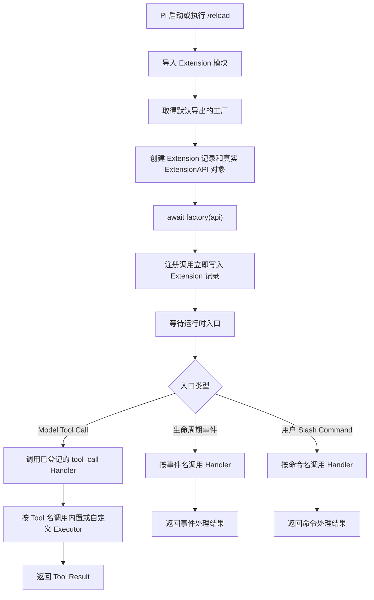
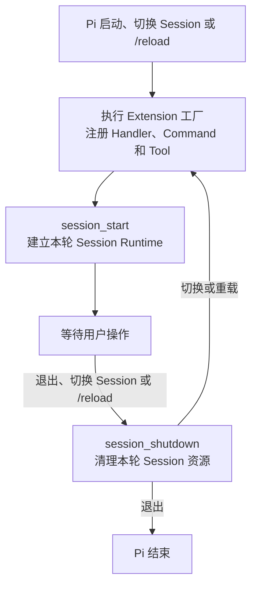
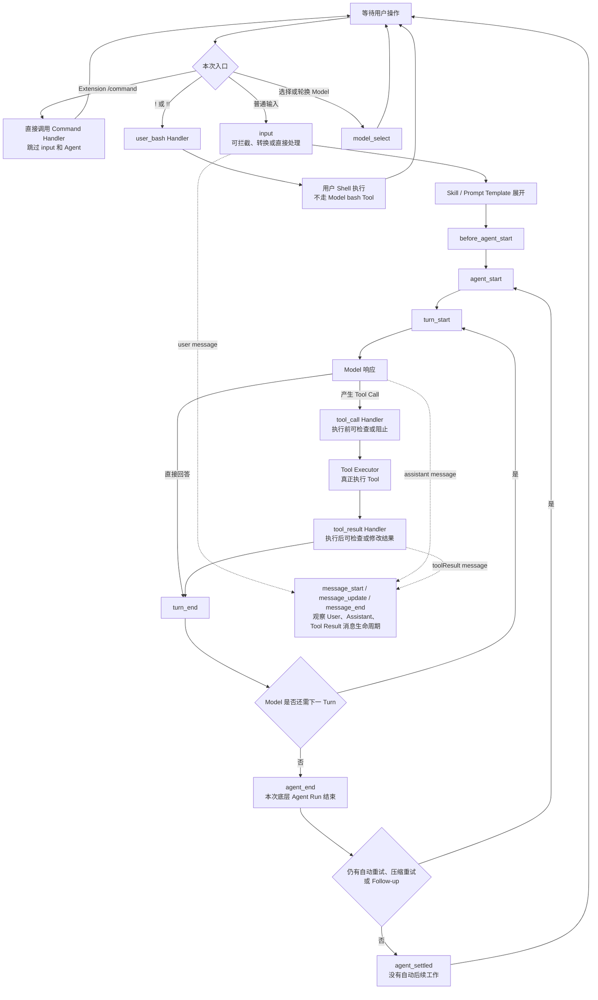
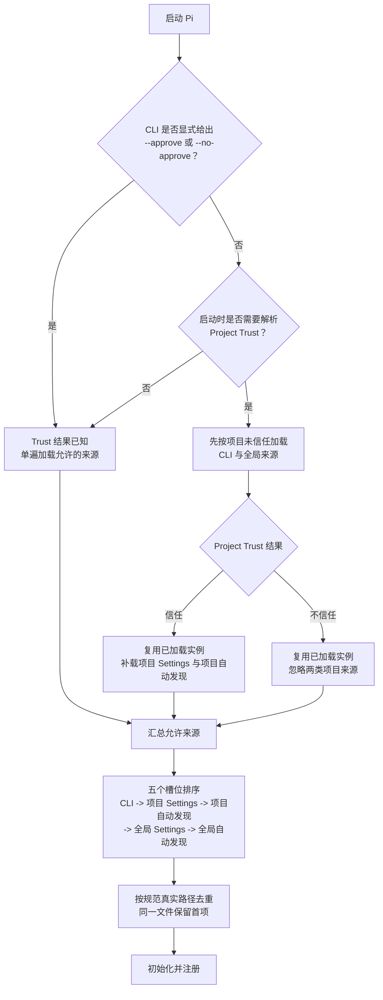
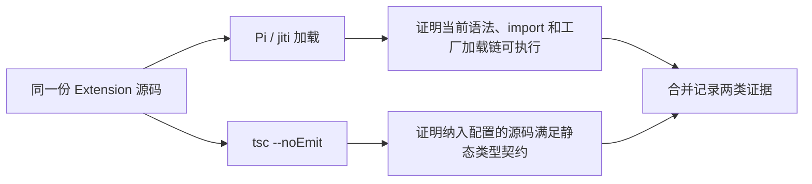

# Extension Runtime 与加载

本文默认描述 Pi `0.84.1` 的工厂、注册、生命周期、四类来源、Project Trust、Reload、TypeScript 和依赖；明确标注的 5.10 动态矩阵使用 Pi `0.84.2`。学习状态只见[完整学习计划](../../plans/pi-complete-learning-plan.md)；阶段 5 总览见[Pi Extensions](../06-extensions.md)。

## 加载、初始化、注册与运行时派发



一次加载中，每个经规范路径去重、成功导入且默认导出有效工厂的 Extension 调用一次工厂；`/reload` 会建立新一轮。运行时入口可能从未出现，也可能多次出现。

### 完整例子：工厂执行不等于 Handler 触发

假设 Extension 在工厂中注册一个 `/guard` Command Handler：

| 阶段 | Pi 做什么 | 当前证据能证明什么 |
|---|---|---|
| 加载 | 导入 Extension 并执行工厂 | `reload.ts` 写入 `V1`，证明本次工厂执行过 |
| 注册 | 工厂把 `/guard` Handler 登记到 Extension 记录 | 证明能力已登记，不证明 Handler 已调用 |
| 触发 | 用户实际输入 `/guard` 后，Pi 才调用对应 Handler | 需要单独观察 Handler 的结果，才能证明本次调用发生 |

用 Spring 类比：执行 Extension 工厂类似应用启动时创建并注册 Controller，触发 Handler 类似真实请求到达后调用 Controller 方法。应用启动成功不等于接口已经被请求。工厂通常每轮加载执行一次；Handler 可能一次都不执行，也可能随匹配事件执行多次。

因此，真实 Pi 中出现 Flag 或工厂 marker，只能把证据推进到“工厂执行并注册能力”。它不能自动证明 Handler 或 Executor 已触发、功能正确或代码运行安全；这些结论需要各自对应的运行实验。

### 5.2 生命周期系统地图

先把 Runtime 所有权与用户入口分成两张主线图。第一张只回答 Extension 实例何时建立、替换和关闭：



第二张从“等待用户操作”开始，只回答不同入口怎样派发。普通输入才进入 Agent/Turn 循环；Extension Command、User Bash 和 Model 选择各走独立入口：



`message_start`、`message_update`、`message_end` 是穿插在 User、Assistant、Tool Result 消息生命周期中的观察事件，不是每次 Agent Run 只执行一遍的独立主线。并行 Tool、重试和 Session 切换可能让实际序列更复杂，图中只表达本轮学习需要掌握的主干。

### A-D 四组真实运行证据

下面四组实验分别只改变一种入口，避免把 Command、用户 Shell、模型切换和普通 Agent Loop 混在一起：

| 组别 | 用户操作 | 本次真实事件主链 | 直接结论 |
|---|---|---|---|
| A | 输入 `/pi-study-trace` | `factory -> session_start -> command -> session_shutdown` | Extension Command 由用户点名触发，不需要进入普通 Agent Loop |
| B | 输入 `!!printf ...` | `factory -> session_start -> user_bash -> session_shutdown` | 用户 Shell 是 Pi 的独立入口，不是 Model `bash` Tool |
| C | 按一次 `⌃P` | `factory -> session_start -> model_select(source=cycle) -> session_shutdown` | `⌃P` 切换 Model；`⇧Tab` 才切换当前 Model 的 Thinking Level |
| D | 发送普通 Prompt，并由 Model 调用一次内置 `read` | `input -> Agent -> Turn -> read Tool -> 下一 Turn -> agent_end -> agent_settled` | 普通输入进入 Agent Loop，Tool Result 会交回 Model 决定下一步 |

C 组启动时的 `--models` 模式没有命中，因此本次不能证明只在两个指定 Model 内轮换；界面和日志只能证明一次 `⌃P` 实际切换了 Model，并派发 `model_select source=cycle`。它也不能证明 Provider 能回答或完全没有网络活动。

D 组的完整脱敏事件日志如下：

```text
0001 factory
0002 session_start reason=startup
0003 input source=interactive
0004 before_agent_start
0005 agent_start
0006 turn_start
0007 message_start role=user
0008 message_end role=user
0009 message_start role=assistant
0010 message_end role=assistant
0011 tool_call tool=read
0012 tool_result tool=read
0013 message_start role=toolResult
0014 message_end role=toolResult
0015 turn_end
0016 turn_start
0017 message_start role=assistant
0018 message_end role=assistant
0019 turn_end
0020 agent_end
0021 agent_settled
0022 session_shutdown reason=quit
```

第一 Turn 中，Model 先产生 `read` Tool Call；Pi 在调用内置 `read` Executor 前后派发 `tool_call` 与 `tool_result` Handler，随后把 Tool Result 加入消息上下文。第二 Turn 中，Model 根据这个结果生成最终回答，因此“一个普通 Prompt”不等于“只有一个 Turn”。一次 Turn 也可能包含多个 Tool Call，不能把本次两个 Turn 当成全局固定数量。

这里的 Tool 由 Pi 放进可用工具集合并提供给 Model；Model 只负责选择 Tool 和给出参数。Tool Executor 才负责真正读取文件或执行操作。D 组采证时的历史版本尚未注册自定义 Tool，因此该组调用的是 Pi 内置 `read`，实验 Extension 只通过 `tool_call` 和 `tool_result` Handler 观察其前后时刻；当前主 Extension 已另行注册 `pi_study_inspect`。

`agent_end` 表示当前这一次底层 Agent Run 已结束；如果 Pi 还要自动重试、压缩后重试或处理 Follow-up，之后仍可能开始新的 Run。`agent_settled` 表示这些自动后续工作也已结束，当前上层任务已经稳定空闲。两者都不等于 Session 已关闭；本次直到 `/quit` 后才出现 `session_shutdown reason=quit`。

追踪器只记录事件名、顺序和少量白名单元数据，没有记录 Tool Result 内容、错误状态或最终回答。因此 D 组日志能证明 `read` 请求经过 Handler、Executor 所在运行路径及结果回到消息循环，但不能单独证明文件读取成功、内容正确、最终回答正确或操作安全；这些结论需要界面结果、错误字段或独立断言。

从调用工厂到同步返回或异步 `Promise` 完成，统称初始化：

| 方式 | 工厂行为 | Pi 的处理 |
|---|---|---|
| 同步 | 准备内存状态、登记能力并立即返回 | 返回后继续启动 |
| 异步 | 返回代表整个初始化过程的 `Promise`，内部等待有限 I/O 后登记能力 | 等待 `Promise` 完成后继续启动 |

同步或异步只描述一次性准备如何完成，不描述 Handler 或 Executor 如何触发。工厂可能在不启动 Session 的命令中执行，因此这里只做有限准备；不要在工厂中启动进程、Socket、Watcher 或 Timer。长期资源应延后到 `session_start` 或真实使用入口，并由幂等的 `session_shutdown` 清理。

证据链必须逐层建立：

`发现文件 -> 导入模块 -> 执行工厂 -> 注册能力 -> 触发 Handler/Executor -> 行为正确且安全`

前一层通过不能证明后一层通过。Extension 是拥有 Pi 进程和当前系统用户权限的本地代码；它可以实现门禁，也可以绕过门禁直接产生副作用。

## 四类加载来源与实验探针

同一个 Extension 文件可以通过四类入口交给 Pi。来源由 Pi 找到文件的入口决定，不由代码内容或文件名决定。

| 来源类别 | 默认位置或配置 | 当前实验探针 | 持续性 | Project Trust |
|---|---|---|---|---|
| CLI 临时加载 | `-e/--extension <path>` | `<lab>/cli.ts` | 当前进程 | 不控制 |
| 全局自动发现 | `~/.pi/agent/extensions/*.ts` 或子目录 `index.ts` | `<lab>/agent/extensions/global-auto.ts` | 持续 | 不控制 |
| 项目自动发现 | `.pi/extensions/*.ts` 或子目录 `index.ts` | `<lab>/project/.pi/extensions/project-auto.ts` | 持续 | 控制 |
| Settings 附加路径 | 全局或项目 `settings.json` 的 `extensions` | `<lab>/project/project-settings.ts`，由项目 Settings 引用 | 持续 | 项目 Settings 受控制；全局 Settings 不受控制 |

项目 Settings 的探针配置为：

```json
{
  "extensions": ["../project-settings.ts"]
}
```

相对路径从 `<lab>/project/.pi/settings.json` 所在目录解析，所以最终指向 `<lab>/project/project-settings.ts`。文件不在自动发现目录中；删除 Settings 引用后，Pi 不会仅凭文件名找到它。

`--no-extensions` 关闭常规 Extension 发现，但显式 `-e` 仍可加载指定文件。Package 不属于这四类本地文件入口，其 Source 与作用域见 [Packages、Models 与 Providers](../07-packages-models-providers.md)。

## Project Trust、顺序、去重与重载

四类入口在最终集合中占五个排序槽位，因为 Settings 是一种入口，但分为项目 Settings 和全局 Settings 两个位置。



【源码证据】Pi `0.84.1` 在没有显式 Trust 覆盖且需要询问时，先加载 CLI 与全局 Extension；信任后复用这些实例并补载项目 Extension，不会再次执行已有工厂。Project Trust 只控制项目 Settings 和项目自动发现资源，既不控制 CLI/全局 Extension，也不降低操作系统权限。

加载顺序不是统一的覆盖规则：【源码证据】同一真实文件按规范路径去重；不同 Extension 的同名 Tool 由先加载者生效；同名 Command 会保留并增加编号后缀；事件 Handler 按加载与注册顺序运行，是否短路由事件类型决定。自动发现目录的字母顺序不是稳定契约，这些冲突行为仍需受控运行验证。

【文档说明】自动发现位置支持 `/reload`。【源码证据】`0.84.1` 还会重新解析 Settings 和 CLI 路径，但这不是跨版本承诺。实验必须把官方承诺、当前源码行为和本机运行结果分别记录。

## TypeScript 直接加载与独立类型检查

【文档说明】Pi 使用 `jiti` 直接加载 TypeScript Extension，不要求预先生成 `dist/index.js`。`jiti` 负责即时转换语法、解析 `import` 并执行模块，不执行完整 TypeScript 类型检查。官方入口见 [Extensions 文档](https://pi.dev/docs/latest/extensions)；该 `latest` 链接是动态参考。

同一份源码必须走两条互不替代的路线：



| 路线 | 能证明 | 不能证明 |
|---|---|---|
| Pi/`jiti` 加载 | 当前语法可转换、`import` 可解析、工厂可执行 | 静态类型正确、Handler/Executor 行为正确或安全 |
| `tsc --noEmit` | 纳入当前配置的类型声明和使用满足静态契约 | Pi 一定能加载、运行时行为正确、未纳入文件正确 |

`--noEmit` 只表示不生成输出文件；检查范围与严格程度仍由命令参数和 `tsconfig.json` 决定。`skipLibCheck` 跳过第三方 `.d.ts` 内部检查，但仍读取依赖公开类型并检查项目源码。启用后必须保留本项目受控类型错误的 Red/Green 对照，证明项目源码没有被一起跳过。

### 电话号码登记类比：类型正确不等于内容正确

假设登记联系人时，姓名和电话号码都必须是字符串。把电话号码写成数字属于格式错误，类型检查可以拦截；把错误号码写成字符串仍符合类型要求，类型检查无法判断内容是否正确。

映射到 Extension：Pi 的公开类型要求 `registerFlag()` 的 Flag 名称是字符串。临时传入数字并取得 `tsc` 失败，再恢复为字符串并通过，证明当前文件确实被纳入检查且 Pi 的公开类型契约正在生效。但另一个错误名称仍然是合法字符串，必须直接调用工厂并由 Fake API 记录实际登记内容，才能与预期名称和配置比较。

| 验证层 | 电话号码场景 | Extension 场景 | 不能证明 |
|---|---|---|---|
| `tsc --noEmit` | 姓名和电话的类型是否符合登记格式 | 工厂调用是否符合 Pi 的公开类型契约 | Flag 名称和配置是否符合业务预期；Pi 是否实际加载 |
| Fake API 测试 | 前台实际记录了谁和什么号码 | 直接调用工厂时实际登记了什么 Flag | Project Trust、自动发现或真实 Pi 加载链 |
| 真实 Pi 实验 | 真实登记系统是否收到请求 | Pi 是否通过指定入口发现、加载并执行工厂 | 未被本次场景覆盖的 Handler、功能与安全性 |

受控 Red -> Green 不是为了随意破坏代码：基线 Green 说明当前状态通过；预期 Red 证明检查器确实能拦截目标错误；恢复 Green 证明错误已移除。三层证据回答不同问题，不能互相替代。

## 5.1 的四条依赖判断

5.1 只要求能正确配置和排查，不展开 npm 内部解析或 Package 发布策略：

| 判断 | 例子与边界 |
|---|---|
| 运行时第三方库放 `dependencies` | `ms` 提供 Node 实际执行的代码；只放开发依赖可能在生产安装后缺失 |
| 开发工具和类型声明放 `devDependencies` | TypeScript、测试工具和 `@types/ms` 服务于开发检查；类型声明不能代替真实运行代码 |
| Pi 核心包由宿主提供 | Extension 运行时的真实 `ExtensionAPI` 对象由 Pi 传入；具体 `peerDependencies` 发布配置不在本节展开 |
| 锁文件固定完整解析结果 | `package-lock.json` 记录直接与传递依赖的解析树；`node_modules` 才是当前机器供 Node 加载的代码 |

锁文件只有在安装流程实际使用且与 `package.json` 一致时才帮助复现，也不能证明依赖安全、类型正确或行为正确。`npm ci`、完整性字段、上游 shrinkwrap、多版本树和 Maven 依赖调解等审计细节不属于 5.1 的教学主线；本次实验的具体审计证据保留在计划台账，Package 发布语义不在本节展开。
