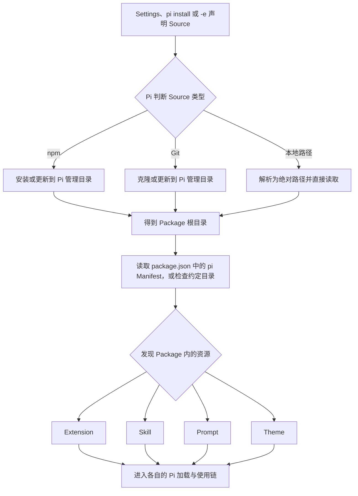
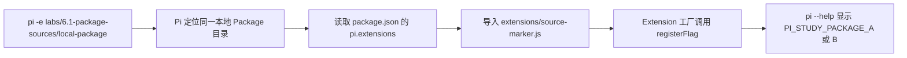
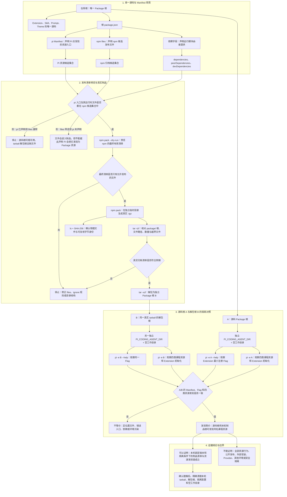
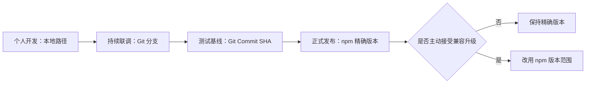
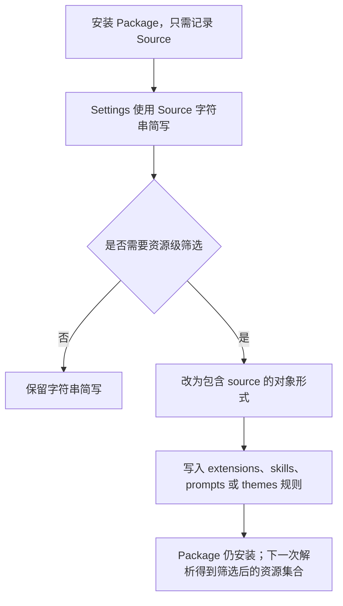
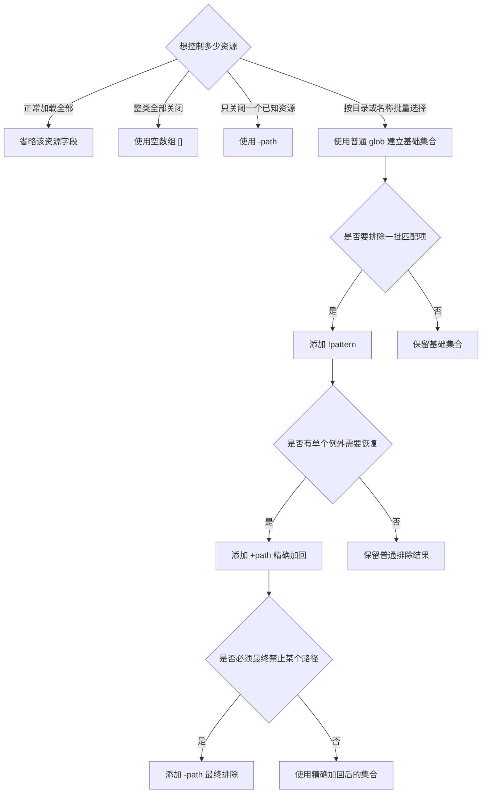
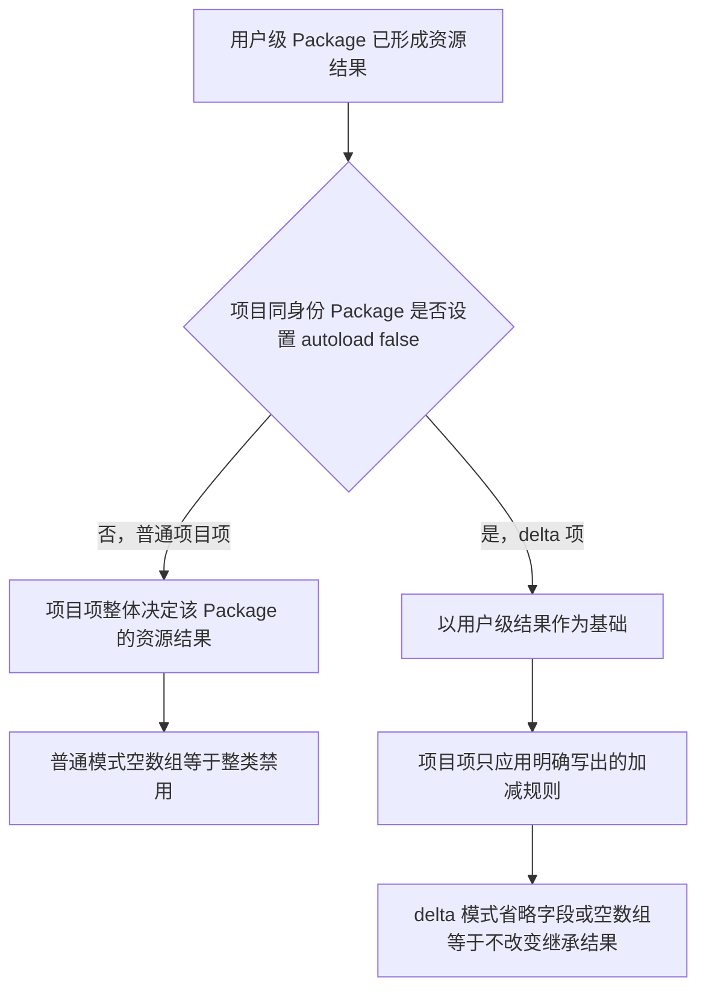
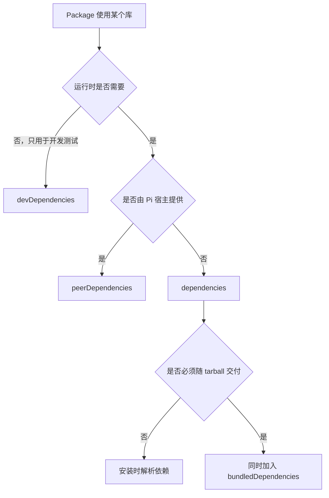
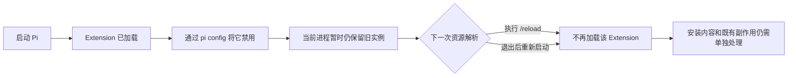
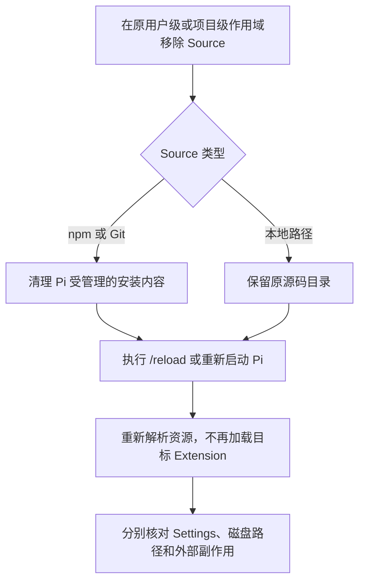

# Packages、Models 与 Providers

本文按 Pi `0.84.2` 记录已经核对的稳定知识、实验方法和证据边界。学习状态和验收结论只记录在 [完整学习计划](../plans/pi-complete-learning-plan.md) 中。

## Pi Package 解决什么问题

阶段 4 的 Prompt、Skill、Theme 和阶段 5 的 Extension 原本分散在项目目录中。Pi Package 的作用是把这些资源组织成一个可加载、可安装和可分发的来源，让个人调试、团队协作和正式交付可以使用同一套资源。

Pi Package 不是与 Extension、Skill 并列的第五种资源，而是装载一组 Pi 资源的组织与分发单元。最容易混淆的三个对象可以这样区分：

| 对象 | 回答的问题 | 示例 |
|---|---|---|
| Package | 这一整套可复用能力是什么 | 一个同时包含 Extension、Skill、Prompt 和 Theme 的目录或发布制品 |
| Source | Pi 去哪里取得这个 Package | npm 包名、Git 地址或本地路径 |
| Resource | Package 里面具体加载什么 | Extension、Skill、Prompt、Theme |

一个 Source 从声明到资源生效的通用流程如下：



当前 6.1 本地路径 fixture 把这条抽象流程落成了一条可观察链：



这里变化的是同一个 Package 目录中的 Extension 内容；`-e` 提供的是 Source，`package.json` 的 `pi` 字段声明资源入口，`source-marker.js` 才是被加载的具体 Resource。A/B 标记是本实验选择的可观察结果，不是所有 Pi Package 都必须注册 CLI Flag。

Package 只是资源的组织和分发边界，不是权限沙箱。Package 中的 Extension 可以执行代码，Skill 也可以引导 Model 使用工具；安装第三方 Package 前仍需审查来源和内容。

## 本地 `pi-study-workbench` 的封装边界

本仓库已有四类经过前序阶段验证的资源。6.3 的封装目标不是复制一套新源码，而是把仓库根目录作为 Package 根，用根 `package.json` 的显式 `pi` Manifest 指向现有文件。这样项目内自动发现与 Package 加载使用同一份源码，修复不需要同步两套目录。

| 资源 | 唯一源码 | Manifest 入口 |
|---|---|---|
| Extension | `.pi/extensions/pi-study-guard/` | `.pi/extensions/pi-study-guard/index.ts` |
| Skill | `.agents/skills/java-readonly-analysis/` | 整个 Skill 目录，包括 `references/` |
| Prompt Template | `.pi/prompts/java-review.md` | 该 Markdown 文件 |
| Theme | `.pi/themes/pi-study-lab.json` | 该 JSON 文件 |



本仓库本次观测中，`files` 有 `17` 个显式路径；npm 另外自动纳入 `README.md` 和 `package.json`，所以 dry-run、真实 tarball 与解包树最终都是 `19` 个普通文件。`17 -> 19` 是这个版本和这个 Package 的实测结果，不是所有 npm Package 的固定公式。

整条链的关键不是“某条命令退出为 0”，而是两个方向同时闭合：`pi` 声明的入口及其运行时闭包确实进入真实制品；真实制品中的文件也经过 Manifest、白名单和 A/B 加载观察，能够说明为什么被交付、为什么被 Pi 发现。文件存在、Manifest 有记录和真实 Pi 已发现是三种不同证据。

这里有三张容易混淆的清单：

| 清单 | 决定什么 | 不能替代什么 |
|---|---|---|
| `pi` Manifest | Pi 从 Package 根发现哪些资源 | 不决定 npm tarball 实际包含哪些文件 |
| npm `files` | `npm pack`/`npm publish` 候选制品包含哪些文件 | 不表示这些文件都会被 Pi 加载 |
| 依赖字段 | Extension 的导入在开发期或运行期由谁提供 | 不证明依赖安全，也不决定资源是否启用 |

本 Package 的发布清单只应包含四类生产资源及其完整运行时闭包：Extension 入口实际导入的模块、Skill 的 `SKILL.md` 与 `references/`、Prompt、Theme，以及必要的 Package 说明和许可证。项目 Settings、测试、仅测试使用的 fixture、学习实验、计划文档、Session、缓存、`node_modules` 和凭据不得进入归档。最终内容以 `npm pack --dry-run`、真实生成的 tarball 清单和解包后回归为准，不能只相信 `files` 字段。

当前 Extension 没有普通第三方运行依赖；它使用的 `@earendil-works/pi-coding-agent`、`@earendil-works/pi-tui` 和 `typebox` 按 Pi `0.84.2` 随包文档属于宿主提供的 `peerDependencies`，不能另打包一份。TypeScript、Node 类型和测试工具属于 `devDependencies`。初始课程制品使用语义化版本 `0.1.0`；仓库没有许可证文件时应显式标为 `UNLICENSED`，不能把缺少许可证误写成允许公开复用。若以后选择开源许可证，必须单独补许可证文件并重新审查发布清单。

源码目录与归档解包目录的等价实验必须从干净隔离工作目录运行，避免仓库自身的 `.pi/`、`.agents/` 自动发现与临时 Package Source 同时命中，造成重复资源或错误归因。加载等价只证明两边发现了同一组资源并命中指定行为，不会重新证明阶段 4-5 的全部正确性、安全性或权限隔离。

### 源码与归档等价实验

真实场景是：仓库根作为本地 Source 时四类资源可用，但正式交付的是 npm tarball。需要证明实际归档没有漏文件、夹带文件或改变资源发现结果。

| 实验项 | 固定合同 |
|---|---|
| 待验证结论 | 仓库根源码与同一 tarball 的解包目录能发现同一组课程资源；tarball 只包含允许发布的文件 |
| 固定条件 | 同一 Pi `0.84.2`、Node/npm 版本、资源内容、观察脚本、禁用 Session/Model/外网的参数，以及两套等价的隔离配置 |
| 唯一变量 | A 的 Package Source 指向仓库根；B 指向本轮 tarball 的解包根目录 |
| A/B 共同预期 | Extension Flag 与 `/study-inspect` Command、`skill:java-readonly-analysis`、`java-review` Prompt 和 `pi-study-lab` Theme 各命中一次，无资源诊断 |
| 制品预期 | dry-run 与真实 tarball 清单一致；不含 Settings、测试、仅测试 fixture、学习实验、计划、Session、缓存、`node_modules` 或凭据；记录 tarball SHA-256 |
| 通过标准 | 发布清单检查、A/B 四类资源集合、Extension 最小注册行为和退出状态全部一致；任一缺失、重复、诊断或越界文件都失败 |

实验顺序固定为：先校验 Manifest 与依赖字段，再执行 `npm pack --dry-run` 和离线 `npm publish --dry-run`，随后生成真实 tarball、检查文件清单与 SHA-256，最后从两个干净隔离目录运行 A/B 资源发现。`publish --dry-run` 只演练打包与发布前检查，不向 Registry 发布；真实发布、Git 推送和第三方安装均不在本实验内。

命令退出为 0 不能单独证明等价。必须同时看到归档清单、四类资源的名称与来源、无诊断和两边一致的 Extension 最小注册结果。该实验不重新验收阶段 4-5 的完整功能，不证明任意新环境、第三方依赖、真实 Registry、安装/卸载、更新语义或安全隔离；Package 管理行为留给 6.4。

## 三类来源

| 来源 | Package 身份 | 用户级解析位置 | 项目级解析位置 | 内容变化方式 |
|---|---|---|---|---|
| npm | 包名，不包含版本 | `~/.pi/agent/npm/` | `.pi/npm/` | 安装或更新到满足 Source 的版本 |
| Git | 规范化后的 `host/path`，不包含协议与 ref | `~/.pi/agent/git/<host>/<path>` | `.pi/git/<host>/<path>` | 获取并对齐配置的分支、Tag 或 Commit |
| 本地路径 | 解析后的绝对路径 | 原路径 | 原路径 | 直接读取原地文件变化，不复制、不下载 |

SSH、HTTPS 等不同写法经规范化后可能归为同一个 Git identity。同一个 Package 同时出现在用户和项目 Settings 时，项目条目通常优先；例外是项目条目设置 `autoload: false` 时，它作为用户条目的 delta 应用，两条记录都会保留，不是简单替换。

Settings 中的本地相对路径按 Settings 所在配置目录解析：用户级以 Pi agent 目录为基准，项目级以项目 `.pi/` 目录为基准。

### CLI `-e` 临时作用域

`-e` 把 Source 作为当前 Pi 运行的 temporary scope 输入，不写入用户或项目 Settings。CLI 会先把本地相对路径按启动 `cwd` 解析为绝对路径；本地 Source 随后直接读取该文件或目录。npm 与 Git Source 则安装或克隆到 Pi agent 目录下的 `tmp/extensions/` 管理目录。

temporary scope 描述配置与本次加载的作用域，不承诺进程退出后立即删除磁盘内容。Pi `0.84.2` 的 Git 实现会在刷新失败时保留已有 temporary checkout，因此“不写 Settings”不能推出“缓存必然删除”。临时加载也不是沙箱，来源中的 Extension 仍在 Pi 进程权限下运行。

## npm 精确版本与版本范围

同一个 npm 包可以发布多个版本。Source 不只决定包名，还决定 Pi 在安装或显式更新时允许 npm 选择哪些版本。

| Source | Pi `0.84.2` 解析 | 显式 Package 更新 | 固定强度 |
|---|---|---|---|
| `npm:pkg@1.0.0` | 合法单一 SemVer，`pinned=true` | 跳过版本更新 | 固定到精确版本号 |
| `npm:pkg@^1.0.0` | 范围 `>=1.0.0 <2.0.0-0`，`pinned=false` | 选择范围内最高可用版本 | 允许兼容的 `1.x` 变化 |
| `npm:pkg` | 未指定版本，`pinned=false` | 按 npm 当前默认目标重新解析 | 跟随当前默认发布目标 |
| `npm:pkg@latest` 或其他 Tag | 不是单一 SemVer，`pinned=false` | 重新解析该 Tag | Tag 可以被发布者移动 |

随包文档把“带版本的 spec”概括为 pinned；按当前实现需要进一步区分：只有 `semver.valid()` 接受的单一版本才是 pinned，版本范围和 Tag 虽然也写在 `@` 后面，却仍是可重新解析的目标。

版本范围允许将来更新，不表示已安装内容会在每次启动时自动变化。Pi 在管理目录中保存的是一个具体版本；只要现有版本仍满足范围，普通资源解析会继续使用它。执行 `pi update --extensions`、重新安装或在缺少安装内容的新环境中解析时，才会重新选择目标版本。

Pi 启动页中的 Package 资源标签可能继续显示 Settings 里的 Source，例如 `pkg@^1.0.0`；它表达“按什么规则选择版本”，不是“当前磁盘实际安装了哪个具体版本”。判断更新结果必须另外读取 Pi 受管理安装目录中的 Package Manifest：Source 范围与已安装具体版本需要作为两份证据组合解释。

精确 npm 版本固定的是顶层 Package 的版本选择，不等于完整供应链可复现。Registry 可达性和可信度、tarball 完整性、传递依赖范围、生命周期脚本、npm/Node/Pi 版本及操作系统仍需分别固定和验证。

## Git 分支与 Commit

Git 分支是指向某个 Commit 的可移动名称，Commit SHA 是一份固定历史快照。

假设 `main` 最初指向提交 A，Package 内容为 `PACKAGE_A`。开发者提交新内容后产生提交 B，`main` 随即前进到 B；提交 A 本身没有变化。

| 配置目标 | 远端新增 B 后 | 适用场景 |
|---|---|---|
| Git 分支 `main` | 更新并重新对齐该分支后可能从 A 变成 B | 跟随持续开发 |
| Git Commit A 的完整 SHA | 仓库出现 B 后仍保持 A | 团队复现、测试基线、正式交付 |

因此，“Source 字符串写了 `@main`”只固定了分支名称，没有固定分支背后的内容。分支可以前进、回退或被强制改写。只有 Commit SHA 直接标识不可变的 Git 对象。

Pi `0.84.2` 会把带 `@ref` 的 Git Source 视为已指定 ref，但这里的“已指定”不能等同于“内容不可变”：如果 ref 是分支或被重指向的 Tag，更新时重新解析该 ref 仍可能得到另一个 Commit。正式复现应记录完整 Commit SHA，并核对实际 checkout 的 `HEAD`。

还要把 Git ref 的可移动性与 Pi 的 temporary 缓存分开。Pi `0.84.2` 将 `-e` 中带 `@main` 的 Git Source 标记为 `pinned=true`；同一个 temporary 安装目录已经存在时，新 Pi 进程不会自动刷新这个 checkout。因此远端 `main` 已从 A 移到 B，不代表复用同一 `PI_CODING_AGENT_DIR` 的下一次 `-e @main` 必然显示 B。新隔离缓存会重新解析当前 `main`，显式安装/更新路径则要按各自命令语义验证。

当前版本还有一个解析差异：随包文档将裸 `git://` 列为可接受协议，但 `parseGitUrl()` 会把开头的 `git:` 当作 Source 前缀剥离，导致裸 `git://127.0.0.1/...` 解析失败；课程回环实验使用 `git:git://127.0.0.1/...` 才能明确表示“Git Source 前缀 + git 协议 URL”。该结论限定 Pi `0.84.2`，后续版本需要重新核对。

完整 Commit SHA 固定的是 Git 对象身份。它不保证该对象永远能从远端取得，也不固定仓库外依赖、安装脚本结果、Node/npm/Pi 版本、操作系统或运行环境，因此是源码快照固定点，不等于完整供应链可复现。

## 来源选型与固定强度

三类 Source 不是互相替代的三种写法，而是对应 Package 生命周期中的不同目标：本地路径追求修改反馈，分支和版本范围允许受控变化，Commit 和精确版本提供明确基线。

| 使用场景 | 推荐 Source | 固定到什么 | 仍会变化或缺失什么 |
|---|---|---|---|
| 个人开发调试 | 本地路径 | 只固定解析后的路径 | 路径中的文件可原地变化 |
| 团队持续联调 | Git 分支 | 只固定分支名称 | 分支可前进、回退或被强制改写 |
| 团队测试基线 | Git 完整 Commit SHA | 固定 Git 对象身份 | 远端可达性、依赖和运行环境未固定 |
| 正式版本分发 | npm 精确版本 | 固定顶层 Package 版本选择 | tarball、传递依赖、脚本和运行环境仍需核对 |
| 主动接受兼容升级 | npm 版本范围 | 固定允许选择的版本集合 | 显式更新或新环境解析出的具体版本可变化 |

一个 Package 从开发到交付可以沿同一条链逐步收紧：



正式交付时不能只保存 Source 字符串。最小记录应同时包含 Source、实际解析位置、Git `HEAD` 或 npm 已安装版本、Package 文件清单与内容哈希，以及 Pi、Node、npm 和操作系统版本。对于 npm 精确版本，受控升级应发布新版本并在验证后主动修改 Source；精确版本不会把顶层 Package 之外的整条供应链自动锁死。

因此，固定强度的准确顺序不是简单的“本地 < Git < npm”，而是：本地路径、Git 分支、Git Tag、npm Tag、npm 版本范围都允许某一层目标继续变化；Git 完整 Commit 固定源码对象，npm 精确版本固定顶层发布版本。二者解决的层次不同，都不等于完整环境可复现。

## Package 资源筛选

Package Manifest 先确定可发现资源的最大集合，Settings 中的 Package 对象再从该集合中决定本次启用哪些资源。筛选不会卸载 Package，也不能把 Manifest 边界之外的任意文件加入加载集合。

### Settings 中的字符串简写与对象形式

在 Pi `0.84.2` 的本课程隔离实验中，刚安装且没有资源级配置时，`packages` 条目可以只保存 Source 字符串：

```json
"packages": ["npm:pi-study-workbench@^0.1.0"]
```

需要为这个 Package 保存资源筛选时，同一条目改用对象形式；`source` 仍标识同一个 Package，其他字段只描述资源选择：

```json
{
  "source": "npm:pi-study-workbench@^0.1.0",
  "extensions": []
}
```

这不是把旧 Package 替换成另一个 Package，也不是卸载。对于普通项目项，`extensions: []` 表示 Package 仍在 Settings 和受管理安装目录中，但它的 Extension 最终集合为空；Skill、Prompt 和 Theme 没有相应空数组时不受这一字段影响。该配置由后续资源解析使用，不会撤销已经在当前进程中执行过的 Extension。



日常使用时优先选择最简单、意图最明确的写法：正常加载就省略字段，整类关闭就用空数组，只关闭一个已知资源就用 `-path`。普通 glob、`!pattern` 和 `+path` 主要用于同类资源很多、需要按目录或命名规则组合筛选的 Package，不应为了“显得精确”而堆叠规则。

| 筛选写法 | 普通 Package 对象中的含义 |
|---|---|
| 省略某个资源字段 | 加载该类型的全部 Manifest 资源 |
| `[]` | 禁用该类型的全部资源 |
| 普通 glob | 只保留匹配的资源；没有普通包含项时以全部候选为基础 |
| `!pattern` | 排除匹配资源 |
| `+path` | 从候选集合中精确加回一个资源，覆盖普通排除 |
| `-path` | 精确排除一个资源，优先于精确加回 |


可以把筛选理解为一条固定流水线。假设 Manifest 允许三个 Extension：`safe-a.ts`、`safe-b.ts`、`legacy.ts`，下面各行是在前一行基础上继续处理，而不是四套互不相关的配置：

| 处理阶段 | 示例规则 | 本阶段之后的集合 |
|---|---|---|
| 普通 glob 建立基础集合 | `./.pi/extensions/**/*.ts` | 三个候选都进入基础集合 |
| 普通排除 | `!./.pi/extensions/legacy.ts` | 只剩 `safe-a.ts`、`safe-b.ts` |
| 精确加回 | `+./.pi/extensions/legacy.ts` | `legacy.ts` 即使被普通排除也重新加入 |
| 最终精确排除 | `-./.pi/extensions/legacy.ts` | `legacy.ts` 最终仍被排除 |

`+path` 和 `-path` 都要求精确资源路径；它们不是更宽泛的 glob。`-path` 的优先级最高，因此同一路径同时被普通排除、精确加回和精确排除命中时，最终结果仍是不加载。



同一 Package 同时出现在用户级和项目级 Settings 时，普通项目项整体优先。项目项设置 `autoload: false` 后则作为用户项的增量覆盖：用户级结果仍是基础，项目项只修改明确匹配的资源；省略字段或空数组表示该类型不提供增量变化，不是普通模式中的“全部禁用”。增量模式下，普通 pattern 或 `+path` 启用匹配资源，`!pattern` 或 `-path` 禁用匹配资源。

Pi 不是把两级同身份 Package 的资源简单相加。当前 `0.84.2` 实现先按 Package 身份去重，再收集资源：npm 以包名、Git 以标准化仓库 host/path、本地 Source 以解析后的绝对路径判断身份；普通同身份项目项保留，用户项不再参与该 Package 在当前项目中的资源解析。因此，`pi list` 可以同时显示两级配置记录和安装路径，但实际加载只采用去重后的有效项。

官方文档和源码明确证明上述优先级与去重顺序，但没有直接说明产品设计动机。合理推断是：项目作用域比用户默认更具体，优先后可以让团队项目声明自己的资源集合，同时避免同一个 Extension、命令或 Hook 被两级重复注册；项目本地配置仍必须先通过 Project Trust。这个解释不是安全保证，项目优先也不会让 Package 代码自动变得可信。需要在用户结果上只做局部加减时，应显式使用 `autoload: false` delta，而不是依赖普通项目项回退。

普通项目项与 `autoload: false` delta 最容易混淆的地方是空数组：普通模式的 `extensions: []` 表示最终 Extension 集合为空；delta 模式的 `extensions: []` 表示项目没有对继承来的 Extension 增加任何变化，因此用户级结果保持原样。



## 依赖分类与锁文件

依赖分类回答三个问题：代码在什么时候需要、由谁提供、是否随发布制品一起交付。它不是安全等级；每一类都要继续审查实际文件、版本、脚本和能力。

| 字段 | 职责 | Pi `0.84.2` 用法 | 主要审查点 |
|---|---|---|---|
| `dependencies` | 声明运行时依赖 | npm 或 Git Package 安装时由 npm 自动安装 | 直接与传递依赖的来源、版本范围、文件和 lifecycle scripts |
| `peerDependencies` | 声明应由宿主提供的兼容能力 | Pi 核心包使用 `"*"` 并且不重复打包 | 实际宿主版本是否兼容，是否错误携带另一份核心实现 |
| `bundledDependencies` | 指定随 tarball 一起交付的依赖文件 | 其他 Pi Package 同时列入 `dependencies` 与 `bundledDependencies`，资源路径从 `node_modules/` 引用 | 实际 tarball 是否包含预期版本、额外代码或脚本 |
| `devDependencies` | 支持开发、编译和测试 | 不作为使用者运行 Package 的依赖合同 | 发布制品是否缺少必要构建产物，是否误带开发工具或测试材料 |



`package.json` 中的版本范围描述允许选择什么，锁文件记录某次安装实际解析出的依赖图及相关来源、完整性信息。锁文件存在不代表使用者一定采用同一依赖图，也不证明 tarball 内容、依赖代码或 lifecycle scripts 安全；正式审查还要核对实际发布清单和安装结果。

## 安装、加载、禁用与卸载

Package 安装与 Extension 加载发生在不同阶段。Pi `0.84.2` 安装 npm 或 Git Package 时会调用 `npm install`；随后在启动或资源重载时解析 Manifest，并导入当前启用的 Extension。

npm 的 `ignore-scripts` 只跳过 `preinstall`、`install`、`postinstall` 等 lifecycle scripts，不删除已经安装的 Package 文件，也不改变 Pi Manifest 或 Extension 过滤配置。因此跳过安装脚本后，Pi 仍可能在启动阶段导入 Package 中的 Extension。若某个 Extension 恰好依赖安装脚本生成的文件，它可能因产物缺失而加载失败；这是安装不完整的结果，不是可靠的 Extension 禁用或权限隔离机制。

跳过后若经审查决定放行，Package 文件无需再次下载；应在实际 npm 安装根目录中对精确目标执行 `npm rebuild`，并确保 `ignore-scripts` 已关闭。npm `11.6.2` 会在 rebuild 中补跑 `preinstall`、`install`、`postinstall` 和适用的 `prepare`，还可能重新建立可执行文件链接。直接执行单个 `postinstall` 只覆盖一个脚本，不等价于完整安装生命周期。

对于 Pi 管理的 Package，补执行前还要确认实际安装根目录、Source 和已安装版本，避免在错误依赖树或共享缓存中执行。rebuild 只处理 npm 安装产物，不会让当前 Pi 进程自动重新加载 Extension；需要由 `/reload` 或重新启动触发下一次资源解析。脚本已经产生的副作用仍不会自动回滚。

| 动作 | 改变什么 | 不保证什么 |
|---|---|---|
| 安装 Package | 取得 Package，并可能执行 npm lifecycle scripts | 不保证只写 Package 安装目录 |
| 补执行安装脚本 | 对已安装的精确目标执行 npm rebuild | 不自动重载 Extension，不保证脚本幂等或可回滚 |
| 加载 Extension | 导入代码、执行工厂并注册能力 | 不代表安装脚本此时才执行 |
| 禁用 Extension | 在下一次资源解析时把它排除出加载集合 | 不卸载 Package，不撤销既有副作用 |
| 卸载 Package | 移除配置和受管理的安装内容 | 不保证恢复 Package 目录外的改动 |
| 恢复副作用 | 显式删除额外文件、停止进程或恢复配置 | 已发出的网络请求通常无法撤回 |

控制安装期代码应使用 npm 的脚本策略；控制加载期代码应使用 Pi 的资源过滤或禁用配置。两者必须分别审查和验证。

如果 Extension 已进入当前 Pi 进程，仅修改禁用配置不会把旧实例立即从内存中移除。`pi config` 是独立的配置命令，保存设置后退出；当前交互式 Pi 需要执行 `/reload`，或者退出后重新启动，才会重新解析资源并应用禁用状态。



`/reload` 会为旧 Extension runtime 派发 `session_shutdown`，再重新解析和绑定资源。Extension 可以在 shutdown Handler 中尝试清理自身状态，但这只是它主动实现的行为，不是 Pi 对任意文件、后台进程、外部配置或网络请求的通用回滚保证。资源禁用、Package 卸载、缓存删除和副作用恢复必须分别验证。

### 完整移除的三层验证

“配置不存在”是指对应作用域的有效 Settings 中没有匹配的 Package Source，不是指整个 `settings.json` 文件不存在。它只影响 Pi 后续按该记录解析 Package，不能单独证明磁盘文件已删除或当前进程中的 Extension runtime 已退出。

| 目标 | 操作 | 必须单独验证 |
|---|---|---|
| 停止后续解析 | 在原安装作用域移除 Package Source，或通过资源配置禁用指定资源 | 用户级/项目级有效 Settings 中的 Source 或筛选结果 |
| 移除当前 runtime | 在交互式 Pi 中执行 `/reload`，或者退出后启动新进程 | 新一轮资源发现不再包含目标 Extension |
| 清理磁盘内容 | npm/Git Source 由 `pi remove` 清理 Pi 受管理内容；本地 Source 的原目录需另行处理 | 精确安装路径或原目录的实际存在状态 |
| 恢复既有副作用 | 按 Package 实际行为清理额外文件、进程或外部配置 | Package 管理目录之外的每一项副作用 |



本地 Source 只是指向原路径，因此 `pi remove` 不应删除原源码。npm/Git Source 的正常移除会尝试清理受管理内容，但仍要检查实际路径和退出状态；中途失败、其他缓存及 Package 目录外副作用不能从成功提示推断。`/reload` 只重建当前资源 runtime，不负责删除 Settings 或 Package 文件。

## 安装前静态审查

陌生 Package 在执行任何安装或加载代码前，按以下顺序审查。仓库源码、发布 tarball 和最终安装树可能不同，不能相互替代。

| 顺序 | 检查对象 | 需要确认的证据 |
|---:|---|---|
| 1 | Source 与身份 | 来源类型、精确版本或 Git Commit、实际解析目标 |
| 2 | 发布文件清单 | tarball 中的全部文件、异常生成物、可执行文件和内容哈希 |
| 3 | Pi Manifest 与约定目录 | 显式资源入口，以及 `extensions/`、`skills/`、`prompts/`、`themes/` 中可能被自动发现的内容 |
| 4 | 依赖图 | 四类依赖、锁文件中的实际版本与来源、传递依赖及 bundled 文件 |
| 5 | lifecycle scripts | `preinstall`、`install`、`postinstall`、`prepare` 及其文件、进程、网络和环境变量访问 |
| 6 | Extension 入口 | 导入与工厂初始化代码、动态执行、外部命令、文件读写、网络请求和注册能力 |

静态审查只能识别当前制品中可见的入口、依赖、脚本和能力，不能证明运行正确、安全、幂等或可回滚。结论不足时，应拒绝安装或进入隔离动态实验；不能用“代码看起来正常”替代运行证据和系统级隔离。

## 证据类型与边界

- Pi `0.84.2` 随包 `docs/packages.md`、`dist/core/package-manager.js` 和 `dist/utils/git.js` 属于静态证据，可支持本版本的 Source 身份、解析目录和更新分支；它们不能证明某次运行已经经过这些分支。
- Pi `0.84.2` 的 `package-manager-cli.js`、`config-selector.js`、`resource-loader.js`、`agent-session-services.js` 和随包 `docs/extensions.md` 属于静态证据，可支持 `pi config` 切换时写入配置、`Esc` 关闭选择器、`/reload` 重建 Extension runtime 及 shutdown/reload 顺序；它们不能证明某个第三方 Extension 已正确清理副作用。
- 本机 npm `11.6.2` 的 `npm-rebuild` 文档属于静态证据，可支持 rebuild 补跑 lifecycle scripts 的命令语义；它本身不能证明具体 Package 的脚本可用、安全、幂等或可回滚。
- 课程 6.2 自动测试使用回环 Registry、隔离配置和受限 marker fixture，取得 A 默认安装/加载、B `ignore-scripts` 后仍加载、C 定向 rebuild 补执行但不加载、D `extensions: []` 后新进程不再加载的四组结果。它证明实验实现与本机 Pi `0.84.2`/npm `11.6.2` 链路可运行，不替代学习者亲自执行，也不证明第三方 Package、传递依赖、真实网络、卸载、缓存删除或通用安全性。
- 学习者随后亲自在仓库根运行同一 6.2 运行器，取得精确 tarball 三文件清单、A=`install:true/load:0->1`、B=`install:false/load:0->1`、C=`install:true/load:1->1`、D=`install:true/load:1->1`、`registry_requests=4` 和 `result=PASS`，命令正常返回 Shell；只读清理检查未发现课程临时目录残留。这证明本次用户操作中的四条受控路径命中预期，仍不能外推为第三方脚本安全、可回滚或 OS 隔离。
- 课程 6.3 自动测试使用实际 `npm pack --dry-run`、禁用脚本且离线的 `npm publish --dry-run`、真实临时 tarball、Pi `0.84.2` 公共 `DefaultResourceLoader` 和真实 CLI `--help`。当前制品包含 `19` 个白名单文件，SHA-256 为 `ea474d92ef11af09ecce4fcac3de2bafb540776e4edee6b7c03b5b5e6efb281c`；仓库根与同一 tarball 解包根均各发现一次 Extension Flag/Command、Skill、Prompt 和 Theme，资源诊断与临时残留为 0。该 Green 证明本机当前文件与受控打包链可运行，不替代学习者实操，也不证明真实 Registry 发布、外部安装、其他环境、完整阶段 4-5 行为或安全隔离。
- 学习者随后在仓库根启动同一 6.3 自动运行器，取得 `publish_dry_run=true`、`tarball_files=19`、与自动测试一致的 tarball SHA-256；仓库根与同一 tarball 解包根的 Extension Flag/Command、Skill、Prompt 和 Theme 五项信号均为 `1`，且 `diagnostics=0`、`temp_residuals=0`、`result=PASS`。这是学习者启动的自动运行器证据，不等于学习者亲手完成了运行器内部各步，也不证明真实 Registry 发布、外部安装、更新、卸载、其他环境兼容性或安全隔离。
- 6.3 最终手工验收中，学习者逐步读取 Manifest，分别执行发布清单预览与真实 `npm pack`，核对物理 tarball 的 SHA-256 和 `19` 项归档路径，解包后比较源码/归档 Manifest，并以两套新隔离 Pi 进程分别从源码根和解包根观察同一组公开资源，最后清理精确临时目录。这组直接操作证明学习者走通了本机制品因果链；它仍不证明真实 Registry 发布、外部安装、其他环境兼容性或安全隔离。
- 课程 6.4 自动测试使用回环 Registry、隔离用户目录和临时项目，真实执行 Pi `0.84.2` 的 `install/list/update/remove`，并通过结构化隔离 Settings 覆盖普通筛选和 `autoload:false` 项目 delta。当前实现取得用户/项目两级安装与移除、范围版本 `0.1.0 -> 0.1.1`、Extension 筛选 `0 -> 1 -> 0`、重装恢复和临时残留为 0；另一个独立伪终端验证对真实 `pi config -l --approve` 完成项目禁用后写入 `autoload:false` 与 `-path`，新一轮资源解析只关闭 Extension。它们属于自动/代理实现证据，不替代学习者亲自执行管理矩阵或 Config TUI，也不证明真实 Registry、认证、当前其他 Pi 进程立即卸载、共享缓存或 Package 外副作用已经清理。
- 学习者随后在仓库根启动 6.4 默认自动管理矩阵，取得用户安装 A、普通筛选与项目 delta、范围更新到 B、项目/用户两级移除、B 重装恢复、`registry_requests=9`、`temp_residuals=0` 和 `result=PASS`。这是学习者启动的自动运行器证据；其中筛选和管理动作由运行器执行，不能替代逐步手工验收，也不能外推真实 Registry、共享缓存或 Package 外副作用已经清理。
- 6.4 最终分步验收中，学习者在回环 Registry、隔离用户目录和临时项目内亲手完成用户/项目两级安装、项目筛选、项目移除后的用户级回退、范围 Source 保持不变而磁盘版本 `0.1.0 -> 0.1.1`、用户级移除，并分别核对 Settings、受管理目录与新 Pi 进程资源发现，最后取得 guided 临时残留为 0。这证明本次隔离管理链按预期运行；它不证明共享 npm cache 已删除、Package 外副作用已恢复、外部 Registry 或其他 Pi 版本具有相同行为。
- 学习者又在独立隔离入口中亲自操作真实 `pi config -l --approve`：首次只筛选未切换，运行器因没有项目 delta 明确失败；重试时将继承的 Extension 从 `[x] inherited global` 切换为 `[-] project unload`，退出后回读 `autoload:false` 与精确 `-path`，新一轮资源解析只关闭 Extension、保留 Skill、Prompt 和 Theme，并取得 `temp_residuals=0`、`result=PASS`。这证明本次用户操作中的项目 delta 写入和后续资源发现命中预期；它不表示其他已经运行的 Pi 进程会立即卸载 Extension，也不删除 Package、共享缓存或既有副作用。
- 课程自动测试把 fixture 复制到同一临时绝对路径，A/B 两次分别启动新 Pi 进程并通过 CLI `-e` 加载，覆盖 A-only -> B-only。这只证明该实验实现和这条 CLI `-e` 本地绝对路径链可运行。
- 学习者随后在同一隔离配置根和同一本地绝对路径下亲自取得 A-only，原地切换 fixture 后又由新 Pi 进程取得 B-only，最后恢复 A 并确认该 fixture 的 Git diff 为空。这证明本次用户操作中的 CLI `-e` 本地绝对路径链读取了新进程启动时的当前磁盘内容。
- 对恢复后的本地 fixture 只读计算 SHA-256，A 为 `efda597299f2f4cf83751fd57322e946d2337d2ff7a61bec31478593bed89589`；按课程切换器的同一内存替换规则计算出的 B 为 `a319bfc85d161358f0ef8ce3d6a58712485743e15c3c20b811fd705e04e742b9`。两者不同可标识本实验的文件内容差异，但不代表整个 Package 目录或通用发布制品哈希。
- Git 课程自动测试在回环 Git 服务上取得 `main@A`、同 temporary 缓存仍 A、新隔离缓存 `main@B`、完整 Commit A 仍 A；它证明实验实现与当前版本链路可运行，不替代学习者亲自执行，也不证明 Settings 安装/更新、Tag、外部 Git 服务或认证。
- npm 课程自动测试用回环 registry 和两套隔离用户 Settings，取得精确版本 `A@1.0.0 -> A@1.0.0`、范围版本 `A@1.0.0 -> B@1.1.0`，并交叉核对帮助标记、安装目录版本和 Settings Source。它证明实验实现与本机 Pi/npm 链路可运行，不替代学习者亲自执行，也不证明公共 Registry、认证、Tag、无版本 Source、项目 Settings、第三方依赖或生命周期脚本。
- 自动测试与上述用户实验仍不动态覆盖本地 Source 的用户/项目 Settings、CLI `-e` 相对路径、同进程热重载、Git Settings 安装/更新、npm Tag/无版本行为或缓存删除，也不能外推到真实 Provider、生产环境、安全隔离或任意版本。
- 学习者实操、当前进度、验收结论和下一步只以完整学习计划为准。

三组 Source 实验位于 [`labs/6.1-package-sources/`](../../labs/6.1-package-sources/README.md)，Package 安全 A/B/C/D 实验位于 [`labs/6.2-package-security/`](../../labs/6.2-package-security/README.md)，源码/归档等价实验位于 [`labs/6.3-local-package/`](../../labs/6.3-local-package/README.md)，Package 管理实验位于 [`labs/6.4-package-management/`](../../labs/6.4-package-management/README.md)。
