# Packages、Models 与 Providers

本文按 Pi `0.84.2` 记录已经核对的稳定知识、实验方法和证据边界。学习状态和验收结论只记录在 [完整学习计划](../plans/pi-complete-learning-plan.md) 中。

## Pi Package 解决什么问题

阶段 4 的 Prompt、Skill、Theme 和阶段 5 的 Extension 原本分散在项目目录中。Pi Package 的作用是把这些资源组织成一个可加载、可安装和可分发的来源，让个人调试、团队协作和正式交付可以使用同一套资源。

Pi Package 不是与 Extension、Skill 并列的第五种资源，而是装载一组 Pi 资源的组织与分发单元。最容易混淆的三个对象可以这样区分：

| 对象 | 回答的问题 | 示例 |
|---|---|---|
| Package | 这一整套可复用能力是什么 | 一个同时包含 Extension、Skill、Prompt 和 Theme 的目录或发布制品 |
| Source | Pi 去哪里取得这个 Package | npm 包名、Git 地址或本地路径 |
| Resource | Package 里面具体加载什么 | Extension、Skill、Prompt、Theme |

一个 Source 从声明到资源生效的通用流程如下：

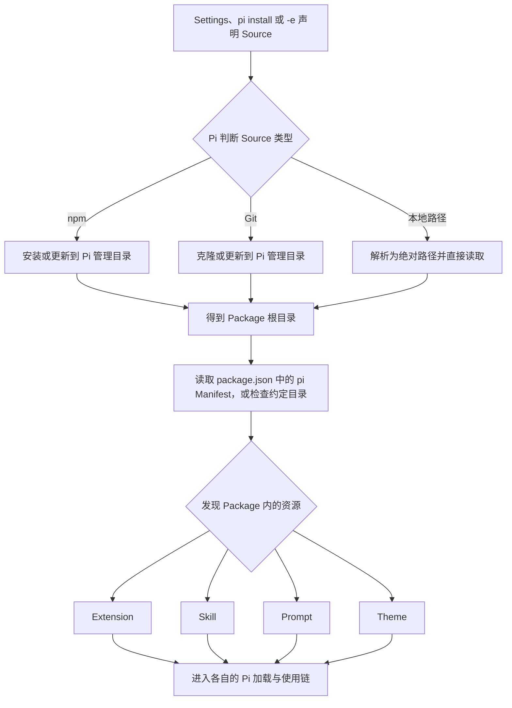

当前 6.1 本地路径 fixture 把这条抽象流程落成了一条可观察链：

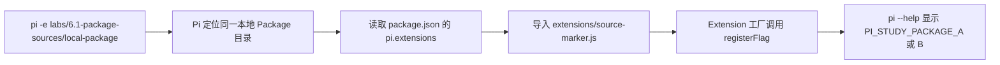

这里变化的是同一个 Package 目录中的 Extension 内容；`-e` 提供的是 Source，`package.json` 的 `pi` 字段声明资源入口，`source-marker.js` 才是被加载的具体 Resource。A/B 标记是本实验选择的可观察结果，不是所有 Pi Package 都必须注册 CLI Flag。

Package 只是资源的组织和分发边界，不是权限沙箱。Package 中的 Extension 可以执行代码，Skill 也可以引导 Model 使用工具；安装第三方 Package 前仍需审查来源和内容。

## 本地 `pi-study-workbench` 的封装边界

本仓库已有四类经过前序阶段验证的资源。6.3 的封装目标不是复制一套新源码，而是把仓库根目录作为 Package 根，用根 `package.json` 的显式 `pi` Manifest 指向现有文件。这样项目内自动发现与 Package 加载使用同一份源码，修复不需要同步两套目录。

| 资源 | 唯一源码 | Manifest 入口 |
|---|---|---|
| Extension | `.pi/extensions/pi-study-guard/` | `.pi/extensions/pi-study-guard/index.ts` |
| Skill | `.agents/skills/java-readonly-analysis/` | 整个 Skill 目录，包括 `references/` |
| Prompt Template | `.pi/prompts/java-review.md` | 该 Markdown 文件 |
| Theme | `.pi/themes/pi-study-lab.json` | 该 JSON 文件 |

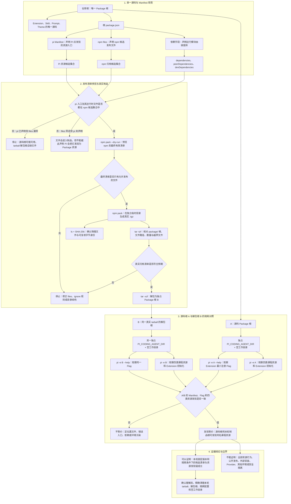

本仓库本次观测中，`files` 有 `17` 个显式路径；npm 另外自动纳入 `README.md` 和 `package.json`，所以 dry-run、真实 tarball 与解包树最终都是 `19` 个普通文件。`17 -> 19` 是这个版本和这个 Package 的实测结果，不是所有 npm Package 的固定公式。

整条链的关键不是“某条命令退出为 0”，而是两个方向同时闭合：`pi` 声明的入口及其运行时闭包确实进入真实制品；真实制品中的文件也经过 Manifest、白名单和 A/B 加载观察，能够说明为什么被交付、为什么被 Pi 发现。文件存在、Manifest 有记录和真实 Pi 已发现是三种不同证据。

这里有三张容易混淆的清单：

| 清单 | 决定什么 | 不能替代什么 |
|---|---|---|
| `pi` Manifest | Pi 从 Package 根发现哪些资源 | 不决定 npm tarball 实际包含哪些文件 |
| npm `files` | `npm pack`/`npm publish` 候选制品包含哪些文件 | 不表示这些文件都会被 Pi 加载 |
| 依赖字段 | Extension 的导入在开发期或运行期由谁提供 | 不证明依赖安全，也不决定资源是否启用 |

本 Package 的发布清单只应包含四类生产资源及其完整运行时闭包：Extension 入口实际导入的模块、Skill 的 `SKILL.md` 与 `references/`、Prompt、Theme，以及必要的 Package 说明和许可证。项目 Settings、测试、仅测试使用的 fixture、学习实验、计划文档、Session、缓存、`node_modules` 和凭据不得进入归档。最终内容以 `npm pack --dry-run`、真实生成的 tarball 清单和解包后回归为准，不能只相信 `files` 字段。

当前 Extension 没有普通第三方运行依赖；它使用的 `@earendil-works/pi-coding-agent`、`@earendil-works/pi-tui` 和 `typebox` 按 Pi `0.84.2` 随包文档属于宿主提供的 `peerDependencies`，不能另打包一份。TypeScript、Node 类型和测试工具属于 `devDependencies`。初始课程制品使用语义化版本 `0.1.0`；仓库没有许可证文件时应显式标为 `UNLICENSED`，不能把缺少许可证误写成允许公开复用。若以后选择开源许可证，必须单独补许可证文件并重新审查发布清单。

源码目录与归档解包目录的等价实验必须从干净隔离工作目录运行，避免仓库自身的 `.pi/`、`.agents/` 自动发现与临时 Package Source 同时命中，造成重复资源或错误归因。加载等价只证明两边发现了同一组资源并命中指定行为，不会重新证明阶段 4-5 的全部正确性、安全性或权限隔离。

### 源码与归档等价实验

真实场景是：仓库根作为本地 Source 时四类资源可用，但正式交付的是 npm tarball。需要证明实际归档没有漏文件、夹带文件或改变资源发现结果。

| 实验项 | 固定合同 |
|---|---|
| 待验证结论 | 仓库根源码与同一 tarball 的解包目录能发现同一组课程资源；tarball 只包含允许发布的文件 |
| 固定条件 | 同一 Pi `0.84.2`、Node/npm 版本、资源内容、观察脚本、禁用 Session/Model/外网的参数，以及两套等价的隔离配置 |
| 唯一变量 | A 的 Package Source 指向仓库根；B 指向本轮 tarball 的解包根目录 |
| A/B 共同预期 | Extension Flag 与 `/study-inspect` Command、`skill:java-readonly-analysis`、`java-review` Prompt 和 `pi-study-lab` Theme 各命中一次，无资源诊断 |
| 制品预期 | dry-run 与真实 tarball 清单一致；不含 Settings、测试、仅测试 fixture、学习实验、计划、Session、缓存、`node_modules` 或凭据；记录 tarball SHA-256 |
| 通过标准 | 发布清单检查、A/B 四类资源集合、Extension 最小注册行为和退出状态全部一致；任一缺失、重复、诊断或越界文件都失败 |

实验顺序固定为：先校验 Manifest 与依赖字段，再执行 `npm pack --dry-run` 和离线 `npm publish --dry-run`，随后生成真实 tarball、检查文件清单与 SHA-256，最后从两个干净隔离目录运行 A/B 资源发现。`publish --dry-run` 只演练打包与发布前检查，不向 Registry 发布；真实发布、Git 推送和第三方安装均不在本实验内。

命令退出为 0 不能单独证明等价。必须同时看到归档清单、四类资源的名称与来源、无诊断和两边一致的 Extension 最小注册结果。该实验不重新验收阶段 4-5 的完整功能，不证明任意新环境、第三方依赖、真实 Registry、安装/卸载、更新语义或安全隔离；Package 管理行为留给 6.4。

## 三类来源

| 来源 | Package 身份 | 用户级解析位置 | 项目级解析位置 | 内容变化方式 |
|---|---|---|---|---|
| npm | 包名，不包含版本 | `~/.pi/agent/npm/` | `.pi/npm/` | 安装或更新到满足 Source 的版本 |
| Git | 规范化后的 `host/path`，不包含协议与 ref | `~/.pi/agent/git/<host>/<path>` | `.pi/git/<host>/<path>` | 获取并对齐配置的分支、Tag 或 Commit |
| 本地路径 | 解析后的绝对路径 | 原路径 | 原路径 | 直接读取原地文件变化，不复制、不下载 |

SSH、HTTPS 等不同写法经规范化后可能归为同一个 Git identity。同一个 Package 同时出现在用户和项目 Settings 时，项目条目通常优先；例外是项目条目设置 `autoload: false` 时，它作为用户条目的 delta 应用，两条记录都会保留，不是简单替换。

Settings 中的本地相对路径按 Settings 所在配置目录解析：用户级以 Pi agent 目录为基准，项目级以项目 `.pi/` 目录为基准。

### CLI `-e` 临时作用域

`-e` 把 Source 作为当前 Pi 运行的 temporary scope 输入，不写入用户或项目 Settings。CLI 会先把本地相对路径按启动 `cwd` 解析为绝对路径；本地 Source 随后直接读取该文件或目录。npm 与 Git Source 则安装或克隆到 Pi agent 目录下的 `tmp/extensions/` 管理目录。

temporary scope 描述配置与本次加载的作用域，不承诺进程退出后立即删除磁盘内容。Pi `0.84.2` 的 Git 实现会在刷新失败时保留已有 temporary checkout，因此“不写 Settings”不能推出“缓存必然删除”。临时加载也不是沙箱，来源中的 Extension 仍在 Pi 进程权限下运行。

## npm 精确版本与版本范围

同一个 npm 包可以发布多个版本。Source 不只决定包名，还决定 Pi 在安装或显式更新时允许 npm 选择哪些版本。

| Source | Pi `0.84.2` 解析 | 显式 Package 更新 | 固定强度 |
|---|---|---|---|
| `npm:pkg@1.0.0` | 合法单一 SemVer，`pinned=true` | 跳过版本更新 | 固定到精确版本号 |
| `npm:pkg@^1.0.0` | 范围 `>=1.0.0 <2.0.0-0`，`pinned=false` | 选择范围内最高可用版本 | 允许兼容的 `1.x` 变化 |
| `npm:pkg` | 未指定版本，`pinned=false` | 按 npm 当前默认目标重新解析 | 跟随当前默认发布目标 |
| `npm:pkg@latest` 或其他 Tag | 不是单一 SemVer，`pinned=false` | 重新解析该 Tag | Tag 可以被发布者移动 |

随包文档把“带版本的 spec”概括为 pinned；按当前实现需要进一步区分：只有 `semver.valid()` 接受的单一版本才是 pinned，版本范围和 Tag 虽然也写在 `@` 后面，却仍是可重新解析的目标。

版本范围允许将来更新，不表示已安装内容会在每次启动时自动变化。Pi 在管理目录中保存的是一个具体版本；只要现有版本仍满足范围，普通资源解析会继续使用它。执行 `pi update --extensions`、重新安装或在缺少安装内容的新环境中解析时，才会重新选择目标版本。

Pi 启动页中的 Package 资源标签可能继续显示 Settings 里的 Source，例如 `pkg@^1.0.0`；它表达“按什么规则选择版本”，不是“当前磁盘实际安装了哪个具体版本”。判断更新结果必须另外读取 Pi 受管理安装目录中的 Package Manifest：Source 范围与已安装具体版本需要作为两份证据组合解释。

精确 npm 版本固定的是顶层 Package 的版本选择，不等于完整供应链可复现。Registry 可达性和可信度、tarball 完整性、传递依赖范围、生命周期脚本、npm/Node/Pi 版本及操作系统仍需分别固定和验证。

## Git 分支与 Commit

Git 分支是指向某个 Commit 的可移动名称，Commit SHA 是一份固定历史快照。

假设 `main` 最初指向提交 A，Package 内容为 `PACKAGE_A`。开发者提交新内容后产生提交 B，`main` 随即前进到 B；提交 A 本身没有变化。

| 配置目标 | 远端新增 B 后 | 适用场景 |
|---|---|---|
| Git 分支 `main` | 更新并重新对齐该分支后可能从 A 变成 B | 跟随持续开发 |
| Git Commit A 的完整 SHA | 仓库出现 B 后仍保持 A | 团队复现、测试基线、正式交付 |

因此，“Source 字符串写了 `@main`”只固定了分支名称，没有固定分支背后的内容。分支可以前进、回退或被强制改写。只有 Commit SHA 直接标识不可变的 Git 对象。

Pi `0.84.2` 会把带 `@ref` 的 Git Source 视为已指定 ref，但这里的“已指定”不能等同于“内容不可变”：如果 ref 是分支或被重指向的 Tag，更新时重新解析该 ref 仍可能得到另一个 Commit。正式复现应记录完整 Commit SHA，并核对实际 checkout 的 `HEAD`。

还要把 Git ref 的可移动性与 Pi 的 temporary 缓存分开。Pi `0.84.2` 将 `-e` 中带 `@main` 的 Git Source 标记为 `pinned=true`；同一个 temporary 安装目录已经存在时，新 Pi 进程不会自动刷新这个 checkout。因此远端 `main` 已从 A 移到 B，不代表复用同一 `PI_CODING_AGENT_DIR` 的下一次 `-e @main` 必然显示 B。新隔离缓存会重新解析当前 `main`，显式安装/更新路径则要按各自命令语义验证。

当前版本还有一个解析差异：随包文档将裸 `git://` 列为可接受协议，但 `parseGitUrl()` 会把开头的 `git:` 当作 Source 前缀剥离，导致裸 `git://127.0.0.1/...` 解析失败；课程回环实验使用 `git:git://127.0.0.1/...` 才能明确表示“Git Source 前缀 + git 协议 URL”。该结论限定 Pi `0.84.2`，后续版本需要重新核对。

完整 Commit SHA 固定的是 Git 对象身份。它不保证该对象永远能从远端取得，也不固定仓库外依赖、安装脚本结果、Node/npm/Pi 版本、操作系统或运行环境，因此是源码快照固定点，不等于完整供应链可复现。

## 来源选型与固定强度

三类 Source 不是互相替代的三种写法，而是对应 Package 生命周期中的不同目标：本地路径追求修改反馈，分支和版本范围允许受控变化，Commit 和精确版本提供明确基线。

| 使用场景 | 推荐 Source | 固定到什么 | 仍会变化或缺失什么 |
|---|---|---|---|
| 个人开发调试 | 本地路径 | 只固定解析后的路径 | 路径中的文件可原地变化 |
| 团队持续联调 | Git 分支 | 只固定分支名称 | 分支可前进、回退或被强制改写 |
| 团队测试基线 | Git 完整 Commit SHA | 固定 Git 对象身份 | 远端可达性、依赖和运行环境未固定 |
| 正式版本分发 | npm 精确版本 | 固定顶层 Package 版本选择 | tarball、传递依赖、脚本和运行环境仍需核对 |
| 主动接受兼容升级 | npm 版本范围 | 固定允许选择的版本集合 | 显式更新或新环境解析出的具体版本可变化 |

一个 Package 从开发到交付可以沿同一条链逐步收紧：

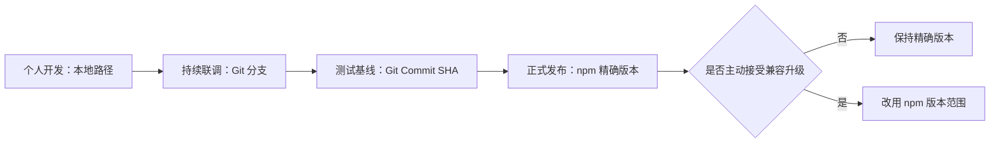

正式交付时不能只保存 Source 字符串。最小记录应同时包含 Source、实际解析位置、Git `HEAD` 或 npm 已安装版本、Package 文件清单与内容哈希，以及 Pi、Node、npm 和操作系统版本。对于 npm 精确版本，受控升级应发布新版本并在验证后主动修改 Source；精确版本不会把顶层 Package 之外的整条供应链自动锁死。

因此，固定强度的准确顺序不是简单的“本地 < Git < npm”，而是：本地路径、Git 分支、Git Tag、npm Tag、npm 版本范围都允许某一层目标继续变化；Git 完整 Commit 固定源码对象，npm 精确版本固定顶层发布版本。二者解决的层次不同，都不等于完整环境可复现。

## Package 资源筛选

Package Manifest 先确定可发现资源的最大集合，Settings 中的 Package 对象再从该集合中决定本次启用哪些资源。筛选不会卸载 Package，也不能把 Manifest 边界之外的任意文件加入加载集合。

### Settings 中的字符串简写与对象形式

在 Pi `0.84.2` 的本课程隔离实验中，刚安装且没有资源级配置时，`packages` 条目可以只保存 Source 字符串：

```json
"packages": ["npm:pi-study-workbench@^0.1.0"]
```

需要为这个 Package 保存资源筛选时，同一条目改用对象形式；`source` 仍标识同一个 Package，其他字段只描述资源选择：

```json
{
  "source": "npm:pi-study-workbench@^0.1.0",
  "extensions": []
}
```

这不是把旧 Package 替换成另一个 Package，也不是卸载。对于普通项目项，`extensions: []` 表示 Package 仍在 Settings 和受管理安装目录中，但它的 Extension 最终集合为空；Skill、Prompt 和 Theme 没有相应空数组时不受这一字段影响。该配置由后续资源解析使用，不会撤销已经在当前进程中执行过的 Extension。

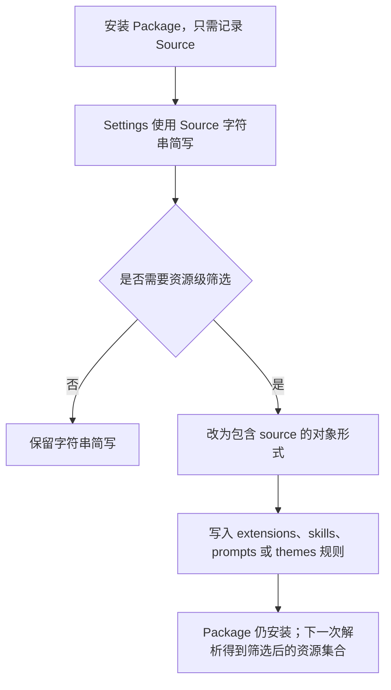

日常使用时优先选择最简单、意图最明确的写法：正常加载就省略字段，整类关闭就用空数组，只关闭一个已知资源就用 `-path`。普通 glob、`!pattern` 和 `+path` 主要用于同类资源很多、需要按目录或命名规则组合筛选的 Package，不应为了“显得精确”而堆叠规则。

| 筛选写法 | 普通 Package 对象中的含义 |
|---|---|
| 省略某个资源字段 | 加载该类型的全部 Manifest 资源 |
| `[]` | 禁用该类型的全部资源 |
| 普通 glob | 只保留匹配的资源；没有普通包含项时以全部候选为基础 |
| `!pattern` | 排除匹配资源 |
| `+path` | 从候选集合中精确加回一个资源，覆盖普通排除 |
| `-path` | 精确排除一个资源，优先于精确加回 |


可以把筛选理解为一条固定流水线。假设 Manifest 允许三个 Extension：`safe-a.ts`、`safe-b.ts`、`legacy.ts`，下面各行是在前一行基础上继续处理，而不是四套互不相关的配置：

| 处理阶段 | 示例规则 | 本阶段之后的集合 |
|---|---|---|
| 普通 glob 建立基础集合 | `./.pi/extensions/**/*.ts` | 三个候选都进入基础集合 |
| 普通排除 | `!./.pi/extensions/legacy.ts` | 只剩 `safe-a.ts`、`safe-b.ts` |
| 精确加回 | `+./.pi/extensions/legacy.ts` | `legacy.ts` 即使被普通排除也重新加入 |
| 最终精确排除 | `-./.pi/extensions/legacy.ts` | `legacy.ts` 最终仍被排除 |

`+path` 和 `-path` 都要求精确资源路径；它们不是更宽泛的 glob。`-path` 的优先级最高，因此同一路径同时被普通排除、精确加回和精确排除命中时，最终结果仍是不加载。

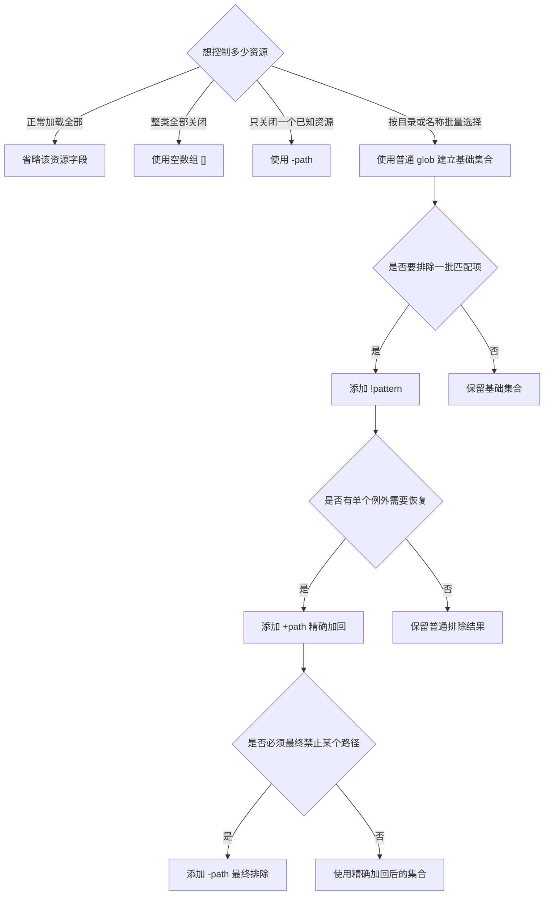

同一 Package 同时出现在用户级和项目级 Settings 时，普通项目项整体优先。项目项设置 `autoload: false` 后则作为用户项的增量覆盖：用户级结果仍是基础，项目项只修改明确匹配的资源；省略字段或空数组表示该类型不提供增量变化，不是普通模式中的“全部禁用”。增量模式下，普通 pattern 或 `+path` 启用匹配资源，`!pattern` 或 `-path` 禁用匹配资源。

Pi 不是把两级同身份 Package 的资源简单相加。当前 `0.84.2` 实现先按 Package 身份去重，再收集资源：npm 以包名、Git 以标准化仓库 host/path、本地 Source 以解析后的绝对路径判断身份；普通同身份项目项保留，用户项不再参与该 Package 在当前项目中的资源解析。因此，`pi list` 可以同时显示两级配置记录和安装路径，但实际加载只采用去重后的有效项。

官方文档和源码明确证明上述优先级与去重顺序，但没有直接说明产品设计动机。合理推断是：项目作用域比用户默认更具体，优先后可以让团队项目声明自己的资源集合，同时避免同一个 Extension、命令或 Hook 被两级重复注册；项目本地配置仍必须先通过 Project Trust。这个解释不是安全保证，项目优先也不会让 Package 代码自动变得可信。需要在用户结果上只做局部加减时，应显式使用 `autoload: false` delta，而不是依赖普通项目项回退。

普通项目项与 `autoload: false` delta 最容易混淆的地方是空数组：普通模式的 `extensions: []` 表示最终 Extension 集合为空；delta 模式的 `extensions: []` 表示项目没有对继承来的 Extension 增加任何变化，因此用户级结果保持原样。

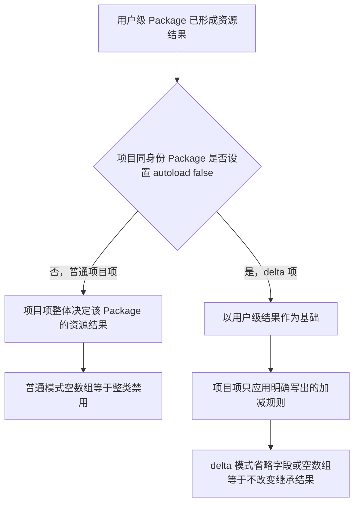

## 依赖分类与锁文件

依赖分类回答三个问题：代码在什么时候需要、由谁提供、是否随发布制品一起交付。它不是安全等级；每一类都要继续审查实际文件、版本、脚本和能力。

| 字段 | 职责 | Pi `0.84.2` 用法 | 主要审查点 |
|---|---|---|---|
| `dependencies` | 声明运行时依赖 | npm 或 Git Package 安装时由 npm 自动安装 | 直接与传递依赖的来源、版本范围、文件和 lifecycle scripts |
| `peerDependencies` | 声明应由宿主提供的兼容能力 | Pi 核心包使用 `"*"` 并且不重复打包 | 实际宿主版本是否兼容，是否错误携带另一份核心实现 |
| `bundledDependencies` | 指定随 tarball 一起交付的依赖文件 | 其他 Pi Package 同时列入 `dependencies` 与 `bundledDependencies`，资源路径从 `node_modules/` 引用 | 实际 tarball 是否包含预期版本、额外代码或脚本 |
| `devDependencies` | 支持开发、编译和测试 | 不作为使用者运行 Package 的依赖合同 | 发布制品是否缺少必要构建产物，是否误带开发工具或测试材料 |

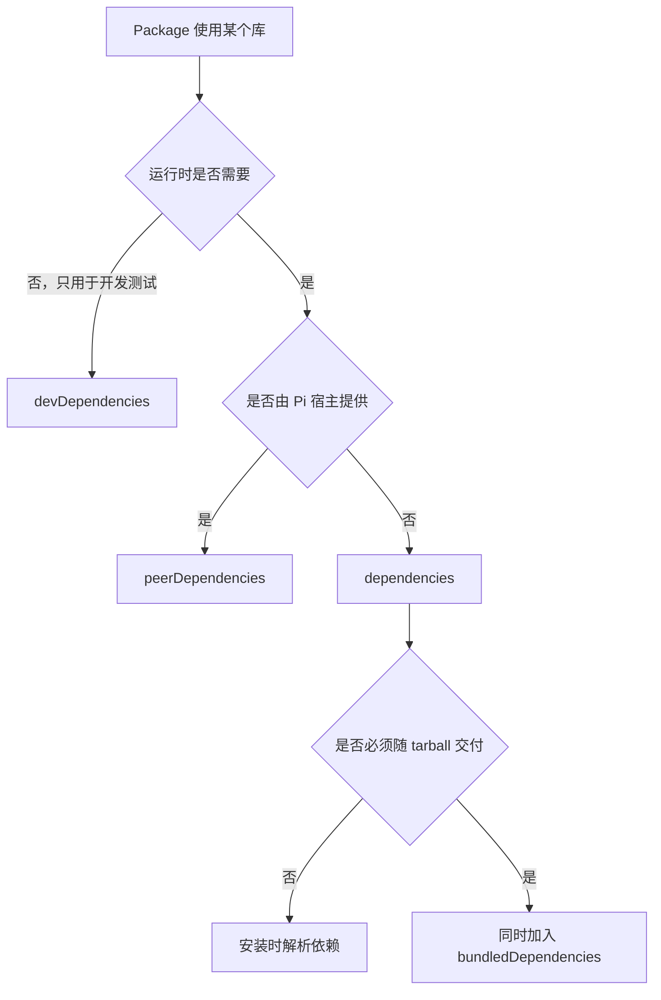

`package.json` 中的版本范围描述允许选择什么，锁文件记录某次安装实际解析出的依赖图及相关来源、完整性信息。锁文件存在不代表使用者一定采用同一依赖图，也不证明 tarball 内容、依赖代码或 lifecycle scripts 安全；正式审查还要核对实际发布清单和安装结果。

## 安装、加载、禁用与卸载

Package 安装与 Extension 加载发生在不同阶段。Pi `0.84.2` 安装 npm 或 Git Package 时会调用 `npm install`；随后在启动或资源重载时解析 Manifest，并导入当前启用的 Extension。

npm 的 `ignore-scripts` 只跳过 `preinstall`、`install`、`postinstall` 等 lifecycle scripts，不删除已经安装的 Package 文件，也不改变 Pi Manifest 或 Extension 过滤配置。因此跳过安装脚本后，Pi 仍可能在启动阶段导入 Package 中的 Extension。若某个 Extension 恰好依赖安装脚本生成的文件，它可能因产物缺失而加载失败；这是安装不完整的结果，不是可靠的 Extension 禁用或权限隔离机制。

跳过后若经审查决定放行，Package 文件无需再次下载；应在实际 npm 安装根目录中对精确目标执行 `npm rebuild`，并确保 `ignore-scripts` 已关闭。npm `11.6.2` 会在 rebuild 中补跑 `preinstall`、`install`、`postinstall` 和适用的 `prepare`，还可能重新建立可执行文件链接。直接执行单个 `postinstall` 只覆盖一个脚本，不等价于完整安装生命周期。

对于 Pi 管理的 Package，补执行前还要确认实际安装根目录、Source 和已安装版本，避免在错误依赖树或共享缓存中执行。rebuild 只处理 npm 安装产物，不会让当前 Pi 进程自动重新加载 Extension；需要由 `/reload` 或重新启动触发下一次资源解析。脚本已经产生的副作用仍不会自动回滚。

| 动作 | 改变什么 | 不保证什么 |
|---|---|---|
| 安装 Package | 取得 Package，并可能执行 npm lifecycle scripts | 不保证只写 Package 安装目录 |
| 补执行安装脚本 | 对已安装的精确目标执行 npm rebuild | 不自动重载 Extension，不保证脚本幂等或可回滚 |
| 加载 Extension | 导入代码、执行工厂并注册能力 | 不代表安装脚本此时才执行 |
| 禁用 Extension | 在下一次资源解析时把它排除出加载集合 | 不卸载 Package，不撤销既有副作用 |
| 卸载 Package | 移除配置和受管理的安装内容 | 不保证恢复 Package 目录外的改动 |
| 恢复副作用 | 显式删除额外文件、停止进程或恢复配置 | 已发出的网络请求通常无法撤回 |

控制安装期代码应使用 npm 的脚本策略；控制加载期代码应使用 Pi 的资源过滤或禁用配置。两者必须分别审查和验证。

如果 Extension 已进入当前 Pi 进程，仅修改禁用配置不会把旧实例立即从内存中移除。`pi config` 是独立的配置命令，保存设置后退出；当前交互式 Pi 需要执行 `/reload`，或者退出后重新启动，才会重新解析资源并应用禁用状态。

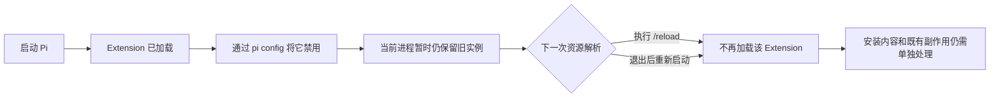

`/reload` 会为旧 Extension runtime 派发 `session_shutdown`，再重新解析和绑定资源。Extension 可以在 shutdown Handler 中尝试清理自身状态，但这只是它主动实现的行为，不是 Pi 对任意文件、后台进程、外部配置或网络请求的通用回滚保证。资源禁用、Package 卸载、缓存删除和副作用恢复必须分别验证。

### 完整移除的三层验证

“配置不存在”是指对应作用域的有效 Settings 中没有匹配的 Package Source，不是指整个 `settings.json` 文件不存在。它只影响 Pi 后续按该记录解析 Package，不能单独证明磁盘文件已删除或当前进程中的 Extension runtime 已退出。

| 目标 | 操作 | 必须单独验证 |
|---|---|---|
| 停止后续解析 | 在原安装作用域移除 Package Source，或通过资源配置禁用指定资源 | 用户级/项目级有效 Settings 中的 Source 或筛选结果 |
| 移除当前 runtime | 在交互式 Pi 中执行 `/reload`，或者退出后启动新进程 | 新一轮资源发现不再包含目标 Extension |
| 清理磁盘内容 | npm/Git Source 由 `pi remove` 清理 Pi 受管理内容；本地 Source 的原目录需另行处理 | 精确安装路径或原目录的实际存在状态 |
| 恢复既有副作用 | 按 Package 实际行为清理额外文件、进程或外部配置 | Package 管理目录之外的每一项副作用 |

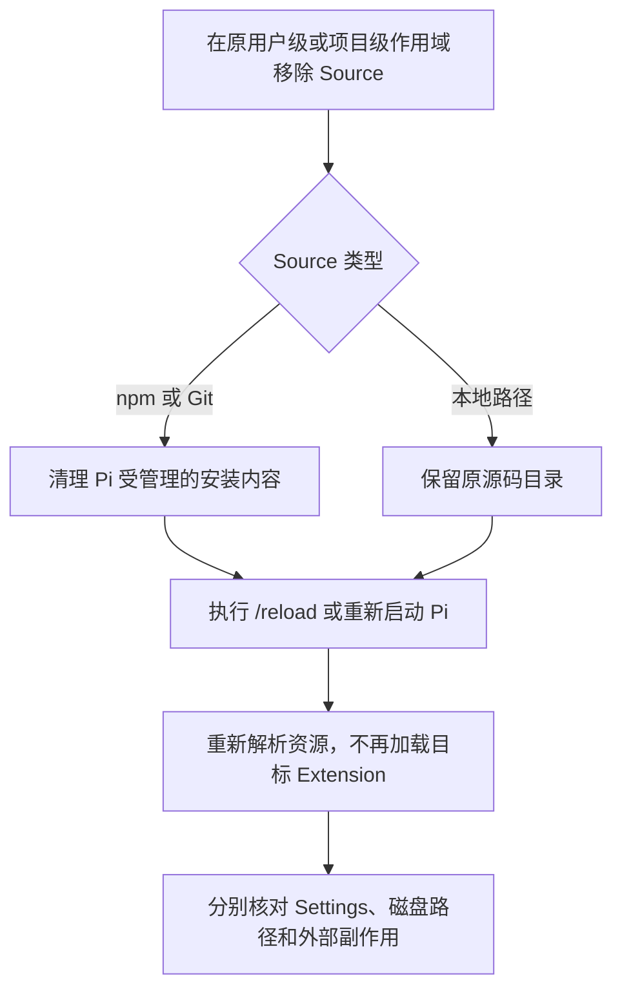

本地 Source 只是指向原路径，因此 `pi remove` 不应删除原源码。npm/Git Source 的正常移除会尝试清理受管理内容，但仍要检查实际路径和退出状态；中途失败、其他缓存及 Package 目录外副作用不能从成功提示推断。`/reload` 只重建当前资源 runtime，不负责删除 Settings 或 Package 文件。

## 安装前静态审查

陌生 Package 在执行任何安装或加载代码前，按以下顺序审查。仓库源码、发布 tarball 和最终安装树可能不同，不能相互替代。

| 顺序 | 检查对象 | 需要确认的证据 |
|---:|---|---|
| 1 | Source 与身份 | 来源类型、精确版本或 Git Commit、实际解析目标 |
| 2 | 发布文件清单 | tarball 中的全部文件、异常生成物、可执行文件和内容哈希 |
| 3 | Pi Manifest 与约定目录 | 显式资源入口，以及 `extensions/`、`skills/`、`prompts/`、`themes/` 中可能被自动发现的内容 |
| 4 | 依赖图 | 四类依赖、锁文件中的实际版本与来源、传递依赖及 bundled 文件 |
| 5 | lifecycle scripts | `preinstall`、`install`、`postinstall`、`prepare` 及其文件、进程、网络和环境变量访问 |
| 6 | Extension 入口 | 导入与工厂初始化代码、动态执行、外部命令、文件读写、网络请求和注册能力 |

静态审查只能识别当前制品中可见的入口、依赖、脚本和能力，不能证明运行正确、安全、幂等或可回滚。结论不足时，应拒绝安装或进入隔离动态实验；不能用“代码看起来正常”替代运行证据和系统级隔离。

## 三种模型接入方式怎么选

本节基于本机 Pi `0.84.2` 的随包 `providers.md`、`models.md`、`custom-provider.md` 及必要运行时源码，解决一个实际问题：接入条件变化后，应继续使用内置 Provider、补充 `models.json`，还是编写 Custom Provider Extension。

先固定同一个任务：用户让 Pi 审查一份 Java 订单代码。三个场景的业务任务没有变化，变化的只是 Pi 如何找到并调用 Model。

### 场景一：只换 Pi 已经认识的 Model

用户当前已经可以使用 `openai/gpt-5.6-sol`。这次只想换成 Pi 模型目录中已有的另一个 Model，再执行同一份代码审查。服务入口、认证方式和通信协议都没有改变。

这类似继续使用同一家外卖平台、同一个账号和同一家餐厅，只把菜单上的 A 套餐换成 B 套餐。Pi 不需要增加地址或翻译规则，只需选择另一个已有 Model。

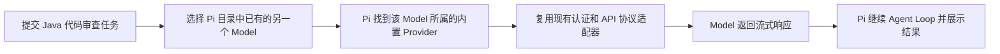

这里真正改变的只有 Model。选择入口是内置 Provider 已经提供的模型目录，不需要 `models.json`，也不需要 Extension。

### 场景二：声明式 Provider 配置，换成 Pi 认识协议的新地址

公司规定所有 AI 请求必须经过内部网关。网关地址和 Model ID 不在 Pi 的内置目录中，但它明确兼容 OpenAI Responses、OpenAI Chat Completions、Anthropic Messages 或 Google Generative AI 中的一种。

这类似公司食堂搬到了新地址，但仍使用 Pi 已经看得懂的点菜单。用户只需补一张地址和菜单说明，不需要重新培训一名服务员。`models.json` 就承担这张说明的职责：声明 Provider 地址、API 类型和 Model 元数据，Pi 继续复用已有的请求编码与流式响应解析器。

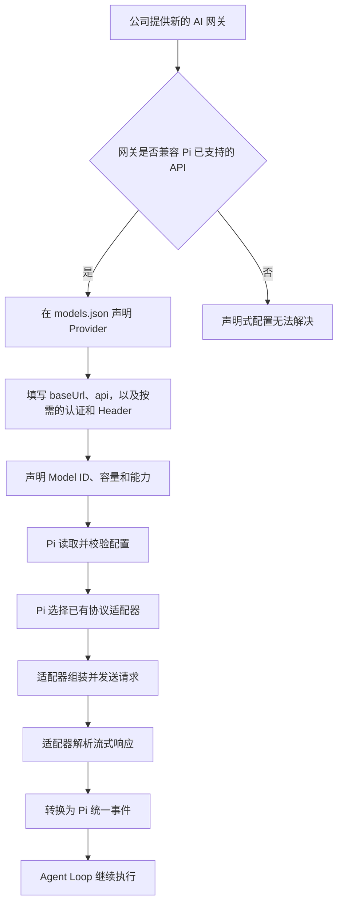

这里的 Custom Model 不是训练、微调或部署一个新模型，而是用配置告诉 Pi：Model 在哪里、叫什么、使用哪种 Pi 已支持的通信格式。

### 场景三：Custom Provider Extension，现有配置表达不了公司的规矩

另一家公司也提供内部 AI，但必须先完成企业 SSO；Token 过期后要刷新；每个员工的 Model 目录需要动态查询；请求或流式响应也不是 Pi 已支持的格式。

这已经不是补地址能解决的问题。Pi 需要一段真正会执行的接入逻辑：注册企业登录与刷新规则，在合适的时机发现 Model，并在请求时解析凭据、转换请求和解析响应。Extension 通过 `registerProvider()` 注册 Custom Provider，再把公司服务的结果转换为 Pi 能继续处理的统一事件。

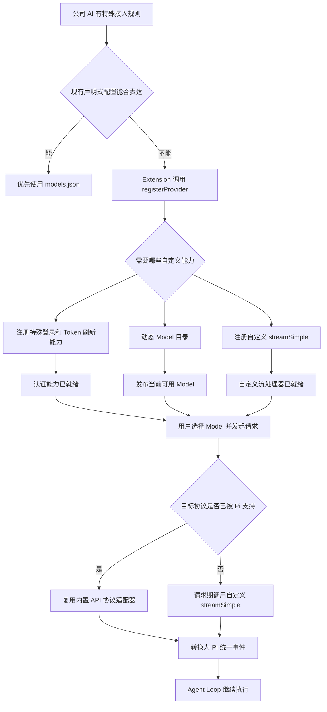

用 Java 类比，`models.json` 接近增加一组客户端配置；Custom Provider 则接近实现并注册一套新的 SPI 或六边形架构 Adapter。Custom Provider 不等于一定要自写流协议：它也可以只负责现有机制无法表达的认证或动态目录，再复用已有 API 适配器。

### 最小选型顺序

| 当前变化 | 首选入口 | 原因 |
|---|---|---|
| 目标 Model、认证和协议都已被 Pi 支持 | 内置 Provider | 只需选择已有 Model，不增加配置或执行代码 |
| 地址或 Model 是新的，但服务兼容 Pi 已支持的 API，声明式配置足够 | `models.json` Custom Model | 复用已有请求编码和流解析，只补连接与 Model 元数据 |
| 登录、刷新、动态目录或协议需要现有机制无法表达的运行逻辑 | Custom Provider Extension | 需要执行代码并注册新的认证、目录或流处理能力 |

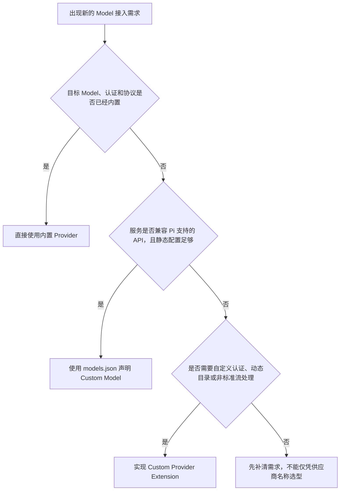

能力存在交集时，优先选择能满足需求的最小入口。Pi `0.84.2` 的 `models.json` 支持 `openai-completions`、`openai-responses`、`anthropic-messages` 和 `google-generative-ai` 四类 API，也能只覆盖内置 Provider 的地址或 Header；Extension 同样可以覆盖地址，但仅为静态地址变化编写可执行 Extension 通常没有必要。

企业 OAuth 也不自动等于 Custom Provider。若 Pi 已内置该登录方式，应继续使用内置 Provider；当前 `models.json` 还支持 `radius` 这一声明式 OAuth 特例。只有现有认证链无法表达新的登录、刷新或取值逻辑时，才升级到 Extension。

本节只完成选型地图，不展开认证来源优先级、`models.json` 字段细节或 Custom Provider 公共接口，它们分别属于 6.6、6.7 和 6.8。Model 出现在目录中只证明配置或注册结果被发现，不证明凭据有效、账号获得授权、请求成功、不会计费或达到生产可用性。Custom Provider 是与 Pi 同进程执行的代码，不是权限沙箱。

## 认证值到底从哪里来

继续使用同一份 Java 代码审查任务。公司已经把内部 Model `corp-coder` 接入 Pi，网关地址和协议也没有问题，但真正发送代码前，门卫还要核对两样东西：一张证明“你是谁”的工作证，以及信封上的 `X-Tenant-ID` 租户标签。

Pi 面前可能同时放着几张工作证：本次启动临时递入的 Key、本机认证存储中的 Key 或 OAuth Token、Provider 配置中的取值说明，以及内置 Provider 约定的环境变量。重点不是“把每张证都试到成功”，而是先按优先级进入对应的解析分支。类型不匹配、OAuth 刷新失败和声明式 Key 解析失败不会静默换身份；存储 API Key 解析为空时是否继续查 ambient 认证，则取决于该 Provider 是否带有内置认证器。

### 先选工作证来源

Pi `0.84.2` 的随包文档与实际请求源码在最后两层顺序上不一致，必须保留这条版本事实。

| 证据 | 写出或实现的顺序 |
|---|---|
| 随包 `providers.md` | CLI `--api-key` -> `auth.json` -> 内置环境变量 -> `models.json` Custom Provider Key |
| 当前请求源码 | CLI `--api-key` -> `auth.json` -> Extension `apiKey` -> `models.json` Provider `apiKey` -> 内置 Provider 的环境变量或 ambient 认证 |

CLI Key 会先写入只存在于当前进程的运行时凭据覆盖层，因此遮住同一 Provider 的 `auth.json` 记录。没有运行时覆盖时，认证存储中的记录先被读取；记录类型与 Provider 不匹配或 OAuth 刷新失败时，请求停止，不会继续尝试后面的配置来源。存储的 API Key 命令或环境插值若解析为空，带内置认证器的 Provider 可能在该存储分支内部继续查 ambient 环境变量；它不会转去尝试 Extension 或 `models.json` 的 Key。只有完全没有存储记录时，组合后的 Provider 才解析 Extension 或 `models.json` 声明的 `apiKey`；声明存在但解析失败会明确报错，二者都没声明时才调用内置 Provider 自带的环境变量、云配置文件或其他 ambient 认证逻辑。

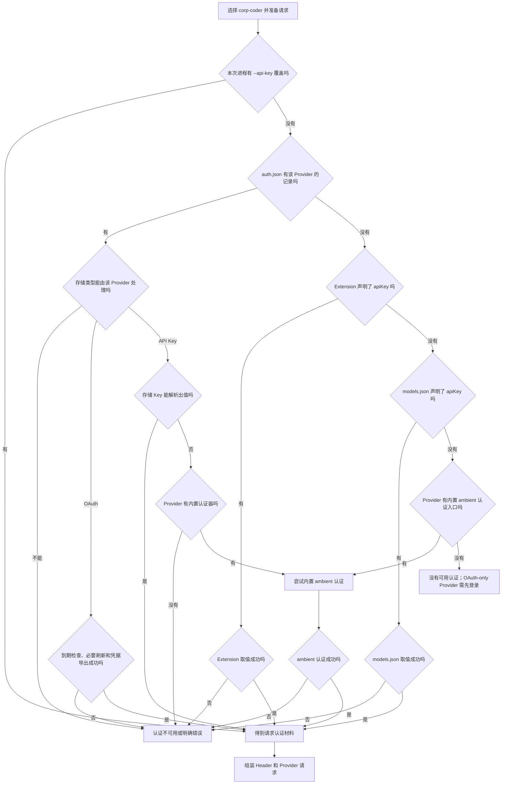

排错当前 `0.84.2` 时，应以实际请求源码解释运行行为，同时把文档顺序记为上游说明差异；不能把这个差异外推到未来版本。这里还有一个容易混淆的点：`models.json` 的 `apiKey: "$CORP_AI_KEY"` 属于“先选中 Provider 配置，再从环境中取值”，不等于“内置 Provider 自动寻找标准环境变量”这一来源层。

### 再翻译工作证上的文字

选中来源后，Pi 才解释其中的值。`$CORP_AI_KEY` 表示读取名为 `CORP_AI_KEY` 的环境变量；`${CORP}_AI_KEY` 只把花括号中的 `CORP` 当变量，后半段是普通文字；没有 `$` 的 `CORP_AI_KEY` 就是字面值，不会自动查环境变量。`$$` 和 `$!` 分别转义为字面量 `$` 和 `!`。

以 `!` 开头的值不是特殊格式的 Key，而是本地 Shell 命令入口。`auth.json` 与 Provider 声明层的执行时机和失败行为不同，不能合并成一条普遍规律。

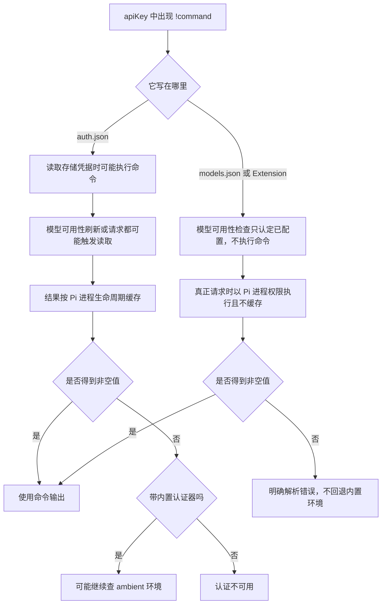

因此，`auth.json` 中的 `!command` 可能在凭据读取或模型可用性刷新阶段执行，结果按 Pi 进程生命周期缓存；失败后的 ambient 例外只适用于带内置 API Key 认证器的 Provider。`models.json` 或 Extension 声明的 `apiKey`/Header 命令则在真正请求时执行，不使用这份进程缓存，也没有 Pi 内建的 TTL、旧值复用或失败恢复；其中 `apiKey: "!command"` 在模型可用性检查中只被视为“已经配置”，不会提前执行。

`auth.json` 中 Provider 专属的 `env` 会先于进程环境变量参与该 Provider 的 Key、Header 和其他配置取值，但不会修改整个 Shell。`headers` 是信封上的附加字段，可以承载租户、路由或服务要求的认证信息；它和 `apiKey` 使用相同的取值语法。`authHeader: true` 表示额外生成 `Authorization: Bearer <apiKey>`，而最终请求显式提供的 `Authorization` Header 会覆盖自动生成值。标准 API 最终如何携带 Key 仍由对应适配器决定，不能把所有 API Key 都等同为 Bearer Header。

### OAuth 是会续期的电子工作证

API Key 主要解决“从哪里取一个值”；OAuth 还多出登录、Access Token、Refresh Token、到期判断和刷新。用户先通过 `/login` 主动完成 Provider 提供的交互，Pi 再把 OAuth 凭据存入认证存储。它不是 Extension 注册后必然自动打开浏览器，也不是每次启动都先刷新。

Pi `0.84.2` 的实际请求路径会在 Access Token 剩余不超过五分钟时进入带锁刷新：锁内再次检查，必要时用十五秒超时调用 Provider 刷新逻辑，并在释放锁前保存轮换后的凭据。刷新失败会成为明确认证错误，不会改用环境变量冒充同一用户。Model 目录刷新是另一条路径，它只在 Token 已经过期时刷新，不能与请求前的五分钟窗口混为一谈。

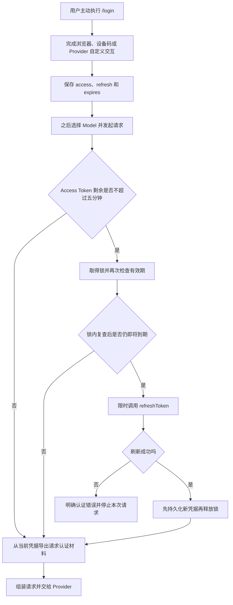

企业 OAuth 仍不自动等于 Custom Provider：内置 Provider 已支持的登录直接复用；`models.json` 当前还有 `oauth: "radius"` 这一声明式特例。只有现有机制无法表达公司的登录、刷新或取值链时，才由 Extension 注册 OAuth 实现。

本节没有读取现有 `auth.json` 内容，没有执行任何认证取值命令，没有启动浏览器登录、交换 Token 或调用 Provider。静态证据只能证明当前版本的来源选择、取值和刷新代码路径；“配置被发现”“值成功解析”“Header 已组装”“Provider 接受认证”“Model 成功响应”是五层不同证据。

## Custom Model 如何从说明书变成一次请求

继续审查同一份 Java 订单代码。公司这次给出一张内部 AI 网关说明书：大厅地址是脱敏的 `https://corp-ai.example.invalid/v1`，使用 OpenAI Responses 协议；大厅里有一个窗口，API 识别号是 `corp-coder-v2`，人看到的名称是“Corp Coder V2”，声称支持文本和图片、二十万 Token 上下文、三万二千 Token 最大输出以及推理模式。

Pi 不会因为这张说明书存在就自动认识服务。`models.json` 的职责是把外部说明翻译为两层内部对象：Provider 说明“去哪里、说哪种协议、怎样带认证”，Model 说明“具体调用哪个 ID、能接收什么、容量和能力元数据是什么”。它是通讯录和请求翻译规则，不是模型部署，也不是连通性证明。

| 说明书内容 | Pi 中的字段 | 大白话职责 |
|---|---|---|
| 公司 AI 大厅 | Provider ID，例如 `corp-ai` | Pi 内部命名空间；与 Model ID 组成选择身份 |
| 大厅地址 | `baseUrl` | 请求实际发往哪里 |
| OpenAI Responses | `api` | 选择哪一套请求编码和流解析适配器 |
| 工作证与租户标签 | `apiKey`、`oauth`、`headers`、`authHeader` | 认证和请求信封；解析边界见 6.6 |
| 窗口清单 | `models` | 新增或按 ID 替换 Model |
| 已有窗口的修改单 | `modelOverrides` | 窄范围修改内置或 Extension Model |
| `corp-coder-v2` | Model `id` | Pi 主显示的 ID，也是发送给上游 API 的 Model ID |
| “Corp Coder V2” | `name` | 次级显示和匹配别名，不替代主 ID |
| 输入、容量、推理和价格 | `input`、`contextWindow`、`maxTokens`、`reasoning`、`thinkingLevelMap`、`cost` | Pi 如何规划和展示这个 Model 的能力 |
| 方言和额外参数 | `compat`、`samplingParams` | 修正请求格式；OpenAI-compatible 请求中额外采样键会覆盖 Pi 同名字段 |

### 第一段：把文件变成可选 Model

每次打开 `/model`，Pi 会先立即显示当前可用快照，再在后台重新读取 `models.json` 并更新列表，所以编辑后不要求重启，但刷新完成前短暂看到的可能仍是旧目录。读取过程先去注释、解析 JSON、校验整个 Schema，再把配置冻结并与内置 Provider、Extension 层组合。无效 JSON 或 Schema 不会“尽量加载正确的半份”：当前加载结果是空的 Custom Provider 配置并附带诊断。

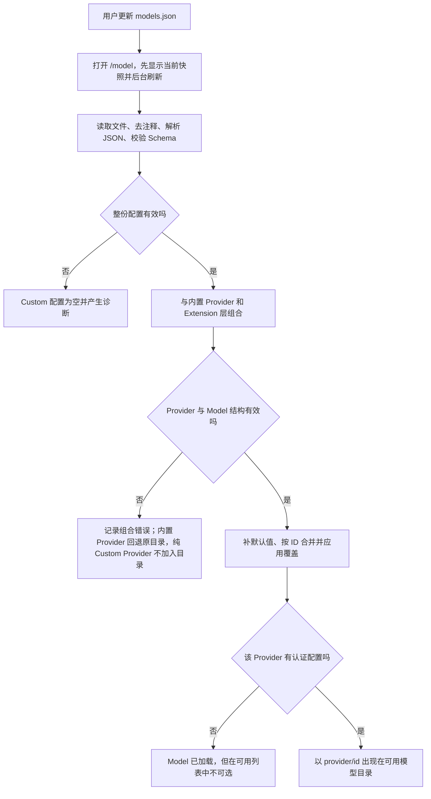

新建非内置 Provider 并定义 `models` 时必须有 `baseUrl`，并在 Provider 或 Model 层提供 `api`。文档声明式入口支持 `openai-completions`、`openai-responses`、`anthropic-messages` 和 `google-generative-ai` 四类 API；应按网关真实协议选择，不能按模型品牌猜。当前 Schema 只校验 `api` 是非空字符串，因此写入未知值可能通过文件校验，直到请求路由时才因没有适配器失败。

Model 只有 `id` 必填；其余省略时，Pi `0.84.2` 会使用以下本地默认值：`name=id`、`reasoning=false`、`input=[text]`、`contextWindow=128000`、`maxTokens=16384`、四类 `cost` 全为零。它们都不是服务器探测结果：

- `input` 声明图片能力，不证明网关真的接受图片。
- `contextWindow` 影响 Pi 的上下文估算与压缩边界，填大不能扩大后端容量，填小会让 Pi 更早压缩。
- `maxTokens` 是配置的最大输出上限，不是输入加输出的总上下文；实际请求还会按上下文窗口、估算输入和 4096 Token 安全余量继续压低，最少保留 1 Token。
- `cost=0` 只让 Pi 的费率元数据显示为零，不证明 Provider 免费或不会出账单。
- `reasoning=true` 只暴露推理能力声明；实际参数还受 `thinkingLevelMap` 和 `compat` 影响。

Pi `0.84.2` 还有两处文档与源码差异：随包 Model 字段表没有列出 Model 级 `baseUrl` 和 `headers`，但当前 Schema、组合和请求源码实际支持；随包行为说明把 Custom Model 描述为在 `modelOverrides` 后合并，但当前源码对名称、容量、费用、推理、采样和 `compat` 等非 Header 字段，是先按 ID upsert Custom Model、再组合 Extension/OAuth 目录，最后应用 `models.json` 的 `modelOverrides`。Header 不走这条覆盖函数，而在请求期按 `modelOverrides.headers`、`models[].headers`、Extension Model Header 的顺序合并，后面的同名键覆盖前面。排错本版本时以源码行为为准，不外推到未来版本。

窄改内置 Model 时优先使用 `modelOverrides`，因为只写 Provider `baseUrl` 会保留内置模型目录，而在 `models` 中用同一 ID 重新定义会重建该 Model；未显式写出的能力、费用和容量字段会落到 Custom Model 默认值，并不自动继承全部内置元数据。未知的 `modelOverrides` ID 会被忽略。

交互式 `/model` 以认证过滤后的可用快照供用户选择；CLI `--model` 则会搜索完整目录，以便同一条启动命令再通过 `--api-key` 完成首次认证。CLI 在已知 Provider 下找不到指定 Model ID 时，还可能复制该 Provider 的默认元数据生成一个临时 Model 并给出警告，而不是立即报“模型不存在”。因此日常配置和排错应优先写完整的 `provider/id`，并同时观察警告和认证状态。

### 第二段：把内部 Model 变成协议请求

用户选择的是 `corp-ai/corp-coder-v2`：前半段帮助 Pi 找 Provider，后半段既标识内部 Model，也作为 Model ID 交给上游。真正请求时，Runtime 先解析认证和 Provider/Model Header，再按 Model 的 `api` 选择内置协议适配器。适配器负责把 Agent 的消息、Tool 定义、推理档位和输出限制编码为目标协议，并把返回的数据流转换为 Pi 统一事件。

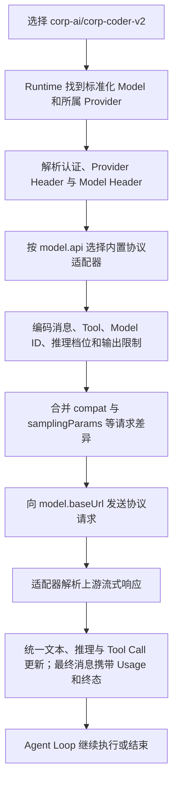

这里最重要的分工是：`models.json` 提供元数据和选择哪个现成翻译器，协议适配器才真正序列化请求和解释响应。`compat` 是“方言修正”，只应根据网关文档或明确错误设置；`samplingParams` 在 OpenAI-compatible API 中会逐键进入请求体并覆盖 Pi 的同名请求字段，不应同时在多个地方维护同一采样参数。

### 错误发生在哪一层

```mermaid
flowchart TD
    A["Custom Model 没有按预期工作"] --> B{"在 /model 可用列表中能看到吗"}
    B -->|不能| C["先查 JSON/Schema 诊断、Provider 组合错误和认证存在性"]
    B -->|能| D{"请求是否在发送前失败"}
    D -->|是| E["查 Key/Header 解析、未知 api 适配器和本地序列化"]
    D -->|否| F{"服务是否返回 HTTP 或协议错误"}
    F -->|是| G["查 baseUrl、真实 Model ID、认证、请求协议和 compat"]
    F -->|否| H{"流开始后是否中断或事件异常"}
    H -->|是| I["查上游流格式、Tool/推理字段、解析兼容和网络中断"]
    H -->|否| J["本次响应链完成；仍不证明价格、质量或生产可用性"]
```

因此，Model 出现在 `/model` 只证明配置组合和认证存在性检查通过；它不证明取值命令成功、端点可达、上游接受 Model ID、图片/推理声明真实、流格式兼容或费用元数据正确。一次响应成功也只证明这一条请求链完成，不能外推为限流、重试、计费准确、质量或生产稳定性。

本节只读取 Pi `0.84.2` 随包文档、Schema 和必要请求源码；没有读取或创建用户 `models.json`，没有读取凭据、执行 `!command`、启动 Mock、发送网络请求或调用 Provider。

## Custom Provider 是一份运行时合同

### 先只记住翻译员主线

用户让 Pi 审查 Java 代码，公司私有 AI 既可能使用 Pi 已支持的协议，也可能只说公司自己的“语言”。Custom Provider 是两者之间一名会执行工作的总机适配员：它可以只处理特殊登录或动态目录；遇到非标准协议时，才亲自承担翻译。

```mermaid
flowchart TD
    A["用户把 Java 审查任务交给 Pi"] --> B["Pi 形成统一 Model 请求"]
    B --> C["Custom Provider 提供认证、Model 目录和处理入口"]
    C --> D{"公司协议是否已被 Pi 支持"}
    D -->|是| E["交给内置 API Adapter 翻译"]
    D -->|否| F["由自定义 streamSimple 翻译"]
    E --> G["公司私有 AI 处理并返回数据流"]
    F --> G
    G --> H["同一路径解析为 Pi 统一事件"]
    H --> I["Pi 展示答案或继续执行 Tool"]
```

第一遍只记三种可能职责，不是每个 Custom Provider 都要全部自己实现：

1. 处理声明式配置表达不了的登录或认证。
2. 动态告诉 Pi 当前有哪些 Model 可以使用。
3. 仅在协议不受支持时，把请求和回复双向翻译。

若公司服务已经兼容 Pi 支持的 API，且登录和目录都能由声明式配置表达，只需 `models.json` 填地址和说明。只有登录、目录或协议需要额外执行逻辑时，才使用 Custom Provider。

### 翻译员为什么必须先注册

Extension 文件存在，不等于 Pi 已经知道该把 `corp-ai` 请求交给谁。`registerProvider()` 相当于翻译员到总机报到：登记 Provider ID、可用 Model 和处理请求的入口；用户选择这个 Provider 下的 Model 后，Pi 才能按登记关系转发。

```mermaid
flowchart TD
    A["Extension 被加载"] --> B["翻译员调用 registerProvider 报到"]
    B --> C["Pi 登记 corp-ai、Model 目录和组合后的 Provider 入口"]
    C --> D["用户选择 corp-ai 下的 Model"]
    D --> E["Pi 把请求路由给组合后的 Provider"]
    E --> F{"协议是否已被 Pi 支持"}
    F -->|是| G["复用内置 API Adapter"]
    F -->|否| H["请求期调用自定义 streamSimple"]
    G --> I["完成请求与回复转换"]
    H --> I
    I --> J{"Provider 是否撤下"}
    J -->|是| K["unregisterProvider 删除登记并恢复其余 Provider"]
```

对应关系只有三条：`registerProvider` 是报到，内置 Adapter 或非标准协议下的 `streamSimple` 负责实时翻译，`unregisterProvider` 是撤下登记。下面再逐层展开动态目录、认证、流终态和恢复边界。

### 翻译员怎样告诉 Pi 当前有哪些 Model

Provider 像公司 AI 的窗口管理员。它先维护一份“公司总窗口名单”，再根据当前员工的认证和权限，筛出 `/model` 中真正可选的窗口。

| 方式 | 大白话 | 适合情况 |
|---|---|---|
| 静态 `models` | 报到时交一张固定名单 | Model 长期不变 |
| async Extension factory | Pi 启动时先去公司查一次，再报到 | 首屏前必须拿到名单，但运行中不自动更新 |
| `refreshModels` | 运行中按刷新动作重新查目录 | Model 经常变化或要恢复缓存 |
| `filterModels` | 根据当前员工凭据隐藏无权使用的 Model | 不同账号看到不同目录 |

```mermaid
flowchart TD
    A["Provider 已登记"] --> B{"目录从哪里来"}
    B -->|固定| C["使用静态 models 名单"]
    B -->|启动发现一次| D["async factory 查到名单后再注册"]
    B -->|运行中刷新| E["先恢复最近一次缓存目录"]
    E --> F{"允许联网且有可用凭据吗"}
    F -->|否| G["继续保留旧目录"]
    F -->|是| H["refreshModels 请求新目录"]
    H --> I{"刷新成功吗"}
    I -->|否| G
    I -->|是| J["发布新目录"]
    C --> K["形成完整 Model 目录"]
    D --> K
    G --> K
    J --> K
    K --> L{"Provider 认证可用吗"}
    L -->|否| M["完整目录存在，但可用目录为空"]
    L -->|是| N{"是否提供 filterModels"}
    N -->|否| O["完整目录直接成为可用目录"]
    N -->|是| P["按当前员工权限筛选"]
    P --> O
```

这里有两个不同结论：`getModels()` 返回的是 Provider 最近已知的完整目录；认证检查通过后，若提供了 `filterModels()` 再按当前员工权限筛选，否则完整目录直接成为可用目录。动态刷新失败时应保留旧目录，不能因为一次网络失败就把全部 Model 清空；目录缓存也不能保存 Access Token 或 Refresh Token。

### “当前用户的认证和权限”是什么意思

用公司门禁理解：认证回答“你是谁”，权限回答“你能进入哪些房间”。Alice 通过公司 SSO 登录后，当前 Provider 的 OAuth Credential 代表 Alice；公司目录服务据此允许她使用代码和图片 Model，但隐藏管理员 Model。

“当前用户”不是固定指 macOS 登录账号，而是当前 Provider 的有效认证所代表的身份：个人 OAuth 通常代表员工本人，团队 API Key 可能代表团队服务账号，云端 ambient 认证可能代表机器角色。不同 Provider 也可以各自使用不同身份。

Pi 通常不理解公司的“开发人员”或“管理员”角色。权限判断一般发生在两处之一：

1. Provider 带认证调用公司目录接口，公司后台直接返回该身份可用的 Model。
2. Provider 先维护完整目录，再由可选 `filterModels(models, credential)` 按 Credential 筛选。

`filterModels` 收到的 Credential 也可能为空：例如 Provider 通过环境变量或云端 ambient 方式完成认证时，Pi 可以确认认证可用，但未必有一份存储的员工 Credential 传入过滤器。因此实现不能假定它总是可解析角色的 OAuth Token。

排错时要分开四层证据：

| 层级 | 能证明什么 |
|---|---|
| 认证配置存在 | Pi 知道有一条认证来源 |
| 凭据成功解析 | 本次能取得 Key、Token 或 ambient 身份 |
| Provider 接受身份 | 公司服务确认“你是谁” |
| Model 授权通过 | 该身份被允许查看或调用这个 Model |

前一层成功不能自动证明后一层；Model 出现在完整目录，也不证明当前身份获得了调用权限。

### 公司 AI 一段段回复时，streamSimple 做什么

用户让 Pi 检查 `OrderService`。公司私有 AI 先流式返回一句“我先读取文件”，随后把 `read` Tool 名称和参数 JSON 分成多段发送。若协议不受 Pi 支持，`streamSimple` 要把这些私有片段翻成 Pi 的统一事件；若协议已经受支持，这项工作由内置 Adapter 完成。

| 公司私有流片段 | `streamSimple` 产生的 Pi 事件 |
|---|---|
| 回复开始 | `start`，建立一条进行中的 AssistantMessage |
| 文本开始、若干文字、文本结束 | `text_start`、重复 `text_delta`、`text_end` |
| Tool 名称和参数 JSON 开始、若干参数片段、结束 | `toolcall_start`、重复 `toolcall_delta`、`toolcall_end` |
| 公司表示“请执行 Tool” | `done`，最终 `stopReason=toolUse` |

```mermaid
flowchart TD
    A["用户要求检查 OrderService"] --> B["Pi 调用非标准协议的 streamSimple"]
    B --> C["公司 AI 开始私有数据流"]
    C --> D["翻译为 start"]
    D --> E["私有文字片段翻译为 text_start、delta、end"]
    E --> F["read 名称和参数片段翻译为 toolcall_start、delta、end"]
    F --> G["完整 Tool Call 写入最终 AssistantMessage"]
    G --> H["推送 done，reason 为 toolUse"]
    H --> I["Agent 校验并执行 read Tool"]
    I --> J["写入 ToolResult"]
    J --> K["带 ToolResult 开始下一轮 Model 请求"]
```

这一轮只记四条规则：

1. `start` 必须在任何内容增量之前。
2. 同一个文本块或 Tool Call 始终使用同一个 `contentIndex`。
3. 参数 JSON 完整并产生 `toolcall_end` 后，Tool Call 才算组装完成。
4. 一条流只能有一个最终 `done` 或 `error`；`toolcall_end` 只是内容块结束，真正的 AssistantMessage 终态仍是后面的 `done(toolUse)`。

Agent 看到最终 `toolUse` 后才校验并执行 Tool。若回复因为 `length` 被截断，即使出现了 Tool Call，Agent Core 也不会执行这些可能不完整的参数。本层暂不展开错误、取消、Usage 或 Overflow。

### AssistantMessage 不是适配器

`AssistantMessage` 是 Pi 在 `@earendil-works/pi-ai` 中公开定义的统一响应对象，不是 OpenAI、Anthropic 或其他厂商标准，也不是执行转换的 Adapter。

| 对象 | 职责 | Java 类比 |
|---|---|---|
| Custom Provider / `streamSimple` | 把厂商私有请求和回复转换为 Pi 格式 | Adapter 实现 |
| `AssistantMessageEvent` | 描述流式转换中的 start、增量和终态 | 流事件 |
| `AssistantMessage` | 保存当前或最终的文本、推理、Tool Call、Usage 和 stopReason | 统一响应 DTO |

转换关系是“厂商私有响应 -> Provider/Adapter -> AssistantMessageEvent -> 最终 AssistantMessage”。事件不断更新当前 Message；最终 `done` 或 `error` 携带完整 Message，Agent Loop 再据此结束、执行 Tool 或恢复。

### 请求失败和用户取消为什么要分开

继续使用 OrderService 场景：一种情况是公司 AI 连接突然断开，另一种是用户主动取消。两者都不能推送成功 `done`，而要产生 `error` 类型的终态事件；区别写在事件 reason 和最终 AssistantMessage 的 `stopReason` 中。

```mermaid
flowchart TD
    A["streamSimple 开始一次请求"] --> B{"接下来发生什么"}
    B -->|正常返回| C["start 和内容增量"]
    C --> D["写入成功 stopReason"]
    D --> E["推送 done 并 end"]
    B -->|网络或协议失败| F["捕获异常并写入 errorMessage"]
    F --> G["Message.stopReason = error"]
    G --> H["推送 error，reason=error，并 end"]
    B -->|用户取消| I["AbortSignal 触发，主动停止底层 I/O"]
    I --> J["Message.stopReason = aborted"]
    J --> K["推送 error，reason=aborted，并 end"]
    E --> L["result 得到最终 AssistantMessage"]
    H --> L
    K --> L
    L --> M["Agent 产生 message_end"]
```

四条规则：

1. 一条流只能有一个终态：成功用 `done`，失败或取消用 `error`。
2. 事件 reason 与 Message `stopReason` 必须一致。
3. 用户取消必须真正把 `AbortSignal` 传给并停止网络；只让界面停止等待不够。
4. 脱离 EventStream 运行的异步生产者必须自行捕获异常、推送终态并 `end()`；否则可能出现未处理异常，且 `result()` 一直等待。

类型允许值也要严格匹配：`done.reason` 只能是 `stop`、`length`、`toolUse` 或 `deferred`；`error.reason` 只能是 `error` 或 `aborted`，并分别与最终 AssistantMessage 的 `stopReason` 一致。

认证、路由或 Setup 也可能在任何 `start` 之前失败；此时可以直接得到错误终态，消费端不能假设每次错误前都出现过 `start`。本层暂不展开自动重试、Usage、Overflow 或 Reload。

### Usage 和 Cost 是小票，不是账单

把 Usage 理解成公司 AI 给出的用量小票，把 Cost 理解成 Pi 根据本地价目表算出的估算金额。自写 `streamSimple` 不会自动补齐它们：Custom Provider 要把上游报告的 Token 数写入最终 AssistantMessage，再用 Model 的费用元数据计算 Cost。

| Usage 字段 | 大白话 |
|---|---|
| `input` | 本次普通输入 Token |
| `output` | 本次全部输出 Token；若 Provider 报告 reasoning，它已经包含在 output 中 |
| `cacheRead` | 从缓存读取的输入 Token |
| `cacheWrite` | 写入缓存的输入 Token |
| `cacheWrite1h` | 可选的一小时缓存写入 Token，是 cacheWrite 的子集，不能再加进 totalTokens |
| `reasoning` | 可选的推理 Token 明细，是 output 的子集，不能重复相加 |
| `totalTokens` | input、output、cacheRead、cacheWrite 的总和 |

假设公司报告：input=`1000`、output=`200`、cacheRead=`500`、cacheWrite=`0`，其中 reasoning=`50`；Model 价目表是输入 `$2`、输出 `$8`、缓存读取 `$0.2`，单位均为每百万 Token。Pi 的估算为：输入 `$0.002` + 输出 `$0.0016` + 缓存读取 `$0.0001` = 总计 `$0.0037`。reasoning 的 `50` 已包含在 output=`200` 中，不再单独收费一次。

```mermaid
flowchart TD
    A["公司 AI 返回 Token 用量"] --> B["Custom Provider 填写 AssistantMessage.usage"]
    B --> C["计算 totalTokens"]
    C --> D["读取当前 Model 的每百万 Token 费率"]
    D --> E["calculateCost 计算 input、output、cacheRead、cacheWrite 成本"]
    E --> F["把分项与 total 写回 usage.cost"]
    F --> G["Pi 用于会话统计和成本展示"]
    G --> H["这仍是本地估算，不是 Provider 账单证明"]
```

三条边界：

1. Model 费用元数据默认为零，只会让 Pi 估算为零，不证明服务免费。
2. 上游少报或 Custom Provider 填错 Usage，Cost 和 Context 恢复判断都会受影响。
3. Pi `0.84.2` 用 `input + cacheRead + cacheWrite` 选择分层费率：只有严格大于 `inputTokensAbove` 才命中，并使用最高匹配阈值。普通缓存写入 `cacheWrite - cacheWrite1h` 按 cacheWrite 费率计算，`cacheWrite1h` 则按 input 费率的两倍计算；这些规则仍依赖配置和上游 Usage 正确。

真实账单还可能包含请求费、图片费、套餐、折扣、汇率或供应商侧取整，不能用 AssistantMessage 中的 Cost 直接做财务对账。本层暂不展开 Context Overflow 或 Reload。

### Context Overflow 就是办公桌放不下了

把 `contextWindow` 想成一张最多放一万张纸的办公桌。历史对话和本次输入已经接近一万 Token，Model 还要继续回答时，可能明确拒绝，也可能静默截断，甚至返回成功但上报的输入已经超过配置窗口。Pi 要根据最终 AssistantMessage 判断是否先把旧对话压缩成摘要。

只有最终消息来自当前同一 Provider/Model 时，Pi `0.84.2` 才识别这些信号：

| 信号 | 大白话 |
|---|---|
| `stopReason=error`，errorMessage 命中已知 Overflow 文案，且不命中 rate limit 等已知非 Overflow 模式 | 服务明确说“桌子放不下”，且不是限流等其他故障 |
| `stopReason=stop` 且 `input + cacheRead > contextWindow` | 服务说成功，但用量显示已经越过桌面容量 |
| `stopReason=length`、output=`0`，且 `input + cacheRead >= contextWindow * 0.99` | 输入和缓存读取塞满至少 99% 的桌面，完全没有空间回答 |
| `stopReason=length` 且 output 小于原始期望输出上限 | 回答提前被截断，视为可恢复候选 |

```mermaid
flowchart TD
    A["得到最终 AssistantMessage"] --> B{"来自当前同一 Provider 和 Model 吗"}
    B -->|否| X["不使用当前 Model 的 Overflow 恢复"]
    B -->|是| C{"stopReason 是 aborted 吗"}
    C -->|是| Y["用户取消，不自动压缩重试"]
    C -->|否| D{"命中四类 Overflow 或可恢复 length 信号吗"}
    D -->|否| Z["按普通终态处理"]
    D -->|是| E{"答案已经成功 stop 吗"}
    E -->|是| F["保留成功答案，只压缩供后续请求使用"]
    E -->|否| G{"本轮已经做过一次恢复重试吗"}
    G -->|是| H["停止自动恢复并提示缩减 Context 或换大窗口 Model"]
    G -->|否| I["从 Live Context 移除失败或截断的 AssistantMessage"]
    I --> J["把较早对话压缩成摘要"]
    J --> K["使用压缩后的 Context 自动重试一次"]
```

私有 Provider 的 Overflow 文案若不在 Pi 已知模式中，可以由同一 Extension 在 `message_end` 按 Provider 范围改写为可识别错误；不能把限流、服务过载等错误改成 Overflow，否则会错误压缩而不是走正常退避重试。

`contextWindow`、Usage.input 和 Usage.cacheRead 都参与判断：填小会过早压缩，填大可能错过真实溢出，少报 Usage 也可能让 Pi 看不见桌面已满。因此 Model 容量和 Usage 不是纯展示数据。本层暂不展开 `/reload` 和注销残留。

### 周五升级公司 AI Extension，要清理什么

Alice 已通过 `corp-ai` 登录并选择 `corp-ai/coder`。周五管理员要把 Extension v1 升级到 v2，希望保留 Alice 的登录状态，但不能让旧 Provider 逻辑残留。

正确心智模型是：Provider 登记、Credential、Extension Runner、当前 Model 引用和进程内存是五份不同状态。

| 动作 | 会改变什么 | 不自动改变什么 |
|---|---|---|
| `unregisterProvider("corp-ai")` | 删除 Extension Provider 注册层，重新组合内置 Provider 和 `models.json` | 不删除 `auth.json` Credential，不撤销远端 Token |
| 输入 `/logout` 后在选择器中选 `corp-ai` | 删除由 `/login` 保存的本地存储 Credential | 不删除 Provider 注册，也不改变环境变量或 `models.json` 配置 Key；其他认证来源存在时 Provider 仍可能可用 |
| `/reload` | 关闭旧 Extension Runner、重载资源并创建新 Runner | Pi `0.84.2` 不自动清空 ModelRuntime 的旧 Provider Map |
| 重新选择 Model | 改变当前 Session 后续请求使用的 Model | 不注销 Provider，也不删除 Credential |
| 启动新 Pi 进程 | 创建新的 ModelRuntime，排除旧进程内存注册残留 | 仍会重新读取磁盘上的 Extension、设置、`models.json` 和 Credential |

```mermaid
flowchart TD
    A["Alice 正在使用 Extension v1 的 corp-ai/coder"] --> B["管理员触发 /reload 升级到 v2"]
    B --> C["旧 Runner 收到 session_shutdown"]
    C --> D{"旧 Extension 是否显式 unregisterProvider"}
    D -->|否| X["旧 Provider Map 可能残留<br/>不能证明 v1 已撤下"]
    D -->|是| E["删除 Extension Provider 注册层"]
    E --> F["重新组合仍存在的内置 Provider 与 models.json"]
    F --> G["Alice 的本地 Credential 继续保留"]
    G --> H{"升级后是否仍加载 Extension"}
    H -->|是| I["新 Runner 加载 v2 并重新 registerProvider"]
    H -->|否| J["保持恢复后的其余 Provider 来源"]
    I --> K{"恢复目录中仍有 corp-ai/coder 吗"}
    J --> K
    K -->|是| L["刷新同 ID Model 引用"]
    K -->|否| M["当前 Session 可能仍持有陈旧 Model<br/>必须重新选择可用 Model"]
    L --> N{"是升级还是永久下线"}
    M --> N
    N -->|升级| O["保留 Credential，继续使用 v2"]
    N -->|永久下线| P["再次 unregister 当前 Provider<br/>再用 /logout 选择 corp-ai 删除本地 Credential"]
    P --> P2["按范围移除 Extension、Settings、models.json<br/>环境变量或云角色等其余来源"]
    P2 --> P3["按公司规则撤销远端 Token"]
    O --> Q["启动新 Pi 进程复验当前磁盘配置"]
    P3 --> Q
    Q --> R["确认没有旧进程 Provider 残留"]
```

`/reload` 不是清空 Provider 的按钮。Pi `0.84.2` 会复用原 ModelRuntime；若旧 Extension 被删除或 v2 不再注册同名 Provider，只有旧 Runner 在失效前显式注销，才能可靠移除旧注册。兼容 ProviderConfig 重复注册采用顶层浅合并：仅本次非 `undefined` 字段覆盖，未提供的顶层字段继续保留；一旦提供 `headers`、`oauth`、`models` 等对象或数组，该顶层值整体替换，不递归合并旧内部键。因此要彻底移除旧顶层字段或重建完整契约时，“先注销、再完整注册”更明确。

`unregisterProvider` 也不是安全登出。升级通常应该保留 Credential，让 v2 继续使用；永久下线则要分别撤掉当前注册、Extension/Settings/`models.json` 等声明来源、环境变量或云角色等 ambient 身份、本地 Credential 和远端 Token。新进程只能证明旧内存 Map 不再存在；只有重新读取后的来源、认证和目录都符合预期，才能证明本机下线闭环，仍不能替代远端撤销证据。

最小验收必须分别观察：Provider 目录是否恢复、Credential 是否按预期保留或删除、当前 Session 是否切到可用 Model、Reload 后 v1 是否残留、新进程加载了哪些 Provider。五项不能互相替代。

公司私有 AI `corp-ai` 不只换了地址：员工要走 SSO，不同员工看到的 Model 不同，目录会变化，响应流也不是 Pi 支持的格式，而且维护时必须能立即撤下接入。此时 Extension 充当“公司 AI 总机”，负责登记总机、维护窗口目录、识别员工、翻译数据流和安全撤销。

### 两种注册形态

| 入口 | 适合场景 | Extension 负责什么 |
|---|---|---|
| `registerProvider(provider)` | 自定义认证、目录刷新、权限过滤或完整流行为 | 提供完整 pi-ai `Provider`：认证、同步目录、可选刷新/过滤、`stream` 与 `streamSimple` |
| `registerProvider(name, config)` | 代理改址、静态 Model、复用现有 API，或兼容方式补 OAuth/刷新/自定义流 | 提供 ProviderConfig，Pi 将它与内置 Provider、`models.json` 和协议适配器组合 |
| `unregisterProvider(name)` | 动态撤下或恢复被覆盖的 Provider | 删除 Extension 注册层并重新组合其余来源 |

复杂能力优先使用完整 `Provider`。它是一个真正的运行时单元，拥有 `id`、`name`、认证语义、`getModels()`、可选 `refreshModels()`/`filterModels()`，以及 `stream()`/`streamSimple()`；即使服务本身不校验 Key，也必须提供能判断“是否已配置”的认证语义。ProviderConfig 是兼容性的简化形式：一旦提供 `models`，该注册层会替换下方同 Provider 的 Model 目录；只提供地址或 Header 时则保留下方目录。

随包 ProviderConfig 注释把定义 Model 时的 `apiKey` 写成“除 OAuth 外必需”，但当前组合源码允许先注册无 Key 的 Provider，再由 `/login`、已有存储凭据或 CLI Runtime Key 完成认证；认证之前 Model 可以进入完整目录，但不会成为可用 Model。这是 Pi `0.84.2` 的文档/源码差异。

```mermaid
flowchart TD
    A["Extension factory 启动"] --> B["同步或异步完成初始化"]
    B --> C{"注册完整 Provider 还是 name + config"}
    C --> D["调用 registerProvider"]
    D --> E{"仍处于初始加载阶段吗"}
    E -->|是| F["先进入注册队列"]
    F --> G["Runner 绑定 Runtime 后统一应用"]
    E -->|否| H["立即应用，无需 /reload"]
    G --> I["ModelRuntime 校验并保存注册层"]
    H --> I
    I --> J["重新组合内置或完整 Provider、models.json 与兼容注册层"]
    J --> K["更新 Model 快照；同 ID 的当前 Model 可刷新引用"]
    K --> L{"需要撤下接入吗"}
    L -->|是| M["显式 unregisterProvider"]
    M --> N["删除 Extension 注册层并重新组合"]
    N --> O["恢复仍存在的内置 Provider 与 models.json 配置"]
```

当前 `0.84.2` 有三个需要主动治理的注销边界：

- `unregisterProvider()` 不等于 `/logout`，不会删除 `auth.json` 凭据，也不会撤销远端 Token。
- `/reload` 会替换 Extension Runner，但源码没有自动清空 ModelRuntime 中的 Provider 注册 Map；Extension 被移除或新版本不再注册时，应在旧 Runner 的 `session_shutdown` 中显式注销，或用新进程验证无残留。
- ProviderConfig 重复注册会把本次非 `undefined` 字段合并到旧注册；想删除旧字段时，先注销再完整注册更明确。

Custom-only Provider 正被当前会话选中时，注销后未必存在同 ID Model 可刷新；调用方应重新选择可用 Model，并测试旧引用请求不会被误用。恢复“目录中的内置 Provider”与“当前会话已经切回可用 Model”是两个不同结论。

### Model 目录不是一次性数组

| 目录方式 | 发生时间 | 边界 |
|---|---|---|
| 静态 `models` | 注册时 | 适合固定目录，不会自己更新 |
| async Extension factory | Pi 启动时先发现再注册 | Pi 会等待它完成，但这只是启动期发现一次 |
| `refreshModels`，或 `createProvider` 输入中的 `fetchModels` | Runtime 刷新目录时 | `fetchModels` 会被组装为 Provider 的 `refreshModels`；适合目录变化、缓存恢复、强制刷新和取消 |
| `filterModels` | 认证确认后 | 从完整目录中按当前 Credential 筛选可见 Model |

完整 Provider 的 `getModels()` 必须同步返回最近一次成功目录且不应抛错。动态刷新获得 `credential`、上次持久目录 `stored`、`allowNetwork`、`force` 和 `AbortSignal`，再通过 `publish()` 原子提交持久化和内存更新；刷新失败应保留旧目录。目录缓存只能存 Model 和校验元数据，不能把 Access Token 或 Refresh Token 塞进去。

```mermaid
flowchart TD
    A["Provider 已注册"] --> B["getModels 同步返回当前目录"]
    B --> C{"是否触发动态刷新"}
    C -->|否| K["进入可用性检查"]
    C -->|是| D["读取存储凭据和 stored 目录"]
    D --> E["先以 allowNetwork=false 调用 refreshModels 恢复缓存"]
    E --> F{"允许联网且仍未取消吗"}
    F -->|否| K
    F -->|是| G["解析可用于目录刷新的有效 Credential"]
    G --> H{"Credential 可用吗"}
    H -->|否| K
    H -->|是| I["以 allowNetwork=true 请求新目录"]
    I --> J{"刷新并 publish 成功吗"}
    J -->|否| O["保留最近一次成功目录并记录错误"]
    J -->|是| P["发布新目录"]
    O --> K
    P --> K
    K --> L{"Provider 认证配置完整吗"}
    L -->|否| X["完整目录可存在，但可用目录为空"]
    L -->|是| M["按当前 Credential 执行 filterModels"]
    M --> N["形成当前可用 Model 目录"]
```

### 自定义流必须完整履约

仅自定义认证或动态目录时，Provider 仍可复用内置 API Adapter。只有私有协议无法由现有适配器表达时，才实现 `streamSimple`；此时 Extension 不只是“发一次 HTTP”，而要实现 Pi 的完整流事件合同。

```mermaid
flowchart TD
    A["收到 Model、Context 和 SimpleStreamOptions"] --> B["构造 Provider 请求 payload"]
    B --> C["发送前若提供 onPayload，则调用并采用替换结果"]
    C --> D["携带认证、Header 和 AbortSignal 发请求"]
    D --> E["收到响应后、读取 body 前若提供 onResponse 则调用"]
    E --> F["推送 start"]
    F --> G["按 contentIndex 推送 text、thinking 或 toolcall 增量"]
    G --> H["更新最终 AssistantMessage 的 Usage、Cost 和 stopReason"]
    H --> I{"终态是什么"}
    I -->|stop、length、toolUse 或 deferred| J["推送 done 并结束流"]
    I -->|error 或 aborted| K["写入 errorMessage，推送 error 并结束流"]
    J --> L{"是否为 toolUse"}
    L -->|是| M["Agent 执行 Tool，写入 ToolResult，再开启下一轮"]
    L -->|否| N["本轮结束或等待 deferred 结果"]
    K --> O["Agent 结束本轮；上层再判断重试或恢复"]
```

`pending` 只是构造中的内部状态，不能作为终态。`length` 表示输出被截断；若其中带 Tool Call，Agent Core 会把这些调用标成失败而不执行，避免使用截断参数。`Usage` 要区分输入、输出、缓存读写和可选推理 Token，并用 Model 费率计算 Cost；计算结果仍只是 Pi 元数据，不是账单证明。

自定义 Handler 还要承担内置适配器原本提供的隐含工作：按 Context 余量夹紧输出上限、更新 Usage/Cost、先发 `start` 再发增量、只发一个终态，并保持事件 reason 与最终 Message 的 `stopReason` 一致。当前事件流不会替实现者校验完整顺序；缺少终态可能让 `result()` 持续等待。

外层 `lazyStream` 能把返回 Inner Stream 之前的 Setup 错误，以及迭代 Inner Stream 时真正抛出的错误包装为普通 `error`；但常见实现会在脱离 EventStream 的异步生产者中处理网络流，这里的异常若没有自行 `catch`、推送终态并 `end()`，不会自动传到迭代器，可能留下未处理异常和永久等待。外层包装也不会仅因 `AbortSignal` 已触发就自动变成 `aborted`，所以取消路径必须主动停止底层 I/O，并发送 reason 与 Message 均为 `aborted` 的错误终态。

认证、路由或 Handler 创建阶段也可能在 `start` 前直接形成错误终态；Agent Core 会为最终错误消息补发消息开始/结束事件。实现者必须保证没有 `start` 时不发送任何内容增量，不能把“每次错误都一定先有 start”当成消费端前提。

上下文恢复不只认 `stopReason=error`。仅当最终消息来自当前同一 Provider/Model 时，Pi `0.84.2` 当前源码才会识别四类信号：错误文案命中已知 Overflow 模式；成功 `stop` 但 `input + cacheRead` 超过 Context Window；`length`、输出为零且输入填满至少 99% 的窗口；以及 `length` 输出低于原始期望上限。错误或可恢复的 `length` 会移除失败消息、压缩并最多重试一次；已经成功的 `stop` 只压缩，不重试。

私有错误文案仍可在同一 Extension 的 `message_end` 中按 Provider 范围规范化；不能把限流错误误写成 Overflow，否则会错误触发压缩。`contextWindow` 和 Usage 填错也会改变恢复判断，因此它们不是只影响 UI 的装饰数据。

### 最小实现门槛

| 需求 | 应选入口 |
|---|---|
| 只改地址、Header、静态 Model，协议已支持 | `models.json` |
| 启动前发现一次 Model，仍使用标准协议 | async Extension factory 加兼容注册；先判断是否真的需要 Extension |
| 持续动态目录、凭据过滤或自定义认证 | 完整 `Provider` |
| 非标准请求或流格式 | 完整 `Provider` 或 ProviderConfig 的 `streamSimple` |
| 仅因“以后可能扩展” | 不写 Custom Provider，等出现真实运行逻辑再升级 |

### 最小测试清单

先用五张大白话验收卡区分不同证据，再看后面的开发测试维度。

| 验收卡 | 做了什么 | 最多能证明 | 仍不能证明 |
|---|---|---|---|
| 1. 看排班表 | 只读源码、类型和 `registerProvider` 路径 | 接口与分支写在文件里 | Pi 发现或执行了它 |
| 2. 和 Bob 彩排 | Fake/Mock 公司 AI，真实调用 Provider 逻辑并断言事件 | 受控台词下翻译、错误和取消分支真实执行 | Pi Loader、真实 SSO、网络或公司服务 |
| 3. 翻译员真实到岗 | 启动本地 Pi，观察 Extension、诊断、`/model` 和同进程注销恢复 | 这次进程的 Loader、factory、注册和目录集成 | 真实 Provider 请求、协议、Token 或费用 |
| 4. 第二天开新办公室 | 完全退出旧 Pi，再启动新进程并重新观察 | 旧进程内存 Map 没有带过来，当前磁盘来源被重新读取 | 磁盘 Credential 已删除、环境已清理、远端 Token 已撤销或真实请求成功 |
| 5. 接通真实总机 | 经单独授权，使用测试身份对真实 Provider 发一次无敏感数据的最小请求并观察完整终态 | 该时间、账号、Model 和输入下，真实认证、网络、协议与响应链成功一次 | 其他账号、Model 或输入，持续稳定性、并发与限流、账单、安全或生产可用性 |

```mermaid
flowchart TD
    A["看源码<br/>证明写了"] --> B["Fake/Mock<br/>证明彩排逻辑执行"]
    B --> C["本地真实 Pi<br/>证明本进程加载注册"]
    C --> D["全新 Pi 进程<br/>排除旧内存并重读磁盘"]
    D --> E["真实 Provider<br/>证明这一次真实链路"]
```

五张卡回答不同问题，后面的卡不能替代前面的分支测试。尤其要区分：`/model` 出现只证明本进程目录和认证配置存在性；新进程不出现只证明旧内存没有带来且当前来源未重新注册，不能单独证明 Credential、ambient 身份或远端授权已经清理；单次真实请求成功也不能外推账单、稳定性、安全或生产可用性。第五张只在实际交付且取得凭据、费用和联网授权后执行，本课程只学习其证据边界。

| 维度 | 必须验证 |
|---|---|
| 注册与恢复 | 新注册、覆盖内置、重复注册、显式注销、`/reload`、Extension 移除、新进程、当前 Model 重选 |
| 认证 | API Key、OAuth 登录取消、临期刷新、刷新失败、并发刷新、注销与凭据保留、日志不泄露 Token |
| 目录 | 静态、启动发现、离线缓存、动态刷新、失败保留旧目录、Credential 过滤、持久化和取消 |
| 请求钩子 | `onPayload` 替换、`onResponse` 时机、Header、Model ID、请求体与 `AbortSignal` |
| 流事件 | start、文本、thinking、Tool Call、空响应、Unicode、图片输入、Usage/Cost、事件索引、缺失/重复终态和 reason 一致性 |
| 终态恢复 | stop、length、toolUse、error、aborted、deferred、Overflow 规范化、限流不误判、跨 Provider 上下文 |

Extension 与 Pi 同进程、同权限执行，不是沙箱。静态接口阅读和流程图不能证明 Extension 能加载、SSO 成功、动态目录可达、流事件与真实服务兼容、费用正确、注销撤销远端 Token或 `/reload` 没有残留。

本节只读取 Pi `0.84.2` 随包文档、公共类型和必要运行时源码；没有实现或运行 Provider，没有读取用户配置、环境变量或凭据，没有执行认证命令、联网、发送真实请求、调用 Provider 或产生 Provider 费用。

## 证据类型与边界

- Pi `0.84.2` 的 `custom-provider.md`、Extension 公共类型和 pi-ai `Provider`/事件类型支持完整 Provider 与 ProviderConfig 两种注册形态、动态目录、认证、流事件和注销接口；ModelRuntime、Extension Loader/Runner 与 Agent Core 源码支持初始排队、绑定后立即生效、Provider 重组、请求路由和终态处理。这些是静态契约，不证明某个实现运行正确。
- 当前源码显示 `unregisterProvider()` 不删除 CredentialStore，`/reload` 也不自动清空 ModelRuntime 的 Extension Provider Map；因此凭据删除、远端撤销、Reload 清理和当前 Model 重选必须分别验证。该结论限定于 Pi `0.84.2` 当前制品，未来版本需重查。
- `streamSimple` 公共类型要求发送前调用 `onPayload` 并采用替换 payload，收到响应后且读取 body 前调用 `onResponse`；随包自定义流示例未完整展示这两个钩子。忽略它们会破坏其他 Extension 的 Provider 请求观察或改写合同。
- 当前 ProviderConfig 文档把定义 Model 时的 `apiKey` 写成除 OAuth 外必需，组合源码则允许后续 `/login`、存储凭据或 CLI Key；Custom Provider 文档又把 Overflow 主要描述为错误文案匹配，源码还使用成功/截断终态、Usage 与 Context Window。课程保留这些 Pi `0.84.2` 差异并按请求源码解释实际行为。
- Pi `0.84.2` 随包 `models.md` 和 `model-config.js` 支持 Provider/Model 字段、四类声明式 API、Schema 校验及 Model 默认值；`provider-composer.js`、`model-runtime.js` 和 `pi-ai` API registry 支持配置组合、认证/Header 准备、按 API 路由和流处理调用链。它们是静态契约证据，不证明用户配置、端点、协议或真实能力。
- 当前 `models.md` 的 Model 字段表遗漏源码支持的 Model 级 `baseUrl`/`headers`，且其 Custom Model 与 `modelOverrides` 顺序说明和 `provider-composer.js` 的非 Header 字段实现相反；Header 又使用独立的请求期合并顺序。课程按 Pi `0.84.2` 当前源码记录实际行为，并保留文档差异；未来版本必须重新核对。
- Pi `0.84.2` 随包 `providers.md` 把认证顺序写成 CLI、`auth.json`、环境变量、`models.json` Key；当前 `runtime-credentials.js`、`pi-ai` 的 `auth/resolve.js` 和 `provider-composer.js` 实现的请求顺序则是运行时覆盖、存储凭据、Extension/`models.json` 配置 Key、最后才是内置 ambient/env 认证。该差异是当前制品的静态版本证据，不证明未来版本仍保持此行为。
- `resolve-config-value.js`、`auth-storage.js`、`model-runtime.js` 和随包 `models.md` 支持 `$ENV`、字面值、转义、`!command` 及两类命令执行/缓存边界：认证存储命令可能在可用性刷新读取凭据时执行并使用进程缓存，Provider 配置命令只在请求时执行且不缓存。`pi-ai` 的 `auth/resolve.js` 支持请求路径 OAuth 的五分钟窗口、带锁复查、十五秒刷新超时与持久化顺序。课程未读取凭据、执行命令、登录或调用 Provider，因此不证明任何真实认证结果。
- Pi `0.84.2` 随包 `providers.md` 明确区分：兼容受支持 API 的新 Provider 可通过 `models.json` 声明；需要自定义 API 实现或 OAuth 流程时使用 Extension。该文档结论不能替代某个真实服务的协议、认证或运行验证。
- Pi `0.84.2` 随包 `models.md` 记录四类受支持 API、内置 Provider 覆盖和 Model 合并规则；`custom-provider.md` 记录 `registerProvider()`、动态 Model 发现、自定义认证与非标准流处理入口。必要源码进一步确认内置目录、`models.json` 和 Extension 注册层会组合进同一 Model Runtime，并按 Model 的 API 路由到现有适配器或自定义流处理器。这些均为当前版本静态证据，不证明真实 Provider、认证、请求、计费或生产可用性。
- Pi `0.84.2` 随包 `docs/packages.md`、`dist/core/package-manager.js` 和 `dist/utils/git.js` 属于静态证据，可支持本版本的 Source 身份、解析目录和更新分支；它们不能证明某次运行已经经过这些分支。
- Pi `0.84.2` 的 `package-manager-cli.js`、`config-selector.js`、`resource-loader.js`、`agent-session-services.js` 和随包 `docs/extensions.md` 属于静态证据，可支持 `pi config` 切换时写入配置、`Esc` 关闭选择器、`/reload` 重建 Extension runtime 及 shutdown/reload 顺序；它们不能证明某个第三方 Extension 已正确清理副作用。
- 本机 npm `11.6.2` 的 `npm-rebuild` 文档属于静态证据，可支持 rebuild 补跑 lifecycle scripts 的命令语义；它本身不能证明具体 Package 的脚本可用、安全、幂等或可回滚。
- 课程 6.2 自动测试使用回环 Registry、隔离配置和受限 marker fixture，取得 A 默认安装/加载、B `ignore-scripts` 后仍加载、C 定向 rebuild 补执行但不加载、D `extensions: []` 后新进程不再加载的四组结果。它证明实验实现与本机 Pi `0.84.2`/npm `11.6.2` 链路可运行，不替代学习者亲自执行，也不证明第三方 Package、传递依赖、真实网络、卸载、缓存删除或通用安全性。
- 学习者随后亲自在仓库根运行同一 6.2 运行器，取得精确 tarball 三文件清单、A=`install:true/load:0->1`、B=`install:false/load:0->1`、C=`install:true/load:1->1`、D=`install:true/load:1->1`、`registry_requests=4` 和 `result=PASS`，命令正常返回 Shell；只读清理检查未发现课程临时目录残留。这证明本次用户操作中的四条受控路径命中预期，仍不能外推为第三方脚本安全、可回滚或 OS 隔离。
- 课程 6.3 自动测试使用实际 `npm pack --dry-run`、禁用脚本且离线的 `npm publish --dry-run`、真实临时 tarball、Pi `0.84.2` 公共 `DefaultResourceLoader` 和真实 CLI `--help`。当前制品包含 `19` 个白名单文件，SHA-256 为 `ea474d92ef11af09ecce4fcac3de2bafb540776e4edee6b7c03b5b5e6efb281c`；仓库根与同一 tarball 解包根均各发现一次 Extension Flag/Command、Skill、Prompt 和 Theme，资源诊断与临时残留为 0。该 Green 证明本机当前文件与受控打包链可运行，不替代学习者实操，也不证明真实 Registry 发布、外部安装、其他环境、完整阶段 4-5 行为或安全隔离。
- 学习者随后在仓库根启动同一 6.3 自动运行器，取得 `publish_dry_run=true`、`tarball_files=19`、与自动测试一致的 tarball SHA-256；仓库根与同一 tarball 解包根的 Extension Flag/Command、Skill、Prompt 和 Theme 五项信号均为 `1`，且 `diagnostics=0`、`temp_residuals=0`、`result=PASS`。这是学习者启动的自动运行器证据，不等于学习者亲手完成了运行器内部各步，也不证明真实 Registry 发布、外部安装、更新、卸载、其他环境兼容性或安全隔离。
- 6.3 最终手工验收中，学习者逐步读取 Manifest，分别执行发布清单预览与真实 `npm pack`，核对物理 tarball 的 SHA-256 和 `19` 项归档路径，解包后比较源码/归档 Manifest，并以两套新隔离 Pi 进程分别从源码根和解包根观察同一组公开资源，最后清理精确临时目录。这组直接操作证明学习者走通了本机制品因果链；它仍不证明真实 Registry 发布、外部安装、其他环境兼容性或安全隔离。
- 课程 6.4 自动测试使用回环 Registry、隔离用户目录和临时项目，真实执行 Pi `0.84.2` 的 `install/list/update/remove`，并通过结构化隔离 Settings 覆盖普通筛选和 `autoload:false` 项目 delta。当前实现取得用户/项目两级安装与移除、范围版本 `0.1.0 -> 0.1.1`、Extension 筛选 `0 -> 1 -> 0`、重装恢复和临时残留为 0；另一个独立伪终端验证对真实 `pi config -l --approve` 完成项目禁用后写入 `autoload:false` 与 `-path`，新一轮资源解析只关闭 Extension。它们属于自动/代理实现证据，不替代学习者亲自执行管理矩阵或 Config TUI，也不证明真实 Registry、认证、当前其他 Pi 进程立即卸载、共享缓存或 Package 外副作用已经清理。
- 学习者随后在仓库根启动 6.4 默认自动管理矩阵，取得用户安装 A、普通筛选与项目 delta、范围更新到 B、项目/用户两级移除、B 重装恢复、`registry_requests=9`、`temp_residuals=0` 和 `result=PASS`。这是学习者启动的自动运行器证据；其中筛选和管理动作由运行器执行，不能替代逐步手工验收，也不能外推真实 Registry、共享缓存或 Package 外副作用已经清理。
- 6.4 最终分步验收中，学习者在回环 Registry、隔离用户目录和临时项目内亲手完成用户/项目两级安装、项目筛选、项目移除后的用户级回退、范围 Source 保持不变而磁盘版本 `0.1.0 -> 0.1.1`、用户级移除，并分别核对 Settings、受管理目录与新 Pi 进程资源发现，最后取得 guided 临时残留为 0。这证明本次隔离管理链按预期运行；它不证明共享 npm cache 已删除、Package 外副作用已恢复、外部 Registry 或其他 Pi 版本具有相同行为。
- 学习者又在独立隔离入口中亲自操作真实 `pi config -l --approve`：首次只筛选未切换，运行器因没有项目 delta 明确失败；重试时将继承的 Extension 从 `[x] inherited global` 切换为 `[-] project unload`，退出后回读 `autoload:false` 与精确 `-path`，新一轮资源解析只关闭 Extension、保留 Skill、Prompt 和 Theme，并取得 `temp_residuals=0`、`result=PASS`。这证明本次用户操作中的项目 delta 写入和后续资源发现命中预期；它不表示其他已经运行的 Pi 进程会立即卸载 Extension，也不删除 Package、共享缓存或既有副作用。
- 课程自动测试把 fixture 复制到同一临时绝对路径，A/B 两次分别启动新 Pi 进程并通过 CLI `-e` 加载，覆盖 A-only -> B-only。这只证明该实验实现和这条 CLI `-e` 本地绝对路径链可运行。
- 学习者随后在同一隔离配置根和同一本地绝对路径下亲自取得 A-only，原地切换 fixture 后又由新 Pi 进程取得 B-only，最后恢复 A 并确认该 fixture 的 Git diff 为空。这证明本次用户操作中的 CLI `-e` 本地绝对路径链读取了新进程启动时的当前磁盘内容。
- 对恢复后的本地 fixture 只读计算 SHA-256，A 为 `efda597299f2f4cf83751fd57322e946d2337d2ff7a61bec31478593bed89589`；按课程切换器的同一内存替换规则计算出的 B 为 `a319bfc85d161358f0ef8ce3d6a58712485743e15c3c20b811fd705e04e742b9`。两者不同可标识本实验的文件内容差异，但不代表整个 Package 目录或通用发布制品哈希。
- Git 课程自动测试在回环 Git 服务上取得 `main@A`、同 temporary 缓存仍 A、新隔离缓存 `main@B`、完整 Commit A 仍 A；它证明实验实现与当前版本链路可运行，不替代学习者亲自执行，也不证明 Settings 安装/更新、Tag、外部 Git 服务或认证。
- npm 课程自动测试用回环 registry 和两套隔离用户 Settings，取得精确版本 `A@1.0.0 -> A@1.0.0`、范围版本 `A@1.0.0 -> B@1.1.0`，并交叉核对帮助标记、安装目录版本和 Settings Source。它证明实验实现与本机 Pi/npm 链路可运行，不替代学习者亲自执行，也不证明公共 Registry、认证、Tag、无版本 Source、项目 Settings、第三方依赖或生命周期脚本。
- 自动测试与上述用户实验仍不动态覆盖本地 Source 的用户/项目 Settings、CLI `-e` 相对路径、同进程热重载、Git Settings 安装/更新、npm Tag/无版本行为或缓存删除，也不能外推到真实 Provider、生产环境、安全隔离或任意版本。
- 学习者实操、当前进度、验收结论和下一步只以完整学习计划为准。

三组 Source 实验位于 [`labs/6.1-package-sources/`](../../labs/6.1-package-sources/README.md)，Package 安全 A/B/C/D 实验位于 [`labs/6.2-package-security/`](../../labs/6.2-package-security/README.md)，源码/归档等价实验位于 [`labs/6.3-local-package/`](../../labs/6.3-local-package/README.md)，Package 管理实验位于 [`labs/6.4-package-management/`](../../labs/6.4-package-management/README.md)。
