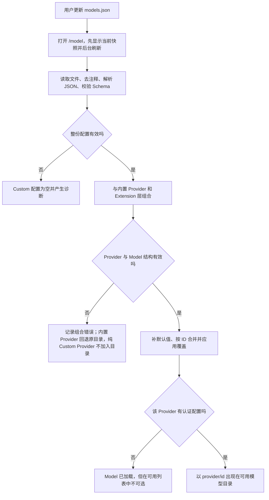
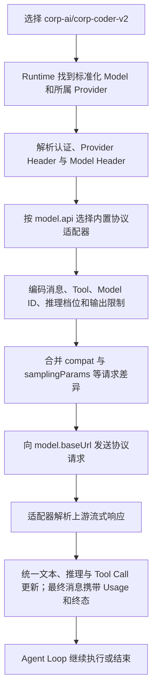
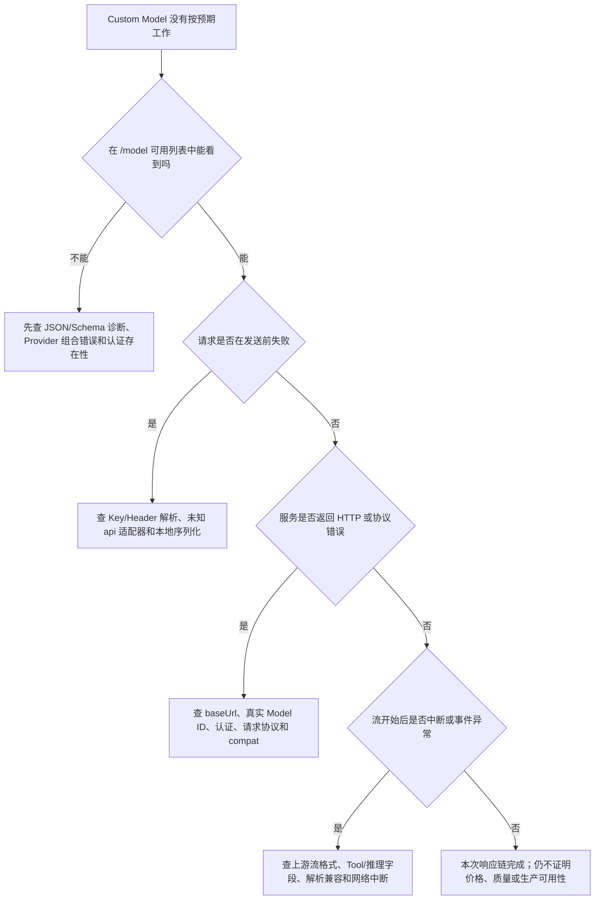

# Custom Model 请求链

本文按 Pi `0.84.2` 追踪 `models.json` 如何形成可选 Model，并经认证、Header 和内置 API Adapter 进入一次请求。静态配置、目录可见、请求成功、费用和生产可用性始终是不同证据。学习状态只见[完整学习计划](../../plans/pi-complete-learning-plan.md)；阶段 6 总览见[Packages、Models 与 Providers](../07-packages-models-providers.md)。

## Custom Model 如何从说明书变成一次请求

继续审查同一份 Java 订单代码。公司这次给出一张内部 AI 网关说明书：大厅地址是脱敏的 `https://corp-ai.example.invalid/v1`，使用 OpenAI Responses 协议；大厅里有一个窗口，API 识别号是 `corp-coder-v2`，人看到的名称是“Corp Coder V2”，声称支持文本和图片、二十万 Token 上下文、三万二千 Token 最大输出以及推理模式。

Pi 不会因为这张说明书存在就自动认识服务。`models.json` 的职责是把外部说明翻译为两层内部对象：Provider 说明“去哪里、说哪种协议、怎样带认证”，Model 说明“具体调用哪个 ID、能接收什么、容量和能力元数据是什么”。它是通讯录和请求翻译规则，不是模型部署，也不是连通性证明。

| 说明书内容 | Pi 中的字段 | 大白话职责 |
|---|---|---|
| 公司 AI 大厅 | Provider ID，例如 `corp-ai` | Pi 内部命名空间；与 Model ID 组成选择身份 |
| 大厅地址 | `baseUrl` | 请求实际发往哪里 |
| OpenAI Responses | `api` | 选择哪一套请求编码和流解析适配器 |
| 工作证与租户标签 | `apiKey`、`oauth`、`headers`、`authHeader` | 认证和请求信封；解析边界见 6.6 |
| 窗口清单 | `models` | 新增或按 ID 替换 Model |
| 已有窗口的修改单 | `modelOverrides` | 窄范围修改内置或 Extension Model |
| `corp-coder-v2` | Model `id` | Pi 主显示的 ID，也是发送给上游 API 的 Model ID |
| “Corp Coder V2” | `name` | 次级显示和匹配别名，不替代主 ID |
| 输入、容量、推理和价格 | `input`、`contextWindow`、`maxTokens`、`reasoning`、`thinkingLevelMap`、`cost` | Pi 如何规划和展示这个 Model 的能力 |
| 方言和额外参数 | `compat`、`samplingParams` | 修正请求格式；OpenAI-compatible 请求中额外采样键会覆盖 Pi 同名字段 |

### 第一段：把文件变成可选 Model

每次打开 `/model`，Pi 会先立即显示当前可用快照，再在后台重新读取 `models.json` 并更新列表，所以编辑后不要求重启，但刷新完成前短暂看到的可能仍是旧目录。读取过程先去注释、解析 JSON、校验整个 Schema，再把配置冻结并与内置 Provider、Extension 层组合。无效 JSON 或 Schema 不会“尽量加载正确的半份”：当前加载结果是空的 Custom Provider 配置并附带诊断。

新建非内置 Provider 并定义 `models` 时必须有 `baseUrl`，并在 Provider 或 Model 层提供 `api`。文档声明式入口支持 `openai-completions`、`openai-responses`、`anthropic-messages` 和 `google-generative-ai` 四类 API；应按网关真实协议选择，不能按模型品牌猜。当前 Schema 只校验 `api` 是非空字符串，因此写入未知值可能通过文件校验，直到请求路由时才因没有适配器失败。

Model 只有 `id` 必填；其余省略时，Pi `0.84.2` 会使用以下本地默认值：`name=id`、`reasoning=false`、`input=[text]`、`contextWindow=128000`、`maxTokens=16384`、四类 `cost` 全为零。它们都不是服务器探测结果：

- `input` 声明图片能力，不证明网关真的接受图片。
- `contextWindow` 影响 Pi 的上下文估算与压缩边界，填大不能扩大后端容量，填小会让 Pi 更早压缩。
- `maxTokens` 是配置的最大输出上限，不是输入加输出的总上下文；实际请求还会按上下文窗口、估算输入和 4096 Token 安全余量继续压低，最少保留 1 Token。
- `cost=0` 只让 Pi 的费率元数据显示为零，不证明 Provider 免费或不会出账单。
- `reasoning=true` 只暴露推理能力声明；实际参数还受 `thinkingLevelMap` 和 `compat` 影响。

Pi `0.84.2` 还有两处文档与源码差异：随包 Model 字段表没有列出 Model 级 `baseUrl` 和 `headers`，但当前 Schema、组合和请求源码实际支持；随包行为说明把 Custom Model 描述为在 `modelOverrides` 后合并，但当前源码对名称、容量、费用、推理、采样和 `compat` 等非 Header 字段，是先按 ID upsert Custom Model、再组合 Extension/OAuth 目录，最后应用 `models.json` 的 `modelOverrides`。Header 不走这条覆盖函数，而在请求期按 `modelOverrides.headers`、`models[].headers`、Extension Model Header 的顺序合并，后面的同名键覆盖前面。排错本版本时以源码行为为准，不外推到未来版本。

窄改内置 Model 时优先使用 `modelOverrides`，因为只写 Provider `baseUrl` 会保留内置模型目录，而在 `models` 中用同一 ID 重新定义会重建该 Model；未显式写出的能力、费用和容量字段会落到 Custom Model 默认值，并不自动继承全部内置元数据。未知的 `modelOverrides` ID 会被忽略。

交互式 `/model` 以认证过滤后的可用快照供用户选择；CLI `--model` 则会搜索完整目录，以便同一条启动命令再通过 `--api-key` 完成首次认证。CLI 在已知 Provider 下找不到指定 Model ID 时，还可能复制该 Provider 的默认元数据生成一个临时 Model 并给出警告，而不是立即报“模型不存在”。因此日常配置和排错应优先写完整的 `provider/id`，并同时观察警告和认证状态。

### 第二段：把内部 Model 变成协议请求

用户选择的是 `corp-ai/corp-coder-v2`：前半段帮助 Pi 找 Provider，后半段既标识内部 Model，也作为 Model ID 交给上游。真正请求时，Runtime 先解析认证和 Provider/Model Header，再按 Model 的 `api` 选择内置协议适配器。适配器负责把 Agent 的消息、Tool 定义、推理档位和输出限制编码为目标协议，并把返回的数据流转换为 Pi 统一事件。

这里最重要的分工是：`models.json` 提供元数据和选择哪个现成翻译器，协议适配器才真正序列化请求和解释响应。`compat` 是“方言修正”，只应根据网关文档或明确错误设置；`samplingParams` 在 OpenAI-compatible API 中会逐键进入请求体并覆盖 Pi 的同名请求字段，不应同时在多个地方维护同一采样参数。

### 错误发生在哪一层

因此，Model 出现在 `/model` 只证明配置组合和认证存在性检查通过；它不证明取值命令成功、端点可达、上游接受 Model ID、图片/推理声明真实、流格式兼容或费用元数据正确。一次响应成功也只证明这一条请求链完成，不能外推为限流、重试、计费准确、质量或生产稳定性。

本节只读取 Pi `0.84.2` 随包文档、Schema 和必要请求源码；没有读取或创建用户 `models.json`，没有读取凭据、执行 `!command`、启动 Mock、发送网络请求或调用 Provider。
