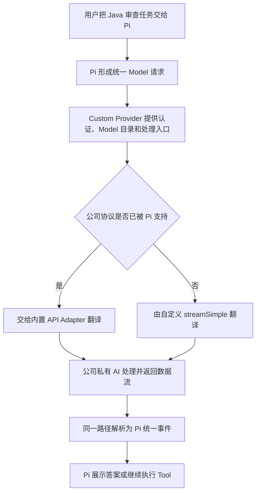
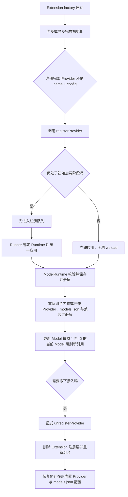
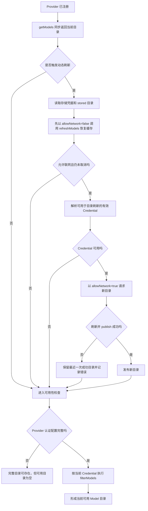
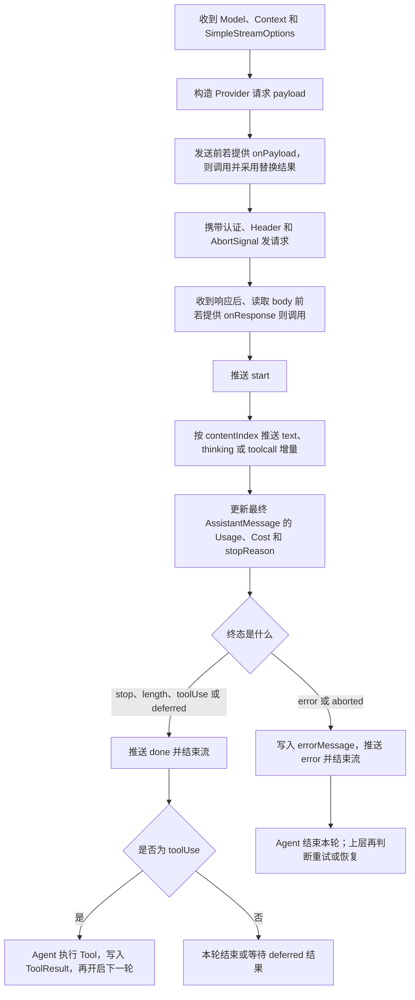
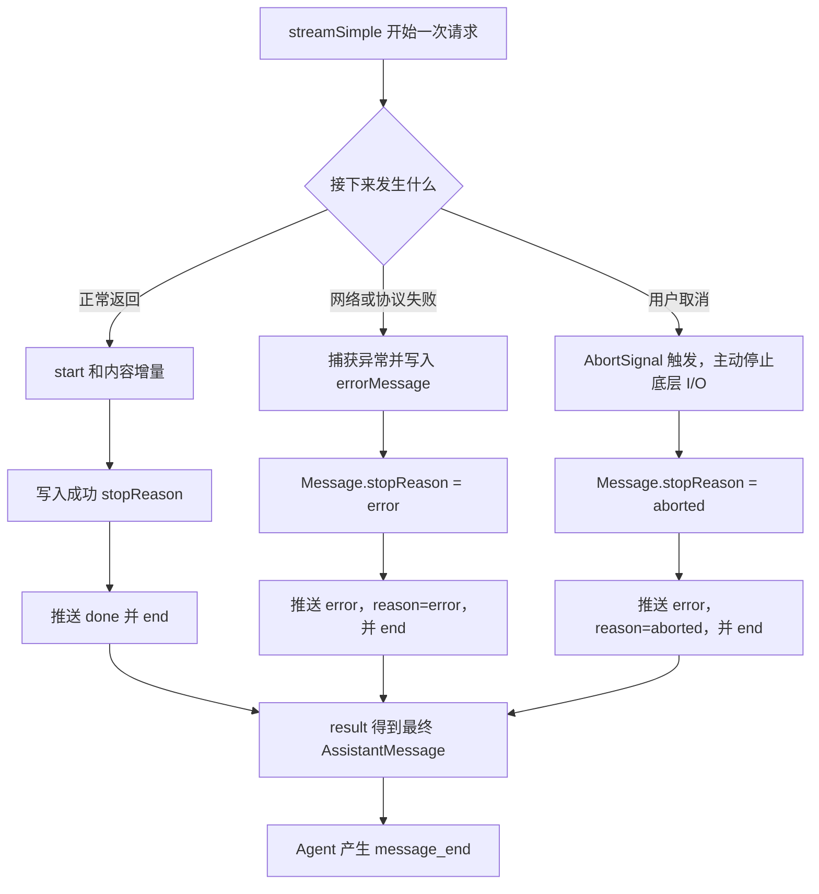
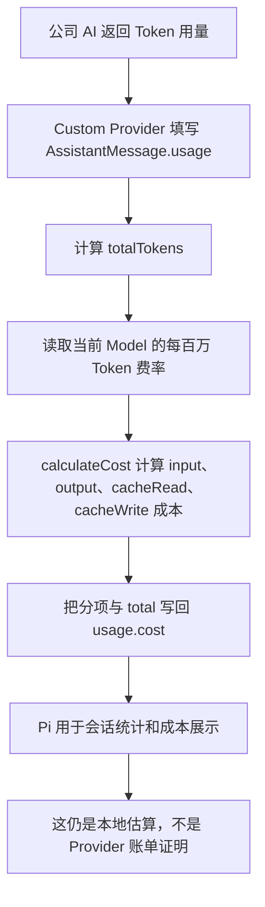
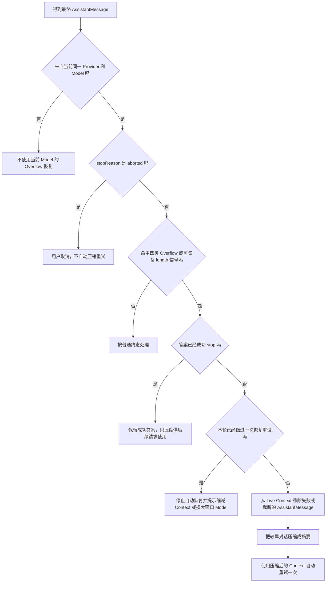
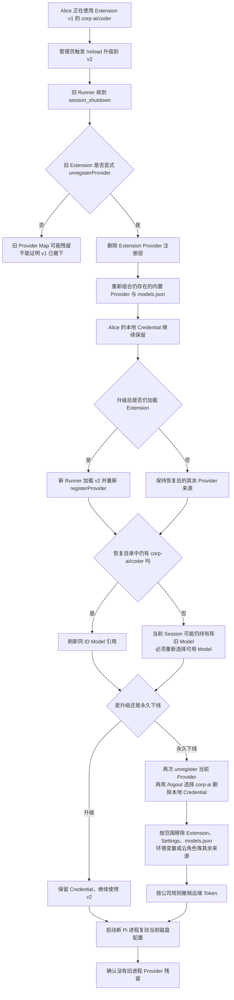
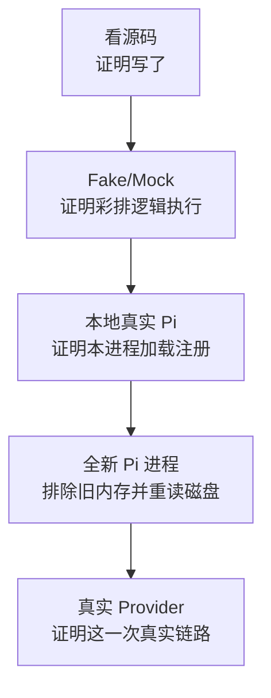

# Custom Provider 运行时合同

本文按 Pi `0.84.2` 保存 Custom Provider 的稳定运行时合同。阅读顺序固定为“完整公司 AI 场景 -> 对应精确合同 -> 证据门槛”；静态接口、Fake/Mock、本地真实 Pi、新进程和真实 Provider 不能互相替代。学习状态只见[完整学习计划](../../plans/pi-complete-learning-plan.md)；阶段 6 总览见[Packages、Models 与 Providers](../07-packages-models-providers.md)。

## 完整场景：先只记住翻译员主线

用户让 Pi 审查 Java 代码，公司私有 AI 既可能使用 Pi 已支持的协议，也可能只说公司自己的“语言”。Custom Provider 是两者之间一名会执行工作的总机适配员：它可以只处理特殊登录或动态目录；遇到非标准协议时，才亲自承担翻译。

第一遍只记三种可能职责，不是每个 Custom Provider 都要全部自己实现：

1. 处理声明式配置表达不了的登录或认证。
2. 动态告诉 Pi 当前有哪些 Model 可以使用。
3. 仅在协议不受支持时，把请求和回复双向翻译。

若公司服务已经兼容 Pi 支持的 API，且登录和目录都能由声明式配置表达，只需 `models.json` 填地址和说明。只有登录、目录或协议需要额外执行逻辑时，才使用 Custom Provider。

## 注册与路由：先看报到场景

Extension 文件存在，不等于 Pi 已经知道该把 `corp-ai` 请求交给谁。`registerProvider()` 相当于翻译员到总机报到：登记 Provider ID、可用 Model 和处理请求的入口；用户选择这个 Provider 下的 Model 后，Pi 才能按登记关系转发。

对应关系只有三条：`registerProvider` 是报到，内置 Adapter 或非标准协议下的 `streamSimple` 负责实时翻译，`unregisterProvider` 是撤下登记。下面再逐层展开动态目录、认证、流终态和恢复边界。

### 精确合同：两种注册形态与生命周期

上面的“报到、路由、撤下”主线落实为两种注册入口和一个注销入口：

| 入口 | 适合场景 | Extension 负责什么 |
|---|---|---|
| `registerProvider(provider)` | 自定义认证、目录刷新、权限过滤或完整流行为 | 提供完整 pi-ai `Provider`：认证、同步目录、可选刷新/过滤、`stream` 与 `streamSimple` |
| `registerProvider(name, config)` | 代理改址、静态 Model、复用现有 API，或兼容方式补 OAuth/刷新/自定义流 | 提供 ProviderConfig，Pi 将它与内置 Provider、`models.json` 和协议适配器组合 |
| `unregisterProvider(name)` | 动态撤下或恢复被覆盖的 Provider | 删除 Extension 注册层并重新组合其余来源 |

复杂能力优先使用完整 `Provider`。它是一个真正的运行时单元，拥有 `id`、`name`、认证语义、`getModels()`、可选 `refreshModels()`/`filterModels()`，以及 `stream()`/`streamSimple()`；即使服务本身不校验 Key，也必须提供能判断“是否已配置”的认证语义。ProviderConfig 是兼容性的简化形式：一旦提供 `models`，该注册层会替换下方同 Provider 的 Model 目录；只提供地址或 Header 时则保留下方目录。

随包 ProviderConfig 注释把定义 Model 时的 `apiKey` 写成“除 OAuth 外必需”，但当前组合源码允许先注册无 Key 的 Provider，再由 `/login`、已有存储凭据或 CLI Runtime Key 完成认证；认证之前 Model 可以进入完整目录，但不会成为可用 Model。这是 Pi `0.84.2` 的文档/源码差异。

当前 `0.84.2` 有三个需要主动治理的注销边界：

- `unregisterProvider()` 不等于 `/logout`，不会删除 `auth.json` 凭据，也不会撤销远端 Token。
- `/reload` 会替换 Extension Runner，但源码没有自动清空 ModelRuntime 中的 Provider 注册 Map；Extension 被移除或新版本不再注册时，应在旧 Runner 的 `session_shutdown` 中显式注销，或用新进程验证无残留。
- ProviderConfig 重复注册会把本次非 `undefined` 字段合并到旧注册；想删除旧字段时，先注销再完整注册更明确。

Custom-only Provider 正被当前会话选中时，注销后未必存在同 ID Model 可刷新；调用方应重新选择可用 Model，并测试旧引用请求不会被误用。恢复“目录中的内置 Provider”与“当前会话已经切回可用 Model”是两个不同结论。

## Model 目录：先看窗口名单场景

Provider 像公司 AI 的窗口管理员。它先维护一份“公司总窗口名单”，再根据当前员工的认证和权限，筛出 `/model` 中真正可选的窗口。

| 方式 | 大白话 | 适合情况 |
|---|---|---|
| 静态 `models` | 报到时交一张固定名单 | Model 长期不变 |
| async Extension factory | Pi 启动时先去公司查一次，再报到 | 首屏前必须拿到名单，但运行中不自动更新 |
| `refreshModels` | 运行中按刷新动作重新查目录 | Model 经常变化或要恢复缓存 |
| `filterModels` | 根据当前员工凭据隐藏无权使用的 Model | 不同账号看到不同目录 |

这里有两个不同结论：`getModels()` 返回的是 Provider 最近已知的完整目录；认证检查通过后，若提供了 `filterModels()` 再按当前员工权限筛选，否则完整目录直接成为可用目录。动态刷新失败时应保留旧目录，不能因为一次网络失败就把全部 Model 清空；目录缓存也不能保存 Access Token 或 Refresh Token。

### 精确合同：目录刷新、缓存与过滤

| 目录方式 | 发生时间 | 边界 |
|---|---|---|
| 静态 `models` | 注册时 | 适合固定目录，不会自己更新 |
| async Extension factory | Pi 启动时先发现再注册 | Pi 会等待它完成，但这只是启动期发现一次 |
| `refreshModels`，或 `createProvider` 输入中的 `fetchModels` | Runtime 刷新目录时 | `fetchModels` 会被组装为 Provider 的 `refreshModels`；适合目录变化、缓存恢复、强制刷新和取消 |
| `filterModels` | 认证确认后 | 从完整目录中按当前 Credential 筛选可见 Model |

完整 Provider 的 `getModels()` 必须同步返回最近一次成功目录且不应抛错。动态刷新获得 `credential`、上次持久目录 `stored`、`allowNetwork`、`force` 和 `AbortSignal`，再通过 `publish()` 原子提交持久化和内存更新；刷新失败应保留旧目录。目录缓存只能存 Model 和校验元数据，不能把 Access Token 或 Refresh Token 塞进去。

## Credential 与授权

用公司门禁理解：认证回答“你是谁”，权限回答“你能进入哪些房间”。Alice 通过公司 SSO 登录后，当前 Provider 的 OAuth Credential 代表 Alice；公司目录服务据此允许她使用代码和图片 Model，但隐藏管理员 Model。

“当前用户”不是固定指 macOS 登录账号，而是当前 Provider 的有效认证所代表的身份：个人 OAuth 通常代表员工本人，团队 API Key 可能代表团队服务账号，云端 ambient 认证可能代表机器角色。不同 Provider 也可以各自使用不同身份。

Pi 通常不理解公司的“开发人员”或“管理员”角色。权限判断一般发生在两处之一：

1. Provider 带认证调用公司目录接口，公司后台直接返回该身份可用的 Model。
2. Provider 先维护完整目录，再由可选 `filterModels(models, credential)` 按 Credential 筛选。

`filterModels` 收到的 Credential 也可能为空：例如 Provider 通过环境变量或云端 ambient 方式完成认证时，Pi 可以确认认证可用，但未必有一份存储的员工 Credential 传入过滤器。因此实现不能假定它总是可解析角色的 OAuth Token。

排错时要分开四层证据：

| 层级 | 能证明什么 |
|---|---|
| 认证配置存在 | Pi 知道有一条认证来源 |
| 凭据成功解析 | 本次能取得 Key、Token 或 ambient 身份 |
| Provider 接受身份 | 公司服务确认“你是谁” |
| Model 授权通过 | 该身份被允许查看或调用这个 Model |

前一层成功不能自动证明后一层；Model 出现在完整目录，也不证明当前身份获得了调用权限。

## Stream 与统一消息：先看 OrderService 场景

用户让 Pi 检查 `OrderService`。公司私有 AI 先流式返回一句“我先读取文件”，随后把 `read` Tool 名称和参数 JSON 分成多段发送。若协议不受 Pi 支持，`streamSimple` 要把这些私有片段翻成 Pi 的统一事件；若协议已经受支持，这项工作由内置 Adapter 完成。

| 公司私有流片段 | `streamSimple` 产生的 Pi 事件 |
|---|---|
| 回复开始 | `start`，建立一条进行中的 AssistantMessage |
| 文本开始、若干文字、文本结束 | `text_start`、重复 `text_delta`、`text_end` |
| Tool 名称和参数 JSON 开始、若干参数片段、结束 | `toolcall_start`、重复 `toolcall_delta`、`toolcall_end` |
| 公司表示“请执行 Tool” | `done`，最终 `stopReason=toolUse` |

这一轮只记四条规则：

1. `start` 必须在任何内容增量之前。
2. 同一个文本块或 Tool Call 始终使用同一个 `contentIndex`。
3. 参数 JSON 完整并产生 `toolcall_end` 后，Tool Call 才算组装完成。
4. 一条流只能有一个最终 `done` 或 `error`；`toolcall_end` 只是内容块结束，真正的 AssistantMessage 终态仍是后面的 `done(toolUse)`。

Agent 看到最终 `toolUse` 后才校验并执行 Tool。若回复因为 `length` 被截断，即使出现了 Tool Call，Agent Core 也不会执行这些可能不完整的参数。

### 精确合同：自定义流必须完整履约

仅自定义认证或动态目录时，Provider 仍可复用内置 API Adapter。只有私有协议无法由现有适配器表达时，才实现 `streamSimple`；此时 Extension 不只是“发一次 HTTP”，而要实现 Pi 的完整流事件合同。

`pending` 只是构造中的内部状态，不能作为终态。`length` 表示输出被截断；若其中带 Tool Call，Agent Core 会把这些调用标成失败而不执行，避免使用截断参数。`Usage` 要区分输入、输出、缓存读写和可选推理 Token，并用 Model 费率计算 Cost；计算结果仍只是 Pi 元数据，不是账单证明。

自定义 Handler 还要承担内置适配器原本提供的隐含工作：按 Context 余量夹紧输出上限、更新 Usage/Cost、先发 `start` 再发增量、只发一个终态，并保持事件 reason 与最终 Message 的 `stopReason` 一致。当前事件流不会替实现者校验完整顺序；缺少终态可能让 `result()` 持续等待。

外层 `lazyStream` 能把返回 Inner Stream 之前的 Setup 错误，以及迭代 Inner Stream 时真正抛出的错误包装为普通 `error`；但常见实现会在脱离 EventStream 的异步生产者中处理网络流，这里的异常若没有自行 `catch`、推送终态并 `end()`，不会自动传到迭代器，可能留下未处理异常和永久等待。外层包装也不会仅因 `AbortSignal` 已触发就自动变成 `aborted`，所以取消路径必须主动停止底层 I/O，并发送 reason 与 Message 均为 `aborted` 的错误终态。

认证、路由或 Handler 创建阶段也可能在 `start` 前直接形成错误终态；Agent Core 会为最终错误消息补发消息开始/结束事件。实现者必须保证没有 `start` 时不发送任何内容增量，不能把“每次错误都一定先有 start”当成消费端前提。

## AssistantMessage 不是适配器

`AssistantMessage` 是 Pi 在 `@earendil-works/pi-ai` 中公开定义的统一响应对象，不是 OpenAI、Anthropic 或其他厂商标准，也不是执行转换的 Adapter。

| 对象 | 职责 | Java 类比 |
|---|---|---|
| Custom Provider / `streamSimple` | 把厂商私有请求和回复转换为 Pi 格式 | Adapter 实现 |
| `AssistantMessageEvent` | 描述流式转换中的 start、增量和终态 | 流事件 |
| `AssistantMessage` | 保存当前或最终的文本、推理、Tool Call、Usage 和 stopReason | 统一响应 DTO |

转换关系是“厂商私有响应 -> Provider/Adapter -> AssistantMessageEvent -> 最终 AssistantMessage”。事件不断更新当前 Message；最终 `done` 或 `error` 携带完整 Message，Agent Loop 再据此结束、执行 Tool 或恢复。

## 错误与取消

继续使用 OrderService 场景：一种情况是公司 AI 连接突然断开，另一种是用户主动取消。两者都不能推送成功 `done`，而要产生 `error` 类型的终态事件；区别写在事件 reason 和最终 AssistantMessage 的 `stopReason` 中。

四条规则：

1. 一条流只能有一个终态：成功用 `done`，失败或取消用 `error`。
2. 事件 reason 与 Message `stopReason` 必须一致。
3. 用户取消必须真正把 `AbortSignal` 传给并停止网络；只让界面停止等待不够。
4. 脱离 EventStream 运行的异步生产者必须自行捕获异常、推送终态并 `end()`；否则可能出现未处理异常，且 `result()` 一直等待。

类型允许值也要严格匹配：`done.reason` 只能是 `stop`、`length`、`toolUse` 或 `deferred`；`error.reason` 只能是 `error` 或 `aborted`，并分别与最终 AssistantMessage 的 `stopReason` 一致。

认证、路由或 Setup 也可能在任何 `start` 之前失败；此时可以直接得到错误终态，消费端不能假设每次错误前都出现过 `start`。

## Usage 和 Cost 是小票，不是账单

把 Usage 理解成公司 AI 给出的用量小票，把 Cost 理解成 Pi 根据本地价目表算出的估算金额。自写 `streamSimple` 不会自动补齐它们：Custom Provider 要把上游报告的 Token 数写入最终 AssistantMessage，再用 Model 的费用元数据计算 Cost。

| Usage 字段 | 大白话 |
|---|---|
| `input` | 本次普通输入 Token |
| `output` | 本次全部输出 Token；若 Provider 报告 reasoning，它已经包含在 output 中 |
| `cacheRead` | 从缓存读取的输入 Token |
| `cacheWrite` | 写入缓存的输入 Token |
| `cacheWrite1h` | 可选的一小时缓存写入 Token，是 cacheWrite 的子集，不能再加进 totalTokens |
| `reasoning` | 可选的推理 Token 明细，是 output 的子集，不能重复相加 |
| `totalTokens` | input、output、cacheRead、cacheWrite 的总和 |

假设公司报告：input=`1000`、output=`200`、cacheRead=`500`、cacheWrite=`0`，其中 reasoning=`50`；Model 价目表是输入 `$2`、输出 `$8`、缓存读取 `$0.2`，单位均为每百万 Token。Pi 的估算为：输入 `$0.002` + 输出 `$0.0016` + 缓存读取 `$0.0001` = 总计 `$0.0037`。reasoning 的 `50` 已包含在 output=`200` 中，不再单独收费一次。

三条边界：

1. Model 费用元数据默认为零，只会让 Pi 估算为零，不证明服务免费。
2. 上游少报或 Custom Provider 填错 Usage，Cost 和 Context 恢复判断都会受影响。
3. Pi `0.84.2` 用 `input + cacheRead + cacheWrite` 选择分层费率：只有严格大于 `inputTokensAbove` 才命中，并使用最高匹配阈值。普通缓存写入 `cacheWrite - cacheWrite1h` 按 cacheWrite 费率计算，`cacheWrite1h` 则按 input 费率的两倍计算；这些规则仍依赖配置和上游 Usage 正确。

真实账单还可能包含请求费、图片费、套餐、折扣、汇率或供应商侧取整，不能用 AssistantMessage 中的 Cost 直接做财务对账。

## Context Overflow 就是办公桌放不下了

把 `contextWindow` 想成一张最多放一万张纸的办公桌。历史对话和本次输入已经接近一万 Token，Model 还要继续回答时，可能明确拒绝，也可能静默截断，甚至返回成功但上报的输入已经超过配置窗口。Pi 要根据最终 AssistantMessage 判断是否先把旧对话压缩成摘要。

本节只讲“最终 AssistantMessage 已返回后”的成功压缩与失败恢复，不重复手动 `/compact` 或正常自动阈值。四种入口、`reason` 和 `willRetry` 的完整对照见 [Session、Tree 与 Compaction](../04-session-tree-compaction.md#四种压缩与恢复入口)。

只有最终消息来自当前同一 Provider/Model 时，Pi `0.84.2` 才识别这些信号：

| 信号 | 大白话 |
|---|---|
| `stopReason=error`，errorMessage 命中已知 Overflow 文案，且不命中 rate limit 等已知非 Overflow 模式 | 服务明确说“桌子放不下”，且不是限流等其他故障 |
| `stopReason=stop` 且 `input + cacheRead > contextWindow` | 服务说成功，但用量显示已经越过桌面容量 |
| `stopReason=length`、output=`0`，且 `input + cacheRead >= contextWindow * 0.99` | 输入和缓存读取塞满至少 99% 的桌面，完全没有空间回答 |
| `stopReason=length` 且 output 小于原始期望输出上限 | 回答提前被截断，视为可恢复候选 |

私有 Provider 的 Overflow 文案若不在 Pi 已知模式中，可以由同一 Extension 在 `message_end` 按 Provider 范围改写为可识别错误；不能把限流、服务过载等错误改成 Overflow，否则会错误压缩而不是走正常退避重试。

`contextWindow`、Usage.input 和 Usage.cacheRead 都参与判断：填小会过早压缩，填大可能错过真实溢出，少报 Usage 也可能让 Pi 看不见桌面已满。因此 Model 容量和 Usage 不是纯展示数据。

## Reload、注销与新进程

Alice 已通过 `corp-ai` 登录并选择 `corp-ai/coder`。周五管理员要把 Extension v1 升级到 v2，希望保留 Alice 的登录状态，但不能让旧 Provider 逻辑残留。

正确心智模型是：Provider 登记、Credential、Extension Runner、当前 Model 引用和进程内存是五份不同状态。

| 动作 | 会改变什么 | 不自动改变什么 |
|---|---|---|
| `unregisterProvider("corp-ai")` | 删除 Extension Provider 注册层，重新组合内置 Provider 和 `models.json` | 不删除 `auth.json` Credential，不撤销远端 Token |
| 输入 `/logout` 后在选择器中选 `corp-ai` | 删除由 `/login` 保存的本地存储 Credential | 不删除 Provider 注册，也不改变环境变量或 `models.json` 配置 Key；其他认证来源存在时 Provider 仍可能可用 |
| `/reload` | 关闭旧 Extension Runner、重载资源并创建新 Runner | Pi `0.84.2` 不自动清空 ModelRuntime 的旧 Provider Map |
| 重新选择 Model | 改变当前 Session 后续请求使用的 Model | 不注销 Provider，也不删除 Credential |
| 启动新 Pi 进程 | 创建新的 ModelRuntime，排除旧进程内存注册残留 | 仍会重新读取磁盘上的 Extension、设置、`models.json` 和 Credential |

`/reload` 不是清空 Provider 的按钮。Pi `0.84.2` 会复用原 ModelRuntime；若旧 Extension 被删除或 v2 不再注册同名 Provider，只有旧 Runner 在失效前显式注销，才能可靠移除旧注册。兼容 ProviderConfig 重复注册采用顶层浅合并：仅本次非 `undefined` 字段覆盖，未提供的顶层字段继续保留；一旦提供 `headers`、`oauth`、`models` 等对象或数组，该顶层值整体替换，不递归合并旧内部键。因此要彻底移除旧顶层字段或重建完整契约时，“先注销、再完整注册”更明确。

`unregisterProvider` 也不是安全登出。升级通常应该保留 Credential，让 v2 继续使用；永久下线则要分别撤掉当前注册、Extension/Settings/`models.json` 等声明来源、环境变量或云角色等 ambient 身份、本地 Credential 和远端 Token。新进程只能证明旧内存 Map 不再存在；只有重新读取后的来源、认证和目录都符合预期，才能证明本机下线闭环，仍不能替代远端撤销证据。

最小验收必须分别观察：Provider 目录是否恢复、Credential 是否按预期保留或删除、当前 Session 是否切到可用 Model、Reload 后 v1 是否残留、新进程加载了哪些 Provider。五项不能互相替代。

## 最小实现门槛

| 需求 | 应选入口 |
|---|---|
| 只改地址、Header、静态 Model，协议已支持 | `models.json` |
| 启动前发现一次 Model，仍使用标准协议 | async Extension factory 加兼容注册；先判断是否真的需要 Extension |
| 持续动态目录、凭据过滤或自定义认证 | 完整 `Provider` |
| 非标准请求或流格式 | 完整 `Provider` 或 ProviderConfig 的 `streamSimple` |
| 仅因“以后可能扩展” | 不写 Custom Provider，等出现真实运行逻辑再升级 |

## 最小测试清单

先用五张大白话验收卡区分不同证据，再看后面的开发测试维度。

| 验收卡 | 做了什么 | 最多能证明 | 仍不能证明 |
|---|---|---|---|
| 1. 看排班表 | 只读源码、类型和 `registerProvider` 路径 | 接口与分支写在文件里 | Pi 发现或执行了它 |
| 2. 和 Bob 彩排 | Fake/Mock 公司 AI，真实调用 Provider 逻辑并断言事件 | 受控台词下翻译、错误和取消分支真实执行 | Pi Loader、真实 SSO、网络或公司服务 |
| 3. 翻译员真实到岗 | 启动本地 Pi，观察 Extension、诊断、`/model` 和同进程注销恢复 | 这次进程的 Loader、factory、注册和目录集成 | 真实 Provider 请求、协议、Token 或费用 |
| 4. 第二天开新办公室 | 完全退出旧 Pi，再启动新进程并重新观察 | 旧进程内存 Map 没有带过来，当前磁盘来源被重新读取 | 磁盘 Credential 已删除、环境已清理、远端 Token 已撤销或真实请求成功 |
| 5. 接通真实总机 | 经单独授权，使用测试身份对真实 Provider 发一次无敏感数据的最小请求并观察完整终态 | 该时间、账号、Model 和输入下，真实认证、网络、协议与响应链成功一次 | 其他账号、Model 或输入，持续稳定性、并发与限流、账单、安全或生产可用性 |

五张卡回答不同问题，后面的卡不能替代前面的分支测试。尤其要区分：`/model` 出现只证明本进程目录和认证配置存在性；新进程不出现只证明旧内存没有带来且当前来源未重新注册，不能单独证明 Credential、ambient 身份或远端授权已经清理；单次真实请求成功也不能外推账单、稳定性、安全或生产可用性。第五张只在实际交付且取得凭据、费用和联网授权后执行，本课程只学习其证据边界。

| 维度 | 必须验证 |
|---|---|
| 注册与恢复 | 新注册、覆盖内置、重复注册、显式注销、`/reload`、Extension 移除、新进程、当前 Model 重选 |
| 认证 | API Key、OAuth 登录取消、临期刷新、刷新失败、并发刷新、注销与凭据保留、日志不泄露 Token |
| 目录 | 静态、启动发现、离线缓存、动态刷新、失败保留旧目录、Credential 过滤、持久化和取消 |
| 请求钩子 | `onPayload` 替换、`onResponse` 时机、Header、Model ID、请求体与 `AbortSignal` |
| 流事件 | start、文本、thinking、Tool Call、空响应、Unicode、图片输入、Usage/Cost、事件索引、缺失/重复终态和 reason 一致性 |
| 终态恢复 | stop、length、toolUse、error、aborted、deferred、Overflow 规范化、限流不误判、跨 Provider 上下文 |

Extension 与 Pi 同进程、同权限执行，不是沙箱。静态接口阅读和流程图不能证明 Extension 能加载、SSO 成功、动态目录可达、流事件与真实服务兼容、费用正确、注销撤销远端 Token或 `/reload` 没有残留。

本节只读取 Pi `0.84.2` 随包文档、公共类型和必要运行时源码；没有实现或运行 Provider，没有读取用户配置、环境变量或凭据，没有执行认证命令、联网、发送真实请求、调用 Provider 或产生 Provider 费用。
