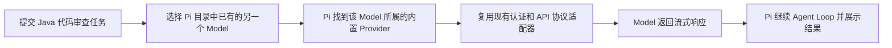
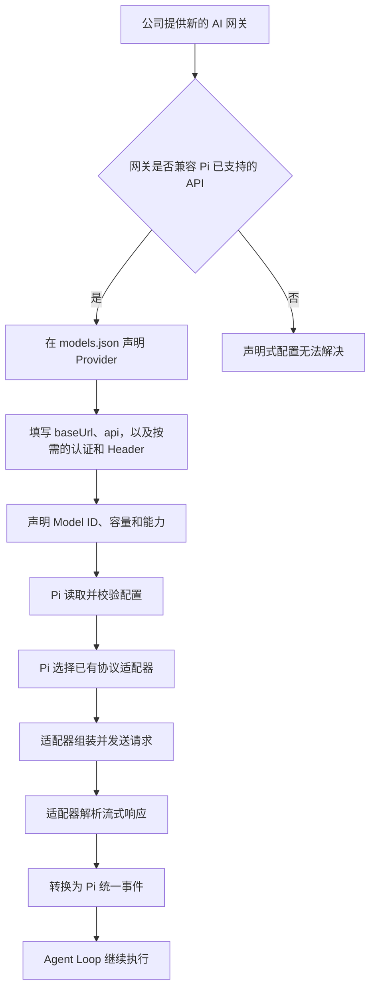
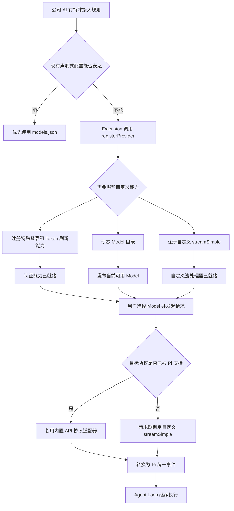
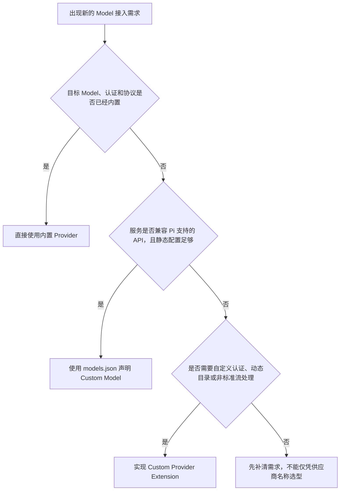
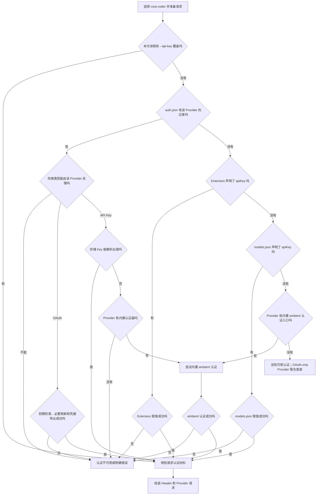
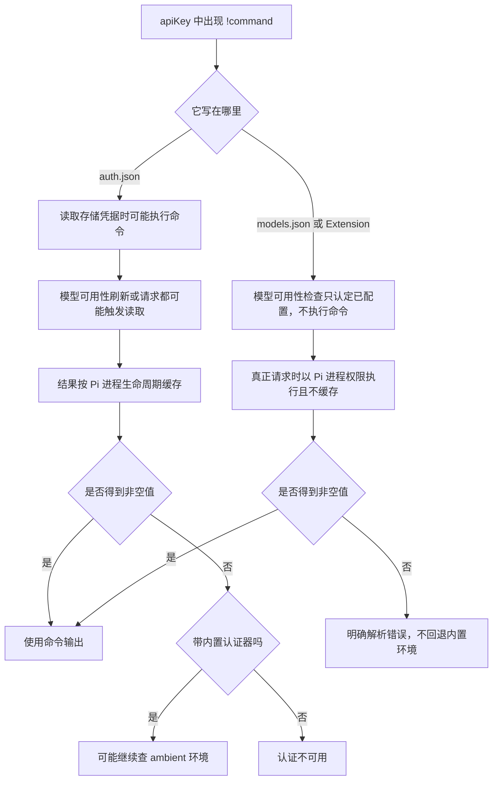
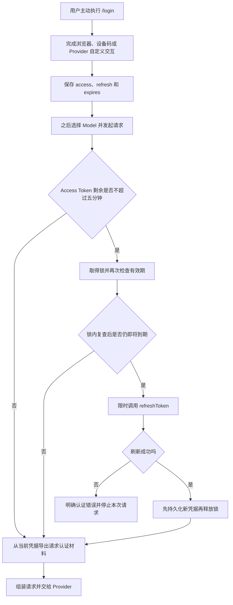

# Model 选型与认证

本文按 Pi `0.84.2` 说明内置 Provider、`models.json` Custom Model、Custom Provider Extension 的选型，以及 Credential、Header、`!command` 和 OAuth 的解析边界。学习状态只见[完整学习计划](../../plans/pi-complete-learning-plan.md)；阶段 6 总览见[Packages、Models 与 Providers](../07-packages-models-providers.md)。

## 三种模型接入方式怎么选

本节基于本机 Pi `0.84.2` 的随包 `providers.md`、`models.md`、`custom-provider.md` 及必要运行时源码，解决一个实际问题：接入条件变化后，应继续使用内置 Provider、补充 `models.json`，还是编写 Custom Provider Extension。

先固定同一个任务：用户让 Pi 审查一份 Java 订单代码。三个场景的业务任务没有变化，变化的只是 Pi 如何找到并调用 Model。

### 场景一：只换 Pi 已经认识的 Model

用户当前已经可以使用 `openai/gpt-5.6-sol`。这次只想换成 Pi 模型目录中已有的另一个 Model，再执行同一份代码审查。服务入口、认证方式和通信协议都没有改变。

这类似继续使用同一家外卖平台、同一个账号和同一家餐厅，只把菜单上的 A 套餐换成 B 套餐。Pi 不需要增加地址或翻译规则，只需选择另一个已有 Model。

这里真正改变的只有 Model。选择入口是内置 Provider 已经提供的模型目录，不需要 `models.json`，也不需要 Extension。

### 场景二：声明式 Provider 配置，换成 Pi 认识协议的新地址

公司规定所有 AI 请求必须经过内部网关。网关地址和 Model ID 不在 Pi 的内置目录中，但它明确兼容 OpenAI Responses、OpenAI Chat Completions、Anthropic Messages 或 Google Generative AI 中的一种。

这类似公司食堂搬到了新地址，但仍使用 Pi 已经看得懂的点菜单。用户只需补一张地址和菜单说明，不需要重新培训一名服务员。`models.json` 就承担这张说明的职责：声明 Provider 地址、API 类型和 Model 元数据，Pi 继续复用已有的请求编码与流式响应解析器。

这里的 Custom Model 不是训练、微调或部署一个新模型，而是用配置告诉 Pi：Model 在哪里、叫什么、使用哪种 Pi 已支持的通信格式。

### 场景三：Custom Provider Extension，现有配置表达不了公司的规矩

另一家公司也提供内部 AI，但必须先完成企业 SSO；Token 过期后要刷新；每个员工的 Model 目录需要动态查询；请求或流式响应也不是 Pi 已支持的格式。

这已经不是补地址能解决的问题。Pi 需要一段真正会执行的接入逻辑：注册企业登录与刷新规则，在合适的时机发现 Model，并在请求时解析凭据、转换请求和解析响应。Extension 通过 `registerProvider()` 注册 Custom Provider，再把公司服务的结果转换为 Pi 能继续处理的统一事件。

用 Java 类比，`models.json` 接近增加一组客户端配置；Custom Provider 则接近实现并注册一套新的 SPI 或六边形架构 Adapter。Custom Provider 不等于一定要自写流协议：它也可以只负责现有机制无法表达的认证或动态目录，再复用已有 API 适配器。

### 最小选型顺序

| 当前变化 | 首选入口 | 原因 |
|---|---|---|
| 目标 Model、认证和协议都已被 Pi 支持 | 内置 Provider | 只需选择已有 Model，不增加配置或执行代码 |
| 地址或 Model 是新的，但服务兼容 Pi 已支持的 API，声明式配置足够 | `models.json` Custom Model | 复用已有请求编码和流解析，只补连接与 Model 元数据 |
| 登录、刷新、动态目录或协议需要现有机制无法表达的运行逻辑 | Custom Provider Extension | 需要执行代码并注册新的认证、目录或流处理能力 |

能力存在交集时，优先选择能满足需求的最小入口。Pi `0.84.2` 的 `models.json` 支持 `openai-completions`、`openai-responses`、`anthropic-messages` 和 `google-generative-ai` 四类 API，也能只覆盖内置 Provider 的地址或 Header；Extension 同样可以覆盖地址，但仅为静态地址变化编写可执行 Extension 通常没有必要。

企业 OAuth 也不自动等于 Custom Provider。若 Pi 已内置该登录方式，应继续使用内置 Provider；当前 `models.json` 还支持 `radius` 这一声明式 OAuth 特例。只有现有认证链无法表达新的登录、刷新或取值逻辑时，才升级到 Extension。

本节只完成选型地图，不展开认证来源优先级、`models.json` 字段细节或 Custom Provider 公共接口，它们分别属于 6.6、6.7 和 6.8。Model 出现在目录中只证明配置或注册结果被发现，不证明凭据有效、账号获得授权、请求成功、不会计费或达到生产可用性。Custom Provider 是与 Pi 同进程执行的代码，不是权限沙箱。

## 认证值到底从哪里来

继续使用同一份 Java 代码审查任务。公司已经把内部 Model `corp-coder` 接入 Pi，网关地址和协议也没有问题，但真正发送代码前，门卫还要核对两样东西：一张证明“你是谁”的工作证，以及信封上的 `X-Tenant-ID` 租户标签。

Pi 面前可能同时放着几张工作证：本次启动临时递入的 Key、本机认证存储中的 Key 或 OAuth Token、Provider 配置中的取值说明，以及内置 Provider 约定的环境变量。重点不是“把每张证都试到成功”，而是先按优先级进入对应的解析分支。类型不匹配、OAuth 刷新失败和声明式 Key 解析失败不会静默换身份；存储 API Key 解析为空时是否继续查 ambient 认证，则取决于该 Provider 是否带有内置认证器。

### 先选工作证来源

Pi `0.84.2` 的随包文档与实际请求源码在最后两层顺序上不一致，必须保留这条版本事实。

| 证据 | 写出或实现的顺序 |
|---|---|
| 随包 `providers.md` | CLI `--api-key` -> `auth.json` -> 内置环境变量 -> `models.json` Custom Provider Key |
| 当前请求源码 | CLI `--api-key` -> `auth.json` -> Extension `apiKey` -> `models.json` Provider `apiKey` -> 内置 Provider 的环境变量或 ambient 认证 |

CLI Key 会先写入只存在于当前进程的运行时凭据覆盖层，因此遮住同一 Provider 的 `auth.json` 记录。没有运行时覆盖时，认证存储中的记录先被读取；记录类型与 Provider 不匹配或 OAuth 刷新失败时，请求停止，不会继续尝试后面的配置来源。存储的 API Key 命令或环境插值若解析为空，带内置认证器的 Provider 可能在该存储分支内部继续查 ambient 环境变量；它不会转去尝试 Extension 或 `models.json` 的 Key。只有完全没有存储记录时，组合后的 Provider 才解析 Extension 或 `models.json` 声明的 `apiKey`；声明存在但解析失败会明确报错，二者都没声明时才调用内置 Provider 自带的环境变量、云配置文件或其他 ambient 认证逻辑。

排错当前 `0.84.2` 时，应以实际请求源码解释运行行为，同时把文档顺序记为上游说明差异；不能把这个差异外推到未来版本。这里还有一个容易混淆的点：`models.json` 的 `apiKey: "$CORP_AI_KEY"` 属于“先选中 Provider 配置，再从环境中取值”，不等于“内置 Provider 自动寻找标准环境变量”这一来源层。

### 再翻译工作证上的文字

选中来源后，Pi 才解释其中的值。`$CORP_AI_KEY` 表示读取名为 `CORP_AI_KEY` 的环境变量；`${CORP}_AI_KEY` 只把花括号中的 `CORP` 当变量，后半段是普通文字；没有 `$` 的 `CORP_AI_KEY` 就是字面值，不会自动查环境变量。`$$` 和 `$!` 分别转义为字面量 `$` 和 `!`。

以 `!` 开头的值不是特殊格式的 Key，而是本地 Shell 命令入口。`auth.json` 与 Provider 声明层的执行时机和失败行为不同，不能合并成一条普遍规律。

因此，`auth.json` 中的 `!command` 可能在凭据读取或模型可用性刷新阶段执行，结果按 Pi 进程生命周期缓存；失败后的 ambient 例外只适用于带内置 API Key 认证器的 Provider。`models.json` 或 Extension 声明的 `apiKey`/Header 命令则在真正请求时执行，不使用这份进程缓存，也没有 Pi 内建的 TTL、旧值复用或失败恢复；其中 `apiKey: "!command"` 在模型可用性检查中只被视为“已经配置”，不会提前执行。

`auth.json` 中 Provider 专属的 `env` 会先于进程环境变量参与该 Provider 的 Key、Header 和其他配置取值，但不会修改整个 Shell。`headers` 是信封上的附加字段，可以承载租户、路由或服务要求的认证信息；它和 `apiKey` 使用相同的取值语法。`authHeader: true` 表示额外生成 `Authorization: Bearer <apiKey>`，而最终请求显式提供的 `Authorization` Header 会覆盖自动生成值。标准 API 最终如何携带 Key 仍由对应适配器决定，不能把所有 API Key 都等同为 Bearer Header。

### OAuth 是会续期的电子工作证

API Key 主要解决“从哪里取一个值”；OAuth 还多出登录、Access Token、Refresh Token、到期判断和刷新。用户先通过 `/login` 主动完成 Provider 提供的交互，Pi 再把 OAuth 凭据存入认证存储。它不是 Extension 注册后必然自动打开浏览器，也不是每次启动都先刷新。

Pi `0.84.2` 的实际请求路径会在 Access Token 剩余不超过五分钟时进入带锁刷新：锁内再次检查，必要时用十五秒超时调用 Provider 刷新逻辑，并在释放锁前保存轮换后的凭据。刷新失败会成为明确认证错误，不会改用环境变量冒充同一用户。Model 目录刷新是另一条路径，它只在 Token 已经过期时刷新，不能与请求前的五分钟窗口混为一谈。

企业 OAuth 仍不自动等于 Custom Provider：内置 Provider 已支持的登录直接复用；`models.json` 当前还有 `oauth: "radius"` 这一声明式特例。只有现有机制无法表达公司的登录、刷新或取值链时，才由 Extension 注册 OAuth 实现。

本节没有读取现有 `auth.json` 内容，没有执行任何认证取值命令，没有启动浏览器登录、交换 Token 或调用 Provider。静态证据只能证明当前版本的来源选择、取值和刷新代码路径；“配置被发现”“值成功解析”“Header 已组装”“Provider 接受认证”“Model 成功响应”是五层不同证据。
