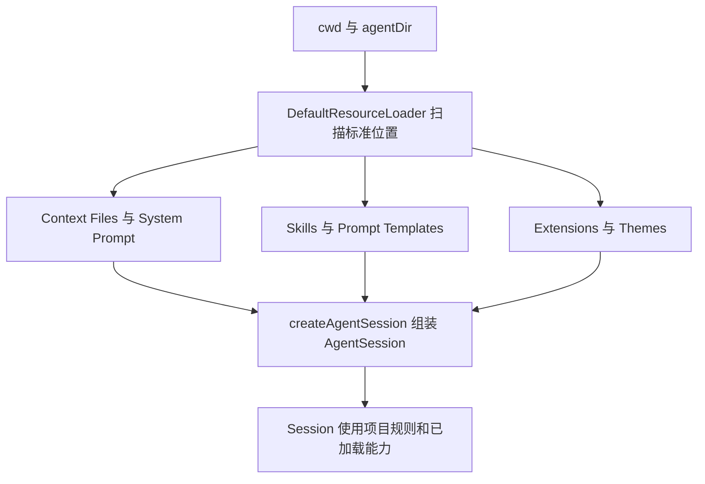
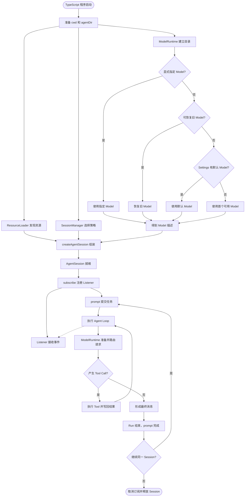
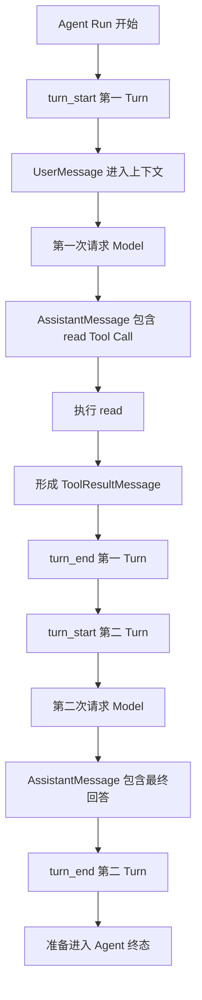
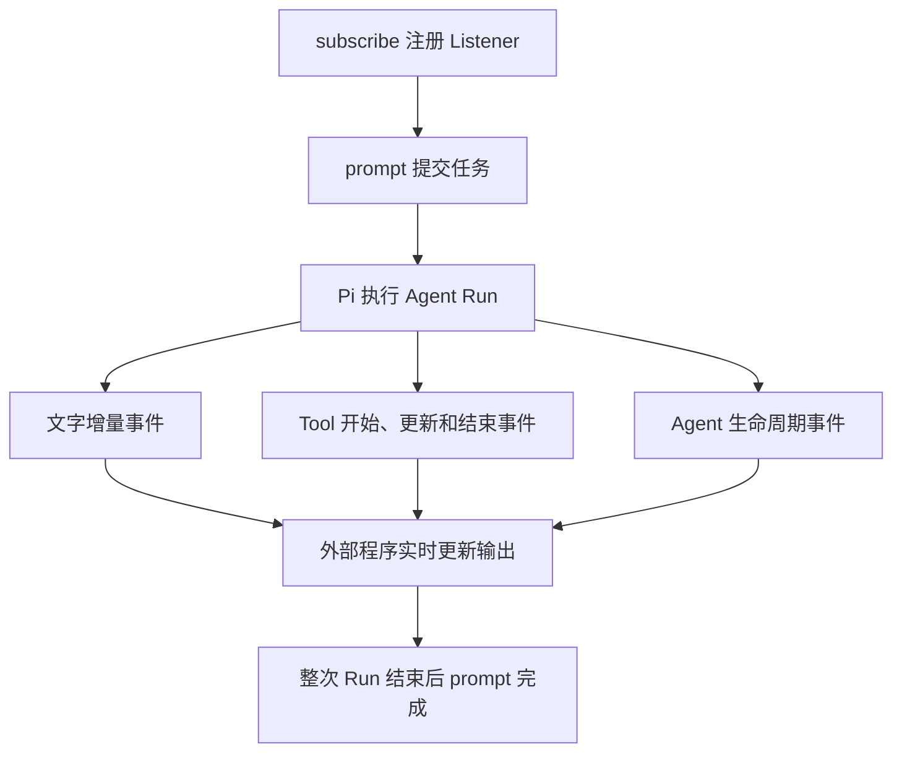
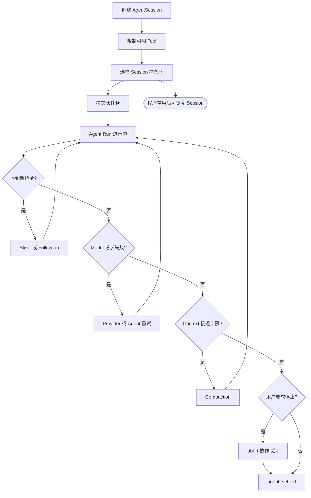
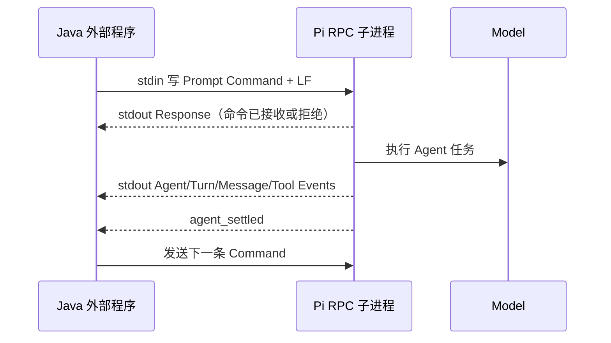
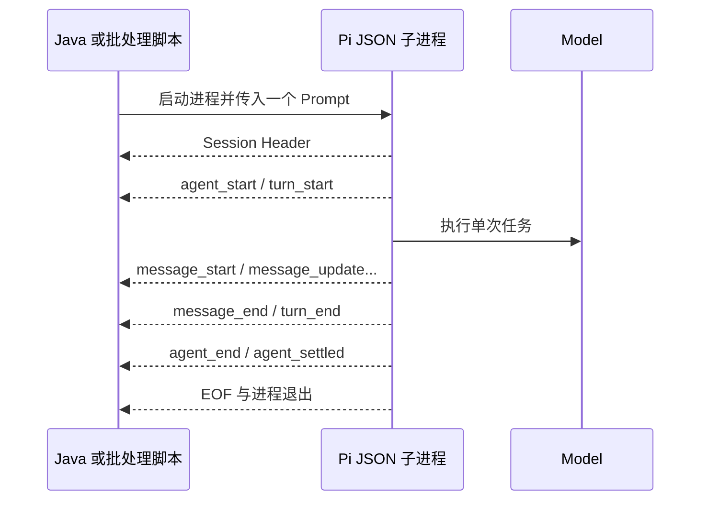

# SDK、RPC、JSON 与 TUI

本文按 Pi `0.84.2` 学习如何把 Pi 作为组件接入外部程序。当前先建立 SDK、`AgentSession`、资源加载与事件订阅的基础心智模型；学习状态、实验和验收只见[完整学习计划](../plans/pi-complete-learning-plan.md)。

## SDK 与项目依赖

Pi SDK 让程序调用 Pi 的 Agent 能力，而不需要用户在 TUI 中手动输入每个任务。它与 Java 项目引用 Maven 依赖的作用相近，但使用的是 npm/TypeScript 生态。

| Java / Spring | TypeScript / Pi | 边界 |
|---|---|---|
| 在 `pom.xml` 引入 Maven 依赖 | 在 `package.json` 引入 Pi npm 依赖 | Pi SDK 不是 Maven/JAR，Java 项目不能直接导入 |
| `import` Java 类型 | `import` Pi SDK API | 只表示 API 可被调用，不证明运行配置可用 |
| 创建或注入有状态服务 | 创建 `AgentSession` | 引入依赖不等于已经创建 Session |
| 调用服务方法 | 通过 Session 提交任务 | 仍需准备资源、Model、认证和会话策略 |

可以把它类比为 MyBatis：引入 MyBatis 依赖不等于已经得到可用的 `SqlSession`；还要准备配置并创建 Session。Pi 也需要在引入 SDK 后创建 `AgentSession`。这个类比只说明依赖和运行时对象的关系，不表示两种 Session 的业务职责相同。

## 为什么需要 `AgentSession`

`AgentSession` 是一份独立、有记忆、可持续交互的 Agent 工作上下文。它管理 Agent 生命周期、消息历史、当前 Model、Thinking Level、Compaction 和事件流；一次 `prompt()` 是 Session 中的一次 Agent Run，不等于整个 Session。

同一 Session 的第二轮 Prompt 可以继续使用第一轮留下的用户消息、Assistant Message、Tool Call 和 Tool Result。不同 Session 分别保存自己的状态，避免两个任务的上下文混在一起。引入 SDK 只获得类型和工厂；创建 Session 后，程序才得到可执行多轮任务的运行时对象。

MyBatis `SqlSession` 只能帮助理解“依赖不等于会话对象”和“使用后需要释放”这两点。`SqlSession` 面向数据库操作与事务，`AgentSession` 面向多轮 Agent 对话、Tool Loop 和事件，两者不是相同职责。

## `ResourceLoader` 准备什么

`ResourceLoader` 是 Pi 的资源扫描器和装配器。它在创建 `AgentSession` 前发现 Pi 专用资源；这类似 Spring 启动时读取配置和扫描组件，但它不是完整的 IOC 容器。

默认加载器按 `cwd` 发现项目级 `.pi/extensions/`、`.pi/skills/`、`.agents/skills/`、`.pi/prompts/` 和沿目录向上查找的 `AGENTS.md`；它也按 `agentDir` 发现全局 Extension、Skill、Prompt、Theme 和 Context File。`createAgentSession()` 没有收到自定义 Loader 时，会使用标准发现规则的 `DefaultResourceLoader`。

| 对象 | 主要职责 |
|---|---|
| `ResourceLoader` | 加载 Context File、System Prompt、Skill、Prompt Template、Extension 和 Theme |
| `ModelRuntime` | 管理可选 Model、目录与认证能力 |
| `SessionManager` | 决定 Session 历史如何保存 |
| `AgentSession` | 持有状态并执行 Prompt、Tool Loop 和事件通知 |

`ResourceLoader` 不会因为 `cwd` 指向项目就自动读取全部普通源码；源码仍需显式附加或由 Model 调用 `read` 等 Tool 获取。它也不选择 Model、不保存会话历史、不提交 Prompt。自定义 Loader 可以改写或从其他来源提供资源；此时资源发现不再由 `cwd` 和 `agentDir` 的默认规则决定，但二者仍影响 Session 命名和 Tool 路径解析。

一句话区分：`ResourceLoader` 负责备料，`createAgentSession()` 负责组装，`AgentSession` 负责执行。

## `ModelRuntime` 与 Model 选择

`ModelRuntime` 统一管理 Provider、Model 目录、认证入口和请求路由。Java 中可把它有限类比为“下游 AI 客户端注册表 + 客户端工厂/路由器”；`provider/model-id` 类似按 Bean 名称或 `@Qualifier` 选择具体客户端。

这里的 `Model` 是包含 Provider、Model ID、API 类型、能力和容量等信息的描述对象，不是加载到当前进程中的神经网络。程序显式传入 Model 时直接使用；没有显式传入时，Pi 依次尝试恢复 Session 保存的 Model、Settings 默认 Model 和第一个当前可用的 Model。

| 观察 | 最大证明范围 |
|---|---|
| `getModel()` 找到 Model | 目录中存在描述，不证明认证可用 |
| `getAvailable()` 返回 Model | 当前认证检查认为可用，不证明请求成功 |
| 一次 `prompt()` 成功响应 | 本次认证、网络、协议和响应链成功，不证明稳定性、账单或生产可用性 |

## 7.1 完整概念流程

下图汇总依赖引入、资源准备、选模、Session 创建、事件订阅和一次 Agent Run。它表达职责与先后关系，不冒充 `createAgentSession()` 的逐行源码调用栈；Session 持久化策略的细节留到 7.2。

主线可压缩为：`ResourceLoader` 准备项目资源，`ModelRuntime` 提供 Model 与请求路由，`SessionManager` 提供会话策略，`createAgentSession()` 组装 `AgentSession`；程序先订阅事件再提交 Prompt，Agent Loop 在 Model 响应与 Tool Result 之间循环，最终 Run 结束后继续复用或释放 Session。

## `AssistantMessage` 是什么

`AssistantMessage` 是 Model 一方生成、由 Pi 统一表示的一条 Assistant 角色消息。它可能包含普通文字、Thinking 或 Tool Call，并携带 Provider、Model、Usage 和停止原因等元数据；包含 Tool Call 时只是要求 Pi 执行 Tool，不一定是最终回答。

一次“检查文件”的任务可能依次形成 `UserMessage -> AssistantMessage（Tool Call） -> ToolResultMessage -> AssistantMessage（最终文字）`。前后两条 `AssistantMessage` 是不同消息；`AssistantMessage` 本身也不等于 Model、Agent、`AgentSession` 或整个 Agent Run。课程不再使用 `A1`/`U1` 等自造编号。

## Message 生命周期

`message_start`、`message_update` 和 `message_end` 是同一条逻辑 Message 的生命周期通知，不是三条新消息。

| 消息来源 | 事件形状 | 原因 |
|---|---|---|
| `UserMessage` | `message_start -> message_end` | 程序调用 `prompt()` 前，用户输入已经完整，不需要流式增量 |
| `AssistantMessage` | `message_start -> message_update` 零到多次 `-> message_end` | Model 的文字、Thinking 或 Tool Call 按流式片段到达 |

例如，完整用户输入“检查 `OrderService`”进入 Session 时会依次产生 `message_start` 和 `message_end`。随后 Model 开始形成一条 `AssistantMessage`：先产生 `message_start`，每收到一段文字或 Tool Call 参数就产生一次 `message_update`，最终消息定稿时产生 `message_end`。

`message_update` 携带的是当前 AssistantMessage 的增量事件和最新快照，不代表新增一条 AssistantMessage。`message_end` 只表示当前 Message 定稿；若其中包含 Tool Call，Tool 此时尚未执行，后续才进入 `tool_execution_start`。它也不表示 Turn、Agent Run 或 Session 已结束。

## Tool 执行事件与 `ToolResultMessage`

一条 `AssistantMessage` 以完整 Tool Call 定稿后，Pi 才进入 Tool 处理链。三个 Tool 事件描述处理过程，最终结果再转换成 `ToolResultMessage` 供下一轮 Model 使用。

| 事件 | 表示什么 | 不能证明什么 |
|---|---|---|
| `tool_execution_start` | Pi 开始处理这次 Tool Call | 不能证明 Executor 已运行 |
| `tool_execution_update` | Executor 主动上报一次阶段性结果 | 不一定出现，也不证明最终成功 |
| `tool_execution_end` | Tool 处理链已形成最终结果和 `isError` 状态 | 不证明业务结果正确或副作用可回滚 |

Pi `0.84.2` 在 `tool_execution_start` 之后才查找 Tool、校验 Schema 并执行前门禁。因此 Tool 不存在、参数非法、门禁拒绝、取消或截断 Tool Call 都可能出现 start/end，但 Executor 被跳过并形成错误结果。

`tool_execution_update` 只有在 Executor 主动调用更新回调时才产生，可以出现零到多次；阶段性内容可能是新增片段，也可能是当前完整快照，语义由 Tool 决定。本机当前版本的 `read`、`write` 和 `edit` 不使用该回调，通常没有 update；`bash` 会在长命令输出变化时上报当前输出快照。出现 update 能证明 Executor 已运行并调用过更新回调，但不能证明稍后不会失败或取消。

`tool_execution_update` 主要供 Listener/UI 展示，不直接进入 Model Context。`tool_execution_end` 后，Pi 把最终结果转换成 `ToolResultMessage`，依次发出该消息的 `message_start` 和 `message_end`，再把它加入 Session；下一 Turn 的 Model 才能依据这个结果继续回答。

一句话区分：`tool_execution_*` 是程序观察的执行过程，`ToolResultMessage` 是交给下一轮 Model 的最终结果消息。

## Turn：一次 Model 响应及其 Tool 批次

一次 Turn 是 Agent Loop 的一次迭代：Model 生成一条 `AssistantMessage`，Pi 再处理该消息要求的全部 Tool Call；相关 `ToolResultMessage` 都形成后，本 Turn 才以 `turn_end` 结束。

第一 Turn 结束时，`ToolResultMessage` 刚形成；第二 Turn 才把它带入 Model Context 并获得最终回答。若一条 `AssistantMessage` 含多个 Tool Call，它们仍属于同一个 Turn，全部 Tool 批次完成后才产生 `turn_end`。

`turn_end` 携带本 Turn 的 Assistant Message 和 Tool Result 列表，只表示本次迭代完成：Tool Result 可以是错误，整个 Agent Run 也可能因为需要消费 Tool Result、Steering 或 Follow-up 而继续下一 Turn。没有继续条件时，Core Agent Loop 才准备进入 Agent 终态。

Java 中可把 Turn 类比为循环的一次迭代：组装当前上下文、调用一次 Model、处理该响应的全部 Tool Call、保存结果，然后判断是否继续循环。

## 事件完整流程

下图把 Message、Tool、Turn 与 Agent/Session 终态合并到同一条单 `read` 主线。`tool_execution_update` 是可选旁路；自动重试、Compaction/Overflow 恢复和队列消息统一收敛为 Session 自动续跑，避免把不同恢复细节混入主线。

```mermaid
flowchart TD
    prompt(["程序调用 prompt()"])
    agentStart["agent_start"]

    subgraph firstTurn ["第一 Turn：生成并执行 Tool"]
        turnOneStart["turn_start"]
        userMessage["UserMessage：message_start → message_end"]
        modelOne["第一次请求 Model"]
        assistantTool["AssistantMessage：start → update 多次 → end"]
        toolStart["tool_execution_start"]
        validate["Tool 查找、校验与门禁"]
        executor["Executor 执行 read"]
        toolUpdate["tool_execution_update 可选"]
        toolEnd["tool_execution_end"]
        toolResult["ToolResultMessage：message_start → message_end"]
        turnOneEnd["turn_end"]

        turnOneStart --> userMessage
        userMessage --> modelOne
        modelOne --> assistantTool
        assistantTool --> toolStart
        toolStart --> validate
        validate --> executor
        executor -.-> toolUpdate
        toolUpdate -.-> toolEnd
        executor --> toolEnd
        toolEnd --> toolResult
        toolResult --> turnOneEnd
    end

    subgraph secondTurn ["第二 Turn：消费 Tool Result"]
        turnTwoStart["turn_start"]
        modelTwo["第二次请求 Model"]
        assistantFinal["AssistantMessage：最终回答"]
        turnTwoEnd["turn_end"]

        turnTwoStart --> modelTwo
        modelTwo --> assistantFinal
        assistantFinal --> turnTwoEnd
    end

    agentEnd["agent_end"]

    subgraph sessionFinish ["AgentSession 后处理"]
        postProcess{"需要自动续跑?"}
        continueReason["重试、压缩恢复或队列消息"]
        continuedStart["再次 agent_start"]
        continuedTurn["执行新的 Turn"]
        repeatPost["重复 agent_end 与后处理，直到无需续跑"]
        settled["agent_settled"]
        promptDone(["prompt() 完成"])

        postProcess -->|"是"| continueReason
        continueReason --> continuedStart
        continuedStart --> continuedTurn
        continuedTurn --> repeatPost
        repeatPost --> settled
        postProcess -->|"否"| settled
        settled --> promptDone
    end

    prompt --> agentStart
    agentStart --> turnOneStart
    turnOneEnd --> turnTwoStart
    turnTwoEnd --> agentEnd
    agentEnd --> postProcess
```

`agent_end` 只结束当前 Core Agent Loop；`AgentSession` 此后仍检查自动重试、Compaction/Overflow 恢复和队列 continuation，可能再次产生 `agent_start` 与新的 Turn。全部后处理都不再续跑时才发 `agent_settled`，随后 `prompt()` 完成。两种事件都不证明任务业务成功或回答正确。

## 为什么订阅事件

一次 Agent Run 可能持续输出文字、调用 Tool、接收 Tool Result，再请求 Model。外部程序若只等待整个调用结束，就无法在过程中展示这些变化。`subscribe()` 用于在当前 Node.js 进程内为 `AgentSession` 注册 Listener，实时接收运行事件。

### Java Listener 对照

| Pi SDK | Java 对照 |
|---|---|
| `AgentSession` | 事件发布者 |
| `subscribe()` | `addListener()` 或注册 `ApplicationListener` |
| 订阅时传入的回调 | Listener 的事件处理方法 |
| `event` | 事件对象 |
| `subscribe()` 返回的函数 | 取消注册 Listener |

### `prompt()` 与 `subscribe()`

| 入口 | 职责 | 不负责什么 |
|---|---|---|
| `prompt()` | 提交任务，并等待整次已接受的 Agent Run 结束 | 不直接返回一份流式文本结果 |
| `subscribe()` | 实时观察 Session 产生的文字、Tool 和生命周期事件 | 不启动任务，不执行 Tool，不向 Model 发送事件 |

不调用 `subscribe()` 时，Pi 仍可执行 `prompt()`；外部程序只是收不到这条订阅链上的实时过程。为了观察完整任务，通常先订阅再提交 Prompt。Session 不再使用时应取消订阅并释放资源，避免同一事件被旧 Listener 重复处理。

`subscribe()` 不是 RabbitMQ、Kafka 或远程消息订阅，只是当前进程内的 Observer。它能证明外部程序收到了本次事件，不自动证明 Model 回答正确、Tool 安全执行或任务业务成功。当前事件主线见[事件完整流程](#事件完整流程)；Session 替换后的重新订阅仍在后续 7.1 内容中展开。

## 7.1 SDK 受控实验

实验入口为 [`labs/7.1-sdk/`](../../labs/7.1-sdk/README.md)。它使用独立 npm package 锁定 Pi SDK `0.84.2`，以 Java 开发者可对照的方式拆分 SDK 入口、脱敏事件投影和契约测试。

固定条件：工作目录为仓库根；`DefaultResourceLoader` 保留 Context/Skill/Prompt/Theme 发现但禁用项目 Extension 执行；显式选择 `openai/gpt-5.6-sol` 与 Thinking `off`；只开放 `read`；使用内存 Session；关闭自动重试与 Compaction；Model 只读取专用 marker fixture。程序不读取或输出认证文件内容，事件记录不包含 Prompt、Tool 参数、文件正文或 Assistant 文本增量。

| 证据层 | 结果 | 最大证明范围 |
|---|---|---|
| 依赖安装 | Pi SDK `0.84.2`，npm 审计 `0 vulnerabilities` | 当前 Lab 依赖可安装；不证明运行行为 |
| 类型与单元测试 | 严格 TypeScript 通过，事件投影/契约测试 `3/3` 通过 | 代码可编译、投影有界、检查函数识别预期/异常序列 |
| 工程 smoke 与学习者复现 | 两次独立启动均由 `openai/gpt-5.6-sol` 正常响应，最终 marker 正确 | 两次固定条件下的认证、网络、协议、Tool Loop 与响应链成功；不构成稳定性样本 |

工程 smoke 与学习者亲自运行均得到 `42` 条事件：项目 `AGENTS.md` 已发现，Context/Skill/Prompt/Theme 数量为 `1/6/1/1`、资源诊断 `0`；单次 `read` 的 start/end 为 22/23 且 `isError=false`；第一 `turn_end` 为 26，第二 `turn_start/end` 为 27/40；`agent_end(willRetry=false)` 为 41，`agent_settled` 为 42；Session 最终有 `4` 条 Message，契约偏差为空。学习者回传的最终 marker 正确，并能据此完成本项运行验收。

两次 smoke 都没有自动重试，不能证明真实账单、回答质量、长期稳定、其他 Model、并行 Tool、Extension 组合、持久化 Session 或生产可用性。自动测试和固定输入复现也不能替代后续综合任务验收。

## 7.2 长任务的六个控制面

假设 SDK 让 Pi 阅读一个大型 Java 项目，检查事务、并发和错误处理。任务可能持续多个 Turn，中途收到新指令、遇到请求失败、接近 Context 上限，程序退出后还可能需要恢复。以下六个机制分别保护不同层；流程图只表达它们在长任务中的介入位置，不是源码按固定顺序轮询六项机制。

| 机制 | 主要问题 | Java 对照 | 关键边界 |
|---|---|---|---|
| Tool 限制 | Model 可以要求 Pi 做什么 | 权限白名单、策略注册表 | 只限制 Model 可见 Tool，不是进程或 Extension 沙箱 |
| 取消 | 当前运行是否停止 | `Future.cancel()`、中断令牌 | 协作取消，不自动回滚已发生副作用 |
| Provider Retry | 一次 Model 请求内部是否重试 | HTTP Client Retry | Pi 可能尚未看到中间失败；会增加实际请求次数 |
| Agent Retry | Pi 看到可重试失败后是否续跑 | Service/Workflow Retry | 会产生 Agent 层重试事件，不等于 Provider 内部重试 |
| Steering / Follow-up | 运行中收到的新指令何时注入 | 两类命令队列 | `steer` 在当前 Assistant Turn 的 Tool 批次后注入；`followUp` 在 Agent 原本准备结束时注入 |
| Compaction | 历史太长时怎样继续请求 Model | 摘要化工作集 | 改变有效 Model Context，不等于删除 Session 历史 |
| Session 持久化 | 进程退出后怎样恢复会话 | JSONL 事件日志、Repository | 保存会话不等于 Model 永久记忆，也不能替代 Git 恢复代码 |

`steer` 不会立即中断当前 Tool；需要立即停止时使用 `abort()`。Agent 与 Provider 两层 retry 同时开启会让实际请求次数和等待时间更难判断。Compaction 解决 Context 容量，`SessionManager` 解决跨进程保存和恢复，两者不能互相替代。

一句话区分：Tool 限制管能力，取消管当前执行，重试管失败恢复，队列管新指令时机，Compaction 管 Model 容量，Session 持久化管跨进程恢复。

## 7.2 Tool 集合计算

所有已注册 Tool 包含内置、Extension 和 SDK Custom Tool。最终 Model 可见集合可概括为“默认或显式允许集合，再减去 `excludeTools`”；`noTools` 只在没有显式 `tools` 时改变默认起点。

| 配置 | 初始或最终效果 |
|---|---|
| 不传 `tools`/`noTools` | 使用 Settings `defaultTools`，未配置时启用 `read,bash,edit,write`，并默认加入 Extension/Custom Tool |
| `tools: ["read"]` | 显式全类型 allowlist，最终只有 `read` |
| `tools: ["read","bash"]` + `excludeTools: ["bash"]` | `excludeTools` 最后做减法，最终只有 `read` |
| `noTools: "builtin"` | 初始不激活内置 Tool，但保留 Extension/Custom Tool；内置定义仍在 Registry，可后续动态激活 |
| `noTools: "all"` | 未传显式 `tools` 时允许集合为空，内置、Extension、Custom Tool 全部过滤 |
| `noTools: "all"` + `tools: ["read"]` | 显式 `tools` 优先，最终仍有 `read` |
| `tools: []` | 显式空 allowlist，没有任何 Tool |

`tools` 与 `excludeTools` 都按 Tool 名称作用于内置、Extension 和 Custom Tool；未知名称最终忽略，不自动报错。应用可通过 `session.getActiveToolNames()` 核对实际激活集合。运行中动态切换只能启用当前 Registry 中存在且未被 allowlist/denylist 过滤的 Tool，并在下一 Agent Turn 生效。

这些选项只改变交给 Model 的 Tool 定义和对应系统提示，不降低 Node.js 进程、Extension、用户 Shell 或操作系统权限。`tools: ["read"]` 不是文件系统沙箱，也不能证明 `read` 的路径范围受到系统级隔离。

一句话记忆：`tools` 做白名单，`excludeTools` 最后做减法，`noTools` 只改变未显式列白名单时的默认起点。

## 7.2 协作取消

`await session.abort()` 先取消等待中的 Agent Retry，再触发当前 Agent Run 的 AbortController，并等待 Session 回到 idle 后才完成。它类似 Java 的 `Future.cancel(true)` 加中断令牌和等待退出，但不会强制终止忽略信号的任意代码。

| 接收方 | 取消时的职责 |
|---|---|
| Provider stream | 响应 `AbortSignal`，停止本地请求或流等待 |
| 内置 `read` | 监听信号并以 `Operation aborted` 拒绝 |
| 内置 `bash` | 尝试终止启动的进程树并等待退出 |
| Extension Handler / Custom Tool | 开发者主动检查、监听或向底层传播同一信号 |

如果底层忽略 `AbortSignal`，`session.abort()` 只能继续等待它返回，不能凭空保证立即停止。根据取消发生位置，事件流可能形成 `stopReason="aborted"` 的 Assistant Message，或形成错误 Tool Result；最终仍通过 Turn/Agent 终态回到 idle。取消本身不应自动进入 Agent Retry。

取消只停止当前和后续工作，不回滚已完成副作用：文件写入、远程 POST、已发生费用、已经持久化的 Session Message 或不响应信号的外部进程都不会自动恢复。危险操作仍需幂等、事务、补偿或 Git。

| 方法 | 取消范围 |
|---|---|
| `session.abort()` | 当前 Agent Run 与等待中的 Agent Retry，并等待 Session idle |
| `abortCompaction()` | 当前手动或自动 Compaction |
| `abortBranchSummary()` | 当前 Branch Summary |
| `dispose()` | 最终释放 Session，并尽力取消多类内部工作 |

一句话记忆：`abort()` 是请求当前任务协作停止并等它停稳，不是强制杀死一切并回滚现场。

## 7.2 Provider Retry 与 Agent Retry

Provider Retry 位于一次 Model 调用内部，类似 HTTP Client/SDK Retry；Agent Retry 位于外层，发生在 Provider 已给出最终失败、Pi 将其表示为可重试 Assistant 错误之后，类似 Service/Workflow Retry。

| 对比 | Provider Retry | Agent Retry |
|---|---|---|
| 配置 | `retry.provider.maxRetries`，默认 `0` | `retry.enabled=true`、`retry.maxRetries=3` |
| 触发位置 | `ModelRuntime.streamSimple()` 的单次 Model 调用内部 | `AgentSession` 收到最终可重试 Assistant 错误后 |
| 可见事件 | 不产生 `auto_retry_start/end` | 产生 `agent_end(willRetry=true)`、`auto_retry_start/end` 和新的 `agent_start` |
| 默认退避 | 由 Provider/SDK 与响应决定，并受 `maxRetryDelayMs` 限制 | `baseDelayMs=2000`，默认 2s/4s/8s 指数退避 |
| 超时 | `retry.provider.timeoutMs` 限制一次请求 | 不代表整个 Agent Run 的总时限 |

`maxRetries` 表示首次尝试后的额外次数。Provider `maxRetries=2` 最多产生 3 个 Provider 请求；Agent `maxRetries=3` 最多产生首次 Agent 尝试加 3 次 continuation。若同一个失败点被两层都认定可重试，理论请求上限为 `(provider.maxRetries + 1) * (agent.maxRetries + 1)`；例如 `2` 与 `3` 最多放大为 `3 * 4 = 12` 次 Provider 请求。实际次数仍取决于错误类型和每次 Agent Run 的 Model 调用数量。

Agent Retry 只处理过载、限流、服务端等被判定为可重试的 Assistant 错误。Context Overflow 交给 Compaction/Overflow 恢复；用户取消 `aborted` 不应自动重试；普通 Tool `isError=true` 作为 `ToolResultMessage` 交给 Model，不直接触发 Agent Retry。等待退避时调用 `session.abort()` 会取消这次 Retry。

Provider Retry 成功时，Agent 可能只看见一次成功 AssistantMessage；Agent Retry 则保留可观察事件。两层同时开启会放大请求次数、等待、费用、不确定 POST 重复风险和排查难度，因此当前默认保持 Provider Retry 为 0。`prompt()` 会等待 Agent Retry 全部完成，而不是在第一个 `agent_end` 时返回。

一句话记忆：Provider Retry 是客户端内部再发请求，Agent Retry 是 Pi 看见最终失败后重新组织 Agent continuation。

## 7.2 Steering 与 Follow-up 队列

Steering 和 Follow-up 都把新的 `UserMessage` 加入当前 `AgentSession`，但投递点不同。Steering 用于改变当前任务接下来的方向；Follow-up 用于在原任务完成后追加工作。

| 对比 | Steering | Follow-up |
|---|---|---|
| 入口 | `session.steer()` 或 `streamingBehavior: "steer"` | `session.followUp()` 或 `streamingBehavior: "followUp"` |
| 投递点 | 当前 Assistant Turn 的全部 Tool Call 完成后、下一次 Model 请求前 | Tool 与 Steering 都耗尽、Agent 原本准备结束时 |
| 典型场景 | “不要再看 Controller，改查事务层” | “报告完成后，再生成优化 TODO” |
| 是否立即中断 Tool | 否；需要停止使用 `abort()` | 否 |
| 是否创建新 Session | 否 | 否；仍在同一 Agent Run 中继续 Turn |

流式期间再次调用 `prompt()` 必须显式提供 `streamingBehavior`，否则 Pi 报错，避免无法判断新消息的投递时机。直接调用 `steer/followUp` 会展开 Skill 和文件 Prompt Template，但 Extension Command 不能排队；Extension Command 在流式期间可立即执行，因此不是第三种消息队列。

两类队列分别支持 `one-at-a-time` 和 `all`。默认 `one-at-a-time`：每个投递点只取最早一条；`all`：一次取出该队列当前全部消息。Steering 优先于 Follow-up，因为 Agent Loop 会在每个 Turn 后先检查 Tool/Steering，只有准备结束时才检查 Follow-up。

入队和交付会产生 `queue_update`，其中包含当前待处理的 Steering/Follow-up 摘要。`pendingMessageCount`、`getSteeringMessages()` 和 `getFollowUpMessages()` 可读取待处理状态；`clearQueue()` 清空并返回两类未处理消息，适合取消后恢复到编辑器。队列中的文本在真正交付为 UserMessage 时才从相应显示队列移除。

一句话记忆：Steer 在当前 Tool 批次后改变下一步方向，Follow-up 在 Agent 原本准备结束时追加新任务。

## 7.2 Compaction

Compaction 解决 Model Context Window 容量问题：把较旧 Message 交给 Model 生成摘要，保留摘要与最近一部分原始 Message，重建下一次请求的有效 Context。原始 Session JSONL Entry 仍保留；压缩 Context 不等于删除会话档案。

Pi `0.84.2` 默认开启 Compaction，`reserveTokens=16384`、`keepRecentTokens=20000`。Threshold 条件为 `contextTokens > contextWindow - reserveTokens`：`reserveTokens` 为下一次 Model 输出预留空间，`keepRecentTokens` 表示尽量原样保留最近约定 Token，而不是固定 Message 数量。

| 原因 | 触发方式 | 压缩后的行为 |
|---|---|---|
| `manual` | 调用 `session.compact(customInstructions?)` | 先 `abort()` 当前 Agent Run；生成摘要后不续跑被打断 Turn |
| `threshold` | 已完成响应后 Context 超过预留阈值 | 只压缩，为下一个 Prompt 准备空间，不重试已成功响应 |
| `overflow` | Context Overflow 或可恢复 `length` 截断 | 成功响应只压缩；错误/截断移除活跃失败消息、压缩并最多 continuation 一次 |

三类都会产生 `compaction_start/end`，事件带 `reason=manual|threshold|overflow`；`compaction_end` 还区分结果、取消、错误和是否续跑。失败/截断的 Assistant Message 可能保留在 Session 历史中，但从重试使用的活跃 Context 移除。Overflow 恢复最多 compact-and-retry 一次，避免无限循环。

Compaction Summary 由 Model 生成，会产生额外调用并可能遗漏或误写细节；摘要请求也可能按 Agent retry 配置处理瞬态失败。可靠事实仍应保存在代码、文档、数据库或 Git 中。Compaction 运行时新 Prompt 会被拒绝；取消需调用 `abortCompaction()`，普通 `session.abort()` 不负责独立 Compaction。

Java 中可把 Session JSONL 类比为 Event Store，Compaction Summary 类比 Snapshot，当前 Model Context 类比由 Snapshot 加近期事件重建的工作状态。Snapshot 用于加速和缩小工作集，不替代原始事件或 Git。

一句话记忆：Compaction 压缩的是下一次给 Model 看的工作上下文，不是删除 Session 档案。

## 7.2 Session 持久化

`SessionManager` 负责保存和恢复对话树。7.1 Demo 显式使用 `inMemory()`，因此进程结束后不留下 Session JSONL；生产式 SDK 若未传 `sessionManager`，默认使用持久化 `SessionManager.create(cwd)`。

| 入口 | 行为 |
|---|---|
| `SessionManager.inMemory()` | 只在内存保存，进程结束后丢失 |
| `SessionManager.create(cwd)` | 创建新的持久化 JSONL Session |
| `SessionManager.continueRecent(cwd)` | 打开当前项目最近 Session；没有则新建 |
| `SessionManager.open(path)` | 打开指定 JSONL 文件 |

JSONL 首行是 Session Header，后续 Entry 通过 `id/parentId` 形成树，当前 leaf 决定有效 Branch。恢复时从 leaf 沿父节点回到根，并处理 Model/Thinking 变化、Compaction 和 Branch Summary；恢复只重建 Session 状态，不自动继续未完成任务或提交 Prompt。

普通 User/Assistant/ToolResult Message 在 `message_end` 后追加。若进程在 Assistant 流式生成中崩溃，已完成 UserMessage 通常已保存，尚未 `message_end` 的部分 Assistant 内容和未投递 Steering/Follow-up 可能丢失；Tool 副作用可能已经发生，但 ToolResultMessage 尚未落盘。Session 因此不是事务日志，也不能提供副作用回滚。

使用 `AgentSessionRuntime.newSession/switchSession/fork/import` 替换活动 Session 后，`runtime.session` 指向新实例。事件订阅绑定旧 `AgentSession`，应用必须取消旧订阅、取得新 Session 并重新 `subscribe()`；需要 UI/Extension 绑定时也要针对新 Session 重新建立。

JSONL 可能包含 Prompt、文件内容、Tool 输出、个人路径和错误信息，应按敏感数据保护，不应随意提交或原样发布。Session 用于恢复对话和运行上下文，Git 用于可靠恢复文件版本；Session 也不是 Model 永久记忆。保存的 Model 不可用时，SDK 可能回退到当前可用 Model，并通过 `modelFallbackMessage` 提醒调用方。

一句话记忆：Session JSONL 保存对话树并支持跨进程恢复，但不是数据库事务、Git 快照或 Model 永久记忆。

## 7.2 SDK 控制面受控实验

实验入口为 [`labs/7.2-sdk-controls/`](../../labs/7.2-sdk-controls/README.md)。独立 npm package 锁定 Pi SDK 和 `pi-ai` `0.84.2`，把可稳定制造的失败留给本地夹具，把需要验证真实协议链的行为交给一次真实 Model 主线，避免把两类证据混在一起。

| 证据层 | 已验证结果 | 最大证明范围 |
|---|---|---|
| 严格类型与确定性矩阵 | 工程复核与学习者复现均通过，`6/6` | Tool 集合组合；协作取消后无晚完成；Steering 先于 Follow-up；Provider Retry 前两次本地 503、第三次成功；Agent Retry 可见事件与新 Agent 尝试；Compaction-aware JSONL 恢复 |
| 两次真实 Model 主线 | 工程验证与学习者复现均使用 `openai/gpt-5.6-sol`、`openai-responses`，最终 `passed=true` | 两次固定输入下真实 Tool Call、AbortSignal、队列投递、手动摘要、JSONL 重开和恢复后响应链成功 |
| 依赖与临时数据 | npm 审计 `0 vulnerabilities`；专用临时目录在 `finally` 清理 | 当前依赖树审计和本次正常退出后的清理结果 |

两次真实取消均得到 `signalObserved=true`、`lateCompletion=false`、`settled=true`。两次真实队列与恢复链均确认 Steering 先于 Follow-up、队列归零、Compaction Summary 已生成、恢复 Context 包含该 Summary、恢复后 Model 返回固定 marker，且关闭和重开使用同一 Session 文件。

精确 Retry 失败次数来自本地故障注入，不代表真实 Provider 曾返回 503、限流或服务端错误。一次真实主线也不证明费用、回答质量、长期稳定、崩溃时原子性、未响应取消的 Tool、危险副作用回滚或生产可用性。运行 `npm run check` 不调用真实 Provider；`npm run real` 会调用真实 Model，不能在结果不确定时盲目重跑。

## 7.3 RPC 主流程

RPC 适合 Java、Python、IDE 或其他独立进程接入 Pi。外部程序启动一个长期运行的 `pi --mode rpc` 子进程，经 stdin 发送 Command，并从 stdout 同时读取 Response 与异步 Agent Event；它不是 HTTP，也不是每条命令重新启动一次 Pi。

| 记录 | 方向 | 作用 | `id` 边界 |
|---|---|---|---|
| Command | Client -> stdin | 要求 Pi 执行 Prompt、Abort、查询状态等操作 | 可选 `id` |
| Response | stdout -> Client | 说明该 Command 是否被接收或在接收前拒绝 | 回传同一 `id` |
| Event | stdout -> Client | 流式报告 Message、Tool、Retry、Compaction 和 Agent 生命周期 | 通常没有请求 `id`；直接 RPC Bash 更新例外 |

RPC 使用严格 JSONL framing：一个物理行只包含一个完整 JSON 对象，只以 LF `\n` 分隔记录；输入可去除 LF 前的单个 `\r`。字符串内部换行必须使用 JSON 转义，不能把一个对象跨物理行发送。写完 Command 后还需 flush，避免数据停留在客户端缓冲区。普通按行读取可处理 Pi 正常输出；严格客户端应按 LF 切分，不能把 Unicode 行分隔符或裸 `\r` 当成新记录。

`prompt` Response 的 `success: true` 只表示 Prompt 已接收、排队或立即处理，不表示 Model 回答正确或 Agent 最终成功。接收后的 Provider、Tool 或运行期失败通过 Message/Event 流报告，不会再针对同一请求 `id` 返回第二个失败 Response。调用方应分别判断：

- Command 是否接收：匹配同一 `id` 的 Response。
- Run 是否收尾：等待 `agent_settled`。
- 业务是否成功：检查最终 Assistant Message、Tool Result 和错误事件。

Java 可用 `ProcessBuilder` 管理子进程，以输出流写 stdin、输入流读 stdout，并以 `Map<id, PendingRequest>` 关联 Response；Agent Event 则进入独立 Listener/状态机。SDK 是 Node.js 同进程直接调用 `AgentSession`，RPC 是语言无关的子进程边界。当前结论来自 Pi `0.84.2` 协议和学习确认，尚未证明 Java 客户端、真实 RPC 进程或异常退出处理；这些进入 7.4。

## 7.4 Java RPC 客户端受控实验

实验入口为 [`labs/7.4-rpc-java/`](../../labs/7.4-rpc-java/README.md)。它使用 JDK 8 风格 Java、Maven、Jackson 和 JUnit 5，通过 `ProcessBuilder` 管理长期子进程；生产客户端不手工解析 JSON 字段，也不把 stdout 协议记录写入日志。

| 组件 | 职责 | Java 对照 |
|---|---|---|
| `StrictJsonlReader` | 只以 LF 分帧，兼容去除 LF 前的单个 CR，保留 U+2028/U+2029 | 有界流式 Decoder |
| `PiRpcClient` | 写 stdin、读 stdout、按 `id` 完成 Response Future、分发 Event、管理退出 | `ProcessBuilder` + Future Map + Listener |
| Prompt Tracker | 同时只跟踪一个无请求 ID 的 Agent Event 流，等待 accepted 与 settled | 单活动 Workflow 状态机 |
| `PromptRunResult` | 区分成功、接收前拒绝、接收后失败和进程提前退出 | 分层 Result/状态枚举 |

普通 Command Response 可按 `id` 并发关联；高层 `runPrompt()` 同时只允许一个活动 Run，因为普通 Agent Event 没有请求 `id`，客户端不能猜测多个并发 Prompt 的事件归属。关闭客户端时先关闭 stdin，让 Pi 按 EOF 正常退出；超过等待上限才升级 `destroy()`/`destroyForcibly()`。

| 证据层 | 结果 | 最大证明范围 |
|---|---|---|
| Fake Java 子进程 | JDK 21 以 `release 8` 编译，JUnit `6/6` | LF/CRLF/U+2028、逆序 Response ID 关联、accepted+settled、接收前拒绝、accepted 后 Assistant error、提前退出码 7、正常 EOF 退出 |
| 两次真实 Pi RPC smoke | 工程验证与学习者复现均使用 `openai/gpt-5.6-sol`；`SUCCESS`、accepted/settled/marker 均 true，16 条 Event，退出码 0，`passed=true` | 两次固定条件下 Java 子进程、真实 RPC/Provider/Model、最终 Message 和正常退出链成功 |

真实 Demo 使用 `--no-session --no-approve`，日志只包含固定状态、事件数、退出码和布尔结果。Fake 失败分支不冒充真实 Pi/Provider 失败；两次真实成功不证明并发 Prompt、费用、回答质量、长期稳定或生产可用性。

## 7.5 JSON Event Stream

JSON 模式是 single-shot 结构化任务：Prompt 随 `pi --mode json` 启动参数一次性提交，Pi 先向 stdout 写 Session Header，再流式写 Agent Event，Run 完成后释放 Runtime 并退出。它没有 RPC Command/Response、请求 `id` 或长期双向循环。

| 对比 | RPC | JSON Event Stream |
|---|---|---|
| 生命周期 | 长期子进程 | 单次任务后退出 |
| 输入 | stdin 可持续发送 Command | 启动参数或一次性管道输入 |
| 输出 | Response 与 Event 混合 | Session Header 与 Event |
| 请求关联 | Response 可带 `id` | 无请求 `id` |
| 适用场景 | IDE、聊天界面、长期服务 | CI、批处理、一次性分析 |

`message_update` 只包含 delta 与累计 usage，不包含累计 Message；实时 UI 需按 `contentIndex` 组装文字、Thinking 或 Tool Call 参数。`message_end.message` 是最终权威消息，`agent_settled` 表示 Session 不再因 Retry、Compaction 或队列自动续跑。

退出码必须与 Event 分层判断。Pi `0.84.2` 当前 JSON 模式在最终 Assistant `stopReason=error|aborted` 时仍可能正常返回 0，因为该失败已经写入 Event Stream；退出码 0 只证明进程控制流正常结束。业务成功还需检查最终 Assistant Message 的 `stopReason`、错误字段、预期文字或业务 marker。启动/协议异常、外层抛错和信号退出仍由非零退出码或 stderr 辅助定位。

一句话记忆：JSON Event Stream 是一次性任务的结构化录像；`message_end` 判断结果，`agent_settled` 判断收尾，退出码判断进程层。

学习者真实单次实验使用 `openai/gpt-5.6-sol`、`--no-session --no-approve` 和无 Tool 固定 Prompt。stdout 共 `16` 条 JSONL，其中 Session Header `1` 条、Event `15` 条；jq 解析得到 `headerSeen=true`、最终 Assistant `stopReason=["stop"]`、`markerSeen=true`、`settledSeen=true`，Pi 退出码为 `0`。临时 JSONL 已删除。该证据只证明本次真实 single-shot 的 Header、最终 Message、Session 收尾和进程退出链成功，不证明错误分支、Tool Event、长期稳定或生产可用性。

## 版本依据

- 本机 Pi CLI 与 npm Package：`0.84.2`。
- 静态依据：随包 `docs/sdk.md`、`docs/rpc.md`、`docs/json.md`、`dist/core/sdk.d.ts`、`dist/core/agent-session.d.ts`、`dist/core/agent-session.js`、`dist/core/resource-loader.d.ts`、`dist/modes/rpc/rpc-types.d.ts`、`dist/modes/print-mode.js` 与 `pi-agent-core/dist/agent-loop.js`。
- 当前动态依据：`labs/7.1-sdk` 的确定性自动检查、工程真实 smoke 和学习者真实复现，`labs/7.2-sdk-controls` 的工程/学习者确定性矩阵与两次真实 Model 主线，`labs/7.4-rpc-java` 的工程 Fake 矩阵与工程/学习者两次真实 RPC smoke，以及学习者一次真实 JSON Event Stream single-shot；精确证据及边界见对应实验节和唯一学习计划。
