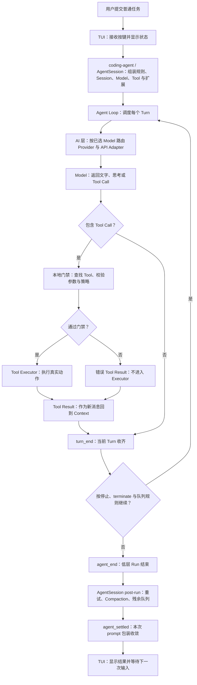
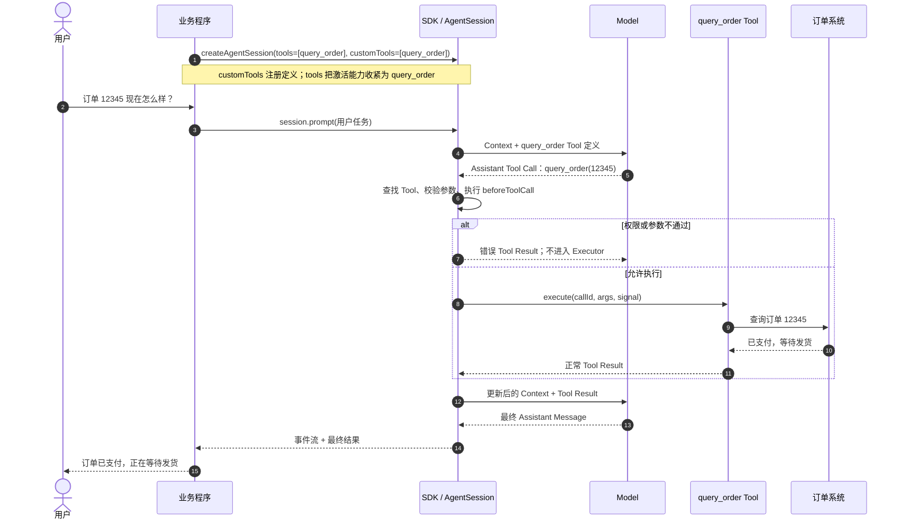
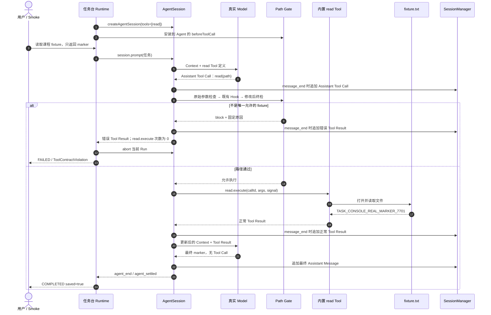
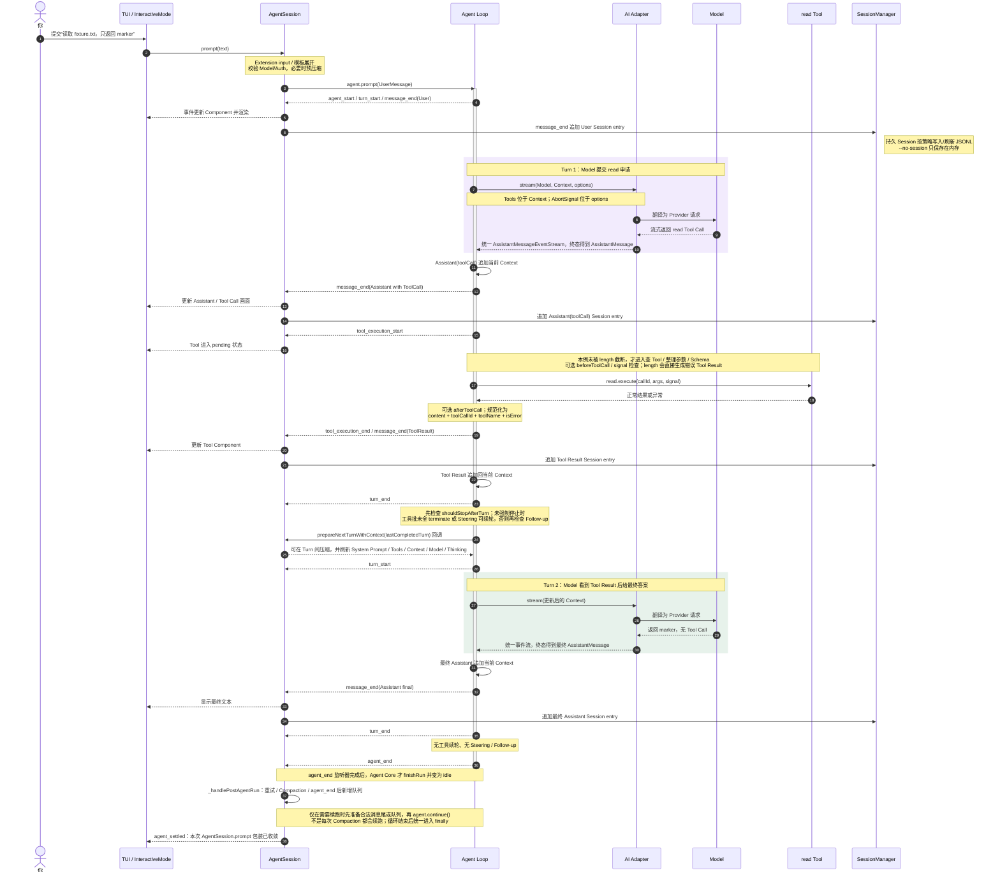
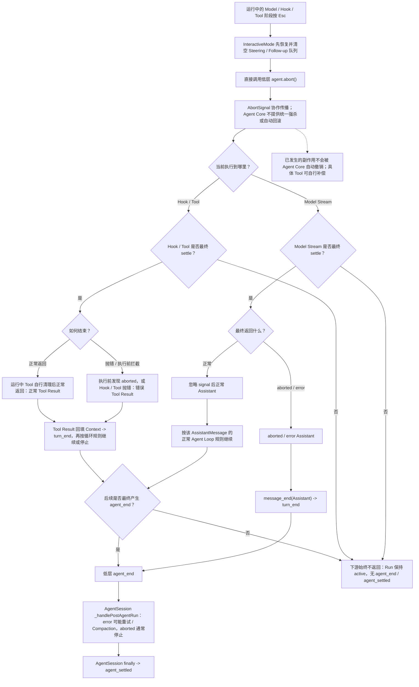
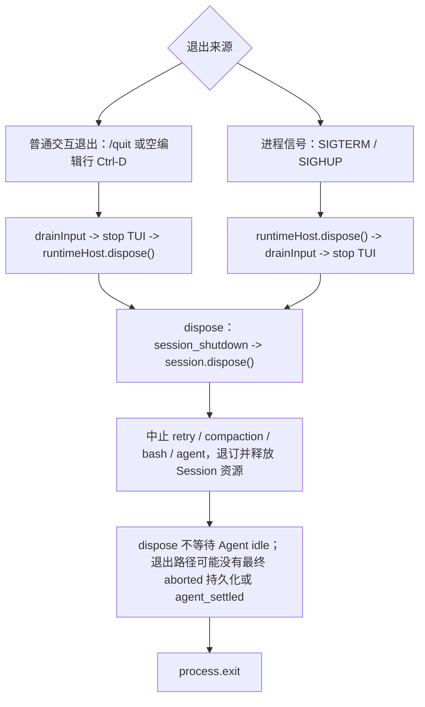
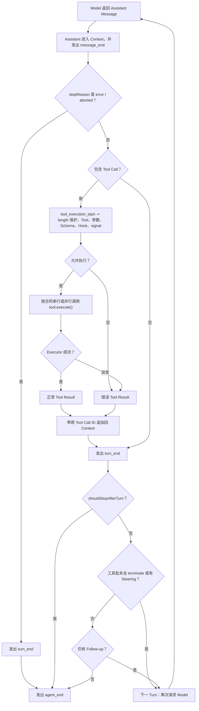
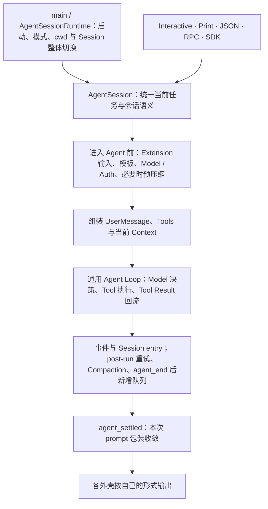
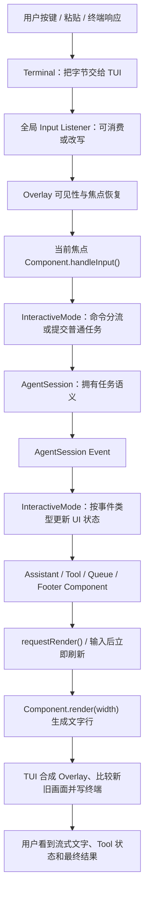
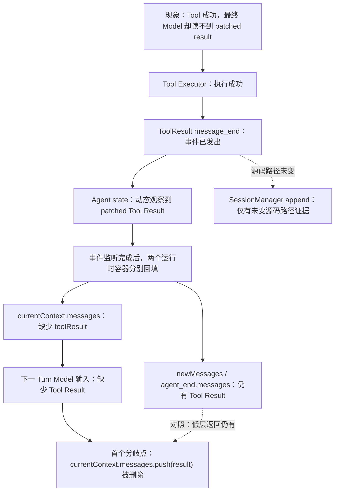

# Pi 源码核心逻辑与综合项目

本文按官方 Pi `v0.84.4`（Commit `b79e4cc834970cca69daebffab7df1da7d1e52c4`）记录源码核心逻辑。源码文件与测试只作为结论的证据坐标；学习目标不是逐行翻译，而是理解 Pi 为什么这样分层、一次任务如何运转以及各层的责任边界。动态进度和验收只见[完整学习计划](../plans/pi-complete-learning-plan.md)。

## Pi 核心不是一次 Model 请求

Pi 的主线是一个受本地程序控制的反馈循环：Model 判断下一步，Pi 校验并调度，Tool 执行真实动作，Tool Result 再交给 Model 判断，直到得到不再请求 Tool 的最终回答。

## 分层职责

| 层 | 大白话职责 | 明确不负责 |
|---|---|---|
| TUI | 把终端输入交给当前焦点组件，并根据事件刷新画面 | 不决定是否调用 Model 或 Tool |
| coding-agent / AgentSession | 把资源、模型、认证、工具、队列、压缩、Extension 和 Session 组装成一个编码 Agent 产品 | 不实现各家 Provider 的线协议，也不重复实现低层 Agent Loop |
| Agent / Agent Loop | 保存本次运行状态，反复执行“Model 响应 -> Tool -> Tool Result -> 下一 Turn” | 不加载项目 Skill、Session JSONL 或具体 TUI |
| AI / Provider Adapter | 根据 Model 的 Provider 与 API 路由请求，把厂商请求和流事件双向翻译为统一格式 | 不决定何时调用 Tool，也不执行 Tool |
| Model | 根据收到的 Context 产生文字、思考或结构化 Tool Call | 不直接访问本地文件、进程或网络 Tool |
| Tool Executor | 在 Pi 进程中执行已经通过本地门禁的真实动作 | 不负责决定业务下一步；执行结果必须回到 Agent Loop |
| SessionManager | 在消息结束后追加用户、Assistant 与 Tool Result 等 Session Entry | Session 已写入与 UI 已看到事件不是同一个时点 |

## 五项核心思想

### 1. 分层职责

TUI 是人机窗口，AgentSession 是当前任务/会话的产品级协调器，Agent Loop 是反馈发动机，AI Adapter 是 Provider 协议翻译器，Model 负责判断，Tool 负责行动，SessionManager 负责记录。任何一层都不替代其他层；Provider SDK 变化被限制在 Adapter，界面变化也不要求重写 Agent Loop。

### 2. 显式能力

Tool Call 只是 Model 提交的结构化申请，不是 Tool 已执行。Pi 仍要检查长度截断、Tool 名称、参数 Schema、可选 Hook 和取消信号；只有进入 `tool.execute()` 才产生真实动作。Model 只看到当前 Context 暴露的 Tool 定义，但仍可能生成未知名称，此时 Core 返回 `Tool not found`；这也不是 OS 沙箱，Executor 权限仍来自 Pi 进程。

### 3. 消息与事件状态

一次 read 主线的消息顺序是 `User -> Assistant(toolCall) -> ToolResult -> Assistant(final)`；Tool Result 通过原 `toolCallId` 对应申请。消息构成 Model 可理解的任务事实，`message_*`、`tool_execution_*`、`turn_*` 和 `agent_*` 事件则把同一事实投影给 TUI、Extension 和 Session。UI 监听器先收到事件，Session entry 随后追加；界面已显示不等于 JSONL 已刷新。

### 4. Session 与 Context

Session 是追加式树状档案，保存消息、模型变化、Compaction、分支和扩展条目；持久模式按策略写入 JSONL，`--no-session` 只保存在内存。Context 是当前 Turn 交给 Model 的快照，只包含当前分支经筛选、转换和 Compaction 后的 `System Prompt + Messages + Tools`。Compaction 改变 Context 视图，不等于删除原 Session 历史。

### 5. 取消与清理

`AbortSignal` 是协作通知，不是强杀，也不提供统一自动回滚；下游可能返回 `aborted/error`、正常返回或一直不 settle。`agent_end` 只表示一次低层 Run 结束；`agent_settled` 表示本次 `AgentSession.prompt()` 的重试、Compaction 和残余队列已收敛。直接 `dispose` 会中止并释放资源，但不等待 Agent idle，退出路径可能没有最终 `agent_settled`。

## SDK 程序如何获得 Tool 能力

程序创建 `AgentSession` 时，用 `customTools` 增加业务 Tool 定义，用 `tools` 对全部可用 Tool 名称设置激活白名单。省略 `tools` 时，默认内置 `read/bash/edit/write` 仍可能与自定义 Tool 一起激活；只允许订单查询时应同时配置 `tools: ["query_order"]`。SDK 把已激活 Tool 的名称、说明和参数 Schema 放入 Model Context；Model 只提交结构化 Tool Call，Agent Loop 负责查找、校验、门禁和调用本地 `execute()`。

| 接入方式 | 适用场景 | 执行位置 |
|---|---|---|
| `tools: ["read"]` | 只激活名为 `read` 的可用 Tool | Pi 进程中的内置 Executor |
| `tools: ["query_order"]` + `customTools: [queryOrder]` | 注册并只激活订单查询 Tool | 业务程序提供的 Executor |

### 自定义业务 Tool 时序

`query_order` 的 Executor 由业务程序实现，因此权限、租户、超时、脱敏和审计也必须由程序负责。SDK 负责调度，不把这个 Executor 变成 OS 沙箱。

### 当前任务台的 read Tool 时序

本任务台的安全来自 `tools=[read]` 与 Path Gate 的组合：前者缩小 Model 可见能力，后者在 Executor 前强制限制唯一文件。真实 Smoke 证明允许分支本次成功；脚本 Model 集成测试以 `read.execute` 次数为 `0` 证明拒绝分支没有进入 Executor。

## 一次完整 read 任务的跨包追踪

固定场景是“读取 `fixture.txt`，只返回 marker”。正常链路按 `User -> Assistant(toolCall) -> ToolResult -> Assistant(final)` 保存消息；取消和退出是独立旁路，不是正常回答之后的下一步。

### 正常主线

### 运行中取消旁路

### 退出与清理旁路

## Agent Loop 里的 Run、Turn 与 Tool 回执

一个 Run 从用户任务进入低层 Agent 开始，到 `agent_end` 结束；一个 Run 可以包含多个 Turn。一个 Turn 是“一次 Model 响应，加上该响应产生的全部 Tool Call 执行与 Tool Result”。

Tool Call 仍可能在真实执行前被拒绝：Model 输出达到长度上限时参数可能被截断；本地可能没有同名 Tool；参数可能不符合 Schema；可选 `beforeToolCall` Hook 或取消信号也可以阻止执行。`tool_execution_start` 在这些检查前发出，用于建立 pending 状态；只有进入 `tool.execute()`，副作用才真正开始。

Executor 抛错、Tool 不存在、参数非法或门禁拒绝都会被规范化为 `isError=true` 的 Tool Result。它作为结构化反馈进入 Context，再由 `shouldStopAfterTurn`、整批 `terminate`、Steering 和 Follow-up 决定是否进入下一 Turn。Tool Result 保留原 `toolCallId`，并行 Tool 才能把每份结果对应回正确申请。

最终 Assistant Message 没有 Tool Call，且没有 Steering 或 Follow-up 时，低层循环发出 `agent_end`。`Agent.abort()` 只发出协作取消信号；Model Stream、Hook 与 Executor 可以响应、忽略后正常返回，也可能一直不 settle。下游 settle 并形成正常、`aborted` 或 `error` AssistantMessage，或形成 Tool Result 后，Core 才按对应循环路径继续或收尾；Agent Core 不自动回滚已发生的副作用。

## AgentSession：当前任务与会话的产品级协调器

AgentSession 可以记作当前 Pi 任务与会话的总协调器，但不是整个进程唯一的总协调器。`main.ts` 与 AgentSessionRuntime 还负责启动、模式选择、cwd/Session 切换和整套服务重建；InteractiveMode、Print/JSON、RPC 与 SDK 负责各自的输入输出外壳。

| 对象 | 所有权边界 |
|---|---|
| `main.ts` / AgentSessionRuntime | 创建 cwd 绑定的服务，选择运行模式，整体替换当前 AgentSession 与 SessionManager |
| AgentSession | 为每次 Prompt 统一资源、认证、Extension、队列、重试、Compaction、事件和持久化语义 |
| 低层 Agent | 只运行准备好的 Model/Tool 反馈循环，不认识项目 Skill、JSONL 或具体界面 |
| SessionManager | 保存、恢复和构建 Session 历史，不负责请求 Model 或执行 Tool |
| Interactive/Print/JSON/RPC/SDK | 接收和展示方式不同，但复用同一个 AgentSession 语义 |

这层分离让外壳可以变化而内核不复制。否则每种模式都要分别实现认证、资源加载、Session、Extension、重试、Compaction 和取消收尾，行为会逐渐漂移。AgentSession 仍不是 OS 沙箱；它决定暴露哪些能力和何时调用低层 Agent，但最终 Tool 权限仍来自 Pi 进程。

## TUI：终端输入与任务事实之间的视觉投影

TUI 负责“人如何操作、事实如何显示”，不拥有 Agent 任务语义。输入从终端向 AgentSession 流动；输出由 AgentSession Event 向终端画面反向流动。

输入先经过终端协议响应、全局 Listener 和 Overlay 焦点恢复；只有当前焦点 Component 收到 `handleInput()`。因此菜单打开时，方向键操作菜单，不会同时进入 Editor 或 Agent。Editor 提交后，InteractiveMode 再判断是 Slash Command、用户 Bash 还是普通 Prompt，只有任务语义才进入 AgentSession。

输出侧由 InteractiveMode 订阅 AgentSession Event：`message_update` 更新流式 Assistant Component，`tool_execution_*` 更新 Tool Component，队列和终态更新对应状态；Component 变化后请求刷新。每个 Component 用 `render(width)` 生成文字行，TUI 合成 Container 与 Overlay，比较新旧画面并写入终端。

这里有三层独立状态：

| 状态层 | 示例 | 所有者 |
|---|---|---|
| 任务事实 | 当前消息、Tool Call、队列、Run 是否结束 | AgentSession / Agent |
| 界面状态 | 哪个菜单获得焦点、Tool 是否展开、流式文字显示到哪里 | InteractiveMode / Component |
| 终端画面 | 当前窗口中的字符、颜色、光标与已写出的行 | TUI / Terminal |

打开 Overlay 不会暂停 Agent Tool；界面看到事件不证明 Session 已持久化；Component 状态也不会自动进入 Model Context。这种分离使 Print、JSON、RPC 和 SDK 可以复用 Agent 核心，也使终端宽度、键盘协议、颜色和差分刷新不污染任务逻辑。

## 受控故障排查报告

结论：在独立 `v0.84.4` clone 中只移除 Tool Result 对 `currentContext.messages` 的回填后，Tool、事件、Agent state 和低层 `newMessages` / `agent_end.messages` 仍包含 Tool Result，唯独当前 Run 的下一 Turn Model Context 缺失，最终 Assistant 因而错误。SessionManager append 路径未被 mutation 触及，但本实验没有动态读取 Session entry 或物理 JSONL。恢复该行后相同测试全部重新通过；这是受控 mutation 的因果证据，不是官方 Pi 原有缺陷。

### 现象与首个分歧点

动态 Green 可以排除 Executor、Tool Hook、事件和 Agent state；源码顺序同时表明 SessionManager append 位于 mutation 之前，但本次未直接读取 Session entry。以上证据都不能证明 Model 输入正确。排查从最终消费者反向检查，第一次从“有 Tool Result”变成“无 Tool Result”的位置，才是根因边界。

### Green / Red / Recovery 矩阵

| 聚焦合同 | Baseline | 单行故障 | 恢复后 |
|---|---|---|---|
| 浅层 Tool 执行、事件与低层 `newMessages` | `1/1 Green` | `1/1 Green` | `1/1 Green` |
| `shouldStopAfterTurn` 收到的当前 Context | `1/1 Green` | Red：`user, assistant`，缺少 `toolResult` | `1/1 Green` |
| coding-agent Faux 下一 Turn 读取 patched result | `1/1 Green` | Red：最终 Assistant 为两个空文本 | `1/1 Green` |

浅层测试在故障态仍 Green，因为它检查的是 Executor、Tool 事件、`afterToolCall` 和 `newMessages`；第二次 Mock Model 无条件返回 `done`，没有读取 Context。Core 测试直接检查 `context.messages`，因此稳定暴露缺失角色。产品测试则把内部缺失投影成最终回答错误。

### 断点观察与根因

Node inspector 只在 loopback 地址监听，并在产品测试失败断言前读取脱敏角色和 `patched` 布尔值：`AgentSession.messages` getter 对应的 Agent state 为 `user -> assistant -> toolResult(patched=true) -> assistant`；同一故障下，Core 回调的 Context 只有 `user -> assistant`。

源码中两个容器职责不同：

| 容器 | 职责 | 故障态 |
|---|---|---|
| `newMessages` | 汇总本次 Run 新消息，成为 `agent_end.messages` 与低层返回值 | 仍包含 Tool Result |
| `Agent.state.messages` | 保存低层 Agent 通过消息事件观察到的事实 | 动态观察到 patched Tool Result |
| SessionManager entry | AgentSession 在 `message_end` 后追加会话条目 | 源码路径未变；未动态读取 entry |
| `currentContext.messages` | 组装同一 Run 下一 Turn 实际交给 Model 的消息 | 唯一缺少 Tool Result |

根因不是 Tool 未执行、Hook 未修改或 Agent state 未更新，而是同一 Tool Result 没有进入下一 Turn 使用的工作 Context。SessionManager append 仍有源码路径证据，但不能据此声称本次已验证 Session entry 或 JSONL。

### 恢复与边界

恢复唯一删除行后，clone diff 和状态为空，目标文件哈希回到官方基线，三项聚焦测试全部 Green；官方源码的 HEAD、状态和源文件哈希全程不变。确认无调试监听、测试进程或文件占用后，独立实验根已整体移入废纸篓，原临时路径消失，可按需恢复。实验没有联网、读取凭据、调用真实 Provider、暂存、提交或推送。

该证据只覆盖固定 Faux、内存 Session、单 Tool、小 Context 和三项聚焦测试；不证明真实 JSONL 已落盘、真实 Provider HTTP Payload、内置 `read`、Compaction、并行 Tool、取消、完整测试套件或生产行为。它也不证明官方 `v0.84.4` 存在 Tool Result 丢失缺陷。

## 源码证据坐标

| 结论 | 固定源码证据 |
|---|---|
| Component 只定义按宽度渲染文字行和可选输入处理 | [`packages/tui/src/tui.ts`](https://github.com/earendil-works/pi/blob/v0.84.4/packages/tui/src/tui.ts#L24) |
| TUI 经过 Listener、Overlay/焦点后把输入交给当前 Component | [`packages/tui/src/tui.ts`](https://github.com/earendil-works/pi/blob/v0.84.4/packages/tui/src/tui.ts#L826) |
| main 创建 cwd 绑定服务并把同一 Runtime 交给不同运行模式 | [`packages/coding-agent/src/main.ts`](https://github.com/earendil-works/pi/blob/v0.84.4/packages/coding-agent/src/main.ts#L712) |
| AgentSessionRuntime 持有当前 Session 与 cwd 服务并支持整体重建 | [`agent-session-runtime.ts`](https://github.com/earendil-works/pi/blob/v0.84.4/packages/coding-agent/src/core/agent-session-runtime.ts#L68) |
| Interactive 主循环取得普通输入并调用 AgentSession | [`interactive-mode.ts`](https://github.com/earendil-works/pi/blob/v0.84.4/packages/coding-agent/src/modes/interactive/interactive-mode.ts#L1182) |
| InteractiveMode 订阅 AgentSession Event 并映射成界面状态 | [`interactive-mode.ts`](https://github.com/earendil-works/pi/blob/v0.84.4/packages/coding-agent/src/modes/interactive/interactive-mode.ts#L3173) |
| 流式 Assistant 与 Tool 执行事件更新各自 Component | [`interactive-mode.ts`](https://github.com/earendil-works/pi/blob/v0.84.4/packages/coding-agent/src/modes/interactive/interactive-mode.ts#L3258) |
| AgentSession 完成输入拦截、模板展开、模型/认证校验与 UserMessage 组装 | [`agent-session.ts`](https://github.com/earendil-works/pi/blob/v0.84.4/packages/coding-agent/src/core/agent-session.ts#L1160) |
| 低层循环请求 Model、执行 Tool 并把 Tool Result 放回 Context | [`agent-loop.ts`](https://github.com/earendil-works/pi/blob/v0.84.4/packages/agent/src/agent-loop.ts#L156) |
| Assistant(toolCall) 与 Tool Result 分别在 `turn_end` 前进入消息、事件和 Context | [`agent-loop.ts`](https://github.com/earendil-works/pi/blob/v0.84.4/packages/agent/src/agent-loop.ts#L211) |
| Tool Call 只有通过本地分流后才进入串行或并行执行 | [`agent-loop.ts`](https://github.com/earendil-works/pi/blob/v0.84.4/packages/agent/src/agent-loop.ts#L409) |
| Executor 结果与异常都被规范化为带原 ID 的 Tool Result Message | [`agent-loop.ts`](https://github.com/earendil-works/pi/blob/v0.84.4/packages/agent/src/agent-loop.ts#L758) |
| Agent 取消通过本次 Run 的 AbortSignal 协作传播 | [`agent.ts`](https://github.com/earendil-works/pi/blob/v0.84.4/packages/agent/src/agent.ts#L319) |
| AI 层按 Model 路由 Provider、认证与流式 Adapter | [`models.ts`](https://github.com/earendil-works/pi/blob/v0.84.4/packages/ai/src/models.ts#L667) |
| 不同 Provider 统一为同一 Assistant Message 事件协议 | [`types.ts`](https://github.com/earendil-works/pi/blob/v0.84.4/packages/ai/src/types.ts#L527) |
| AgentSession 先分发事件，再在 `message_end` 追加 Session entry | [`agent-session.ts`](https://github.com/earendil-works/pi/blob/v0.84.4/packages/coding-agent/src/core/agent-session.ts#L667) |
| SessionManager 从当前分支构建 Compaction-aware Model Context | [`session-manager.ts`](https://github.com/earendil-works/pi/blob/v0.84.4/packages/coding-agent/src/core/session-manager.ts#L461) |
| AgentSession 固定的 Turn 间回调可压缩并刷新 Prompt、Tools、Context 与 Model | [`agent-session.ts`](https://github.com/earendil-works/pi/blob/v0.84.4/packages/coding-agent/src/core/agent-session.ts#L568) |
| AgentSession 完成后续恢复后才发出 `agent_settled` | [`agent-session.ts`](https://github.com/earendil-works/pi/blob/v0.84.4/packages/coding-agent/src/core/agent-session.ts#L1106) |
| Interactive 普通退出与信号退出采用不同的 TUI/Runtime 清理顺序 | [`interactive-mode.ts`](https://github.com/earendil-works/pi/blob/v0.84.4/packages/coding-agent/src/modes/interactive/interactive-mode.ts#L3939) |
| Runtime dispose 发出 shutdown 后直接释放 Session，不等待 Agent idle | [`agent-session-runtime.ts`](https://github.com/earendil-works/pi/blob/v0.84.4/packages/coding-agent/src/core/agent-session-runtime.ts#L398) |
| SDK 创建低层 Agent 后再用 AgentSession 包装产品语义 | [`sdk.ts`](https://github.com/earendil-works/pi/blob/v0.84.4/packages/coding-agent/src/core/sdk.ts#L388) |

## 毕业综合项目讲解路径

8.8 把本仓库已有资产收口为两个工作面，而不是强行合并 Runtime。7.7 SDK 任务台是默认安全入口，以 `tools=[read]` 和精确 fixture Path Gate 限制任务能力；根 `pi-study-workbench` Package 是显式 opt-in 的完整交互入口，复用项目规则、Prompt、Skill、Theme 与 Extension，但仍拥有 Pi 进程的当前用户权限。完整架构、版本矩阵、安装步骤、自动门禁和逐项手工清单只在[毕业项目运行手册](../../labs/8.8-capstone/README.md)维护。

讲解时按一条连续证据链展开：

| 顺序 | 入口 | 要说明的核心问题 | 证明边界 |
|---:|---|---|---|
| 1 | [双入口架构](../../labs/8.8-capstone/README.md#双入口架构) | 为什么 SDK 默认、Package opt-in，为什么两者不共用安全等级 | 架构合同不等于动态运行证据 |
| 2 | [一次完整 read 任务](#一次完整-read-任务的跨包追踪) | Model、门禁、Executor、Tool Result、Context、Session 与 UI 如何串起来 | 固定 `v0.84.4` 源码坐标不替换 Lab 的运行版本 |
| 3 | [受控故障排查报告](#受控故障排查报告) | 为什么浅层 Tool Green 仍可能漏掉下一 Turn Context，如何寻找首个分歧点 | Faux/内存 Session 的单行 mutation 不证明官方缺陷或真实 Provider 行为 |
| 4 | [统一离线门禁](../../labs/8.8-capstone/README.md#统一离线门禁) | Extension、Package、SDK、结构、敏感模式和残留分别检查什么 | PASS 不证明真实 Model、费用、手工演示或生产安全 |
| 5 | [Git 冻结与提交门禁](../../labs/8.8-capstone/README.md#6-git-冻结与提交门禁) | 为什么文件存在、测试、Smoke、Commit 和 Push 是不同证据 | 未冻结候选 SHA、未核对完整文件集或工作区不净时不得宣称交付完成 |

源码导读从正常 read 的四消息顺序开始，再用排查报告展示“消息已经在某些容器中出现”为什么不等于“下一消费者已经收到”。这样能同时解释架构、失败定位和测试设计，不需要逐文件翻译源码，也不把某条命令退出 `0` 当成端到端正确。

## 当前证据边界

结论来自固定 `v0.84.4` 官方源码、同版发布模型数据、本机离线构建和隔离无 Key 测试，以及跨包只读源码复核。完整时序固定描述“初始化完成、空闲、普通 read 文本任务”；Steering/Follow-up、Compaction、自动重试、取消和退出只覆盖决定主线边界所需的合同，不替代各自完整算法或动态实验。Slash Command、用户 Bash、全部 Provider Adapter 分支、被跳过的 LLM 测试、真实 Provider、费用、其他操作系统和生产行为均未由本节证明。

毕业项目文档与统一离线门禁只形成当前工作区候选证据，不会自动冻结 Git。只有唯一计划记录完整验收、候选文件集与 Commit SHA 经过最终外部门禁、授权提交后的工作区状态符合预期，并由学习者完成讲解验收，8.8 才能标记完成；文档存在本身不是完成证据。
