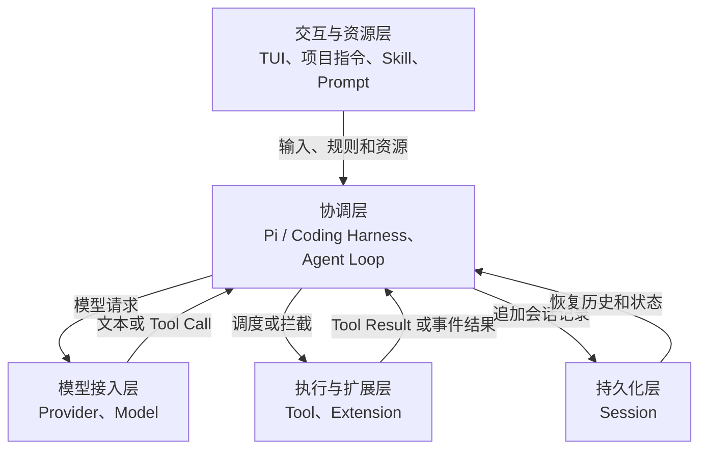
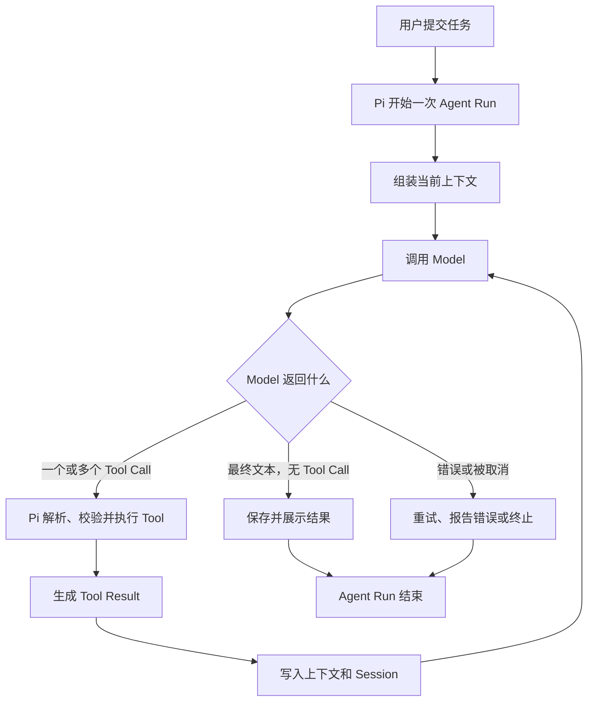
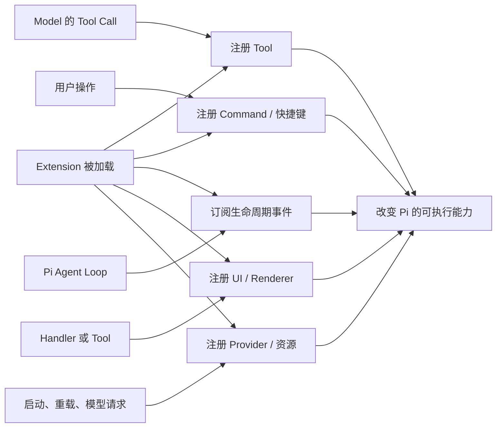
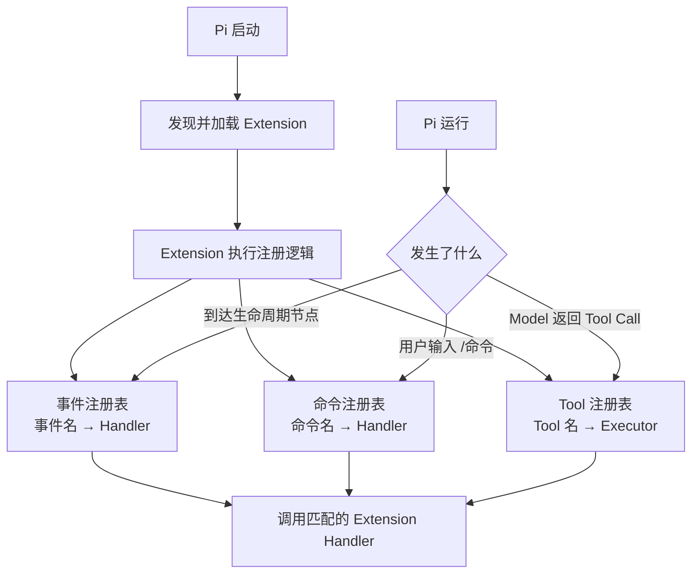
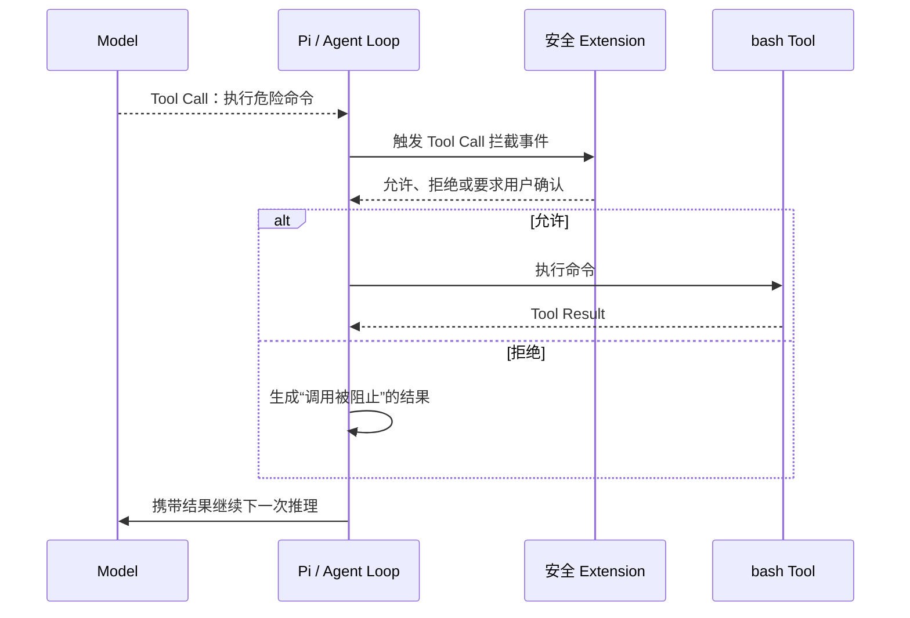
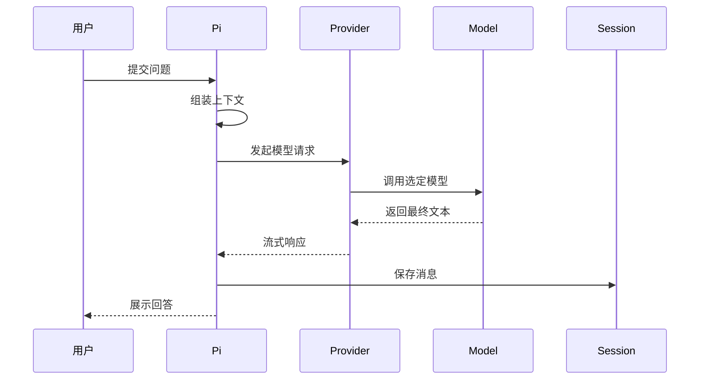
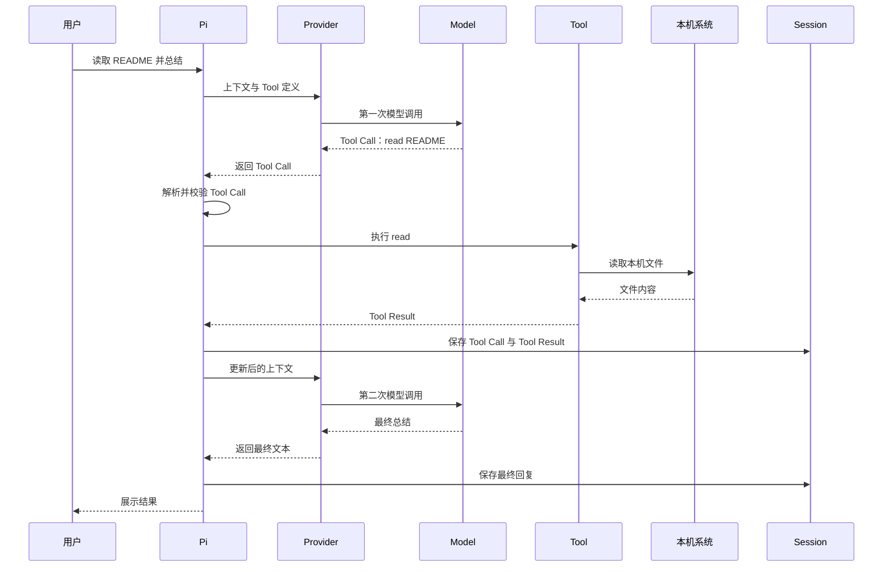
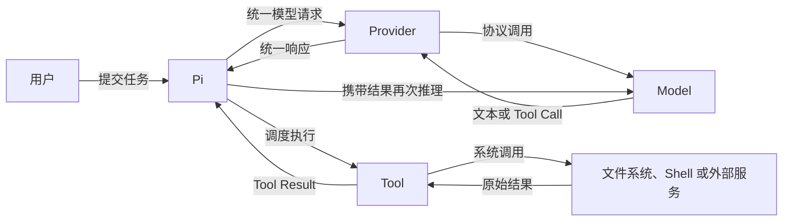

# Pi 学习笔记

这份文档记录学习过程中已经讲解的概念、命令和安全边界，并持续更新。进度与验收状态以 `docs/plans/pi-complete-learning-plan.md` 为准；本机证据以 `docs/learning/00-environment-report.md` 为准。

## 1. 当前学习环境

| 项目 | 当前选择 |
|---|---|
| Pi | `0.82.1` |
| Provider | `openai`；课程中视为官方模型能力已完整接入 |
| API | `openai-responses` |
| Model | `gpt-5.6-sol` |
| Base URL | `https://sub2api.shelfcanvas.top`，不添加 `/v1` |
| 凭据 | 由 Pi 保存在 `~/.pi/agent/auth.json`，文件权限为 `0600` |

API Key 不写入项目文档、Git 仓库或聊天记录。

课程约定：底层中转不作为学习、验收或阻塞项；学习调用费用不设上限，无需逐次确认。Base URL 仅作为当前环境的可复现配置保留。

## 2. 基础工具

| 对象 | 作用 | 记忆方式 |
|---|---|---|
| Node.js | 运行 Pi、SDK 和 TypeScript Extension | 负责运行 |
| npm | 下载、安装和更新 Pi 及依赖 | 负责安装和管理 |
| Git | 记录项目版本、查看差异、建立检查点和回滚 | 保存项目历史 |
| 独立仓库 | 隔离学习修改与业务代码，降低误操作影响 | 限制练习范围 |

“程序能运行”只证明当前状态可以执行，不代表修改过程可追溯，也不代表失败后可以恢复。代码恢复依赖 Git。

独立仓库不是沙箱。Pi 仍继承当前系统用户权限，理论上可以访问仓库外的路径。

## 3. Pi 是什么

Pi 是极简的 Coding Agent Harness，不是空壳。它负责连接模型、组织对话、调用工具、保存 Session，并提供扩展入口。

当前内置工具：

- `read`：读取文件。
- `bash`：执行 Shell 命令。
- `edit`：按指定范围修改文件。
- `write`：创建或覆盖文件。
- `grep`：搜索文件内容。
- `find`：查找文件。
- `ls`：列出目录内容。

Pi 没有内置沙箱。`bash`、`edit` 和 `write` 可以产生真实修改，因此重要操作前仍需检查工作目录、Git 状态和命令影响范围。

### 输入类型与退出

| 输入形式 | Pi 的处理方式 | 示例 |
|---|---|---|
| 普通文字 | 作为用户消息发送给模型 | `exit` 只会让模型回复，不会退出 Pi |
| `/命令` | 由 Pi 自身执行 | `/quit`、`/model`、`/session` |
| `!命令` | 执行 Shell，并把输出发送给模型 | `!pwd` |
| `!!命令` | 执行 Shell，但不把输出发送给模型 | `!!git status` |

退出 Pi：

1. 输入 `/quit` 并回车，这是最明确的方式。
2. 输入框为空时按 `Ctrl+D`。
3. 连续按两次 `Ctrl+C`；第一次通常用于清空输入框。

在输入框中键入 `exit`、`quit` 或“再见”都属于普通消息，不会终止 Pi 进程。

## 4. Pi 架构心智模型

Pi 是协调者，Model 是推理者，Tool 是执行者，Session 是记录，Extension 用来改变或增加协调能力。

### 0.2 系统学习路线

| 单元 | 主题 | 验收重点 |
|---|---|---|
| 0.2.1 | 整体分层与职责边界 | 区分 Pi、Model 和 Tool |
| 0.2.2 | 上下文组装 | 说清模型一次调用能看到什么 |
| 0.2.3 | Provider 与 Model | 说清连接层与推理层的区别 |
| 0.2.4 | Agent Loop | 画出 Turn、Tool Call 和 Tool Result 循环 |
| 0.2.5 | Tool 系统 | 说明谁决定、谁校验、谁执行、谁承担权限 |
| 0.2.6 | Extension | 标出扩展的注册点和拦截点 |
| 0.2.7 | Session 与上下文 | 区分持久记录、当前上下文、永久记忆和 Git |
| 0.2.8 | 端到端追踪 | 跟踪真实只读请求并独立画图 |

### 0.2.1 整体分层与职责边界

Pi 不是 Model 的别名。Pi 是运行在本机的协调程序；Model 是 Pi 通过 Provider 调用的推理服务；Tool 是被 Pi 调度的执行能力。

#### 五层架构



| 层次 | 核心职责 | 关键限制 |
|---|---|---|
| 交互与资源层 | 接收用户输入，加载任务规则和可复用资源 | 资源影响模型输入，但不会自行执行任务 |
| 协调层 | 组装上下文、调用模型、解析响应、调度工具、控制循环和展示结果 | 默认不承担大模型式语义推理 |
| 模型接入层 | Provider 处理连接与协议；Model 进行推理并生成文本或 Tool Call | Model 只能看到 Pi 传入的上下文 |
| 执行与扩展层 | Tool 执行具体操作；Extension 注册或拦截能力 | 运行权限来自 Pi 进程和当前系统用户 |
| 持久化层 | 保存消息、工具调用、结果、模型信息和会话树 | Session 不是 Git 快照或模型永久记忆 |

#### 核心对象

| 对象 | 职责 | 不负责什么 |
|---|---|---|
| Coding Harness | 接收输入、组装上下文、连接模型、调度工具、展示结果并保存会话；Pi 就是 Harness | 不等同于模型本身 |
| Provider | 把 Pi 的统一请求转换为特定模型服务的 API 调用，并接收流式响应 | 不决定具体任务目标 |
| Model | 根据上下文推理，生成文字或 Tool Call | 不直接读写本机文件或执行 Shell |
| Agent Loop | 在“调用模型”和“执行工具”之间循环，直到模型给出最终回复或流程终止 | 不是单独安装的组件 |
| Tool | 执行一次具体操作，并返回 Tool Result | 不自行决定整个任务流程 |
| Extension | 注册或拦截工具、命令、事件和 UI，改变 Pi 的行为 | 不是模型，也不是 Session |
| Session | 持久化消息、Tool Call、Tool Result、模型信息和会话树 | 不是 Git 快照，也不是模型永久记忆 |

#### Agent Loop 是运行流程

Agent Loop 不是需要单独安装的组件，也不是另一个大模型。它是 Pi 内部反复执行的控制流程：调用 Model，检查响应，必要时执行 Tool，再把 Tool Result 交给 Model，直到流程结束。



- `Agent Run`：从一次用户任务开始，到最终回复、取消或失败为止的完整运行。
- `Turn`：一次 Model 响应，以及该响应触发的 Tool 执行和 Tool Result。
- 一次不使用 Tool 的 Agent Run 通常只有一个 Turn。
- 一次使用 Tool 的 Agent Run 通常包含多个 Turn，因为 Tool Result 返回后需要再次调用 Model。

#### Agent Loop 与 ReAct 的关系

Pi 的工具循环在结构上类似 ReAct：Model 推理并提出 Action，Tool 执行 Action，Tool Result 成为 Observation，Model 再继续推理。但两者不是同一个概念：

| 概念 | 含义 |
|---|---|
| Agent Loop | Pi 的运行控制流程，负责模型调用、Tool 调度、结果回传和终止判断 |
| ReAct | 将推理、行动和观察交替组织的一种 Agent 范式 |

Model 通过返回最终文本或 Tool Call 表达下一步。Pi 不替 Model 做任务语义判断，而是识别响应类型并执行确定性调度。Tool Call 仍需经过 Tool 查找、参数校验、已注册的事件 Handler 和实际执行；Extension Handler 可以介入但不是必需。Session 保存会话历史和运行记录，不是 Model 的永久记忆。

#### Extension 是可执行插件

Extension 是被 Pi 加载的 TypeScript 模块。它可以向 Pi 注册能力，也可以监听或拦截 Agent Loop 中的事件。Extension 默认不会调用大模型，但它可以通过自定义代码主动调用模型或外部服务。

Extension 是可选插件层。没有 Extension，Pi 仍能调用 Model、运行 Agent Loop、使用内置 Tool、管理 Session 和提供基础 TUI；加入 Extension 后，Pi 才获得面向特定团队或业务的定制能力。它对 Pi Core 不是必需依赖，但对危险命令审批、自定义 Tool 等具体需求可能是必需依赖。

并不是所有 Tool 都由 Extension 注册。Tool 有三种主要来源：

| Tool 来源 | 谁负责提供 | 是否需要 Extension |
|---|---|---|
| Pi 内置 Tool | Pi Core，例如读文件、Shell 和文件编辑能力 | 不需要 |
| SDK 自定义 Tool | 嵌入 Pi 的宿主程序通过 SDK 直接传入 | 不需要 |
| CLI 自定义 Tool | Extension 通过 `registerTool` 注册 | 通常需要 |

Pi Package 是分发载体，不是第四种 Tool 运行机制。一个 Package 如果提供自定义 Tool，通常是因为它包含了负责注册 Tool 的 Extension。

Extension 没有一个固定的“能力总数”，因为 API 会随版本演进。按职责可以归纳为九类：

| 能力类别 | 能做什么 | 典型触发者 |
|---|---|
| Tool 扩展 | 注册新 Tool、动态启停 Tool、包装或覆盖内置 Tool、自定义参数校验和结果渲染 | Model 产生 Tool Call，Pi 按名称调度 |
| 命令与输入 | 注册 Slash Command、快捷键、CLI Flag、自动补全；转换或直接处理用户输入 | 用户输入、快捷键或启动参数 |
| Agent 与上下文 | 监听 Agent、Turn、消息事件；在调用 Model 前注入消息、调整系统提示或筛选上下文 | Pi 的 Agent Loop |
| Tool 与 Shell 门禁 | 在 Tool 执行前修改参数或阻止调用，在执行后修改结果；拦截用户的 `!` Shell | Pi 的工具调度流程 |
| Session 与状态 | 监听启动、恢复、Fork、Tree、Compaction 和退出；保存扩展状态、设置会话名称或标签、自定义摘要 | Session 生命周期 |
| Model 与 Provider | 切换 Model 和 Thinking Level；注册、覆盖、刷新或移除 Provider；检查请求和响应 | 用户选择或 Provider 请求链路 |
| UI 与渲染 | 显示确认框、输入框、通知、状态、Widget、Footer；替换编辑器；渲染 Tool、消息和自定义条目 | 已触发的 Handler 或 Tool |
| 资源与生命周期 | 追加 Skill、Prompt、Theme 路径；响应热重载；启动和释放长期资源 | Pi 启动、重载和关闭 |
| 外部集成 | 执行进程、访问网络、监听文件、触发 CI/Webhook，并通过事件总线与其他 Extension 通信 | Extension 自己的代码或外部事件 |

Extension 与 Tool 的区别：Tool 是一次可调用操作；Extension 是插件容器，一个 Extension 可以注册多个 Tool、Command 和事件处理器，也可以完全不注册 Tool。

内置 Tool 的执行由 Pi Core 调度。`tool_call` 是 Core 预留的检查点：没有注册 Handler 时继续执行；有 Handler 时按注册逻辑检查、修改、允许或阻止。Extension 可以注册新的 Tool，但这不代表所有 Tool 都依赖 Extension。

用 Spring 类比时，Extension 更接近“插件模块或 Starter”，不只是拦截器：

| Pi 概念 | 接近的 Spring 概念 | 边界 |
|---|---|---|
| 整个 Extension | Starter、Configuration 或插件模块 | 负责注册一组能力和生命周期逻辑 |
| `tool_call` 等事件 Handler | Interceptor、Filter 或 AOP Advice | 只负责在特定节点观察、修改、阻止或补充行为 |
| 自定义 Tool | 一个对 Model 暴露的可调用服务入口 | 触发者主要是 Model，不是 HTTP 请求 |
| Slash Command | 面向用户的命令入口 | 由用户明确输入命令触发，不需要 Model 决策 |

所以“Extension 像拦截器”只描述了它的事件拦截能力。更完整的理解是：**Extension 是插件容器，拦截器只是它能够注册的一类组件。**



需要特别注意：Extension 是本地可执行代码，拥有 Pi 进程和当前系统用户的权限。它能实现权限门禁，也能绕过门禁直接读文件、执行命令或访问网络，因此“安装了安全 Extension”不等于获得了系统级沙箱。

#### Pi 如何触发 Extension

Pi 不会让 Model 猜测是否需要启动某个 Extension。Pi 启动时先加载 Extension 模块，Extension 随即把自己关心的事件、Tool 和 Command 注册到 Pi；运行过程中，Pi 按名称和固定生命周期节点进行确定性匹配。

| 注册方式 | 触发者 | 触发条件 |
|---|---|---|
| 事件处理器 | Pi Core | Agent Loop 到达已注册的生命周期节点，例如 Session 启动或 Tool Call 即将执行 |
| Slash Command | 用户 | 用户输入与已注册命令名匹配的 `/命令` |
| 自定义 Tool | Model 间接触发、Pi 实际调度 | Model 返回与已注册 Tool 名匹配的 Tool Call |
| UI 或状态逻辑 | Extension 自己 | 已触发的事件、命令或 Tool 处理器继续调用 UI 或状态 API |



因此，“触发 Extension”通常包含两个阶段：

1. **加载阶段**：Pi 找到 Extension 文件并执行一次注册逻辑。
2. **运行阶段**：Pi 根据事件名、命令名或 Tool 名调用已经登记的处理器。

Extension 本身通常在启动时已经加载。后续被触发的不是整个文件重新加载，而是其中注册的 Handler、Command 或 Tool Executor。

危险 Shell 命令被 Extension 拦截的流程：



上图只覆盖 Model 发起的 `bash` Tool Call。`user_bash` 是 Pi 在用户输入 `!命令` 或 `!!命令` 时触发的 Extension 事件：Shell 命令仍由 Pi 接收和执行，但绕过 Model 决策与 Tool Call 流程。要保护所有 Shell 入口，需要分别处理：

| Shell 入口 | 对应事件 | 门禁重点 |
|---|---|---|
| Model 请求 `bash` Tool | `tool_call` | 先确认 Tool 名为 `bash`，再判断命令是否危险；执行前允许或阻止 |
| 用户直接输入 `!命令` 或 `!!命令` | `user_bash` | 单独检查用户 Shell；它不会经过 `tool_call` |

`!命令` 的输出会加入模型上下文；`!!命令` 的输出不会加入模型上下文。两者都会触发 `user_bash`，Extension 可以检查命令与当前目录，也可以替换 Shell 后端或直接返回执行结果。

交互模式可以询问用户；无 UI 模式无法弹出确认框，应预先规定默认拒绝或其他明确策略。只有 Extension 已加载、正确识别危险命令并覆盖对应入口时，才能保证门禁生效。

在这张图中，Agent Loop 是整条工作流程；Extension 是流程中的一个可插入检查点。后续 `0.2.4` 会深入 Agent Run、Turn 和停止条件，阶段 5 会实际开发并验证 Extension。

#### 不需要工具的流程

用户询问当前上下文已经足够回答的问题时，只需要一次模型调用。



#### 需要工具的流程

当模型缺少文件内容或需要执行动作时，会先生成 Tool Call。Tool Result 回到上下文后，Pi 再调用一次 Model。



#### 三个边界

| 边界 | 准确含义 | 判断方法 |
|---|---|---|
| Model 与 Tool：推理/执行边界 | Model 只生成文本或 Tool Call；Pi 调度 Tool；Tool 才真正访问文件、Shell 或外部系统 | 看到 Tool Call 时，不能认为操作已经执行；必须继续看到 Tool Result |
| Pi 与 Model：协调/推理边界 | Pi 负责确定性流程控制和状态管理；Model 负责概率性的语义理解与下一步建议 | Pi 可以在没有 Model 时加载配置和 Session，但不能自主完成语义任务 |
| Tool 与操作系统：项目/权限边界 | Tool 在 Pi 进程下运行，继承当前用户权限；工作目录和 Git 仓库只是操作范围约定 | 独立仓库可以隔离版本历史，但不会阻止 Tool 访问仓库外路径 |

#### 谁调用谁



默认情况下只有 Pi 调用 Model。Model 是被调用的大模型；内置 Tool 不调用大模型。自定义 Tool 可以主动调用其他模型或服务，但那是 Tool 自己的实现，不是默认架构。

#### 常见误解

| 误解 | 正确理解 |
|---|---|
| Pi、Model、Tool 都会调用大模型 | 默认只有 Pi 通过 Provider 调用 Model |
| Model 返回 Tool Call 就表示已经执行 | Tool Call 只是结构化请求，执行后还必须产生 Tool Result |
| Model 可以直接看到整个仓库 | Model 只能看到 Pi 放入上下文的内容和后续 Tool Result |
| Pi 就是大模型客户端外壳 | Pi 还负责资源加载、Agent Loop、工具调度、Session、TUI 和扩展机制 |
| 在独立仓库运行就是沙箱 | 独立仓库隔离 Git 历史，不限制当前用户的系统权限 |

## 5. MCP 与 Subagent

Pi 刻意不内置 MCP 和 Subagent，它们不是安装后的必备组件。

| 能力 | Pi 的实现方式 | 何时引入 |
|---|---|---|
| MCP | 通过 Extension 或 Package 接入 | 出现明确的外部系统调用需求后 |
| Subagent | 通过 Extension、Package、独立 Pi 进程或 tmux 实现 | 掌握工具、Session、费用和并发写入风险后 |

过早引入的主要成本：

- MCP 增加网络访问、凭据管理和数据共享边界。
- Subagent 增加模型调用费用、上下文复杂度和并发写文件冲突。
- 工具过多会增加模型选择错误工具的概率。

当前顺序：先掌握内置工具和 Session，再学习 Skill、Extension 与 Package，最后按真实需求引入 MCP 或 Subagent。

## 6. Session

Session 是 Pi 自动保存在本机的一次工作会话记录，不是模型的永久记忆，也不是项目版本快照。Session 以启动 Pi 时的工作目录作为项目作用域。

所有项目的 Session 根目录：

```text
~/.pi/agent/sessions/
```

Pi 会把工作目录编码为子目录。当前 `pi-study` 项目的实际目录是：

```text
~/.pi/agent/sessions/--Users-sxie-xbk-pi-study--/
```

这表示 Session 属于 `/Users/sxie/xbk/pi-study` 这个工作目录，但文件保存在用户目录中，不在 Git 仓库内。换到其他项目启动 Pi，会使用另一个项目分组目录。

Session 通常包含：

- 用户消息和模型回复。
- Tool Call、工具参数和 Tool Result。
- 使用的 Provider、Model 和会话元数据。
- Token、费用、分支和上下文压缩相关记录。

### 继续当前项目的 Session

先进入曾经启动 Pi 的项目目录，再执行恢复命令：

```bash
cd /Users/sxie/xbk/pi-study
pi -c
```

`pi -c` 会继续当前项目最近一次 Session。在其他目录执行，会查找那个目录对应的 Session，而不是 `pi-study` 的记录。

其他常用命令：

| 命令 | 含义 |
|---|---|
| `pi -c` | 继续当前项目最近一次 Session |
| `pi -r` | 浏览并选择当前项目的历史 Session |
| `pi --no-session` | 临时会话，不保存记录 |
| `/session` | 查看当前 Session 文件、ID、消息、Token 和费用 |
| `/resume` | 在 Pi 内选择当前项目的历史 Session |
| `/new` | 新建 Session |
| `/tree` | 查看并跳转会话树节点 |
| `/fork` | 从较早的用户消息创建新 Session |
| `/clone` | 将当前活动分支复制为新 Session |

### Session 与 Git

| 对象 | 保存内容 | 能否恢复项目文件 |
|---|---|---|
| Session | 对话、工具调用、工具结果和会话结构 | 不能可靠恢复 |
| Git | 项目文件的版本和差异 | 可以 |

Session 可能包含读取过的文件内容、命令输出和其他敏感信息，不应默认提交、上传或公开分享。

## 7. 当前验证边界

已验证：

- Pi `0.82.1` 可以启动和退出。
- `openai/gpt-5.6-sol` 可以通过当前中转站响应。
- API Key 已保存，凭据文件权限为 `0600`。
- Pi 可以执行只读 Shell 命令。
- 首次 Session 已自动保存。

尚未验证：

- 文件读取、编辑、写入和回滚的完整流程。
- Project Trust、危险命令控制和 Prompt Injection 防护。
- Session 恢复、Tree、Fork、Clone 和 Compaction。
- 图片输入、全部快捷键及长会话稳定性。
- Skill、Extension、Package、MCP 和 Subagent。

模型接入、底层数据处理和计费链路不再列入待验证范围；课程统一以模型能力已经完整可用为前提。

## 8. 官方资料

- `https://pi.dev/docs/latest/quickstart`
- `https://pi.dev/docs/latest/usage`
- `https://pi.dev/docs/latest/sessions`
- `https://pi.dev/docs/latest/models`
- `https://pi.dev/docs/latest/security`
