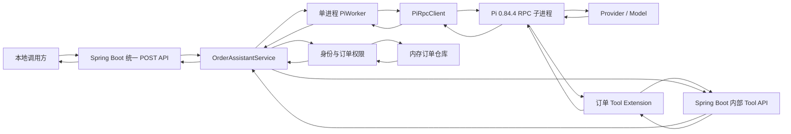
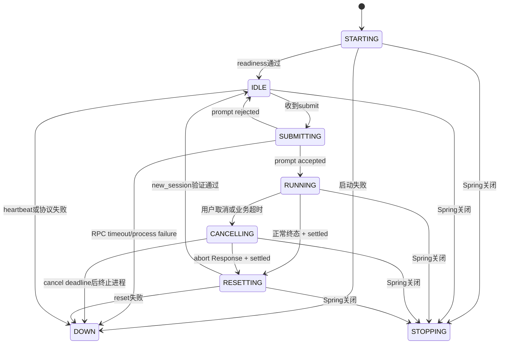

# Spring Boot + Pi 订单查询助手技术方案

> 研究日期：2026-09-01
> 修订目标：实现一个有完整学习价值、但不按生产平台复杂度建设的 Spring Boot + Pi RPC Demo。
> 当前状态：技术方案已按“教学型完整闭环”收敛；尚未编码、运行测试或调用真实 Provider。
> 本次设计只依赖 Pi `0.84.4` 的固定 RPC 与 Extension 合同，不复用本仓库其他 Java 实现。

## 1. 项目定位

本项目不是一次性的 Hello World，也不是生产级 Agent 平台。它需要完整展示 Java 与 Pi 的主要集成边界，同时控制并发、安全和构建复杂度。

### 1.1 必须学到的内容

1. Java 使用 `ProcessBuilder` 启动和管理长驻 Pi 子进程。
2. Java 通过 stdin/stdout 使用 Pi RPC 的 LF JSONL 协议。
3. 区分 Command Response、流式 Event 和最终 `agent_settled`。
4. 使用 Pi Extension 注册三个自定义业务 Tool。
5. Extension 通过 loopback HTTP 调用 Spring Boot 业务能力。
6. Java 管理单活动 Agent 任务、状态查询、取消和超时。
7. 使用 `new_session` 清理跨任务内存上下文。
8. 使用真实 Pi + Fake Provider 完成确定性端到端测试。
9. 理解 Demo 身份、进程 Token、Provider 可见数据和真实 Provider 的安全边界。

### 1.2 首版不实现的内容

- 多 Pi 进程、并行 Prompt、任务排队和水平扩容。
- 通用 Tool 平台、MCP Server、动态 Tool 注册 API 或任意 Java 方法调用。
- 跨多个容器的 CAS 线性化协议、Producer Lease 或自定义 WriterMailbox 状态机。
- 自动重启 Pi、断点恢复和持久化任务。
- 生产认证、真实订单系统、数据库、消息队列和写操作。
- 方法级测试清单、测试报告哈希、防命令行篡改矩阵等对抗式构建门禁。
- 自动读取、解析或哈希真实认证文件的预检器。
- 对真实 Provider 最终网络出口、费用和回答语义作生产级保证。

### 1.3 复杂度控制原则

- 运行时可变状态只由一个 `PiWorker` 的 coordinator 线程修改。
- 只为当前需求增加组件，不为多进程、多租户生产化或未来扩展预留平台层。
- 每个状态、线程和测试都必须对应一项明确的学习目标。
- 首个真实 Pi 垂直链路应尽早实现，不能等所有加固代码完成后才集成。
- `pi.runtime` 不得依赖订单、Web 或安全包；订单语义通过 run-scoped tracker 组合进 Worker。

## 2. 推荐架构

Java 管理一个长驻 Pi RPC 子进程。Pi Extension 固定注册 `query_order`、`query_payment`、`query_logistics` 三个只读 Tool，并通过 loopback HTTP 回调同一个 Spring Boot 进程。



### 2.1 选择 Java 管理 Pi RPC 的原因

- RPC 是 Pi 官方的语言无关集成边界，适合 Java 学习和接入。
- Java 保持用户、租户、权限和订单数据的所有权。
- Pi 保持 Agent Loop、Provider 适配、Tool Schema、Tool Result 和 Session 语义。
- 子进程隔离比在 JVM 中嵌入 Node、GraalJS 或 JNI 更容易理解和调试。

### 2.2 为什么首版不使用 Node SDK Worker

Java 管理 Node SDK Worker 与 Java 管理 Pi RPC 都只需要一个 Node 子进程，进程数量并不是决定因素。SDK Worker 可以减少 Java 对 Pi Event 的解析，但会隐藏本项目希望学习的 RPC Command、Response、Event 和 Session reset 合同。

因此本项目选择 RPC 是教学目标，而不是因为 SDK Worker 天然多一个进程。若目标以后变成业务交付而非学习 RPC，应重新评估 SDK Worker。

## 3. 系统边界

- Spring Boot 只绑定 `127.0.0.1`，面向本地学习和测试。
- 所有订单助手业务接口和内部 Tool 接口都使用 HTTP POST。
- Actuator Health 属于运维接口，保留 Spring Boot 默认 GET 语义。
- Java 只允许一个活动 Agent 任务；繁忙时新提交返回 `429 AGENT_BUSY`。
- Pi 使用 `--no-session`，不写 Session JSONL，但仍需在任务间执行 `new_session` 清空内存消息。
- Provider 会看到用户问题、订单号、runId、三个 Tool Schema 和被调用 Tool 的有界结果。
- Provider 不会看到 Bridge 进程 Token、可信 principal 或租户权限对象。
- Demo 只使用合成订单数据。
- Pi 失效后关闭接单，首版不自动重启，重启 Spring Boot 才恢复。

## 4. 版本基线

| 组件 | 版本 | 锁定方式 |
|---|---:|---|
| JDK | 21 | `.java-version` + Maven Enforcer 主版本检查 |
| Spring Boot | `4.1.1` | `pom.xml` Parent/BOM 精确版本 |
| Maven | `3.9.16` | Maven Wrapper + distribution checksum |
| Node.js | `24.20.0` | `.node-version`，启动和构建前校验绝对路径与版本 |
| npm | `11.19.0` | 同一 Node Home 下的 npm CLI + `packageManager` |
| Pi | `0.84.4` | `package.json` 与 lockfile 精确依赖 |
| TypeScript | `5.9.3` | 精确 devDependency |
| TypeBox | `1.3.7` | 精确 dependency |
| undici | `8.9.0` | 精确 dependency |
| ArchUnit | `1.4.2` | test scope，只验证包依赖方向 |

主要协议依据：

- [Pi RPC 文档](/opt/homebrew/lib/node_modules/@earendil-works/pi-coding-agent/docs/rpc.md)
- [Pi Extension 文档](/opt/homebrew/lib/node_modules/@earendil-works/pi-coding-agent/docs/extensions.md)
- [Pi SDK 文档](/opt/homebrew/lib/node_modules/@earendil-works/pi-coding-agent/docs/sdk.md)
- [RPC 类型](/opt/homebrew/lib/node_modules/@earendil-works/pi-coding-agent/dist/modes/rpc/rpc-types.d.ts)
- [固定 RPC 源码](/Users/sxie/xbk/pi-source-v0.84.4/packages/coding-agent/src/modes/rpc/rpc-mode.ts)
- [固定 AgentSession 源码](/Users/sxie/xbk/pi-source-v0.84.4/packages/coding-agent/src/core/agent-session.ts)

首次构建允许从官方源安装 Maven、Node 和项目依赖。依赖缓存完成后，默认自动测试不得调用真实 Provider。

## 5. 组件与职责

| 组件 | 职责 |
|---|---|
| `OrderAssistantController` | 提供 submit/status/cancel 三个统一 POST API |
| `ApiExceptionHandler` | 把校验和系统错误映射为统一响应包络 |
| `InternalBusinessToolController` | 提供三个内部只读 Tool POST API |
| `BridgeTokenFilter` | 校验 loopback、进程 Token、Content-Type 和请求大小 |
| `DemoIdentityService` | 将固定 Demo userId 映射为可信 principal 和 tenant |
| `OrderAccessService` | 唯一执行订单权限、租户和 owner/support 规则 |
| `InMemoryOrderRepository` | 保存两个租户的不可变合成订单聚合 |
| `OrderAssistantService` | 构造订单 Prompt/Run、校验任务所有者并协调 Worker 与订单领域 |
| `AgentDefinition` | 固定一个 Agent 的 ID、system prompt、Provider、Model、Extension entrypoint 和 Tool 集合 |
| `AgentRunRequest/Result` | 定义领域无关的单次运行输入、输出和关联 ID |
| `AgentRunTracker` | run-scoped Event 判定接口；不同 Agent 可提供不同实现 |
| `OrderRunTracker` | `AgentRunTracker` 的订单实现，验证 Tool、订单参数、Assistant 和 settled |
| `PiWorker` | 管理一个 Pi 进程、单活动 Run、WorkerState、Pending Command 和 reset |
| `TaskStore` | 通过线程安全 Map 发布只读任务快照，终态保留 10 分钟且最多 32 条 |
| `PiRpcClient` | JSONL 序列化、stdin/stdout transport 和 Record 投递，不解释订单语义 |
| `LfJsonlDecoder` | LF-only 分帧、严格 UTF-8 和单记录大小限制 |
| `PiProcessManager` | 启动、stdin/stdout/stderr、退出观察和进程终止 |
| `PiApplicationLifecycle` | ApplicationReady 启动 Pi，Spring 关闭时停止接单并清理 |
| `PiHealthIndicator` | 报告 STARTING、UP、DOWN 和 Provider 连通性边界 |
| Order Tools Extension | 注册三个 Tool，直连 Bridge，限制请求、响应、超时和重定向 |

领域保持一个订单聚合，不模拟三个微服务。`Order` 内包含订单主状态、支付快照和物流快照，三个 Tool 只是同一授权聚合的不同白名单投影。

### 5.1 可复用运行边界

`PiWorker` 在启动时绑定一个固定 `AgentDefinition`：

```java
import java.nio.file.Path;
import java.util.Set;

public record AgentDefinition(
    String id,
    String systemPrompt,
    String provider,
    String model,
    Path extensionEntrypoint,
    Set<String> tools
) {}
```

首版只创建 `order-assistant` 一个定义，不实现动态 Registry。每次订单任务由 `OrderAssistantService` 创建：

```text
AgentRunRequest
  taskId
  runId
  actorId      // 当前为 Demo userId
  resourceId   // 当前为 orderId
  prompt
  tracker      // 当前为 OrderRunTracker
```

`AgentRunTracker` 只保留两个职责：按顺序接收当前 Run 的相关 `RpcRecord`，以及在 `agent_settled` 后返回可选终态结果。它不启动进程、不发送 Command、不访问 TaskStore，也不负责 Tool HTTP 授权：

```java
public interface AgentRunTracker {
    void onEvent(RpcRecord event);
    Optional<AgentRunResult> result();
}
```

`PiWorker` 只理解 actor/resource/run 的绑定、允许的 Tool、Pi Event 和生命周期，不 import `Order`、`DemoPrincipal`、Controller 或订单错误码。`OrderRunTracker` 负责把通用 Pi Event 解释为订单任务结果，并生成领域无关的 `AgentRunResult(status, answer, usedTools, errorCode)`。

这个边界是首版唯一为后续 Agent 类型保留的扩展点，不引入插件加载、反射、ServiceLoader 或动态配置。

依赖方向固定为：

```text
web
  -> order.application
      -> agent
          -> pi.runtime
      -> order.domain
      -> order.security
```

- `pi.runtime` 只处理 Pi 协议和进程，不依赖 agent/order/web/security。
- `agent` 组合 runtime 并定义 Worker/Run 合同，不依赖 order/web。
- `order.application` 创建 `OrderRunTracker`、调用 PiWorker，并连接订单领域与统一 API。
- `web` 不直接调用 `PiRpcClient` 或 `PiProcessManager`。
- 首版保持单 Maven Module，通过包和 ArchUnit 约束边界；出现第二种 Agent 后再评估是否提取独立 runtime Module。

### 5.2 Java 代码约定

- Spring Bean 使用构造器注入。
- API DTO、业务快照和不可变任务视图优先使用 Java 21 `record`。
- 有状态组件使用普通类，状态名和方法名必须反映实际协议阶段。
- 只给公共合同、线程所有权、状态迁移和 deadline 逻辑写必要 Javadoc/注释。
- 日志使用 SLF4J，不记录问题正文、订单号、Token、runId、Tool 参数、Tool Result 或原始异常正文。
- 不为教学风格强制所有私有方法 Javadoc，也不禁止 JUnit 参数化测试。

## 6. 线程模型

首版使用少量明确线程，不允许 Controller、Reader、Scheduler 或 lifecycle 线程直接修改 Worker 运行状态。

| 执行单元 | 数量 | 责任 |
|---|---:|---|
| Tomcat 请求线程 | Spring 管理 | 参数校验、等待短 Future、返回 HTTP |
| `pi-worker-coordinator` | 1 | 唯一修改 WorkerState、活动 Run、Pending Map 和 Tracker |
| `pi-rpc-writer` | 1 | 串行 write + LF + flush |
| `pi-rpc-reader` | 1 | 字节分帧并把 Record 投递给 PiWorker |
| `pi-stderr-drainer` | 1 | 排空 stderr 到有界环形缓冲 |
| `pi-scheduler` | 1 | Command、任务、取消、reset 和 heartbeat deadline |

`Process.onExit()` 用于进程退出观察，不再专门创建 waiter 线程。

约束：

- PiWorker coordinator 使用容量 128 的有界队列；满时将 Worker 标记为 DOWN 并终止进程。
- Writer 使用容量 16 的有界队列；满或拒绝写入视为 RPC transport 失败。
- `PendingCommand` 使用普通 `HashMap`，只允许 PiWorker coordinator 读写，不使用 `ConcurrentHashMap`。
- `TaskStore` 可以使用 `ConcurrentHashMap<UUID, AgentTaskSnapshot>` 作为只读投影视图，但只有 PiWorker 写入；它不承担运行控制。
- Response、timeout、process-exit 和 shutdown 都先转换为 Worker Event，按单线程队列顺序决定唯一结果。
- Controller 不在 `CompletableFuture` 上挂载会在 Worker 线程执行的业务 continuation，只做有界 `get`。
- Bridge 的 run 授权也提交给 PiWorker，确保 Tool 使用与取消按同一顺序处理。

这种单写者模型保留事件驱动和并发学习价值，同时避免跨 Map、mailbox、reservation 和多组 CAS 的证明负担。

## 7. 统一请求与响应

### 7.1 请求包络

所有公共业务 API 和内部 Tool API 都使用：

```json
{
  "requestId": "11111111-1111-4111-8111-111111111111",
  "data": {}
}
```

Java 类型为 `ApiRequest<T>`：

- `requestId`：调用方生成的 canonical UUIDv4，只用于一次 HTTP 调用的关联和日志，不承担任务标识或幂等语义。
- `data`：非空业务请求对象，使用 `@Valid` 递归校验。

### 7.2 响应包络

所有成功和失败响应都使用 `ApiResponse<T>`：

```json
{
  "requestId": "11111111-1111-4111-8111-111111111111",
  "success": true,
  "code": "OK",
  "message": "success",
  "data": {}
}
```

约束：

- `requestId` 原样回显；如果 JSON 在解析 requestId 前已损坏，允许为 `null`。
- `success` 表示本次 HTTP API 是否完成，不代表 Agent 任务最终成功。
- `code` 是固定、有界的机器码。
- `message` 是固定安全文本，不包含异常正文或业务数据。
- `data` 成功时为具体 DTO，失败时为 `null`。
- status API 成功查到一个失败任务时，HTTP 仍返回 200 且 `success=true`；任务结果由 `data.status/errorCode` 表达。

### 7.3 业务接口

| 功能 | Method | Path |
|---|---|---|
| 提交订单助手任务 | POST | `/api/v1/order-assistant/queries/submit` |
| 查询任务状态和结果 | POST | `/api/v1/order-assistant/queries/status` |
| 取消任务 | POST | `/api/v1/order-assistant/queries/cancel` |
| 查询订单主状态 Tool | POST | `/internal/v1/agent-tools/query-order` |
| 查询支付状态 Tool | POST | `/internal/v1/agent-tools/query-payment` |
| 查询物流状态 Tool | POST | `/internal/v1/agent-tools/query-logistics` |

不再提供业务 GET、DELETE、`Location` 或 `statusUrl`。

### 7.4 提交任务

```http
POST /api/v1/order-assistant/queries/submit
Content-Type: application/json
```

```json
{
  "requestId": "11111111-1111-4111-8111-111111111111",
  "data": {
    "userId": "alice",
    "orderId": "12345",
    "question": "这个订单现在怎么样？"
  }
}
```

约束：

- `userId` 只允许固定 Demo 用户 `alice` 或 `bob`。
- `orderId` 匹配 `^[0-9]{1,20}$`。
- `question` 长度 1..512，最终 RPC Prompt 不超过 4 KiB。
- 客户端不能提交 tenant、角色或权限。

`OrderAssistantService` 先生成 `taskId/runId`、创建 `OrderRunTracker` 和 `AgentRunRequest`，再提交给 `PiWorker`。只有收到 Pi 的 prompt `success=true` Response 后，Worker 才发布任务并返回 202：

```json
{
  "requestId": "11111111-1111-4111-8111-111111111111",
  "success": true,
  "code": "TASK_ACCEPTED",
  "message": "task accepted",
  "data": {
    "taskId": "22222222-2222-4222-8222-222222222222",
    "status": "RUNNING"
  }
}
```

这样外部 API 不暴露 `AWAITING_RESPONSE`。Prompt 明确 rejected 时返回 `503 PROMPT_REJECTED`；2 秒内未 accepted/rejected 时关闭 Pi 并返回 `503 RPC_TIMEOUT`。两种情况都不返回可查询 taskId。submit 中的 `RUNNING` 是 accepted 时刻的快照，后续 status 响应才是任务权威状态。

### 7.5 查询任务

```http
POST /api/v1/order-assistant/queries/status
```

```json
{
  "requestId": "33333333-3333-4333-8333-333333333333",
  "data": {
    "userId": "alice",
    "taskId": "22222222-2222-4222-8222-222222222222"
  }
}
```

任务状态固定为：

- `RUNNING`
- `CANCELLING`
- `COMPLETED`
- `FAILED`
- `CANCELLED`
- `PROCESS_EXITED`

成功示例：

```json
{
  "requestId": "33333333-3333-4333-8333-333333333333",
  "success": true,
  "code": "OK",
  "message": "success",
  "data": {
    "taskId": "22222222-2222-4222-8222-222222222222",
    "status": "COMPLETED",
    "usedTools": ["query_order", "query_payment", "query_logistics"],
    "answer": "订单已支付，暂未创建物流信息。",
    "errorCode": null
  }
}
```

只有 `COMPLETED` 返回 `answer`。其他终态只返回固定 `errorCode`。未知 taskId、非任务所有者和 TTL 到期统一返回 404，避免泄漏任务存在性。

### 7.6 取消任务

```http
POST /api/v1/order-assistant/queries/cancel
```

```json
{
  "requestId": "44444444-4444-4444-8444-444444444444",
  "data": {
    "userId": "alice",
    "taskId": "22222222-2222-4222-8222-222222222222"
  }
}
```

| 当前任务状态 | HTTP | code | 结果 |
|---|---:|---|---|
| `RUNNING` | 202 | `CANCEL_ACCEPTED` | 进入 `CANCELLING`，只发送一次 abort |
| `CANCELLING` | 202 | `CANCEL_ACCEPTED` | 幂等返回，不重复 abort |
| `CANCELLED` | 200 | `OK` | 幂等返回终态 |
| `COMPLETED/FAILED/PROCESS_EXITED` | 409 | `TASK_ALREADY_TERMINAL` | 不改写原终态 |
| 未知或非所有者 | 404 | `TASK_NOT_FOUND` | 不泄漏任务存在性 |

### 7.7 通用 HTTP 错误

| HTTP | code | 场景 |
|---:|---|---|
| 400 | `VALIDATION_ERROR` | JSON、requestId 或业务字段非法 |
| 401 | `DEMO_USER_INVALID` | Demo userId 缺失或未知 |
| 404 | `TASK_NOT_FOUND` | 任务未知、越权或已过期 |
| 409 | `TASK_ALREADY_TERMINAL` | 对终态任务执行取消 |
| 429 | `AGENT_BUSY` / `AGENT_RESETTING` | 已有活动任务或正在 reset |
| 503 | `AGENT_UNAVAILABLE` / `PROMPT_REJECTED` / `RPC_TIMEOUT` | Pi 未就绪、Prompt 被拒绝、协议失败或进程退出 |

## 8. Demo 身份与订单领域

固定身份：

| userId | tenant | 权限 |
|---|---|---|
| `alice` | `tenant-a` | 读取自己的订单 |
| `bob` | `tenant-b` | 读取自己的订单 |

固定订单：

| tenant | orderId | order | payment | logistics |
|---|---|---|---|---|
| `tenant-a` | `12345` | `PAID` | `SUCCEEDED` | `NOT_CREATED` |
| `tenant-b` | `67890` | `SHIPPED` | `SUCCEEDED` | `IN_TRANSIT` |

规则：

- `DemoIdentityService` 根据 `userId` 创建 canonical principal。
- `OrderAccessService` 同时检查读取权限、tenant 和 owner/support 规则。
- 订单不存在和无权限统一映射为 `ORDER_NOT_ACCESSIBLE`。
- 支付投影不返回金额、卡号或用户信息。
- 物流投影不返回地址、电话或收件人信息。
- Model 传入的 orderId 必须等于当前任务的预期 orderId。

## 9. Pi 启动合同

### 9.1 固定命令

`PiWorker` 根据构造时绑定的 `AgentDefinition` 生成启动命令。首版 Definition 的 provider/model 来自受控配置，system prompt、canonical Extension entrypoint 和 Tool 集合在应用启动后不可变；启动前还要求 tools 恰好为三个固定订单 Tool。

```text
<absolute-node-24.20.0>
<project>/pi-extension/node_modules/@earendil-works/pi-coding-agent/dist/bundle/cli.js
  --mode rpc
  --approve
  --offline
  --no-session
  --no-context-files
  --no-extensions
  --extension <project>/pi-extension/src/index.ts
  --no-skills
  --no-prompt-templates
  --no-themes
  --tools query_order,query_payment,query_logistics
  --provider <required-provider>
  --model <required-model>
  --thinking off
  --system-prompt <fixed-order-assistant-prompt>
  --order-assistant-extension
```

说明：

- Node、Pi CLI、cwd 和 Extension 都使用 canonical 绝对路径。
- `ProcessBuilder.directory()` 固定为项目根目录。
- 子进程环境从空白白名单构建，只保留 `HOME`、`TMPDIR`、locale、`PI_CODING_AGENT_DIR`、Bridge 配置和明确需要的 Provider 变量。
- 不继承代理、云凭据、`NODE_OPTIONS` 或任意未批准的 Key/Token。
- `--offline` 只禁止启动期网络，不禁止后续 Provider 请求。
- `.pi/settings.json` 只关闭 Agent Retry、Provider Retry、Compaction，设置 Provider timeout 和空 `defaultTools`。
- AgentDefinition 中的固定 system prompt 要求选择最小必要 Tool，完整订单查询使用三个 Tool，并禁止猜测未查询的数据。

### 9.2 Extension readiness marker

Extension 工厂执行：

1. 注册布尔 Flag `order-assistant-extension`。
2. 注册三个 Tool，均设置 `executionMode="sequential"`。
3. `session_start` 时要求 Flag 严格为 true。
4. `session_start` 时检查 `pi.getActiveTools()` 的集合恰好等于 Extension 自己注册的三个固定订单 Tool；Java 启动前已独立校验 AgentDefinition 使用同一集合。
5. 两项都满足后注册无副作用 Command `order-assistant-ready`。

Java 启动后顺序发送：

1. `get_state`，检查 Provider、Model 与 AgentDefinition 一致，并检查 thinking 和 idle 状态。
2. `get_available_models`，检查目标 Model 可用。
3. `get_commands`，要求恰好一个名为 `order-assistant-ready` 的 Command 来自 canonical Extension 路径。

这个探测证明本地 RPC Runtime、目标 Model 配置和 Extension/Tool 激活状态可响应，不证明远端 Provider 网络可用。Health 为 UP 时仍报告 `providerConnectivity=UNVERIFIED`，直到任务实际成功。

## 10. RPC 协议合同

### 10.1 Framing

| 项目 | 合同 |
|---|---|
| 编码 | 严格 UTF-8，非法序列失败 |
| 分隔符 | 只按字节 LF `0x0A` 分帧 |
| CRLF | 允许并移除 LF 前的一个 CR |
| U+2028/U+2029 | 保留在 JSON 字符串内 |
| stdout 单记录 | 最大 256 KiB |
| Java Command | 最大 16 KiB |
| 业务 Prompt | 最大 4 KiB |
| EOF 残片 | 判为 `UNTERMINATED_RECORD` |

使用字节级 `LfJsonlDecoder` 和严格 `CharsetDecoder`，不使用会接受其他换行语义的通用 line reader。

### 10.2 Command 与 Response

Prompt：

```json
{"id":"cmd-000001","type":"prompt","message":"ORDER_ASSISTANT_QUERY\n{...}"}
```

accepted：

```json
{"id":"cmd-000001","type":"response","command":"prompt","success":true}
```

`success=true` 只代表 prompt 已通过 preflight 并被接受。任务最终结果必须继续观察 Event。

### 10.3 Pending Command

`PendingCommand` 包含：

- command id
- command type
- absolute deadline
- result Future
- 可选 taskId

所有 Pending Map 操作只在 PiWorker coordinator 线程执行：

1. PiWorker 先登记 Pending，再把完整 JSONL byte array 提交给 Writer。
2. Reader 把 Response Record 投递给 PiWorker。
3. PiWorker 验证 id、command 和字段类型，随后先从 Map 移除并取消 deadline。
4. PiWorker 完成对应状态迁移后，最后完成 Future。
5. timeout 也是 Worker Event；谁先被 PiWorker 处理，谁获得唯一终态。
6. Response 已移除 Pending 后，迟到 timeout 只计数，不得再次完成 Future。
7. 进程退出或协议失败由 PiWorker 遍历剩余 Pending 并异常完成。

这套单线程所有权同时覆盖 prompt、heartbeat、abort 和 reset Command，不为 reset 另建第二套 settlement 协议。

### 10.4 Event Router

Tracker 处理：

- `agent_start`
- `message_end`
- `tool_execution_end`
- `agent_end`
- `agent_settled`
- `extension_error`

`message_update` 只用于学习和可选调试计数，不作为最终回答。`message_end.message` 才是权威消息。

合法但当前不关心的 Pi Event 只计数并忽略；malformed JSON、错误 Response、未知 Response id、超限 Record 和关键 Event 字段类型错误使 transport DOWN。

## 11. PiWorker 状态机

`WorkerState` 与对外 `TaskStatus` 分离。WorkerState 表示一个 Pi 进程是否可接收 Run，TaskStatus 表示已经发布任务的业务状态。



约束：

- `activeRun` 只是 PiWorker 的普通字段，不需要 AtomicReference。
- `TaskStore` 中只保存不可变 `AgentTaskSnapshot`，由 PiWorker 单写，Controller 可并发读。
- `SUBMITTING` 任务还未对调用方发布，不能通过 status/cancel 查询。
- 任务终态可以先保存，再进入 `RESETTING`；reset 期间 status 可查询原结果，新 submit 返回 429。
- 任意进程退出或关键协议错误使 PiWorker 进入 DOWN，并把活动任务标记为 `PROCESS_EXITED`。

## 12. Prompt 与成功判定

Java发送的 Prompt 使用固定外壳：

```text
ORDER_ASSISTANT_QUERY
{"runId":"...","orderId":"12345","question":"..."}
```

首字符固定为 `O`，因此用户问题即使以 `/order-assistant-ready` 开头，也不会被 Pi 当作 Extension Command。

`OrderRunTracker` 实现通用 `AgentRunTracker`。PiWorker 把当前 Run 的相关 Event 按物理顺序交给它；一次任务判定为 `COMPLETED` 必须满足：

1. Prompt accepted。
2. 至少调用一个、最多调用三个订单 Tool。
3. Tool 名只来自固定集合，每个 Tool 最多调用一次，toolCallId 非空且唯一。
4. 每个 Tool Call 的 runId 和 orderId 匹配当前任务。
5. 每个 Tool 都出现 `tool_execution_end(isError=false)` 和同 ID 的成功 ToolResult Message。
6. 最终 Assistant Message 出现在全部 Tool Result 后，`stopReason=stop`，包含 1..8 KiB 文本且不再含 Tool Call。
7. 最后出现 `agent_end(willRetry=false)` 和 `agent_settled`。

任一 Tool 失败、重复调用、未知 Tool、零 Tool、最终 Message 不完整或进程错误都得到 `FAILED` 或 `PROCESS_EXITED`。

`COMPLETED` 只证明 Agent 执行链完整，不证明 Model 一定选择了语义上最合适的 Tool，也不证明自然语言总结绝对正确。status 响应返回 `usedTools`，让学习者观察 Model 的实际路由。

首版数据均为合成数据，因此允许 Model 在三个只读 Tool 中自行选择。若以后接入真实数据，应新增由可信 Java 请求决定的查询 scope，只激活允许的 Tool，而不是继续依赖提示词做数据最小化控制。

## 13. 三个业务 Tool 与 Bridge

### 13.1 Tool 参数

三个 Tool 共用严格 Schema：

```json
{
  "type": "object",
  "additionalProperties": false,
  "required": ["runId", "orderId"],
  "properties": {
    "runId": {
      "type": "string",
      "pattern": "^[0-9a-f]{8}-[0-9a-f]{4}-4[0-9a-f]{3}-[89ab][0-9a-f]{3}-[0-9a-f]{12}$"
    },
    "orderId": {
      "type": "string",
      "pattern": "^[0-9]{1,20}$"
    }
  }
}
```

不再把 capability secret 放入 Prompt。在本方案威胁模型下，进程 Token 用于隔离任意本地 HTTP 调用方；PiWorker 使用 runId、AgentDefinition 的 Tool allowlist 和每 Tool 单次使用状态绑定活动 Run，订单层再校验 resourceId/orderId。

### 13.2 内部请求

Extension 为每次 Bridge 调用生成新的 HTTP requestId，并附带进程 Token Header：

```http
POST /internal/v1/agent-tools/query-order
X-Pi-Bridge-Token: <process-token>
Content-Type: application/json
```

```json
{
  "requestId": "55555555-5555-4555-8555-555555555555",
  "data": {
    "runId": "66666666-6666-4666-8666-666666666666",
    "orderId": "12345"
  }
}
```

内部接口不接收 userId、tenant 或权限。可信 principal 来自当前活动任务。

### 13.3 Bridge 授权顺序

1. Filter 验证 remote/local address 都是 loopback。
2. Filter 验证进程 Token、Content-Type 和 1 KiB 请求上限。
3. Controller 把 `toolName/runId/orderId` 交给 `OrderAssistantService`。
4. Service 向 PiWorker 申请 `reserveTool(runId, toolName)`；Worker 要求状态为 `RUNNING`、runId 匹配、Tool 在 AgentDefinition allowlist 内且尚未使用。
5. 如果授权事件先于 Prompt Response 被处理且 Worker 仍为 `SUBMITTING`，PiWorker 把请求登记到最多三个元素的待授权列表并设置 750ms deadline，然后立即继续处理队列，不能阻塞等待。
6. Prompt accepted 后 PiWorker 重新处理待授权请求；rejected 或 deadline 先到则以 `RUN_NOT_ACCEPTED` 完成对应 Future。
7. PiWorker 在单线程状态中标记 Tool 已使用，并返回当前 Run 的 `actorId/resourceId` reservation。
8. Service 有界等待 reservation，要求 HTTP orderId 等于 resourceId，再通过 actorId 取得可信 principal。
9. Controller 调用 `OrderAccessService` 并生成对应白名单 DTO。

取消与 Tool reservation 都由 PiWorker 排序。取消先处理则拒绝新 Tool；Tool reservation 先处理则允许该次已授权的内存查询完成，后续 Tool 被拒绝。`OrderRunTracker` 仍会从 Pi Event 独立核对 Tool Call 中的 runId/orderId，reservation 是执行授权，Tracker 是最终成功证据，两者职责不同。

### 13.4 Tool 结果

| Tool | 返回字段 |
|---|---|
| `query_order` | `orderId/status/statusText/updatedAt/nextAction` |
| `query_payment` | `orderId/status/paidAt/channel/failureCode` |
| `query_logistics` | `orderId/status/carrier/latestEvent/estimatedDeliveryAt` |

每个内部响应继续使用统一 `ApiResponse<T>`。Extension 只把 `data` 中的业务白名单 JSON 作为 Tool Result，不把 requestId、HTTP code 或内部错误细节交给 Model。

### 13.5 Node HTTP 合同

- 使用 `undici.fetch` 和显式 direct `undici.Agent`，不使用 Pi 的全局 dispatcher。
- Extension 在 `session_start` 创建直连 Agent，在 `session_shutdown` 有界 close，close 超时则 destroy。
- URL 必须是 Java 注入的 `http://127.0.0.1:<port>/internal/...`。
- `redirect: "manual"`，任何 3xx 直接失败。
- Tool 总 deadline 3 秒，Bridge body 最大 4 KiB，Tool Result 最大 2 KiB。
- 传播 Pi `AbortSignal`。
- 非 2xx 仍按 4 KiB 上限读取统一错误包络并映射固定 Tool 错误。
- 超限、JSON/schema 错误、requestId 不匹配、响应 orderId 不匹配或未知 code 都抛错。
- Tool Executor 必须 throw 才能形成 `isError=true`。

## 14. Session reset

`--no-session` 只禁用磁盘 Session，当前 Pi 进程仍保留 `agent.state.messages`。因此每个健康终态后必须 reset：

1. 保存通用 `AgentRunResult` 和 `usedTools`，PiWorker 进入 `RESETTING`。
2. 发送 `new_session`，要求 `success=true` 且 `data.cancelled=false`。
3. 发送 `get_state`，要求：
   - 新 sessionId 与旧值不同。
   - `messageCount=0`。
   - `pendingMessageCount=0`。
   - `isStreaming=false`。
   - `isCompacting=false`。
   - Provider、Model 和 thinking 仍匹配启动合同。
4. 发送 `get_commands`，重新检查 readiness marker。
5. 三个命令共享一个 6 秒绝对 deadline。
6. 全部成功后 PiWorker 进入 `IDLE` 并恢复 submit。

Reset 失败不改写已经保存的原任务结果，但会终止 Pi、Health=DOWN，后续 submit 返回 503。

由于 PiWorker 是单写者，reset 与 shutdown 不需要 generation reservation 或跨容器 CAS。Shutdown Event 若先被处理，Worker 进入 `STOPPING` 并不再发送下一条 reset Command；已发送 Command 最多等待 shutdown 剩余预算。

## 15. 超时、取消、Heartbeat 与关闭

### 15.1 时间预算

| 操作 | 预算 |
|---|---:|
| 普通 RPC Command Response | 2 秒 |
| Agent 业务任务 | 30 秒 |
| Tool 总 deadline | 3 秒 |
| Bridge run 授权等待 | 750ms |
| Cancel 双收敛 | 5 秒 |
| Session reset | 6 秒 |
| Idle heartbeat 周期 | 10 秒 |
| Spring shutdown 总预算 | 10 秒 |

所有 deadline 使用 `System.nanoTime()` 计算剩余时间，不使用可回拨的 wall clock。

### 15.2 取消

用户只能取消已经 accepted 并返回 taskId 的任务：

1. PiWorker 把任务置为 `CANCELLING`，拒绝后续 Tool reservation。
2. 只发送一次 Pi `abort` Command。
3. 同时等待 `agent_settled` 和 abort Response。Pi `0.84.4` 的 abort 会等待 Session idle 后才响应。
4. 用户取消双收敛后保存 `CANCELLED`；业务 deadline 双收敛后保存 `FAILED/TIMEOUT`。
5. 5 秒内未双收敛则终止 Pi；`process.onExit()` 后保存 `PROCESS_EXITED` 并进入 DOWN。

PiWorker 队列决定 deadline 与迟到 Event 的顺序。处理 cancel deadline 时先检查两个收敛标志；若已满足则不杀进程，否则提交进程终止。之后的迟到 Event 只计数，不恢复任务状态。

### 15.3 Heartbeat

- 只在 `IDLE` 每 10 秒发送一次 `get_state`。
- `RUNNING/CANCELLING/RESETTING` 不发送 heartbeat，避免与任务控制命令交错。
- heartbeat 2 秒超时、Response 错误或状态非 idle 时终止 Pi 并进入 DOWN。
- heartbeat 不调用 Model，也不证明 Provider 网络连通性。

### 15.4 Spring shutdown

`PiApplicationLifecycle` 使用 `ApplicationReadyEvent` 启动 Pi，并实现 `SmartLifecycle`：

1. 立即拒绝新的 submit/cancel，PiWorker 进入 `STOPPING`。
2. 若有活动任务，发送一次 abort 并等待最多 3 秒。
3. 关闭 Writer 接单，等待已提交写入结束。
4. 关闭 Pi stdin，等待进程正常退出最多 2 秒。
5. 仍未退出则 `destroy()`，再等待 2 秒。
6. 最后 `destroyForcibly()`，等待剩余预算。
7. 停止 Reader、Writer、stderr drainer、Scheduler 和 PiWorker coordinator。
8. 完成 lifecycle callback。

测试要求关闭操作有界、无 Demo 自有非 daemon 线程残留。不宣称 JVM 能在所有平台强制中止任意不可中断的底层 I/O；该极端情况作为残余风险记录，而不是继续增加一套生产级关闭协议。

## 16. 安全与隐私

| 数据 | 处理策略 |
|---|---|
| Demo userId | 仅固定映射，不是真实认证 |
| Bridge Token | 256-bit 随机值，仅通过 Pi 子进程环境和内部 Header 传递 |
| runId/taskId/requestId | 非 secret，只用于绑定和关联 |
| Prompt | 不记录，只记录长度和 taskId |
| 订单号 | 不进入日志和指标标签 |
| Tool Result | 不记录正文，只记录 Tool 名、成功状态和字节数 |
| stdout | 只作为 RPC 输入，不复制到日志 |
| stderr | 排空到 32 KiB 环形缓冲，失败时只报告固定分类 |
| 最终回答 | 只返回给同一 Demo userId，限制 8 KiB |
| Provider 凭据 | 默认测试只用合成凭据；应用代码不读取或输出真实凭据文件 |

边界声明：

- loopback + Token 不抵抗同一 OS 用户或 root 读取进程环境。
- Provider 是被允许通过三个 Tool 触发当前合成订单只读查询的主体；进程 Token 不是针对 Provider 的隔离。
- Extension 与 Pi 拥有当前 OS 用户权限，因此只加载受控项目 Extension。
- Demo userId 可被本地调用方伪造，不可直接用于生产。
- `--offline` 和环境清理不是操作系统网络沙箱。
- Model 可能选错 Tool 或生成错误总结，`usedTools` 用于观察但不是语义证明。
- 接入真实订单数据、真实认证或公网调用前必须重新做安全和合规设计。

## 17. 测试策略

### 17.1 Java 测试

| 测试 | 核心证据 |
|---|---|
| `LfJsonlDecoderTest` | LF/CRLF、分块 UTF-8、U+2028、非法 UTF-8、超限和 EOF 残片 |
| `PiRpcClientTest` | JSONL 序列化、writer/reader transport、EOF 和 I/O 失败 |
| `PiWorkerTest` | Command ID/Response 关联、submit accepted/rejected、单活动 Run、取消、超时、reset、DOWN |
| `OrderRunTrackerTest` | 1..3 Tool、重复/未知/失败 Tool、订单参数、final Assistant、settled |
| `OrderAccessServiceTest` | alice/bob tenant 隔离、不可枚举和白名单投影 |
| `InternalBusinessToolIntegrationTest` | Token、runId/orderId、Tool 单次使用、统一包络、取消排序 |
| `OrderAssistantApiIntegrationTest` | 三个 POST API、统一包络、校验、404/409/429/503 |
| `PiApplicationLifecycleTest` | 启动、heartbeat failure、关闭预算和线程清理 |
| `ArchitectureRulesTest` | `pi.runtime` 不依赖 agent/order/web/security，agent 不依赖 order/web |

允许参数化测试表达协议边界，不维护方法级 manifest。`pi.runtime` 与 `PiWorkerTest` 不使用订单夹具，确保以后可以独立提取。

### 17.2 Extension 测试

- 三个 Tool Schema 和 `executionMode=sequential`。
- readiness marker 只在 Flag 和 active Tool 集合正确时出现。
- direct Agent 不经过代理。
- 3xx、timeout、AbortSignal、超限和错误包络处理。
- 三个 Tool 只访问各自固定 path，结果只返回业务 `data`。
- `npm run check` 固定执行 `typecheck` 和测试，不只执行 TypeScript 编译。

### 17.3 Fake Pi 进程测试

使用 Java `FakePiRpcMain` 覆盖：

- accepted、rejected、正常 Event 链。
- malformed/oversized stdout。
- Command 不响应。
- abort 正常收敛和卡住后进程终止。
- reset 成功和失败。

### 17.4 真实 Pi + Fake Provider E2E

`offline-e2e` 使用真实 Pi `0.84.4`、真实 Extension 和只绑定随机 loopback 端口的 Fake OpenAI Chat Completions SSE Provider。

每次测试创建独立临时 `HOME`、`TMPDIR` 和 `PI_CODING_AGENT_DIR`，只写入空 `auth.json` 与包含单一 Fake Model/dummy key 的 `models.json`；启动 Pi 前清除真实 Key、Token、代理、云身份和 `NODE_OPTIONS`。该隔离防止测试误用日常配置，但不是操作系统网络沙箱。

固定三个顺序任务，共用同一 Pi PID：

1. alice 订单主状态问题，Fake Provider 调用 `query_order`。
2. alice 完整订单问题，Fake Provider 同一 Turn 调用三个 Tool。
3. reset 后 bob 完整订单问题，Fake Provider 调用三个 Tool。

每个任务后验证：

- Tool Call/Result ID、runId、orderId 和结果 Schema。
- 最终 Assistant、`agent_end(willRetry=false)`、`agent_settled`。
- reset 后 Provider 请求中不存在前一任务 question、Tool Call、Tool Result 或 canary。
- 测试结束无 Pi/Fake Provider 残留进程。

alice/bob 跨租户拒绝由 `OrderAccessServiceTest` 和 `InternalBusinessToolIntegrationTest` 直接证明；上述三个 E2E 任务只查询各自订单，不把未执行的越权场景写成 E2E 证据。

Fake Provider 的 Tool 选择是脚本化测试数据，只证明链路和 Router 能执行对应选择，不证明真实 Model 的自然语言路由能力。

### 17.5 默认验证命令

首次 bootstrap：

```bash
"$DEMO_NODE_BIN" "$DEMO_NPM_CLI" --prefix pi-extension ci --ignore-scripts
./mvnw -version
```

日常验证：

```bash
"$DEMO_NODE_BIN" "$DEMO_NPM_CLI" --prefix pi-extension run check
./mvnw test
./mvnw -Poffline-e2e -DskipITs=false -DfailIfNoTests=true clean verify
```

Maven Failsafe 的 `offline-e2e` profile 只包含 `RealPiFakeProviderIT`，显式设置 `failIfNoTests=true`。不再增加自定义 XML verifier、sentinel、测试清单哈希或故意失败 profile。

## 18. 可选真实 Provider Smoke

真实 Provider Smoke 不属于默认构建门禁，只用于最后验证完整链路：

- 每次执行前由用户明确授权具体 Provider、Model、网络访问和可能费用。
- 设计文档、历史授权或环境变量本身不能替代本次明确授权。
- 使用专门为 Demo 准备的 AgentDir，不使用日常 AgentDir。
- AgentDir 的内容由操作者准备；编码 Agent 不读取、解析、输出或哈希真实凭据内容。
- 只提交一次完整订单问题，不自动重试任务。
- 不保存 Prompt、Tool 参数、Tool Result、Answer 或 stderr 原文。
- 成功只证明当时链路和认证可用，不证明长期稳定、费用、安全出口或回答语义。

可选 profile 必须默认关闭，并要求：

```text
RUN_REAL_PROVIDER_SMOKE=CONFIRMED
demo.pi.provider=<explicit>
demo.pi.model=<explicit>
demo.pi.agentDir=<dedicated-absolute-path>
```

具体执行命令在编码完成且用户再次授权后确定，本方案不预先把真实调用视为已授权。

## 19. 建议目录

目录按职责组织，但不把每个 DTO 和状态拆成额外抽象层：

```text
spring-pi-order-assistant/
├── README.md
├── pom.xml
├── mvnw
├── mvnw.cmd
├── .mvn/wrapper/maven-wrapper.properties
├── .java-version
├── .node-version
├── .pi/settings.json
├── docs/
│   ├── architecture.md
│   └── protocol-notes.md
├── src/main/java/com/example/piorder/
│   ├── OrderAssistantApplication.java
│   ├── config/AgentDemoProperties.java
│   ├── common/ApiRequest.java
│   ├── common/ApiResponse.java
│   ├── pi/runtime/
│   │   ├── LfJsonlDecoder.java
│   │   ├── PiRpcClient.java
│   │   ├── PiProcessManager.java
│   │   └── RpcRecord.java
│   ├── agent/
│   │   ├── AgentDefinition.java
│   │   ├── AgentRunRequest.java
│   │   ├── AgentRunResult.java
│   │   ├── AgentRunTracker.java
│   │   ├── AgentTaskSnapshot.java
│   │   ├── TaskStore.java
│   │   ├── WorkerState.java
│   │   └── PiWorker.java
│   ├── order/
│   │   ├── application/OrderAssistantService.java
│   │   ├── application/OrderRunTracker.java
│   │   ├── domain/Order.java
│   │   ├── domain/InMemoryOrderRepository.java
│   │   ├── security/DemoIdentityService.java
│   │   └── security/OrderAccessService.java
│   ├── lifecycle/PiApplicationLifecycle.java
│   ├── health/PiHealthIndicator.java
│   └── web/
│       ├── OrderAssistantController.java
│       ├── InternalBusinessToolController.java
│       ├── BridgeTokenFilter.java
│       ├── ApiExceptionHandler.java
│       └── dto/...
├── src/test/java/com/example/piorder/
│   ├── pi/runtime/...
│   ├── agent/...
│   ├── order/...
│   ├── web/...
│   ├── lifecycle/...
│   ├── architecture/ArchitectureRulesTest.java
│   ├── e2e/RealPiFakeProviderIT.java
│   └── support/FakePiRpcMain.java
└── pi-extension/
    ├── package.json
    ├── package-lock.json
    ├── tsconfig.json
    ├── src/index.ts
    ├── src/bridge-client.ts
    ├── src/contracts.ts
    └── test/...
```

预计约 26 至 30 个生产 Java 文件（含 Web 和基础设施，不含可合并 DTO）、3 个 Extension 源文件和 9 至 13 个重点测试文件。新增文件只用于固定 runtime/agent/order 的真实边界；DTO 仍可按请求/响应职责适度合并，不能为了满足目录清单机械拆文件。

## 20. 分阶段实施计划

| 阶段 | 实现内容 | 直接验证 |
|---|---|---|
| 0 | Maven/Node/Pi 版本、项目骨架、包依赖规则和统一包络 | Wrapper、ArchitectureRules、MockMvc 包络测试 |
| 1 | 订单聚合、Demo identity、权限和三个投影 | `OrderAccessServiceTest` |
| 2 | `pi.runtime`、Fake Pi、AgentDefinition 和单进程 PiWorker | `LfJsonlDecoderTest`、`PiRpcClientTest`、`PiWorkerTest` |
| 3 | `OrderRunTracker`、`query_order` Extension 和首个真实 Pi 垂直链路 | Node Tool Test + `RealPiFakeProviderIT` 第一场景 |
| 4 | 扩展三个 Tool、run/resource/order绑定和 Tracker | Extension/OrderRunTracker/Bridge 测试 |
| 5 | submit/status 两个 POST API、单活动任务和任务存储 | `OrderAssistantApiIntegrationTest` |
| 6 | cancel、业务 timeout、heartbeat 和基础 shutdown | PiWorker/Lifecycle/Fake Pi 测试 |
| 7 | `new_session` reset 与跨任务隔离 | reset 测试 |
| 8 | 将 `RealPiFakeProviderIT` 扩展为同一 PID 三任务 E2E | `offline-e2e clean verify` |
| 9 | README、架构图和教学笔记 | 手工验收清单 |
| 10 | 可选真实 Provider Smoke | 每次单独授权后人工执行 |

阶段 2 先证明 runtime/Worker 不依赖订单夹具；阶段 3 随即建立第一个 Java -> 真实 Pi -> Extension -> Java Bridge 垂直链路，避免到项目末期才发现集成假设错误。阶段 6 和 7 在基本业务闭环 Green 后再增加生命周期复杂度。

## 21. 最终验收

### 21.1 功能验收

- Spring Boot 启动后 Pi Health 从 STARTING 变为 UP。
- PiWorker 启动时绑定唯一 `order-assistant` AgentDefinition，Provider/Model/Tool 与 readiness 一致。
- submit/status/cancel 和三个内部 Tool 接口全部使用 POST。
- 所有订单助手和内部 Tool 业务接口使用统一 `ApiRequest<T>` 和 `ApiResponse<T>`。
- submit 只有在 prompt accepted 后返回 202 和 taskId。
- status 能返回运行态、终态、usedTools 和成功 answer。
- cancel 重复调用幂等，只发送一次 abort。
- 第二个并发 submit 返回 429。
- 三个 Tool 各自返回固定白名单字段。
- alice 和 bob 不能跨租户访问订单。
- 每个健康任务终态后完成 `new_session`、clean state 和 readiness 复验。
- reset 期间新 submit 返回 429，reset 后恢复接单。
- Pi 退出、heartbeat 超时、协议错误或 reset 失败后 Health=DOWN，新 submit 返回 503。
- Spring shutdown 后无 Demo 启动的 Pi/Node 进程和非 daemon 线程残留。

### 21.2 测试验收

- Java 单元与集成测试通过。
- `ArchitectureRulesTest` 证明 `web -> order.application -> agent -> pi.runtime` 没有反向依赖。
- `PiRpcClientTest` 和 `PiWorkerTest` 不依赖订单夹具即可运行。
- Extension typecheck 和测试通过。
- Fake Pi 覆盖拒绝、超时、取消、malformed 和 reset 失败。
- 真实 Pi + Fake Provider 在同一 PID 顺序完成三个任务。
- 每次 reset 后 Fake Provider 看不到前一任务上下文。
- 默认测试不读取真实凭据、不访问非 loopback Provider、不产生费用。

### 21.3 证据边界

- 测试通过证明固定版本和固定场景下的协议及业务合同。
- Fake Provider 不证明真实 Model 会选对 Tool。
- Tool 成功不证明最终自然语言绝对正确。
- loopback Demo 不证明公网部署或生产认证安全。
- 可选真实 Smoke 只证明一次具体调用成功。

## 22. 已确认设计决策

1. 本项目采用 Java 管理长驻 Pi RPC，而不是每请求启动新 Pi。
2. 所有订单助手和内部 Tool 业务接口统一使用 POST。
3. 公共和内部接口统一使用 request/response 包络。
4. `requestId` 表示一次 HTTP 调用，`taskId` 表示一次 Agent 任务，两者不复用。
5. submit 等待 prompt accepted 后返回，因此不暴露 `AWAITING_RESPONSE`。
6. 保留 submit/status/cancel 异步任务体验和 Pi abort 学习内容。
7. 保留三个只读 Tool，由 Model 在合成数据范围内选择。
8. 一个 `PiWorker` 对应一个 Pi 进程，并由单线程 coordinator 代替跨组件 CAS 状态协议。
9. 首版只有一个固定 `AgentDefinition`，不实现动态 Agent Registry。
10. `AgentRunTracker` 是唯一 Agent 类型扩展点，首版实现为 `OrderRunTracker`。
11. 保持单 Maven Module，通过包边界和 ArchUnit 隔离 runtime/agent/order/web。
12. 保留 Session reset、heartbeat、基础 shutdown 和真实 Pi Fake Provider E2E。
13. 删除 Tool capability secret、复杂 reset settlement、32 个竞态用例和对抗式 Maven 门禁。
14. Actuator Health 保留默认 GET；“业务接口全部 POST”不改变框架运维接口。
15. 真实 Provider 每次单独授权，方案文档不构成调用和费用授权。

## 23. 后续平台升级入口

当前 Demo 完成并取得直接测试证据后，后续平台能力按下表新增，而不是提前塞入 PiWorker：

| 当前已验证边界 | 后续平台组件 |
|---|---|
| 一个 `PiWorker` 管理一个 Pi 进程 | `WorkerManager` 管理多个 PiWorker |
| 一个固定 `AgentDefinition` | 持久化 `AgentRegistry` 与版本管理 |
| 内存 `TaskStore` | 数据库任务表、队列、租约和幂等 |
| `OrderRunTracker` | 其他 Agent 的 RunTracker 实现 |
| 三个固定订单 Tool | Tool Registry、Tool Policy 和受控 Tool Gateway |
| 单机 Demo identity | 真实认证、Tenant 和审计 |

只有出现第二个 Agent 或第二个 Worker 时才引入对应管理层。新增 Agent 的目标是只增加 AgentDefinition、Tracker 和受控 Extension/Tool，而不修改 `PiRpcClient`、`PiProcessManager` 与 `LfJsonlDecoder`。

本方案是实施依据，不代表代码、测试、真实 Provider 或运行结果已经完成。
