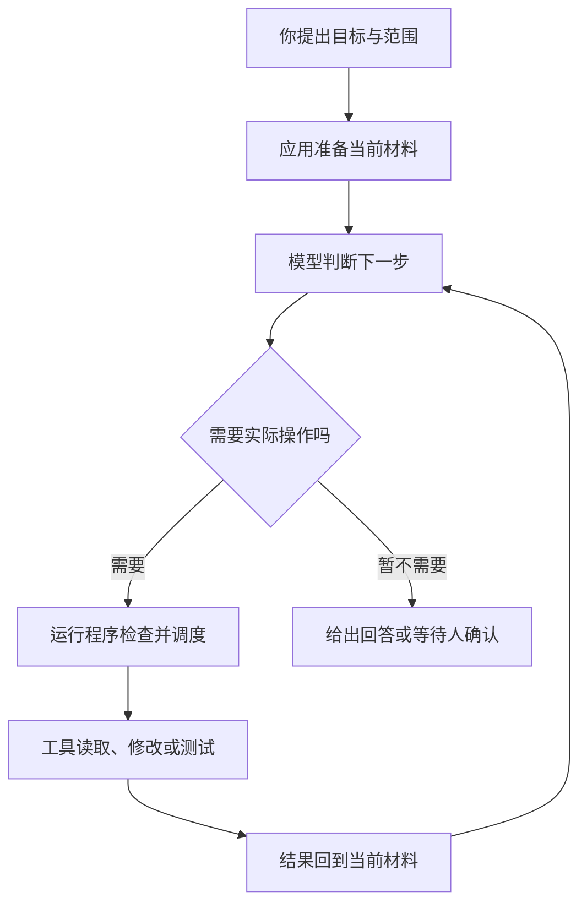
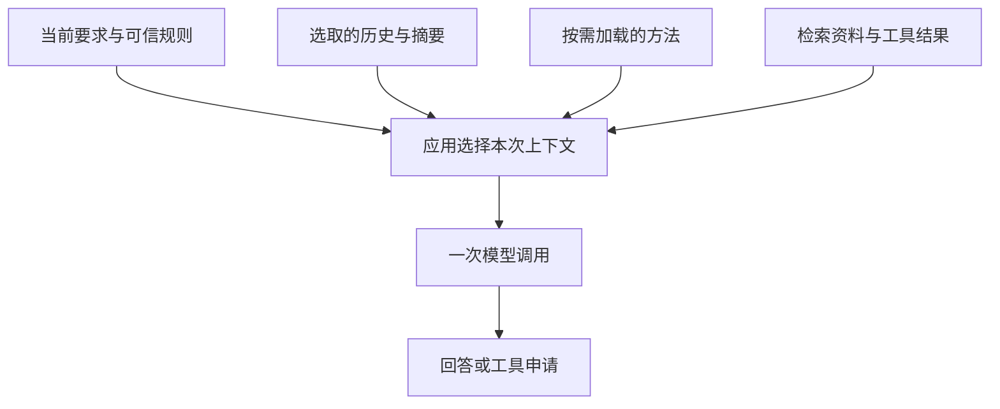
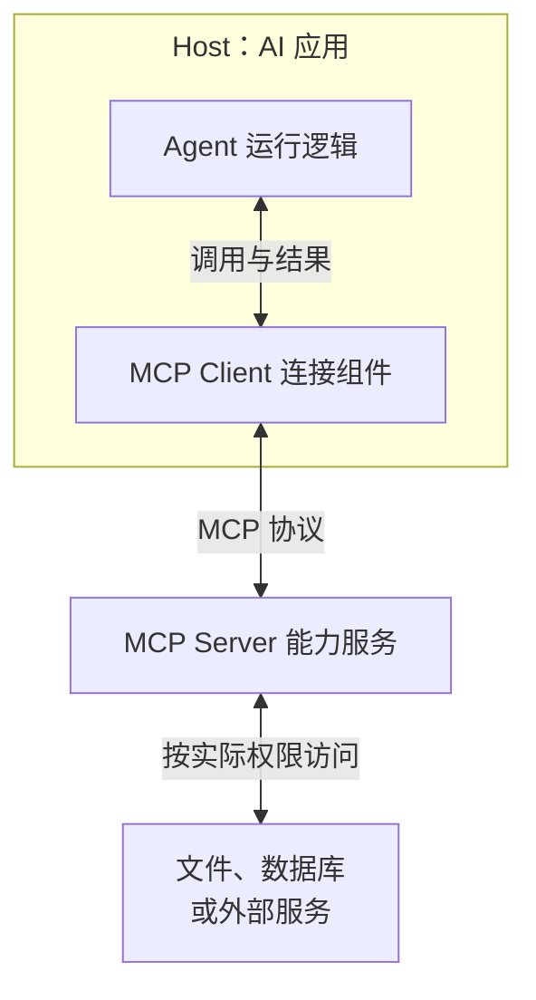

# 00 AI应用概念导读

## AI 应用概念导读：从一次任务看懂 Agent

Agent、Model、Harness、Skills、MCP 都经常出现在 AI 产品介绍里，但它们不是同一类东西。有的负责生成内容，有的组织程序运行，有的是方法文件，还有的是通信协议。把它们当成一排相互替代的产品，就很容易越看越乱。

先抓住一条线：**人提出目标，应用准备材料，模型判断下一步，程序安排工具执行，再把结果交回模型。** 围绕这条线，才需要记忆、检索、技能、协议和各种控制措施。

本文讨论以大语言模型为核心的 Agent 应用。传统 AI、机器人领域对 Agent 有更广的定义；不同产品对 Agent、Harness、Memory 等词的边界也不完全相同。这里先建立常见用法的地图，不要求所有系统采用同一套类名或架构。

## 1. 先看一次完整任务

假设你对编程助手说：“修复小书架的已读数量统计，运行测试确认，只修改相关代码，不提交。”

程序需要先把目标、项目约定和可用工具交给模型。模型看不到代码时，提出读取申请；读取程序打开文件，将实际内容交回去。模型发现统计把所有书都算上了，于是提出修改；修改程序完成后，再安排测试。测试若失败，错误继续成为下一次判断的材料；确认结果后，应用才能交付修改说明和验证结果。

这张图只表示主要反馈过程，不是完整错误状态机。操作可能被拒绝，工具可能失败，人也可以取消；程序还需要限制时间、次数和费用，不能无限继续。“模型说完成了”不等于代码已经正确，最终仍要核对文件、测试和任务范围。

现在给几个角色贴上名字：

| 你刚才看到的部分 | 常见名称 | 先记住什么 |
|---|---|---|
| 根据材料生成回答或下一步操作申请 | Model，模型 | 负责生成，不直接等于你的整个应用 |
| 围绕目标选择行动、利用反馈继续工作 | Agent，智能体 | 强调目标驱动的行动过程 |
| 准备材料、调用模型、调度工具、管理记录与停止 | Harness，运行组织程序 | 把模型接进实际工作环境 |
| 真正打开文件、执行测试或访问服务 | Tool，工具 | 负责具体操作，有真实权限和副作用 |
| 给模型用于这一次判断的材料 | Context，上下文 | 不是电脑里或历史里所有资料 |
| 反复判断、行动、取得反馈 | Agent Loop，智能体循环 | 一次任务可能多次调用模型 |

**Agent 不是藏在模型旁边的另一个模型；Harness 也不是必须额外安装的第二个助手。** 同一个产品可以作为完整 Agent 应用交给用户，同时把自身定位为供开发者定制的 Harness。

## 2. Model、Agent、Harness 到底是什么关系？

### Model：这次根据材料生成什么

Model 是训练得到的模型。**LLM** 是 Large Language Model，即大语言模型，主要处理和生成语言；支持图像、音频等输入输出的模型还会被称为**多模态模型**。一个 Agent 也可以组合语言模型、视觉模型和其他模型，不要求只有一个。

模型的**参数或权重**保存训练形成的数值关系，不是一个可以逐页翻看的知识库。日常发送请求，让既有模型计算输出，叫 **Inference，推理调用**；通过数据改变参数，叫 **Training，训练**；在已有模型上继续训练，叫 **Fine-tuning，微调**。

因此，把 README 放进对话、安装一个 Skill、保存一次会话，都不等于更新了模型权重。服务商是否另用数据训练，属于独立的数据政策问题。

模型不天然知道你电脑上刚改过的文件。即使模型运行在本机，也需要应用把材料提供给它，或者允许它通过工具获取。

### Agent：谁决定下一步行动

普通单次问答可以只调用一次模型并显示答案。Agent 式应用则把一部分“下一步做什么”的决定交给模型：先读哪个文件、是否要搜索、如何利用测试报错、什么时候需要问人。

这种可自行选择行动的程度叫 **Autonomy，自主程度**；**Agentic** 常用来形容具备这类特征的系统。自主不是权限无限，也不是必须无人值守。可以让模型选择查询顺序，同时规定写入必须人工批准。

**Assistant、Copilot、Chatbot** 多数是在描述产品交互定位，并不是精确的架构等级。聊天界面的背后可能有 Agent Loop；叫 Agent 的产品也可能主要运行固定流程。判断时看实际控制权，不只看名字。

### Harness：怎样让这段工作持续、可控地运行

模型生成“读取这个文件”的申请后，还需要程序解释申请、检查参数和权限、找到执行函数、收集结果，再发起下一次模型调用。对话变长时还要选择材料，出错时处理重试，退出时释放资源。这些围绕模型的运行工作，是 Harness 这个词通常强调的内容。

它不等于沙箱，也不保证默认包含完整审批、持久化或多 Agent。不同 Harness 的取舍不同；同一个模型放进不同 Harness，实际任务表现也可能不同。

旁边还有几个容易混在一起的词：

| 名称 | 它描述的是哪件事 |
|---|---|
| Runtime，运行时 | 正在运行的对象、服务与环境；具体管模型、会话还是进程，要看产品定义 |
| Framework，框架 | 帮开发者组织应用的代码结构与组件，可能包含现成循环和状态管理 |
| SDK，开发工具包 | 应用可调用的接口、类型和工具；既可能只是模型 API 客户端，也可能包含完整 Agent 运行能力 |
| API，应用编程接口 | 程序对外约定怎样调用能力，既可能是本地函数，也可能是网络接口 |
| Provider，服务商或接入实现 | 在产品介绍里常指提供模型的服务，在代码里也可能指认证、模型目录和请求接入模块 |
| API Adapter，协议适配器 | 把应用内部的请求与结果转换成某个服务支持的形式 |

框架和 SDK 是开发时拿来用的东西，Harness 强调运行时实际组织了什么。名称可能重叠，不需要为了凑齐术语把一个小程序拆成六层。

## 3. 模型每次凭什么判断？

### Prompt、Message 与 Context

**Prompt，提示**通常指交给模型的要求或输入文字。狭义上是你刚发的那句话，广义上也有人把完整模型输入都叫 Prompt。**Message，消息**是接口组织对话的单位，通常带角色和内容。

常见角色包括 `system`、`developer`、`user`、`assistant` 和工具结果，但不同服务的角色名、可用字段与优先级并不完全一样。项目约定、用户要求、检索资料都进入输入，并不意味着它们具有相同的指令权威。

**Context，上下文**是模型当前可依据的材料。对本篇的任务而言，可能包括任务要求、项目规则、选取的历史、相关代码、工具说明和刚返回的测试结果，不等于整份仓库或全部会话历史。

图中的材料是逻辑上的集合，服务接口可以把它们放在不同字段里。工具定义通常也是单独字段，不必都拼成一段大字符串。

**Prompt Engineering，提示设计**主要关心要求、示例与格式怎样表达。**Context Engineering，上下文组织**范围更广：什么时候取什么材料、哪些历史要保留、怎样检索、怎样处理工具结果。两者相关，但不只是把一句话写得更长。

### Token、窗口、思考与缓存

| 名称 | 大白话解释 | 容易误会的地方 |
|---|---|---|
| Token | 模型处理内容的计量单位，文本通常先被切成小片段 | 不固定等于一个字或一个词 |
| Context Window | 一次调用能容纳的上下文容量 | 不是会话可永久保存的总长度；输入、输出及推理预算的计算依模型而定 |
| Reasoning / Thinking | 常指模型解题过程，或服务提供的推理计算档位 | 更高档位不保证更正确，含义和计费由模型服务决定 |
| Chain of Thought，CoT | 关于分步骤推理的一类方法或表述 | 界面展示的摘要不等于完整内部计算，也不是工具执行证据 |
| Temperature、Top-p | 某些模型的生成采样设置 | 不是“智能值”；调低也不保证事实正确或绝对可重复 |
| Streaming，流式输出 | 内容或事件逐步到达，不必等整条响应结束 | 已显示部分文字不等于任务完成 |
| Prompt / Prefix Cache | 复用满足服务条件的输入前缀计算，减少部分开销 | 不会因此替模型增加新事实，也不等于长期记忆 |
| Compaction，压缩 | 用摘要等方式缩减后续调用需要携带的历史 | 有损，可能遗漏细节；不等于训练或缓存 |

“模型忘了前面的要求”可能是相关内容没有进入当前上下文，也可能是摘要丢失、材料相互冲突，或模型没有遵循输入。不能只看到表现就认定是窗口不够。

### Session、State 和 Memory

**Session，会话**负责组织一段交互经历。应用可以将历史存进文件或数据库，再从中构造下一次 Context；存过的内容不一定每次全部发送。

**State，状态**是程序当前知道的事实，例如任务正在运行、工具尚未返回、计划进行到哪一步。它不必全部展示给模型，也不必全部持久化。

**Memory，记忆**是范围很宽的产品术语：有时指当前会话历史，有时指跨会话保存的偏好、事实或任务经历。长期记忆通常仍由外部存储、检索和上下文注入完成，不是模型参数自动改变。记忆也可能过时或错误，需要来源、更新与删除规则。

**Checkpoint，检查点**保存某个时刻的状态以便继续；**Resume，恢复**从保存内容接着运行。它们不自动撤销已发邮件、数据库写入或文件修改，恢复会话与恢复外部世界是两件事。

### RAG、Embedding 与向量数据库

修代码时，项目还有几百页文档，不能全部塞进每次请求。可以先找出相关段落，再让模型依据这些段落回答，这叫 **RAG，Retrieval-Augmented Generation，检索增强生成**。

RAG 是一条“检索资料，再用于生成”的数据路径，不是另一种 Agent，也不是把文档训练进模型。

| 名称 | 在检索中做什么 |
|---|---|
| Knowledge Base，知识库 | 被组织和维护的资料集合，不限定具体数据库 |
| Chunk，分块 | 将长文档拆成便于检索与引用的片段，同时保留必要来源 |
| Embedding，嵌入向量 | 把内容转换成数值表示，便于按相关性比较；通常由专门的嵌入模型生成 |
| Vector Store / Vector Database | 存储并检索这些向量及对应资料，不负责代替模型回答 |
| Keyword / Hybrid Search | 按关键词查找，或将关键词与向量检索结合 |
| Reranker，重排器 | 对初步找出的候选资料重新排序，让更相关的内容靠前 |

一种常见做法是预先分块、生成向量并建立索引，查询时再检索和重排；不是每问一句就重新处理所有资料。RAG 也可以只用关键词、SQL 或其他检索方式，并非必须有向量数据库。

Agent 可以把检索作为一个工具，按反馈多次查找；固定问答流程也可以使用 RAG。查到相似文字不等于查到正确证据，资料是否过期、是否有权访问和最终回答是否符合来源，都需要另外判断。

## 4. 工具怎样让模型影响真实环境？

### Tool Calling 不是模型直接执行函数

应用先告诉模型有哪些工具、各自做什么、参数应是什么形式。模型生成某个工具的调用申请，应用或服务端的执行系统才真正运行代码，再把结果返回。

这通常叫 **Tool Calling / Function Calling，工具调用或函数调用**。函数调用是一种常见的结构化工具形式；也有接受自由文本的工具。工具还可能由模型服务托管，并不总在你电脑上执行。

把它拆开就容易理解：

| 名称 | 小书架例子 |
|---|---|
| Tool Definition / Description | 告诉模型有一个读取文件的工具，适用于取得当前代码 |
| Schema | 约定参数结构，例如文件路径必须是字符串；JSON Schema 是常见表达方式 |
| Tool Call | 模型提出“读取这个路径”的申请，还没有证明文件已经打开 |
| Executor / Handler | 真正打开文件的执行函数 |
| Tool Result / Observation | 实际返回的内容、失败或拒绝，供后续判断使用 |
| Call ID | 将一次申请与对应回执关联，避免多个结果混淆 |

**Structured Output，结构化输出**只说明输出遵循某种格式。生成一个合法 JSON 不等于执行了里面描述的操作；Schema 合法也不等于参数有业务权限。

### 工具、资源与环境不是一回事

工具可以封装本地函数、Shell 命令、数据库访问或网络 API。**Environment，环境**是这些操作实际面对的文件、进程、服务和界面。模型依据工具返回的信息了解环境，不会因为申请过一次读取就知道所有文件。

**Computer Use / Browser Use** 指通过截图、页面结构、鼠标或键盘操作界面的一类能力。它与直接调用业务 API 都能完成某些任务，但权限、稳定性和验证方式不同，不是所有 Agent 必须具备的功能。

工具返回成功，只能说明那次操作按自身合同完成。测试命令成功不一定覆盖全部需求，模型给出“修复完成”也不能代替差异与测试检查。

**一句话：模型提出行动，程序执行行动；行动的证据来自实际环境反馈。**

## 5. Skills、规则和扩展分别改变什么？

假设你希望每次修复都“先读实现、再看测试、只改相关文件、最后报告验证边界”。这是一套做事方法，可以写进指令；但要让助手具备新的数据库查询工具，需要接入执行代码。方法与能力不是同一件事。

### 从一句要求到一份 Skill

**Prompt Template，提示词模板**复用一段带参数的要求。例如把审查对象填进“检查这个文件，只输出有证据的问题”。模板减少重复输入，真正分析仍由模型完成。

**Rules / Instructions，规则或指令**表达长期约定。`AGENTS.md` 是一些编程助手采用的项目指令文件名，不是 AI 行业统一的权限系统，也不是 Agent 程序本身。

**Skill，技能**在泛称中可以指某种能力；谈到 **Agent Skills 格式**时，通常指以 `SKILL.md` 为入口的方法资料包，包含适用条件、步骤，也可附带脚本、参考资料和模板。

典型加载过程称为 **Progressive Disclosure，渐进加载**：先让应用知道技能名称与简介，任务需要时再读取完整方法，执行中按需取附属资料。不是每次把所有 Skill 的正文都塞进上下文；是否自动选中并正确遵循，还取决于具体实现和模型行为。

| 想复用的东西 | 更接近哪一类 | 小书架例子 |
|---|---|---|
| 一次请求的固定表达 | Prompt Template | “审查指定统计函数，按问题、位置、证据输出” |
| 项目的长期工作约定 | Rules / AGENTS.md | 不提交代码，测试使用什么命令 |
| 特定任务的方法和配套资料 | Skill | 统计逻辑审查步骤、边界用例清单和辅助脚本 |
| 一个实际可调用的动作 | Tool | 读取文件或运行某项检查 |

Skill 不会改变模型权重，也不会天然增加操作系统权限。但它可以引导模型调用已有工具，附带脚本还可能真正执行，所以“只是一个 Skill”不是安全结论。

### Extension、Plugin、Hook 与 Package

**Extension / Plugin，扩展或插件**是宿主加载的定制代码。不同产品定义不同，可能增加工具、命令、事件处理和界面，也可能接入 MCP。加载扩展本身就可能执行代码，不能只审查模型有没有调用它。

**Hook，钩子**是在某个时机触发的处理入口，例如工具执行前检查、执行后处理结果。它只覆盖实际接入的路径，不因叫 Hook 就能够拦截进程的一切行为。

**Package，包**负责把资源及依赖作为一个单位交付。Pi Package 可以包含扩展、Skill、模板与主题；它不是新的模型，也不自动保证里面的代码安全。

**一句话：模板复用表达，Skill 复用方法，工具提供动作，扩展改变宿主行为，Package 负责交付。** 它们可以组合，不是从低级到高级的替代关系。

## 6. MCP 连接的究竟是哪两边？

你已经有读取文件、查数据库、访问资料库等不同能力。若每个 AI 应用都用自己的方式对接它们，就要重复适配工具发现、参数、调用和结果。

**MCP，Model Context Protocol，模型上下文协议**约定应用与外部能力服务怎样交换信息。它不是模型，不是 Skill，也不是运行 Agent Loop 的程序；它减少的是接口对接差异。

### Host、Client 与 Server

**Host** 是使用 MCP 的应用，管理连接和用户交互。**Client** 是应用里与某个 Server 通信的组件，不是模型本身。一个 Host 可以管理多条这样的连接。**Server** 是提供能力的程序，既可以在本机子进程里，也可以运行在远端；“Server”不意味着一定有一台云服务器。

模型产生调用申请后，由应用的运行逻辑决定是否以及怎样通过 MCP 执行，并把取得的结果用于后续上下文。MCP 不会让模型跳过应用，直接拥有数据库权限。

### MCP 不只提供工具

服务端可以按能力声明提供不同种类的内容，不是每个 Server 都必须具备全部种类：

| MCP 概念 | 主要用途 | 例子 |
|---|---|---|
| Tools | 暴露可执行操作 | 查询书目、运行特定检查 |
| Resources | 提供可读取的资料 | 书目结构说明、文档内容 |
| Prompts | 提供可复用提示模板 | 一份参数化的书目审查请求 |

MCP 使用 JSON-RPC 形式的消息约定，常见传输包括本机标准输入输出和 Streamable HTTP。**RPC，Remote Procedure Call，远程过程调用**描述跨进程或服务请求执行操作；具体消息仍要遵守所选协议。**Protocol，协议**约定消息的含义与交互规则；**Transport，传输**负责把消息送过去。能交换 JSON 或使用 HTTP，不代表已经兼容 MCP。

连接成功只说明双方能通信，不证明所有资料应该交给模型、所有操作都获授权。Server 代码、凭据范围、工具说明、返回内容和实际副作用仍需审查；同一个协议也可能连接到不可信服务。

### Skills、MCP 与模型 API 怎样配合？

Skill 可以写“先查询书目，再核对重复记录”，MCP Server 可以提供查询工具，模型 API 则负责让模型判断下一步。三者分别解决**怎样做、怎样连接能力、怎样请求模型**。

不采用 MCP 也可以直接实现工具或调用 API；有 MCP 也不要求必须使用 Skills。模型服务 API 与 MCP 是不同接口，Pi 的 RPC 模式同样不等于 MCP，不能因为名字里都有 RPC 就直接互连。

## 7. Workflow、规划和多 Agent 是怎样组织任务的？

### 固定工作流与动态行动

**Workflow，工作流**常指预先约定的步骤和分支，例如“取得代码、执行审查、保存报告”。步骤里可以有模型调用，但整体流程主要由程序决定。

Agent 则将更多运行时决策交给模型，例如读完报错以后再决定查哪里。两者可以混合：外层工作流固定必须经过审批，内层 Agent 自行查找问题。不是加上模型就是 Agent，也不是使用固定步骤就不需要模型。

**Orchestration，编排**泛指组织调用、状态、依赖与协作的工作。它可以由普通代码、工作流引擎或模型辅助完成，不一定有一个单独名为 Orchestrator 的产品。

### Planning、ReAct 与 Reflection

| 名称 | 描述的模式 | 要注意什么 |
|---|---|---|
| Planning，规划 | 先拟定任务步骤，再根据情况调整 | 计划不是已执行记录，也不必一次定死所有步骤 |
| Plan-and-Execute | 把拟计划与执行步骤分成相对独立阶段 | 执行反馈可能要求重新规划 |
| ReAct | 将推理判断与行动、观察交替组织的一类方法 | 不要求每个产品公开完整思维链，也不是所有 Agent 的唯一算法 |
| Reflection / Critic | 对已有输出做反思或评议，再尝试改进 | 模型自评也会错，不能替代环境证据 |
| Routing，路由 | 将任务送到适合的模型、工具或处理流程 | 路由可以是规则，也可以由模型判断 |

“增加一次思考”与“取得一份新证据”不是同一件事。代码是否通过测试，最终仍要真正执行对应测试，而不是让更多模型反复声称它正确。

### Sub-agent、Multi-agent、Handoff 与 A2A

一个 Agent 可以把明确子任务委派给另一个 Agent，例如只读检查测试覆盖。被委派者常叫 **Sub-agent，子 Agent**；多个 Agent 协作叫 **Multi-agent，多智能体**。

子 Agent 可能使用同一个模型，差别在任务、指令、上下文和工具，并不意味着训练了另一个模型。上下文、文件和权限是否隔离，由实现决定；开两个会话不自动避免同时修改同一文件。

**Handoff，交接**通常指把后续处理交给另一个 Agent；“调用子 Agent 后等待结果”则可能保留原协调者。不同框架对这些词的具体生命周期约定不同。

**A2A，Agent2Agent**是一种面向 Agent 之间互操作的协议，关注如何表达能力、交换任务、状态与结果。它与 MCP 的主要关注点不同：前者侧重跨 Agent 协作，后者侧重应用取得工具和上下文。

这不是绝对隔离的两类系统：MCP 工具背后也可以封装 Agent，多 Agent 也可以用普通 API 协作，不一定使用 A2A。协议名字不保证协作质量或安全。

多 Agent 适合确实可以分开的工作，但会增加上下文传递、协调、费用和冲突处理。修一个明确的小函数，单 Agent 加工具通常已经足够，不需要把本页每个名词都装进项目。

## 8. 怎样让运行结果可信、边界清楚？

### Task、Run、Turn 与预算

**Task，任务**描述要完成的工作；**Run** 常指围绕一次目标推进的运行过程；**Turn / Step** 常指其中一轮响应或一步行动。各 SDK 的划分不完全一致，不能用一个界面的轮次数直接计算 HTTP 请求次数或账单。

程序需要明确什么时候继续、什么时候停。**Budget，预算**可以限制模型用量、步骤数或费用；**Timeout，超时**限制等待；**Cancellation，取消**请求停止进行中的工作。单次请求超时不等于整个 Run 时限，取消请求也不保证已经产生的副作用被撤销。

**Retry，重试**会再次尝试失败步骤。对于写入或付款等操作，还需要考虑 **Idempotency，幂等性**：重复提交同一业务操作时，不能无意重复产生效果。这里的“一样”由业务合同决定，不是所有重试都天然安全。

### 日志、评估与实际结果

| 名称 | 回答什么问题 |
|---|---|
| Event，事件 | 刚才发生了什么，例如工具开始或消息结束 |
| Log，日志 | 程序记录了哪些诊断信息 |
| Trace / Span，调用追踪 | 一次工作跨过哪些调用，各段如何关联和耗时 |
| Observability，可观测性 | 能否利用这些证据理解运行过程和失败原因 |
| Eval，评估 | 在一组代表性任务与标准下，表现、成本和安全边界如何 |
| Benchmark，基准测试 | 在固定题集和条件下进行比较，不代表你的实际业务一定同样表现 |
| Regression Test，回归测试 | 修改后，原来需要保持的行为是否仍成立 |

模型也可以参与评分，常称 **LLM-as-a-Judge**，但评分需要校准，并不能代替确定性的文件、协议或权限断言。一次演示成功不是整体 Eval，多条成功日志也不是端到端业务成功。

**Hallucination，幻觉**常指模型生成缺乏依据或不正确的内容。RAG、工具与评估可以帮助取得和核对证据，但不会让幻觉自动归零。

日志和追踪也可能包含提示、文件正文及凭据。可观测性不是“把所有内容全部打印出来”，需要按实际诊断目的记录并脱敏。

### 认证、授权、审批与沙箱

| 名称 | 它解决什么 | 不自动保证什么 |
|---|---|---|
| Authentication，认证 | 确认以什么身份访问，例如 API Key 或 OAuth 授权得到的凭据 | 不代表该身份可以执行全部操作 |
| Authorization，权限授权 | 决定该身份或请求允许访问哪些资源、执行哪些动作 | 不代表操作在业务上正确 |
| Approval / Human-in-the-loop | 在具体步骤让人确认、补充信息或接管 | 批准一次不等于批准所有后续动作 |
| Guardrails，防护措施 | 对输入、执行或输出施加约束与检查 | 提示规则、模型检查和代码拒绝的强度不同，不天然是硬隔离 |
| Sandbox，沙箱 | 用系统权限、容器或虚拟化等限制文件、进程与网络能力 | 挂载可写目录、暴露凭据或放开网络仍可能扩大影响 |
| Prompt Injection，提示注入 | 不可信资料夹带指令，试图改变 Agent 的行为 | 文件、网页、工具回执和 Skill 都可能成为载体 |

对本篇任务，“不提交代码”首先是人的范围要求。可靠系统还要在相应执行边界落实权限与审批；只在 Prompt 或 `AGENTS.md` 里写一句话，不等于进程已经失去提交、联网或访问其他文件的能力。

## 9. 把通用概念放回 Pi

现在再看 Pi，就不需要把它当作一个包办所有名词的产品。本套教程按 Pi `0.85.1` 的使用说明讲解，历史实验保留各自版本。

| 通用概念 | Pi 中怎样理解 | 后面去哪看 |
|---|---|---|
| Model 与 Provider | Pi 选择模型并通过接入层联系服务，不自带替你推理的大模型权重 | [06 模型与用量](06-模型选择与用量.md)、[20 模型接入](20-模型接入与认证.md) |
| Harness 与 Agent Loop | Pi 定位为终端编程 Harness，组织模型、工具、反馈和会话 | [01 认识 Pi](01-安装与第一次对话.md)、[28 完整请求](28-追踪一次完整请求.md) |
| Context、Session、Compaction | 从历史和资源组织当前输入，保存会话并在需要时压缩 | [11 会话](11-保存恢复与会话分支.md)、[12 上下文](12-会话记录与上下文压缩.md) |
| Tool Calling | 默认基础工具为 read、write、edit、bash，可定制工具与检查 | [04 工具与边界](04-基础工具与操作边界.md)、[16 自定义工具](16-自定义工具与命令.md) |
| Rules、Templates、Skills | 项目约定与按需使用的方法资料，不是 OS 权限 | [09 项目规则](09-项目配置与规则.md)、[13 模板与技能](13-提示词模板与技能.md) |
| Extension、Hook、Package | 扩展宿主行为，再将资源打包交付 | [15 扩展](15-第一个扩展与生命周期.md)、[19 打包](19-打包安装与资源管理.md) |
| SDK 与 Runtime | 让 Node.js 程序直接控制 Pi 的运行对象 | [23 SDK](23-使用SDK提交与控制任务.md) |
| RPC、CLI、TUI | 跨进程协议、命令行入口与终端界面是不同使用方式 | [08 一次性运行](08-一次性运行与结构化输出.md)、[24 RPC](24-RPC协议与Java客户端.md)、[25 终端界面](25-终端组件与界面刷新.md) |

**CLI** 是 Command Line Interface，即命令行接口；**TUI** 是 Terminal User Interface，即终端交互界面。界面可以不同，背后仍复用相同的任务机制，不必重新训练模型。

Pi `0.85.1` 默认不内置 MCP、子 Agent、计划模式、通用审批弹窗或 OS 沙箱。可用扩展或外部环境实现相关能力，但“能够扩展”不等于“已经安装并启用”。本页介绍 RAG、向量数据库、A2A 与多 Agent，是为了理解生态，不表示本仓库已实现这些系统。

也不需要先部署向量数据库、搭 MCP Server 或配置多 Agent 才能使用 Pi。一个模型、明确的工具和受控的任务循环，就可以完成许多编程任务。

## 10. 再遇到名词时，先问它属于哪一层

这张表用于回忆位置，不是新的学习前置清单：

| 你想问的问题 | 相关名词 |
|---|---|
| 谁生成，模型能力从哪里来？ | Model、LLM、多模态、参数、训练、Inference、Fine-tuning |
| 谁接收目标，谁决定并推进动作？ | Agent、Assistant、Autonomy、Harness、Agent Loop、Runtime |
| 模型请求怎样接到服务？ | API、Provider、API Adapter、SDK、认证 |
| 这次依据什么材料？ | Prompt、Message、Context、Token、Context Window、Context Engineering |
| 历史怎样继续，资料怎样查找？ | Session、State、Memory、Checkpoint、Compaction、RAG、Embedding、Vector Store、Reranker |
| 谁真正执行，结果怎样回来？ | Tool、Function Calling、Schema、Executor、Tool Result、Call ID |
| 怎样复用方法和定制能力？ | Rules、AGENTS.md、Prompt Template、Skills、Extension、Plugin、Hook、Package |
| 怎样连接不同程序？ | MCP、Host、Client、Server、Resources、Prompts、Protocol、Transport、RPC |
| 多个步骤或多个 Agent 怎样合作？ | Workflow、Planning、ReAct、Reflection、Routing、Orchestration、Sub-agent、Handoff、A2A |
| 怎样判断结束、质量与边界？ | Run、Turn、Budget、Timeout、Cancellation、Retry、Eval、Trace、Guardrails、Approval、Sandbox |

最后用一句话串起来：

> **Agent 围绕目标行动，Model 根据 Context 生成下一步，Harness 组织循环，Tool 与环境交互；Skills 提供方法，MCP 连接外部能力，记录、评估与权限决定这段工作能否被理解、验证和控制。**

第一次阅读能把这几类职责分开就够了。接着回到[Pi 系统地图](README.md#先看系统地图)，再读[01 安装与第一次对话](01-安装与第一次对话.md)；具体 API、配置和实验在对应章节展开。
