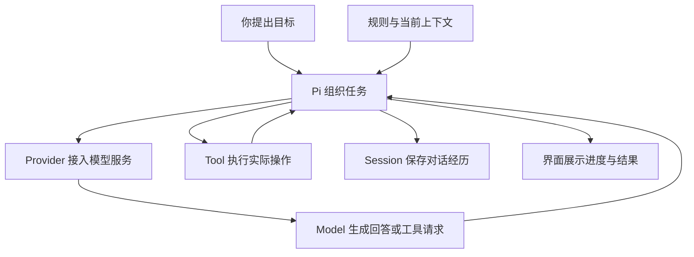
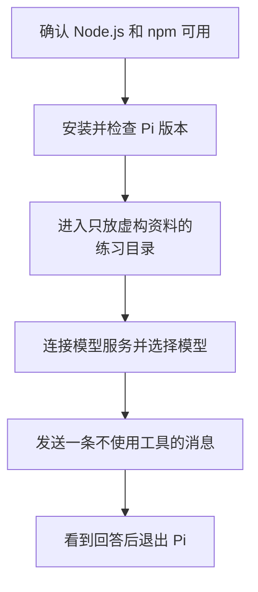

# 01 安装与第一次对话

## 先认识 Pi，再完成第一次对话

还不熟悉 Agent、Model、Harness、Skills 和 MCP 的关系，可以先读[AI 应用概念导读](00-AI应用概念导读.md)，再回到这里认识 Pi 并开始安装。

拿到一个陌生项目时，你可能会先阅读说明、搜索代码、修改一个小问题，再运行测试确认结果。Pi 可以在终端里协助完成这类任务。

先不急着安装。理解 Pi 的起点，是分清“能够生成一段代码”和“能够在你的项目里完成一次修改”之间还差哪些事情。

## 1. Pi 是做什么的？

Pi 是运行在终端里的编程助手程序。你把任务告诉它，它会联系选定的模型，展示回答，并在需要时安排工具读取文件、修改代码或执行命令。

### 有了大模型，为什么还需要 Pi？

假设你只在聊天网页里问“这个函数为什么算错了”。模型可能给出一份正确建议，但你的编辑器里仍然是原来的文件。你还得自己找到函数、把代码贴过去、复制修改、运行测试，再把报错发回来。

Pi 把这些原本由你来回搬运的步骤接起来。它知道当前工作目录，能把模型的操作请求交给工具，也能把工具的结果带回下一轮讨论。模型仍负责分析和生成，Pi 则负责让分析与真实开发环境产生联系。

这种围绕模型组织输入、工具、运行过程和反馈的程序，有时叫 **Harness**。把它理解为“让模型在开发环境里工作的一整套组织程序”即可，不是另一种大模型。

### 模型、服务商与工具，各自在哪儿？

**模型（Model）**根据收到的材料生成下一步内容，内容既可能是回答，也可能是工具请求。**服务商接入（Provider）**负责把请求交给所选服务、处理身份和协议。模型可以在远端，也可以由本机服务提供；“在本机”仍不等于自动知道项目文件。

**工具（Tool）**才是真正打开文件、修改文件或运行程序的代码。模型看到的是工具名称、用途和参数要求，而不是直接获得你的操作系统。Pi 收到请求后，仍要找到工具、处理参数并经过实际存在的检查。



这是职责关系图，不是所有箭头依次执行一次的流程。工具结果回来后，Pi 可能再次请求模型；记录与显示则随着运行过程发生。

### Pi 怎样让一次任务持续进行？

“修复统计错误”通常不能靠一次回答完成。模型先要看代码，看到后判断改哪里，修改后再看测试。如果缺材料，就继续获取材料；如果工具报错，就根据错误决定如何处理。

这种围绕目标反复“判断、操作、观察”的工作方式，可以称作 **Agent**；推进这段工作的循环就是 **Agent Loop**。它不是另一个藏在 Pi 里的模型。Pi 的核心工作是把模型、工具和反馈组织成一个可以继续的过程。

这里也解释了为什么模型回答会出错：循环让它有机会取得新证据，不会使它天然理解正确。最后的回答与实际文件、测试结果仍需对应。

### 对话、规则和扩展怎样接进来？

每次调用模型，Pi 都要准备一份“这次让模型依据什么来回答”的材料，叫 **Context，上下文**。你的要求、相关历史和工具结果都可能在其中。**Session，会话**则保存对话经历，帮助下次继续；保存过的内容不一定每轮全部发送。

项目规则说明“在这里应当怎样工作”；模板复用一段要求；Skill 提供按需使用的方法；Extension 用代码增加工具、命令和事件处理；Package 把这些资源分发给别的环境。它们分别改变材料或能力，不是每加一种资源就多训练了一个模型。

Pi 的取舍是保留较小的核心，让不同工作流通过这些入口扩展。多 Agent、计划模式或审批流程不能因为别的助手里存在，就假定 Pi 默认已经内置。需要时先确认现有扩展及其实现。

到这里，不必记住所有名称，只要能把“谁分析、谁执行、谁保存、谁显示”分开。后续章节会沿着这些关系逐层展开。

可以先把整套流程理解成：

> **你提出目标，模型判断下一步，Pi 负责组织过程，工具在电脑上实际执行操作。**

第一次对话暂时关闭所有工具，只验证“终端中的 Pi 能不能连接模型并返回回答”。工具怎样参与任务，会在[读取 README 的例子](02-Pi如何读取文件.md)中单独讲清。

## 2. 开始前需要什么？

安装练习只验证最短的一条链：终端能启动 Pi，Pi 能联系模型，模型能返回回答。它暂时不验证工具和复杂任务。



Node.js 是运行 Pi 这类 JavaScript 程序的环境，npm 是取得和管理程序包的工具，终端则是你启动和交互的入口。三者不负责模型推理，所以安装 Pi 不等于把一个大模型下载到了电脑上。

打开普通终端，依次执行：

```bash
node --version
npm --version
```

Pi `0.85.1` 要求 Node.js 不低于 `22.19.0`。版本号开头的主版本大于 `22`，或者同为 `22` 且不低于 `22.19.0`，才满足本篇条件。

两条命令分别确认：

| 命令 | 成功时说明什么 |
|---|---|
| `node --version` | 电脑能够运行 Node.js 程序 |
| `npm --version` | 能够使用 npm 安装和管理 Pi |

如果终端提示找不到 `node` 或 `npm`，先安装符合要求的 Node.js，再继续。不要为了绕过权限错误直接在安装命令前加 `sudo`；先确认 Node.js 的安装方式和 npm 全局目录属于谁。

## 3. 安装 Pi

本套笔记先固定使用 Pi `0.85.1`，避免今天和以后安装到不同版本却得出不同结果：

```bash
npm install -g --ignore-scripts @earendil-works/pi-coding-agent@0.85.1
```

命令中各部分的意思：

| 部分 | 作用 |
|---|---|
| `npm install` | 安装一个 npm 包 |
| `-g` | 安装为当前用户环境中的全局命令，之后可以直接输入 `pi` |
| `--ignore-scripts` | 安装依赖时不运行包的生命周期脚本；Pi 的普通 npm 安装不依赖这些脚本 |
| `@0.85.1` | 固定本套笔记核对过的版本 |

安装结束后检查：

```bash
pi --version
```

预期看到：

```text
0.85.1
```

如果已经看到这个版本，不需要重复安装。安装命令成功只证明 npm 完成了安装；`pi --version` 能正确输出，才进一步证明终端找到了 Pi 命令。

## 4. 准备一个安全的练习目录

不要把第一次运行放在真实业务仓库、下载目录或存有私人资料的位置。先创建一个只放虚构材料的目录：

```bash
mkdir pi-first-run && cd pi-first-run && pwd
```

`&&` 表示前一步成功才继续。确认最后显示的路径以 `pi-first-run` 结尾。

如果目录已经存在，`mkdir` 会失败，后面的 `cd` 和 `pwd` 不会执行。换一个新的目录名，不要直接进入来源不明的旧目录。

独立目录能够避免误改重要项目，但它**不是沙箱**。Pi 仍然继承当前系统用户的权限；以后启用读取、修改或命令工具时，仍可能访问目录外的内容。

## 5. 连接模型服务

Pi 本身负责组织任务，不包含替你回答问题的大模型。第一次使用前，需要选择一种模型服务，并让 Pi 获得访问资格。

常见方式有两类：

| 方式 | 大白话解释 | 使用前确认 |
|---|---|---|
| 订阅登录 | 使用服务商支持的现有订阅账号完成授权 | 该订阅是否允许在 Pi 中使用，是否另计用量 |
| API Key | 使用服务商发放的一段访问凭据 | 账户余额、单价、限额和 Key 的保存方式 |

两种方式都可能产生费用，具体规则由所选服务商和账号决定。一次请求成功不能证明免费，也不能证明费用符合预期。

在练习目录中启动受限的 Pi：

```bash
pi --no-tools --no-extensions --no-skills --no-prompt-templates --no-themes --no-context-files --no-session
```

这条命令看起来较长，是因为第一次运行先主动关闭额外能力：

| 选项 | 本次作用 |
|---|---|
| `--no-tools` | 不向模型提供读取、修改或执行命令的工具 |
| `--no-extensions` | 不自动加载 Extension |
| `--no-skills` | 不自动加载 Skill |
| `--no-prompt-templates` | 不自动加载提示词模板 |
| `--no-themes` | 不自动加载自定义主题 |
| `--no-context-files` | 不自动加载目录层级中的项目指令文件 |
| `--no-session` | 不把这次练习保存为以后可恢复的会话 |

这些选项只作用于本次启动，不会清除原有设置或认证。

Pi 界面出现后，在底部输入：

```text
/login
```

按 `↩ Return`，然后在界面中选择服务商和登录方式。输入 API Key 时只在 Pi 提供的认证界面中操作，不要把 Key 写进练习文件、普通对话、Shell 历史或 Git 仓库。

完成认证后输入：

```text
/model
```

选择一个当前账号可以使用的模型。选中模型只说明 Pi 知道接下来要请求谁，不保证网络、额度和服务端一定正常。

如果你之前已经完成认证和选模，可以直接检查当前模型，不需要重新登录或生成新的 Key。

## 6. 发送第一条消息

在 Pi 底部输入框输入：

```text
只回复 FIRST_PI_OK，不要解释。
```

按 `↩ Return` 提交。

正常情况下，消息会进入中间的对话区域，随后出现模型回答：

```text
FIRST_PI_OK
```

大小写或标点略有差异不代表连接失败。第一次对话主要检查下面三件事：

1. 文字确实从输入框进入了对话区域。
2. 没有出现登录、模型或网络错误。
3. 模型返回的内容与要求基本一致。

本次关闭了工具，因此它不会读取文件或修改电脑内容。看到回答只能证明这个时间点、这个账号、这个模型和这条输入的请求成功；不能证明后续每次都成功，也不能证明复杂任务一定正确。

## 7. 退出 Pi

在输入框输入：

```text
/quit
```

按回车后，Pi 退出并回到普通终端。

这里的 `/quit` 是 Pi 自己处理的命令。只输入 `quit`、`exit` 或“再见”，它们会被当成普通消息发给模型，不会退出程序。

本次使用了 `--no-session`，因此不能在下次启动时恢复这段对话。练习目录仍然存在，退出 Pi 不会替你删除目录。

## 8. 出现问题时先看哪里？

| 现象 | 先检查什么 |
|---|---|
| 找不到 `node` 或 `npm` | Node.js 是否安装，终端是否需要重新打开 |
| npm 提示全局目录无权限 | 检查 Node.js 和 npm 的安装方式，不要直接用 `sudo` 掩盖问题 |
| 找不到 `pi` | 重新打开终端，再运行 `npm` 和 `pi --version` 检查命令路径 |
| `/login` 失败 | 检查选择的服务商、账号流程和网络；不要把凭据发到聊天中排查 |
| `/model` 中找不到想要的模型 | 先确认认证是否属于同一个服务商，以及账号是否有该模型权限 |
| 提交后提示余额、限额或认证错误 | 这是服务访问问题，不是重新安装 Pi 就能解决的问题 |

错误原因不明确时，先保留错误类型和发生步骤，不要连续重复登录或发送付费请求。

## 9. 一分钟回忆

第一次使用只需要记住这条路线：

```text
Node.js 和 npm可用
  -> 安装并检查 Pi
  -> 进入虚构练习目录
  -> /login
  -> /model
  -> 提交消息
  -> /quit
```

三个重要边界：

1. **Pi 是组织任务的程序，模型是生成回答的一方。**
2. **独立练习目录不是沙箱，关闭工具才缩小了这次对话的执行能力。**
3. **一次回答成功只证明这一次链路成功，不代表免费、稳定或永远正确。**

下一步进入[读取 README 的例子](02-Pi如何读取文件.md)，观察模型缺少本机文件内容时，Pi 怎样安排读取工具。

## 10. 适用版本

安装命令、启动选项和交互命令按 Pi `0.85.1` 核对。本文以 macOS 或 Linux 风格的普通终端命令为主；Windows 上 npm 与 Pi 命令相同，目录、终端按键和环境配置差异会在实际涉及的位置单独说明。
