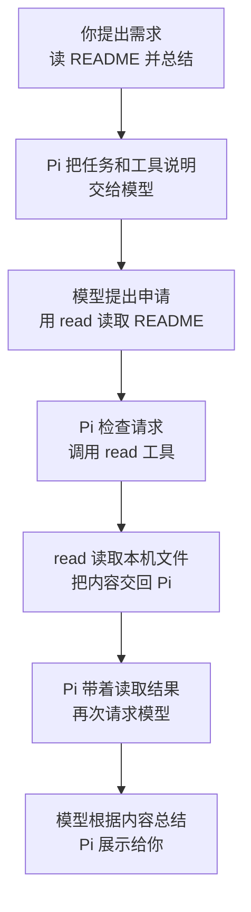
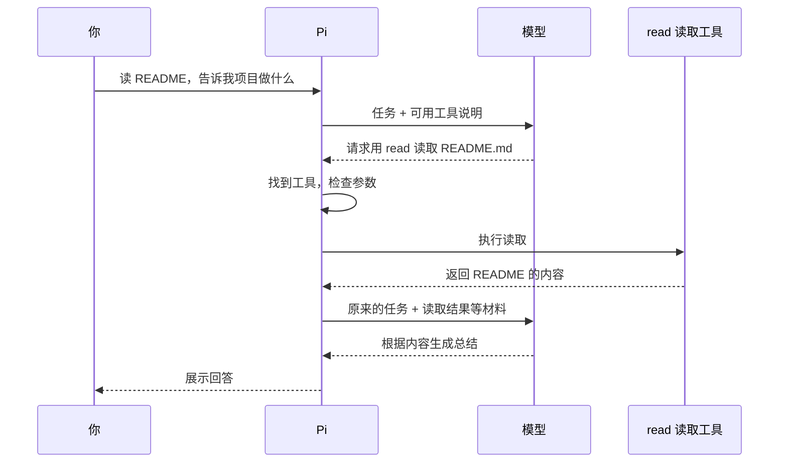

# 02 Pi如何读取文件

## 你说“读一下 README”之后，Pi 到底做了什么？

本篇从一条读取请求讲起，通过[时序图](#4-谁先找谁用时序图再看一次)和实际操作说明各个角色怎样协作。

## 1. 从一条很普通的需求开始

你拿到一个不熟悉的小项目，想先知道它是做什么的，于是在 Pi 里输入：

> 读一下当前目录的 README.md，用一句话告诉我这个项目是做什么的。

最后，你可能看到这样的回答：

> 这是一个在本机记录书名、标记阅读进度的小程序。

这句话是举例，不是本篇实际运行的输出。

看起来像是“你问了一句，AI 回了一句”，但中间藏着一个关键问题：

**README 在你的电脑里，模型是怎么知道里面写了什么的？**

先固定一个场景：这是一轮新的对话，你没有粘贴文件内容，也没有提前附加这个文件。我们要观察的是“先读取，再回答”，而不是让模型凭文件名猜用途。

## 2. Pi、模型和读取工具各做什么？

日常交流时，我们经常把整套东西都叫“AI”。为了理解它怎么工作，这里稍微拆开看：

| 角色 | 大白话解释 | 在这次任务里做什么 |
|---|---|---|
| **Pi** | 运行在终端里的程序，负责把事情组织起来 | 接收你的话、联系模型、安排工具执行、展示结果 |
| **模型** | 理解需求、判断下一步、组织回答的那一方 | 判断需要读文件，拿到内容后生成总结 |
| **读取工具 `read`** | 一段真正会打开文件并取出内容的程序 | 读取 `README.md`，把文件内容交回 Pi |

这里的模型可以来自外部模型服务，也可以运行在本机；无论放在哪里，都不能因为你说了一个文件名，就把“文件名”当成“文件内容”。

模型请求读文件时，表达的意思大致是：

```text
使用工具：read
读取路径：README.md
```

这只是请求含义的示意，不是让你手工输入的命令。实际请求会带上工具名称和参数，交给 Pi 处理。

这个读取申请叫**工具调用（Tool Call）**。工具执行后交回的内容或错误，叫**工具结果（Tool Result）**。

注意两者的区别：**“请读一下”是申请，不是“已经读到了”。**

## 3. 用流程图串起整件事

先看“成功读取一个小文件，然后正常回答”的路线：



图中“检查请求”，先理解成 Pi 要找到对应工具，并检查参数能不能交给它。**这不表示 Pi 自动判断了文件是否敏感、操作是否安全。**

读到文件之后，Pi 还要把结果交回模型。`read` 的工作是取出内容；要把一份说明书变成一句通俗介绍，还需要模型根据内容继续回答。

## 4. 谁先找谁？用时序图再看一次

流程图展示步骤顺序；时序图展示每一步的信息由谁发出、交给谁。

读法很简单：顶上一列一个角色，**从上往下看，箭头指向收到信息的那一方**。下面的虚线箭头表示返回结果。



这是讲解先后关系的简图，没有展开文字逐段显示、对话保存等细节。

### 为什么图里请求了模型两次？

- **第一次**：模型还没拿到文件内容，先决定“需要读这个文件”。
- **第二次**：Pi 带着读取结果再来，模型才有材料可以总结。

所以，这个例子包含**一次文件读取、两次模型请求**。

“两次”只是这条简单路线的次数。如果还要读别的文件、遇到错误或继续处理任务，就可能需要更多次；如果你已经把材料直接提供给模型，也可能不需要工具。

### 复杂任务为什么能继续往下做？

把同样的过程再走几遍就容易理解了：模型看过结果，发现还缺一份配置，于是再请求读取；Pi 执行后，再把新结果交回去。

这种“请求模型 → 按请求使用工具 → 把结果交回模型 → 继续”的循环，就是后面会遇到的 **Agent Loop**。

### 为什么工具结果必须重新进入上下文？

第一次请求时，模型看到的是“请总结 README”和“可以使用 read”，并没有 README 正文。工具在本机读到文件，只改变了本机程序知道的事情；如果 Pi 没有把结果放进下一次请求，模型仍然缺这份材料。

Pi 需要把工具回执作为下一步分析的输入。第二次模型请求中，既要有原任务，也要有配对的工具申请和读取结果，让模型知道“这段文字回答了哪个问题”。工具调用标识用来关联一次申请与对应回执。

这也说明 **Context 不只是你最后输入的一句话**。在本例中，它随着工具反馈增长。后续关于压缩的章节，解决的正是材料不断增长、又不能每次无限发送的问题。

### 每次模型请求包含哪些材料？

模型需要知道助手应当怎样工作、当前要处理什么，以及有哪些工具可用。Pi 内部通常用下面三个字段组织这些信息：

| 字段 | 第一次读取请求时包含什么 | 工具回来后怎样变化 |
|---|---|---|
| `systemPrompt` | 助手职责、项目规则和运行背景 | 仍提供当前适用的要求 |
| `messages` | “读 README 并总结”这条任务及选取的历史 | 增加 Assistant 的读取申请和配对的文件结果 |
| `tools` | `read` 的名称、用途和参数说明 | 仍说明本次可以调用哪些工具、怎样传参数；文件正文放在消息中 |

接入层会把这三个字段转换为具体服务支持的请求格式。模型收到的 `tools` 包含工具说明，`read` 的执行函数仍在本地；文件正文会在读取后加入消息。普通 README 需要通过引用或读取等方式提供给模型，放在目录中不会自动成为系统规则。

Pi 按路线、条目类型和容量规则选择历史，并不默认对整个仓库做语义检索、自动找出所有最相关资料。后续要用到哪个文件，仍需要明确提供、通过工具取得，或另外接入检索能力。

### Turn、Run、Session 为什么不是同一个长度？

| 名称 | 在这个例子中的大小 | 为什么要区分 |
|---|---|---|
| Turn，一轮 | 一次模型响应及其要求的工具执行 | 第一轮申请读取，后一轮根据内容回答 |
| Agent Run，一次低层运行 | 由多轮组成的循环 | 你不必每读完一个文件就再按一次回车 |
| Session，会话 | 可以包含许多次任务及其记录 | 今天读说明，明天还能继续讨论同一项目 |

一项任务可以经过多轮模型生成，一段会话又可以包含多项任务。各层 API 对结束时机还有更精确的规定，后面会继续区分低层运行结束与应用真正空闲。

## 5. 跟着做：让 Pi 读取你自己的练习文件

我们要观察的是：**一个只写在文件里、没有写进提问的内容，能否通过读取工具进入回答。**

### 开始前

- 你已经安装 Pi，并能使用一个支持工具调用的模型。这里不展开安装和登录，也不要求使用指定服务商。
- 使用你已经检查并信任的 Pi 配置；这不是一套完全隔离的启动方案。
- 只使用下方虚构资料，不放真实项目数据、密钥或个人信息。读取结果会随后续请求交给你选定的模型服务，调用可能产生费用。
- 这次关闭插件自动加载。如果你的模型接入依赖插件，先不要照抄启动命令；需要先为那种接入方式单独准备练习环境。

### 第一步：准备一份只用于练习的 README

在现有项目之外，选择一个专门做练习的位置。下面的命令输入在**普通终端**里，不是在 Pi 输入框里：

```bash
mkdir pi-read-demo && cd pi-read-demo && pwd
```

`&&` 表示前一步成功才继续。确认你位于刚创建的 `pi-read-demo` 目录；如果目录已经存在，命令会停在创建这一步，请换一个新的练习目录名，不要直接使用里面的不明文件。

用熟悉的编辑器在这个目录新建 `README.md`，保存以下内容：

```markdown
# 小书架

这是一个只在本机运行的读书记录小程序。
可以记录书名，并把读完的书标记为“已读”。
练习编号：PINE-27
```

请把 `PINE-27` 换成一个你随手编的练习编号。它不是密码，不要使用真实口令。

**编号只写在文件里，接下来不要把它写进提问。** 这样就更容易区分：模型是在复述你的提问，还是在使用刚读到的文件内容。

### 第二步：启动一个只提供读取工具的 Pi

仍在刚才的普通终端中执行：

```bash
pi --tools read --no-extensions --no-session
```

这三个选项分别控制工具、扩展和会话保存：

| 选项 | 这次为什么加它 |
|---|---|
| `--tools read` | 只向模型开放名为 `read` 的工具，不提供修改文件、执行命令的工具 |
| `--no-extensions` | 不自动加载插件，避免插件改变本篇的工具流程 |
| `--no-session` | 不把这次练习保存成以后可以恢复的会话 |

这几个选项只针对本次启动，不会保存为长期的工具或插件开关；Pi 仍会使用现有设置与认证。`read` 也不是“只能读当前文件夹”的权限锁，仍可能读取当前用户有权访问的其他路径。

**因此，本次只读准备好的虚构文件，不尝试其他路径，也不在 Pi 中输入 `!` 开头的系统命令。** 不保存本机会话，也不代表模型服务不会记录请求。

### 第三步：在 Pi 输入框里提交任务

Pi 界面出现后，在底部输入框输入下面的普通文字，再按 `↩ Return`（回车）：

```text
请使用 read 工具读取当前目录的 README.md，
再用一句话说明这个小程序做什么，并原样写出文件里的练习编号。
只读取这个文件，不修改文件，不运行命令；如果读不到，请说明原因，不要猜。
```

不要把 README 正文一起粘贴进去，否则文件材料是你直接提供的，就不是本篇要观察的读取过程了。

### 第四步：看三个地方，不只看最后一句话

| 看哪里 | 期待看到什么 | 帮你确认什么 |
|---|---|---|
| 工具调用区域 | `read` 指向练习目录的 `README.md` | 请求读取的是哪一个文件 |
| 工具返回内容 | 文件中的文字和你自己写的练习编号，而不是读取错误 | 这次确实读到了目标材料 |
| 模型的回答 | 项目用途与文件一致，编号与你保存的一致 | 回答是否用对了材料 |

工具内容如果折叠了，默认可以按 `⌃ Control + O` 展开；Mac 上是 Control，不是 Command。键位改过时，以 Pi 的 `/hotkeys` 为准。

回答的措辞不必与文章相同，但不能凭空增加“支持在线同步”等文件里没有的功能。

**三个地方一起对上，才算完成本次练习。** 单凭“编号答对了”或模型说“我已经读过”，都不足以证明你观察到了这条工具流程。

这次成功只说明这个文件的读取与回答符合预期，不说明 Pi 以后读任何文件、回答任何问题都不会出错。这里没有第二组对照实验；我们是通过“请求的路径 → 返回原文 → 回答内容”逐步核对过程。

### 第五步：结束练习

如果它开始读取别的路径，或你想停止当前任务，按 `Esc`（Escape）请求取消。取消不能收回已经发给模型服务的内容。

任务结束后，在 Pi 输入框输入 `/quit`，再按回车，返回普通终端。

本次使用了 `--no-session`，不应把它当成可恢复的对话；你手工创建的 `README.md` 仍保留在练习目录里。退出 Pi 不会替你删除练习文件。

想换一个例子再试时，可以另建一个只含虚构文字的 `intro.txt`，重新启动 Pi，调整提问中的文件名，再检查请求路径、读取结果和最终回答。

## 6. 结果不一样时，先检查哪里？

| 现象 | 先做什么 |
|---|---|
| 普通终端提示找不到 `pi` | 先解决安装或命令路径问题，这时还没有进入文件读取流程 |
| Pi 提示模型、登录或连接错误 | 先确认原本的模型接入能正常工作，不要贴出认证文件或反复盲试 |
| `read` 返回文件不存在 | 核对启动目录、文件名和编辑器是否已经保存，不要让模型扩大搜索范围 |
| 只有回答，没有看到读取内容 | 先展开工具区域；仍没有读取结果，就不能把它算成本次练习通过 |
| 文件读对了，但回答有误 | 对照返回原文检查回答；读取成功不代表模型理解一定正确 |

如果本来就把文件内容附加在消息里，没有工具调用也可能正常回答。但那是另一条输入路线，不是这个练习要观察的场景。

## 7. 适用版本

命令、默认键位和读取流程按 Pi `0.85.1` 核对。真实验证使用虚构文件、仅启用 `read`、关闭 Session 和额外资源，并关闭 Agent 与 Provider 自动重试；结果为一次 `read README.md`，工具结果和最终回答都包含文件中的练习编号，最终正常结束。该结果证明这一条受控读取链路成功，不代表其他模型、文件或环境必然相同。

下一篇可以阅读[终端输入与快捷键](03-终端输入与快捷键.md)，进一步区分草稿、文件引用、工具结果、取消和退出。
