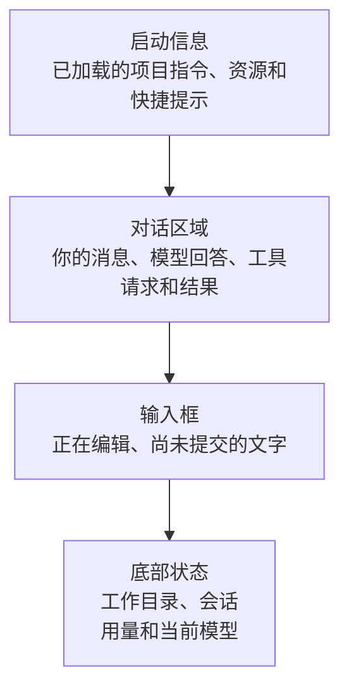

# 03 终端输入与快捷键

## 看懂 Pi 终端：输入、文件引用与常用快捷键

第一次打开 Pi，屏幕上同时有启动信息、对话、工具执行和底部状态。只要先分清“内容出现在哪里”和“当前按键会交给谁”，界面就不难理解。

## 界面是任务的入口和视图，不是模型本身

普通终端提供键盘输入和字符显示，Pi 在里面运行一套文本交互界面，叫 **TUI**。模型服务不会直接接收你的每次按键：你可以先改草稿、选文件或打开菜单，Pi 决定什么时候把完整消息交给任务层。

因此界面有两条方向相反的链。向内是“按键进入 Pi，Pi 判断是编辑、命令还是提交任务”；向外是“模型和工具产生进度，Pi 把这些进度变成屏幕内容”。按键失败可能是终端没有传对组合键，也可能是当前菜单接收了它，不一定涉及模型。

**焦点**就是“现在由哪个界面零件接收输入”。在输入框里按回车会提交或排队，在模型选择器里按回车会确认选项。同一个键有不同作用，源于当前接收者不同，而不是模型临时改变了主意。

还要区分三件事：**发生了什么、保存了什么、显示了什么**。工具输出折叠后仍可能已经进入模型材料；屏幕上的“开始执行”也不证明文件已被修改。界面帮你观察事实，但不代替工具回执、磁盘文件或持久记录。

理解这层关系之后，快捷键就不是一串孤立口令，而是在操作草稿、当前任务或显示方式中的某一层。

## 1. 先看懂四个区域

Pi 默认交互界面可以从上到下看成四块：



| 区域 | 你主要看什么 | 容易误解的地方 |
|---|---|---|
| 启动信息 | Pi 启动时发现了哪些项目指令和可复用资源 | 滚动后看不到，不代表它们没有加载 |
| 对话区域 | 已提交的消息、回答、工具请求、工具结果和错误 | 工具请求出现，不等于工具已经成功执行 |
| 输入框 | 当前正在编辑的草稿 | 没按回车前，草稿还没有交给模型 |
| 底部状态 | 当前目录、模型、思考强度、会话和上下文用量 | 累计用量与当前上下文占用不是一回事，后续会单独讲 |

扩展可以增加或替换部分界面，所以不同环境的外观可能略有差异；这四类信息仍然是理解默认界面的起点。

## 2. 草稿和已提交消息有什么区别？

在输入框里打字时，Pi 只是在编辑草稿。按下 `↩ Return` 后，草稿才成为用户消息，开始一次任务。


需要输入多行时，按 `⇧ Shift + ↩ Return`，或者按 `⌃ Control + J`。这两个按键是在草稿中换行，不会提交消息。

如果所在终端不能正确区分 `Shift+Return` 和普通回车，先用 `Control+J`。后面学习自定义快捷键时，再处理具体终端的兼容设置。

## 3. 五种输入长得相似，处理方式不同

| 输入形式 | 谁处理 | 例子 | 处理方式 |
|---|---|---|---|
| 普通文字 | 交给模型 | `解释这个函数` | 按回车后开始任务 |
| `/命令` | Pi 自己处理 | `/model`、`/quit` | 用来操作 Pi，不是给模型的问题 |
| `@文件` | Pi 的文件选择与消息输入 | `@README.md` | 先把文件引用放进草稿，尚未提交时不会开始任务 |
| `!命令` | Pi 的用户 Shell 入口 | `!pwd` | 执行真实命令，并让后续模型上下文可以看到这条 Shell 消息 |
| `!!命令` | Pi 的用户 Shell 入口 | `!!git status` | 执行真实命令，但组装模型上下文时排除这条 Shell 消息 |

`!` 和 `!!` 都会在当前用户权限下真实执行命令。两者的区别是后续模型上下文是否包含这条 Shell 消息，不是“执行”和“不执行”的区别，也不是安全模式。刚开始学习时先不要用它们操作重要目录。

只输入 `quit` 或 `exit` 属于普通文字，会发给模型；真正退出使用 `/quit`。

## 4. `@文件` 到底做了什么？

在输入框键入 `@`，Pi 会搜索当前项目中的文件。选中 `README.md` 后，文件引用进入草稿。

这时只发生了“找到并引用路径”，还没有提交消息，也没有证明文件内容已经进入模型请求。

可以输入：

```text
请读取 @README.md，并告诉我它主要介绍什么。
```

按回车后，才开始处理任务。对于[读取 README 的例子](02-Pi如何读取文件.md)那种工具路线，应该继续观察：

1. 模型是否提出读取目标文件。
2. `read` 是否返回正确内容。
3. 最终回答是否与读取内容一致。

文件名进入草稿只表示选中了路径；读取是否成功，需要查看工具结果。

命令行启动参数中的 `@文件` 还有另一种主动附加材料的用法，等讲一次性运行模式时再展开，不和这里的交互式文件选择混在一起。

## 5. 图片怎样放进消息？

在 macOS 中，可以先把截图复制到剪贴板，再回到 Pi 按 `⌃ Control + V`。Pi 会把剪贴板内容放进当前草稿；也可以把图片拖进终端。

粘贴完成仍只是草稿。按回车提交后，Pi 才会把图片交给支持图片输入的模型，或者安排读取图片。

图片练习只使用不含敏感信息的内容。截图很容易带入终端路径、账号、订单、聊天记录或密钥；发送前先检查整张图，而不只是准备提问的那一小块。

如果当前模型不支持图片，Pi 可能提示图片无法提供给模型。更换模型前先确认费用和账号权限，不要连续盲试。

## 6. 工具请求和工具结果怎么看？

当模型需要读取文件时，对话区域通常先出现工具请求，再出现工具结果，最后才是模型回答。

```text
你的消息
  -> read 工具请求
  -> read 工具结果
  -> 模型回答
```

默认可以按 `⌃ Control + O` 折叠或展开工具输出。折叠只改变屏幕显示，不会删除结果，也不会让模型忘记已经进入上下文的内容。

检查一个工具任务时，不要只看最后回答：

| 观察点 | 能证明什么 | 不能证明什么 |
|---|---|---|
| 出现工具请求 | 模型提出了操作申请 | 工具已经执行成功 |
| 出现正常工具结果 | 工具完成并交回了结果 | 模型一定理解正确 |
| 最终回答符合原文 | 这次回答使用材料后得到预期结果 | 以后处理所有文件都正确 |

## 7. 怎样取消当前任务？

模型正在生成、工具正在执行或 Pi 正在等待重试时，按 `Esc`（Escape）请求取消。

取消通常会让 Pi 尝试停止当前运行，但它是协作式停止：模型请求、工具或自定义扩展需要响应取消信号。它不是数据库事务，也不是撤销按钮。

例如，命令已经写入文件后再取消，之前的写入不会自动恢复；内容已经发送给外部模型服务后，也不能通过取消把它收回。

取消之后要做两件事：

1. 看界面是否已经回到可以输入的状态。
2. 如果之前允许修改或执行命令，检查文件和进程的实际状态。

## 8. 怎样退出 Pi？

优先使用最明确的方式：

```text
/quit
```

输入后按回车。

默认还有两种快捷方式：

- 输入框为空时按 `⌃ Control + D`。
- 连续按两次 `⌃ Control + C`；第一次通常用于清空输入框，第二次退出。

当输入框中有文字时，`Control+D` 可能执行向前删除字符，而不是退出。不同界面打开时，同一个按键也可能交给当前菜单处理。因此不确定焦点在哪里时，使用 `/quit` 最清楚。

退出只结束当前 Pi 进程，不会回滚文件修改、撤销远端请求或自动删除保存的会话。

## 9. 常用命令和快捷键速查

这张表用于忘记时快速找回，不代替前面的场景说明。

| 操作 | 默认输入 | 作用 |
|---|---|---|
| 提交草稿 | `↩ Return` | 把输入框内容作为消息提交 |
| 草稿内换行 | `⇧ Shift + ↩ Return` 或 `⌃ Control + J` | 插入换行，不提交 |
| 选择文件 | 输入 `@` | 搜索文件并把引用放进草稿 |
| 粘贴图片或文字 | `⌃ Control + V` | 将剪贴板内容放进草稿 |
| 展开或折叠工具输出 | `⌃ Control + O` | 只改变显示 |
| 取消当前运行 | `Esc` | 请求协作停止，不回滚副作用 |
| 选择模型 | `/model` 或 `⌃ Control + L` | 打开模型选择器 |
| 切换思考强度 | `⇧ Shift + Tab` | 在当前模型支持的级别中切换 |
| 展开或折叠思考内容 | `⌃ Control + T` | 只改变显示，不改变思考强度 |
| 查看完整快捷键 | `/hotkeys` | 查看当前版本和当前配置实际生效的键位 |
| 退出 | `/quit` | 结束当前 Pi 进程 |

快捷键可以自定义，版本也可能改变默认值。因此发生冲突时，以当前 Pi 中 `/hotkeys` 显示的结果为准。

Mac 上这里写的 `Control` 是键盘左下区域的 `⌃` 键，不是常见图形应用使用的 `⌘ Command`；英文说明中的 `Alt` 通常对应 `⌥ Option`。

## 10. 跟着做：检查一条读取任务的界面过程

完成[读取 README 的练习](02-Pi如何读取文件.md)时，再按下面顺序观察一遍：

1. 提问在输入框中时，确认它仍是草稿。
2. 按回车后，确认提问进入对话区域。
3. 找到 `read` 工具请求和读取路径。
4. 按 `Control+O`，观察工具内容折叠与展开不会改变最终回答。
5. 任务结束后输入 `/quit`，确认回到普通终端。

这组观察用于理解界面，不需要重新发送第二次付费请求。读取练习已经成功时，可以直接检查同一次运行留下的界面过程。

## 11. 适用版本

界面区域、输入类型和默认快捷键按 Pi `0.85.1` 核对。本文以 macOS 键位为主；Windows 和部分终端对粘贴、多行输入及组合键的处理不同，具体差异在相关操作需要使用时单独说明。

下一篇学习[基础工具与操作边界](04-基础工具与操作边界.md)，区分读取、写入、局部修改和执行命令。
