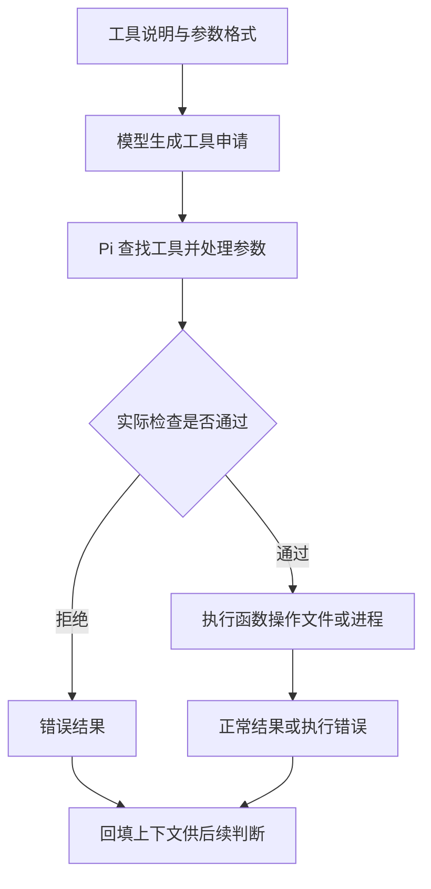
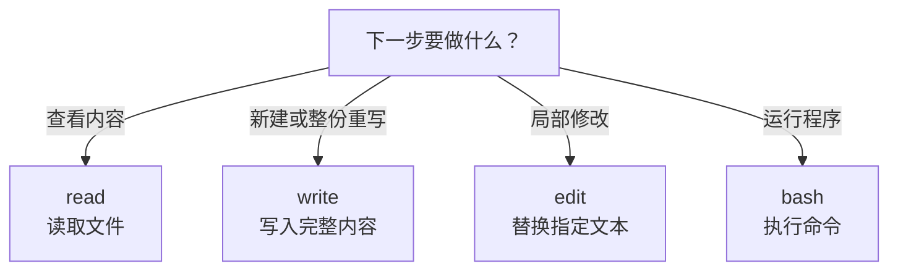

# 04 基础工具与操作边界

## 读取、写入、编辑和执行命令，分别该用什么工具？

读完 README 后，你知道“小书架”是做什么的了。接下来想让 Pi 改一处功能：修正已读书籍的统计，再运行测试。

这时，单靠读取就不够了。它要先拿到代码，再修改文件，最后运行程序检查结果。

**不同步骤需要不同工具；但工具返回成功，并不等于整个任务完成。**

## 工具为什么需要名称、参数和执行函数？

你给人说“把那一处改一下”，对方可能通过手势和上下文知道位置；程序不能靠这种模糊表达打开文件。模型与 Pi 之间需要一个清楚的约定：调用哪个工具、传哪些值、怎样知道执行结果。

工具的定义有两面。给模型看的一面是名称、用途和参数格式，让它能提出结构化申请；留在执行端的一面是真正的函数，负责读取、写入或启动进程。**Schema**就是参数的格式说明，例如 `path` 应当是字符串。**Executor**就是实际执行这些参数的程序。



“参数是合法字符串”和“这个路径允许访问”不是同一种检查。前者解决数据能不能交给函数，后者解决操作应不应该发生。某一层没有实现的路径策略，不会由模型说明自动补上。

### 为什么不只给一个万能 Shell？

Shell 确实能做很多事，但权限大、语义复杂。读取一段内容时使用明确的 `read`，比执行任意脚本更容易看清目标；局部修改用 `edit`，也比重新生成整份文件更容易核对差异。

不同工具把常见操作变成更明确的接口，并不构成操作系统隔离。特别是保留 `bash` 时，删除 `write` 也挡不住命令写文件。应该按任务选择工具，再按风险决定是否需要真正的系统权限限制。

### 为什么结果里既有内容，也有错误？

工具把现实中的操作结果交回循环。读取失败时，模型需要知道“没有拿到文件”，才能判断是路径错误还是应当停止。若把错误伪装成普通成功内容，后续判断就会建立在错误前提上。

另一方面，工具执行成功只对自己的职责负责。`edit` 确实替换了文字，不代表算法正确；测试命令结束，也不代表它覆盖了所有需求。这就是后面要把工具结果、业务测试和修改范围分开核对的原因。

## 1. 先按要做的事情选工具

Pi 默认向模型提供四种基础工具：

| 你要做什么 | 工具 | 实际操作 |
|---|---|---|
| 看文件里写了什么 | `read` | 打开文件，返回文字或支持的图片 |
| 新建文件，或明确重写整份文件 | `write` | 把提供的完整内容写入指定路径 |
| 修改现有文件的一小部分 | `edit` | 找到旧文本，用新文本替换 |
| 运行测试、构建或查看 Git 差异 | `bash` | 启动 Shell 执行命令，收集输出 |



这不是一条必须把四个工具都用一遍的流水线。例如修复一个已有函数，通常只需要 `read`、`edit` 和 `bash`，不需要 `write`。

这些名称也不是 Pi 输入框里的斜杠命令。你可以用普通话提出任务，模型再选择工具；如果只写“建议这样修改”并附上一段代码，文件不一定发生过变化。

## 2. `read`：先取得材料，再讨论内容

假设当前目录有一个 `notes.txt`：

```text
书架名称：小书架
状态：待整理
书目数量：3
```

你可以在 Pi 中说：

```text
请用 read 读取 notes.txt，只告诉我当前状态，不修改文件。
```

模型可能提交这样的工具参数：

```json
{
  "path": "notes.txt"
}
```

这里的 JSON 是参数示例，用来帮助你看懂工具调用，**不需要手工输入到 Pi**。

### 文件很长，怎样只读其中几行？

`read` 支持指定起始行和读取行数：

```json
{
  "path": "notes.txt",
  "offset": 2,
  "limit": 1
}
```

这表示从第 2 行开始，最多读 1 行。行号从 `1` 开始，不是数组常用的 `0`。

预期取得 `状态：待整理`。结果还可能附带“后面仍有内容”的提示，这个提示不是原文件正文。

默认文字输出最多保留 2,000 行或 50 KiB，以先达到的限制为准。看到截断或剩余行提示时，不能说整份文件已经读完；可以从提示给出的下一行继续读取。它限制的是**返回内容**，不是“操作系统只允许读取这么大的文件”。

对于图片，`read` 返回的材料形式不同，还取决于模型是否支持图片输入；本篇只使用文字文件。

### 读取成功能证明什么？

它证明这次工具取得了指定材料，不证明模型的总结一定准确。还需要对照返回内容检查回答，方法与[读取文件的例子](02-Pi如何读取文件.md)相同。

相对路径以本次工具执行的工作目录为基础；`notes.txt` 并不是电脑上所有同名文件的统称。路径错误时先核对目录，不要让模型不断扩大搜索。

## 3. `write`：提供完整内容，不是追加一句话

假设你希望新建上面的 `notes.txt`，`write` 参数可以是：

```json
{
  "path": "notes.txt",
  "content": "书架名称：小书架\n状态：待整理\n书目数量：3\n"
}
```

`path` 指向文件，`content` 是准备写进去的全部文字；JSON 中的 `\n` 表示换行。

`write` 的关键规则是：

- 文件不存在：创建文件；缺少的父目录也会创建。
- 文件已经存在：用新内容覆盖原内容。
- 它不会因为你只给了一句话，就自动理解成“追加到末尾”。

例如，对已有的三行文件只写入 `状态：已整理`，结果就可能只剩这一行，另外两行被覆盖。

因此，修改一处状态时优先用 `edit`。确实要重写整个文件时，也要先读取原文，确认需要保留的内容，并准备恢复办法。

工具报告写入成功后，再读取一次或用编辑器检查磁盘文件。**聊天里出现“创建完成”和磁盘上存在正确文件，是两件需要对应核对的事。**

## 4. `edit`：用一段旧文本定位修改位置

现在只把状态从“待整理”改成“已整理”，其余两行不动。

Pi `0.85.1` 的参数形式是：

```json
{
  "path": "notes.txt",
  "edits": [
    {
      "oldText": "状态：待整理",
      "newText": "状态：已整理"
    }
  ]
}
```

可以把它读成一句话：

> 在 `notes.txt` 里，找到“状态：待整理”，把它换成“状态：已整理”。

`edits` 是修改列表；这里只放一项。每项的 `oldText` 是定位用的旧内容，`newText` 是替换后的内容。

### 为什么通常要先读，再改？

因为模型需要知道文件**现在**的内容。凭旧对话记忆构造 `oldText`，文件可能早已被你或其他程序修改过。

应使用当前读取到的原文，包含必要的空格与换行。实现虽然会对少量字符差异做规范化匹配，也不应依赖它来猜测修改位置。

常见拒绝原因：

| 情况 | 应怎样处理 |
|---|---|
| 找不到旧文本 | 重新读取当前文件，检查内容是否变化 |
| 旧文本出现多次 | 补上足以唯一定位的上下文，不要整份盲替换 |
| 同一次调用的修改范围重叠 | 合并为一个连续修改，或重新划分互不重叠的位置 |
| 文件不存在或没有写权限 | 检查路径和权限，不把错误当成修改成功 |

一次调用包含多项修改时，各项都匹配**调用前的同一份原文**，不是先应用第 1 项，再让第 2 项匹配第 1 项的结果。这里只需记住：互相依赖的相邻变化可以合成一项。

修改成功后，工具通常会显示差异，帮助你看到哪些行被删掉、哪些行被加入。最终仍应检查磁盘上的文件；它不是跨多个文件的事务，也不保证遇到任何异常都自动恢复。

## 5. `bash`：把命令交给真正的程序执行

假设练习项目已有测试文件 `books.test.mjs`，可以让 Pi 执行：

```json
{
  "command": "node --test books.test.mjs",
  "timeout": 30
}
```

`command` 是 Shell 命令，`timeout` 是本次命令的超时秒数。这里给出 30 秒，是这次小练习的选择；`bash` 工具省略该参数时没有默认执行时限。

它与模型服务的请求超时不是同一个东西，也不能给整段对话设置总时限。

### 先读输出，再看任务是否达到目标

一个命令通常有三类值得看的信息：

| 信息 | 大白话解释 | 例子 |
|---|---|---|
| 标准输出 | 程序正常打印的内容 | 测试名称、通过数量 |
| 标准错误 | 程序用于诊断的信息 | 警告、异常原因 |
| 退出码 | 程序结束时交回的数字 | 通常 `0` 表示成功，非零表示失败或其他状态 |

Pi 的 `bash` 会收集标准输出和标准错误。命令以非零状态结束时，结果会包含失败提示；不要因为前面出现了几行正常输出，就忽略末尾的错误。

反过来，输出了警告也不必然代表失败；要结合退出码和该命令的约定判断。例如 `git diff --no-index` 的 `1` 表示比较出了差异，不是程序无法运行。

输出很长时，`bash` 默认保留最后 2,000 行或 50 KiB，并提示完整输出所在的临时文件。尾部没出现错误，不证明被截掉的部分没有问题。

### 为什么运行测试也需要谨慎？

测试是代码，不是天然安全的检查器。它可以修改文件、启动进程，甚至访问网络；构建和安装脚本也一样。

所以第一次练习只运行你看过的虚构代码，不在陌生项目里直接执行模型建议的安装、清理或部署命令。

每次 `bash` 调用是一个新的 Shell 进程。一次调用中的 `cd` 或 `export` 不会自动成为后续调用的持久状态；不要把它当成始终开着的交互终端。

## 6. 模型的 `bash` 与你输入的 `!` 有什么关系？

它们都是执行真实命令，但发起者不同：

| 入口 | 谁决定执行命令 | 如何发起 |
|---|---|---|
| 模型调用 `bash` | 模型根据任务提出申请 | 普通消息要求运行测试，随后观察工具调用 |
| 用户输入 `!` 或 `!!` | 你直接要求执行 | 在 Pi 输入框提交 `!pwd` 等命令 |

`!!` 只是在后续模型上下文中排除这条 Shell 消息，不是不执行，也不是保密保证。具体输入方式见[终端输入与快捷键](03-终端输入与快捷键.md)。

尤其注意：`--no-tools` 限制的是提供给模型的工具，不会同时关闭用户的 `!` 入口。

## 7. 工具名单不是系统权限表

只允许模型查看文字文件，可以这样启动：

```bash
pi --tools read --no-extensions --no-skills --no-prompt-templates --no-themes --no-context-files --no-session
```

这条命令只向模型开放 `read`，关闭额外资源自动发现，并且不保存本次会话；仍会使用已有设置与认证。它不是完全隔离的环境，使用前仍要检查并信任现有配置。

如模型接入依赖 Extension，关闭 Extension 会使那种接入不可用，不能不加判断地照抄。

还可以显式开放 `grep`、`find`、`ls`，分别搜索文件内容、按路径模式找文件和列目录。它们是其他内置工具，但不是默认四种基础工具的一部分；不必为了读取一个已知文件先全部启用。

最容易误判的是这两种情况：

1. **仅有 `read`，不等于只能读当前目录。** 内置读取工具仍拥有当前系统用户的文件访问权限。
2. **移除 `write`，不等于不能写文件。** 只要还开放 `bash`，命令就可能用其他方式写入或删除文件。

Project Trust 管的是是否加载项目设置和扩展，不是文件权限。普通提示词中的“只改这个文件”也只是任务要求，不是强制门禁；Pi 默认不会为每次危险操作自动弹出审批框。

因此，第一次写入练习必须放在只含虚构材料的新目录里。需要强制限制目录或网络时，靠操作系统、受限用户或容器等边界实现，不能用工具名字代替。

## 8. 一个小修改，怎样算完成？

以修改 `notes.txt` 的状态为例，依次检查：

1. `read` 返回的确实是目标文件和当前内容。
2. `edit` 把指定状态改掉，其他两行仍然保留。
3. 如果修改影响程序行为，运行对应测试，不只检查文本长得像预期。
4. 查看最终差异，确认没有额外文件或无关修改。
5. 总结写了什么、验证了什么，以及没有验证什么。

如果途中发生错误，不要直接从第 1 步盲目重来。前一次写入可能已经发生，重复整个任务可能再次产生副作用。

先按 `Esc`（Escape）请求取消，等当前运行停止，再读取文件和检查差异。取消、超时和退出都不是撤销；需要恢复时使用已确认的文件备份或 Git 版本。

## 9. 一分钟回忆

| 工具 | 一句话记忆 | 最要防止的误解 |
|---|---|---|
| `read` | 取出材料 | 部分读取不等于读完整份文件 |
| `write` | 写入整份内容 | 写一句话不等于追加一句话 |
| `edit` | 定位并替换旧文本 | 匹配成功不等于业务逻辑正确 |
| `bash` | 执行真实程序 | 测试和 Shell 也可能产生副作用 |

**看过内容、写入成功、测试通过和任务完成，是逐层核对的结果，不能互相替代。**

下一篇用[一个完整开发任务](05-完成一次开发任务.md)把这些步骤连起来，不需要背工具参数。

## 10. 适用版本

工具名称、参数和默认输出限制按 Pi `0.85.1` 核对，以 macOS 的文字文件和 Bash 场景为主。这里使用内置工具；扩展可以替换同名工具，替换后的行为需要另行检查。

现有[基础工具样本](../../labs/1.2-tools/)保留了历史练习结果。复做时先看[实验总入口的样本说明](../../labs/README.md#工具与-skill-样本)，复制到独立目录，不覆盖仓库基线；调用参数仍按本篇版本核对。
