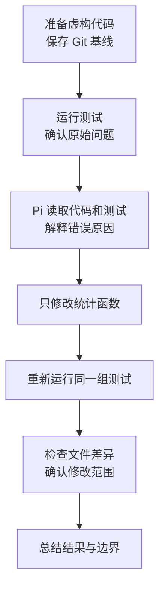
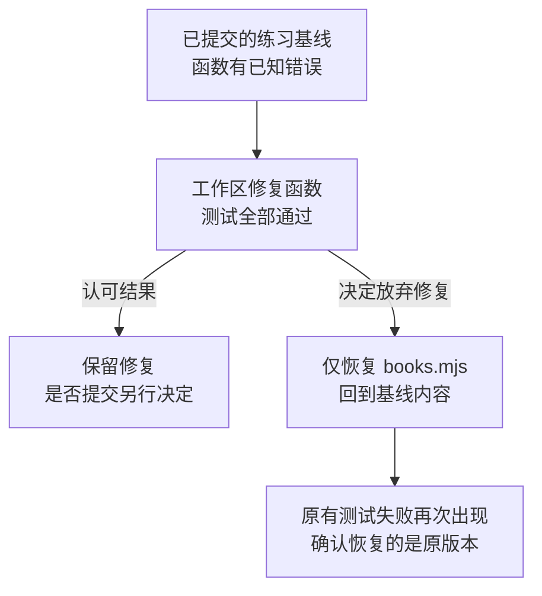

# 让 Pi 修复一个小问题：从分析到验证

小书架里有三本书，两本已经读完，一本还没有读。统计函数却把“已读数量”显示成了 `3`。

这次不让 Pi 随意完善整个项目，只给它一个明确任务：**修正已读数量，并证明没有改到无关内容。**

## 一次开发任务，为什么不只是生成一段代码？

“把统计函数改成过滤已读书籍”是一种方案；“输入三本书、其中两本已读时应返回 2”才是可检查的要求。模型可以提出方案，但不能仅凭它对方案的评价证明正确。

这里有两个循环。**Pi 的工具反馈循环**负责拿到材料、修改和继续判断；**开发验证过程**负责确认这些动作确实解决了原问题。二者会配合，但不相等：Agent 可以正常结束，代码却仍然有错。

### 目标、范围与验收为什么要一起提供？

目标描述“最后要变成什么”；范围描述“哪些变化允许发生”；验收描述“拿什么事实判断达到了目标”。只给目标，模型可能顺手改很多文件；只给范围，模型未必知道正确结果；只给“测试通过”，又可能漏掉测试根本没覆盖的要求。

本例的目标是正确统计已读数量，范围是仅改统计函数，验收是同一组测试通过且其他文件没动。它不需要增加输入校验、数据库或页面。任务明确之后，少量工具就足以完成它。

### 为什么先看失败，再看成功？

假设测试原本就只检查空数组，错误实现也可能通过。修改后仍然 Green，不能说明修复了什么。先看到“两本已读却返回 3”的失败，才能确认测试确实在检验这次问题。

保持测试不变再改实现，就得到一次有对照的观察：同一输入和要求，原实现失败，新实现通过。这里不要求把所有软件开发都变成固定流程，而是用最小对照避免“程序运行过，所以修好了”的误判。

Git 又承担另一种职责：保存原内容和比较差异。它能告诉你改了什么、帮助恢复版本，却不判断这段代码是否符合业务含义。因此需要测试和 Git 两类证据，不能二选一。

### 模型应在哪些地方作判断？

读取后判断根因，测试后判断修改是否有效，发现意外差异时判断是否需要停止。不是一开始生成一长串命令，然后不看结果地全部执行。让行动依赖上一轮事实，才用到了 Agent Loop 的反馈价值。

理解这点后，下面的练习就不仅是在背命令，而是在观察一项任务如何形成可信的完成结论：



## 1. 开始前先约定范围

本篇使用 Node.js 自带的测试工具，只需两个 JavaScript 文件。不需要安装 npm 依赖，也不需要先学一个前端或后端框架。

在普通终端中分别检查：

```bash
node --version
git --version
pi --version
```

Node.js 不低于 `22.19.0`，Pi 使用 `0.85.1`，安装与认证可回看[第一次对话](00-安装与第一次对话.md)。Git 需要支持 `git restore`；macOS 缺少 Git 时，可运行 `xcode-select --install` 安装命令行开发工具，完成后重新检查版本。

本次边界如下：

- 使用已经检查并信任的 Pi 配置，以及支持工具调用的模型；关闭扩展后仍须能接入该模型。
- 只在新建的虚构练习目录中操作，不使用真实项目或包含私人数据的目录。
- 只允许修复 `books.mjs`，不改变测试，不安装依赖，不提交修复，也不推送。
- 模型请求可能产生费用，读取的代码和测试输出可能发送给所选模型服务。

练习目录不是沙箱，提示词也不是权限系统。运行模型生成的命令前仍需观察；不能接受这类本机权限时，先准备受限环境，不直接进行这次写入练习。

## 2. 准备两个很小的文件

在现有项目之外选择一个练习位置，在**普通终端**执行：

```bash
mkdir pi-books-task && cd pi-books-task && pwd
```

确认路径以 `pi-books-task` 结尾。目录已经存在时停止，换个新名字；不要复用里面有不明资料的旧目录。

用熟悉的编辑器创建下面两个文件。文件名必须完全一致，不能多出 `.txt` 后缀。

### `books.mjs`：负责计算数量

```javascript
export function countReadBooks(books) {
  return books.length;
}
```

先保留这个错误，不要提前修好。

这个函数接收一组书籍并返回一个数字。`books.length` 是书籍总数，没有检查每本书是否读完，这正是要修复的问题。

### `books.test.mjs`：负责检查结果

```javascript
import assert from "node:assert/strict";
import test from "node:test";
import { countReadBooks } from "./books.mjs";

test("counts only read books", () => {
  const books = [
    { title: "Terminal Basics", read: true },
    { title: "Git Practice", read: false },
    { title: "Tool Calls", read: true },
  ];
  assert.equal(countReadBooks(books), 2);
});

test("returns zero for an empty shelf", () => {
  assert.equal(countReadBooks([]), 0);
});

test("returns zero when no books are read", () => {
  const books = [
    { title: "Terminal Basics", read: false },
    { title: "Git Practice", read: false },
  ];
  assert.equal(countReadBooks(books), 0);
});
```

只补几个当前例子必需的语法：

| 写法 | 在这里的含义 |
|---|---|
| `.mjs` | 告诉 Node.js 这是使用 `import`、`export` 的 JavaScript 模块 |
| `export function` | 允许另一个文件导入并调用这个函数 |
| `read: true` / `read: false` | 这本书已读 / 未读；本篇输入中的 `read` 都是布尔值 |
| `test(名称, 检查过程)` | 定义一项有名称的测试 |
| `assert.equal(实际值, 预期值)` | 两个值不相等时让测试失败 |

第一项应该得到 `2`，第二项应该得到 `0`，第三项也应该得到 `0`。测试名称是为了方便在输出里辨认，不是新的工具名称。

## 3. 先保存一个能找回来的基线

让模型开始改动前，先保存原始文件。Git 在本篇的作用是记录一个明确版本，并提供修改前后的比较依据。

仍在练习目录的普通终端中，逐条执行；任一条失败就停下：

```bash
git init
git add -- books.mjs books.test.mjs
git diff --cached --stat
```

`git init` 创建这个练习目录自己的 Git 仓库；`git add` 把指定文件放入准备保存的列表，叫暂存区；最后一条检查暂存范围。

预期只看到 `books.mjs` 和 `books.test.mjs` 两个文件。确认后保存基线：

```bash
git -c user.name=Pi-Learner -c user.email=pi-learner@example.invalid -c commit.gpgsign=false commit -m "practice: save initial books task"
```

这里临时使用虚构提交身份，并对这一次提交关闭签名，不修改你的全局 Git 配置。基线提交只保存到本机；它包含一个已知错误，是为了稍后能比较和恢复，不代表代码已经正确。

检查保存结果：

```bash
git status --short
```

预期没有文件列表。若仍列出文件，先检查是不是忘记保存编辑器内容或出现了额外文件，不要直接把全部目录加入提交。

## 4. 亲自看到修改前的失败

在普通终端执行下面三行。`rc=$?` 必须紧接测试命令，才能保存那次测试的退出码：

```bash
node --test books.test.mjs
rc=$?
printf 'exit=%s\n' "$rc"
```

预期：

| 检查项 | 实际值 | 预期值 | 结果 |
|---|---|---|---|
| 只统计已读书籍 | `3` | `2` | 失败 |
| 空书架 | `0` | `0` | 通过 |
| 全部未读 | `2` | `0` | 失败 |

汇总应为 3 项测试、1 项通过、2 项失败，测试退出码为 `1`。不同 Node.js 版本的排版可能不同，以测试名称、实际值和汇总为准。

**这里的失败是预先放进去的练习问题，不是安装失败。**

如果看到找不到文件、语法错误或无法导入模块，说明夹具还没有准备好，先修正目录或录入问题。若一开始就是全部通过，也先检查是不是提前改了函数或测试。

## 5. 启动 Pi，只开放本次需要的工具

仍在练习目录中启动：

```bash
pi --tools read,edit,bash --no-extensions --no-skills --no-prompt-templates --no-themes --no-context-files --no-session
```

本次需要读取文件、局部修改和运行测试，因此只向模型开放 `read`、`edit`、`bash`。不用新建文件，所以没有提供 `write`。

这并不代表“模型只能改 `books.mjs`”：`edit` 可以访问其他有权限的路径，`bash` 也能写文件。工具名单只缩小能力入口，不是文件白名单。

其余选项关闭额外资源自动发现和会话保存，但不会清除已有设置与认证。它们的完整说明可回看[安装与第一次对话](00-安装与第一次对话.md)。本篇不用 `--approve`，也不安装或信任任何第三方资源。

## 6. 把目标、边界和验收要求一起说清楚

在 Pi 输入框提交下面这段普通文字：

```text
请修复这个虚构小书架练习中的 countReadBooks。

先用 read 读取 books.mjs 和 books.test.mjs，解释错误原因。
books 参数是一组书籍，每本书的 read 都是布尔值；只统计 read 为 true 的书。
只允许用 edit 修改 books.mjs，保留函数名和参数，不修改 books.test.mjs。
不要新增文件、依赖、输入校验或其他功能，不访问目录外内容。

修改后用 bash 运行 node --test books.test.mjs，命令超时设为 30 秒。
再分别运行 git diff -- books.mjs books.test.mjs 和 git status --short，检查实际差异。
不要执行安装、联网、Git 暂存、提交、恢复或推送命令。
若读取或编辑失败，停止并说明原因，不改用整份覆盖或其他写入方式。
若测试失败，保留现状并报告，不通过修改测试来让结果变绿。
最后说明改了什么、测试结果和仍未验证的内容。
```

输入多行时可以按 `⇧ Shift + ↩ Return`，或 `⌃ Control + J`；单按 `↩ Return` 提交。Mac 上是 Control，不是 Command。

这段要求分成三个部分：

| 部分 | 回答的问题 |
|---|---|
| 目标 | 要修正什么，正确结果是什么？ |
| 范围 | 允许改哪里，不允许做什么？ |
| 验收 | 要运行什么，最终拿什么判断成功？ |

一句“帮我优化一下”缺少这些约束，模型就容易把任务理解得太宽。文字约束仍需要你检查执行结果，不能替代强制权限控制。

## 7. 观察执行过程，不只等最后一句话

正常路线应包含：

1. `read` 读取两个文件，模型指出错误在于直接使用书籍总数。
2. `edit` 只修改 `books.mjs` 的统计方式。
3. `bash` 运行同一组测试。
4. `bash` 查看差异和文件状态。
5. 模型根据结果总结。

调用次数和回答措辞可能变化，不要求每次都严格一样。验收看的是实际文件、测试和差异，而不是工具卡片的数量。

工具输出折叠时，默认按 `⌃ Control + O` 展开。若模型要安装依赖、改测试或访问其他目录，按 `Esc`（Escape）请求取消，等运行停止后检查实际文件，不继续盲发“重试”。

一种符合要求的实现是：

```javascript
export function countReadBooks(books) {
  return books.filter((book) => book.read === true).length;
}
```

`filter` 先保留 `read === true` 的书，`.length` 再统计保留下来的数量。它不是必须逐字照抄的唯一实现；关键是满足约定输入和测试，不增加无关行为。

## 8. 独立复验：测试、差异和状态要一起看

等任务结束，在 Pi 输入框输入 `/quit`，按回车回到普通终端。退出不会回滚已经写入的代码。

### 再运行一次测试

```bash
node --test books.test.mjs
rc=$?
printf 'exit=%s\n' "$rc"
```

预期 3 项测试全部通过，失败为 `0`，测试退出码为 `0`。这次由你独立运行，不需要再发送模型请求。

### 查看最终修改

分别执行：

```bash
git diff -- books.mjs books.test.mjs
git diff --check
git status --short
```

采用上面的实现时，差异的关键部分应是：

```diff
 export function countReadBooks(books) {
-  return books.length;
+  return books.filter((book) => book.read === true).length;
 }
```

`-` 表示原来的行，`+` 表示新加入的行；它们是差异标记，不是文件中需要保留的字符。

同时检查：

| 结果 | 预期 |
|---|---|
| `books.mjs` | 只有与统计逻辑有关的修改 |
| `books.test.mjs` | 没有修改 |
| `git diff --check` | 无空白错误提示；这不是程序逻辑测试 |
| `git status --short` | 只显示 ` M books.mjs`，没有额外文件 |

`git status --short` 的前一列反映暂存区，后一列反映工作区。这里前面空一格再出现 `M`，表示文件已修改但没有暂存；`??` 表示未跟踪文件。

只看 `git diff` 不够：它默认比较已跟踪文件的未暂存修改，不会展示所有未跟踪文件，也不包含已经暂存的差异。若状态和预期不同，应再检查 `git diff --cached`，不要把一份空 diff 当成“没有任何改动”。

三个测试通过只证明这三个输入符合预期。它不证明非法输入、超大数据或任意业务场景；本次本来就没有要求增加这些能力。

## 9. 失败或不满意时，怎样处理？

| 现象 | 下一步 |
|---|---|
| 登录、网络或额度错误 | 停止重复请求；确认服务访问问题，别把它当代码缺陷 |
| 编辑提示找不到旧文本 | 先读取当前文件，确认是否已被修改 |
| 测试仍是原来的失败 | 看函数实际代码，确认修改是否落盘；不要只信总结 |
| 出现新的测试错误 | 保留输出和当前差异，先定位这次修改引入的问题 |
| 测试通过，但测试文件也被改了 | 不能按本篇验收；先检查是不是把断言改弱了 |
| 任务被取消或超时 | 先确认运行停止，再看文件与进程；不要假设未发生写入 |

需要继续请 Pi 分析时，再单独授权下一次小范围修复，并给出失败信息。不把“重试”理解成可以从头重复所有写入或命令。

### 只在决定放弃修复时恢复练习基线

正常成功后无需恢复。下面的操作会丢弃 `books.mjs` 中尚未提交的修改，**仅限本篇新建的练习仓库**。

先关闭 Pi、检查当前目录和差异，确认基线提交以后没有其他需要保留的工作。由于我们禁止 Pi 提交修复，`HEAD` 应仍指向第 3 节保存的初始版本：

```bash
git log -1 --oneline
git diff -- books.mjs
```

确认要丢弃当前修复后，才执行：

```bash
git restore --source=HEAD --worktree -- books.mjs
```

这条命令只把指定文件的工作区内容恢复成最近提交的版本；不恢复整个目录，不删除未跟踪文件，也不修改暂存区。

恢复后再检查：

```bash
git diff -- books.mjs
git status --short
node --test books.test.mjs
```

若前面只有本篇那一处修改，差异和状态应为空，而测试会重新出现原来的 **1 项通过、2 项失败**。这是回到了已知错误基线，不是恢复操作又制造了新问题。



没有提前保存到 Git 的内容，不能指望这条命令替你找回。Pi 的会话记录、取消操作和退出程序，都不能代替文件版本管理。

## 10. 最后怎样总结，才方便以后接着做？

一次合格的收尾可以是：

```text
修改：books.mjs 现在只统计 read 为 true 的书籍。
范围：没有修改 books.test.mjs，没有新增文件、依赖或功能。
验证：node --test books.test.mjs，3 项通过、0 项失败；差异与状态已核对。
未验证：约定之外的输入、其他系统环境，以及真实业务使用。
Git：修复尚未提交，未推送；初始练习基线仍可用于比较。
```

这只是正常成功路线的总结示例，必须按实际结果填写。测试没运行就写没运行，恢复了基线就写已经恢复，不要把模型计划执行的事情写成已完成。

## 11. 一分钟回忆

先记住这条路线：

> **保存起点 → 看见原始失败 → 读取并分析 → 小范围修改 → 重跑同一测试 → 检查差异和状态 → 如实总结。**

四个检查不能省略：

1. 修改前确实存在预期问题。
2. 修改后通过的是同一组测试，不是被改弱的断言。
3. 最终差异只包含允许的内容。
4. 取消不等于撤销；恢复依赖事先保存的版本。

忘记工具区别时回看[基础工具与操作边界](03-基础工具与操作边界.md)，忘记输入按键时回看[终端输入与快捷键](02-终端输入与快捷键.md)。

## 12. 适用版本

Pi 启动选项和工具行为按 `0.85.1` 核对。命令以 macOS 普通终端为例，练习使用 Node.js 自带测试工具和 Git；不同版本的测试输出排版可以不同，验收看测试结果、实际差异与文件状态。

下一篇：[模型选择与用量](05-模型选择与用量.md)。
