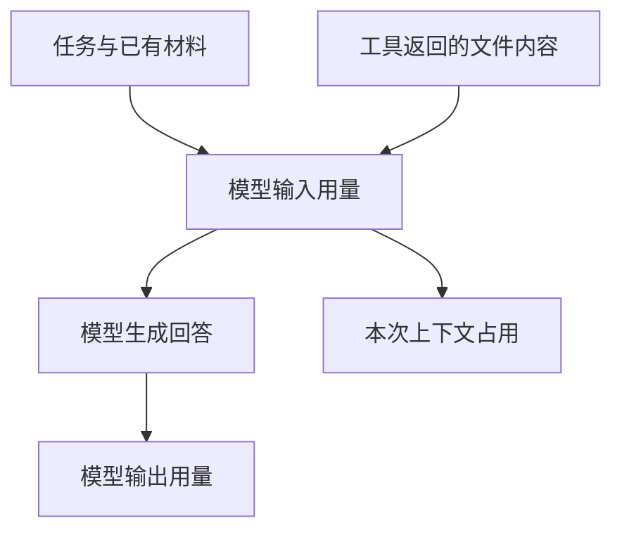

# 选择模型，调整思考强度，看懂用量

同一个“小书架”项目里，解释函数和分析复杂缺陷并不是同一种工作。你可以给它们选择不同模型，但先要分清：**换模型、增加思考强度和增加上下文容量，是三件事。**

## 1. 模型名称前为什么还有一个名字？

把模型服务看作一个提供计算的柜台：服务商负责账号、地址和额度，模型是这个柜台里具体可用的能力。

| 名称 | 解决的问题 | 例子含义 |
|---|---|---|
| Provider，服务商 | 请求送到哪里，使用哪份认证 | `openai` 是接入标识 |
| Model，模型 | 让哪个模型处理请求 | 同一个服务商可以提供多个模型 |
| Thinking，思考强度 | 支持推理的模型采用什么推理档位 | `medium`、`high` 等 |
| Context Window，上下文窗口 | 一次能容纳多少模型材料 | 不等于整个会话文件大小 |

模型选择器列出一个名称，不代表你的账号一定有调用权限。服务商也可能动态调整模型目录、额度和定价。

## 2. 切换当前模型

在已经完成认证的 Pi 中，先等当前任务结束，再输入 `/model`。也可以在主输入界面按 `Control + L`。

1. 输入关键词筛选服务商或模型。
2. 用方向键选择，按回车确认。
3. 检查底部实际显示的服务商与模型。
4. 下一次提交任务时，才会用这个选择发起请求。

在选择器里按 `Control + S` 可以保存启动默认模型。**本次选择和下次启动默认值不要混为一谈。** 恢复旧会话或指定 CLI 参数时，还需要检查实际选择。

选错了但尚未发送任务，可以重新打开选择器。已经发送给外部服务的材料，不会因切换模型而被收回。

## 3. 调整思考强度

输入 `/thinking` 选择档位；主输入界面的 `Shift + Tab` 用于轮换可用档位。在思考选择器中按 `Control + S` 保存默认值。

Pi `0.85.1` 的档位名称包括：

```text
off → minimal → low → medium → high → xhigh → max
```

这是一组配置名称，**不是每个模型都支持的统一七档能力**。Pi 会根据模型能力处理可用档位，某些模型不支持推理或只接受部分档位。

对于小书架的简单统计错误，可以先选通常使用的中等档位；复杂问题再调整。不要把最高档当作正确性保证，更不能用“模型想得很久”代替测试。

`Control + T` 只是折叠或展开界面里的思考区块，不会改变模型的推理档位，也不会减少已经产生的用量。

## 4. 只在几个模型之间快速切换

如果模型列表很长，输入 `/scoped-models`，选定平时需要轮换的几个模型。这里的 Scoped Models 指**快速切换范围**，不是限制账号只能使用这些模型。

在主输入界面：

| 按键 | 行为 |
|---|---|
| `Control + P` | 切到范围中的下一个模型 |
| `Shift + Control + P` | 切到上一个模型 |
| `Control + L` | 打开完整选择器 |

同一个 `Control + P` 在不同选择器里可能执行别的操作，因此本表只适用于主输入界面。

也可以在启动时使用 `--models` 指定逗号分隔的模式。通配模式会随着模型目录变化匹配不同条目；需要可复现的实验时，应记录完整服务商和模型 ID，而不只记“用了默认模型”。

## 5. 底部的数字各自说明什么？

假设你让 Pi 读 README 后总结，材料至少包括任务、工具说明、读取结果，以及模型生成的回答。



Token 是模型使用的计量单位，不等于汉字数、英文单词数或文件字节数。相同文字在不同模型下也可能产生不同计数。

| 显示项 | 应怎样理解 |
|---|---|
| 输入、输出 Token | 累计送入和生成的材料用量 |
| 缓存读取、写入 | 服务报告的缓存相关用量，不是磁盘文件缓存 |
| 上下文占用百分比 | 当前模型材料相对窗口容量的占用 |
| 费用 | 根据返回用量和模型价格计算的显示值 |
| `/session` 统计 | 当前会话相关信息与累计用量，可能包括摘要及工具报告的嵌套模型工作 |

累计输入可能很大，而当前上下文占用不高：同一份材料可能多次发送，旧材料也可能已压缩。反过来，一次巨大的工具结果就可能迅速占满上下文。

费用为零不一定代表免费。订阅、未知价格、自定义接入没有正确报告用量等情况，都可能让显示值不能代表实际账单。最终费用和额度要向服务商核对。

## 6. 做一次有边界的观察

这一步会提交模型任务，只有确认账号、材料和费用后再执行；不需要为了观察数字去重复请求。

1. 在虚构练习目录打开 Pi，记录底部模型和思考档位。
2. 输入 `/session`，只在本机观察统计，不复制完整会话或真实标识。
3. 提交“请用一句话解释数组的 `filter`，不要使用工具”。这只是行为要求；需要强制无工具时，应从启动时使用 `--no-tools`。
4. 等任务结束，对比用量变化，再检查回答是否正确。
5. 不做第二次调用，也不通过盲目提高档位排查认证失败。

观察的目标是对应“任务确实发出、实际模型明确、用量发生变化”，不是测出所有模型的性价比。

## 7. 选型不符合预期时

| 现象 | 优先检查 |
|---|---|
| 新启动又换回原模型 | 是否保存启动默认；是否有项目或 CLI 覆盖 |
| 模型有名字但调用被拒绝 | 该服务商账号权限、额度和认证方式 |
| 思考档位无法选择 | 模型是否支持这个档位 |
| 一直在快速切换但找不到目标 | `/scoped-models` 的范围 |
| 数字很大但费用仍为零 | 是否有可靠的价格和用量报告，不据此判断免费 |

## 8. 一分钟回忆

> **服务商决定接入，模型决定能力，思考档位不是正确性保证，用量显示不是账单。**

本篇按 Pi `0.85.1` 核对，按键以 macOS 主输入界面为准；实际可用模型由账号和目录决定。

上一篇：[完成一次开发任务](04-完成一次开发任务.md)。下一篇：[取消重试与追加消息](06-取消重试与追加消息.md)。
