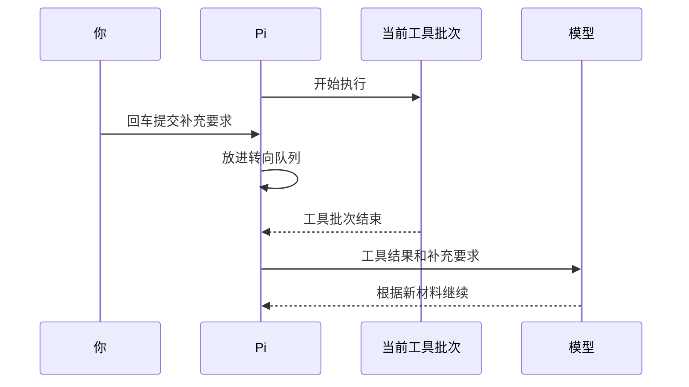

# 任务正在进行，怎样停止或追加要求？

Pi 正在修复小书架，你忽然发现还没说“不要修改测试文件”。这时直接按回车、按 `Esc` 和等结束后再提要求，效果并不一样。

## 1. 先区分三种需求

| 你实际想做什么 | 对应操作 | 不能指望它做什么 |
|---|---|---|
| 改变当前任务后续方向 | 输入补充要求，按回车 | 立刻撤销正在执行的工具 |
| 当前任务做完，再做下一件事 | 输入下一件事，按 `Option + Return` | 抢在当前任务之前执行 |
| 不希望任务继续运行 | 按 `Esc` 请求取消 | 撤销文件、收回网络请求 |

Mac 的 Option 对应配置中的 `alt`，Return 对应 `enter`。自定义过键位时，输入 `/hotkeys` 核对当前绑定。

## 2. 回车送入的是“转向消息”

在任务运行中输入：

```text
补充限制：接下来只修改 books.mjs，不修改测试文件。
如果测试文件已经改变，请先停止修改并报告差异。
```

按回车后，它进入 **Steering 队列**。可以先把 Steering 理解成“等合适的接收点出现，告诉模型后面怎样做”。

默认投递点在当前 Assistant Turn 的工具调用执行完后，而不是你按键的瞬间。



因此，如果正在执行的命令危险，不能只排队一句“不要执行”。应先取消，再检查已经发生的影响；事前的工具门禁比事后补消息更可靠。

## 3. Option + Return 送入的是“后续消息”

输入：

```text
当前修复完成后，再只解释为什么空数组应返回 0，不修改文件。
```

按 `Option + Return`，进入 **Follow-up 队列**。它会在当前 Agent 工作完成后送入，适合依赖前一个结果的下一件事。

当前任务仍可能继续读取、修改或测试，所以后续消息不是可靠的紧急制动方式。

部分终端把 `Option + Return` 留给全屏切换，或者将它当成普通回车。不要用真实危险任务测试组合键；先在无写入能力的练习中检查队列类别，必要时按[配置排查](09-常用设置与配置排查.md)修改键位。

## 4. 看见排队，不代表模型已经收到

消息经历三个位置：

```text
输入框草稿 → 等待队列 → 投递给模型的材料
```

你应观察队列中是哪一种消息、内容是否正确，以及投递后模型是否按要求继续。只在输入框里写着，不等于已经提交；显示在队列里，也不等于模型已经理解。

主输入界面按 `Option + ↑` 可以取回排队消息到编辑器。需要调整时先取回，再重新选择投递方式，不要不断提交相互冲突的要求。

`steeringMode` 和 `followUpMode` 各自支持：

| 设置值 | 含义 |
|---|---|
| `one-at-a-time` | 一次投递一条，等响应后再处理下一条；默认值 |
| `all` | 将对应队列当前待发的消息一起投递 |

`all` 不会让工具同时回滚，也不会令排队消息绕过投递时机。一般先保留默认值。

## 5. 取消之后要看什么？

按 `Esc` 会请求取消当前工作，排队消息会恢复到编辑器。等待界面进入可继续操作的状态，然后检查：

1. 哪些工具已经完成，哪些显示取消或错误。
2. 文件实际内容和 `git diff`，而不只看模型最后一句话。
3. 启动过的外部进程是否仍存在；取消信号不是所有子进程退出的证明。
4. 编辑器里恢复了什么消息，避免下一次回车误发旧任务。

已经发出的远端请求可能仍在处理或计费。取消也不代表服务商会删除此前接收的材料。

空闲时双击 `Esc` 默认打开会话树，和运行时取消不同。退出程序可以输入 `/quit`；`Control + Z` 在 macOS 是挂起进程，不是退出或取消的替代品。

## 6. “重试”有不同层次

假设网络暂时断开，Pi 再请求一次模型；这和你重新发送“修复代码”不是同一件事。

| 层次 | 谁发起 | 可能重复什么 |
|---|---|---|
| Provider 重试 | 接入层或服务 SDK | 底层请求 |
| Agent 重试 | Pi 的任务协调层 | 失败后的模型生成 |
| 用户重新提交 | 你 | 一项新的任务，包括可能重复执行的工具 |

自动重试针对临时错误，不会把一次任务变成数据库事务。工具已经写入文件，后续网络失败时，写入仍然存在。

Pi `0.85.1` 默认 Agent 重试最多 3 次、初始退避 2000 毫秒；Provider 重试默认 0。通常不需要同时调高两层次数。

需要一次可控实验时，可以在专用练习配置中关闭重试：

```json
{
  "retry": {
    "enabled": false,
    "provider": { "maxRetries": 0 }
  }
}
```

这不是通用推荐配置，也不等于一个 Agent Run 只产生一个 HTTP 请求。一次读取任务正常就可能有工具前后两次模型生成。

## 7. 不靠重复请求排查错误

认证失败先检查接入；额度不足先检查费用；代码测试失败先看断言；工具超时先看命令和副作用。只有识别出临时错误且确认重复执行的影响，才决定是否再次提交。

观察练习可使用“不使用工具，分几段解释数组过滤”的任务，在它生成时排队补充文字。它会产生模型费用，且快速模型可能在按键前已结束；不能因为没赶上投递窗口就断言队列失效，更不必连续重跑制造证据。

## 8. 一分钟回忆

> **转向消息等接收点，后续消息等当前工作结束；取消不是回滚，重试不是事务。**

本篇按 Pi `0.85.1` 核对。具体终端的组合键、取消响应时延和远端停止行为应分别验证。

上一篇：[模型选择与用量](05-模型选择与用量.md)。下一篇：[一次性运行与结构化输出](07-一次性运行与结构化输出.md)。
