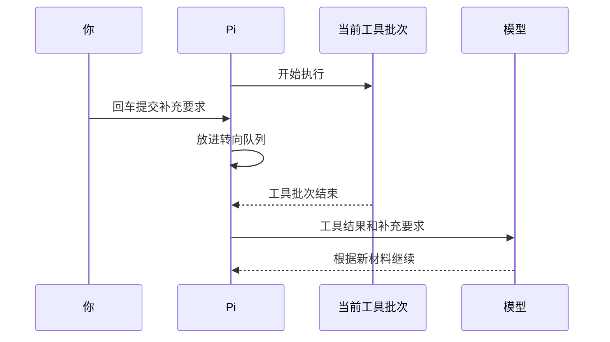

# 07 取消重试与追加消息

## 任务正在进行，怎样停止或追加要求？

Pi 正在读取“小书架”的代码，准备修复统计错误。你忽然发现还没告诉它“不要修改测试文件”。现在有几种选择：补充当前要求、安排修复后的下一项任务，或者先停止运行。它们对应不同的按键，也会在不同时间生效。

## 1. 先区分三种需求

| 你实际想做什么 | 对应操作 | 不能指望它做什么 |
|---|---|---|
| 改变当前任务后续方向 | 输入补充要求，按回车 | 立刻撤销正在执行的工具 |
| 当前任务做完，再做下一件事 | 输入下一件事，按 `Option + Return` | 抢在当前任务之前执行 |
| 不希望任务继续运行 | 按 `Esc` 请求取消 | 撤销文件、收回网络请求 |

Mac 的 Option 对应配置中的 `alt`，Return 对应 `enter`。自定义过键位时，输入 `/hotkeys` 核对当前绑定。

### 补充要求为什么需要等待？

草稿还在输入框里时，你可以直接修改。一旦请求发出，模型就会依据当时的材料生成响应；工具开始执行后，也可能已经改了文件。因此，补充要求需要交给后续请求处理，已经发生的操作还要另行检查。

Pi 会先保存新增消息，等到相应的处理时机再交给模型。保存这些待处理消息的地方，就是**消息队列**。

**Steering**改变当前工作后面的方向；**Follow-up**追加当前工作之后的下一件事。二者都是新增材料，不是改写服务正在生成的那一轮。工具批次结束是常见接收边界，因为此时 Pi 能把已发生的工具结果和新要求一起交给下一轮。

### 停止、结束和成功各自回答什么？

“取消”表示不希望继续，属于控制请求；“运行结束”表示某层工作不再推进，属于状态；“成功”表示达到了任务要求，属于判断。取消成功生效，也可能留下已修改文件；正常运行结束，也可能得到错误答案。

## 2. 回车送入的是“转向消息”

在任务运行中输入：

```text
补充限制：接下来只修改 books.mjs，不修改测试文件。
如果测试文件已经改变，请先停止修改并报告差异。
```

按回车后，它进入 **Steering 队列**。可以先把 Steering 理解成“等合适的接收点出现，告诉模型后面怎样做”。

默认投递点在当前 Assistant Turn 的工具调用执行完后，而不是你按键的瞬间。



因此，如果正在执行的命令危险，不能只排队一句“不要执行”。应先取消，再检查已经发生的影响；事前的工具门禁比事后补消息更可靠。

## 3. Option + Return 送入的是“后续消息”

输入：

```text
当前修复完成后，再只解释为什么空数组应返回 0，不修改文件。
```

按 `Option + Return`，进入 **Follow-up 队列**。它会在当前 Agent 工作完成后送入，适合依赖前一个结果的下一件事。

当前任务仍可能继续读取、修改或测试，所以后续消息不是可靠的紧急制动方式。

部分终端把 `Option + Return` 留给全屏切换，或者将它当成普通回车。不要用真实危险任务测试组合键；先在无写入能力的练习中检查队列类别，必要时按[配置排查](10-常用设置与配置排查.md)修改键位。

## 4. 看见排队，不代表模型已经收到

消息经历三个位置：

```text
输入框草稿 → 等待队列 → 投递给模型的材料
```

你应观察队列中是哪一种消息、内容是否正确，以及投递后模型是否按要求继续。只在输入框里写着，不等于已经提交；显示在队列里，也不等于模型已经理解。

主输入界面按 `Option + ↑` 可以取回排队消息到编辑器。需要调整时先取回，再重新选择投递方式，不要不断提交相互冲突的要求。

`steeringMode` 和 `followUpMode` 各自支持：

| 设置值 | 含义 |
|---|---|
| `one-at-a-time` | 一次投递一条，等响应后再处理下一条；默认值 |
| `all` | 将对应队列当前待发的消息一起投递 |

`all` 改变的是每次投递的消息数量，投递时机保持不变。一般先保留默认值。

## 5. 取消之后要看什么？

按 `Esc` 会请求取消当前工作，排队消息会恢复到编辑器。等待界面进入可继续操作的状态，然后检查：

1. 哪些工具已经完成，哪些显示取消或错误。
2. 文件实际内容和 `git diff`，而不只看模型最后一句话。
3. 启动过的外部进程是否仍存在；取消信号不是所有子进程退出的证明。
4. 编辑器里恢复了什么消息，避免下一次回车误发旧任务。

已经发出的远端请求可能仍在处理或计费。取消也不代表服务商会删除此前接收的材料。

空闲时双击 `Esc` 默认打开会话树，和运行时取消不同。退出程序可以输入 `/quit`；`Control + Z` 在 macOS 是挂起进程，不是退出或取消的替代品。

## 6. “重试”有不同层次

假设文件已经修改，随后请求模型总结时网络断开。Pi 再次请求模型时，磁盘上的修改仍然保留；如果你重新发送“从头修复”，则可能在已经变化的文件上执行另一项任务。排查重试时，先确定重复的是哪一步。

| 层次 | 谁发起 | 可能重复什么 |
|---|---|---|
| Provider 重试 | 接入层或服务 SDK | 底层请求 |
| Agent 重试 | Pi 的任务协调层 | 失败后的模型生成 |
| 用户重新提交 | 你 | 一项新的任务，包括可能重复执行的工具 |

自动重试主要用于处理临时的模型请求错误。

Pi `0.85.1` 默认 Agent 重试最多 3 次、初始退避 2000 毫秒；Provider 重试默认 0。通常不需要同时调高两层次数。

如果通过事件观察过程，还会遇到两种结束通知：`agent_end` 表示一段底层运行结束，Pi 随后仍可能重试、压缩后继续或处理排队消息；`agent_settled` 表示当前已没有这些自动后续工作。判断修复是否成功，仍要查看测试结果。

### 同样失败两次，为什么界面可能不一样？

假设当前只请求一段文字，没有工具、压缩或排队任务，服务前两次暂时失败，第三次成功。

| 路线 | 内部发生什么 | 上层通常观察到什么 |
|---|---|---|
| Provider 允许重试两次 | 接入层请求失败 → 内部再请求 → 再请求成功 | 一次上层生成最终成功；底层重试未必逐次显示为 Agent 重试事件 |
| Provider 不重试，Agent 允许重试 | 错误交回 Pi → Pi 判断可重试并等待 → 再开始生成 | 可观察的 Agent 重试过程，以及新的生成尝试 |

`maxRetries=2` 表示首次失败后最多再试两次，因此单层最多三次尝试。两层都开启时，请求次数可能叠加：假设外层最多三次生成尝试，而每次接入层最多两次请求，全部失败时可能达到六次底层请求。这是固定条件下的次数推导，不是整个 Agent Run 的通用上限。

收到错误后，先区分认证拒绝、参数错误和临时网络故障，再看是哪一层重试。工具失败也不自动进入模型请求的重试器：它通常先形成错误 Tool Result，由后续循环和任务策略处理。

需要一次可控实验时，可以在专用练习配置中关闭重试：

```json
{
  "retry": {
    "enabled": false,
    "provider": { "maxRetries": 0 }
  }
}
```

这不是通用推荐配置，也不等于一个 Agent Run 只产生一个 HTTP 请求。一次读取任务正常就可能有工具前后两次模型生成。

## 7. 不靠重复请求排查错误

认证失败先检查接入；额度不足先检查费用；代码测试失败先看断言；工具超时先看命令和副作用。只有识别出临时错误且确认重复执行的影响，才决定是否再次提交。

观察练习可使用“不使用工具，分几段解释数组过滤”的任务，在它生成时排队补充文字。它会产生模型费用，且快速模型可能在按键前已结束；不能因为没赶上投递窗口就断言队列失效，更不必连续重跑制造证据。

本篇按 Pi `0.85.1` 核对。具体终端的组合键、取消响应时延和远端停止行为应分别验证。

上一篇：[模型选择与用量](06-模型选择与用量.md)。下一篇：[一次性运行与结构化输出](08-一次性运行与结构化输出.md)。
