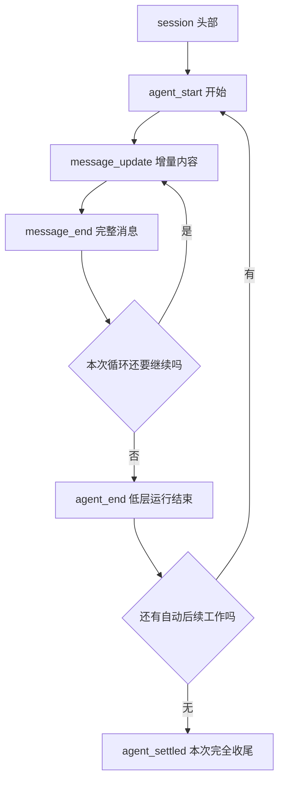

# 08 一次性运行与结构化输出

## 不打开聊天界面，一次运行并取回结果

假设你想写一个脚本，把项目说明交给 Pi，总结后保存成一段文字。每次手动打开聊天界面、输入要求、复制回答会比较麻烦。一次性运行模式可以直接接收任务、输出结果，然后退出。

先用一条简单的文字请求看清命令怎样运行，再比较给人阅读的文本输出和供程序解析的 JSON 事件。

## 1. 运行一个无工具的 Print 任务

开始前，使用你已经检查过的默认模型和认证；普通终端的启动默认不一定等于另一个正在运行的 Pi 窗口。下面会提交真实模型请求，可能产生费用。

在只含虚构资料的练习目录执行：

```bash
pi -p --no-tools --no-extensions --no-skills \
  --no-prompt-templates --no-themes --no-context-files --no-session \
  '用一句话说明数组过滤，不调用工具。'
rc=$?
printf 'Pi exit=%s\n' "$rc"
```

这些选项关闭工具和额外资源发现，不阻断模型请求，也不清除现有认证配置。退出码先保存到 `rc`，否则下一条命令会覆盖 `$?`。

正常情况下，终端会输出模型对数组过滤的解释，然后 Pi 退出。退出码为 0 只说明进程正常结束，解释是否正确还需要核对。

### 一次性运行与交互模式有什么区别？

交互界面替你接收按键、显示进度；脚本更希望通过输入和输出传递数据。Pi 可以让同一套任务能力使用不同的外壳：人通过 TUI 操作，脚本取得最终文字或事件，长期运行的客户端通过 RPC 发控制命令。

去掉界面后，模型仍可能请求工具，Pi 仍要组织上下文，也仍可能重试或保存记录。“一次性”指这次进程接收初始任务后完成工作并退出，不代表只调用一次模型，也不代表只会生成一条事件。

### 为什么程序更需要事件，而不只是最后一句话？

人看到“正在读取”和“读取失败”可以理解时间过程；程序若只收到一段混合文字，就很难可靠判断哪部分是提示、哪部分是答案、任务是否结束。结构化事件为这些事实附上明确类型，免去从中文措辞猜状态。

**消息（Message）**记录用户要求、Assistant 回答等内容，并标明角色；**事件（Event）**通知程序某条消息开始、更新或结束；程序根据这些通知更新**状态（State）**，例如“正在生成回答”。一条消息从开始到结束，可以产生许多事件。

### 增量、快照和最终值为什么要分开？

假设回答正在形成“过滤保留已读书籍”。增量可以是刚到的“已读书籍”，快照则是到目前为止的整句话。把快照当增量拼接会重复文字，把增量当完整答案又会漏掉前半句。

JSON 模式的增量用于及时显示，`message_end` 用于取得该条消息的最终内容。即使一条消息已完成，任务仍可能继续执行工具，再产生下一条消息。因此还要在任务层判断最终结果，不能见到第一条完整 Assistant 消息就退出。

### 为什么退出码不能替你判断答案正确？

进程退出码说明程序按什么方式结束，协议事件说明任务发生了什么，业务验证则检查结果是否满足要求。这三项需要分别检查：进程正常退出、回答完整时，函数解释仍可能错误；已经解析到文字时，进程也可能随后异常退出。

下面先看这些模式怎样提供数据，再用一份虚构事件练习提取最终回答。

## 2. Print 和 JSON 怎么选？

| 模式 | 输出重点 | 合适场景 |
|---|---|---|
| `pi -p` | 最终文本回答 | 人工查看、生成一段草稿 |
| `pi --mode json` | 按行输出结构化事件 | 观察任务状态、提取完整的最终消息 |
| `pi --mode rpc` | 接收命令并持续输出响应与事件 | 由外部程序长期控制；后文展开 |

Print 和 JSON 都可能运行工具。**不打开交互界面，不表示只读、无副作用或无需认证。**

## 3. 怎样把文件内容交给 Pi？

`@README.md` 会把文件作为启动输入附加。通过管道输入的文本也会合并到初始任务。

这两种方式与模型自行请求 `read` 的区别在于：材料在第一次请求前就已经存在，不一定出现读取工具调用。

因此，不应把 `--no-tools` 理解成“不会发送本机文件”。如果你主动附加文件，它仍会成为模型材料。只附加已经审查的虚构文本，不附加认证文件或原始会话。

## 4. JSON 输出是一串事件，不是一份大 JSON

将前面 Print 命令中的 `-p` 换成 `--mode json`，其余选项保持不变，Pi 就会按行输出 JSON 事件。标准输出每行一个 JSON 对象，诊断信息则通过标准错误输出。

正常路线可以概括成：



第一行 `session` 是输出头部，不表示本次使用了磁盘会话。`--no-session` 下也可能看到它。

| 事件 | 适合拿来做什么 |
|---|---|
| `message_update` | 实时显示新增文字 |
| `tool_execution_start/end` | 观察工具开始、结束和错误 |
| `message_end` | 获取该条消息的最终完整内容 |
| `agent_end` | 确认一段 Agent 运行结束，但还需结合重试等后续事件 |
| `agent_settled` | 确认当前没有自动后续，再结合消息、进程和业务条件判断结果 |

Pi `0.85.1` 的 JSON `message_update` 是增量事件，省略累计 `message` 和 `partial` 快照。不要沿用“每个 update 都带完整回答”的旧解析方式。

如果要拼接增量，应按 `contentIndex` 区分块，并处理 `text_delta`、思考和工具参数各自的事件。只需要最终文本时，读取 `message_end` 更简单。

## 5. 在本机解析一份虚构事件

下面使用预先写好的虚构事件练习解析，不调用模型。例子只提取完整消息，并检查一次低层运行是否结束。用编辑器新建 `events.jsonl`，每行保持一个完整对象；这份运行事件示例只保留解析所需字段：

```jsonl
{"type":"session","version":3,"id":"demo","timestamp":"2026-01-01T00:00:00Z","cwd":"/demo"}
{"type":"agent_start"}
{"type":"message_end","message":{"role":"assistant","stopReason":"stop","content":[{"type":"text","text":"过滤会保留满足条件的元素。"}]}}
{"type":"agent_end","messages":[]}
```

新建 `read-result.mjs`：

```javascript
import { readFile } from 'node:fs/promises';

const raw = await readFile('events.jsonl', 'utf8');
if (!raw.endsWith('\n')) throw new Error('事件文件没有完整结束');
let running = false;
let ended = false;
let finalMessage;

for (const line of raw.slice(0, -1).split('\n')) {
  const event = JSON.parse(line);
  if (event.type === 'agent_start') {
    running = true;
    ended = false;
    finalMessage = undefined;
  } else if (event.type === 'message_end' && running &&
             event.message.role === 'assistant') {
    finalMessage = event.message;
  } else if (event.type === 'agent_end' && running) {
    running = false;
    ended = true;
  }
}

if (!ended || running || finalMessage?.stopReason !== 'stop') {
  throw new Error('没有完整且正常结束的最终回答');
}
console.log(finalMessage.content
  .filter(block => block.type === 'text')
  .map(block => block.text).join(''));
```

在 Node.js 已安装的普通终端运行：

```bash
node read-result.mjs
```

应输出夹具中的一句话。代码按 LF，也就是 `\n` 分隔，**不按所有 Unicode 换行字符拆分**；正文中的特殊字符仍属于 JSON 字符串。

这个解析器适用于小型、已知来源的示例文件。处理实时事件流时，还需要设置字节上限、分块解码 UTF-8，并处理进程退出、超时、重试和 settled 等收尾状态；相关机制在 [RPC 协议](24-RPC协议与Java客户端.md)和[任务台](26-构建任务台与异常测试.md)中展开。

## 6. 用失败对照检查解析器

只修改虚构夹具，不运行 Pi：

1. 将 `stopReason` 改为 `error`，程序应报错。
2. 改为 `aborted` 或 `length`，仍应报错；截断不能算完整回答。
3. 删除最后的 `agent_end`，应报错，而不是返回部分成功。
4. 恢复夹具，应该重新得到原句。

中途工具失败但模型后来修正，可以最终成功，因此不能简单地“看见任意错误事件就永久判失败”。相反，进程输出过文字，也不代表最后成功。

不要直接用管道最后一个命令的退出码代表 Pi 的退出码，也不要丢弃所有标准错误。程序需要分别保存进程结果、协议结果和业务验收结果。

本篇按 Pi `0.85.1` 核对；夹具解析不需要账号。上面的模型任务、实际计费和终端流程不因离线解析成功而自动通过。

上一篇：[取消重试与追加消息](07-取消重试与追加消息.md)。下一篇：[项目配置与规则](09-项目配置与规则.md)。
