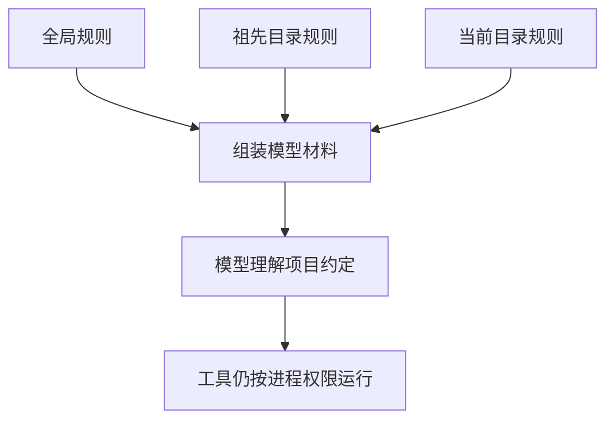

# 让 Pi 按当前项目的约定工作

你希望 Pi 每次修复小书架都只动约定文件、运行同一组测试、不擅自提交。每次重新输入这段话很麻烦，于是需要一份项目规则。但规则文件和运行配置承担不同工作。

## 1. 两类文件先分开

| 文件 | 谁主要使用 | 作用 |
|---|---|---|
| `AGENTS.md` | 模型 | 理解项目约定、测试方式和操作边界 |
| `.pi/settings.json` | Pi 程序 | 决定模型默认值、资源位置、重试等配置 |

在规则里写“重试次数为零”，并不会把 Pi 的重试配置改成零。反过来，在设置里关闭某个工具，也不能代替向模型说明任务目标。

## 2. 配置放在哪里？

默认全局目录是 `~/.pi/agent`；`~` 表示当前用户的主目录。`PI_CODING_AGENT_DIR` 可以改变这个位置，所以排查时不能永远假定文件就在默认路径。

```text
全局：~/.pi/agent/settings.json
项目：当前工作目录/.pi/settings.json
临时：本次启动的命令行参数
```

一般设置由项目覆盖全局；嵌套对象会逐字段合并。比如全局配置是：

```json
{
  "theme": "dark",
  "compaction": { "enabled": true, "reserveTokens": 16384 }
}
```

项目只写：

```json
{
  "compaction": { "reserveTokens": 8192 }
}
```

合并后，主题仍为 `dark`，自动压缩仍开启，预留 Token 改为 8192。这里只演示合并，不建议初学者为了实验随意缩小预留空间。

数组不能按同样方式逐项合并。例如项目的 `defaultTools` 数组替换全局数组。资源加载器还有发现、合并和筛选过程，不应根据最终出现了两个扩展就反推“所有 JSON 数组都会拼接”。

对应的 CLI 选项通常覆盖本次启动值，但它们不一定写回配置；恢复会话、扩展和交互选择还可能改变运行状态。先确认你排查的是哪一项，而不是背一条万能优先级。

## 3. 写一份最小项目规则

在小书架练习目录新建 `AGENTS.md`，使用普通编辑器保存：

```markdown
# 小书架协作规则

- 修改前先读取 books.mjs 和 books.test.mjs，确认原始失败。
- 本次修复只允许修改 books.mjs；需要改变范围时先说明原因。
- 验证命令为 node --test books.test.mjs。
- 不修改测试断言来掩盖实现错误。
- 不读取认证文件、生产配置或个人资料。
- 未单独授权，不暂存、提交、推送或安装依赖。
- 总结区分已运行的结果、未验证内容和残余风险。
```

这里每条规则都对应可观察的行为。不要只写“代码必须完美”“保证安全”，因为它们既不说明操作范围，也不能作为验收标准。

这份文件是讲给模型的说明，**不是权限系统**。即使模型复述了所有规则，也不能证明它之后绝不会违反。

## 4. 哪些规则会被加载？

Pi 启动时会组合全局规则、从上层目录到当前工作目录的规则。一个目录内优先使用 `AGENTS.override.md`；没有它再选择 `AGENTS.md`，再考虑 `CLAUDE.md`。

同目录的 override 替换的是那一层规则，不会清除其他目录的规则。父目录中的约定仍可能出现。



不要假设 Pi 会在启动时递归加载所有子目录的规则。将关键启动约定放在确定会加载的位置；进入更深目录工作时，再明确要求读取相关局部规则。

`--no-context-files` 关闭自动规则发现。CLI 的 `@AGENTS.md` 或工具主动读取仍是另外的输入路线，并不会被这个选项统一禁止。

## 5. 系统提示文件又是什么？

`SYSTEM.md` 用于替换默认系统提示；`APPEND_SYSTEM.md` 用于追加内容。它们可以位于全局目录或项目 `.pi` 内。

默认提示已经包含编码 Agent 的基础工作方式。初学时优先使用项目规则，不必为了增加三条约定就替换整份系统提示。替换遗漏的工具用法或行为说明，可能改变整个任务表现。

CLI 的 `--system-prompt` 也不意味着只剩这一段文字：规则文件和 Skill 描述等仍可能追加。要做精确上下文实验，需要分别控制各类资源。

## 6. 为什么启动时问“是否信任项目”？

一个仓库的 `.pi` 里可能放有能执行代码的扩展，设置还可能要求安装包。Project Trust 在加载这些项目资源前建立一道确认流程。

| 选择 | 主要结果 |
|---|---|
| 信任 | 允许加载受信任控制的项目设置、资源、包和扩展 |
| 拒绝 | 跳过这些受保护的项目资源 |
| `/trust` 保存决定 | 写入信任记录，供后续会话使用；当前会话不会自动重载 |

规则文件 `AGENTS.md` 等仍可能在信任决定前加载；全局扩展和 CLI 显式 `-e` 扩展也可能先加载。**拒绝项目不是“所有项目内容都无法进入模型”。**

信任记录按规范化目录保存，也可能继承父目录决定。不要为了一个练习轻率地信任整个工作目录树。

## 7. 非交互模式没有人回答弹窗

没有可用保存决定时，Print、JSON、RPC 使用全局 `defaultProjectTrust`：

| 值 | 非交互模式的行为 |
|---|---|
| `ask`，默认 | 不弹窗，忽略受保护项目资源 |
| `never` | 忽略受保护项目资源 |
| `always` | 允许加载 |

`--approve` 和 `--no-approve` 可以覆盖本次项目信任。它们不是“每次工具调用都已授权”或“操作系统只读”开关。

因此，交互窗口能用的项目扩展，在脚本中不见了，先检查信任和资源加载，不要马上怀疑协议坏了。

## 8. 检查规则与设置是否生效

先不用模型：确认启动目录、文件名、JSON 语法、信任状态和启动头部列出的资源。修改资源后执行 `/reload`；修改信任决定后按提示重新启动。

需要模型观察时，只在虚构项目里提出一个窄问题，检查是否读取约定文件、是否执行规定测试。该观察会产生模型请求，且成功一次不等于形成了强制权限保证。

## 9. 一分钟回忆

> **设置由程序解释，规则由模型理解；项目可信只决定资源能否加载，不提供沙箱。**

本篇按 Pi `0.85.1` 核对。不要直接覆盖已有全局配置；示例只在独立练习目录使用。

上一篇：[一次性运行与结构化输出](07-一次性运行与结构化输出.md)。下一篇：[常用设置与配置排查](09-常用设置与配置排查.md)。
