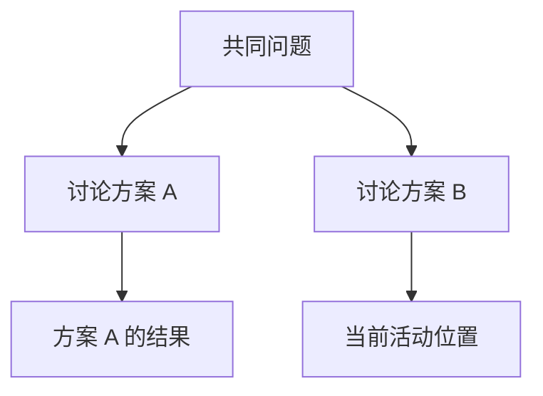

# 明天继续做，或者换一条思路

小书架还没修完，你需要离开。明天希望 Pi 接着上次的讨论继续，而不是重新解释所有背景。这个需求靠会话解决；文件版本仍由 Git 管理。

## 1. 会话保存的是什么？

Session 可以先理解成“这段工作的对话记录及相关状态”。它通常包括用户消息、模型消息、工具结果、模型切换、摘要和扩展条目。

默认会话保存在 `~/.pi/agent/sessions/`，按工作目录组织。一份会话是 JSONL 文件，但它不是整个工作目录的备份。

使用 `--no-session` 启动时，不应期待以后恢复这次对话；手工文件和工具副作用仍会留下。

## 2. 给任务一个容易找到的名字

在 Pi 中输入：

```text
/name 小书架统计修复
```

命名主要帮助你检索，不会创建 Git 分支。`/session` 可以显示当前会话信息；只在本机查看，不把完整路径和原始记录当公开学习材料。

退出前写明任务断点，再输入 `/quit`。下一次回到相同工作目录，在普通终端执行：

```bash
pi -c
```

`-c` 继续最近会话。存在多个任务时，用 `pi -r` 打开选择器更稳妥；已经在 Pi 中则用 `/resume`。

恢复后首先确认目录、名称、模型和最后的任务目标，再让 Pi工作。会话里的旧文件内容可能早已过时，关键文件要重新读取。

## 3. 会话选择器里的常用操作

| 操作 | 默认按键 |
|---|---|
| 搜索 | 直接输入关键词 |
| 只看有名称的会话 | `Control + N` |
| 改名 | `Control + R` |
| 切换排序 | `Control + S` |
| 删除选中会话 | `Control + D`，之后确认 |

这些按键只针对会话选择器。在主编辑器中 `Control + D` 可能是退出或删除字符，不能脱离界面记忆按键。

删除前确认选中的是练习会话。系统存在 `trash` 工具时 Pi 可以使用回收方式，但不能假定所有环境都能恢复删除。删除本地记录也不会撤销已发送给服务商的材料。

## 4. 换条思路，不一定要开新文件

你先讨论了方案 A，后来想从同一个问题尝试方案 B。这就是会话树的用途。



每条记录指向自己的父记录。当前活动位置向上连回起点的那条路径，就是下一次构造上下文的主要历史来源，不是把左右两条路线全部无条件发送。

在 Pi 中输入 `/tree`。用方向键浏览，回车选中，`Esc` 取消；可以使用 `Shift + L` 给重要节点加标签。

## 5. 选用户消息和选回答，有什么不同？

选中以前的一条用户消息时，Pi 会把活动位置移动到它的父节点，并把那条用户消息放入编辑器。你修改后重新提交，就形成新路线。

选中 Assistant、工具结果等非用户条目时，活动位置移到该条目，编辑器通常为空，你可以继续提问。

因此，选中旧用户问题后看到输入框里出现原句是正常行为，不意味着它被立即再次发送。

**无论选哪一个节点，磁盘文件都不会自动恢复成那时的版本。** 如果方案 A 已经修改代码，方案 B 面对的仍是当前磁盘状态。

## 6. Tree、Fork、Clone 怎么选？

| 操作 | 是否新建会话文件 | 从哪里继续 |
|---|---|---|
| `/tree` | 否 | 当前文件中选定位置 |
| `/fork` | 是 | 从较早的用户问题分出路线，问题回到编辑器 |
| `/clone` | 是 | 复制当前活动分支，保留现有进度 |

`/clone` 不是克隆整个 Git 仓库，也不是复制原会话的所有旁支。CLI 的 `--fork` 和交互 `/fork` 入口也有不同复制范围，不要凭同一个单词假定行为完全相同。

想把两种方案放在一个记录里比较，用 Tree；想要独立的会话文件，用 Fork 或 Clone。无论哪一种，都要另行决定代码是否需要独立工作目录。

## 7. 切换路线时为什么问“要不要摘要”？

如果离开的方案 A 已经发现某个重要失败原因，直接切到 B 会丢失这段活动路径的详细材料。Pi 可以为离开的分支生成摘要，带到目标位置。

选择不摘要、默认摘要或自定义关注点，影响的是留下多少背景。摘要可能调用模型并产生费用，而且会遗漏细节；它不能替代重要证据文件。

只练习会话导航时，可以选择不生成摘要，不必为了查看树就新增模型调用。

## 8. 导出与分享不是同一件事

`/export bookshelf.html` 可以导出本地 HTML；当前版本也支持按文件类型导出 JSONL。用文件名确认目标格式，并检查生成文件是否包含工具输出和个人路径。

`/share` 会上传到 GitHub Gist，再生成分享入口。所谓 private/unlisted Gist 不应当作严格访问控制，持有链接的人可能访问。

不要直接分享真实开发会话。先准备只含虚构数据的会话，逐项检查内容，明确获得上传授权后才执行分享。重新导入会话也不是对内容安全性的认可。

## 9. 一分钟回忆

> **恢复对话用 Session，恢复文件用 Git；树决定继续哪条路线，不决定磁盘回到哪一刻。**

本篇按 Pi `0.85.1` 核对。恢复、导航、删除和上传分别具有不同影响，不能用一个成功结果替代全部验证。

上一篇：[常用设置与配置排查](09-常用设置与配置排查.md)。下一篇：[会话记录与上下文压缩](11-会话记录与上下文压缩.md)。
