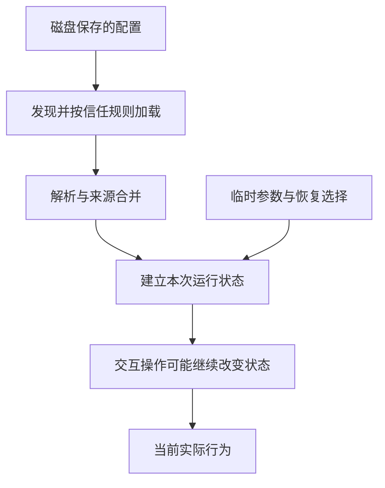
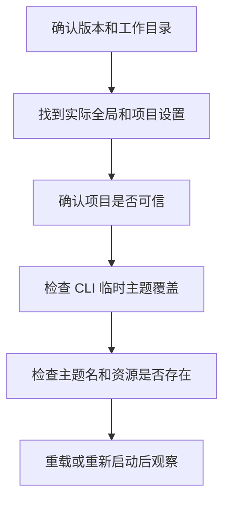

# 10 常用设置与配置排查

## 配置写了，为什么没有生效？

你把默认思考强度改成 `medium`，重新打开 Pi 却还是看到 `high`。先不要在三个文件里反复改同一个值。要找到的是：**谁提供了最后实际采用的值？**

## 文件里的值，为什么不一定是正在使用的值？

配置从磁盘走到行为，中间有一个过程。Pi 先找到文件，决定是否允许加载，解析字段，再结合其他来源生成设置。运行对象创建以后，还可能因为恢复会话、切换模型或交互操作而改变当前状态。

因此至少要区分 **保存值、加载值、运行值**。保存值是文件中的记录；加载值是合并解析后的结果；运行值是此刻真正被某个对象使用的选择。只证明第一步正确，无法直接证明最后一步正确。



这是诊断用的概念路径，不是一条适用于所有字段的固定覆盖算法。比如全局网络设置、当前模型选择和主题资源发现，各有自己的生效入口，需要先确认查的是哪种设置。

### “默认”与“当前”为什么故意分开？

默认值为没有更具体选择时提供起点。你在一段会话里临时改用另一个模型，并不一定希望以后所有项目都随之改变，所以当前选择与保存默认值应当分开。

反过来，恢复旧会话时又希望接近当时的工作状态。于是“新启动采用什么”和“继续旧任务采用什么”可能不同。排查不能只问有没有重启，还要问这是新任务还是恢复任务。

### 怎样从现象反推正确层次？

图片没显示，先看显示设置；图片不应发给模型，查发送限制。这两件事共享同一张图片，却由不同层负责。只修改外观设置就宣称保护了图片内容，是把显示层当成请求层。

同理，禁用更新检查只影响那类启动请求，不会禁掉 Shell 联网；主题名称正确但没被发现，是资源问题；设置保存了但当前对象没更新，是加载时机问题。下面的设置表应当作为这些关系的索引，而不是需要整份复制的默认配置。

## 1. 几组日常设置够用了

| 设置 | 用途 | 常见误解 |
|---|---|---|
| `defaultProvider/defaultModel` | 启动默认模型 | 不保证账号有权限 |
| `defaultThinkingLevel` | 默认思考档位 | 不保证所有模型支持 |
| `modelThinkingLevels` | 按完整模型 ID 设置默认档位 | 可能比通用默认值更具体 |
| `retry` | 自动重试策略 | 不会撤销已执行工具 |
| `images.blockImages` | 阻止把图片发送给模型 | 不等于隐藏图片显示 |
| `terminal.showImages` | 控制终端图片显示 | 不等于不发送图片 |
| `shellPath` | 执行命令使用的 Shell | 不改变当前用户权限 |
| `shellCommandPrefix` | 给 Bash 命令增加前缀 | 前缀本身也会执行 |

例如，只想禁止向模型发送图片，在专用练习的 `.pi/settings.json` 中写：

```json
{
  "images": { "blockImages": true }
}
```

是否能看到图片和模型是否收到图片，是两个验收问题。真实图片也可能含个人资料，测试应使用专门绘制的虚构图。

用同一张虚构图片比较：关闭 `terminal.showImages`、保留发送许可时，本地可以没有预览，模型仍可能收到图片；开启预览、同时设置 `images.blockImages=true` 时，本地可以看见图片，模型输入却应受发送限制。终端能力、发送设置和模型是否支持图片，还要分别成立。

Shell 也有两层：`shellPath` 选择解释器，`shellCommandPrefix` 决定每条命令之前执行的准备文本。前缀若写入文件，会随多次命令重复产生副作用；它不是只执行一次的启动配置。子 Shell 里的 `export` 也不能反向修改已经启动的 Pi 父进程。

## 2. 网络开关没有一个万能“离线”含义

`httpProxy` 是全局设置，配置的是代理地址。代理不可达、目标服务拒绝和模型账号错误是不同问题；代理设置存在不代表请求一定经过了你期待的路径。

`transport` 是支持多种传输方式的 Provider 的偏好，可能选择 SSE、WebSocket 等。它不能让一个不支持该传输的服务突然支持。

| 选项 | 针对什么 |
|---|---|
| `PI_SKIP_VERSION_CHECK=1` | Pi 版本检查 |
| `PI_TELEMETRY=0` | 安装/更新遥测及相关归属头 |
| `PI_OFFLINE=1` | 启动网络操作，包括更新检查等 |
| 操作系统禁网 | 实际网络访问权限 |

前三项都不是阻断任意模型请求、扩展网络请求或 Shell 联网的防火墙。真正的无网络验证，需要运行边界和测试替身共同保证，并如实说明。

### 等连接、等数据和等整个任务，是三种等待

小书架的一项修复可能先请求模型、执行测试，再请求模型解释结果。即使每次模型请求都有限时，整项任务仍可能运行很久。

| 控制点 | 等待的对象 | 为什么不能代替整个任务期限 |
|---|---|---|
| `websocketConnectTimeoutMs` | WebSocket 建连与 open 握手 | 连接建立后还有流式生成和工具工作 |
| `httpIdleTimeoutMs` | HTTP 头/正文等长时间没有新数据；部分 Provider 用作流空闲期限 | 持续收到少量数据的长流可能一直没有空闲超时 |
| `retry.provider.timeoutMs` | 支持此选项的 Provider/SDK 的单次请求 | 重试可能再开始一次请求；其他工具不受它统一控制 |
| 工具的超时或取消信号 | 一次工具执行 | 前后仍可能有模型请求及其他工具 |
| 应用定义的任务截止时间 | 整项任务 | 到期还需取消并等待清理，不能只把计时器当作强制终止 |

例如某条流每隔几秒传来数据，空闲计时器可能不断更新，但任务总时长仍在增加。排查“为什么还没停”时，先确认配置管的是哪种等待。若失败进入重试，还要把等待退避的时间算进去。

`baseUrl` 则是目标服务地址，`httpProxy` 是去往目标时可能经过的代理。修改代理不会自动修好模型认证或 TLS 证书信任；这些错误应按实际报错分别定位。

## 3. 资源路径相对于哪里？

全局设置中的相对资源路径相对于全局 Agent 目录；项目设置中的相对路径相对于项目 `.pi` 目录。

项目配置写 `"extensions": ["./my-extension.ts"]`，通常指 `.pi/my-extension.ts`，不是项目根目录下的同名文件。

命令行 `-e ./my-extension.ts` 则按你执行命令的位置解释。把这两个位置画清楚，比反复复制文件到各处可靠。

## 4. 怎样修改快捷键？

Pi `0.85.1` 的键位文件默认是全局 `~/.pi/agent/keybindings.json`，不是项目 `.pi/settings.json`。

先查看 `/hotkeys`。需要给换行保留两个明确键位时，可以在专用 Agent 目录的键位文件中使用：

```json
{
  "tui.input.newLine": ["shift+enter", "ctrl+j"],
  "app.message.followUp": "alt+enter"
}
```

动作 ID 说明“做什么”，右侧按键说明“怎样触发”。用户配置替换该动作的默认绑定，不是自动追加；空数组可禁用该动作的快捷键。

保存后在 Pi 输入 `/reload`，再用无危险操作的输入练习验证。不要为解决换行去随意覆盖提交、退出或模型切换键。

如果终端根本没有区分 Shift+Return 和 Return，Pi 配置无法凭空恢复丢失的信息。先试默认 `Control + J`；若仍不工作，再检查终端或复用器的按键转发。

## 5. 用外部编辑器处理长输入

主输入界面的 `Control + G` 打开外部编辑器。Pi 优先使用 `externalEditor`，然后是环境中的 `VISUAL`、`EDITOR`；macOS 没有配置时回退到 `nano`。

如果你已安装 VS Code 命令行工具，可以设置：

```json
{
  "externalEditor": "code --wait"
}
```

`--wait` 的意思是等你关闭编辑文件后命令才结束。缺少它，Pi 可能在你尚未编辑完成时就恢复。

在打开的临时文本中修改并保存，然后关闭对应编辑器窗口，返回 Pi 检查草稿。**编辑器保存只更新待发送内容，不是已经发给模型。**

如果进入的是 nano，通常 `Control + O` 保存、回车确认文件名、`Control + X` 退出；这里是 nano 的键位，不是 Pi 的工具折叠键。

## 6. 先记录当前事实

按下面顺序检查，每次只改变一件事：

1. 普通终端的 `pwd` 和 `pi --version`。
2. 当前是新会话，还是 `-c`、`-r` 恢复的会话。
3. 启动命令是否包含 `--model`、`--thinking` 等临时覆盖。
4. 实际全局目录是否被 `PI_CODING_AGENT_DIR` 改过。
5. 项目设置是否因信任决定被跳过。
6. `/settings`、模型选择器和底部显示的实际状态。

不要输出整个环境变量集合、整个用户目录或认证文件来排查一个普通设置。只检查相关字段，真实模型标识可以本机观察，不必上传原始会话。

## 7. 一个完整的排查过程

假设主题配置不生效：



每步记录“预期是什么、看到什么、由此排除什么”。JSON 无法解析时先修语法，不要同时调整模型和网络。

设置里写了主题名，但对应主题没被加载，是资源问题；显示改变但下次启动恢复，是持久化或覆盖问题。两者需要不同处理。

### 完整对照：为什么指定 nano，却打开了 vi？

假设全局 `externalEditor=nano`，启动环境的 `VISUAL` 和 `EDITOR` 也都是 `nano`，但受信任项目里保存着 `externalEditor=vi`。Pi 先把全局和项目设置合并，得到有效设置 `vi`；选择外部编辑器时，第一项已经有值，不再采用两个环境变量。

| 观察时点 | 项目字段 | 合并后的设置 | 编辑器选择 |
|---|---|---|---|
| 修改前 | `externalEditor=vi` | `vi` | 使用 vi |
| 只移除练习项目的这项覆盖后，重新启动 | 不存在 | 保留全局 `nano` | 使用 nano |

这次对照只改变一个来源；其他字段、环境和信任条件保持一致。若实际系统把 nano 链接到另一个兼容程序，界面名称还可能不同，需要核对命令实际指向。

该表是可复现的诊断推导，不表示本轮已替你打开编辑器。实际操作后还要确认草稿能保存并返回 Pi，才能覆盖从配置选择到使用结果的整条链。

本篇按 Pi `0.85.1`、macOS 核对。配置示例仅用于练习，不能整份覆盖现有设置。

可用[2.4 请求超时实验](../../labs/2.4-network/README.md)观察单次请求超时：它启动真实 Pi CLI 和本机假服务，不调用远端模型。先按[实验总入口](../../labs/README.md)确认实际 CLI 版本，不把超时配置当作整个 Run 的时限。

上一篇：[项目配置与规则](09-项目配置与规则.md)。下一篇：[保存恢复与会话分支](11-保存恢复与会话分支.md)。
