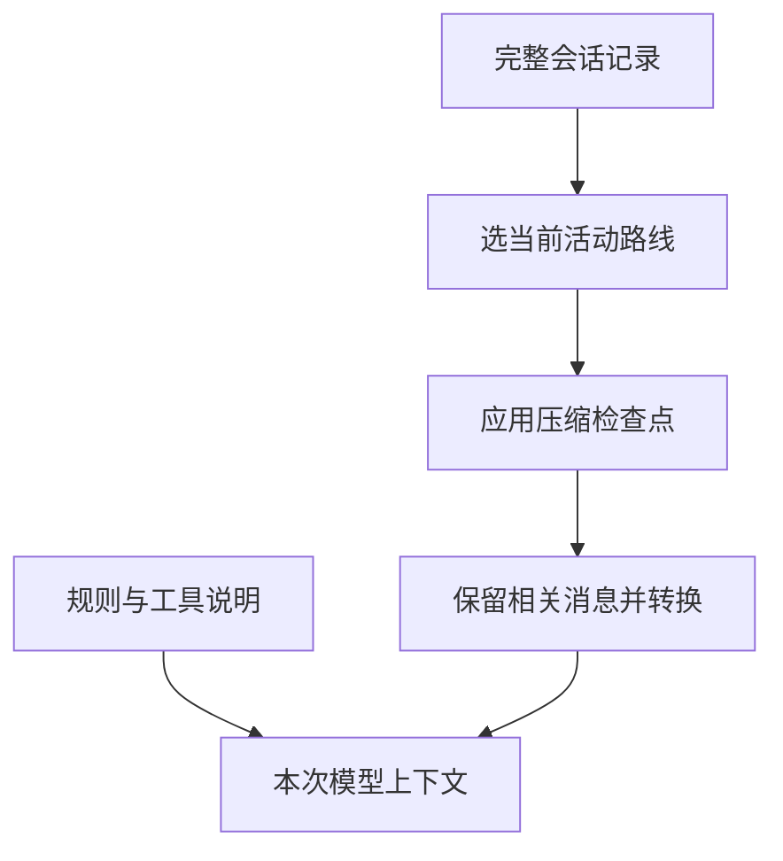

# 对话很长，模型为什么不一定记得全部？

你明明和 Pi 讨论过一项限制，它后来却没有遵守。原因不一定是会话文件丢失，也可能是那段原文已经不在这一次模型请求里。

## 1. 记录本和本次材料不是同一份东西

假设你正在和 Pi 讨论第三种修复方案。磁盘上可能保存了前两种失败尝试、很长的测试输出和所有往返；但这次真正需要的是当前目标、仍然有效的约束、关键发现以及最近的代码。保存完整经历与提供合适输入，是两个不同需求。

因此先分清两个对象：

| 对象 | 里面有什么 | 用来做什么 |
|---|---|---|
| Session 记录 | 保存过的多条路线、消息、摘要和状态条目 | 恢复与追溯 |
| Context，本次上下文 | 当前路线经过选择、压缩和转换后的模型材料 | 发给模型生成下一步 |



保存在记录中，不代表每次都会原样发送。反过来，扩展临时加入的请求材料也不一定以同样形式写入会话。

### Context 是怎样一步步形成的？

第一步，沿 Session 的活动路线取得相关历史，避免把已经放弃的旁支当作当前决定。第二步，应用已保存的压缩结果，用摘要代替一部分较早内容。第三步，把应用内的记录转换成模型接入能理解的消息，再与系统要求、当前工具说明等材料配合。

转换之所以必要，是因为 Pi 需要保存的信息比模型需要接收的信息多。比如一个扩展的计数器状态，对恢复界面有用，却未必需要发给模型；相反，工具返回的代码对下一轮分析很重要，不能只显示在界面而忘了放进 Context。

这个过程不是简单地取“文件最后 N 行”。记录中有不同条目类型，有父子关系，有摘要检查点，还要遵守模型消息格式。理解它，就能解释为何“日志里明明有这段话”不足以证明模型这次收到了。

### 模型说“记得”，是在说哪一种记忆？

模型可能依据本次材料重述过去的讨论，也可能只是生成听起来连贯的表达。它不能替代你检查实际输入来源。要追查遗漏，应该问：这项限制还在当前活动路线中吗？摘要保留了吗？请求转换有没有排除它？

这并不表示每次都要把全部历史发回去。无关、重复和已经过时的内容也会占用容量、干扰判断。好的上下文组织是在保留必要依据的同时控制噪声，而不是让 Context 越长越好。

## 2. 模型一次能接收多少？

上下文窗口是一次模型请求可容纳的材料容量。输入问题、规则、历史回答、工具说明、工具结果和预留输出都需要空间。

Pi 通常根据 Token 估计和 Provider 报告判断占用。字符数不是可靠的精确 Token 计数，因此不能用“文件只有几兆”推断一定装得下。

Pi `0.85.1` 自动压缩的典型阈值可理解成：

```text
当前上下文 Token > 模型窗口 - 预留 Token
```

默认预留 `reserveTokens=16384`，近期保留目标 `keepRecentTokens=20000`。它们是不同用途的配置，不是可以直接相加得到“最终摘要长度”的公式。

预留空间是为接下来的模型输出留余地；近期保留则是希望最新细节不要马上被摘要替换。前者面向下一步生成，后者面向当前工作的连续性。两者可以影响压缩选择，但都不能把模型窗口变成无限大。

Pi 会在适当的任务边界检查容量，例如准备新请求、工具结果加入后准备下一轮，以及低层运行收尾。服务也可能直接报告上下文溢出；这时需要区分提前整理与溢出后的恢复，不把它们都叫作“重新发送一次就好”。

## 3. 压缩究竟做了什么？

压缩不是把磁盘 JSONL 用 ZIP 压小，而是让模型总结旧材料，再用摘要加近期内容继续工作。

ZIP 等无损压缩追求解压后得到逐字相同的文件；这里的 Compaction 则选择“以后继续任务最需要知道什么”。例如把十次失败输出概括为“失败与统计条件遗漏有关，修复仅允许改 books.mjs”，省掉重复内容，但也可能丢掉某条关键异常。

摘要是一份新的工作依据，不是原文的可逆编码。它需要同时保留目标、限制、已完成事实和未完成事项；如果把“计划运行测试”概括成“测试已通过”，后续任务就会从错误状态继续。摘要质量因此是正确性问题，而不只是长度问题。

```text
压缩前：早期讨论 + 很多工具结果 + 最近的任务
压缩后：早期摘要 + 保留的近期消息 + 后续新消息
磁盘中：旧记录仍在，并追加压缩条目
```

默认压缩会调用模型，因此可能失败、被取消并产生用量。自动压缩被关闭，也不等于禁止用户主动执行 `/compact`。

重复压缩时，Pi 需要考虑上一次摘要及后来保留的消息，否则重要约束会一轮轮丢失。它仍然不能保证无损，因此真实文件和可重复验证的断点要独立保留。压缩改善的是上下文容量，不承担文件备份或事实审计的职责。

Pi 会尽量保持工具调用和工具结果的关系，不随意从一个孤立工具结果切开。一次特别长的任务也可能在中间分段；这时需要同时保留任务起点和后续进度的含义。

## 4. 分支摘要为什么不同？

压缩为的是减少当前路线的旧材料；分支摘要为的是把离开路线中的有用发现带到另一条路线。

| 比较项 | 压缩 | 分支摘要 |
|---|---|---|
| 触发场景 | 材料太长或 `/compact` | `/tree` 切换路线 |
| 选择范围 | 当前路线较旧的材料 | 离开路线到共同祖先之间的材料 |
| 主要目标 | 腾出容量 | 保留另一条尝试的经验 |
| 共同风险 | 有损、可能失败、可能计费 | 有损、可能失败、可能计费 |

两者都不能替代测试报告，也不能把已放弃方案的文件修改自动撤回。

## 5. 看一份虚构 JSONL 记录

下面只用于识别字段，不是让你打开真实会话，也不是完整可导入的会话样本：

```jsonl
{"type":"session","version":3,"id":"demo","timestamp":"2026-01-01T00:00:00Z","cwd":"/demo"}
{"type":"message","id":"a0000001","parentId":null,"timestamp":"2026-01-01T00:00:01Z","message":{"role":"user","content":"只分析统计错误","timestamp":1767225601000}}
{"type":"custom","id":"a0000002","parentId":"a0000001","timestamp":"2026-01-01T00:00:02Z","customType":"study-state","data":{"count":1}}
{"type":"model_change","id":"a0000003","parentId":"a0000002","timestamp":"2026-01-01T00:00:03Z","provider":"demo","modelId":"fixture"}
```

第一行是头部。后面的树条目有 `id` 和 `parentId`；`message.role` 才说明用户、Assistant 或工具结果身份，不要把外层 `type` 和内层 `role` 混用。

同为扩展相关内容，`custom` 通常只保存状态，不进入模型上下文；`custom_message` 才是可以参与模型材料的自定义消息。界面是否显示是另一项决定。

07 中的 JSON 模式输出是运行事件流；这里是持久化条目。两者都按行写 JSON，但不是可以直接互换的协议。

## 6. 当前版本的压缩记录怎么读？

较早记录使用 `firstKeptEntryId` 指向保留消息的起点。当前实现生成的压缩检查点还可能直接保存 `retainedTail`，也就是已经准备好的近期消息数组。

因此，不能只写一个“永远从 firstKeptEntryId 向后读”的解析器。读取时要以实际记录格式和对应版本的 SessionManager 为准。

最重要的语义没有变：**摘要是有损提炼，原始历史没有因此被删除；后续上下文不是完整历史的原样重放。**

如果摘要遗漏了“禁止修改测试”，应重新明确约束，并检查文件现状。不要用“摘要里没有”推断用户曾经撤销过这个限制。

## 7. 手动压缩一次长任务

只在允许提交模型请求的虚构会话中执行。先记录当前目标、限制和已验证结果，再输入：

```text
/compact 保留目标、允许修改的文件、已经运行的测试及其结果、未解决问题；不要把计划写成已完成。
```

等待完成后，检查摘要是否保留这些要点，以及下一步是否仍正确。上下文数字下降可以说明材料重新组织，但不能单独证明没有丢失关键含义。

压缩失败时不要手工删会话条目来“腾空间”。先保留错误信息、确认模型接入及容量，再决定是否缩小材料或用已保存断点启动新会话。

## 8. 怎样留下可靠断点？

给小书架写一个很短的断点，比复制整段聊天更有用：

```text
目标：只统计 read === true 的书籍。
范围：只允许修改 books.mjs；测试和依赖不动。
现状：函数已修改，尚未提交。
证据：node --test books.test.mjs，3 通过、0 失败。
差异：只有统计函数一行；测试文件未变。
待办：重新核对工作区状态，再决定是否提交。
禁止：不读取凭据、不调用额外服务、不自动推送。
```

这仍是格式示例，必须用实际结果填写。文件断点的路径、Git 状态和测试结果可以独立重新核对，不能只依赖模型说“我记得”。

跨会话恢复时按“读断点 → 查文件 → 核对差异 → 重跑必要验证 → 继续”的顺序。原会话里已经成功的测试，不自动证明后来改动仍然正确。

## 9. 一分钟回忆

> **Session 保存经历，Context 提供本次材料；压缩保留摘要，断点保存可核对的工作事实。**

本篇按 Pi `0.85.1` 核对，明确区分旧式保留边界与当前检查点。生成摘要的真实调用和导航交互需要单独观察，不能由 JSONL 夹具替代。

上一篇：[保存恢复与会话分支](10-保存恢复与会话分支.md)。下一篇：[提示词模板与技能](12-提示词模板与技能.md)。
