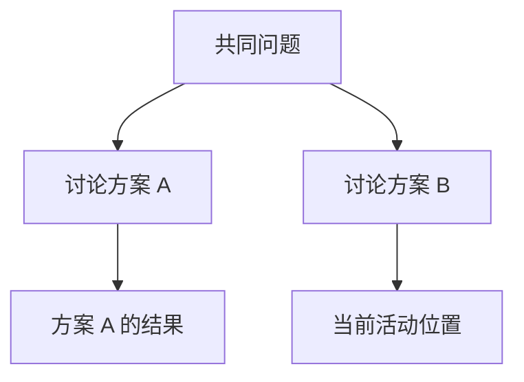
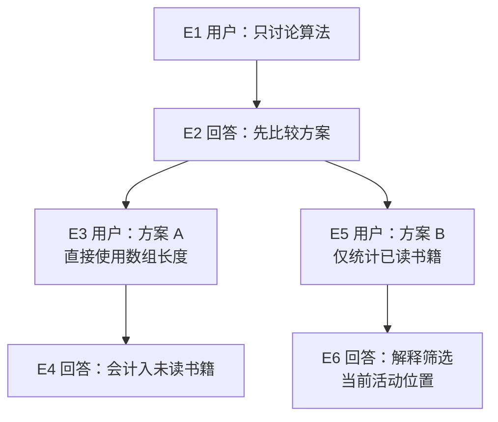
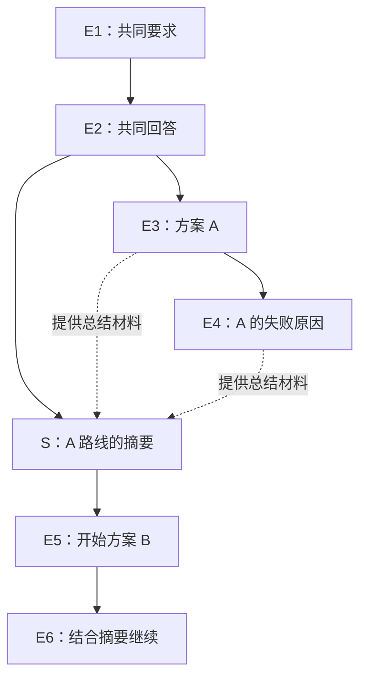

# 11 保存恢复与会话分支

## 明天继续做，或者换一条思路

小书架还没修完，你需要离开。明天希望 Pi 接着上次的讨论继续，而不是重新解释所有背景。这个需求靠会话解决；文件版本仍由 Git 管理。

## 1. 会话保存的是什么？

Session 可以先理解成“这段工作的对话记录及相关状态”。它通常包括用户消息、模型消息、工具结果、模型切换、摘要和扩展条目。

### 为什么关掉程序还能继续？

运行中的程序把当前状态放在内存里；进程退出后，内存中的这些对象就不能继续使用。Session 将需要保留的经历写成可读取的记录。下次启动时，Pi 创建新的运行对象，再根据记录重建继续工作的背景。

所以“恢复会话”不是让昨天的进程复活，也不是模型一直在服务端等待你。它是本机程序重新组织历史，让下一次请求能够接着理解目标、此前发现和未完成事项。

### 为什么会话不是一条只往后追加的直线？

考虑两个尝试：先用方案 A，发现不适合，再回到原问题尝试方案 B。若只保留一条直线，模型会同时看到两套可能互相矛盾的决定；若删除 A，又丢掉了失败经验。树结构让两条路线都能保存，但当前工作只沿其中一条继续。

树中的**条目**保存一次记录，**父条目**指出它接在哪个历史位置，**活动位置**说明现在从哪里继续。沿父指针向前追溯，就能找出当前路线。它不是把时间倒流，而是在已有记录中选择下一次请求的历史来源。

### 会话分支为什么不能隔离代码？

讨论方案 A 时，工具可能已经修改 `books.mjs`。切到讨论方案 B 的历史位置，只改变会话的活动路线，不会自动把磁盘文件变回去。此时“对话背景”和“文件状态”可以处于不同时间点。

这就是为什么恢复后需要重新读取关键文件。如果需要两个方案真正互不影响，还要由 Git 或独立工作目录管理文件版本。Session 解决对话的连续性，Git 解决文件版本，两者恰好覆盖不同问题。

默认会话保存在 `~/.pi/agent/sessions/`，按工作目录组织。一份会话是 JSONL 文件，但它不是整个工作目录的备份。

使用 `--no-session` 启动时，不应期待以后恢复这次对话；手工文件和工具副作用仍会留下。

### 名称、身份和文件路径为什么要分开？

把一次会话想成一本工作记录：Name 是封面的标题，Session ID 是机器用来识别它的编号，File 是它放在磁盘上的位置。改标题不会换一本记录；Fork、Clone 则会建立新的会话身份和文件，即使显示名称相同。

自动保存也有开始时点。新会话可以先有 ID 和预定路径，尚未产生 Assistant 记录时，文件未必已经建立。输入框里的草稿没有提交，更不属于已保存消息。不要把 `/session` 显示路径、模型回答完成和文件实际落盘当成同一个事实；`/quit` 也不是专门的保存按钮。

## 2. 换条思路，不一定要开新文件

你先讨论了方案 A，后来想从同一个问题尝试方案 B。这就是会话树的用途。



每条记录指向自己的父记录。当前活动位置向上连回起点的那条路径，就是下一次构造上下文的主要历史来源，不是把左右两条路线全部无条件发送。

在 Pi 中输入 `/tree`。用方向键浏览，回车选中，`Esc` 取消；可以使用 `Shift + L` 给重要节点加标签。

### 从一条直线开始，亲眼看它长出分支

先只讨论小书架的统计方法，不执行工具。下面的 E1–E6 是便于讲解的节点编号，实际 Pi 会生成自己的条目 ID；示例回答是预设材料，不是要求模型每次逐字复现。

| 节点 | 谁说的 | 内容 | 接在哪个节点后 |
|---|---|---|---|
| E1 | 用户 | 只讨论已读数量的算法，不修改文件。 | 无 |
| E2 | Assistant | 可以先比较方案，再决定实现。 | E1 |
| E3 | 用户 | 方案 A：用数组长度作为已读数量。 | E2 |
| E4 | Assistant | 这会把未读书籍也计入，方案 A 不符合要求。 | E3 |

此时只有 `E1 → E2 → E3 → E4` 一条路线，活动位置在 E4。你希望保留失败尝试，同时重新讨论另一种方案：等任务空闲，打开 `/tree`，选择 **E2 那条回答**，这次选择不生成摘要。

这个操作先把活动位置移到 E2。E3、E4 都还在记录里，尚未出现新分支。你再发送“方案 B：只统计 read 为 true 的书籍”，才追加 E5；回答追加为 E6。



E3 和 E5 的父节点都是 E2，这才构成分叉。它们在文件里写入的时间不同，但树上的位置由父指针决定。

| 时点 | 活动位置 | 沿父指针得到的历史 |
|---|---|---|
| 讨论完 A | E4 | E1、E2、E3、E4 |
| 选中 E2，还没发送 | E2 | E1、E2 |
| 提交 B | E5 | E1、E2、E5 |
| B 回答完成 | E6 | E1、E2、E5、E6 |

向上找父节点时先得到 `E6、E5、E2、E1`，按对话顺序反转后才是当前历史。E3、E4 没有出现在 B 的这条路径中；如果没有摘要或其他材料重新带入，模型下一次不会因为它们仍在文件里，就自动收到 A 的详细讨论。

### 怎样回到 A？“叶子”一定没有孩子吗？

从 E6 再打开 `/tree`，选择 E4 并且不摘要，活动路线便回到 `E1 → E2 → E3 → E4`。若继续提问，新消息接在 E4 后面；B 路线仍然保留。

Pi 所说的 active leaf 是“现在从哪里继续”的活动指针。选择 E2 时，E2 虽然已经有孩子，仍能成为当前活动位置。不要把这个名称理解为“只能选整棵树最末端、没有孩子的节点”。

树视图还可以折叠、过滤。过滤成只看用户消息，只改变你眼前显示哪些条目，不会删除回答、修改父指针或改变模型上下文。`Control + O` 切换过滤模式；搜索、标签和折叠帮助定位，回车选择才执行导航。

## 3. 选用户消息和选回答，有什么不同？

选中以前的一条用户消息时，Pi 会把活动位置移动到它的父节点，并把那条用户消息放入编辑器。你修改后重新提交，就形成新路线。

选中 Assistant、工具结果等非用户条目时，活动位置移到该条目，编辑器通常为空，你可以继续提问。

套回刚才的例子，在不摘要的条件下：

| 你选中的条目 | 导航后活动位置 | 编辑器 | 下一次发送会接在哪里 |
|---|---|---|---|
| E3 用户提出方案 A | E2 | 回填 E3 的原问题 | E2 后，形成原 E3 的兄弟节点 |
| E4 Assistant 解释 A 的问题 | E4 | 空 | E4 后，继续讨论 A |
| E1 第一条用户消息 | 空历史位置 | 回填 E1 的原问题 | 从新的根条目开始 |

当前版本的 `custom_message` 也按可重新编辑的消息处理：回到它的父条目并把文字放入编辑器。因此“所有非用户条目都定位到自身”并不是完整规则。选择摘要时还会追加摘要条目，最终活动位置需要把它计算进去。

因此，选中旧用户问题后看到输入框里出现原句是正常行为，不意味着它被立即再次发送。

**无论选哪一个节点，磁盘文件都不会自动恢复成那时的版本。** 如果方案 A 已经修改代码，方案 B 面对的仍是当前磁盘状态。

## 4. Tree、Fork、Clone 怎么选？

| 操作 | 是否新建会话文件 | 从哪里继续 |
|---|---|---|
| `/tree` | 否 | 当前文件中选定位置 |
| `/fork` | 是 | 从较早的用户问题分出路线，问题回到编辑器 |
| `/clone` | 是 | 复制当前活动分支，保留现有进度 |

`/clone` 不是克隆整个 Git 仓库，也不是复制原会话的所有旁支。CLI 的 `--fork` 和交互 `/fork` 入口也有不同复制范围，不要凭同一个单词假定行为完全相同。

想把两种方案放在一个记录里比较，用 Tree；想要独立的会话文件，用 Fork 或 Clone。无论哪一种，都要另行决定代码是否需要独立工作目录。

### 用同一棵树比较复制范围

下面每一行都独立从“同一会话 S1 保存 A/B，当前位于 E6”开始，均不生成分支摘要：

| 操作 | 得到什么历史 | 原 S1 怎样变化 |
|---|---|---|
| `/tree` 选 E2，然后重新提问 | 在 S1 的 E2 后追加第三条路线 | 原 A/B 都留在 S1 |
| `/fork` 选活动路径中的 E5 | 新 S2 先复制 E1、E2；E5 原问题回填编辑器 | S1 的内容保留 |
| `/clone` | 新 S3 复制 E1、E2、E5、E6，编辑器为空 | S1 的内容保留，A 路线不进入 S3 |
| CLI `--fork` 指定 S1 | 当前 CLI 复制源会话的完整记录到新文件 | S1 的内容保留；范围不同于交互 `/fork` |

这些是教学节点对应关系，不要求新文件中的条目 ID、标签元数据或字节内容逐字相同。Fork/Clone 的新 Header 可记录 `parentSession` 来源；会话文件之间的来源关系，也不同于同一个文件内部的 `parentId` 树。

假设 A 曾把 `books.mjs` 从 V1 改成 V2，以上操作后文件仍是 V2。若 S3 又把它改成 V3，回到 S1 也会读到 V3，因为它们仍使用同一工作目录。需要同时保留两套可运行代码时，再使用各自的 Git 工作树或独立目录。

## 5. 切换路线时为什么问“要不要摘要”？

如果离开的方案 A 已经发现某个重要失败原因，直接切到 B 会丢失这段活动路径的详细材料。Pi 可以为离开的分支生成摘要，带到目标位置。

选择不摘要、默认摘要或自定义关注点，影响的是留下多少背景。摘要可能调用模型并产生费用，而且会遗漏细节；它不能替代重要证据文件。

只练习会话导航时，可以选择不生成摘要，不必为了查看树就新增模型调用。

### 带着 A 的经验开始 B

重新从 E1–E4 这四条原始记录开始，这次仍选择 E2，但要求生成摘要。E2 是旧位置 E4 与目标位置 E2 的**共同祖先**，也就是两条路径最后共享的节点。需要交接的是 E2 之后离开的 E3、E4。

假设摘要 S 写成“方案 A 用数组总长度，会把未读书籍计入；后续应按 read === true 筛选”。Pi 把 S 接到 E2 后面，然后才接新问题 E5 和新回答 E6：



实线表示父子关系，虚线表示摘要材料来源。新活动路径是 `E1 → E2 → S → E5 → E6`，旧 A 路线仍为 `E1 → E2 → E3 → E4`。这是一次重新开始的对照场景，不把本节的 S 追加到上一节已经形成的 E6 后面。

如果从 A 切到已经存在的 B 末端 E6，共同祖先仍是 E2，但摘要会接到目标 E6 后面。**共同祖先决定离开路线的收集范围，目标位置决定摘要接在哪里**，两者不能混为一个点。

摘要把 A 的部分信息带进 B，并没有把两条路线全部合并。长路线还受摘要输入预算限制，生成内容可能遗漏事实；如果你要完全换一个前提，携带旧结论也可能干扰新尝试。选择摘要前先决定哪些发现仍然有效。

### 怎样验证自己真的看懂了？

在只含虚构讨论、且允许请求模型的练习会话中，先观察不摘要的分叉，再另做摘要对照。重点记录目标条目、旧活动位置、最终父子关系和摘要内容；不要仅凭模型说“我记得 A”判断它收到了什么。

生成摘要和新回答会调用模型；纯浏览和不摘要的内置导航不需要为此生成摘要。若装有扩展，`session_before_tree` 可以取消导航或提供摘要，不能忽略它对结果的影响。对应的记录结构与本次请求材料，在[下一篇](12-会话记录与上下文压缩.md)继续逐项对照。

## 6. 给任务一个容易找到的名字

在 Pi 中输入：

```text
/name 小书架统计修复
```

命名主要帮助你检索，不会创建 Git 分支。`/session` 可以显示当前会话信息；只在本机查看，不把完整路径和原始记录当公开学习材料。

退出前写明任务断点，再输入 `/quit`。下一次回到相同工作目录，在普通终端执行：

```bash
pi -c
```

`-c` 继续最近会话。存在多个任务时，用 `pi -r` 打开选择器更稳妥；已经在 Pi 中则用 `/resume`。

恢复后首先确认目录、名称、模型和最后的任务目标，再让 Pi 工作。会话里的旧文件内容可能早已过时，关键文件要重新读取。

## 7. 会话选择器里的常用操作

| 操作 | 默认按键 |
|---|---|
| 搜索 | 直接输入关键词 |
| 只看有名称的会话 | `Control + N` |
| 改名 | `Control + R` |
| 切换排序 | `Control + S` |
| 删除选中会话 | `Control + D`，之后确认 |

这些按键只针对会话选择器。在主编辑器中 `Control + D` 可能是退出或删除字符，不能脱离界面记忆按键。

删除前确认选中的是练习会话。系统存在 `trash` 工具时 Pi 可以使用回收方式，但不能假定所有环境都能恢复删除。删除本地记录也不会撤销已发送给服务商的材料。

## 8. 导出与分享不是同一件事

`/export bookshelf.html` 可以导出本地 HTML；当前版本也支持按文件类型导出 JSONL。用文件名确认目标格式，并检查生成文件是否包含工具输出和个人路径。

`/share` 会上传到 GitHub Gist，再生成分享入口。所谓 private/unlisted Gist 不应当作严格访问控制，持有链接的人可能访问。

不要直接分享真实开发会话。先准备只含虚构数据的会话，逐项检查内容，明确获得上传授权后才执行分享。重新导入会话也不是对内容安全性的认可。

## 9. 一分钟回忆

> **恢复对话用 Session，恢复文件用 Git；树决定继续哪条路线，不决定磁盘回到哪一刻。**

本篇按 Pi `0.85.1` 核对。恢复、导航、删除和上传分别具有不同影响，不能用一个成功结果替代全部验证。

上一篇：[常用设置与配置排查](10-常用设置与配置排查.md)。下一篇：[会话记录与上下文压缩](12-会话记录与上下文压缩.md)。
