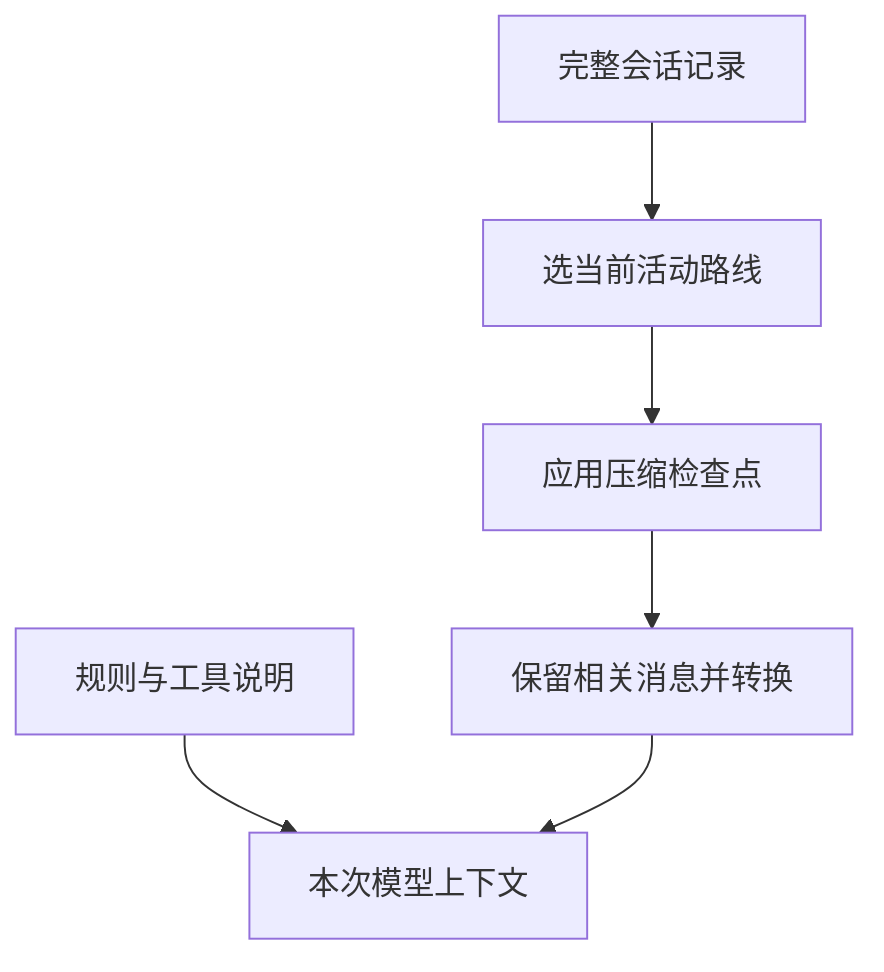

# 12 会话记录与上下文压缩

## 对话很长，模型为什么不一定记得全部？

你明明和 Pi 讨论过一项限制，它后来却没有遵守。原因不一定是会话文件丢失，也可能是那段原文已经不在这一次模型请求里。

## 1. 记录本和本次材料不是同一份东西

假设你正在和 Pi 讨论第三种修复方案。磁盘上可能保存了前两种失败尝试、很长的测试输出和所有往返；但这次真正需要的是当前目标、仍然有效的约束、关键发现以及最近的代码。保存完整经历与提供合适输入，是两个不同需求。

因此先分清两个对象：

| 对象 | 里面有什么 | 用来做什么 |
|---|---|---|
| Session 记录 | 保存过的多条路线、消息、摘要和状态条目 | 恢复与追溯 |
| Context，本次上下文 | 当前路线经过选择、压缩和转换后的模型材料 | 发给模型生成下一步 |



保存在记录中，不代表每次都会原样发送。反过来，扩展临时加入的请求材料也不一定以同样形式写入会话。

### Context 是怎样一步步形成的？

第一步，沿 Session 的活动路线取得相关历史，避免把已经放弃的旁支当作当前决定。第二步，应用已保存的压缩结果，用摘要代替一部分较早内容。第三步，把应用内的记录转换成模型接入能理解的消息，再与系统要求、当前工具说明等材料配合。

转换之所以必要，是因为 Pi 需要保存的信息比模型需要接收的信息多。比如一个扩展的计数器状态，对恢复界面有用，却未必需要发给模型；相反，工具返回的代码对下一轮分析很重要，不能只显示在界面而忘了放进 Context。

这个过程不是简单地取“文件最后 N 行”。记录中有不同条目类型，有父子关系，有摘要检查点，还要遵守模型消息格式。理解它，就能解释为何“日志里明明有这段话”不足以证明模型这次收到了。

### 把上一章的两条路线放到请求里

仍使用上一章的 E1–E6：E1/E2 是共同讨论，E3/E4 属于方案 A，E5/E6 属于方案 B。先假定没有压缩、扩展临时注入或额外检索，只看会话贡献的历史消息。

| 下一次从哪里继续 | 会话贡献的历史 | 没有直接带入的内容 |
|---|---|---|
| A 的 E4 | E1、E2、E3、E4 | B 的 E5、E6 |
| B 的 E6，没有分支摘要 | E1、E2、E5、E6 | A 的 E3、E4 |
| B 的 E6，分叉时带了摘要 S | E1、E2、S、E5、E6 | A 的原始 E3、E4；其中部分信息经 S 带入 |

接着把“检查 B 是否适用于空数组”作为新用户消息加入。完整请求还需要当前系统提示和工具定义，不能把表格里的历史单独当成全部 Context。

因此，文件里保留六条消息，与下一次发送六条历史消息没有必然关系。即使选对路线，也还要问：历史是否已经被摘要替换？扩展有没有调整消息？最终接入层怎样转换它们？

### 模型说“记得”，是在说哪一种记忆？

模型可能依据本次材料重述过去的讨论，也可能只是生成听起来连贯的表达。它不能替代你检查实际输入来源。要追查遗漏，应该问：这项限制还在当前活动路线中吗？摘要保留了吗？请求转换有没有排除它？

这并不表示每次都要把全部历史发回去。无关、重复和已经过时的内容也会占用容量、干扰判断。好的上下文组织是在保留必要依据的同时控制噪声，而不是让 Context 越长越好。

## 2. 模型一次能接收多少？

上下文窗口是一次模型请求可容纳的材料容量。输入问题、规则、历史回答、工具说明、工具结果和预留输出都需要空间。

Pi 通常根据 Token 估计和 Provider 报告判断占用。字符数不是可靠的精确 Token 计数，因此不能用“文件只有几兆”推断一定装得下。

Pi `0.85.1` 自动压缩的典型阈值可理解成：

```text
当前上下文 Token > 模型窗口 - 预留 Token
```

默认预留 `reserveTokens=16384`，近期保留目标 `keepRecentTokens=20000`。它们是不同用途的配置，不是可以直接相加得到“最终摘要长度”的公式。

预留空间是为接下来的模型输出留余地；近期保留则是希望最新细节不要马上被摘要替换。前者面向下一步生成，后者面向当前工作的连续性。两者可以影响压缩选择，但都不能把模型窗口变成无限大。

Pi 会在适当的任务边界检查容量，例如准备新请求、工具结果加入后准备下一轮，以及低层运行收尾。服务也可能直接报告上下文溢出；这时需要区分提前整理与溢出后的恢复，不把它们都叫作“重新发送一次就好”。

### 用一组数字看清两个预算

假设窗口为 100,000 Token，预留回复空间为 16,384，提前整理的阈值便约为 83,616。当前材料估计 85,000 时，已超过这个阈值；这不表示模型已经报错，也不表示本轮恰好会输出 16,384 Token。

再假设近期保留目标为 20,000。它影响从历史的哪里开始保留近期原文；最终材料还包含摘要、系统要求和工具说明，所以压缩后的总量不会恰好等于 20,000。消息边界和 Token 估计也会影响实际结果。

压缩需要生成摘要，累计用量会继续增加，但下一次请求的上下文占用可以下降。Footer 的累计输入、输出与当前窗口占比，分别回答“之前总共用了多少”和“这次桌上放了多少”。

## 3. 压缩究竟做了什么？

压缩不是把磁盘 JSONL 用 ZIP 压小，而是让模型总结旧材料，再用摘要加近期内容继续工作。

ZIP 等无损压缩追求解压后得到逐字相同的文件；这里的 Compaction 则选择“以后继续任务最需要知道什么”。例如把十次失败输出概括为“失败与统计条件遗漏有关，修复仅允许改 books.mjs”，省掉重复内容，但也可能丢掉某条关键异常。

摘要是一份新的工作依据，不是原文的可逆编码。它需要同时保留目标、限制、已完成事实和未完成事项；如果把“计划运行测试”概括成“测试已通过”，后续任务就会从错误状态继续。摘要质量因此是正确性问题，而不只是长度问题。

```text
压缩前：早期讨论 + 很多工具结果 + 最近的任务
压缩后：早期摘要 + 保留的近期消息 + 后续新消息
磁盘中：旧记录仍在，并追加压缩条目
```

默认压缩会调用模型，因此可能失败、被取消并产生用量。自动压缩被关闭，也不等于禁止用户主动执行 `/compact`。

重复压缩时，Pi 需要考虑上一次摘要及后来保留的消息，否则重要约束会一轮轮丢失。它仍然不能保证无损，因此真实文件和可重复验证的断点要独立保留。压缩改善的是上下文容量，不承担文件备份或事实审计的职责。

Pi 会尽量保持工具调用和工具结果的关系，不随意从一个孤立工具结果切开。一次特别长的任务也可能在中间分段；这时需要同时保留任务起点和后续进度的含义。

### 沿一次压缩走完五步

小书架已经经历多次分析和测试。假设当前历史可分为：H1/H2 是早期约束与讨论，H3/H4 是失败尝试，H5/H6 是最近一次用户问题与回答。这里的 H 编号只用于解释压缩，不沿用上一章的分支节点。

1. Pi 从近期消息向前估算预算，选择保留起点。假设本次选中 H5；这个位置由内容和预算决定，不能凭消息条数预先保证。
2. 把 H1–H4 准备为摘要材料，说明目标、约束、已发生的结果和待办。摘要请求本身也占模型容量。
3. 模型生成摘要 C，例如“只允许修改 books.mjs；旧方案统计了未读书籍；最近方案尚待复验”。生成失败或取消时，不能声称已有一个成功检查点。
4. Pi 保存摘要和保留边界或近期消息，追加压缩条目；H1–H6 的原始记录不因此删除。
5. 下次继续时使用 C、近期 H5/H6 和新消息。原来较早的四条消息不再全部原样带入。

| 观察对象 | 压缩前 | 成功压缩后再提问 |
|---|---|---|
| 磁盘历史 | H1–H6 | 原历史仍在，另有 C 与后续新记录 |
| 会话提供的模型材料 | H1–H6 | C、保留的 H5/H6、新问题 |
| 文件状态 | 当前的 books.mjs | 仍是当前文件，不由 C 恢复 |
| 早期约束 | H1 中的原话 | 需要由 C 准确保留，不能假定逐字存在 |

如果 H5 是一次工具调用的结果，却丢掉了发起它的 Assistant Tool Call，后续协议便可能无法配对。Pi 选择切点时需要保住这种关系。若单个用户任务本身就很长，还要概括这次任务的前半段，让保留下来的后半段有来由。

再次压缩时，输入也不是简单取“上次压缩条目之后的几行”。上一次摘要、上次保留的近期材料以及后来新增的消息，都可能需要参与本次整理。

### 手动、提前整理与溢出恢复怎样区分？

| 入口 | 为什么发生 | 接下来应观察什么 |
|---|---|---|
| 手动 `/compact` | 用户明确要求整理 | 摘要成功或失败；不把它当作重新执行上一项任务 |
| 阈值压缩 | 材料接近窗口上限 | 压缩后能否继续待处理工作；不要求先出现 Provider 错误 |
| 成功响应后的容量处理 | 成功回答的用量暴露出容量问题 | 保留已经成功的回答，整理后续材料；不能因容量信号重复成功任务 |
| 失败或截断后的溢出恢复 | 可识别的容量错误妨碍生成 | 排除失败输出作为本次续写材料、整理后受限重试；历史记录与当前材料仍需分开看 |

溢出恢复不是普通限流或网络重试；用户取消也不应被当作可自动恢复的容量错误。判断走了哪条路径，要结合失败原因、压缩原因、是否继续以及最终结果。具体重试条件随运行层和版本核对，不能用一条“自动压缩已开启”说明全部行为。

## 4. 分支摘要为什么不同？

压缩为的是减少当前路线的旧材料；分支摘要为的是把离开路线中的有用发现带到另一条路线。

| 比较项 | 压缩 | 分支摘要 |
|---|---|---|
| 触发场景 | 材料太长或 `/compact` | `/tree` 切换路线 |
| 选择范围 | 当前路线较旧的材料 | 离开路线到共同祖先之间的材料 |
| 主要目标 | 腾出容量 | 保留另一条尝试的经验 |
| 共同风险 | 有损、可能失败、可能计费 | 有损、可能失败、可能计费 |

两者都不能替代测试报告，也不能把已放弃方案的文件修改自动撤回。

把两种机制接起来看：先从 A 携带摘要 S 进入 B，之后 B 也变得很长，S 可能再被纳入压缩摘要 C。它们可以先后发生，既不是互斥选项，也不保证每次摘要都原样保留前一次信息。

文件跟踪信息可以记录曾读写过哪些路径，帮助后续重新检查现场；它保存的不是那些文件的可恢复版本。摘要中写着“修改过 books.mjs”，仍要读取文件和核对差异，才能知道现在的内容。

## 5. 看一份虚构 JSONL 记录

下面只用于识别字段，不是让你打开真实会话，也不是完整可导入的会话样本：

```jsonl
{"type":"session","version":3,"id":"demo","timestamp":"2026-01-01T00:00:00Z","cwd":"/demo"}
{"type":"message","id":"a0000001","parentId":null,"timestamp":"2026-01-01T00:00:01Z","message":{"role":"user","content":"只分析统计错误","timestamp":1767225601000}}
{"type":"custom","id":"a0000002","parentId":"a0000001","timestamp":"2026-01-01T00:00:02Z","customType":"study-state","data":{"count":1}}
{"type":"model_change","id":"a0000003","parentId":"a0000002","timestamp":"2026-01-01T00:00:03Z","provider":"demo","modelId":"fixture"}
```

第一行是头部。后面的树条目有 `id` 和 `parentId`；`message.role` 才说明用户、Assistant 或工具结果身份，不要把外层 `type` 和内层 `role` 混用。

同为扩展相关内容，`custom` 通常只保存状态，不进入模型上下文；`custom_message` 才是可以参与模型材料的自定义消息。界面是否显示是另一项决定。

08 中的 JSON 模式输出是运行事件流；这里是持久化条目。两者都按行写 JSON，但不是可以直接互换的协议。

### 在 JSONL 中看见真正的分叉

下面把上一章无摘要的 E1–E6 投影为 ID、父 ID 和消息身份；省略时间、正文、用量等字段，**不是完整可导入的 Session 文件**。`e0000001` 对应 E1，后面依次类推。

```jsonl
{"type":"message","id":"e0000001","parentId":null,"message":{"role":"user"}}
{"type":"message","id":"e0000002","parentId":"e0000001","message":{"role":"assistant"}}
{"type":"message","id":"e0000003","parentId":"e0000002","message":{"role":"user"}}
{"type":"message","id":"e0000004","parentId":"e0000003","message":{"role":"assistant"}}
{"type":"message","id":"e0000005","parentId":"e0000002","message":{"role":"user"}}
{"type":"message","id":"e0000006","parentId":"e0000005","message":{"role":"assistant"}}
```

文件先写 A，再写 B，所以 E5 出现在 E4 后一行。但 E5 的 `parentId` 指向 E2，并没有接到 E4。这就是**追加顺序和对话关系可以不同**的具体表现。

对 E6 沿父指针查找，得到 E6、E5、E2、E1，再反转成 E1、E2、E5、E6。若直接读取最后四条记录，会拿到 E3、E4、E5、E6：共同约束没了，两套方案却混在一起，结果完全不同。

### 树节点、消息与工具调用不是同一种计数

| 记录 | 在哪里 | 如何影响下一次模型材料 |
|---|---|---|
| Header | 文件头，含 Session 身份 | 不是一条聊天消息，也不参加父指针树 |
| 用户/Assistant 消息 | `type=message` 条目 | 活动路径选中后进入消息处理 |
| Tool Call | Assistant 消息的内容块中 | 表达申请，可有多个调用 ID；不是每个调用都单独占一个树条目 |
| Tool Result | 独立的 `role=toolResult` 消息 | 用 `toolCallId` 对应申请，不靠“前一行”配对 |
| `model_change` 等设置 | 独立状态条目 | 恢复设置所需信息，不当作普通对话原文发送 |
| `custom` | 扩展状态条目 | 可供扩展重放，不直接成为模型消息 |
| `custom_message` | 扩展消息条目 | 可转换为模型材料；`display` 另行决定显示 |
| 分支摘要/压缩 | 专门的摘要条目 | 按各自规则转换与重建上下文 |

因此 JSONL 行数、树条目数、消息数、工具调用数和模型请求次数可能都不同。读记录时先判断顶层 `type`，再看消息的 `role` 和内容块，最后核对父子关系与调用 ID。

## 6. 当前版本的压缩记录怎么读？

较早记录使用 `firstKeptEntryId` 指向保留消息的起点。当前实现生成的压缩检查点还可能直接保存 `retainedTail`，也就是已经准备好的近期消息数组。

因此，不能只写一个“永远从 firstKeptEntryId 向后读”的解析器。读取时要以实际记录格式和对应版本的 SessionManager 为准。

把前面的 H1–H6 例子放到两种表示里：

| 表示方式 | 压缩条目保存什么 | 重建材料怎样找到 H5/H6 |
|---|---|---|
| `firstKeptEntryId` | 摘要 C 与 H5 的条目 ID | 沿所选路径找到 H5，保留到 C 之前的相关消息，再接 C 之后的新消息 |
| `retainedTail` | 摘要 C 与已准备好的近期消息数组 | 直接使用数组里的 H5/H6，再接检查点之后的新消息 |

后一种是把“保留哪些内容”的结果保存下来。它不要求删除原 H5/H6，也不是把整个会话树复制进数组。前一种中的起点 ID 则表示从哪里保留原文，不能解释成从哪里删除历史。

同一安装包的文档、CLI 运行层和公开 SDK 入口也需要分别核对。本机 `0.85.1` 的公开 `SessionManager.appendCompaction()` 仍接收 `firstKeptEntryId`；随包新运行层还包含 `retainedTail` 的处理。不能仅凭版本号相同，断言任一入口都能重建任一种检查点；跨入口读取应先用虚构记录验证。

本篇 JSONL 示例具体采用公开 SessionManager 的 **v3 条目结构**。随包 CLI bundle 另有 **v4 存储格式**处理代码，使用 `v`、`kind` 等标识，并可把一次事务的多项写入放在同一物理行；设置值也不必都表现为 v3 树条目。这里的 v3 逐行例子用于讲清父指针，不是任意当前 CLI 文件的通用解析器。拿到受控文件后先辨认 Header 与产生它的入口，再选择相应读法；本篇没有用真实 CLI 会话验证 v4 落盘流程。

最重要的语义没有变：**摘要是有损提炼，原始历史没有因此被删除；后续上下文不是完整历史的原样重放。**

如果摘要遗漏了“禁止修改测试”，应重新明确约束，并检查文件现状。不要用“摘要里没有”推断用户曾经撤销过这个限制。

## 7. 手动压缩一次长任务

只在允许提交模型请求的虚构会话中执行。先记录当前目标、限制和已验证结果，再输入：

```text
/compact 保留目标、允许修改的文件、已经运行的测试及其结果、未解决问题；不要把计划写成已完成。
```

等待完成后，检查摘要是否保留这些要点，以及下一步是否仍正确。上下文数字下降可以说明材料重新组织，但不能单独证明没有丢失关键含义。

为了让观察有意义，在允许的练习中准备两类虚构事实：一条较早的固定约束，例如“不得修改测试”；一条近期结论，例如“已改实现、尚未复验”。压缩前记录它们的位置，压缩后检查早期约束是否进了摘要、近期结论是否保留，以及模型有没有把“尚未复验”说成“测试通过”。

这三个检查分别对应摘要内容、保留范围和事实准确性。一次回答正确只是辅助观察；真正分析输入边界时，还要核对受控记录或程序重建出的消息，不能只用模型自述作为证据。

压缩失败时不要手工删会话条目来“腾空间”。先保留错误信息、确认模型接入及容量，再决定是否缩小材料或用已保存断点启动新会话。

## 8. 怎样留下可靠断点？

给小书架写一个很短的断点，比复制整段聊天更有用：

```text
目标：只统计 read === true 的书籍。
范围：只允许修改 books.mjs；测试和依赖不动。
现状：函数已修改，尚未提交。
证据：node --test books.test.mjs，3 通过、0 失败。
差异：只有统计函数一行；测试文件未变。
待办：重新核对工作区状态，再决定是否提交。
禁止：不读取凭据、不调用额外服务、不自动推送。
```

这仍是格式示例，必须用实际结果填写。文件断点的路径、Git 状态和测试结果可以独立重新核对，不能只依赖模型说“我记得”。

跨会话恢复时按“读断点 → 查文件 → 核对差异 → 重跑必要验证 → 继续”的顺序。原会话里已经成功的测试，不自动证明后来改动仍然正确。

本篇按 Pi `0.85.1` 核对，明确区分旧式保留边界与当前检查点。生成摘要的真实调用和导航交互需要单独观察，不能由 JSONL 夹具替代。

上一篇：[保存恢复与会话分支](11-保存恢复与会话分支.md)。下一篇：[提示词模板与技能](13-提示词模板与技能.md)。
