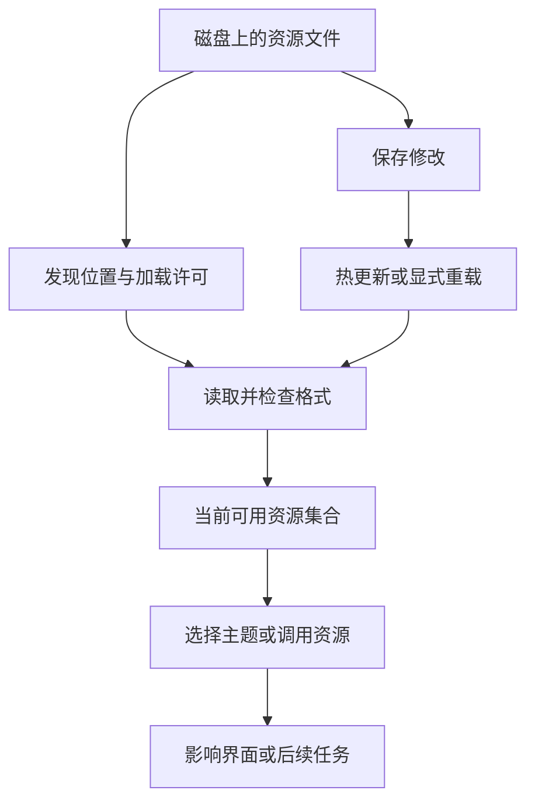

# 主题与重载：磁盘文件怎样变成运行中的资源

你已经能添加模板和 Skill。现在把小书架练习的界面颜色换一下，同时理解一个经常遇到的问题：文件保存了，运行中的 Pi 为什么还是旧样子？

## 资源为什么不是保存以后就自动生效？

一份 JSON 或 Markdown 起初只是磁盘文件。Pi 必须找到它、读懂格式，并把它加入当前可以使用的资源集合。主题还需要被选中；模板和 Skill 需要被调用或加载正文；扩展则需要运行初始化代码并注册能力。

所以“文件存在”“已经发现”“已经加载”“正在使用”是不同状态。新主题在目录中，却没有出现在选择器里，可能没经过发现；选择器有它但界面没变，可能没有激活。把文件复制到更多目录不一定解决问题，反而可能引入同名来源。



这是资源进入运行环境的共同思路，并不表示所有资源使用完全相同的监听器或加载机制。当前主题有自己的热更新，扩展重载还要处理旧实例的清理，模板则影响后面展开的消息。

### 主题为什么按用途命名，而不按位置着色？

假设工具结果新增了一行，后面的屏幕行号都会变化。若“第 20 行是红色”，显示很快就错乱；若“错误使用 error 颜色”，无论它出现在何处，含义都保持一致。

这种把用途映射到外观的设计叫语义样式。`error`、`success`、`toolDiffAdded` 表达内容角色，具体色值再由主题决定。组件不必知道你喜欢哪一种红色，只需要知道正在显示错误。

颜色是状态的表达，不是状态的来源。把错误颜色改成绿色不会让失败变成功；把思考区块隐藏不会取消已产生的推理。因此主题是理解“显示与任务事实分开”的一个直观例子。

### 重载为什么既方便，又需要清理？

运行中的 Pi 可能已经把资源读入内存，扩展还可能注册了监听器和定时器。保存新文件不等于这些旧对象消失。重载要更新被使用的资源，涉及代码时还需要结束旧实例负责的工作，否则可能出现一个事件被处理两次。

重启建立新进程，新会话建立新的对话状态，重载更新资源。这三个操作解决的对象不同，因此不能把它们都理解为“全部清空再来”。下面用主题观察最容易看见的那一层变化，再把这个认识带入扩展生命周期。

## 1. 主题由一组“用途颜色”组成

颜色不是按“屏幕第几行”配置，而是按语义命名。例如 `error` 用于错误，`toolDiffAdded` 用于新增内容，`thinkingHigh` 用于高思考档位边框。

把每种用途叫作一个颜色 Token。它和模型计费用的 Token 不是同一个概念。

Pi `0.85.1` 要求完整的必需颜色集合，不支持仅写一个 `accent` 就自动继承整个内置主题。

## 2. 重载、重启和新会话的区别

| 操作 | 主要影响 | 不会自动做什么 |
|---|---|---|
| `/reload` | 重读资源，更新扩展等运行实例 | 清空全部会话历史、回滚文件 |
| 退出后重新启动 | 建立新进程，重新解析启动环境 | 自动采用你忘记保存的草稿 |
| `/new` | 开始新会话 | 卸载扩展、恢复 Git 版本 |
| 当前主题热更新 | 更新显示资源 | 改变模型任务结果 |

扩展重载会涉及关闭旧实例、创建新实例和恢复状态。模板重载后，之前已经展开并发送的旧消息不会被重写。

## 3. 为什么新资源仍然找不到？

先检查文件名与目录、JSON/Markdown 语法、Project Trust、`--no-*` 开关和显式资源路径，再排查重复名称。

关闭自动发现不一定禁止显式加载。例如 `--no-extensions -e ./demo.ts` 仍会加载你点名的扩展。模板、Skill、主题也有各自的显式入口。

不要把同一份文件复制到全局和项目多个目录来解决“没发现”。重复来源可能让你一直修改没有被采用的那一份。

## 4. 先试内置主题

在 Pi 输入 `/settings`，选择 `dark` 或 `light`。这会改变显示，不会切换模型、增加权限或改变工具结果。

普通终端的 `pi --use-theme light` 只设置这次交互启动的初始主题，不修改已保存设置。后续在 `/settings` 里选择主题，则按交互设置的正常方式保存。

`--theme ./book-study.json` 是加载一个主题资源；`--use-theme book-study` 是选择已加载的主题。**资源存在和资源被选中是两个步骤。**

## 5. 创建一个完整练习主题

在可信练习项目新建 `.pi/themes/book-study.json`。下面是完整 JSON，不是省略了必填项的片段：

```json
{
  "name": "book-study",
  "vars": {
    "blue": "#2874A6",
    "green": "#117A65",
    "gray": "#68737D",
    "paper": "#F4F6F7"
  },
  "colors": {
    "accent": "blue",
    "border": "gray",
    "borderAccent": "blue",
    "borderMuted": "#B3B6B7",
    "success": "green",
    "error": "#B03A2E",
    "warning": "#9A6700",
    "muted": "gray",
    "dim": "#7B7D7D",
    "text": "#202124",
    "thinkingText": "gray",
    "selectedBg": "#D6EAF8",
    "scrollbarTrack": "#D5D8DC",
    "scrollbarThumb": "gray",
    "searchMatchBg": "#F9E79F",
    "searchMatchText": "#202124",
    "userMessageBg": "paper",
    "userMessageText": "#202124",
    "customMessageBg": "#E8F6F3",
    "customMessageText": "#202124",
    "customMessageLabel": "green",
    "toolPendingBg": "paper",
    "toolSuccessBg": "#E8F6F3",
    "toolErrorBg": "#FDEDEC",
    "toolTitle": "blue",
    "toolOutput": "#202124",
    "mdHeading": "blue",
    "mdLink": "blue",
    "mdLinkUrl": "gray",
    "mdCode": "green",
    "mdCodeBlock": "#202124",
    "mdCodeBlockBorder": "gray",
    "mdQuote": "gray",
    "mdQuoteBorder": "gray",
    "mdHr": "gray",
    "mdListBullet": "blue",
    "toolDiffAdded": "green",
    "toolDiffRemoved": "#B03A2E",
    "toolDiffContext": "gray",
    "syntaxComment": "gray",
    "syntaxKeyword": "blue",
    "syntaxFunction": "#7D3C98",
    "syntaxVariable": "#202124",
    "syntaxString": "green",
    "syntaxNumber": "#A04000",
    "syntaxType": "blue",
    "syntaxOperator": "#202124",
    "syntaxPunctuation": "gray",
    "thinkingOff": "gray",
    "thinkingMinimal": "green",
    "thinkingLow": "blue",
    "thinkingMedium": "#148F77",
    "thinkingHigh": "#7D3C98",
    "thinkingXhigh": "#B03A2E",
    "thinkingMax": "#922B21",
    "bashMode": "#9A6700"
  }
}
```

这是浅色练习主题，终端背景也应适合浅色文字布局。`vars` 里的名称供颜色字段引用；颜色也可以是六位十六进制 RGB、0–255 的终端色号，或空字符串表示终端默认色。

## 6. 加载、选择、观察

1. 确认当前项目可信，保存 JSON。
2. 在 Pi 输入 `/reload`，让新资源被发现。
3. 在 `/settings` 中选择 `book-study`。
4. 观察普通文字、代码、选中项和已有工具结果是否可读。
5. 将 `accent` 对应变量改为另一种有足够对比度的颜色，保存后观察当前自定义主题的热更新。

修改当前已激活的主题文件，通常可以自动热更新；新增加一个文件则还需要发现和选择。不要把两种情况混为一谈。

颜色变化不需要模型请求。检查所有工具状态时可以利用已有虚构消息，没必要为了制造红色错误真的运行危险命令。

## 7. 一分钟回忆

> **先发现资源，再选择或调用；重载更新资源，不抹掉历史，更不回滚文件。**

本篇按 Pi `0.85.1` 核对。JSON 合法和主题加载成功只证明格式与加载链路，终端色彩、对比度和实际界面仍需单独观察。

上一篇：[提示词模板与技能](12-提示词模板与技能.md)。下一篇：[第一个扩展与生命周期](14-第一个扩展与生命周期.md)。
