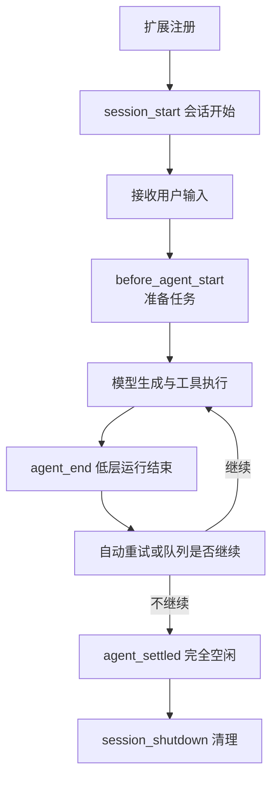

# 写第一个扩展，看懂它什么时候运行

模板让模型收到更完整的要求，Skill 提供方法。如果你希望输入一个命令就立即显示固定消息，不经过模型判断，就需要让 Pi 执行你写的程序。

## 1. 扩展是一段本地代码

Extension 通常是一个 TypeScript 模块。Pi 加载它，调用默认导出的函数，并把 ExtensionAPI 交给它；你的代码通过这个对象注册命令、工具和事件处理函数。

```text
加载文件 → 调用工厂函数 → 注册能力 → 等待对应事件发生
```

TypeScript 是带类型说明的 JavaScript。下面的 `import type` 只给开发工具提供类型信息，`async` 表示函数可能异步完成，`await` 表示等待异步结果。

Pi 的扩展加载器支持这种 `.ts` 文件，不必先手工编译成 `.js`。但能加载不代表通过了严格类型检查，更不代表没有危险行为。

## 2. 建一个只做本地通知的扩展

使用已经安装的 Pi `0.85.1`，在新的可信练习目录创建 `.pi/extensions/book-hello.ts`：

```typescript
import type { ExtensionAPI } from '@earendil-works/pi-coding-agent';

export default function (pi: ExtensionAPI) {
  pi.registerCommand('book-hello', {
    description: '显示小书架扩展已加载',
    handler: async (_args, ctx) => {
      const text = '小书架扩展已加载；没有提交模型任务。';
      if (ctx.hasUI) ctx.ui.notify(text, 'info');
      else process.stderr.write(text + '\n');
    },
  });
}
```

下划线开头的 `_args` 表示这次不使用命令参数。`ctx` 是执行这一回命令时的上下文，而不是初始化时永远不变的全局对象。

只检查并加载这个文件，不自动发现其他扩展：

```bash
pi --no-extensions -e ./.pi/extensions/book-hello.ts \
  --no-tools --no-skills --no-prompt-templates \
  --no-themes --no-context-files --no-session
```

启动后输入 `/book-hello`，应看到固定提示。命令本身没有 `prompt`、`sendUserMessage` 或网络操作，因此不需要请求模型来生成这句话。

这不表示整个宿主启动绝不会访问网络或读取现有配置。需要无凭据、无启动联网的验证时，还要单独控制环境和启动选项。

## 3. 自动发现与显式加载

| 放置方式 | 用途 |
|---|---|
| `~/.pi/agent/extensions/*.ts` | 全局自动发现 |
| `.pi/extensions/*.ts` | 可信项目内自动发现 |
| 上述目录的 `扩展名/index.ts` | 多文件扩展的入口 |
| CLI `-e 路径` | 本次显式加载，适合初步核对 |

准备使用 `/reload` 反复开发时，采用受信任的自动发现目录。不要无意间让同一扩展从多个来源重复加载，也不要把任意子目录当作都会递归执行的入口。

新手的第一个扩展不需要网络依赖、后台线程或复杂目录。只有确实需要第三方库时，才审查依赖并增加包配置。

## 4. 从一次任务看事件

“事件”就是 Pi 在某个时间点通知你的函数。例如会话开始时通知一次，每次工具调用前又通知一次。



不是每个命令都经过整张图。`/book-hello` 命中扩展命令后直接执行 Handler，不进入模型任务主线。

## 5. 常用回调放在哪一层？

| 事件 | 适合做什么 | 容易误解之处 |
|---|---|---|
| `session_start` | 恢复当前会话的扩展状态 | 也可能来自恢复、重载、分叉 |
| `input` | 处理普通输入或改变文本 | 已命中的扩展命令会绕过它 |
| `before_agent_start` | 为这次任务补消息或提示 | 不等于最终网络请求体 |
| `context` | 调整下一次模型请求的消息 | 不会自动改写磁盘历史 |
| `tool_call` | 工具实际执行前检查、拒绝 | `tool_execution_start` 可能已经发出 |
| `tool_result` | 处理工具结果 | 不能把错误改成成功来掩盖失败 |
| `user_bash` | 拦截用户 `!` 和 `!!` | 不由模型工具门禁代管 |
| `session_shutdown` | 释放资源和清理 UI | 不能保证 SIGKILL 时执行 |

一次 Turn 可以先理解成一次模型响应和它提出的工具批次；一次 Agent Run 可以包含多轮。`agent_end` 后 Pi 仍可能自动继续，要判断整体空闲应考虑 `agent_settled` 或等待稳定状态的 API。

## 6. ctx 能告诉你什么？

`ctx.cwd` 是当前任务目录；`ctx.model` 是当前选定模型；`ctx.sessionManager` 提供当前会话读取接口；`ctx.signal` 是活动任务的取消信号，空闲命令里可能不存在。

| 模式 | `ctx.mode` | `ctx.hasUI` | UI 方式 |
|---|---|---|---|
| 交互终端 | `tui` | true | 本机组件与输入 |
| RPC | `rpc` | true | 通过协议与外部客户端交互 |
| JSON | `json` | false | 事件输出，无交互对话框 |
| Print | `print` | false | 一次性输出，无交互对话框 |

调用本机组件前判断 `ctx.mode === 'tui'`；一般通知和协议支持的对话框才使用 `ctx.hasUI`。无 UI 时输出到 `stderr`，避免破坏 JSON/RPC 的 `stdout`。

## 7. 回调出错会怎样？

普通观察回调出错，宿主可能记录错误后继续；不能把“抛出了异常”当作所有操作都已被阻止。

`tool_call` 的错误具有阻止工具的语义。工具 `execute` 失败则应抛出异常，让宿主形成错误 Tool Result；返回一段写着“失败”的普通成功文本，不等于设置了错误标记。

每个事件的返回合同不同。给 `user_bash` 返回 `block: true`，不能照搬成模型工具门禁的效果。

## 8. 生命周期中的资源归属

工厂也可能在 `--help`、模型列表等不启动会话的调用中执行。因此不要在工厂里启动永不停止的定时器、Watcher 或子进程。

在真正需要时启动资源，在 `session_shutdown` 关闭，并让清理可以重复调用。异步工厂会被等待，但不能无截止地等待一个永远不返回的远端接口。

重载后不要继续使用旧 `ctx`。命令里调用 `await ctx.reload()` 后就返回；切换会话后的工作应使用替换会话提供的新上下文。

## 9. 一分钟回忆

> **工厂注册能力，事件决定时机，ctx 描述现场；命令、工具与生命周期回调不是同一个入口。**

本篇代码按 Pi `0.85.1` 编写。加载、命令派发、真实界面和模型选择工具分别需要不同证据。

上一篇：[主题与资源重载](13-主题与资源重载.md)。下一篇：[自定义工具与命令](15-自定义工具与命令.md)。
