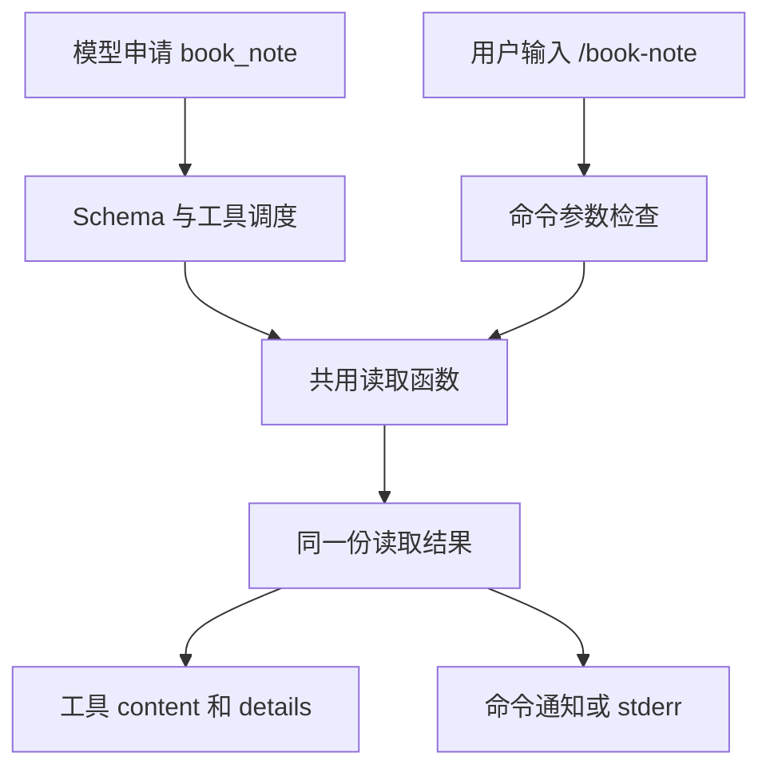

# 增加一个读取工具，再给它一个命令入口

上一篇的命令只显示固定消息。现在我们让扩展读取专门准备的练习文件，同时提供两种入口：模型可以申请使用工具，你也可以直接输入命令。

## 同一件事，为什么需要两种入口？

“请读取笔记后帮我总结”需要模型判断何时取得材料；“现在直接显示笔记”则已经由用户决定了动作。前者适合工具，后者适合命令。底下可以是同一个读取函数，入口的调用者和结果去向却不同。

工具经过模型选择、结构化参数和工具调度，结果会成为后续模型分析的材料；直接命令由 Pi 派发给 Handler，可以只显示本地结果，不进入模型循环。把一个函数登记为两种入口，不等于一次调用会自动走两遍。

### 工具定义是怎样连接语言与程序的？

模型需要知道“这个工具适合何时用”，程序需要知道“传进来什么形状的数据”。因此 `description` 说明用途，Schema 说明参数结构，`execute` 实现实际动作。它们不是重复文档，而是分别服务于选择、校验和执行。

只写执行函数，模型未必知道有这项能力；只写漂亮描述，没有执行函数也不能读取文件。注册把两面连接起来，启用则决定本次请求是否向模型提供这项能力。

当工具很多时，还可以先注册而暂不启用，等任务需要时再开放。动态加载工具的价值是减少无关工具说明，而不是给模型凭空增加系统权限；工具实际能访问什么仍由执行代码和系统边界决定。

### 为什么模型内容和程序细节分开返回？

假设笔记有两行，读取程序还知道原始字符数和是否截断。模型主要需要笔记文字及截断提示，界面可能需要显示字符数。`content` 与 `details` 让这两类消费者各取所需，不必把所有内部信息都塞进模型正文。

`details` 仍可能写入 Session，所以不能当成秘密存储区。`renderResult` 再把结果变成界面组件；改变渲染不会改变已经执行的文件读取，也不会自动改变交给模型的内容。

### 为什么要共用读取函数，却保留各自入口检查？

读取路径、输出截断和读取错误是共同业务，可以集中在一个函数里。工具参数与命令参数的形式不同，仍要在各自入口适配。这样既避免维护两份读取逻辑，也不会误以为命令天然经过工具的全部门禁。

下面先沿入口与结果关系看清这份合同，再读完整代码。代码只处理自己准备的小文件；后面的正式检查工具用于说明更严格文件边界为何还需要额外机制。

## 1. 先确定最小合同

本篇只读取当前练习目录的 `notes.txt`，内容只放两三行虚构文字。返回最多 2000 个 JavaScript 字符单位，超出时明确提示截断；不写入、不执行 Shell、不跟随文本中的链接。

**固定文件名不是文件系统隔离。** 下面的入门代码仍可能跟随符号链接，读取时也没有先建立有界文件对象合同，只适用于自己创建的普通小文件。后面会解释仓库正式检查工具如何处理这些边界。

## 2. 两条入口在什么地方汇合？



命令 Handler 不是工具 Executor，不会自动生成 Tool Result；直接命令也不等于绕过所有权限，它仍由扩展代码决定执行什么。

空闲命令里 `ctx.signal` 可能没有值，不能宣称 `Esc` 一定自动取消该命令里的所有异步操作。

## 3. 逐项读懂工具定义

| 字段 | 作用 |
|---|---|
| `name` | 模型申请工具时使用的标识 |
| `label` | 界面显示名称 |
| `description` | 告诉模型什么时候用、做什么、有什么限制 |
| `parameters` | 输入结构的 Schema；本例无参数 |
| `execute` | 真正执行本地工作的函数 |
| `content` | 交回模型的文字或图片内容 |
| `details` | 供程序、状态和界面使用的结构化细节 |

TypeBox 用 JavaScript 对象表达 Schema。工具有参数时，可以使用 `Type.String`、`Type.Integer`、`Type.Object` 等定义类型和约束；Pi 在调用入口校验，不应只让模型“保证格式正确”。

`execute` 还会收到调用 ID、取消信号和可选 `onUpdate`。更新只是进度，最终返回值才是这次执行结果；抛异常才表示执行失败。

## 4. 模型结果与界面结果怎么分开？

工具可以额外实现 `renderCall` 和 `renderResult`，返回 TUI Component。它们决定怎样显示，不替代 `execute`，也不能用绿色状态掩盖错误结果。

渲染需要处理“参数还没收齐”“结果仍在更新”“最终错误”“用户展开详情”等状态。普通文本用现有 `Text` 组件，宽度处理交给组件；不要把所有原始 `details` 无界打印。

`details` 可能写进会话，即使不直接作为模型正文也不能放凭据。读取到的不可信文件内容同样只是材料，不应当作用户的新授权。

## 5. 从入门例子走到仓库的检查工具

仓库已有 [inspect-tool.ts](../../.pi/extensions/pi-study-guard/inspect-tool.ts) 和 [inspect-service.ts](../../.pi/extensions/pi-study-guard/inspect-service.ts)，实现 `pi_study_inspect`。它们是代码入口，不要求先读旧教程。

它只接收一个顶层 Markdown 文件名 `file`，根目录固定为执行现场的 `ctx.cwd/docs/learning/`。这个路径是现有实现合同，本次新教程没有偷偷把它改到 `docs/tutorials/`。

相比入门例子，它增加的是实际读取风险对应的边界：

| 问题 | 现有实现怎样处理 |
|---|---|
| `../` 或绝对路径 | 严格文件名与路径合同 |
| 符号链接、硬链接、特殊文件 | 检查打开的文件对象并拒绝不符合对象 |
| 输入过大、取消、读取变化 | 有界分块读取及取消检查，输入上限 128 KiB |
| 把代码围栏里的 `#` 算成标题 | 使用 Markdown Parser Token，不用逐行正则假装解析器 |
| 输出太多 | 返回总数及最多 20 个有界样本 |
| 终端控制字符和超宽字段 | 展示前清洗、截断与安全退化显示 |

其 `/study-inspect` 命令与工具共享服务，仍各自适配输入和输出合同。可检查 [inspect-command.ts](../../.pi/extensions/pi-study-guard/inspect-command.ts) 了解对应关系。

这些模块沿用原实验的锁定依赖；新入门代码使用 Pi `0.85.1`。不应仅因 API 名相似就宣称旧模块已经升级或完全兼容。

## 6. 准备文件

在新练习目录用编辑器创建 `notes.txt`：

```text
小书架只在本机保存读书记录。
练习状态：待整理。
```

新建 `.pi/extensions/book-note.ts`：

```typescript
import { readFile } from 'node:fs/promises';
import { join } from 'node:path';
import { Type } from 'typebox';
import type { ExtensionAPI } from '@earendil-works/pi-coding-agent';

async function loadNote(cwd: string, signal?: AbortSignal) {
  let source: string;
  try {
    source = await readFile(join(cwd, 'notes.txt'), {
      encoding: 'utf8', signal,
    });
  } catch {
    throw new Error(signal?.aborted ? '读取已取消' : '无法读取练习文件');
  }
  signal?.throwIfAborted();
  const truncated = source.length > 2000;
  return {
    text: source.slice(0, 2000) + (truncated ? '\n[内容已截断]' : ''),
    characters: source.length,
    truncated,
  };
}

export default function (pi: ExtensionAPI) {
  pi.registerTool({
    name: 'book_note',
    label: '小书架笔记',
    description: '读取练习目录 notes.txt，返回最多 2000 个字符单位，不修改文件。',
    parameters: Type.Object({}),
    async execute(_id, _params, signal, _onUpdate, ctx) {
      const result = await loadNote(ctx.cwd, signal);
      return {
        content: [{ type: 'text', text: result.text }],
        details: {
          characters: result.characters,
          truncated: result.truncated,
        },
      };
    },
  });

  pi.registerCommand('book-note', {
    description: '直接读取小书架练习笔记',
    handler: async (args, ctx) => {
      if (args.trim()) throw new Error('book-note 不接受参数');
      const result = await loadNote(ctx.cwd, ctx.signal);
      if (ctx.hasUI) ctx.ui.notify(result.text, 'info');
      else process.stderr.write(result.text + '\n');
    },
  });
}
```

两种入口共用 `loadNote`，因此不会各自维护一套读取逻辑。它接收目录和信号，不直接依赖 UI，便于离线测试。

## 7. 先测试命令，再测试模型选择工具

使用 14 的受控启动方式，将 `-e` 指向 `book-note.ts`。保留 `--no-tools` 时，输入 `/book-note` 仍能由命令入口执行本地读取；工具集合不会自动封禁扩展命令。

应看到文件中的两行文字。输入 `/book-note extra` 应被拒绝；把练习文件临时改名，应明确失败。恢复文件后再观察成功，不要让失败变成“空内容成功”。

如果单独授权模型任务，将 `--no-tools` 改成 `--tools book_note`，请求“使用 book_note 读取练习笔记并复述状态”。检查工具申请、实际返回和回答三处是否对应。一次命令成功不能证明模型会选择工具。

## 8. 一分钟回忆

> **工具由模型申请，命令由用户直接调用；共用业务函数，分别遵守入口、错误和输出合同。**

上一篇：[第一个扩展与生命周期](14-第一个扩展与生命周期.md)。下一篇：[危险命令审批与状态保存](16-危险命令审批与状态保存.md)。
