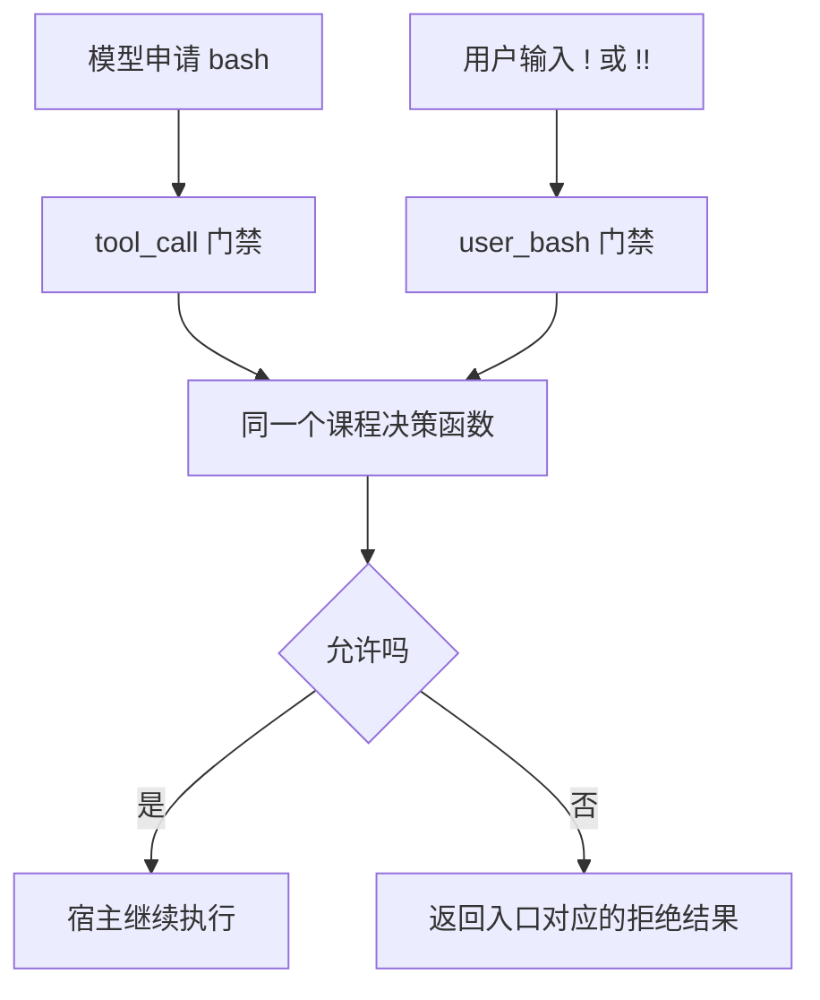

# 在执行前拦截命令，把状态留在当前路线

一句“不要执行危险命令”是行为要求。要让扩展实际拒绝某次执行，需要接住正确入口，并返回宿主认识的拒绝结果。

## 1. 先把两条 Shell 入口画出来



模型工具的拒绝是 `{ block: true }`；用户 Shell 需要返回替代的 `result`。`!!` 只是排除后续模型上下文，不会跳过命令执行或门禁。

## 2. 不先解决任意 Shell 安全问题

Shell 有变量、引用、管道、脚本和子进程。靠寻找 `rm` 或几个危险词，无法判定所有命令是否安全。

本篇采用一个明确的教学合同：一条固定文本输出可直接放行，另一条固定文本输出需要确认，其他命令一律拒绝。两条练习命令本身都不写文件，目的是观察审批流程。

它不是通用安全产品，也不拦截其他工具、扩展直接启动的进程、后续扩展改写参数或配置中的命令前缀。

## 3. 一个可离线测试的双入口门禁

在练习项目创建 `.pi/extensions/study-gate.ts`：

```typescript
import type {
  ExtensionAPI, ExtensionContext,
} from '@earendil-works/pi-coding-agent';

export const SAFE = "printf 'BOOK-SAFE\\n'";
export const ASK = "printf 'BOOK-APPROVED\\n'";

async function allowed(command: unknown, ctx: ExtensionContext) {
  try {
    if (ctx.signal?.aborted) return false;
    if (command === SAFE) return true;
    if (command !== ASK || ctx.mode !== 'tui' || !ctx.hasUI) return false;
    const yes = await ctx.ui.confirm(
      '课程命令审批', '允许这一次固定文本输出吗？',
      { timeout: 10000, signal: ctx.signal },
    );
    return yes === true && !ctx.signal?.aborted;
  } catch {
    return false;
  }
}

export default function (pi: ExtensionAPI) {
  pi.on('tool_call', async (event, ctx) => {
    if (event.toolName !== 'bash') return;
    if (!(await allowed(event.input.command, ctx))) {
      return { block: true, reason: '课程 Shell 请求已拒绝' };
    }
  });

  pi.on('user_bash', async (event, ctx) => {
    if (!(await allowed(event.command, ctx))) {
      return {
        result: {
          output: '课程 Shell 请求已拒绝\n',
          exitCode: 126,
          cancelled: false,
          truncated: false,
        },
      };
    }
  });
}
```

这里的 `catch` 不负责隐藏业务失败，而是把审批系统自身的失败收敛成拒绝。尤其不能只让 `user_bash` 抛错，然后假定宿主一定不会继续执行。

确认后还检查一次取消信号，是为了覆盖用户等待期间发生取消的情况。RPC 虽然 `hasUI=true`，但本例明确只接受本机 TUI 审批，不能把外部协议提示当作已经有人在本机确认。

## 4. 怎么观察它？

先按下一篇的离线测试核对返回值，不执行任何 Shell。

真实界面观察时，只在新练习目录加载这一个门禁，检查没有其他扩展或 Shell 前缀改写行为，再用 `!` 输入代码里完全相同的固定命令。

| 输入 | 预期 |
|---|---|
| SAFE 对应命令 | 输出 `BOOK-SAFE` |
| ASK，对话框选择否或取消 | 拒绝，不应出现 `BOOK-APPROVED` 的执行输出 |
| ASK，明确选择是 | 本次放行 |
| 拼接其他命令、额外空格或任意其他字符串 | 拒绝 |

不要在界面测试中使用真正删除、提权或部署命令。模型入口则另外需要授权模型请求，不能用用户入口成功代替。

## 5. 为什么状态要跟随当前分支？

你想在界面显示“这条路线登记过几次检查”。如果只把计数留在变量中，重载就丢失；如果恢复时统计整个会话树，方案 A 的计数又会混到方案 B。

正确思路是：把自有状态写入 Session 的 Custom Entry，恢复时只读当前 `getBranch()`，从根到叶重放。

下面是独立的状态演示，不把“登记次数”伪装成真实执行次数，也不让它参与安全决策。创建 `.pi/extensions/book-count.ts`：

```typescript
import type {
  ExtensionAPI, ExtensionContext,
} from '@earendil-works/pi-coding-agent';

export default function (pi: ExtensionAPI) {
  const key = 'book-study.count';
  let count = 0;

  function show(ctx: ExtensionContext, value?: number) {
    if (ctx.mode !== 'tui') return;
    ctx.ui.setWidget(key, value === undefined
      ? undefined : [`当前路线登记检查：${value} 次`]);
  }

  function restore(ctx: ExtensionContext) {
    count = 0;
    show(ctx);
    for (const entry of ctx.sessionManager.getBranch()) {
      if (entry.type !== 'custom' || entry.customType !== key) continue;
      const value = (entry.data as { count?: unknown })?.count;
      if (typeof value !== 'number' || !Number.isSafeInteger(value) || value < 0) {
        throw new Error('检查计数记录无效');
      }
      count = value;
    }
    show(ctx, count);
  }

  pi.on('session_start', (_event, ctx) => restore(ctx));
  pi.on('session_tree', (_event, ctx) => restore(ctx));
  pi.on('session_shutdown', (_event, ctx) => {
    count = 0;
    show(ctx);
  });
  pi.registerCommand('book-mark', {
    description: '在当前路线登记一次人工检查',
    handler: async (_args, ctx) => {
      if (!ctx.isIdle()) throw new Error('请等当前任务结束');
      const next = count + 1;
      if (!Number.isSafeInteger(next)) throw new Error('检查计数已超出范围');
      pi.appendEntry(key, { count: next });
      count = next;
      show(ctx, count);
    },
  });
}
```

`appendEntry` 不会把这些状态直接当作模型消息。它返回也不等于磁盘已经完成可靠写入；`--no-session` 下更没有跨进程持久化保证。

## 6. Widget 显示什么，不显示什么？

Widget 是输入框附近的一小块扩展信息。用固定 key 原位更新，而不是每次增加一个新组件；退出时传 `undefined` 清除。

状态来源只有 Session 中的自有计数。不能根据界面已显示一个数字就推断检查真正发生，也不能把审批放行次数当成命令执行成功次数。

前面正式仓库的 Shell 状态还区分允许、拒绝及原因，并使用完整快照恢复。可从 [shell-state.ts](../../.pi/extensions/pi-study-guard/shell-state.ts) 和 [shell-widget.ts](../../.pi/extensions/pi-study-guard/shell-widget.ts) 看实现，但不要把这些课程特定状态机械推广成新的通用规则平台。

## 7. 一分钟回忆

> **门禁在动作前决定能否继续；记录保存发生过的决策，Widget 只负责显示，三者都不是操作系统沙箱。**

代码按 Pi `0.85.1` 编写，Shell 合同仅针对 macOS/Bash 两条固定课程命令。Windows PowerShell、其他扩展组合、真实进程停止和系统隔离不在这个例子的保证范围内。

上一篇：[自定义工具与命令](15-自定义工具与命令.md)。下一篇：[扩展测试与资源清理](17-扩展测试与资源清理.md)。
