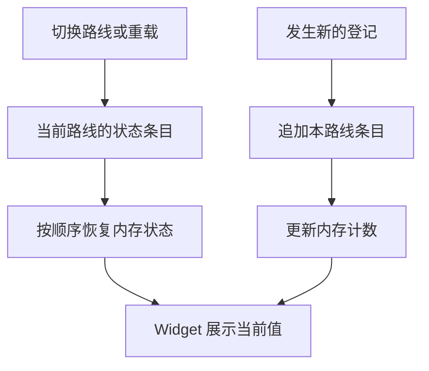
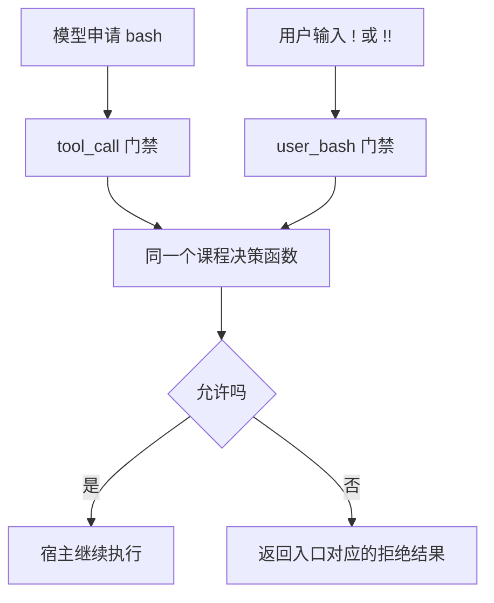

# 17 危险命令审批与状态保存

## 在执行前拦截命令，把状态留在当前路线

一句“不要执行危险命令”是行为要求。要让扩展实际拒绝某次执行，需要接住正确入口，并返回宿主认识的拒绝结果。

## 审批、执行与记录为什么不能共用一个“成功”？

想象工具请求运行测试，你先确认允许。此时只是**批准了这次请求**：程序还可能找不到测试文件、执行失败或被取消。只有看完实际执行结果，才能讨论测试是否通过。

门禁负责执行前的决定，工具负责实际操作，状态记录负责留下决定或结果，Widget 负责显示它们。四者如果混成一个 `success`，界面可能在用户点“是”后就显示完成，甚至把一次批准误当成以后都可以执行。

### 为什么只拦模型的 bash 仍然不够？

模型工具和用户 `!` 都能进入 Shell，却不经过同一入口。只在 `tool_call` 处理，用户直接输入命令时这段检查可能根本不运行。门禁是否完整，取决于实际动作有几条入口，而不取决于弹窗看起来多严格。

本例让两种入口共用决策函数，再各自返回宿主认可的拒绝格式。它仍然没有包住扩展任意启动的进程，更没有改变操作系统权限。所以它只承诺覆盖明确的两条课程入口，不承诺识别所有危险 Shell 行为。

### 没有确认结果时，为什么不能默认通过？

无界面、超时、取消或审批代码异常，都不等于用户明确同意。对于需要确认的操作，本例把这些情况解释为拒绝。这样审批系统自身出问题时，不会反而扩大执行范围。

确认期间还可能发生取消：界面返回“是”和任务仍允许继续，是两个时间条件。执行前需要尊重当前取消状态，不能把旧决定当作现在仍然有效。这里保存的是一次决策，而不是无限期授权。

### 状态应该属于整个进程，还是当前路线？

假设路线 A 登记过两次检查，你回到共同起点走路线 B，只登记一次。一个进程全局计数器会显示 3，但那不是路线 B 的经历。若只用内存变量，重载后又可能变成 0。

Session 提供按路线保存和恢复的基础：把自有状态写成条目，再沿当前分支重放。**重放**是根据已记录数据重建内存状态，不是重新执行历史命令。重放审批记录尤其不能再次放行旧请求或重做副作用。



下面将门禁和状态分别演示。登记次数仅表示人工登记，不冒充执行次数，也不用于决定下一条命令是否安全。

## 1. 先把两条 Shell 入口画出来



模型工具的拒绝是 `{ block: true }`；用户 Shell 需要返回替代的 `result`。`!!` 只是排除后续模型上下文，不会跳过命令执行或门禁。

## 2. 不先解决任意 Shell 安全问题

Shell 有变量、引用、管道、脚本和子进程。靠寻找 `rm` 或几个危险词，无法判定所有命令是否安全。

本篇采用一个明确的教学合同：一条固定文本输出可直接放行，另一条固定文本输出需要确认，其他命令一律拒绝。两条练习命令本身都不写文件，目的是观察审批流程。

它不是通用安全产品，也不拦截其他工具、扩展直接启动的进程、后续扩展改写参数或配置中的命令前缀。

## 3. 为什么状态要跟随当前分支？

自有状态写入 Session 的 Custom Entry，恢复时只读当前 `getBranch()`，从根到叶重放。本例每条记录保存的是当时的计数快照，依次覆盖内存值，最终取当前路线最后一份有效快照。

快照不是增量。先记录 1、再记录 2，表示后来总数为 2，不应相加得到 3。新的人工登记则先追加新快照，再更新内存和 Widget；不必为每次登记重新执行整条历史恢复流程。

沿第 11 篇的分支方式，把共同节点之后的状态变化逐步展开。这里把状态条目简写为 `A1`、`A2`、`B1`，数字是保存的 `count`：

| 操作 | 当前路线能经过的自有状态 | 恢复后的数字 |
|---|---|---|
| 共同节点尚未登记 | 无 | 0 |
| A 路线登记一次 | `A1={count:1}` | 1 |
| A 路线再登记一次 | `A1={count:1} → A2={count:2}` | 2 |
| 回共同节点开始 B，登记一次 | `B1={count:1}` | 1 |
| 再回 A2 | `A1={count:1} → A2={count:2}` | 2 |
| 留在 B1 后重载扩展 | 新实例从 0 开始，只重放 B1 | 1 |

整份文件可以同时含 A1、A2、B1，`getBranch()` 却只返回当前父指针路线。如果共同节点之前已经有快照，两条路线都会继承它。本例把共同起点设为 0，只为看清分叉后的差异。

用 `getEntries()` 取全树再累计会同时犯两个错误：混合兄弟路线，并把累计快照当成增量。恢复函数只根据条目重建数字，不再次调用 `/book-mark`，不执行旧命令，也不把旧审批当成新的同意。

## 4. Widget 显示什么，不显示什么？

Widget 是输入框附近的一小块扩展信息。用固定 key 原位更新，而不是每次增加一个新组件；退出时传 `undefined` 清除。

状态来源只有 Session 中的自有计数。不能根据界面已显示一个数字就推断检查真正发生，也不能把审批放行次数当成命令执行成功次数。

仓库已有的 Shell 状态还区分允许、拒绝及原因，并使用完整快照恢复。可从 [shell-state.ts](../../.pi/extensions/pi-study-guard/shell-state.ts) 和 [shell-widget.ts](../../.pi/extensions/pi-study-guard/shell-widget.ts) 看实现，但不要把这些课程特定状态机械推广成新的通用规则平台。

## 5. 一个可离线测试的双入口门禁

在练习项目创建 `.pi/extensions/study-gate.ts`：

```typescript
import type {
  ExtensionAPI, ExtensionContext,
} from '@earendil-works/pi-coding-agent';

export const SAFE = "printf 'BOOK-SAFE\\n'";
export const ASK = "printf 'BOOK-APPROVED\\n'";

async function allowed(command: unknown, ctx: ExtensionContext) {
  try {
    if (ctx.signal?.aborted) return false;
    if (command === SAFE) return true;
    if (command !== ASK || ctx.mode !== 'tui' || !ctx.hasUI) return false;
    const yes = await ctx.ui.confirm(
      '课程命令审批', '允许这一次固定文本输出吗？',
      { timeout: 10000, signal: ctx.signal },
    );
    return yes === true && !ctx.signal?.aborted;
  } catch {
    return false;
  }
}

export default function (pi: ExtensionAPI) {
  pi.on('tool_call', async (event, ctx) => {
    if (event.toolName !== 'bash') return;
    if (!(await allowed(event.input.command, ctx))) {
      return { block: true, reason: '课程 Shell 请求已拒绝' };
    }
  });

  pi.on('user_bash', async (event, ctx) => {
    if (!(await allowed(event.command, ctx))) {
      return {
        result: {
          output: '课程 Shell 请求已拒绝\n',
          exitCode: 126,
          cancelled: false,
          truncated: false,
        },
      };
    }
  });
}
```

这里的 `catch` 不负责隐藏业务失败，而是把审批系统自身的失败收敛成拒绝。尤其不能只让 `user_bash` 抛错，然后假定宿主一定不会继续执行。

确认后还检查一次取消信号，是为了覆盖用户等待期间发生取消的情况。RPC 虽然 `hasUI=true`，但本例明确只接受本机 TUI 审批，不能把外部协议提示当作已经有人在本机确认。

## 6. 怎么观察它？

先按下一篇的离线测试核对返回值，不执行任何 Shell。

真实界面观察时，只在新练习目录加载这一个门禁，检查没有其他扩展或 Shell 前缀改写行为，再用 `!` 输入代码里完全相同的固定命令。

| 输入 | 预期 |
|---|---|
| SAFE 对应命令 | 输出 `BOOK-SAFE` |
| ASK，对话框选择否或取消 | 拒绝，不应出现 `BOOK-APPROVED` 的执行输出 |
| ASK，明确选择是 | 本次放行 |
| 拼接其他命令、额外空格或任意其他字符串 | 拒绝 |

不要在界面测试中使用真正删除、提权或部署命令。模型入口则另外需要授权模型请求，不能用用户入口成功代替。

## 7. 用代码观察状态重放

下面是独立的状态演示，不把“登记次数”伪装成真实执行次数，也不让它参与安全决策。创建 `.pi/extensions/book-count.ts`：

```typescript
import type {
  ExtensionAPI, ExtensionContext,
} from '@earendil-works/pi-coding-agent';

export default function (pi: ExtensionAPI) {
  const key = 'book-study.count';
  let count = 0;

  function show(ctx: ExtensionContext, value?: number) {
    if (ctx.mode !== 'tui') return;
    ctx.ui.setWidget(key, value === undefined
      ? undefined : [`当前路线登记检查：${value} 次`]);
  }

  function restore(ctx: ExtensionContext) {
    count = 0;
    show(ctx);
    for (const entry of ctx.sessionManager.getBranch()) {
      if (entry.type !== 'custom' || entry.customType !== key) continue;
      const value = (entry.data as { count?: unknown })?.count;
      if (typeof value !== 'number' || !Number.isSafeInteger(value) || value < 0) {
        throw new Error('检查计数记录无效');
      }
      count = value;
    }
    show(ctx, count);
  }

  pi.on('session_start', (_event, ctx) => restore(ctx));
  pi.on('session_tree', (_event, ctx) => restore(ctx));
  pi.on('session_shutdown', (_event, ctx) => {
    count = 0;
    show(ctx);
  });
  pi.registerCommand('book-mark', {
    description: '在当前路线登记一次人工检查',
    handler: async (_args, ctx) => {
      if (!ctx.isIdle()) throw new Error('请等当前任务结束');
      const next = count + 1;
      if (!Number.isSafeInteger(next)) throw new Error('检查计数已超出范围');
      pi.appendEntry(key, { count: next });
      count = next;
      show(ctx, count);
    },
  });
}
```

`appendEntry` 不会把这些状态直接当作模型消息。它返回也不等于磁盘已经完成可靠写入；`--no-session` 下更没有跨进程持久化保证。

## 8. 一分钟回忆

> **门禁在动作前决定能否继续；记录保存发生过的决策，Widget 只负责显示，三者都不是操作系统沙箱。**

代码按 Pi `0.85.1` 编写，Shell 合同仅针对 macOS/Bash 两条固定课程命令。Windows PowerShell、其他扩展组合、真实进程停止和系统隔离不在这个例子的保证范围内。

上一篇：[自定义工具与命令](16-自定义工具与命令.md)。下一篇：[扩展测试与资源清理](18-扩展测试与资源清理.md)。
