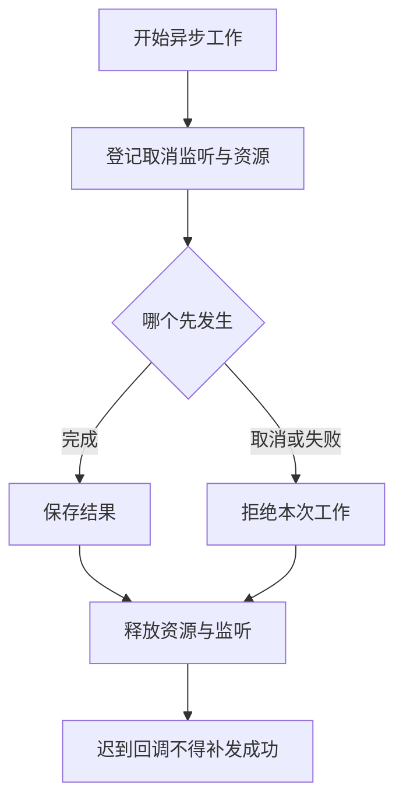

# 18 扩展测试与资源清理

## 扩展能加载之后，还要验证哪些事情？

扩展启动时没有报错，只能说明加载到了某一步。要确认门禁真的拒绝了错误输入、取消后不会补发成功、重载后没有旧回调，需要把验证拆开。

## 为什么扩展需要按“活着的过程”来理解？

一个纯计算函数通常输入一次、返回一次。扩展可能注册监听器、等待用户、启动定时器，随后经历取消或重载。即使某次返回值正确，这些长期存在的工作也可能在错误时间再次触发。

因此除了算法，还要看**生命周期**：资源什么时候开始存在、归谁负责、什么时候不再允许工作。比如旧会话启动的异步读取，在切换会话后才返回，就不能继续把结果写进新会话的状态。

### 取消信号为什么要一直传下去？

Pi 收到取消后，可以通知扩展不再继续，但正在等待文件或网络的函数只有收到并响应信号，才可能尽快停止。只在最外层显示“已取消”，不会让底层 Promise 自动消失。

Promise 表示“以后会完成的一项工作”。给等待它的代码设置超时，可以让等待者先返回，却不一定终止实际工作。取消要传给支持它的下游；结束以后还要释放监听与定时器，避免迟到的完成回调又补发成功。

### 谁创建资源，谁负责结束它？

在命令中创建的临时资源，通常随该命令结束；在会话开始创建的资源，通常随会话 shutdown 结束。这个归属让你能回答“这一个定时器为什么还活着”，不必依赖程序退出时碰运气。

清理应当幂等，即重复调用不会重复关闭出错。取消、失败和退出可能相继触发，多个路径都需要安全地到达同一个清理结果。幂等清理不等于把所有异常吞掉，失败原因仍应保留。

### Fake 为什么有用，又为什么不能代替真实宿主？

把确认框替换成固定返回“否”的函数，就能稳定检查门禁如何处理拒绝。这种测试替身排除了网络与人工时机，适合验证确定的逻辑。但是它不证明真实 Pi 在正确位置调用了这个回调。

所以测试沿职责分层：先验证函数结果，再验证宿主如何接入，最后针对必要场景观察真实模型或界面。每层补前一层无法证明的事情，而不是把同一个成功结果重复跑许多遍。

并发也应按实际风险理解：两个工具同时读取同一旧文件并各自写回，会发生覆盖。需要参与同一文件修改队列的是整段“读取、计算、写入”，不只是最后一行写操作。这个进程内协调仍不是跨进程锁或操作系统隔离；只读入门示例没有因此自动获得写入能力。

## 1. 三层证据各自负责什么？

| 层次 | 例子 | 不能推出什么 |
|---|---|---|
| 纯函数或 Fake API 测试 | 拒绝返回值、状态重放、输入分类 | 真实 Pi 已派发对应事件 |
| 真实宿主离线测试 | 扩展发现、Schema、Runner、内存 Session | Provider 一定选择工具、TUI 实际画面正确 |
| 受控真实任务 | 固定模型的工具往返、实际按键和输出 | 所有模型、系统或任意输入都安全 |

先让前两层覆盖正常和失败，再决定哪些实际行为值得单独授权验证。无需为每个边界重复付费请求模型。

## 2. 取消是协作，不是强制消失

异步函数要把 `AbortSignal` 传给支持它的文件、网络或子进程接口。在等待前检查取消，并在回调竞争的交界处重新判断是否还能返回成功。



应检查 Timer、事件监听、文件句柄、子进程和订阅是否释放。给一个 Promise 增加超时，只能停止等待；底层工作如果不响应信号，仍可能继续。

不要将所有异常都捕获后返回“取消了”。业务失败、取消和超时需要保留各自的事实，至少能支持正确收尾与排查。

## 3. 重载后为什么旧代码还可能继续？

`await ctx.reload()` 触发旧实例 shutdown 和新资源加载，但调用它的那段命令函数仍在旧栈帧中继续执行。

最小安全用法是重载后立即 `return`。不要继续调用旧 `pi`、旧 `ctx` 或先前捕获的 SessionManager。切换会话时同理，使用替换会话回调提供的新上下文。

初始化以注册和必要的有界准备为主；持续运行的后台资源在会话开始或首次使用时创建。关闭逻辑要幂等，也就是调用两次不会重复释放出错。

## 4. 一张生命周期验证表

| 场景 | 应观察的结果 |
|---|---|
| 第一次加载 | 能力只注册一次，没有后台残留 |
| 工具失败 | 错误 Tool Result，不能显示为成功 |
| 审批否、Esc、超时、异常 | 都不能进入被拒绝的执行路径 |
| `/reload` | 旧实例清理，新实例恢复，旧回调不补写 |
| `/new`、Resume、Fork | 状态归属正确，不串到别的会话 |
| Tree 切换 | 只重放当前路线 |
| 正常退出、SIGTERM | 进入受支持的清理路径 |
| SIGKILL、断电 | 不保证回调执行，不能伪称优雅清理通过 |

在日志中只记录必要事件名和脱敏状态，避免原始 Prompt、命令、工具结果、路径或认证。错误信息也可能包含这些内容。

## 5. 读取与状态需要验证什么？

读取工具至少覆盖：普通小文件、缺失文件、取消信号、超长输出，以及返回的 `content` 和 `details` 是否一致。

正式有路径限制的工具，还要用真实临时文件验证符号链接、硬链接、特殊文件、大小和读取过程中对象变化，而不能只 Mock 一个永远成功的 `readFile`。

状态测试要构造两条路线：A 登记两次，切到共同起点后 B 登记一次；重放 A 得到 2，重放 B 得到 1。使用 `getEntries()` 把整个树加起来得到 3，是一个能被这个对照抓到的错误。

同时确认 Custom Entry 不出现在模型消息里，Widget 只显示当前路线，恢复失败时不留旧画面。内存 Session 的成功不能证明 JSONL 跨进程恢复。

## 6. 用 Node 测试上一篇的门禁

将上一篇的 `study-gate.ts` 放在测试目录，并创建 `study-gate.test.mjs`。这里使用 Node `>=22.19.0` 的 TypeScript 类型擦除能力；门禁只有类型导入，没有需要另外安装的运行依赖。

```javascript
import test from 'node:test';
import assert from 'node:assert/strict';
import gate, { SAFE, ASK } from './study-gate.ts';

const handlers = new Map();
gate({ on: (name, handler) => handlers.set(name, handler) });

function context(mode = 'tui', confirm = async () => false, signal) {
  return { mode, hasUI: mode === 'tui' || mode === 'rpc', signal, ui: { confirm } };
}
async function both(command, ctx) {
  return [
    await handlers.get('tool_call')({ toolName: 'bash', input: { command } }, ctx),
    await handlers.get('user_bash')({ command, excludeFromContext: true }, ctx),
  ];
}
function denied(results) {
  assert.equal(results[0].block, true);
  assert.equal(results[1].result.exitCode, 126);
}

test('固定 SAFE 在两条入口放行', async () => {
  assert.deepEqual(await both(SAFE, context()), [undefined, undefined]);
});
test('未知字符串在两条入口拒绝', async () => {
  denied(await both(SAFE + ' extra', context()));
});
test('审批明确为否则拒绝', async () => {
  denied(await both(ASK, context()));
});
test('本机 TUI 明确为是才放行', async () => {
  assert.deepEqual(await both(ASK, context('tui', async () => true)), [undefined, undefined]);
});
test('Print、JSON、RPC 均不接受本机审批', async () => {
  for (const mode of ['print', 'json', 'rpc']) {
    denied(await both(ASK, context(mode, async () => true)));
  }
});
test('已取消时 SAFE 也拒绝', async () => {
  denied(await both(SAFE, context('tui', undefined, AbortSignal.abort())));
});
test('等待审批期间取消不能放行', async () => {
  const controller = new AbortController();
  const ctx = context('tui', async () => {
    controller.abort();
    return true;
  }, controller.signal);
  denied(await both(ASK, ctx));
});
test('审批异常必须返回拒绝', async () => {
  denied(await both(ASK, context('tui', async () => { throw new Error('fixture'); })));
});
```

运行：

```bash
node --test study-gate.test.mjs
```

预期 8 项测试通过。测试只调用你登记的 Handler，不调用真实 Shell，不启动 Pi，也不访问模型。它证明的是返回合同，不是假装已经观察过执行器。

## 7. 复用仓库测试时注意版本

现有扩展测试目录是 [test](../../.pi/extensions/pi-study-guard/test)。先读对应 Manifest 和锁文件，使用已有依赖执行类型检查与测试；不要直接把全局 Pi 版本当成它的依赖版本。

离线测试使用新的临时 HOME、AgentDir 和无真实凭据的环境。Fake Provider 不等于默认认证存储不会读取磁盘，两条边界必须分别控制。

## 8. 一分钟回忆

> **测试的不只是成功返回，还包括拒绝、取消、重载、状态归属和清理；Fake、真实宿主和真实模型的证据不能互换。**

本篇门禁测试针对 17 的 Pi `0.85.1` 示例，不升级仓库原扩展，也不宣称已验证所有进程和终端行为。

上一篇：[危险命令审批与状态保存](17-危险命令审批与状态保存.md)。下一篇：[打包安装与资源管理](19-打包安装与资源管理.md)。
