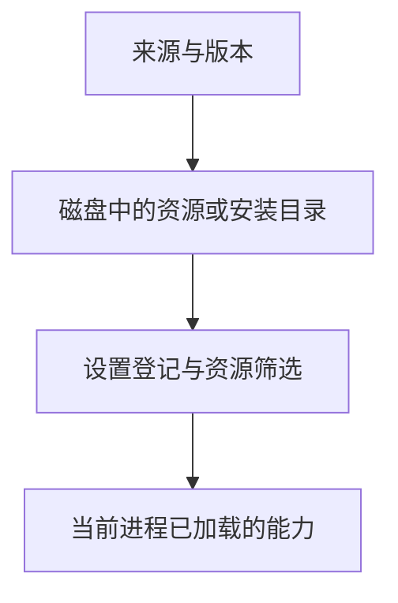

# 19 打包安装与资源管理

## 把模板、Skill、主题和扩展装进一个包

你已经有了四种定制资源。想在另一个练习项目里复用，不必把每个文件散落复制到全局目录；可以把它们组成一个 Pi Package。

## Package 解决的是“怎样交付同一套能力”

假设扩展调用了一个辅助模块，主题又用了一个独立 JSON。你只把入口文件发给同事，本机能用的功能在对方那里就可能缺依赖。散落复制还很难说明到底用了哪个版本、哪些资源已经启用。

Package 把资源、入口声明和必要依赖放进一个可分发单位。使用者可以按来源与版本安装，再选择其中需要的资源。它不负责模型推理，也不是一份已经启动的 Agent；包里有什么资源，加载后才会产生对应能力。

### 为什么同时有 npm 清单和 Pi 清单？

`package.json` 同时服务于不同消费者。npm 需要知道包叫什么、版本是什么、哪些文件进入制品、需要安装什么依赖；Pi 需要知道哪些文件是扩展、Skill、模板和主题。

所以 `files` 与 `pi` 两份声明并不重复。前者控制交付哪些文件，后者控制 Pi 怎样发现资源。如果 Pi 声明指向了未进入制品的文件，源码目录可以运行，安装后的包却不完整。**制品**就是别人实际拿到的包内容，而不是作者电脑上看起来齐全的目录。

### 开发依赖、运行依赖和宿主依赖有什么区别？

编译器或测试库主要帮助作者开发，运行资源需要的普通库必须让使用者也能得到，Pi 自己提供的宿主 API 则按 peer 约定使用。把运行库只放在开发依赖中，容易出现“开发机成功，安装后找不到模块”。

peer 声明表达“需要由外部宿主提供这个包”，不意味着任意版本都已经兼容。精确版本、锁文件和实际测试分别描述不同层的事实；只写一个宽版本范围，不是兼容性证据。

### 安装、启用和运行为什么不是一步？

远端包通常先取得内容和依赖，再登记来源；本地路径可以只登记引用。随后加载器按作用域、信任与筛选决定哪些资源可用，当前进程再运行扩展或使用模板。

因此禁用一个扩展不一定删除磁盘文件，删除登记也不会回滚此前的操作。安装时的脚本和加载时的扩展代码更是两次不同的执行机会，审查不能只覆盖其中一次。

接下来先看来源、版本和生命周期，再通过最小打包例子核对“声明、制品、加载”是否对得上。

## 1. Package 不是新的运行权限

Package 是资源的分发和加载单位，可以来自 npm、Git 或本机目录。装进包里的扩展仍然执行本地代码，Skill 仍然给模型提供指令，主题仍然定义颜色。

“已发布”“能安装”和“安全可用”是三个不同结论。尤其是扩展和安装过程中的代码，不会因被称为资源包而失去系统权限。

## 2. 三种来源怎么固定？

| 来源示意 | 固定的是什么 | 剩余边界 |
|---|---|---|
| `npm:包名@1.2.3` | 精确包版本 | 仍需核对制品、依赖与完整性 |
| `git:主机/组织/仓库@提交` | 一个 Git 提交 | Tag 名称可能被移动，提交更明确 |
| 本机绝对或相对路径 | 当前路径指向的内容 | 内容随编辑变化，不是版本快照 |

本地路径安装是登记引用，不是复制一份冻结的目录。改了源文件，后续加载也可能改变。

SSH 来源会使用当前用户的 SSH 配置和密钥访问能力。仅仅看到 Git URL 并不构成可以使用真实凭据访问远端的授权。

安装前依次查看来源与固定版本、发布文件清单、`pi` 资源声明、运行依赖、`scripts` 生命周期脚本，以及 Extension 入口会调用的文件/进程/网络能力。`--ignore-scripts` 只能跳过安装脚本，不能阻止扩展加载后执行代码；将 `extensions` 设为 `[]` 也不能倒过来消除安装阶段已发生的动作。

## 3. 禁用、筛选、卸载分别改变什么？



这四层不一定同时变化。修改设置后，当前进程可能还持有旧扩展；磁盘目录存在，也不说明它现在被启用。

用 `pi config` 管理启用状态，默认是全局视图，Tab 切换作用域；`pi config -l` 从项目覆盖视图开始。

资源过滤的基本含义：省略一个类型表示采用该类型允许的资源；`[]` 表示一个也不加载；`!pattern` 排除匹配；`+path`、`-path` 针对精确路径。过滤在 Manifest 的范围之上工作，不是任意加载包外文件的授权。

禁用不等于删除，卸载也不等于撤回已经运行过的代码副作用。本地路径包的源目录更不能假定会随卸载一起删除。

### 用三份扩展文件算一次筛选结果

假设 Manifest 允许 `extensions/read.ts`、`extensions/legacy.ts` 和 `extensions/admin.ts`。包里还放着 `internal/debug.ts`，但它没有被声明为扩展候选。以下是设置对象中 `extensions` 数组的一次独立演算：

```json
["extensions/*.ts", "!extensions/legacy.ts", "+extensions/legacy.ts", "-extensions/admin.ts"]
```

普通 glob 先得到 read、legacy、admin 三个候选；`!` 排除 legacy；精确 `+` 再把 legacy 加回；精确 `-` 最终排除 admin。剩下 read 和 legacy。它是分层计算集合，不是按 Shell 命令逐条执行，也不能靠 `+internal/debug.ts` 越过 Manifest 的候选范围。

省略 `extensions` 则采用这类全部允许候选，写 `[]` 则整类禁用。其他类型独立计算：关闭扩展不会顺便关闭包里的模板或主题。同一个包同时有全局和项目登记时，还要先核对作用域：当前版本通常由项目条目覆盖；项目 `autoload: false` 条目则用作全局登记上的资源差量覆盖。

差量模式下，省略字段或 `[]` 表示“不改变继承结果”，不能套用普通对象“整类关闭”的含义。例如全局已启用 read 和 legacy，项目以 `autoload: false` 配上 `extensions: []`，两者仍继承；明确写 `-extensions/legacy.ts` 才排除 legacy。因此先判断普通项目条目还是差量条目，再解释数组。

### 修改本地包后，为什么当前命令仍是旧行为？

假设源目录中的通知文字从“版本 A”改成“版本 B”。本地路径登记仍指向同一个目录，磁盘已经是 B，但当前进程的 Handler 仍可能来自加载时的 A。重载后旧实例清理、新工厂注册，命令才使用 B；不需要为了这个改变重新下载本地包。

再禁用扩展，检查的是设置中已禁用，以及重载后的命令不再可用，源文件仍可以存在。最后移除登记，要分别核对设置、包管理器拥有的安装内容和下一次发现结果。本地开发源目录不属于待清除的安装副本。这个过程解释了为什么 `pi list`、目录检查和运行观察各自只能证明一层。

## 4. 更新时不要误更新 Pi 本身

Pi `0.85.1` 中：

| 命令 | 主要范围 |
|---|---|
| `pi update` | Pi CLI 本身 |
| `pi update --extensions` | 已登记的包 |
| `pi update --models` | 模型目录 |
| `pi update --all` | Pi、包和相关版本协调 |

固定 npm 版本不会自动跳到新版本；固定 Git ref 不会自动追新 ref，但更新过程可能把托管 clone 重新协调到配置的 ref，并清理其中改动。

因此，不要把包管理器拥有的 Git clone 当作个人开发工作树。需要改包，在单独开发目录修改，再明确改变引用。

卸载练习登记前核对 `pi list` 的来源与作用域，使用 `pi remove -l 来源`，再检查配置和下一次加载结果。不运行整目录删除来代替包管理。

## 5. 建一个最小本地资源包

在原练习项目之外创建 `book-study-resources`，用编辑器将前文已检查的文件放到下面的位置。不要移动仓库里的原材料。

```text
book-study-resources/
  package.json
  extensions/book-hello.ts
  prompts/review-books.md
  skills/books-readonly-review/SKILL.md
  themes/book-study.json
```

`package.json`：

```json
{
  "name": "book-study-resources",
  "version": "0.1.0",
  "private": true,
  "type": "module",
  "keywords": ["pi-package"],
  "files": ["extensions", "prompts", "skills", "themes"],
  "pi": {
    "extensions": ["./extensions/book-hello.ts"],
    "prompts": ["./prompts/review-books.md"],
    "skills": ["./skills/books-readonly-review"],
    "themes": ["./themes/book-study.json"]
  },
  "peerDependencies": {
    "@earendil-works/pi-coding-agent": "*"
  }
}
```

`private: true` 防止意外发布到 npm，不阻止本地打包。`pi` 告诉 Pi 加载哪些资源，`files` 告诉 npm 应把哪些文件收入制品；两份声明必须对上。

本例扩展只使用宿主类型，没有第三方运行依赖。实际需要的第三方运行库放在 `dependencies`，不能只放 `devDependencies`；Pi 提供的宿主包按其 Package 约定声明为 peer，不打包另一套宿主。

如果这个包还要分发另一个 Pi Package，按 Package 规则同时声明 `dependencies` 和 `bundledDependencies`，并核对其资源实际进入制品；开发时使用的编译器、测试库则放 `devDependencies`。锁文件描述一次依赖解析结果，不能代替 tarball 清单。

## 6. 检查实际制品，而不只看目录

先确认目录只有虚构练习资源，没有认证、会话或个人配置。然后在包根目录运行：

```bash
npm pack --ignore-scripts --json
```

它会创建本地 `.tgz` 文件，不是发布。`--ignore-scripts` 跳过生命周期脚本，但不替你审查资源本身。

检查 JSON 报告和 tar 内容：

```bash
tar -tzf book-study-resources-0.1.0.tgz
```

应看到 Manifest 和四类约定资源，不能包含真实配置、测试残留或缺失的运行模块。若扩展引用了同包辅助文件，辅助文件也必须在制品中。

本仓库根 [package.json](../../package.json) 展示了更细的允许列表：现有扩展的辅助模块、Skill 参考文件、模板和主题都被显式列出。本次教程不改它，也不以源码目录完整代替制品完整。

## 7. 在另一个练习项目安装

这一步会写 Pi 设置，只在明确同意的独立练习项目执行。假设资源包与新项目相邻：

```bash
pi install -l ../book-study-resources
pi list
```

`-l` 表示登记到项目 `.pi/settings.json`，不加时通常写全局设置。检查实际来源与作用域，再启动可信项目，验证 `/book-hello`、模板和主题是否出现。

远端 `pi -e npm:...` 虽然是临时试用，也可能下载和安装依赖；“不永久登记”不等于“没有安装和执行”。

本篇按 Pi `0.85.1` 核对。打包不等于安装，安装不等于安全，更新和发布必须分别授权。

进一步验证可按顺序查看[6.1 来源](../../labs/6.1-package-sources/README.md)、[6.2 安装与加载安全](../../labs/6.2-package-security/README.md)、[6.3 制品核对](../../labs/6.3-local-package/README.md)和[6.4 管理](../../labs/6.4-package-management/README.md)。这些 Lab 按 Pi CLI `0.84.2` 保留，不是本篇小书架包的源码副本；先看[实验总入口](../../labs/README.md)选择 CLI 与运行方式。无模型请求仍可能有临时安装、脚本执行和回环服务。

上一篇：[扩展测试与资源清理](18-扩展测试与资源清理.md)。下一篇：[模型接入与认证](20-模型接入与认证.md)。
