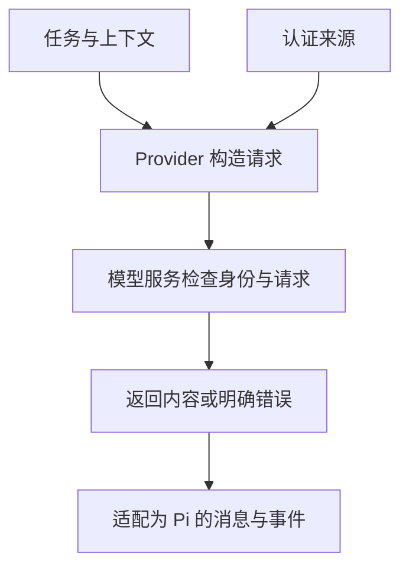
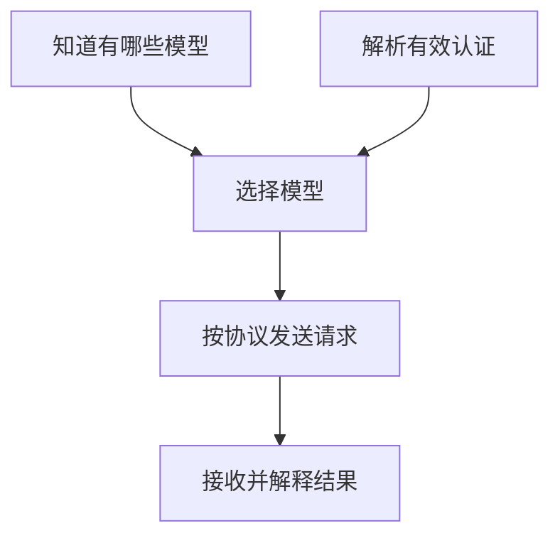

# 20 模型接入与认证

## 选择接入方式，搞清认证从哪里来

你想让小书架任务使用另一个服务。先不要写扩展，也不要复制认证文件。先问两个问题：**Pi 已经认识这个服务吗？它使用什么协议和认证方式？**

## 为什么模型、Provider 和协议不是同一个名字？

模型是处理材料的具体能力，Provider 是 Pi 中接入这项服务的一组行为与配置，协议则约定请求和响应怎样表达。同一模型可能由不同服务提供，不同服务也可能使用相同协议。

例如两个服务都接受 Chat Completions 格式，不代表它们共享账号、模型目录或定价。反过来，同一服务可能提供不止一种接口。因此看到模型名称，仍需要确认“通过谁访问、按什么格式访问、以什么身份访问”。

**API Adapter，协议适配器**负责把 Pi 统一的消息、工具和选项翻译成服务格式，再把服务返回的数据转换回来。Provider 还要处理目录、认证等接入职责，不能把“服务商”和“协议翻译器”混成一个概念。

### 为什么有目录，还要有认证？

目录说明已知模型的名称、能力和容量，类似“有哪些可选项”；认证说明这次请求使用什么身份。目录可以来自内置数据或缓存，因此即使没有实时联网，也可能列出模型。

服务端仍会对具体请求进行授权和额度检查。凭据存在只能说明有一种身份来源，不能证明它尚未过期，也不能证明这个账号能用目录里的全部模型。列表显示与真实请求之间必须保留这层区别。

### 认证应该交给谁，而不是交给谁？

API Key 或 Token 是服务用来识别调用资格的凭据，不是让模型分析问题所需的正文。Pi 的接入代码把它用于请求认证；正常任务材料应只包含解决问题必需的内容，不应为了“让模型连接服务”而把 Key 写进提问。



图中两类输入在接入层汇合，但用途不同：上下文用于生成，凭据用于认证。不是把两者都拼成一段聊天文本。

### OAuth 为什么有登录和刷新两个过程？

OAuth 让用户通过服务支持的授权流程授予客户端访问资格，客户端取得访问令牌，而不是让模型替用户保存登录口令。访问令牌可能有效期较短，刷新机制用于在已有授权允许时取得新令牌，避免每次请求都重新登录。

刷新也会失败，授权也可能被撤销。Pi 保存的状态与服务端实际许可需要按协议衔接，不能把“以前登录过”当作永久权限。下面的来源顺序和到期字段，都是在解决这份身份如何持续有效的问题。

## 1. 三条接入路线

| 需求 | 优先选择 | 需要做什么 |
|---|---|---|
| Pi 已内置支持的服务 | 内置 Provider | 配置授权，选择模型 |
| 已支持协议，但地址或模型不在目录中 | `models.json` | 描述地址、协议、模型与认证来源 |
| 特殊认证、动态目录或非标准响应 | 自定义 Provider 扩展 | 实现对应接口并验证失败与清理 |

不能因为服务叫“OpenAI 兼容”就假定所有字段和流式工具调用都兼容。普通文字请求成功，只验证了能力的一小部分。

把变化放在同一个“小书架代码审查”任务里看：第一次只是从已经可用的模型 A 换到目录中的 B，继续使用内置接入即可。第二次公司要求经过一个新网关，但它完整支持已有协议，这时补地址、模型 ID 和认证来源的配置。第三次网关要求 Pi 尚未支持的登录刷新，并把工具调用放进自己的事件格式，才需要可执行的接入逻辑。

关键是新增了哪项职责。企业 OAuth 如果已经内置支持，就直接复用；Custom Provider 也可以只补特殊认证或动态目录，继续使用内置 API Adapter，不必同时重写文字和工具流。接入选择不是从“内置、配置、扩展”逐级升级的必经路线。

## 2. 认证、目录和请求是三步



目录加载成功不代表认证成功；认证存在不代表账号能用指定模型；拿到 HTTP 响应也不代表流已经完整结束。

Pi 的模型目录可能来自内置数据、远端刷新缓存和本地配置。看到新模型不一定意味着你升级过 Pi；可复现实验要记录具体版本、模型 ID 和目录来源。

## 3. 常见认证方式

| 方式 | 你通常怎样配置 | 主要风险 |
|---|---|---|
| API Key | `/login` 安全输入或环境变量 | 泄露后可能被用来产生费用 |
| OAuth | 登录授权、Token 自动刷新 | 授权范围、过期、刷新和撤销 |
| 云环境身份 | 云 SDK 的环境、角色或本地认证 | 可能隐式读取现有云凭据 |
| 本地无 Key 服务 | 按协议需要提供占位值，或由原生 Provider 明确免凭据 | 不代表服务监听地址或其他进程安全 |

订阅登录不必然等于免费，也不保证第三方客户端使用方式和官方应用同价。真实费用规则以服务商当前政策为准。

认证保存在默认 `~/.pi/agent/auth.json`，创建权限通常为 `0600`。检查存在和权限即可，不把完整内容读进聊天、截图或 Git。

## 4. OAuth 的三个值有什么区别？

Access Token 用于当前请求；Refresh Token 用于换取新访问令牌；`expires` 表示到期时间。Pi 接口中的到期时间通常是毫秒时间戳，服务返回的 `expires_in` 常是秒数，适配时必须转换。

授权流程应验证回调对应当前登录请求，并按协议使用 PKCE、state 等机制，不能把“拿到一个字符串”就当作安全登录成功。

`/logout` 清除本地保存的对应认证，不等于撤销服务商侧所有授权，也不清除你在环境变量里另设的 Key。撤销、注销扩展 Provider 和终止活动请求是三项独立动作。

### 沿一次登录和两次请求看刷新

用户先主动执行登录，Provider 组织浏览器或设备码等交互；授权成功后保存凭据。随后提交第一个任务，如果访问令牌仍有足够有效期，接入层从现有凭据导出认证并请求模型，不需要重新登录。

过一段时间提交第二个任务，令牌临近到期。当前公开请求实现默认以剩余五分钟作为提前刷新窗口：取得凭据修改锁，锁内重新检查，再在有界时间内刷新，保存轮换后的凭据，然后构造模型请求。另一个请求可能已经完成刷新，所以锁内复查可以避免再次使用旧刷新令牌。默认刷新超时是十五秒，它不等于整个模型任务的超时。

刷新失败时报告认证错误，不能悄悄改用环境里的另一个账号。目录刷新与实际请求又可能采用不同的有效期判断，因此“刚刚能列出模型”仍不能代替请求前的认证检查。这一段说明运行过程，不要求你打印 Token 或手动修改真实到期时间。

## 5. 同一服务配置了多种认证，谁优先？

Pi `0.85.1` 随包 `providers.md` 给出的简表是：

```text
本次 CLI 显式 Key
    ↓
auth.json 中对应服务的认证
    ↓
Provider 对应的环境变量
    ↓
models.json 中的自定义 Key 来源
```

但这张简表不足以解释所有实际请求。当前公开 Runtime 的组合实现先选择凭据分支，再进入该 Provider 的解析器；无存储凭据时，配置声明的 Key 可以先于内置环境认证。准确理解需要补上下面这些条件：

| 条件 | 当前公开请求实现的处理 |
|---|---|
| 有本次运行的显式 Key 覆盖 | 优先按对应 API Key 认证器解析 |
| 存储中有对应 Provider 的记录 | 由匹配的 API Key 或 OAuth 处理器负责；类型不匹配或刷新失败不会再试其他身份 |
| 没有存储记录，有扩展或 models.json 的 Key 声明 | 先采用扩展声明，否则采用 models.json；所选声明解析失败会报错 |
| 没有存储记录，也没有上述声明 | 进入内置环境变量、云身份等 ambient 认证分支 |

存储 API Key 解析为空后是否在原认证器内部继续检查环境，取决于该认证器；这不等于重新跳到所有配置来源逐个试一遍。完整原生 Provider 也能定义自己的认证语义。上面的实现说明针对本机公开 `ModelRuntime` 路径，不把随包文档、CLI bundle 与第三方 Provider 一概视为同一实现。

假设同一个服务同时有虚构的存储身份 A、配置身份 B 和环境身份 C：有 A 时先走存储分支；没有 A、有有效 B 时走配置分支；B 存在却引用缺失变量时应得到解析错误，不能认定 C 会接手。只有没有这些声明时，才轮到内置 ambient 入口。这个对照解释了“明明设置了新环境变量，却仍使用原身份”。

诊断时应核对“哪种来源存在”，而不是打印实际值。CLI `--api-key` 可能泄露到命令历史或进程参数，教程不要求将真实 Key 写在命令行里。

如果环境变量改了但仍使用旧账号，可能是认证文件中的条目优先。不要为了测试直接删除真实认证；先在独立 Agent 目录中用虚构数据验证来源规则。

## 6. 环境变量引用必须带美元符号

配置字段中的这两个字符串不一样：

```text
"$BOOK_DEMO_API_KEY"  → 引用环境变量
"BOOK_DEMO_API_KEY"   → 直接使用这段字面文本
```

也可以用 `${BOOK_DEMO_API_KEY}`。变量不存在时值不能正常解析，不应悄悄当作正确认证继续。

认证条目还可能携带 Provider 范围的 `env`，它会优先于普通进程环境参与该服务的配置解析。不要因此把它当成可公开的普通设置对象，里面同样可能含敏感值。

## 7. 配置里的感叹号可能执行命令

Key 或 Header 字段以 `!` 开始时，可以表示运行命令并用标准输出取值。这与聊天输入框的 `!` 是不同入口，但都会产生真实执行风险。

| 位置 | Pi `0.85.1` 的取值特点 |
|---|---|
| `auth.json` 的命令型 Key | 可按进程生命周期缓存结果 |
| `models.json` 的命令取值 | 请求时解析，不提供任意命令的统一 TTL 或旧值复用 |
| `models.json` 命令型 Key 的可用性检查 | 只说明已配置，不应据此推断命令执行成功 |

不要把最后一行扩展为所有凭据读取都不执行命令。存储型 Key 的读取或旧版可用性路径可能已经触发取值；排查时要同时确认存储位置、认证器和入口版本。Header 也可携带租户或认证值，通常参与同类取值解析，但它是请求信封字段，不是模型正文。具体协议如何携带 Key 由适配器决定，并非所有 Key 都自动变成 Bearer Header。

不要把密码管理器命令复制到课堂验证里。确需使用时，先审查命令、作用域、超时和失败行为，且不能在日志里回显它的结果。

## 8. 接入失败从哪里查？

| 现象 | 先检查哪层 |
|---|---|
| 模型没列出 | 目录配置、Provider 标识、认证是否被认为已配置 |
| 401/403 | 认证来源、授权范围、模型权限 |
| 404 | 地址、协议路径、模型或部署 ID |
| 普通回复成功但工具失败 | Schema、工具参数、调用 ID 和结果回流 |
| 能返回文字却一直不结束 | 流终止事件和停止原因 |
| 金额显示异常 | 用量报告和定价元数据 |

只记录状态码、阶段和脱敏原因，不打印 Header、请求体或完整认证。不要通过反复请求生产模型来定位普通配置语法错误。

## 9. 一分钟回忆

> **能发现模型、能解析认证、能完成请求，是三份证据；认证存在不等于权限和费用已经确认。**

上一篇：[打包安装与资源管理](19-打包安装与资源管理.md)。下一篇：[自定义模型配置](21-自定义模型配置.md)。
