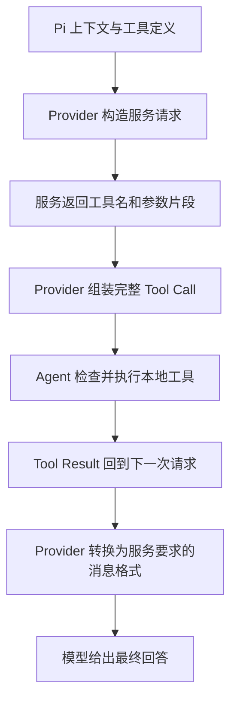

# 当配置不够用时，编写 Provider

小书架助手接到一条文字请求，Pi 需要把消息交给服务，再把服务返回的数据变成统一的回答和工具请求。如果服务的认证或数据格式不在现有支持范围内，这一段就由自定义 Provider 补上。

先理解这层翻译要保持哪些含义，再用只返回固定文字的脚本 Provider 观察公共接口。固定脚本隔离了网络与认证因素，但不等同于接入了真实推理服务。

## Provider 为什么不只是包一层 fetch？

`fetch` 负责取得 HTTP 响应，不知道哪一段是文字、哪一段是工具参数，也不知道服务结束是正常完成还是额度耗尽。Agent Loop 需要这些含义才能决定执行工具、继续请求或停止。

因此接入层做的不只是搬运字节，还要把服务的表达转换为 Pi 认识的协议事实。如果把网络断开当作正常结束，上层可能接受半个答案；如果工具参数还没收齐就返回 Tool Call，本地可能执行错误操作。

### 为什么要有统一消息和统一事件流？

不同服务可能使用不同字段名和事件名。若每个 Agent、界面和客户端都直接理解所有厂商格式，每接一家服务就要到处改代码。统一表示把变化集中在接入处：上层处理文字、思考、工具请求和终态，不必到处判断服务商。

统一不意味着抹平所有能力差异。模型支持什么仍由元数据和真实协议决定，缺失能力不能通过伪造事件补出来。适配器需要保留调用标识、内容类型、停止原因等决定后续行为的事实。

### 流为什么同时有增量和最终结果？

流式响应一边生成一边到达，用户无需等全部结束才看到进度。每个内容块可以经历开始、多个增量、块结束；一条回答又可以包含多个块，最后形成完整 Assistant Message。

`contentIndex` 区分同一消息里的内容块，Tool Call ID 关联工具申请与回执，两者不是同一种编号。`partial` 是当前累计消息的快照，`delta` 是这次新增内容；外部 JSON/RPC 输出还可能裁剪掉快照，不能把内部事件直接当外部协议照抄。

**SSE**可理解为服务通过 HTTP 持续发送事件，**WebSocket**则提供持续的双向连接。它们解决数据怎样传输，不决定消息是否成功；无论选哪种传输，接入层都要识别应用协议的终态。

### 工具调用为什么比普通文字多一段往返？

普通回答可以直接交给用户；工具请求必须先从服务数据恢复为完整名称、参数和 ID，再由 Agent 执行。本地结果随后又要转换成服务认识的工具回执，供下一次生成使用。

只测“你好”看不到这段往返。所以 Provider 的文本流通过，不足以证明编码任务可用；必须确认工具结果真的进入后续请求，而不只是出现在屏幕上。

### 谁来管理发现、注册和注销？

Provider 提供接入行为，Extension 是把它登记进 Pi 的一种装配方式，二者并不相等。同一个 Provider 也可以交给 SDK 使用，而不依赖终端里的扩展命令。

目录刷新更新“现在知道哪些模型”，注销移除某个注册来源，凭据删除改变身份来源，取消则影响活动工作。这几件事的时间和对象都不同，不能用“卸载了”一句话替代完整的生命周期解释。

## 1. Provider 承担哪几件事？

| 职责 | 具体问题 |
|---|---|
| 身份与目录 | 服务叫什么，有哪些模型，当前账号能用哪些 |
| 认证 | 本次请求的身份从哪里来，过期后怎样刷新 |
| 协议适配 | Pi 消息如何变成服务请求，服务数据如何变成 Pi 事件 |
| 终态 | 正常结束、长度耗尽、失败和取消怎样区分 |
| 用量 | 输入、输出、缓存与费用分别来自什么证据 |

当前 Pi `0.85.1` 支持用 `createProvider()` 组合完整 Provider，再交给扩展的 `pi.registerProvider(provider)`。它也保留旧式名称加配置的注册形式，但下面只使用完整对象。

## 2. 真实工具调用要经过完整的两段链路



Provider 负责翻译，不负责替 Agent 执行 `read`。参数可能跨多个网络片段到达；不能每收到一段 JSON 就执行工具。最终工具名、Call ID 和完整参数必须保持一致，后续结果要能对应原 Call ID。

真实适配器还必须支持文字、思考、工具调用等它声明支持的内容类型。本篇固定脚本没有工具能力，不能拿它证明真实模型会正确选工具。

## 3. 目录、身份与刷新分别处理

`getModels()` 提供当前目录；动态目录可用 `fetchModels()` 获取。`filterModels()` 根据当前凭据筛选可用模型，不等于远端最终授权。

启动时需要目录的扩展，应在异步工厂内完成有界发现后注册，不能拖到 `session_start` 才补上启动选模必需的数据。失败时报告明确原因，不默默换成别人的服务或身份。

动态刷新要遵守传入的取消信号和 `allowNetwork`。缓存可用于展示已知目录，但不能据此宣称服务在线。普通 `getModels()` 不应偷偷发网络请求。

OAuth 接入还要处理登录交互、过期时间和刷新令牌。认证存储负责串行修改，避免同时刷新导致轮换令牌互相覆盖；不要在模型请求回调里另存一份真实 Token。日志只保留脱敏错误类别和必要状态。

## 4. 结束、用量和溢出不能随意补值

| 情况 | 应表达的事实 |
|---|---|
| 服务明确正常完成 | `stop` |
| 需要本地工具继续 | `toolUse`，并给出完整 Tool Call |
| 输出预算耗尽 | `length`，不自动当作完整答案 |
| 取消 | `aborted`，清理流和监听器 |
| 网络或协议失败 | `error`，保留可判断的错误，不冒充正常 EOF |

每条流只能有一个终结事件。真实网络实现要把异常转成错误终态并关闭流，否则上层可能一直等结果。中途取消需传递到实际 I/O；本篇脚本只检查开始前的取消。

用量尽量采用服务报告，缺失不能伪造成精确测量。费用由用量和对应价格计算，缓存读写不能重复相加；本地估算须与服务账单区分。

上下文溢出则要让 Pi 识别为容量问题，才可能进入压缩和重试。`contextWindow` 是模型上限，`reserveTokens` 是应用为后续内容保留的空间，单次输出 `maxTokens` 还可能被适配器夹紧。修改数字不是无限容量；压缩会产生新请求，也可能失败。

## 5. 注销、重载与永久下线

`pi.unregisterProvider("book-script")` 移除本次动态注册，不等于删除认证、卸载扩展或取消所有活动请求。同名内置 Provider 若曾被覆盖，注销后还可能恢复内置定义。

扩展仍在发现路径里时，`/reload` 或下次启动会再次执行工厂并注册。永久下线需要停止使用该模型、结束相关任务、移除注册来源并重载或重启；认证是否删除由单独的凭据管理动作决定。

替换 Provider 后，已有会话里选中的模型对象可能仍是旧状态。重新选择并核对 Provider 与 Model ID，再发下一次任务；不要假定注销已切断一切能力。

## 6. 准备一个明确不联网的例子

在独立练习目录准备 ESM 项目。需要 Node.js `>=22.19.0` 和以下依赖；安装会访问软件源，先审查和授权，再执行：

```bash
npm init -y
npm install --ignore-scripts --save-exact @earendil-works/pi-ai@0.85.1 @earendil-works/pi-coding-agent@0.85.1
```

不要修改本仓库旧 Lab 的锁文件来迁就教程。使用 `.mjs` 文件即可运行 ESM，不要求额外 TypeScript 编译器。

创建 `book-provider.mjs`：

```javascript
import {
  createAssistantMessageEventStream,
  createProvider,
} from "@earendil-works/pi-ai";

export const bookModel = {
  id: "fixed-answer",
  name: "Book Script Model",
  provider: "book-script",
  api: "book-script-api",
  baseUrl: "https://example.invalid",
  reasoning: false,
  input: ["text"],
  cost: { input: 0, output: 0, cacheRead: 0, cacheWrite: 0 },
  contextWindow: 8192,
  maxTokens: 1024,
};

function streamAnswer(model, _context, options = {}) {
  const stream = createAssistantMessageEventStream();
  queueMicrotask(() => {
    const message = {
      role: "assistant",
      api: model.api,
      provider: model.provider,
      model: model.id,
      content: [],
      usage: {
        input: 0, output: 0, cacheRead: 0, cacheWrite: 0, totalTokens: 0,
        cost: { input: 0, output: 0, cacheRead: 0, cacheWrite: 0, total: 0 },
      },
      stopReason: "stop",
      timestamp: Date.now(),
    };
    if (options.signal?.aborted) {
      message.stopReason = "aborted";
      message.errorMessage = "Script request cancelled";
      stream.push({ type: "error", reason: "aborted", error: message });
      stream.end();
      return;
    }
    stream.push({ type: "start", partial: structuredClone(message) });
    message.content.push({ type: "text", text: "" });
    stream.push({ type: "text_start", contentIndex: 0, partial: structuredClone(message) });
    message.content[0].text = "BOOK_SCRIPT_OK";
    stream.push({ type: "text_delta", contentIndex: 0, delta: "BOOK_SCRIPT_OK", partial: structuredClone(message) });
    stream.push({ type: "text_end", contentIndex: 0, content: "BOOK_SCRIPT_OK", partial: structuredClone(message) });
    stream.push({ type: "done", reason: "stop", message });
    stream.end();
  });
  return stream;
}

export const bookProvider = createProvider({
  id: "book-script",
  name: "Book Script Provider",
  auth: {
    apiKey: {
      name: "No credential: local script only",
      async resolve() {
        return { auth: {}, source: "in-memory script" };
      },
    },
  },
  models: [bookModel],
  api: { stream: streamAnswer, streamSimple: streamAnswer },
});

export default function register(pi) {
  pi.registerProvider(bookProvider);
}
```

这里没有 `fetch`、SDK 网络请求、文件读取或认证查找。域名不参与执行，返回内容完全由脚本决定；零 Token 和零费用也只是这个夹具的元数据。

即使没有 Key，Provider 仍要声明认证语义。这里的 `resolve()` 明确返回“这个内存脚本已经可用”，不借用真实认证，也不伪造一把 Key。

## 7. 先直接消费流，不经过 Agent

创建 `check-provider.mjs`：

```javascript
import assert from "node:assert/strict";
import { bookModel, bookProvider } from "./book-provider.mjs";

const stream = bookProvider.streamSimple(bookModel, { messages: [] });
const types = [];
for await (const event of stream) types.push(event.type);
const result = await stream.result();
assert.deepEqual(types, ["start", "text_start", "text_delta", "text_end", "done"]);
assert.equal(result.stopReason, "stop");
assert.equal(result.content[0].text, "BOOK_SCRIPT_OK");

const controller = new AbortController();
controller.abort();
const cancelled = bookProvider.streamSimple(bookModel, { messages: [] }, {
  signal: controller.signal,
});
const cancellation = await cancelled.result();
assert.equal(cancellation.stopReason, "aborted");
console.log("PROVIDER_SCRIPT_OK");
```

```bash
node check-provider.mjs
```

预期为 `PROVIDER_SCRIPT_OK`。第一组证明文本事件能形成最终消息，第二组证明开始前取消不会被标成成功。它们没有测试网络中断、长流取消或工具调用。

## 8. 一分钟回忆

> **配置描述已有协议，Provider 实现新的接入行为；注册、目录、认证、流式结果和真实调用是五层不同证据。**

上一篇：[自定义模型配置](20-自定义模型配置.md)。下一篇：[使用SDK提交与控制任务](22-使用SDK提交与控制任务.md)。
