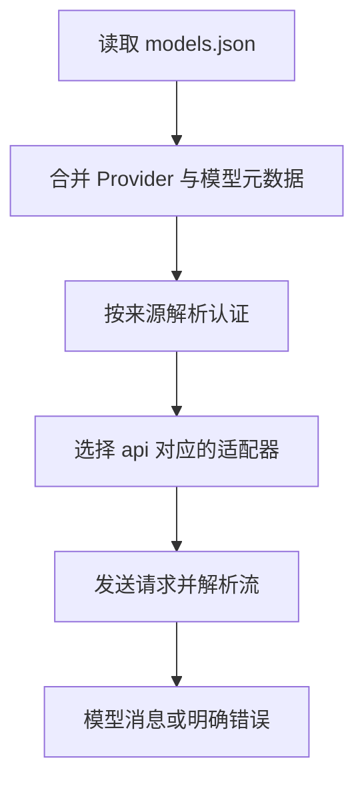

# 21 自定义模型配置

## 用 models.json 接入受支持的协议

你拿到了一个模型服务的地址、模型 ID 和认证说明。它支持 Pi 已有的 Chat Completions 协议，但在 `/model` 中找不到。可以通过 `models.json` 告诉 Pi 怎样访问这个服务，并把它的模型加入目录。

## models.json 怎样告诉 Pi 访问哪个服务？

一条模型配置告诉 Pi：模型叫什么、通过哪个地址访问、使用哪种协议，以及支持哪些输入和多大的上下文。Pi 据此准备请求，再交给服务端模型生成回答。

因此把 `contextWindow` 写大不会使服务获得更大窗口，把 `reasoning` 改成 `true` 也不会给普通模型增加推理能力。错误元数据反而会让 Pi 错估容量或发送服务不接受的参数。

### 哪些字段是在寻址，哪些字段是在描述能力？

Provider ID 是 Pi 用来组织接入与身份来源的标识；模型 `id` 是服务识别的模型或部署名称；`name` 更偏向人类阅读与匹配；`baseUrl` 指向服务地址。它们并不是四种随便互换的展示名称。

`api` 则选择协议适配器。地址相同而协议选错，仍可能构造错误路径、角色和工具字段。`input`、`reasoning`、容量和价格描述能力或计量信息，供 Pi 选择选项、准备材料和展示用量。

### 什么时候改配置就够了？

如果服务已经接受某个现有适配器的请求格式，只缺地址和模型记录，配置就能表达所需差异。如果服务需要新的登录过程，或者把工具请求编码为适配器不认识的流，就需要接入代码，单靠换字段名无法补齐。

“兼容某协议”也有范围。文字回复可能兼容，工具调用 ID、流式用量或结束原因却不同。`compat` 用来描述已确认的具体差异，不是越多越安全的开关集合。

### 为什么先验证模型目录，再验证真实请求？

JSON 合法只证明能解析文本；模型进入目录说明配置能参与合并；认证解析成功说明找到了身份；完整请求成功才说明服务接受了这次使用。分层检查能把错误限制在更小范围，避免用付费请求反复试探普通文件问题。

下面先解释请求路径与覆盖语义，再给完整虚构配置。读配置时把每个字段对应到它负责的事实，而不是整份复制后期待它自动探测远端能力。

## 1. 开始前先拿到这些事实

需要确认服务地址、协议类型、真实模型 ID、认证方式、工具调用支持、上下文容量和最大输出。模型展示名称不能代替 API 接收的 ID。

本篇配置使用虚构域名 `example.invalid`，不能用于真实请求；它用于理解结构和做离线验证。接入真实服务前再替换已经确认的字段，不在文档里保存真实 Key。

## 2. 协议名决定请求怎么构造

| `api` | 对应的协议族 |
|---|---|
| `openai-completions` | Chat Completions |
| `openai-responses` | Responses |
| `anthropic-messages` | Anthropic Messages |
| `google-generative-ai` | Google Generative AI |

`api` 会影响请求地址后缀、消息角色、工具字段和流式响应的解析方式。服务支持 Chat Completions 时，应选择对应适配器；改成 Responses 会让 Pi 按另一套协议发送请求，服务可能无法处理。

## 3. 从配置到一次调用



当前版本打开 `/model` 时会重新加载模型配置。模型成功进入目录，只完成图中的前半部分，不应紧接着宣称接入成功。

默认的 Provider、上下文文件和资源仍可能影响任务。做真实验证时，需要分别固定模型选择、工具范围、输入材料、重试和调用预算。

把后文的虚构配置提前代入：选择 `book-demo/book-model` 时，Pi 用前半段找到接入定义，用后半段标识服务模型。`api=openai-completions` 决定使用 Chat Completions 的编码与流解析；`baseUrl` 提供服务地址；`apiKey` 提供取值说明。接入层再把当前消息、工具 Schema 和输出限制组织成请求。

若模型没有出现在列表，先查 JSON/字段、组合诊断及认证存在性。若已出现却在发送前报缺失变量，查认证解析；若服务返回 404，查地址、协议路径和模型 ID；若开始有文字但工具参数解析失败，再查流协议。这样每一类症状都有对应的环节，不必先反复更换模型。

## 4. 覆盖已有模型，不必抄整份目录

仅修改内置 Provider 的地址或 Header 时，可以保留内置模型。仅调整某个已知模型的容量或兼容字段时，使用 `modelOverrides`。

注意两种不同语义：

| 操作 | 模型列表怎样变化 |
|---|---|
| `models.json` 中提供 `models` | 按同 Provider 的模型 ID 增加或替换，保留其他内置模型 |
| 扩展旧式配置 `registerProvider(name, { models })` | 替换该注册来源的模型列表 |

检查已有扩展时，要按它采用的注册方式判断覆盖范围。未知 `modelOverrides` ID 可能被忽略，保存配置后还需确认目标模型的字段是否实际改变。

当前列表和底部主要显示模型 ID；`name` 用于匹配和次级说明，不应据此判断 API 已改用另一个模型。

例如内置模型原来有准确的容量、价格和推理配置，你只想调整窗口，应使用针对它的 `modelOverrides`。若在 `models` 里用同一 ID 重新定义一条极简模型，未填写的字段可能采用自定义模型默认值，不能假定都从原条目继承。填零价格与省略价格都不是服务免费证据。需要复现时显式写出已经确认的关键元数据，并查看组合后的实际模型。

## 5. 兼容字段只按证据添加

有的兼容服务不认识 `developer` 角色，或者不支持流式用量字段。此时可以针对已确认的差异配置 `compat`：

```json
{
  "supportsDeveloperRole": false,
  "supportsReasoningEffort": false
}
```

这只是可放入 `compat` 的片段，只有服务确实拒绝这些字段时才使用，不需要照抄成所有模型的默认配置。

常见差异还包括 `max_tokens` 与 `max_completion_tokens`、工具结果是否要带名称，以及流是否提供结束原因。只有协议明确允许以流关闭表示正常完成，并且适配器启用了相应支持时，才能这样处理；其他情况下，缺少结束原因的 EOF 不能直接算成功。

推理档位映射使用模型级 `thinkingLevelMap`；`null` 表示该档不支持。不要为了显示最高档就声称服务支持它。

## 6. 一份完整模型配置

在专用 Agent 目录创建 `models.json`，不覆盖现有用户文件：

```json
{
  "providers": {
    "book-demo": {
      "baseUrl": "https://model.example.invalid/v1",
      "api": "openai-completions",
      "apiKey": "$BOOK_DEMO_API_KEY",
      "models": [
        {
          "id": "book-model",
          "name": "小书架练习模型",
          "reasoning": false,
          "input": ["text"],
          "contextWindow": 8192,
          "maxTokens": 1024,
          "cost": { "input": 0, "output": 0, "cacheRead": 0, "cacheWrite": 0 }
        }
      ]
    }
  }
}
```

默认位置是 `~/.pi/agent/models.json`，不应凭经验把它放进项目 `.pi` 就假定会加载。专用目录可通过 `PI_CODING_AGENT_DIR` 指定。

这里的零价格、8192 和 1024 都是虚构练习值。接入真实服务时，应填写已确认的价格、上下文容量和输出限制。

## 7. 怎样做分层验证？

先做无需请求的检查：JSON 解析、字段类型、环境引用格式、模型目录合并和选中 ID。虚构域名用来确保例子不会意外访问真实服务。

实际接入后，再单独授权以下最小任务，每次都记录输入和预期，不自动全跑：

1. 无工具文本请求正常结束。
2. 一次固定只读工具调用，工具结果被后续回答使用。
3. 一个明确错误被报告，而不是伪造成功。
4. 取消和超时是否停止本地等待并完成清理。
5. 用量是否来自服务实际报告，且费用元数据合理。

普通回复正常不证明工具支持；工具支持不证明图片、长上下文或流中取消正确。

本篇按 Pi `0.85.1` 核对，虚构地址不提供真实推理服务。特殊认证和非标准协议放在下一篇处理。

上一篇：[模型接入与认证](20-模型接入与认证.md)。下一篇：[自定义服务商扩展](22-自定义服务商扩展.md)。
