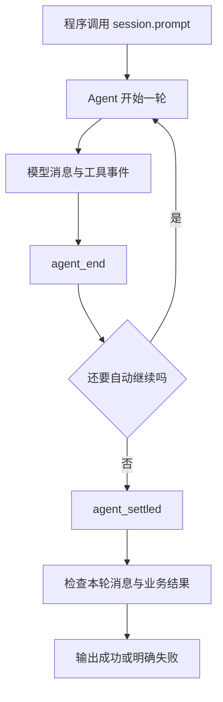

# 用 SDK 把 Pi 放进自己的程序

终端里的一次请求，原来由 Pi 接收输入并展示结果。现在由你的 Node.js 程序负责输入和输出，Pi 继续负责模型、工具循环和会话。这就是 SDK 的用途，不需要模拟键盘，也不需要解析终端颜色。

## 1. 先分清五个对象

| 对象 | 负责什么 |
|---|---|
| `ModelRuntime` | 模型目录、认证和请求分发 |
| `ResourceLoader` | 加载所需扩展、Skill、模板、主题与上下文 |
| `SettingsManager` | 运行设置，如重试和压缩 |
| `SessionManager` | 会话记录、活动分支和持久化 |
| `AgentSession` | 对外提交任务、订阅事件、控制运行和协调以上对象 |

最短的 `createAgentSession()` 会采用默认认证、设置、工具、资源发现和磁盘 Session。它适合接受这些默认行为的应用，不适合直接当作隔离测试。

## 2. 用上一篇的脚本完成第一个任务

沿用独立练习目录、Pi `0.85.1` 依赖和 `book-provider.mjs`。本次唯一问题是：真实 SDK 会话能否使用内存 Provider，产生结果并收尾？不接真实服务，不开放工具，不保存磁盘 Session。

创建 `sdk-demo.mjs`：

```javascript
import assert from "node:assert/strict";
import { mkdtemp, rm } from "node:fs/promises";
import { tmpdir } from "node:os";
import { join } from "node:path";
import { InMemoryCredentialStore, InMemoryModelsStore } from "@earendil-works/pi-ai";
import {
  createAgentSession,
  DefaultResourceLoader,
  ModelRuntime,
  SessionManager,
  SettingsManager,
} from "@earendil-works/pi-coding-agent";
import { bookModel, bookProvider } from "./book-provider.mjs";

const root = await mkdtemp(join(tmpdir(), "book-sdk-"));
let session;
let unsubscribe;
try {
  const settings = SettingsManager.inMemory({
    retry: { enabled: false, provider: { maxRetries: 0 } },
    compaction: { enabled: false },
  });
  assert.equal(settings.getProviderRetrySettings().maxRetries, 0);
  const runtime = await ModelRuntime.create({
    credentials: new InMemoryCredentialStore(),
    modelsStore: new InMemoryModelsStore(),
    modelsPath: null,
    refreshOnCreate: false,
    allowModelNetwork: false,
  });
  runtime.registerNativeProvider(bookProvider);
  const loader = new DefaultResourceLoader({
    cwd: root,
    agentDir: join(root, "agent"),
    settingsManager: settings,
    noExtensions: true,
    noSkills: true,
    noPromptTemplates: true,
    noThemes: true,
    noContextFiles: true,
    systemPrompt: "Return the script response.",
    appendSystemPrompt: [],
  });
  await loader.reload();
  ({ session } = await createAgentSession({
    cwd: root,
    agentDir: join(root, "agent"),
    modelRuntime: runtime,
    model: bookModel,
    thinkingLevel: "off",
    tools: [],
    resourceLoader: loader,
    settingsManager: settings,
    sessionManager: SessionManager.inMemory(root),
  }));
  const events = [];
  unsubscribe = session.subscribe((event) => {
    events.push(event.type);
  });
  await session.prompt("Check the book script.");
  const assistant = session.state.messages.findLast((message) => message.role === "assistant");
  assert.ok(events.includes("agent_settled"));
  assert.equal(assistant?.stopReason, "stop");
  assert.equal(assistant.content[0].text, "BOOK_SCRIPT_OK");
  assert.deepEqual(session.getActiveToolNames(), []);
  console.log("SDK_SCRIPT_OK");
} finally {
  unsubscribe?.();
  session?.dispose();
  await rm(root, { recursive: true, force: true });
}
```

```bash
node sdk-demo.mjs
```

预期输出 `SDK_SCRIPT_OK`。这证明真实 SDK 与脚本 Provider 的一轮主线，不证明任何远端服务、真实认证或模型推理质量。临时目录只由本例创建并删除，不触碰已有目录。

内存凭据防止默认认证文件读取，内存目录缓存避免默认磁盘缓存，显式 `model` 避免选到别的模型。`noContextFiles` 只针对 Context File，所以还明确设置系统提示和空的追加提示列表。

`allowModelNetwork: false` 限制的是模型目录刷新，不是系统禁网。这个示例不联网的依据是实际选中的脚本没有网络 I/O；进程仍拥有当前用户的系统权限。

## 3. 事件和任务结果不是同一层



订阅返回取消订阅函数，应在清理时调用。文字增量可从 `message_update` 中的 `assistantMessageEvent.type === "text_delta"` 获取；它适合即时显示，不适合独自决定成功。

`agent_end` 可能之后接自动重试、压缩继续或待处理消息；`agent_settled` 表示没有后续自动工作，不表示任务正确。最终还要检查本轮消息的 `stopReason`、工具失败和自己的验收条件。

若一个 Session 连续跑多个任务，不能直接拿“历史最后一个成功回答”作为本次成功。记录提交前的消息边界或本轮标识，并且只接受本轮新增结果。上面的演示从空 Session 开始，所以不存在旧答案混入。

## 4. 从无工具扩展到只读任务

当前 API 的 `tools` 是名称允许列表，例如 `tools: ["read"]`，不是 Tool 对象数组。`tools: []` 明确不开放任何工具；省略则允许默认选择。

只开放 `read` 还不等于只能读练习文件。真正的任务合同需要在可信执行边界校验路径，再让内置 Executor 打开目标。路径策略和同用户文件替换竞态在[任务台](25-构建任务台与异常测试.md)继续讲。

自定义工具通过 `customTools` 注册；注册和启用是两件事。资源加载器也可以显式提供扩展工厂，但不能为了一个工具无意恢复所有本机资源。

## 5. 取消、追加与重试

| API 或设置 | 使用时机 | 不保证什么 |
|---|---|---|
| `await session.abort()` | 请求取消并等待当前 Agent 运行停止 | 不回滚副作用，不保证远端停止计费 |
| `session.steer(text)` | 运行中调整后续方向 | 不抢占已经执行的工具 |
| `session.followUp(text)` | 当前工作之后追加一条请求 | 不等于立即开始另一个并发 Run |
| `prompt(text, { streamingBehavior: "steer" })` | 运行中明确选择改向行为 | 不代表原任务已结束 |
| `retry.enabled` | Agent 层可重试错误 | 不涵盖所有工具失败 |
| `retry.provider.maxRetries` | Provider 请求层重试 | 不是整个任务的总次数上限 |

运行中直接 `prompt()` 而不指定队列行为可能被拒绝。应用应明确选择“拒绝忙时提交”“改向”或“排队”，不要碰巧依靠 UI 输入速度。

长任务的超时也需要应用自己定义：到期先 `abort()`，等待活动 Promise 收尾，然后解除订阅和释放 Session；若依赖不响应，再由进程级期限处理。只调用 `dispose()` 不是等待所有工作结束的替代品。

## 6. 压缩、保存和恢复

`await session.compact(instructions)` 会生成摘要，真实模型模式下可能调用服务。它不是纯本地整理，也不是删除磁盘旧历史。恢复时用 `SessionManager.open(...)` 或 `continueRecent(...)` 显式选定记录，再交给新会话。

`SessionManager.inMemory()` 不保存会话文件；`SessionManager.create(cwd, sessionDir)` 创建持久会话。持久化前要设计私有目录、单写者、损坏文件处理和输出脱敏，而不是简单换一个构造函数就宣称生产可用。

会话记录可能包含 Prompt、工具结果和回答。程序日志不要直接打印 `session.state` 或原始异常；显示固定状态和必要诊断，内容输出由独立合同控制。

## 7. 一分钟回忆

> **SDK 让你的程序控制输入输出，AgentSession 协调任务；显式选择依赖、只认本轮结果、取消后等待、最后释放资源。**

上一篇：[自定义服务商扩展](21-自定义服务商扩展.md)。下一篇：[RPC协议与Java客户端](23-RPC协议与Java客户端.md)。
