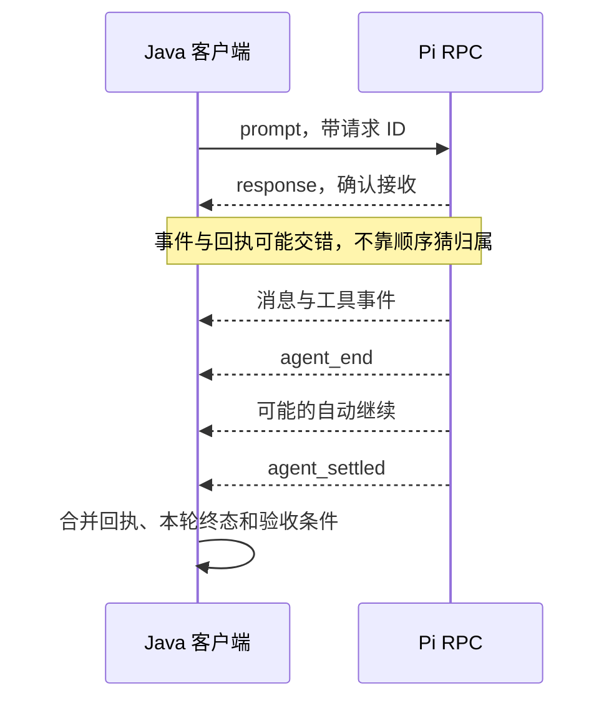

# 用 RPC 让 Java 程序控制 Pi

你的应用不是 Node.js，仍想复用 Pi。可以让 Java 启动一个长期运行的 Pi 子进程：Java 写入 JSON 命令，Pi 返回 JSON 响应和事件。两边不共享对象，通过管道交换数据。

## 1. 三条管道各有用途

| 管道 | 方向 | 内容 |
|---|---|---|
| stdin | Java 到 Pi | Command 和扩展 UI 回答 |
| stdout | Pi 到 Java | Response、Agent Event、扩展 UI 请求 |
| stderr | Pi 到 Java | 独立诊断，不混入 JSON 协议 |

入口是 `pi --mode rpc`。它不显示本机交互编辑器；Java 必须持续消费输出，并处理超时、EOF 和退出。不要设置 `redirectErrorStream(true)`，否则普通错误文字可能破坏 JSON 流。

进程参数不自动限制工具。真实入口仍要显式指定模型、工具、资源和会话策略；启动成功也不代表已授权提交真实模型请求。

## 2. 一条记录只能由 LF 分隔

每个 JSON 对象序列化后追加 `\n` 并 flush。读取时只按 LF 分帧，可去掉 LF 前的单个 `\r`，从而接受 CRLF。

不能按网络块或 `read()` 返回次数切 JSON：一个对象可能被拆成多块，一块也可能包含多个对象。UTF-8 多字节字符也可能跨块，需要增量解码。

字符串中的 `U+2028`、`U+2029` 是合法数据，不是协议换行。不要用把所有 Unicode 行分隔符都当换行的通用拆行函数。

EOF 前没有 LF 的尾巴要制定明确策略。现有 Java Lab 接受可解析的最后一条尾记录；第 07 篇的一次性结果解析器则要求完整 LF。两者是不同的客户端合同，不能混写成 Pi 保证“半条消息也成功”。截断 JSON 必须失败。

## 3. 先区分回执与运行结果

Java 发出的命令：

```json
{"id":"book-1","type":"prompt","message":"只回复 BOOK_OK"}
```

Pi 的接收回执：

```json
{"id":"book-1","type":"response","command":"prompt","success":true}
```

`success: true` 仅表示已接受、排队或立即处理。普通模型任务仍会继续流出事件；接受后失败通常不会再给同一 ID 发送第二份失败 Response。



普通 Response 可以通过 `id` 关联并发命令。普通 Agent Event 通常没有请求 ID，因此本教程的客户端同一时间只允许一个活动 Prompt，不把两个任务的文字增量混在一起。

工具事件使用 `toolCallId` 关联。直接 RPC `bash` 的 `bash_execution_update` 可以带原命令 ID，这是特定事件的支持，不应推断所有事件都有 ID。

## 4. 四种结果比一个布尔值准确

| 结果 | 必要事实 |
|---|---|
| 成功 | 已接受、已 settled、本轮最终 Assistant 正常结束，且满足业务条件 |
| 接收前拒绝 | 对应 Response 为 `success: false` |
| 接收后失败 | 已接受，但最终消息错误、取消、截断或不满足合同 |
| 提前退出 | 运行尚未闭合，子进程就结束或协议流异常 |

事件可能先于客户端处理回执到达，所以状态机要能先保存事件事实，再合并 accepted 状态。不要在看到 `agent_settled` 时丢弃还没读到的回执，也不要把 `agent_end` 当成完成。

当前 JSON 事件不携带每次更新的累计消息快照。文字按 `contentIndex` 组装增量，最终以 `message_end.message` 为准；历史上读取 `assistantMessageEvent.partial` 的代码需要按实际版本核对。

## 5. 看现有 Java 客户端怎样分工

仓库现有案例使用 Java 8、Jackson 和 JUnit 5，不是 Spring Boot 服务：

| 文件 | 读代码时关注什么 |
|---|---|
| [PiRpcClient.java](../../labs/7.4-rpc-java/src/main/java/com/xiexu/pistudy/rpc/PiRpcClient.java) | ProcessBuilder、Response Map、单活动 Prompt、三个 I/O 工作和 close |
| [StrictJsonlReader.java](../../labs/7.4-rpc-java/src/main/java/com/xiexu/pistudy/rpc/StrictJsonlReader.java) | 增量读取、LF 分帧、单条上限和尾记录 |
| [PromptRunResult.java](../../labs/7.4-rpc-java/src/main/java/com/xiexu/pistudy/rpc/PromptRunResult.java) | accepted、settled、最终状态与进程退出的不同含义 |

调用流程从 `start()` 开始：分别读 stdout、消费 stderr、观察进程退出。`sendCommand()` 先登记 ID 到 Future，再写入 JSON；写入失败要移除等待项。`runPrompt()` 先取得单任务占用，再同时等待回执和事件终态。

写端需要串行化一整条记录，避免两线程把 JSON 字符交错。退出时应让仍在等待的 Future 明确失败，不能遗留永远 pending 的调用。等待超时也不等于远端任务已经取消，调用方必须进入取消或关闭链。

这里阅读的是已有实现的职责，不保证它具备所有生产合同。例如尾记录接受策略、解码错误处理、超时后的活动任务和更多协议负例，都要按自己的应用要求再审查。

## 6. 先运行假的子进程

从本仓库根目录执行；需要可用 JDK、Maven 和已经缓存的依赖：

```bash
java -version
mvn -version
mvn -o -B -f labs/7.4-rpc-java/pom.xml test
```

测试启动的是 `FakeRpcServerMain`，不是 Pi，不使用真实认证。预期覆盖：LF/CRLF/Unicode 分隔符保留、逆序 Response ID、accepted 后 settled 成功、接收前拒绝、接收后错误、提前退出和正常关闭。

`-o` 是 Maven 离线模式；缺缓存就停止，另行确认安装，不把失败改写为“网络问题无需处理”。测试只证明这些固定协议场景，不证明真实 Provider、任意 Pi 版本或多 Prompt 并发。

## 7. 取消和退出分开做

`abort` 等待当前操作停止后响应，但队列中剩余内容可能继续执行。若要模拟交互界面的“停止并取回排队草稿”，先发 `clear_queue` 保存返回文本，再发 `abort`。

直接 Shell 命令使用 `abort_bash`。终止 Pi 进程则还要关闭 stdin、等待子进程退出、排空输出、关闭流和线程池；超过 grace 才升级终止。不能用“发送 abort 成功”代替所有资源已释放。

收到 stdout EOF 时，结合进程退出码和当前任务状态判断。退出码 `0` 也可能发生在尚未获得完整业务结果时；反过来，最后已生成答案也不代表清理失败可以忽略。

## 8. 扩展 UI 是另一组请求

RPC 中 `ctx.hasUI === true`，因为 Pi 能发 `extension_ui_request`，让客户端显示确认框。它不是本机 TUI；`ctx.mode === "rpc"`，自定义终端组件不在这里运行。

选择、确认、输入、编辑属于需要回答的对话，客户端按 UI 请求 ID 回 `extension_ui_response`。通知和状态更新通常不需要回答。

若客户端不支持危险操作审批，应明确拒绝或取消，不静默批准，也不让请求无限等待。TUI 内置 `/settings` 等命令不是任意 RPC Prompt 都能调用的服务接口，使用相应协议命令。

## 9. 一分钟回忆

> **RPC 是长期进程加 JSONL 协议；ID 管回执，单任务状态机管事件，accepted、settled 和退出必须分别判断。**

上一篇：[使用SDK提交与控制任务](22-使用SDK提交与控制任务.md)。下一篇：[终端组件与界面刷新](24-终端组件与界面刷新.md)。
